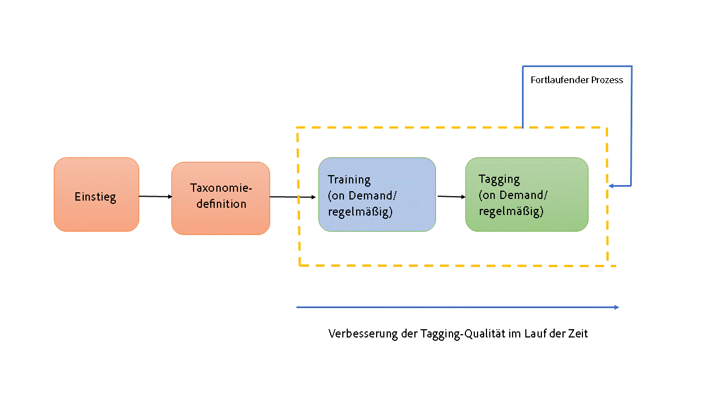
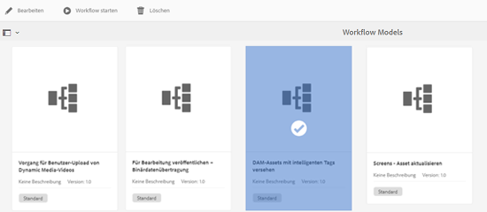
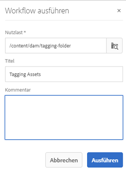
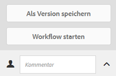

# Smart-Tags verstehen, anwenden und kuratieren {#enhanced-smart-tags}

Organisationen, die mit digitalen Assets arbeiten, verwenden zunehmend taxonomiegesteuertes Vokabular in Asset-Metadaten. Im Grunde umfasst dieses eine Liste von Schlüsselbegriffen, die Mitarbeiter, Partner und Kunden häufig verwenden, um sich auf digitale Assets einer bestimmten Klasse zu beziehen und nach diesen zu suchen. Das Tagging von Assets mit einem taxonomiegesteuerten Vokabular stellt sicher, dass Assets leicht identifiziert und abgerufen werden können.

Verglichen mit dem Vokabular natürlicher Sprachen hilft das Tagging digitaler Assets anhand einer Geschäftstaxonomie dabei, sie am Geschäft eines Unternehmens auszurichten, und stellt dabei sicher, dass nur die relevantesten Assets bei der Suche angezeigt werden.

So könnte beispielsweise ein Automobilhersteller Bilder von Autos mit Tags versehen, die die Modellnamen darstellen, sodass nur relevante Bilder angezeigt werden, wenn für das Erstellen einer Werbekampagne nach verschiedenen Modellen gesucht wird.

Damit der Smart Content Service die richtigen Tags anwendet, trainieren Sie ihn, um Ihre Taxonomie zu erkennen. Um den Dienst zu trainieren, müssen Sie zunächst einen Satz von Assets sowie Tags kuratieren, die diese Assets bestmöglich beschreiben. Wenden Sie diese Tags auf die Assets an und führen Sie einen Trainings-Workflow aus, um den Service kennenzulernen.

Sobald ein Tag trainiert wurde und bereit ist, kann der Dienst dieses Tag über einen Tagging-Workflow auf Assets anwenden.

Im Hintergrund verwendet der Smart Content Service das Adobe Sensei AI-Framework, um seinen Bilderkennungsalgorithmus auf Ihre Tag-Struktur und Ihre Unternehmenstaxonomie zu trainieren. Diese Content-Intelligenz wird dann verwendet, um relevante Tags auf einen anderen Satz von Assets anzuwenden.

Smart Content Service ist ein Cloud-Service, der auf [!DNL Adobe Developer Console] gehostet wird. Um sie in [!DNL Adobe Experience Manager] zu verwenden, muss der Systemadministrator Ihre [!DNL Experience Manager] -Implementierung mit [!DNL Adobe Developer Console] integrieren.

Die wichtigsten Schritte beim Verwenden des Smart Content Service sind:

* Einstieg
* Überprüfung von Assets und Tags (Taxonomiedefinition)
* Training des Smart Content Service
* Automatisches Tagging

## Voraussetzungen und unterstützte Formate {#prerequisites}

Bevor Sie den Smart Content Service verwenden können, stellen Sie Folgendes sicher, um eine Integration in [!DNL Adobe Developer Console] zu erstellen:

* Ein Adobe ID-Konto mit Administratorrechten für das Unternehmen.
* Aktivieren Sie den Smart Content Service-Dienst für Ihre Organisation.
* Um das Smart Content Services-Basispaket zu einer Bereitstellung hinzuzufügen, lizenzieren Sie [!DNL Adobe Experience Manager Sites] Basispaket und [!DNL Assets] Add-on.

Der Dienst wendet Smart-Tags auf Assets der folgenden MIME-Typen an:

* image/jpeg
* image/tiff
* image/png
* image/bmp
* image/gif
* image/pjpeg
* image/x-portable-anymap
* image/x-portable-bitmap
* image/x-portable-graymap
* image/x-portable-pixmap
* image/x-rgb
* image/x-xbitmap
* image/x-xpixmap
* image/x-icon
* image/photoshop
* image/x-photoshop
* image/psd
* image/vnd.adobe.photoshop

Der Dienst wendet Smart-Tags auf Asset-Ausgabedarstellungen der folgenden MIME-Typen an:

* image/jpeg
* image/pjpeg
* image/png

## Einstieg {#onboarding}

Der Smart Content Service kann als Add-on zu [!DNL Experience Manager] erworben werden. Nach dem Kauf wird eine E-Mail an den Administrator Ihres Unternehmens mit einem Link zu [!DNL Adobe I/O] gesendet.

Der Administrator kann dem Link folgen, um den Smart Content Service mit [!DNL Experience Manager] zu integrieren. Informationen zur Integration des Dienstes mit [!DNL Experience Manager Assets] finden Sie unter [Konfigurieren von Smart-Tags](config-smart-tagging.md).

Der Onboarding-Prozess ist abgeschlossen, wenn der Administrator den Dienst konfiguriert und Benutzer in [!DNL Experience Manager] hinzufügt.

>[!NOTE]
>
>Wenn Sie [!DNL Experience Manager] 6.3 oder eine frühere Version verwenden und einen Tagging-Dienst für Ihre Assets benötigen, finden Sie weitere Informationen unter [Smart-Tags](https://helpx.adobe.com/experience-manager/6-3/assets/using/touch-ui-smart-tags.html). Smart-Tags verwenden nicht die neuesten KI-Funktionen und sind daher weniger präzise als der erweiterte Smart-Tagging-Dienst.

## Überprüfen von Assets und Tags {#reviewing-assets-and-tags}

Nachdem Sie sich an Bord befinden, sollten Sie zunächst eine Reihe von Tags identifizieren, die diese Bilder am besten im Kontext Ihres Unternehmens beschreiben.

Stellen Sie dann einen Satz mit Bildern zusammen, die Ihr Produkt bestmöglich für eine bestimmte Geschäftsanforderung darstellen. Stellen Sie sicher, dass die Assets in Ihrem Satz den [Richtlinien für das Trainieren des Smart Content Service](/help/assets/config-smart-tagging.md#training-the-smart-content-service) entsprechen.

Fügen Sie die Assets einem Ordner hinzu und wenden Sie die Tags über die Eigenschaftsseite auf die einzelnen Assets an. Führen Sie anschließend den Trainings-Workflow für diesen Ordner aus. Mit dem Asset-Satz kann der Smart Content Service mithilfe Ihrer Taxonomiedefinitionen mehr Assets effektiv trainieren.

>[!NOTE]
>
>1. Das Training ist ein unwiderruflicher Vorgang. Adobe empfiehlt Ihnen, die Tags im Asset-Satz zu überprüfen, bevor Sie den Smart Content Service mit den Tags trainieren.
>1. Bevor Sie ein Tag trainieren, lesen Sie [Trainings-Richtlinien für Smart Content Service](/help/assets/config-smart-tagging.md#training-the-smart-content-service).
>1. Adobe empfiehlt Ihnen, mindestens zwei unterschiedliche Tags zu verwenden, wenn Sie den Smart Content Service zum ersten Mal trainieren.

## [!DNL Experience Manager] Suchergebnisse mit Smart-Tags verstehen {#understandsearch}

Standardmäßig kombiniert die [!DNL Experience Manager]-Suche die Suchbegriffe mit einer `AND`-Klausel. Dieses Standardverhalten ändert sich durch die Verwendung von Smart-Tags nicht. Durch die Verwendung von Smart-Tags wird eine zusätzliche `OR`-Klausel hinzugefügt, mit der Suchbegriffe gefunden werden können, die mit den Smart-Tags in Verbindung stehen. Suchen Sie beispielsweise nach `woman running`. Assets, die in den Metadaten nur das Keyword `woman`oder `running` aufweisen, werden standardmäßig nicht in den Suchergebnissen angezeigt. Ein Asset, das über Smart-Tags mit `woman` oder `running` getaggt wurde, wird bei dieser Suchanfrage jedoch angezeigt. Die Suchergebnisse sind also eine Kombination aus

* Assets mit `woman`- und `running`-Schlüsselwörtern in den Metadaten.

* Assets, die mit einem der Keywords getaggt wurden.

Die Suchergebnisse, die in Metadatenfeldern alle Suchbegriffe aufweisen, werden zuerst angezeigt. Danach folgen die Suchergebnisse, die einem oder mehr Suchbegriffen in den Smart-Tags entsprechen. Im obigen Beispiel werden die Suchergebnisse ungefähr in dieser Reihenfolge angezeigt:

1. Treffer von `woman running` in den verschiedenen Metadatenfeldern.
1. Treffer von `woman running` in den Smart-Tags.
1. Treffer von `woman` oder `running` in Smart-Tags.

>[!CAUTION]
>
>Wenn die Lucene-Indizierung von [!DNL Adobe Experience Manager] ausgeführt wird, funktioniert die Suche, die auf Smart-Tags basiert, nicht erwartungsgemäß.

## Assets automatisch taggen {#tagging-assets-automatically}

Wenn Sie den Smart Content Service trainiert haben, können Sie den Tagging-Workflow starten, um automatisch passende Tags auf einen anderen Satz ähnlicher Assets anzuwenden.

Sie können den Tagging-Workflow periodisch oder nur bei Bedarf ausführen.

>[!NOTE]
>
>Der Tagging-Workflow wird sowohl für Assets als auch für Ordner ausgeführt.

### Periodisches Tagging {#periodic-tagging}

Sie können bestimmen, dass der Smart Content Service Assets in einem Ordner regelmäßig mit Tags versehen soll. Öffnen Sie die Eigenschaftenseite Ihres Asset-Ordners, wählen Sie **[!UICONTROL Smart-Tags aktivieren]** auf der Registerkarte **[!UICONTROL Details]** aus und speichern Sie die Änderungen.

Sobald diese Option für einen Ordner ausgewählt ist, markiert der Smart Content Service die Assets automatisch im Ordner. Standardmäßig wird der Tagging-Workflow täglich um 12:00 Uhr ausgeführt.

### Tagging bei Bedarf {#on-demand-tagging}

Sie können den Tagging-Workflow über die Workflow-Konsole oder die Timeline Trigger haben, um Ihre Assets sofort mit Tags zu versehen.

>[!NOTE]
>
>Wenn Sie den Tagging-Workflow über die Timeline ausführen, können Sie Tags gleichzeitig auf maximal 15 Assets anwenden.

#### Tagging von Assets über die Workflow-Konsole {#tagging-assets-from-the-workflow-console}

1. Gehen Sie in der [!DNL Experience Manager]-Benutzeroberfläche zu **[!UICONTROL Tools]** > **[!UICONTROL Workflow]** > **[!UICONTROL Modelle]**.
1. Wählen Sie auf der Seite **[!UICONTROL Workflow-Modelle]** den Workflow **[!UICONTROL DAM Smart Tags Assets]** aus und klicken Sie dann in der Symbolleiste auf **[!UICONTROL Workflow starten]**.

   

1. Suchen Sie im Dialogfeld **[!UICONTROL Workflow ausführen]** den Payload-Ordner mit den Assets, auf die Sie automatisch Tags anwenden möchten.
1. Geben Sie einen Titel für den Workflow und optional einen Kommentar an. Klicken Sie auf **[!UICONTROL Ausführen]**.

   

   Um zu überprüfen, ob der Smart Content Service Ihre Assets ordnungsgemäß mit Tags versehen hat, navigieren Sie zum Asset-Ordner und überprüfen Sie die Tags.

#### Tagging von Assets über die Zeitleiste {#tagging-assets-from-the-timeline}

1. Wählen Sie über die [!DNL Assets]-Benutzeroberfläche den Ordner mit Assets oder bestimmte Assets aus, auf die Sie Smart-Tags anwenden möchten.
1. Öffnen Sie die **[!UICONTROL Zeitleiste]** oben links.
1. Öffnen Sie die Aktionen unten in der linken Seitenleiste und klicken Sie auf **[!UICONTROL Workflow starten]**.

   

1. Wählen Sie den Workflow **[!UICONTROL DAM Smart-Tag-Assets]** aus und geben Sie einen Titel für den Workflow an.
1. Klicken Sie auf **[!UICONTROL Starten]**. Der Workflow wendet Tags auf die Assets an. Um zu überprüfen, ob der Smart Content Service Ihre Assets ordnungsgemäß mit Tags versehen hat, navigieren Sie zum Asset-Ordner und überprüfen Sie die Tags.

>[!NOTE]
>
>In zukünftigen Tagging-Zyklen werden nur geänderte Assets mit neu trainierten Tags versehen. Allerdings werden auch unveränderte Assets mit Tags versehen, wenn das Intervall zwischen dem letzten und dem aktuellen Tagging-Zyklus für den Tagging-Workflow 24 Stunden überschreitet. Bei periodischen Tagging-Workflows werden unveränderte Assets mit Tags versehen, wenn das Intervall sechs Monate überschreitet.

## Kuratieren oder Moderieren der angewendeten Smart-Tags {#manage-smart-tags}

Sie können Smart-Tags kuratieren, um ungenaue Tags zu entfernen, die Ihren Markenbildern zugewiesen sind, sodass nur die relevantesten Tags angezeigt werden.

Mithilfe der Moderation von Smart-Tags können Sie Tag-basierte Suchen nach Bildern verfeinern, indem Sie sicherstellen, dass Ihr Bild nur in den Suchergebnissen für die relevantesten Tags angezeigt wird. Im Grunde wird so ausgeschlossen, dass in den Suchergebnissen Bilder ohne Bezug angezeigt werden.

Sie können einem Tag auch einen höheren Rang zuweisen, um seine Relevanz für ein Bild zu erhöhen. Wenn Sie ein Tag für ein Bild bewerben, erhöht sich die Wahrscheinlichkeit, dass das Bild in den Suchergebnissen angezeigt wird, wenn das bestimmte Tag durchsucht wird.

1. Suchen Sie im Suchfeld mithilfe eines Tags als Keyword nach Assets basierend.
1. Um ein Bild zu identifizieren, das Sie für Ihre Suche nicht für relevant halten, überprüfen Sie die Suchergebnisse.
1. Wählen Sie das Bild aus und klicken Sie in der Symbolleiste auf **[!UICONTROL Tags verwalten]** .
1. Überprüfen Sie auf der Seite **[!UICONTROL Tags verwalten]** die Tags. Wenn das Bild nicht anhand eines bestimmten Tags durchsucht werden soll, wählen Sie das Tag aus und klicken Sie dann in der Symbolleiste auf **[!UICONTROL Löschen]** . Klicken Sie alternativ auf das Symbol `x` , das neben einem Tag angezeigt wird.
1. Um einem Tag optional einen höheren Rang zuzuweisen, wählen Sie das Tag aus und klicken Sie in der Symbolleiste auf **[!UICONTROL Bewerben]** . Das höhergestufte Tag wird in den Abschnitt **[!UICONTROL Tags]** verschoben.
1. Klicken Sie auf **[!UICONTROL Save]** und dann auf **[!UICONTROL OK]**
1. Navigieren Sie zur Seite **[!UICONTROL Eigenschaften]** für das Bild. Beachten Sie, dass das von Ihnen beworbene Tag relevanter ist und früher in den Suchergebnissen angezeigt wird.

## Tipps und Einschränkungen {#tips-best-practices-limitations}

* Verwenden Sie zum Trainieren des Modells die am besten geeigneten Bilder. Das Training kann nicht rückgängig gemacht werden oder das Trainings-Modell kann nicht entfernt werden. Ihre Tagging-Genauigkeit hängt von der aktuellen Schulung ab. Gehen Sie daher sorgfältig vor.
* Die Nutzung von Smart Content Services ist auf bis zu 2 Millionen getaggte Bilder pro Jahr beschränkt. Alle doppelten Bilder, die verarbeitet und mit Tags versehen werden, werden als getaggtes Bild gezählt.
* Wenn Sie den Tagging-Workflow über die Timeline ausführen, können Sie Tags gleichzeitig auf maximal 15 Assets anwenden.
* Smart-Tags funktionieren nur für PNG- und JPG-Bildformate. Daher werden unterstützte Assets, deren Ausgabedarstellungen in diesen beiden Formaten erstellt wurden, mit Smart-Tags getaggt.
