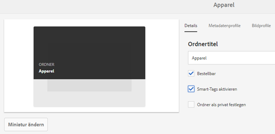

# Optimierte Smart-Tags {#enhanced-smart-tags}

## Überblick über optimierte Smart-Tags {#overview-of-enhanced-smart-tags}

Organisationen, die mit digitalen Assets arbeiten, verwenden zunehmend ein taxonomiegesteuertes Vokabular in Asset-Metadaten. Im Grunde umfasst dieses eine Liste von Schlüsselbegriffen, die Mitarbeiter, Partner und Kunden häufig verwenden, um sich auf digitale Assets einer bestimmten Klasse zu beziehen und nach diesen zu suchen. Das Tagging mit einem taxonomiegesteuerten Vokabular stellt sicher, dass diese Begriffe im Rahmen von Tag-basierten Suchen einfach identifiziert und abgerufen werden können.

Verglichen mit dem Vokabular natürlicher Sprachen hilft das Tagging digitaler Assets anhand einer Geschäftstaxonomie dabei, sie am Geschäft eines Unternehmens auszurichten, und stellt dabei sicher, dass nur die relevantesten Assets bei der Suche angezeigt werden.

So könnte beispielsweise ein Automobilhersteller Bilder von Autos mit Tags versehen, die die Modellnamen darstellen, sodass nur relevante Bilder angezeigt werden, wenn für das Erstellen einer Werbekampagne nach verschiedenen Modellen gesucht wird.

Damit der Smart Content Service die richtigen Tags anwendet, müssen Sie ihn darauf trainieren, Ihre Taxonomie zu erkennen. Um den Dienst zu trainieren, müssen Sie zunächst einen Satz von Assets sowie Tags kuratieren, die diese Assets bestmöglich beschreiben. Wenden Sie diese Tags auf die Assets an und führen Sie einen Trainings-Workflow aus, damit der Dienst lernen kann.

Sobald ein Tag trainiert wurde und bereit ist, kann der Dienst dieses Tag über einen Tagging-Workflow auf Assets anwenden.

Im Hintergrund verwendet der Smart Content Service das KI-Framework von Adobe Sensei und trainiert damit seinen Bilderkennungsalgorithmus auf die Tag-Struktur und Taxonomie Ihres Unternehmens. Diese Content-Intelligenz wird dann verwendet, um relevante Tags auf einen anderen Satz von Assets anzuwenden.

Smart Content Service ist ein Cloud-Dienst, der auf Adobe I/O gehostet wird. Damit Sie ihn in Adobe Experience Manager (AEM) verwenden können, muss der Systemadministrator Ihre AEM-Instanz mit Adobe I/O integrieren.

Die wichtigsten Schritte beim Verwenden des Smart Content Service sind:

* Eingliederung
* Überprüfung von Assets und Tags (Taxonomiedefinition)
* Training des Smart Content Service
* Automatisches Tagging

## Voraussetzungen {#prerequisites}

Stellen Sie vor der Verwendung des Smart Content Service Folgendes sicher, um eine Integration in Adobe I/O zu erstellen:

* Es ist ein Adobe ID-Konto mit Administratorrechten für die Organisation vorhanden.
* Der Smart Content Service ist für Ihre Organisation aktiviert.

## Eingliederung {#onboarding}

Der Dienst für intelligente Inhalte steht als Add-On für AEM zum Kauf zur Verfügung. Nach dem Kauf wird eine E-Mail mit einem Link zum Adobe IO an den Administrator Ihres Unternehmens gesendet.

Der Administrator kann über diesen Link den Smart Content Service in AEM integrieren. Weitere Informationen zum Integrieren des Dienstes mit AEM Assets finden Sie im Abschnitt [Konfigurieren von Smart-Tags](config-smart-tagging.md).

Der Einstieg ist abgeschlossen, wenn der Administrator den Dienst konfiguriert und Benutzer in AEM hinzufügt.

>[!NOTE]
>
>Wenn Sie AEM 6.3 oder eine frühere Version verwenden und einen Tagging-Dienst für Ihre Assets benötigen, lesen Sie [Smart-Tags](https://helpx.adobe.com/experience-manager/6-3/assets/using/touch-ui-smart-tags.html). Intelligente Tags verwenden nicht die neuesten AI-Funktionen und sind daher weniger genau als der erweiterte Dienst für intelligentes Tagging.

## Überprüfen von Assets und Tags {#reviewing-assets-and-tags}

Nach der Einrichtung sollten Sie zunächst einen Satz von Tags definieren, die diese Bilder im Kontext Ihres Geschäftsfeldes bestmöglich beschreiben.

Stellen Sie dann einen Satz mit Bildern zusammen, die Ihr Produkt bestmöglich für eine bestimmte Geschäftsanforderung darstellen. Stellen Sie sicher, dass die Assets in Ihrem Satz den [Richtlinien für das Trainieren des Smart Content Service](smart-tags-training-guidelines.md) entsprechen.

Fügen Sie die Assets einem Ordner hinzu und wenden Sie die Tags über die Eigenschaftsseite auf die einzelnen Assets an. Führen Sie anschließend den Trainings-Workflow für diesen Ordner aus. Mit dem Asset-Satz kann der Smart Content Service mithilfe Ihrer Taxonomiedefinitionen mehr Assets effektiv trainieren.

>[!NOTE]
>
>1. Das Training ist ein unwiderruflicher Vorgang. Adobe empfiehlt Ihnen, die Tags im Asset-Satz zu überprüfen, bevor Sie den Smart Content Service mit den Tags trainieren.
>1. Please do read [Smart Content Service training guidelines](smart-tags-training-guidelines.md) before starting training for any tag.
>1. Adobe empfiehlt Ihnen, mindestens zwei unterschiedliche Tags zu verwenden, wenn Sie den Smart Content Service zum ersten Mal trainieren.

## Intelligente Inhaltserstellung {#training-the-smart-content-service}

Damit der Smart Content Service die Taxonomie Ihres Unternehmens erkennen kann, sollten Sie den Dienst auf einen Asset-Satz ausführen, der bereits für Ihr Unternehmen relevante Tags enthält. Nach dem Training kann der Dienst dieselbe Taxonomie auf einen ähnlichen Satz von Assets anwenden.

Sie können den Dienst mehrfach trainieren, um die Fähigkeit, relevante Tags anzuwenden, zu verbessern. Führen Sie nach jedem Trainingszyklus einen Tagging-Workflow aus und überprüfen Sie, ob Ihre Assets mit den richtigen Tags versehen wurden.

Sie können den Smart Content Service regelmäßig oder je nach Anforderung trainieren.

>[!NOTE]
>
>Der Trainings-Workflow wird nur für Ordner ausgeführt.

### Regelmäßiges Trainieren {#periodic-training}

Sie können festlegen, dass der Smart Content Service regelmäßig mit den Assets und zugewiesenen Tags in einem Ordner trainiert wird. Open the properties page of your asset folder, select **[!UICONTROL Enable Smart Tags]** under the **[!UICONTROL Details]** tab, and save the changes.

Wenn Sie diese Option für einen Ordner auswählt haben, führt AEM automatisch einen Trainings-Workflow aus, um den Smart Content Service mit den Assets im Ordner und deren Tags zu trainieren. Standardmäßig wird der Trainings-Workflow jede Woche samstags um 00:30 Uhr ausgeführt.

### Training bei Bedarf {#on-demand-training}

Sie können den Smart Content Service über die Workflow-Konsole trainieren, wann immer es erforderlich ist.

1. Tippen/klicken Sie auf das AEM-Logo und navigieren Sie zu **[!UICONTROL Tools > Workflow > Modelle]**.
1. Wählen Sie auf der Seite **[!UICONTROL Workflow-Modelle]** den Workflow **[!UICONTROL Training für Smart-Tags]** aus und tippen/klicken Sie anschließend in der Symbolleiste auf **[!UICONTROL Workflow starten]**.
1. Suchen Sie im Dialogfeld **[!UICONTROL Workflow ausführen]** nach dem Payload-Ordner, der die mit Tags versehenen Assets für das Trainieren des Diensts enthält.
1. Geben Sie einen Titel für den Workflow ein und fügen Sie einen Kommentar hinzu. Tippen/klicken Sie anschließend auf **[!UICONTROL Ausführen]**. Die Assets und Tags werden für das Training übermittelt.

   

>[!NOTE]
>
>Nachdem die Assets in einem Ordner für die Schulung verarbeitet wurden, werden in den nachfolgenden Schulungszyklen nur die geänderten Assets verarbeitet.

### Schulungsberichte anzeigen {#viewing-training-reports}

Um sicherzustellen, dass der Smart Content Service auf Ihre Tags im Asset-Trainingssatz trainiert ist, überprüfen Sie den Bericht zum Trainings-Workflow über die Berichte-Konsole.

1. Tap/click the AEM logo, and go to **[!UICONTROL Tools > Assets > Reports]**.
1. Tippen/klicken Sie auf der Seite **[!UICONTROL Asset-Berichte]** auf **[!UICONTROL Erstellen]**.
1. Select the **[!UICONTROL Smart Tags Training]** report, and then tap/click **[!UICONTROL Next]** from the toolbar.
1. Geben Sie einen Titel und eine Beschreibung für den Bericht ein. Behalten Sie unter **[!UICONTROL Bericht planen]** die Auswahl **[!UICONTROL Jetzt]** bei. Wenn Sie den Bericht für einen späteren Zeitpunkt planen möchten, wählen Sie **[!UICONTROL Später]** aus und legen Sie ein Datum und eine Uhrzeit fest. Tippen/klicken Sie dann in der Symbolleiste auf **[!UICONTROL Erstellen]**.
1. Wählen Sie auf der Seite **[!UICONTROL Asset-Berichte]** den generierten Bericht aus. To view the report, tap **[!UICONTROL View]** from the toolbar.
1. Prüfen Sie die Details des Berichts.

   Der Bericht zeigt den Trainingsstatus für die trainierten Tags an. The green color in the **[!UICONTROL Training Status]** column indicates that the Smart Content Service is trained for the tag. Eine gelbe Markierung weist darauf hin, dass der Dienst noch nicht vollständig auf ein bestimmtes Tag trainiert ist. Fügen Sie in einem solchen Fall weitere Bilder mit dem entsprechenden Tag hinzu und führen Sie den Trainings-Workflow aus, um den Dienst vollständig auf das Tag zu trainieren.

   Wenn Ihre Tags nicht im Bericht angezeigt werden, führen Sie den Trainings-Workflow für diese Tags erneut aus.

1. To download the report, select it from the list, and tap **[!UICONTROL Download]** from the toolbar. Der Bericht wird als Excel-Datei heruntergeladen.

## Assets automatisch taggen {#tagging-assets-automatically}

Wenn Sie den Smart Content Service trainiert haben, können Sie den Tagging-Workflow starten, um automatisch passende Tags auf einen anderen Satz ähnlicher Assets anzuwenden.

Sie können den Tagging-Workflow periodisch oder nur bei Bedarf ausführen.

>[!NOTE]
>
>Der Tagging-Workflow wird sowohl für Assets als auch für Ordner ausgeführt.

### Periodisches Tagging {#periodic-tagging}

Sie können bestimmen, dass der Smart Content Service Assets in einem Ordner regelmäßig mit Tags versehen soll. Open the properties page of your asset folder, select **[!UICONTROL Enable Smart Tags]** under the **[!UICONTROL Details]** tab, and save the changes.

Wenn diese Option für einen Ordner ausgewählt ist, werden die Assets im Ordner vom Smart Content Service automatisch mit Tags versehen. Standardmäßig wird der Tag-Tag um 12:00 Uhr ausgeführt.

### Tagging bei Bedarf {#on-demand-tagging}

Sie können den Tagging-Workflow wie folgt aktivieren, um Ihre Assets sofort mit Tags zu versehen:

* Workflow-Konsole
* Timeline

>[!NOTE]
>
>Wenn Sie den Tagging-Workflow über die Timeline ausführen, können Sie Tags gleichzeitig auf maximal 15 Assets anwenden.

#### Tag assets from the workflow console {#tagging-assets-from-the-workflow-console}

1. Tippen/klicken Sie auf das AEM-Logo und navigieren Sie zu **[!UICONTROL Tools > Workflow > Modelle]**.
1. From the **[!UICONTROL Workflow Models]** page, select the **[!UICONTROL DAM Smart Tags Assets]** workflow and then tap/click **[!UICONTROL Start Workflow]** from the toolbar.

   

1. In the **[!UICONTROL Run Workflow]** dialog, browse to the payload folder containing assets on which you want to apply your tags automatically.
1. Geben Sie einen Titel für den Workflow und optional einen Kommentar an. Tippen/klicken Sie anschließend auf **[!UICONTROL Ausführen]**.

   

   Navigieren Sie zum Asset-Ordner und prüfen Sie die Tags, um sicherzustellen, dass der Smart Content Service Ihre Assets ordnungsgemäß mit Tags versehen hat. Weitere Informationen finden Sie unter [Verwalten von Smart-Tags](managing-smart-tags.md).

#### Tag assets from the timeline {#tagging-assets-from-the-timeline}

1. Wählen Sie über die Assets-Benutzeroberfläche den Ordner mit Assets bzw. bestimmte Assets aus, auf die Sie Smart-Tags anwenden möchten.
1. Tippen Sie auf das Experience Manager-Logo und öffnen Sie die Zeitleiste.
1. Tap the arrow at the bottom, and then tap/click **[!UICONTROL Start Workflow]**.

   

1. Wählen Sie den Workflow **[!UICONTROL DAM Smart-Tag-Assets]** aus und geben Sie einen Titel für den Workflow an.
1. Tippen/klicken Sie auf **[!UICONTROL Start]**. Der Workflow wendet Ihre Tags auf Assets an. Navigieren Sie zum Asset-Ordner und prüfen Sie die Tags, um sicherzustellen, dass der Smart Content Service Ihre Assets ordnungsgemäß mit Tags versehen hat. Weitere Informationen finden Sie unter [Verwalten von Smart-Tags](managing-smart-tags.md).

>[!NOTE]
>
>In zukünftigen Tagging-Zyklen werden nur geänderte Assets mit neu trainierten Tags versehen.
>
>Selbst unveränderte Assets werden jedoch mit Tags versehen, wenn die Lücke zwischen der letzten und der aktuellen Tagging-Zykluszeit für den Tag-Arbeitsablauf 24 Stunden überschreitet.
>
>Bei periodischen Tagging-Workflows werden unveränderte Assets mit Tags versehen, wenn die Lücke 6 Monate überschreitet.
