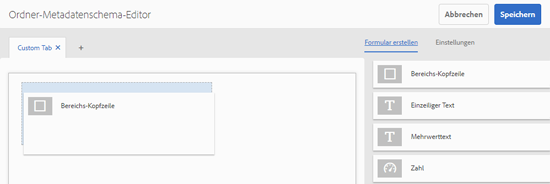
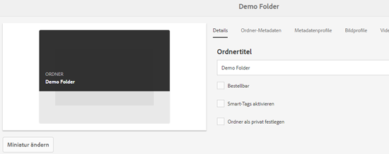

# Ordner-Metadatenschema {#folder-metadata-schema}

Mit Adobe Experience Manager Assets können Sie Metadaten-Schema für Asset-Ordner erstellen, die das Layout und die Metadaten definieren, die auf den Seiten mit den Ordnereigenschaften angezeigt werden.

## Hinzufügen von Ordner-Metadatenschema-Formularen   {#add-a-folder-metadata-schema-form}

Verwenden Sie den Editor für Metadatenschema-Formulare, um Metadatenschemata für Ordner zu erstellen und zu bearbeiten.

1. Wechseln Sie in der Benutzeroberfläche von Experience Manager zu **[!UICONTROL Tools]** > **[!UICONTROL Assets]** > **[!UICONTROL Ordnermetadaten-Schema]**.
1. On the [!UICONTROL Folder Metadata Schema Forms] page, click **[!UICONTROL Create]**.
1. Specify a name for the form, and click **[!UICONTROL Create]**. The new schema form is listed in the [!UICONTROL Schema Forms] page.

## Bearbeiten von Ordner-Metadatenschema-Formularen   {#edit-folder-metadata-schema-forms}

Sie können neu erstellte oder bestehende Metadatenschema-Formulare bearbeiten. Hierzu zählen folgende Elemente:

* Registerkarten
* Formularelemente innerhalb von Registerkarten

Sie können diese Formularelemente einem Feld innerhalb eines Metdatenknotens im CRX-Repository zuordnen bzw. dafür konfigurieren. Sie können dem Metadatenschema-Formular neue Registerkarten oder Formularelemente hinzufügen.

1. In the Schema Forms page, select the form you created, and then select the **[!UICONTROL Edit]** option from the toolbar.
1. In the Folder Metadata Schema Editor page, click `+` to add a tab to the form. To rename the tab, click the default name and specify the new name under **[!UICONTROL Settings]**.

   

   Um weitere Registerkarten hinzuzufügen, klicken Sie auf `+`. Klicken Sie auf `X` eine Registerkarte, um sie zu löschen.

1. Fügen Sie in der aktiven Registerkarte eine oder mehrere Komponenten von der Registerkarte **[!UICONTROL Formular erstellen]** hinzu.

   

   Wenn Sie mehrere Registerkarten erstellen, klicken Sie auf eine bestimmte Registerkarte, um Komponenten hinzuzufügen.

1. Um eine Komponente zu konfigurieren, wählen Sie diese aus und ändern Sie ihre Eigenschaften auf der Registerkarte **[!UICONTROL Einstellungen]**.

   Löschen Sie ggf. eine Komponente über die Registerkarte **[!UICONTROL Einstellungen]**.

   

1. Click **[!UICONTROL Save]** from the toolbar to save the changes.

### Komponenten zum Erstellen von Formularen   {#components-to-build-forms}

Die Registerkarte **[!UICONTROL Formular erstellen]** enthält Formularelemente, die Sie im Ordner-Metadatenschema-Formular verwenden. Die Registerkarte **[!UICONTROL Einstellungen]** enthält die Attribute für jedes Element, das Sie auf der Registerkarte **[!UICONTROL Formular erstellen]** auswählen. Im Folgenden finden Sie eine Liste der auf der Registerkarte **[!UICONTROL Formular erstellen]** verfügbaren Elemente:

| Komponentenname | Beschreibung |
|---|---|
| [!UICONTROL Bereichs-Kopfzeile] | Fügen Sie eine Abschnittsüberschrift für eine Liste allgemeiner Komponenten hinzu. |
| [!UICONTROL Einzelzeilentext] | Fügen Sie eine einzeilige Texteigenschaft hinzu. Diese wird als Zeichenfolge gespeichert. |
| [!UICONTROL Mehrwerttext] | Fügen Sie eine Texteigenschaft mit mehreren Werten hinzu. Diese wird als Zeichenfolgen-Array gespeichert. |
| [!UICONTROL Zahl] | Fügen Sie eine Zahlenkomponente hinzu. |
| [!UICONTROL Datum] | Fügen Sie eine Datumskomponente hinzu. |
| [!UICONTROL Dropdown] | Fügen Sie eine Dropdown-Liste hinzu. |
| [!UICONTROL Standard-Tags] | Fügen Sie ein Tag hinzu. |
| [!UICONTROL Ausgeblendetes Feld] | Fügen Sie ein ausgeblendetes Feld hinzu. Dieses wird beim Speichern des Assets als POST-Parameter gesendet. |

### Bearbeiten von Formularelementen   {#editing-form-items}

To edit the properties of form items, click the component and edit all or a subset of the following properties in the **[!UICONTROL Settings]** tab.

**[!UICONTROL Feldbezeichnung]**: Der Name der Metadateneigenschaft, der auf der Eigenschaftenseite des Assets angezeigt wird.

**[!UICONTROL Zu Eigenschaft zuordnen]**: Diese Eigenschaft gibt den relativen Pfad des Ordnerknotens im CRX-Repository an, wo das Element gespeichert ist. Sie beginnt mit „**./**“. Dies zeigt an, dass sich der Pfad unter dem Knoten des Ordners befindet.

Im Folgenden finden Sie die gültigen Werte für diese Eigenschaft:

* `./jcr:content/metadata/dc:title`: Speichert den Wert im Metadatenknoten des Ordners als Eigenschaft `dc:title`.

* `./jcr:created`: Zeigt die Eigenschaft „JCR“ im Knoten des Ordners an. Wenn Sie diese Eigenschaften in CRXDE konfigurieren, empfiehlt Adobe, dass Sie sie mit „Bearbeitung deaktivieren“ markieren, da sie geschützt sind. Andernfalls tritt der Fehler `Asset(s) failed to modify` auf, wenn Sie die Eigenschaften des Assets speichern.

Um zu gewährleisten, dass die Komponente ordnungsgemäß im Metadatenschema-Formular angezeigt wird, fügen Sie dem Eigenschaftenpfad keine Leerzeichen hinzu.

**[!UICONTROL JSON-Pfad]**: Verwenden Sie diese Eigenschaft, um den Pfad der JSON-Datei anzugeben, in der Sie Schlüssel-Wert-Paare für Optionen speichern.

**[!UICONTROL Platzhalter]**: Geben Sie mit dieser Eigenschaft relevanten Platzhaltertext zur Metadateneigenschaft an.

**[!UICONTROL Wahlen]**: Mit dieser Eigenschaft legen Sie Optionen in einer Liste fest.

**[!UICONTROL Beschreibung]**: Mit dieser Eigenschaft können Sie eine kurze Beschreibung für die Metadatenkomponente hinzufügen.

**[!UICONTROL Klasse]**: Objektklasse, der die Eigenschaft zugeordnet ist.

## Löschen von Ordner-Metadatenschema-Formularen   {#delete-folder-metadata-schema-forms}

Sie können Ordner-Metadatenschema-Formulare über die Seite „Ordner-Metadatenschema-Formulare“ löschen. Um ein Formular zu löschen, wählen Sie das Formular aus und klicken Sie in der Symbolleiste auf die Option &quot;Löschen&quot;.

## Zuordnen eines Ordner-Metadatenschemas {#assign-a-folder-metadata-schema}

Sie können ein Ordner-Metadatenschema über die Seite „Ordner-Metadatenschema-Formulare“ oder bei der Ordnererstellung einem Ordner zuordnen.

Wenn Sie ein Metadatenschema für einen Ordner konfigurieren, wird der Pfad in der Eigenschaft `folderMetadataSchema` des Ordnerknotens unter */jcr:content* gespeichert.

### Zuweisen eines Schemas über die Seite „Ordner-Metadatenschema“   {#assign-to-a-schema-from-the-folder-metadata-schema-page}

1. Wechseln Sie in der Benutzeroberfläche von Experience Manager zu **[!UICONTROL Extras]** > **[!UICONTROL Assets]**> **[!UICONTROL Ordnermetadaten-Schema]**.
1. Wählen Sie auf der Seite „Ordner-Metadatenschema-Formulare“ das Schemaformular aus, das Sie auf einen Ordner anwenden möchten.
1. From the toolbar, click **[!UICONTROL Apply to Folder(s)]**.

1. Select the folder on which to apply the schema and then click **[!UICONTROL Apply]**. Wenn bereits ein Metadatenschema auf den Ordner angewendet wurde, wird eine Warnung dazu angezeigt, dass das bestehende Schema überschrieben wird. Klicken Sie auf **[!UICONTROL Überschreiben]**.
1. Öffnen Sie die Metadateneigenschaften für den Ordner, auf den Sie das Schema angewendet haben.

   

   To view the folder metadata fields, click the **[!UICONTROL Folder Metadata]** tab.

   

### Zuweisen eines Schemas bei der Ordnererstellung {#assign-a-schema-when-creating-a-folder}

Sie können Ordner-Metadatenschemata auch beim Erstellen eines Ordners zuweisen. Wenn bereits mindestens ein Ordner-Metadatenschema im System vorhanden ist, wird eine zusätzliche Liste im Dialogfeld **[!UICONTROL Ordner erstellen]** angezeigt. Sie können das gewünschte Schema auswählen. Standardmäßig ist kein Schema ausgewählt.

1. From the [!DNL Experience Manager Assets] user interface, click **[!UICONTROL Create]** from the toolbar.
1. Geben Sie einen Titel und einen Namen für den Ordner an.
1. Wählen Sie in der Liste „Ordner-Metadatenschema“ das gewünschte Schema aus. Then, click **[!UICONTROL Create]**.

   

1. Öffnen Sie die Metadateneigenschaften für den Ordner, auf den Sie das Schema angewendet haben.
1. To view the folder metadata fields, click the **[!UICONTROL Folder Metadata]** tab.

## Verwenden des Ordner-Metadatenschemas {#use-the-folder-metadata-schema}

Öffnen Sie die Eigenschaften für einen Ordner, der mit einem Ordner-Metadatenschema konfiguriert wurde. A **[!UICONTROL Folder Metadata]** tab is displayed in the folder [!UICONTROL Properties] page. Um das Ordner-Metadatenschema-Formular anzuzeigen, wählen Sie diese Registerkarte aus.

Enter metadata values in the various fields and click **[!UICONTROL Save]** to store the values. Die angegebenen Werte werden im Ordnerknoten im CRX-Repository gespeichert.

