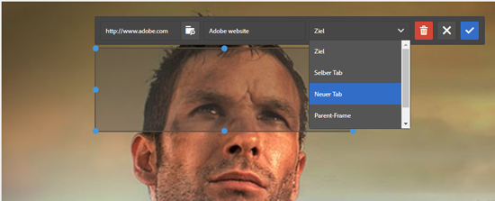

# Hinzufügen von Imagemaps {#adding-image-maps}

Mit Imagemaps können Sie einen oder mehrere Hyperlinkbereiche hinzufügen, die genau so wie andere Hyperlinks funktionieren.

1. Führen Sie einen der folgenden Schritte aus, um **[!UICONTROL Bild-Editor für Bearbeitung im Kontext]** zu öffnen:

   * Klicken Sie mithilfe von Schnellaktionen auf **[!UICONTROL Bearbeiten]** , die in der Ansicht **[!UICONTROL Karte]** auf einem Asset angezeigt wird. Wählen Sie in der Listenansicht das Asset aus und klicken Sie in der Symbolleiste auf die Option **[!UICONTROL Bearbeiten]** .

      >[!NOTE]
      >
      >Schnellaktionen sind in der Ansicht **[!UICONTROL Liste]** nicht verfügbar.

   * Wählen Sie in der Ansicht **[!UICONTROL Karte]** oder **[!UICONTROL Liste]** das Asset aus und klicken Sie in der Symbolleiste auf **[!UICONTROL Bearbeiten]** .
   * Klicken Sie auf der Asset-Seite auf **[!UICONTROL Bearbeiten]** .

      

1. Um eine Imagemap einzufügen, klicken Sie in der Symbolleiste auf **[!UICONTROL Map starten]**  .
1. Wählen Sie die Form der Imagemap aus. Der Hotspot der ausgewählten Form wird auf das Bild gelegt.

   

1. Klicken Sie auf den Hotspot und geben Sie die URL und den Alternativtext ein. Geben Sie in der Liste **[!UICONTROL Target]** an, wo die Imagemap angezeigt werden soll, z. B. auf derselben Registerkarte, auf einer neuen Registerkarte oder in einem iFrame. Geben Sie beispielsweise `https://www.adobe.com` als URL, `Adobe website` als ALT-Text ein und geben Sie **[!UICONTROL Neue Registerkarte]** aus der Liste **[!UICONTROL Target]** an, damit die Imagemap auf einer neuen Registerkarte geöffnet wird.

   

1. Klicken Sie auf **[!UICONTROL Bestätigen]** und dann auf **[!UICONTROL Beenden]**  , um die Änderungen zu speichern.

   Um die Imagemap zu löschen, klicken Sie auf den Hotspot und klicken Sie auf **[!UICONTROL Löschen]** .

1. Um die Imagemap anzuzeigen, navigieren Sie zur Asset-Detailseite und bewegen Sie den Cursor über das Bild.

   

   Wenn die Dynamic Media-Option aktiviert ist, navigieren Sie zum Asset-Editor und klicken Sie auf **[!UICONTROL Map]** , um alle angewendeten Imagemaps anzuzeigen.
