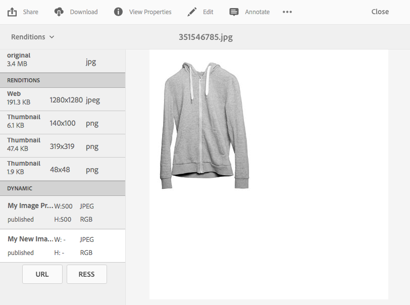

# Anwenden von Dynamic Media-Bildvorgaben {#applying-image-presets}

Mit Bildvorgaben können Assets Bilder in unterschiedlichen Größen, Formaten oder mit anderen Bildeigenschaften dynamisch bereitstellen. Sie können beim Exportieren von Bildern eine Vorgabe auswählen. Die Vorgabe formatiert Bilder entsprechend den Spezifikationen, die Ihr Administrator angegeben hat.

Darüber hinaus können Sie eine responsive Bildvorgabe auswählen (nach der Auswahl durch die Schaltfläche **[!UICONTROL RESS]** gekennzeichnet).

In diesem Abschnitt wird beschrieben, wie Sie Bildvorgaben verwenden. [Administratoren können Bildvorgaben erstellen und konfigurieren](managing-image-presets.md).

>[!NOTE]
>
>Die intelligente Bildbearbeitung arbeitet mit bestehenden Bildvorgaben und reduziert im letzten Moment abhängig vom Browser oder der Geschwindigkeit der Netzverbindung die Größe der Bilddatei intelligent noch weiter. Weitere Informationen finden Sie unter [Intelligente Bildbearbeitung](imaging-faq.md).

Sie können jederzeit bei der Vorschau eines Bildes eine Bildvorgabe darauf anwenden.

>[!NOTE]
>
>Im Modus Dynamic Media - Scene7 werden Bildvorgaben nur für Bild-Assets unterstützt.

**So wenden Sie Dynamic Media-Bildvorgaben an:**

1. Öffnen Sie das Asset und tippen Sie in der linken Leiste auf das Dropdown-Menü und anschließend auf **[!UICONTROL Ausgabedarstellungen]**.

   >[!NOTE]
   >
   >* Statische Ausgabedarstellungen werden in der oberen Hälfte angezeigt. Dynamische Ausgabedarstellungen werden in der unteren Hälfte angezeigt. Bei dynamischen Ausgabedarstellungen (und nur bei diesen) können Sie das Bild mit der URL anzeigen. Die Schaltfläche **[!UICONTROL URL]** wird nur angezeigt, wenn Sie eine dynamische Ausgabedarstellung auswählen. Die Schaltfläche **[!UICONTROL RESS]** wird nur angezeigt, wenn Sie eine responsive Bildvorgabe auswählen.
      >
      >
   * Das System zeigt mehrere Ausgabedarstellungen, wenn Sie **[!UICONTROL Ausgabedarstellungen]** in der Detailansicht eines Assets auswählen. Sie können die Anzahl der angezeigten Vorgaben erhöhen. Siehe [Erhöhung der Anzahl der angezeigten Bildvorgaben](managing-image-presets.md#increasing-or-decreasing-the-number-of-image-presets-that-display).

   

1. Führen Sie einen der folgenden Schritte aus:

   * Wählen Sie ein dynamisches Ausgabeformat aus, damit Sie eine Vorschau der Bildvorgabe anzeigen können.
   * Um das Popup anzuzeigen, tippen Sie auf **[!UICONTROL URL]**, **[!UICONTROL Einbetten]** oder **[!UICONTROL RESS]**.

   >[!NOTE]
   >
   >Wenn das Asset *und* die Bildvorgabe noch nicht veröffentlicht wurden, ist die Schaltfläche **[!UICONTROL URL]** (bzw. die Schaltflächen „URL“ und „RESS“, falls zutreffend) nicht verfügbar.********
   >
   >Beachten Sie auch, dass Bildvorgaben automatisch auf einem -Server für Dynamic Media veröffentlicht werden.
