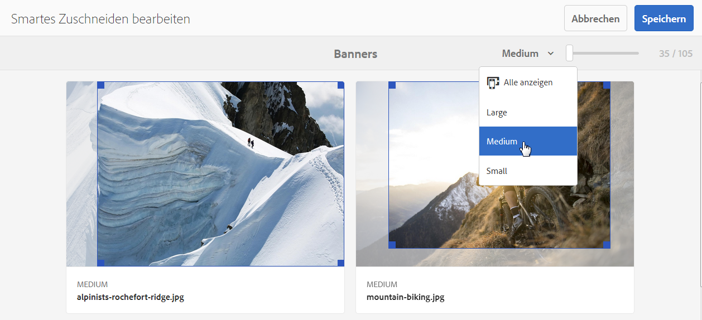

# Dynamic Media-Bildprofile {#image-profiles}

Wenn Sie Bilder hochladen, können Sie das Bild nach dem Hochladen automatisch zuschneiden, indem Sie ein neues Bildprofil auf den Ordner anwenden.

>[!NOTE]
>
>Smartes Zuschneiden ist nur im Scene7-Modus von Dynamic Media verfügbar.

>[!IMPORTANT]
>
>Bildprofile können nicht auf PDF-, animierte GIF- oder INDD-Dateien (Adobe InDesign) angewendet werden.

## Optionen für das Zuschneiden {#crop-options}

<!-- CQDOC-16069 for paragraph directly below -->

Die Koordinaten für das smarte Zuschneiden hängen vom Seitenverhältnis ab. Wenn bei den verschiedenen Einstellungen für das smarte Zuschneiden in einem Bildprofil das Seitenverhältnis für die hinzugefügten Abmessungen im Bildprofil dasselbe ist, wird dasselbe Seitenverhältnis an Dynamic Media gesendet. Adobe empfiehlt, denselben Zuschneidebereich zu verwenden. Dadurch wird sichergestellt, dass es keine Auswirkungen auf verschiedene Dimensionen gibt, die im Bildprofil verwendet werden.

Jeder von Ihnen erstellte smarte Zuschnitt erfordert zusätzliche Verarbeitungsschritte. Das Hinzufügen von mehr als fünf Seitenverhältnissen für das smarte Zuschneiden kann beispielsweise zu einer langsamen Aufnahmerate für Assets führen. Dies führt auch zu einer erhöhten Belastung der Systeme. Da Sie smartes Zuschneiden auf Ordnerebene anwenden können, empfiehlt Adobe, es *nur* in Ordnern anzuwenden, in denen es erforderlich ist.

Es stehen zwei Optionen für das Zuschneiden zur Auswahl. Außerdem können Sie die Erstellung von Farb- und Bildfeldern automatisieren.

| Option | Wann ist sie einzusetzen? | Beschreibung |
| --- | --- | --- |
| Pixelzuschnitt | Nur Massenzuschnitt von Bildern basierend auf Dimensionen. | Um diese Option zu verwenden, wählen Sie aus dem Dropdownmenü „Zuschnittsoptionen“ **[!UICONTROL Pixelzuschnitt]** aus.  Um von den Seiten eines Bildes zu beschneiden, geben Sie die Anzahl der Pixel ein, die von einer beliebigen Seite oder von jeder Seite des Bildes abgeschnitten werden sollen. Wie viel des Bildes beschnitten wird, hängt von der ppi-Einstellung (Pixel pro Zoll) in der Bilddatei ab.  Ein Bildprofil-Pixelzuschnitt wird wie folgt gerendert:  ・ Werte sind oben, unten, links und rechts. • Der Wert für links ist . Von dort aus wird der Pixelzuschnitt berechnet.`0,0` ・ Ausgangspunkt des Zuschnitts: Links ist X und Oben ist Y  ・ horizontale Berechnung: horizontale Pixelabmessung des Originalbilds abzüglich links und dann abzüglich rechts. • Vertikale Berechnung: Die vertikale Pixelhöhe abzüglich des Werts für oben und dann abzüglich des Werts für unten.  Beispiel: Sie haben ein Bild in der Größe 4000 x 3000 Pixel. Sie verwenden folgende Werte: Oben = 250, Unten = 500, Links = 300, Rechts = 700.  Schneiden Sie von oben links (300, 250) aus mit dem Füllraum (4000-300-700, 3000-250-500 oder 3000,2250). |
| Smartes Zuschneiden | Massenzuschnitt von Bildern basierend auf ihrem visuellen Fokus. | Smartes Zuschneiden nutzt die Möglichkeiten künstlicher Intelligenz in Adobe Sensei, um den Massenzuschnitt von Bildern schnell zu automatisieren. Smartes Zuschneiden erkennt automatisch den Fokus in jedem Bild und schneidet es entsprechend zu, um das Bildmotiv richtig zu erfassen – unabhängig von der Bildschirmgröße.
 
Um smartes Zuschneiden zu verwenden, wählen Sie aus der Dropdown-Liste „Zuschnittsoptionen“ die Option **[!UICONTROL Smartes Zuschneiden]** aus und aktivieren Sie „Responsive Bildbeschneidung“.
 
Die standardmäßigen Breakpoint-Größen für „Groß“, „Mittel“ und „Klein“ decken in der Regel alle Größen ab, in denen Bilder auf Smartphones, Tablets, Computern und in Bannern verwendet werden. Sie können die Standardnamen „Groß“, „Mittel“ und „Klein“ beliebig anpassen.
 
Um weitere Haltepunkte hinzuzufügen, wählen Sie **[!UICONTROL Zuschnitt hinzufügen]** aus, um einen Zuschnitt zu löschen, und klicken Sie auf das Symbol &quot;Papierkorb kann&quot;. |
| Farb- und Bildmuster | Massenweise Erstellung von Bildmustern für die einzelnen Bilder. | **Hinweis:** Smarte Muster werden in Dynamic Media Classic nicht unterstützt.  Erkennen und generieren Sie automatisch hochwertige Bildmuster aus Produktbildern, die Farbe oder Material zeigen.  Um Farb- und Bildmuster zu verwenden, wählen Sie aus der Dropdown-Liste „Zuschnittsoptionen“ **[!UICONTROL Smartes Zuschneiden]** aus und aktivieren Sie die Funktion „Farb- und Bildmuster“. Geben Sie in den Feldern „Breite“ und „Höhe“ einen Pixelwert an.  Zwar sind alle Bildzuschnitte über die Leiste „Ausgabedarstellungen“ verfügbar, jedoch können Farb- und Bildmuster nur über die Funktion „URL kopieren“ verwendet werden. Verwenden Sie Ihre eigene Ansichtskomponente, um den Musterabschnitt Farbfeld auf Ihrer Site zu rendern. (Hiervon ausgenommen sind Karussellbanner. Dynamic Media bietet die Anzeigekomponente für in entsprechenden Bannern verwendete Farb-/Bildmuster.)  **Verwendung von**  BildmusternDie URL für Bildmuster ist unkompliziert. Sie lautet:  `/is/image/company/&lt;asset_name&gt;:Swatch` wobei `:Swatch` an die Asset-Anforderung angehängt wird.  **Verwenden**  von FarbmusternUm Farbmuster zu verwenden, stellen Sie eine  `req=userdata` Anfrage mit der folgenden: `/is/image/&lt;company_name&gt;/&lt;swatch_asset_name&gt;:Swatch?req=userdata`   Beispielsweise ist Folgendes ein Farbmuster-Asset in Dynamic Media Classic: `https://my.company.com:8080/is/image/DemoCo/Sleek:Swatch`  und hier ist die entsprechende  `req=userdata` URL des Farbmuster-Assets: `https://my.company.com:8080/is/image/DemoCo/Sleek:Swatch?req=userdata`   Die  `req=userdata` Antwort lautet wie folgt: `SmartCropDef=Swatch SmartCropHeight=200.0` `SmartCropRect=0.421671,0.389815,0.0848564,0.0592593,200,200` `SmartCropType=Swatch` `SmartCropWidth=200.0` `SmartSwatchColor=0xA56DB2`  Sie können auch eine  `req=userdata` Antwort im XML- oder JSON-Format anfordern, wie in den folgenden URL-Beispielen: `https://my.company.com:8080/is/image/DemoCo/Sleek:Swatch?req=userdata,json` `https://my.company.com:8080/is/image/DemoCo/Sleek:Swatch?req=userdata,xml`  **Hinweis:**  Erstellen Sie Ihre eigene WCM-Komponente, um ein Farbmuster anzufordern, und analysieren Sie das Attribut  `SmartSwatchColor` , das durch einen 24-Bit-RGB-Hexadezimalwert dargestellt wird.  Siehe auch [`userdata`„“ im Viewer-Referenzhandbuch](https://experienceleague.adobe.com/docs/dynamic-media-developer-resources/image-serving-api/image-serving-api/http-protocol-reference/command-reference/req/r-userdata.html). |

## Unschärfemaske {#unsharp-mask}

Mit **[!UICONTROL Unscharf maskieren]** können Sie einen Scharfzeichnungsfiltereffekt für das endgültige heruntergesampelte Bild optimieren. Sie können die Intensität des Effekts, den Radius des Effekts (gemessen in Pixel) und einen Schwellenwert für den Kontrast festlegen, der ignoriert werden soll. Dieser Effekt verwendet dieselben Optionen wie der Filter *Unschärfemaske* von Adobe Photoshop.

>[!NOTE]
>
>Die Unschärfemaske wird nur auf herunterskalierte Ausgabedarstellungen im PTIFF (Pyramiden-TIFF) angewendet, die mehr als 50 % heruntergesampelt sind. Das bedeutet, dass die größten Ausgabedarstellungen im PTIFF nicht von der Unschärfemaske betroffen sind, während kleinere Ausgabedarstellungen wie Miniaturansichten geändert werden (und die Unschärfemaske anzeigen).

In **[!UICONTROL Unschärfemaske]** sind die folgenden Filteroptionen verfügbar:

| Option | Beschreibung |
| --- | --- |
| Stärke | Steuert den auf die Kantenpixel angewendeten Kontrastwert. Der Standardwert ist 1,75. Bei hochauflösenden Bildern können Sie ihn auf bis zu 5 erhöhen. Der Wert dient hierbei als ein Maß für die Filterintensität. Bereich: 0-5. |
| Radius | Bestimmt die Anzahl der Pixel um die Kantenpixel, auf die sich die Scharfzeichnung auswirkt. Bei hochauflösenden Bildern geben Sie einen Wert zwischen 1 und 2 ein. Bei einem niedrigen Wert werden lediglich die Kantenpixel scharfgezeichnet, bei einem hohen Wert werden mehr Pixel scharfgezeichnet. Der korrekte Wert hängt von der Bildgröße ab. Der Standardwert ist 0,2. Bereich: 0-250. |
| Schwelle | Bestimmt den Kontrastbereich, der bei der Anwendung des Filters „Unschärfemaske“ ignoriert werden soll. In anderen Worten: Die Option bestimmt, wie stark sich die scharfgezeichneten Pixel vom Umgebungsbereich unterscheiden müssen, damit sie als Kantenpixel eingestuft und scharfgezeichnet werden. Um Rauschen zu vermeiden, experimentieren Sie mit Werten zwischen 0 und 255. |

Das Scharfzeichnen wird unter [Scharfzeichnen von Bildern] (/help/assets/assets/sharpening_images.pdf) beschrieben.

## Erstellen von Dynamic Media-Bildprofilen {#creating-image-profiles}

Informationen zur Definition von erweiterten Verarbeitungsparametern für andere Asset-Typen finden Sie unter [Konfigurieren der Asset-Verarbeitung](config-dms7.md#configuring-asset-processing).

Siehe [Profile für die Verarbeitung von Metadaten, Bildern und Videos](processing-profiles.md).

Informationen hierzu finden Sie auch im Thema über die [Best Practices für die Organisation Ihrer digitalen Assets zur Verwendung von Verarbeitungsprofilen](/help/assets/organize-assets.md).

**So erstellen Sie Dynamic Media-Bildprofile:**

1. Wählen Sie das Adobe Experience Manager-Logo aus und navigieren Sie zu **[!UICONTROL Tools]** > **[!UICONTROL Assets]** > **[!UICONTROL Bildprofile]**.
1. Wählen Sie **[!UICONTROL Erstellen]** aus, damit Sie ein Bildprofil hinzufügen können.
1. Geben Sie einen Profilnamen und Werte für Unschärfemasken, Zuschneiden oder Farb-/Bildmuster (oder beides) an.

   Verwenden Sie einen Profilnamen, der dem vorgesehenen Zweck entspricht. Wenn Sie beispielsweise ein Profil erstellen möchten, das nur Farbmuster generiert - d. h. smartes Zuschneiden ist deaktiviert (deaktiviert) und Farb- und Bildmuster ist aktiviert (aktiviert) -, verwenden Sie den Profilnamen &quot;Smarte Farbmuster&quot;.

   Siehe auch Optionen für [Smartes Zuschneiden und smarte Farb-/Bildmuster](#crop-options) sowie [Unscharf maskieren](#unsharp-mask).

   

1. Wählen Sie **[!UICONTROL Speichern]** aus. Das neu erstellte Profil wird in der Liste der verfügbaren Profile angezeigt.

## Dynamic Media-Bildprofile bearbeiten oder löschen {#editing-or-deleting-image-profiles}

1. Wählen Sie das Experience Manager-Logo aus und navigieren Sie zu **[!UICONTROL Tools]** > **[!UICONTROL Assets]** > **[!UICONTROL Bildprofile]**.
1. Wählen Sie das Bildprofil aus, das Sie bearbeiten oder entfernen möchten. Um sie zu bearbeiten, wählen Sie **[!UICONTROL Bildprofil bearbeiten]** aus. Um es zu entfernen, wählen Sie **[!UICONTROL Bildprofil löschen]** aus.

   

1. Wenn Sie das Profil bearbeitet haben, speichern Sie die Änderungen. Wenn Sie das Profil löschen, bestätigen Sie, dass Sie es entfernen möchten.

## Anwenden eines Dynamic Media-Bildprofils auf Ordner {#applying-an-image-profile-to-folders}

Wenn Sie ein Bildprofil einem Ordner zuweisen, erben automatisch alle Unterordner das Profil vom übergeordneten Ordner. Dieser Workflow bedeutet, dass Sie einem Ordner nur ein Bildprofil zuweisen können. Daher sollten Sie die Ordnerstruktur sorgfältig planen, in der Sie Assets hochladen, speichern, verwenden und archivieren.

Wenn Sie einem Ordner ein anderes Bildprofil zugewiesen haben, überschreibt das neue das vorherige Profil. Die zuvor vorhandenen Ordner-Assets verbleiben unverändert. Das neue Profil wird auf die Assets angewendet, die dem Ordner später hinzugefügt werden.

Ordner, denen ein Profil zugewiesen ist, werden in der Benutzeroberfläche unter Verwendung des Profilnamens angezeigt, der auf der Karte angezeigt wird.

<!-- When you add smart crop to an existing image profile, you need to re-trigger the [DAM Update Asset workflow](assets-workflow.md) if you want to generate crops for existing assets in your asset repository. -->

Sie können Bildprofile auf bestimmte Ordner oder global auf alle Assets anwenden.

Sie können Assets in einem Ordner erneut verarbeiten, der bereits über ein vorhandenes Bildprofil verfügt, das Sie nachträglich geändert haben. Siehe [Assets in einem Ordner erneut verarbeiten, nachdem Sie das Verarbeitungsprofil ](processing-profiles.md#reprocessing-assets) bearbeitet haben.

### Anwenden von Dynamic Media-Bildprofilen auf bestimmte Ordner {#applying-image-profiles-to-specific-folders}

Sie können im Menü **[!UICONTROL Tools]** oder, wenn Sie sich im Ordner befinden, über **[!UICONTROL Eigenschaften]** ein Bildprofil auf einen Ordner anwenden. In diesem Abschnitt wird beschrieben, wie Sie Bildprofile auf beide Arten auf Ordner anwenden.

Ordner, denen bereits ein Profil zugewiesen ist, werden durch die Anzeige des Profilnamens direkt unter dem Ordnernamen gekennzeichnet.

Sie können Assets in einem Ordner erneut verarbeiten, der bereits über ein vorhandenes Videoprofil verfügt, das Sie nachträglich geändert haben. Siehe [Assets in einem Ordner erneut verarbeiten, nachdem Sie das Verarbeitungsprofil ](processing-profiles.md#reprocessing-assets) bearbeitet haben.

#### Anwenden von Dynamic Media-Bildprofilen auf Ordner über die Benutzeroberfläche &quot;Profile&quot; {#applying-image-profiles-to-folders-from-profiles-user-interface}

1. Wählen Sie das Experience Manager-Logo aus und navigieren Sie zu **[!UICONTROL Tools]** > **[!UICONTROL Assets]** > **[!UICONTROL Bildprofile]**.
1. Wählen Sie ein Bildprofil aus, das Sie auf einen oder mehrere Ordner anwenden möchten.

   

1. Wählen Sie **[!UICONTROL Verarbeitungsprofil auf Ordner anwenden]** und wählen Sie den Ordner oder mehrere Ordner aus, die Sie zum Empfangen der neu hochgeladenen Assets verwenden möchten, und wählen Sie **[!UICONTROL Anwenden]** aus. Ordner, denen bereits ein Profil zugewiesen ist, werden durch die Anzeige des Profilnamens direkt unter dem Ordnernamen gekennzeichnet.

#### Anwenden von Dynamic Media-Bildprofilen auf Ordner über Eigenschaften {#applying-image-profiles-to-folders-from-properties}

1. Wählen Sie das Experience League-Logo aus und navigieren Sie zu **[!UICONTROL Assets]**. Navigieren Sie dann zum übergeordneten Ordner des Ordners, auf den Sie ein Bildprofil anwenden möchten.
1. Wählen Sie im Ordner das Häkchen aus, um es auszuwählen, und wählen Sie dann **[!UICONTROL Eigenschaften]** aus.
1. Wählen Sie die Registerkarte **[!UICONTROL Bildprofile.]** Wählen Sie aus der Dropdownliste **[!UICONTROL Profilname]** das Profil und dann **[!UICONTROL Speichern und schließen]** aus. Ordner, denen bereits ein Profil zugewiesen ist, werden durch die Anzeige des Profilnamens direkt unter dem Ordnernamen gekennzeichnet.

   

### Globales Anwenden eines Dynamic Media-Bildprofils {#applying-an-image-profile-globally}

Sie können ein Experience Manager nicht nur auf einen Ordner anwenden, sondern auch global anwenden, sodass auf alle Inhalte, die in -Assets in einem beliebigen Ordner hochgeladen werden, das ausgewählte Profil angewendet wird.

Sie können Assets in einem Ordner erneut verarbeiten, der bereits über ein vorhandenes Videoprofil verfügt, das Sie nachträglich geändert haben. Informationen hierzu finden Sie unter [Erneutes Verarbeiten von Assets in einem Ordner nach Bearbeitung des zugehörigen Verarbeitungsprofils](processing-profiles.md#reprocessing-assets).

**So wenden Sie ein Dynamic Media-Bildprofil global an:**

1. Führen Sie einen der folgenden Schritte aus:

   * Navigieren Sie zu `https://&lt;AEM server&gt;/mnt/overlay/dam/gui/content/assets/foldersharewizard.html/content/dam`, wenden Sie das entsprechende Profil an und wählen Sie **[!UICONTROL Speichern]** aus.

      

   * Navigieren Sie in CRXDE Lite zum folgenden Knoten: `/content/dam/jcr:content`.

      Fügen Sie die Eigenschaft `imageProfile:/conf/global/settings/dam/adminui-extension/imageprofile/<name of image profile>` hinzu und wählen Sie **[!UICONTROL Alle speichern]** aus.

      

## Bearbeiten des smarten Zuschnitts oder smarten Farb-/Bildmusters eines einzelnen Bildes {#editing-the-smart-crop-or-smart-swatch-of-a-single-image}

>[!NOTE]
>
>Smartes Zuschneiden ist nur im Scene7-Modus von Dynamic Media verfügbar.

Sie können das Zuschnittsfenster eines Bildes manuell neu ausrichten oder die Größe ändern, um den Fokus präziser zu bestimmen.

Nachdem Sie einen smarten Zuschnitt bearbeitet und gespeichert haben, wird die Änderung überall dort angewendet, wo Sie den Zuschnitt für bestimmte Bilder verwenden.

Sie können einen smarten Zuschnitt erneut ausführen, um die zusätzlichen Zuschnitte ggf. erneut zu generieren.

Siehe auch [Bearbeiten des smarten Zuschnitts oder smarten Farb-/Bildmusters mehrerer Bilder](#editing-the-smart-crop-or-smart-swatch-of-multiple-images).

**So bearbeiten Sie smarte Zuschnitte oder smarte Farb-/Bildmuster eines einzelnen Bildes:**

1. Wählen Sie das Experience Manager-Logo aus und navigieren Sie zu **[!UICONTROL Assets]** und dann zu dem Ordner, auf den das Bildprofil &quot;Smartes Zuschneiden&quot;oder &quot;Smartes Farb-/Bildmuster&quot;angewendet wurde.

1. Wählen Sie den Ordner aus, damit Sie den Inhalt öffnen können.
1. Wählen Sie das Bild aus, dessen smartes Zuschneiden oder smartes Farb-/Bildmuster Sie anpassen möchten.
1. Wählen Sie in der Symbolleiste **[!UICONTROL Smartes Zuschneiden]** aus.

1. Führen Sie einen der folgenden Schritte aus:

   * Ziehen Sie den Schieberegler in der oberen rechten Ecke der Seite nach links oder rechts, um die Bildanzeige zu erweitern oder zu reduzieren.
   * Ziehen Sie im Bild eine Ecke, um die Größe des sichtbaren Bereichs des Zuschnitts oder Farb-/Bildmusters anzupassen.
   * Ziehen Sie das Feld bzw. Farb-/Bildmuster im Bild an eine neue Position. Sie können nur Bildmuster bearbeiten. Farbmuster sind statisch.
   * Wählen Sie über dem Bild **[!UICONTROL Wiederherstellen]** aus, um alle Bearbeitungen rückgängig zu machen und den ursprünglichen Zuschnitt oder das Farb-/Bildmuster wiederherzustellen.

1. Wählen Sie in der rechten oberen Ecke der Seite **[!UICONTROL Speichern]** und dann **[!UICONTROL Schließen]** aus, um zum Ordner der Assets zurückzukehren.

## Bearbeiten des smarten Zuschnitts oder smarten Farb-/Bildmusters mehrerer Bilder {#editing-the-smart-crop-or-smart-swatch-of-multiple-images}

Nachdem Sie ein Bildprofil - das smartes Zuschneiden enthält - auf einen Ordner angewendet haben, wird auf alle Bilder in diesem Ordner ein Zuschnitt angewendet. Sie können das Zuschnittsfenster in mehreren Bildern *manuell* neu ausrichten oder die Größe verändern, um den Fokus präziser zu bestimmen.

Nachdem Sie einen smarten Zuschnitt bearbeitet und gespeichert haben, wird die Änderung überall dort angewendet, wo Sie den Zuschnitt für bestimmte Bilder verwenden.

Sie können einen smarten Zuschnitt erneut ausführen, um die zusätzlichen Zuschnitte ggf. erneut zu generieren.

**So bearbeiten Sie smarte Zuschnitte oder smarte Farb-/Bildmuster mehrerer Bilder:**

1. Wählen Sie das Experience Manager-Logo aus und navigieren Sie zu **[!UICONTROL Assets]** und dann zu einem Ordner, auf den das Bildprofil &quot;Smartes Zuschneiden&quot;oder &quot;Smartes Farb-/Bildmuster&quot;angewendet wurde.
1. Wählen Sie im Ordner das Symbol **[!UICONTROL Mehr Aktionen]** (...) und dann **[!UICONTROL Smartes Zuschneiden]** aus.

1. Führen Sie auf der Seite **[!UICONTROL Smartes Zuschneiden bearbeiten]** eine der folgenden Aktionen durch:

   * Passen Sie die Anzeigegröße von Bildern auf der Seite an.

      Ziehen Sie den Schieberegler rechts neben der Dropdown-Liste mit Breakpoint-Namen nach links oder rechts, um den sichtbaren Bildbereich anzupassen.

      

   * Filtern Sie die Liste sichtbarer Bilder basierend auf Breakpoint-Namen. Im unten stehenden Beispiel werden die Bilder nach dem Breakpoint-Namen „Mittel“ gefiltert.

      Wählen Sie aus der Dropdown-Liste in der oberen rechten Ecke der Seite einen Breakpoint-Namen aus, um zu filtern, welche Bilder Ihnen angezeigt werden. (Siehe Abbildung oben.)

      

   * Passen Sie die Größe des Zuschnittsfeldes an. Führen Sie einen der folgenden Schritte aus:

      * Wenn das Bild nur über einen smarten Zuschnitt oder ein smartes Farb-/Bildmuster verfügt, ziehen Sie im Bild die Ecke des Zuschnittsfeldes, um die Größe des sichtbaren Bereichs des Zuschnitts anzupassen.
      * Wenn das Bild sowohl über einen smarten Zuschnitt als auch über ein smartes Farb-/Bildmuster verfügt, ziehen Sie im Bild die Ecke des Zuschnittsfeldes, um die Größe des sichtbaren Bereichs des Zuschnitts anzupassen. Oder wählen Sie das smarte Farb-Bildmuster unter dem Bild aus (Farbmuster sind statisch) und ziehen Sie dann den Eckpunkt des Zuschnittrahmens, um die Größe des sichtbaren Bereichs des Farb-/Bildmusters anzupassen.

      

   * Verschieben Sie das smarte Zuschnittsfeld. Führen Sie einen der folgenden Schritte aus:

      * Wenn das Bild nur über einen smarten Zuschnitt oder ein smartes Farb-/Bildmuster verfügt, ziehen Sie das Zuschnittsfeld im Bild an eine neue Position.
      * Wenn das Bild sowohl über einen smarten Zuschnitt als auch über ein smartes Farb-/Bildmuster verfügt, ziehen Sie das Zuschnittsfeld im Bild an eine neue Position. Alternativ können Sie auch das smarte Farb-/Bildmuster unter dem Bild auswählen (Farbmuster sind statisch) und dann das smarte Zuschnittsfeld an eine neue Position ziehen.

      

   * Machen Sie all Ihre Änderungen rückgängig und stellen Sie den ursprünglichen smarten Zuschnitt bzw. das smarte Farb-/Bildmuster wieder her (gilt nur für die aktuelle Bearbeitungssitzung).

      Wählen Sie **[!UICONTROL Wiederherstellen]** über dem Bild aus.

      

1. Wählen Sie in der rechten oberen Ecke der Seite **[!UICONTROL Speichern]** und dann **[!UICONTROL Schließen]** aus, um zum Ordner der Assets zurückzukehren.

## Entfernen von Dynamic Media-Bildprofilen aus Ordnern {#removing-an-image-profile-from-folders}

Wenn Sie ein Bildprofil aus einem Ordner entfernen, erben automatisch alle Unterordner das Entfernen des Profils aus dem übergeordneten Ordner. Die Verarbeitung der Dateien, die in den Ordnern stattgefunden hat, verbleibt jedoch intakt.

Sie können im Menü **[!UICONTROL Tools]** oder, wenn Sie sich im Ordner befinden, über **[!UICONTROL Eigenschaften]** ein Bildprofil aus einem Ordner entfernen. In diesem Abschnitt werden die beiden Möglichkeiten beschrieben, wie Sie Bildprofile aus Ordnern entfernen können.

### Entfernen von Dynamic Media-Bildprofilen aus Ordnern über die Benutzeroberfläche &quot;Profile&quot; {#removing-image-profiles-from-folders-via-profiles-user-interface}

1. Wählen Sie das Experience Manager-Logo aus und navigieren Sie zu **[!UICONTROL Tools]** > **[!UICONTROL Assets]** > **[!UICONTROL Bildprofile]**.
1. Wählen Sie ein Bildprofil aus, das Sie aus einem Ordner oder mehreren Ordnern entfernen möchten.
1. Wählen Sie **[!UICONTROL Verarbeitungsprofil aus Ordnern entfernen]** aus, wählen Sie den Ordner oder mehrere Ordner aus, aus denen das Profil entfernt werden soll, und wählen Sie **[!UICONTROL Entfernen]** aus.

   Sie können überprüfen, ob das Bildprofil nicht länger auf einen Ordner angewendet wird, da der Name in diesem Fall nicht mehr unter dem Ordner angezeigt wird.

### Entfernen von Dynamic Media-Bildprofilen aus Ordnern über &quot;Eigenschaften&quot; {#removing-image-profiles-from-folders-via-properties}

1. Wählen Sie das Experience Manager-Logo aus, navigieren Sie zu **[!UICONTROL Assets]** und dann zu dem Ordner, aus dem Sie ein Bildprofil entfernen möchten.
1. Wählen Sie im Ordner das Häkchen aus, um es auszuwählen, und wählen Sie dann **[!UICONTROL Eigenschaften]** aus.
1. Wählen Sie die Registerkarte **[!UICONTROL Bildprofile]**.
1. Wählen Sie aus der Dropdownliste **[!UICONTROL Profilname]** die Option **[!UICONTROL Keine]** und dann **[!UICONTROL Speichern und schließen]**.

   Ordner, denen bereits ein Profil zugewiesen ist, werden durch die Anzeige des Profilnamens direkt unter dem Ordnernamen gekennzeichnet.
