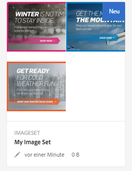
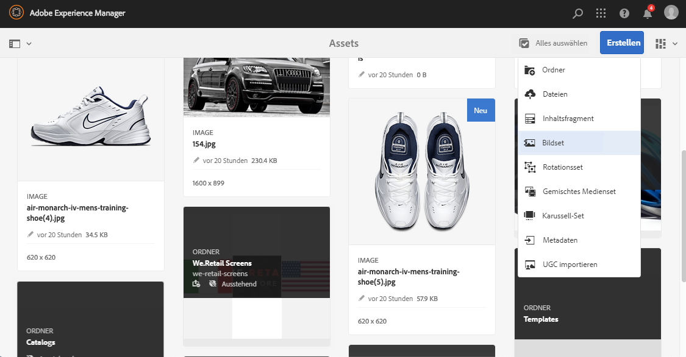
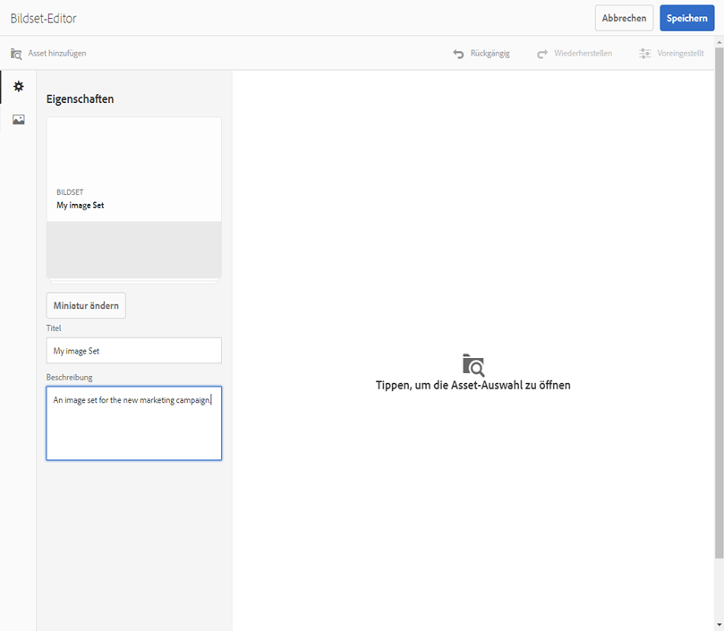
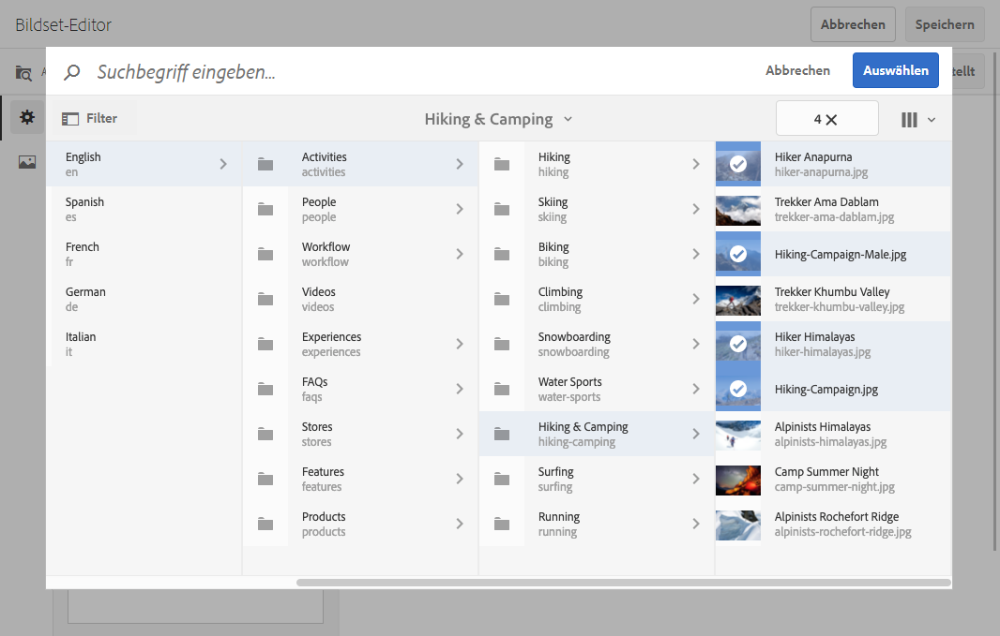
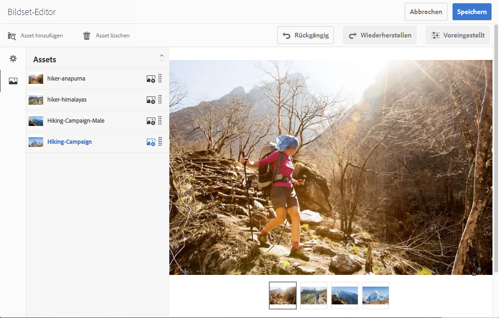
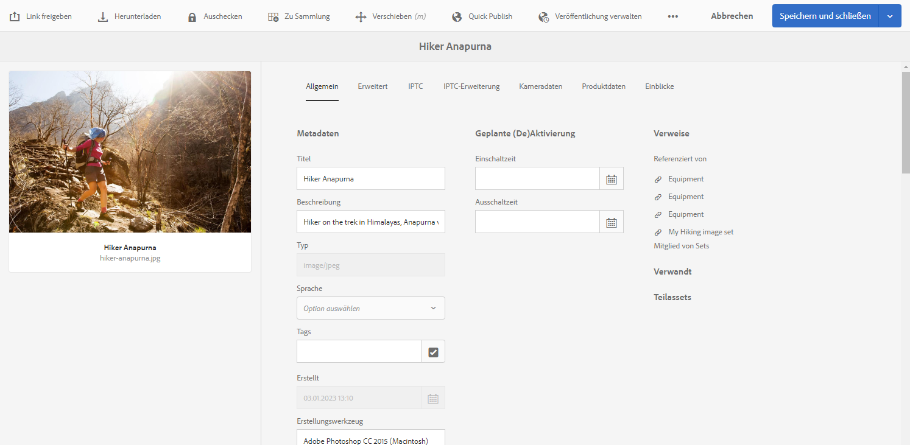
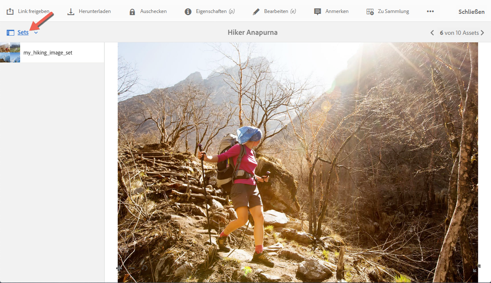
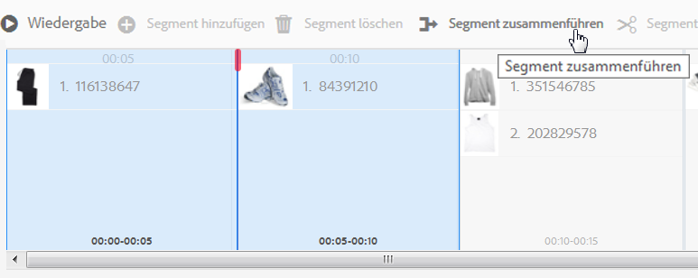

# Bildsets {#image-sets}

Über Bildsets erhalten Benutzer ein integriertes Anzeigeerlebnis, bei dem sie unterschiedliche Ansichten eines Elements durch Klicken auf eine Miniaturansicht anzeigen können. Mit Bildsets können Sie alternative Ansichten eines Elements darstellen. Dabei enthält der Viewer Zoomtools, mit denen Bilder genauer betrachtet werden können.

Bildsets werden durch ein Banner mit dem Wort `IMAGESET` gekennzeichnet. Darüber hinaus wird bei veröffentlichten Bildsets das Veröffentlichungsdatum (durch das **[!UICONTROL Welt]**-Symbol gekennzeichnet) zusammen mit dem Datum der letzten Änderung (durch das **[!UICONTROL Bleistift]**-Symbol gekennzeichnet) im Banner angezeigt.

Innerhalb des Bildsets können Sie auch Muster erstellen, indem Sie ein Bildset erstellen und Miniaturansichten hinzufügen.

Dies ist nützlich, wenn Sie einen Artikel in einer anderen Farbe, einem anderen Muster oder mit anderer Endverarbeitung darstellen möchten. Um ein Bildset mit Farbmustern zu erstellen, benötigen Sie ein Bild für alle Farben, Muster oder Endverarbeitungen, die den Benutzern dargestellt werden sollen. Außerdem benötigen Sie eine Farb-, Muster- oder Endverarbeitungsvorlage für alle Farben, Muster oder Endverarbeitungen.

Beispiel: Sie möchten Bilder von Kappen darstellen, deren Schirme unterschiedliche Farben aufweisen: rot, grün und blau. In diesem Fall benötigen Sie drei Aufnahmen der gleichen Kappe. Sie brauchen eine Aufnahme mit einem roten Schirm, eine mit einem grünen Schirm und eine mit einem blauen Schirm. Außerdem brauchen Sie ein rotes, grünes und blaues Farbmuster. Die Farbmuster dienen als Miniaturansichten, die Benutzer im Musterset-Viewer auswählen, um die rote, grüne oder blaue Kappe anzuzeigen.

>[!NOTE]
>
>Informationen zur Assets-Benutzeroberfläche finden Sie unter [Verwalten von Assets](/help/assets/manage-assets.md).

## Schnellstart: Bildsets   {#quick-start-image-sets}

**So schaffen Sie einen schnellen Einstieg:**

1. [Laden Sie die Primärquellen-Bilder für mehrere Ansichten hoch](#uploading-assets-in-image-sets).

   Laden Sie zunächst die Bilder für die Bildsets hoch. Beachten Sie bei der Auswahl von Bildern, dass Ihre Kunden Bilder im Bildset-Viewer einzoomen können. Achten Sie darauf, dass die längste Seite der Bilder mindestens 2.000 Pixel hat, um optimale Zoom-Details zu erzielen. Dynamic Media kann Bilder mit einer Auflösung von jeweils bis zu 25 MP (Megapixel) rendern. Sie können beispielsweise ein Bild mit 5000 x 5000 MP oder eine beliebige andere Größenkombination mit bis zu 25 MP verwenden.

   Adobe Experience Manager Assets unterstützt viele Bilddateiformate, empfohlen werden jedoch verlustfreie TIFF-, PNG- und EPS-Bilder.

1. [Erstellen Sie Bildsets](#creating-image-sets).

   In Bildsets wählen Benutzer Miniaturansichten im Bildset-Viewer aus.

   Um ein Bildset in Assets zu erstellen, navigieren Sie zu **[!UICONTROL Erstellen]** > **[!UICONTROL Bildsets]**. Fügen Sie dann Bilder hinzu und wählen Sie **[!UICONTROL Speichern]** aus.

   Sie können Bildsets auch automatisch über [Stapelsatzvorgaben](/help/assets/config-dms7.md) erstellen.
   >[!IMPORTANT]
   >
   >Stapelsätze werden vom IPS (Image Production System) bei der Asset-Erfassung erstellt und sind nur im Modus Dynamic Media - Scene7 verfügbar.

   Siehe [Vorbereiten von Bildset-Assets für das Hochladen und Hochladen Ihrer Dateien](#uploading-assets-in-image-sets).

   Siehe [Arbeiten mit Selektoren](/help/assets/working-with-selectors.md).

1. Fügen Sie nach Bedarf [Bildset-Viewer-Vorgaben](/help/assets/managing-viewer-presets.md) hinzu.

   Administratoren können Bildset-Viewer-Vorgaben erstellen oder ändern. Um das Bildset mit einer Viewer-Vorgabe anzuzeigen, wählen Sie das Bildset aus und wählen Sie im Dropdown-Menü in der linken Seitenleiste **[!UICONTROL Viewer]** aus.

   Navigieren Sie zu **[!UICONTROL Tools]** > **[!UICONTROL Assets]** > **[!UICONTROL Viewer-Vorgaben]** , wenn Sie Viewer-Vorgaben erstellen oder bearbeiten möchten.

1. (Optional) [Bildsets anzeigen](/help/assets/image-sets.md#viewing-image-sets), die mit Stapelsatzvorgaben erstellt wurden.
1. [Zeigen Sie Bildsets in einer Vorschau an](/help/assets/previewing-assets.md).

   Wählen Sie das Bildset aus, um dessen Vorschau anzuzeigen. Wählen Sie die Miniaturansichtssymbole aus, damit Sie das Bildset im ausgewählten Viewer untersuchen können. Sie können verschiedene Viewer aus dem Menü **[!UICONTROL Viewer]** wählen, das Sie links in der Leiste über die Dropdown-Liste aufrufen können.

1. [Veröffentlichen Sie Bildsets](/help/assets/publishing-dynamicmedia-assets.md).

   Beim Veröffentlichen eines Bildsets werden die URL und der Einbettungscode aktiviert. Darüber hinaus müssen Sie alle [benutzerdefinierten Viewer-Vorgaben veröffentlichen](/help/assets/managing-viewer-presets.md), die Sie erstellt haben. Standardmäßig vorhandene Viewer-Vorgaben sind bereits veröffentlicht.

1. [Verknüpfen Sie URLs mit einer Web-Anwendung](/help/assets/linking-urls-to-yourwebapplication.md) oder [betten Sie den Video- oder Bild-Viewer ein](/help/assets/embed-code.md).

   Experience Manager Assets erstellt URL-Aufrufe für Bildsets und aktiviert diese, nachdem Sie die Bildsets veröffentlicht haben. Sie können diese URLs während der Asset-Vorschau kopieren. Sie können sie alternativ in Ihre Website einbetten.

   Wählen Sie das Bildset und dann im Dropdown-Menü links die Option **[!UICONTROL Viewer]**.

   Siehe [Verknüpfen eines Bildsets mit einer Web-Seite](/help/assets/linking-urls-to-yourwebapplication.md) und [Einbetten des Video- oder Bild-Viewers](/help/assets/embed-code.md).

Informationen zum Bearbeiten von Bildsets finden Sie unter [Bildsets bearbeiten](#editing-image-sets). Darüber hinaus können Sie [Eigenschaften von Bildsets](/help/assets/manage-assets.md#editing-properties) anzeigen und bearbeiten.

Wenn Sie beim Erstellen von Sets Probleme haben, lesen Sie den Abschnitt zu Bildern und Sets unter [Problembehandlung in Dynamic Media – Scene7-Modus](/help/assets/troubleshoot-dms7.md#images-and-sets).

## Hochladen von Assets in Bildsets {#uploading-assets-in-image-sets}

Laden Sie zunächst die Bilder für die Bildsets hoch. Beachten Sie bei der Auswahl von Bildern, dass Ihre Kunden Bilder im Bildset-Viewer einzoomen können. Achten Sie darauf, dass die längste Seite der Bilder mindestens 2.000 Pixel hat. Bildsets unterstützen zahlreiche Bilddateiformate, empfohlen werden aber verlustfreie TIFF-, PNG- und EPS-Bilder.

Sie laden Bilder für Bild­Sets genauso wie [alle anderen Assets in Assets](/help/assets/manage-assets.md#uploading-assets) hoch.

### Vorbereiten von Bildset-Assets für das Hochladen {#preparing-image-set-assets-for-upload}

Bevor Sie Bildsets erstellen, achten Sie darauf, dass die Bilder die richtige Größe und das richtige Format aufweisen.

Um ein Bildset mit mehreren Ansichten zu erstellen, benötigen Sie Bilder, die einen Artikel aus unterschiedlichen Blickwinkeln zeigen oder unterschiedliche Aspekte desselben Artikels darstellen. Ziel ist es, die wichtigen Merkmale eines Artikels so hervorzuheben, dass Benutzer einen umfassen Einblick in das Aussehen oder die Funktion des Gegenstands erhalten.

Stellen Sie sicher, dass die Bilder in Bildsets mindestens 2.000 Pixel in der größten Abmessung aufweisen, da Benutzer sie einzoomen können. Assets unterstützen viele Bilddateiformate, empfohlen werden jedoch verlustfreie TIFF-, PNG- und EPS-Bilder.

>[!NOTE]
>
>Wenn Sie außerdem Miniaturansichten verwenden, um Produktmuster anzugeben, müssen Sie Folgendes tun:
>
>Sie benötigen Vignetten oder unterschiedliche Aufnahmen desselben Bildes, in denen dieses in verschiedenen Farben, Mustern oder Endverarbeitungen dargestellt wird. Außerdem benötigen Sie Miniaturansichtsdateien, die den verschiedenen Farben, Mustern oder Endverarbeitungen entsprechen. Um beispielsweise Miniaturansichten in einem Bildset zu präsentieren, die eine Jacke in Schwarz, Braun und Grün anzeigen, benötigen Sie:
>
>* eine schwarze, braune und grüne Aufnahme der Jacke,
>* eine schwarze, braune und grüne Miniaturansicht

## Erstellen Sie Bildsets {#creating-image-sets}

Sie können Bildsets über die Benutzeroberfläche oder die API erstellen. In diesem Abschnitt wird beschrieben, wie Sie Bildsets in der Benutzeroberfläche erstellen.

>[!NOTE]
>
>Sie können Bildsets auch automatisch über [Stapelsatzvorgaben](/help/assets/config-dms7.md#creating-batch-set-presets-to-auto-generate-image-sets-and-spin-sets) erstellen.
>**Wichtig:** Stapelsätze werden vom IPS (Image Production System) im Rahmen der Asset-Aufnahme erstellt und sind nur im Scene7-Modus von Dynamic Media verfügbar.

Assets, die Sie Ihrem Set hinzufügen, werden automatisch in alphanumerischer Reihenfolge hinzugefügt. Sie können die Anordnung oder Sortierung der Assets manuell ändern, nachdem sie hinzugefügt wurden.

>[!NOTE]
>
>Bildsätze werden nicht für Assets unterstützt, deren Dateinamen ein „,“ (Komma) enthält.

**So erstellen Sie Bildsets:**

1. Wählen Sie in Experience Manager das Experience Manager-Logo aus, um auf die globale Navigationskonsole zuzugreifen, und gehen Sie dann zu **[!UICONTROL Navigation]** > **[!UICONTROL Assets]**. Navigieren Sie zu der Stelle, an der Sie ein Bildset erstellen möchten, und navigieren Sie dann zu **[!UICONTROL Erstellen]** > **[!UICONTROL Bildset]** , um die Seite &quot;Bildset-Editor&quot;zu öffnen.

   Sie können das Set auch in einem Ordner erstellen, der die gewünschten Assets enthält.

   

1. Geben Sie auf der Seite &quot;Bildset-Editor&quot;im Feld **[!UICONTROL Titel]** einen Namen für das Bildset ein. Der Name wird im Banner über dem Bildset angezeigt. Geben Sie optional eine Beschreibung ein.

   

1. Nehmen Sie eine der folgenden Aktionen vor:

   * Wählen Sie links oben auf der Seite &quot;Bildset-Editor&quot;die Option **[!UICONTROL Asset hinzufügen]**.

   * Wählen Sie in der Mitte des Bildset-Editors die Option **[!UICONTROL Tippen, um die Asset-Auswahl]** zu öffnen.
   Wählen Sie die Assets aus, die Sie in das Bildset aufnehmen möchten. Die ausgewählten Assets sind mit einem Häkchen versehen. Wenn Sie fertig sind, wählen Sie in der Nähe der oberen rechten Ecke der Seite **[!UICONTROL Auswählen]**.

   Mit der Asset-Auswahl können Sie nach Assets suchen, indem Sie ein Keyword eingeben und auf **[!UICONTROL Zurück]** tippen/klicken. Sie können auch Filter anwenden, um Ihre Suchergebnisse genauer abzustimmen. Sie können nach Pfad, Sammlung, Dateityp und Tag filtern. Wählen Sie den Filter aus und wählen Sie dann in der Symbolleiste das Symbol **[!UICONTROL Filter]** aus. Ändern Sie die Ansicht, indem Sie das Symbol „Ansicht“ tippen und dann **[!UICONTROL Spaltenansicht]**, **[!UICONTROL Kartenansicht]** oder **[!UICONTROL Listenansicht]** wählen.

   Siehe [Arbeiten mit Selektoren](/help/assets/working-with-selectors.md).

   

1. Assets, die Sie Ihrem Set hinzufügen, werden automatisch in alphanumerischer Reihenfolge hinzugefügt. Sie können die Anordnung oder Sortierung der Assets manuell ändern, nachdem sie hinzugefügt wurden.

   Ziehen Sie bei Bedarf das Symbol Neu anordnen eines Assets rechts neben den Dateinamen des Assets, um die Bilder in der Setliste nach oben oder unten anzuordnen.

   

   Wenn Sie eine Miniaturansicht oder ein Muster ändern möchten, wählen Sie das Symbol **+** **Miniaturansicht** neben dem Bild und navigieren Sie zur gewünschten Miniaturansicht oder zum gewünschten Muster. Wenn Sie alle Bilder ausgewählt haben, wählen Sie **[!UICONTROL Speichern]** aus.

1. (Optional) Führen Sie einen der folgenden Schritte aus:

   * Um ein Bild zu löschen, wählen Sie das Bild aus und klicken Sie auf **[!UICONTROL Asset löschen]**.

   * Um eine Vorgabe anzuwenden, wählen Sie rechts oben auf der Seite **[!UICONTROL Voreinstellung]** und dann eine Vorgabe aus, die auf alle Assets gleichzeitig angewendet werden soll.
   >[!NOTE]
   >
   >Beim Erstellen des Bildsets können Sie die Miniaturansicht des Bildsets ändern oder zulassen, dass Experience Manager die Miniaturansicht anhand der Assets im Bildset automatisch auswählen. Um eine Miniaturansicht auszuwählen, wählen Sie **[!UICONTROL Miniaturansicht ändern]** über dem Feld Titel auf der Seite Bildset-Editor aus und wählen Sie dann ein beliebiges Bild aus (Sie können auch zu anderen Ordnern navigieren, um Bilder zu suchen). Wenn Sie eine Miniaturansicht ausgewählt haben und möchten, dass der Experience Manager eine Miniaturansicht aus dem Bildset generiert, wählen Sie **[!UICONTROL Wechseln zu]** > **[!UICONTROL Automatische Miniatur]**.

1. Wählen Sie **[!UICONTROL Speichern]** aus. Das neu erstellte Bildset wird in dem Ordner angezeigt, in dem es erstellt wurde.

## Anzeigen von Bildsets {#viewing-image-sets}

Sie können Bildsets entweder in der Benutzeroberfläche oder automatisch über [Stapelsatzvorgaben](/help/assets/config-dms7.md#creating-batch-set-presets-to-auto-generate-image-sets-and-spin-sets) erstellen.

>[!IMPORTANT]
>
>Stapelsätze werden vom IPS [Image Production System] im Rahmen der Asset-Erfassung erstellt und sind nur im Dynamic Media-Scene7-Modus verfügbar.)

Mit Stapelsatzvorgaben erstellte Sets werden jedoch *nicht* in der Benutzeroberfläche angezeigt. Sie können diese Sets auf drei verschiedene Arten anzeigen. (Diese Methoden sind auch verfügbar, wenn Sie die Bildsets in der Benutzeroberfläche erstellt haben.)

* Öffnen Sie die Eigenschaften eines einzelnen Assets. Die Eigenschaften zeigen an, auf welche Sets das ausgewählte Asset verweist oder welchen Sets es angehört. Wählen Sie den Namen des Sets aus, wenn Sie den gesamten Satz sehen möchten.

   

* Von einem zugehörigen Bild eines beliebigen Sets. Wählen Sie das Menü **[!UICONTROL Sets]** aus, um die Sets anzuzeigen, denen das Asset angehört.

   

* Über die Suche können Sie **[!UICONTROL Filter]** auswählen, dann **[!UICONTROL Dynamic Media]** erweitern und **[!UICONTROL Sets]** auswählen.

   Die Suche gibt als Ergebnis Sets zurück, die in der Benutzeroberfläche manuell oder mit Stapelsatzvorgaben automatisch erstellt wurden. Bei automatisierten Sets wird die Suchabfrage mithilfe des Suchkriteriums &quot;Beginnt mit&quot;durchgeführt, das sich von der Suche nach Experience Managern unterscheidet, die auf der Verwendung von Suchkriterien &quot;Enthält&quot;basiert. Das Festlegen des Filters auf **[!UICONTROL Sets]** ist die einzige Möglichkeit, um automatisierte Sets zu suchen.

   

>[!NOTE]
>
>Sets können über die Benutzeroberfläche angezeigt werden, wie unter [Bildsets bearbeiten](#editing-image-sets) beschrieben.

## Bearbeiten von Bildsets {#editing-image-sets}

Sie können mehrere Bearbeitungsaufgaben für Bildsets ausführen, z. B. die folgenden:

* Fügen Sie dem Bildset Bilder hinzu.
* Ordnen Sie Bilder im Bildset neu an.
* Löschen Sie Assets im Bildset.
* Wenden Sie Viewer-Vorgaben an.
* Löschen Sie das Bildset.

**So bearbeiten Sie Bildsets:**

1. Führen Sie einen der folgenden Schritte aus:

   * Bewegen Sie den Mauszeiger über ein Bildset-Asset und wählen Sie **[!UICONTROL Bearbeiten]** (Stiftsymbol).
   * Bewegen Sie den Mauszeiger über ein Bildset-Asset, wählen Sie **[!UICONTROL Auswählen]** (Häkchensymbol) und klicken Sie dann in der Symbolleiste auf **[!UICONTROL Bearbeiten]**.
   * Wählen Sie ein Bildset-Asset aus und wählen Sie dann **[!UICONTROL Bearbeiten]** (Bleistiftsymbol) in der Symbolleiste aus.

1. Führen Sie eine der folgenden Aktionen aus, um die Bilder im Bildset zu bearbeiten:

   * Ziehen Sie ein Bild, wenn Sie ein Asset an einer neuen Position anordnen möchten (zum Verschieben von Elementen wählen Sie das Symbol zum Neuanordnen).
   * Um Elemente in auf- oder absteigender Reihenfolge zu sortieren, wählen Sie die Spaltenüberschrift aus.
   * Um ein Asset hinzuzufügen oder ein vorhandenes Asset zu aktualisieren, wählen Sie **[!UICONTROL Asset hinzufügen]** aus. Navigieren Sie zu einem Asset, wählen Sie es aus und klicken Sie dann oben rechts auf der Seite auf **[!UICONTROL Auswählen]** .

      >[!NOTE]
      >
      >Wenn Sie das in Experience Manager als Miniaturansicht verwendete Bild löschen und durch ein anderes ersetzen, wird das Original-Asset weiterhin angezeigt.
   * Um ein Asset zu löschen, wählen Sie es aus und klicken Sie auf **[!UICONTROL Asset löschen]**.
   * Um eine Vorgabe anzuwenden, wählen Sie rechts oben auf der Seite **[!UICONTROL Vorgabe]** und dann eine Viewer-Vorgabe aus.
   * Um eine Miniaturansicht hinzuzufügen oder zu ändern, wählen Sie die Miniaturansicht rechts neben dem Asset. Navigieren Sie zur neuen Miniaturansicht oder zum neuen Musterasset, wählen Sie es aus und wählen Sie dann **[!UICONTROL Auswählen]** aus.
   * Um ein ganzes Bildset zu löschen, navigieren Sie zum Bildset, wählen Sie es aus und klicken Sie auf **[!UICONTROL Löschen]**.

   >[!NOTE]
   >
   >Sie können die Bilder in einem Bildset bearbeiten, indem Sie zu diesem Set navigieren, in der linken Leiste **[!UICONTROL Mitglieder des Sets]** auswählen und dann auf das Stiftsymbol eines einzelnen Assets klicken, um das Bearbeitungsfenster zu öffnen.

1. Wählen Sie **[!UICONTROL Save]** aus, wenn Sie die Bearbeitung abgeschlossen haben.

## Zeigen Sie Bildsets in einer Vorschau an {#previewing-image-sets}

Weitere Informationen finden Sie im Abschnitt [Asset-Vorschau](/help/assets/previewing-assets.md).

## Veröffentlichen Sie Bildsets {#publishing-image-sets}

Siehe [Veröffentlichen von Assets](/help/assets/publishing-dynamicmedia-assets.md).
