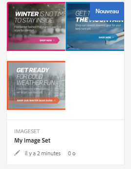
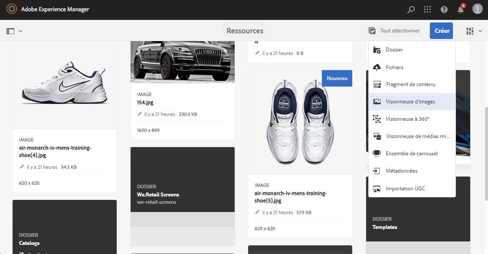
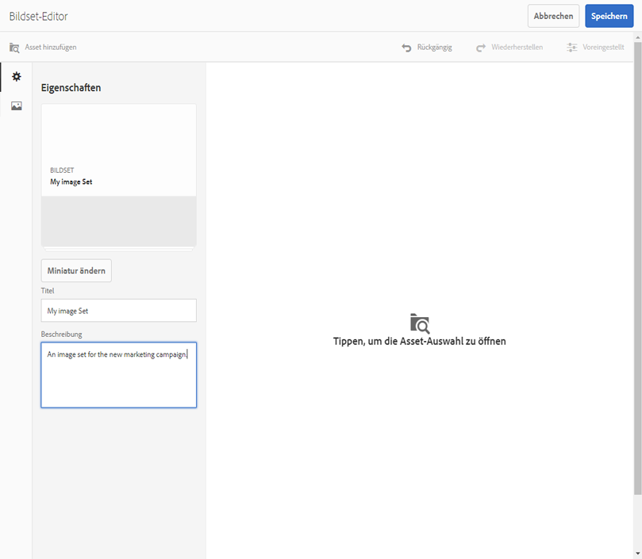
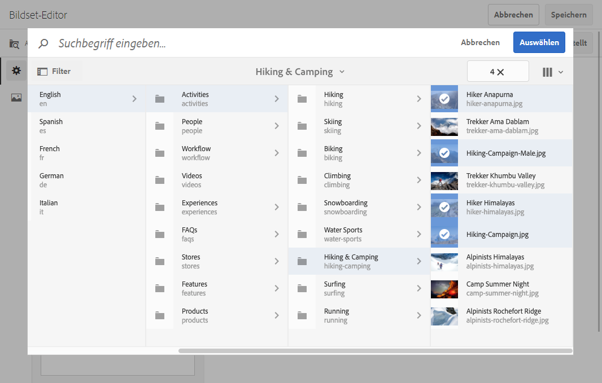
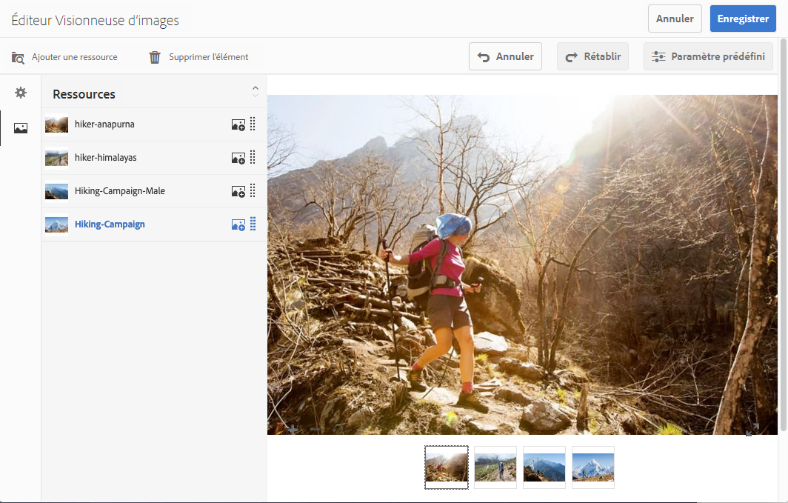
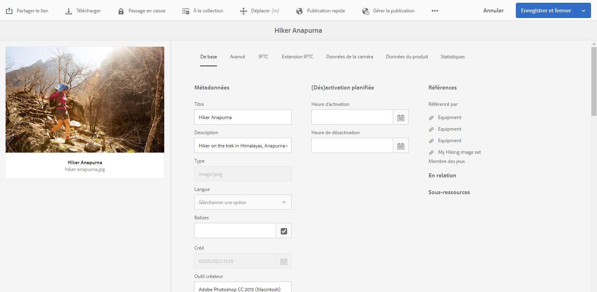
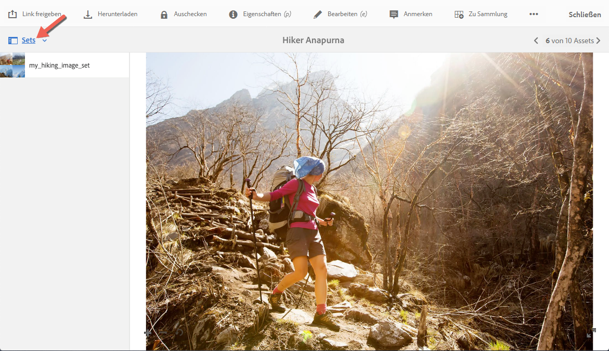
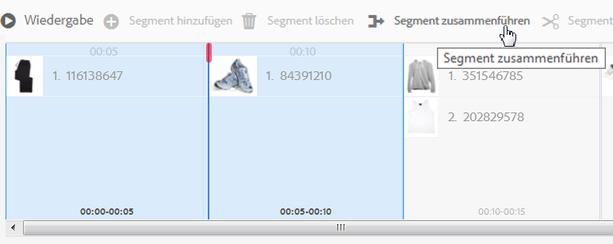

# Bild-Sets {#image-sets}

Über Bild-Sets erhalten Benutzerinnen und Benutzer ein integriertes Anwenderlebnis, bei dem sie unterschiedliche Ansichten eines Elements durch Auswählen einer Miniatur anzeigen können. Mit Bild-Sets können Sie alternative Ansichten eines Elements darstellen. Dabei enthält der Viewer Zoomtools, mit denen Bilder genauer betrachtet werden können.

Bild-Sets werden durch ein Banner mit dem Wort `IMAGESET` gekennzeichnet. Darüber hinaus wird bei veröffentlichten Bild-Sets das Veröffentlichungsdatum (durch das **[!UICONTROL Welt]**-Symbol gekennzeichnet) zusammen mit dem Datum der letzten Änderung (durch das **[!UICONTROL Bleistift]**-Symbol gekennzeichnet) im Banner angezeigt.

Innerhalb des Bild-Sets können Sie auch Muster erstellen, indem Sie ein Bild-Set erstellen und Miniaturen hinzufügen.

Dies ist nützlich, wenn Sie einen Artikel in einer anderen Farbe, einem anderen Muster oder mit anderer Endverarbeitung darstellen möchten. Um ein Bild-Set mit Farbmustern zu erstellen, benötigen Sie ein Bild für alle Farben, Muster oder Endverarbeitungen, die den Benutzern dargestellt werden sollen. Sie benötigen außerdem ein Farb-, Muster- oder Oberflächenfarbfeld für jede Farbe, jedes Muster oder jede Oberfläche.

Nehmen wir zum Beispiel an, Sie möchten Bilder von Kappen mit verschiedenfarbigen Schirmen präsentieren; die Schirme sind rot, grün und blau. In diesem Fall benötigen Sie drei Aufnahmen derselben Kappe. Sie brauchen eine Aufnahme mit einem roten Schirm, eine mit einem grünen Schirm und eine mit einem blauen Schirm. Außerdem benötigen Sie ein rotes, grünes und blaues Farbfeld. Die Farbmuster dienen als Miniaturen, die Benutzerinnen und Benutzer im Musterset-Viewer auswählen, um die Kappe mit rotem, grünem oder blauem Schirm anzuzeigen.

>[!NOTE]
>
>Informationen zur Assets-Benutzeroberfläche finden Sie unter [Verwalten von Assets](/help/assets/manage-assets.md).

Beim Erstellen eines Bild-Sets empfiehlt Adobe die folgenden Best Practices und erzwingt die folgenden Beschränkungen:

| Begrenzungstyp | Best Practice | Grenzwert |
| --- | --- | --- |
| Anzahl der doppelten Assets pro Satz | Keine Duplikate | 20‡ |
| Maximale Anzahl an Bildern pro Set | 5–10 Bilder pro Set | 1000 |

‡ Best Practice ist, keine doppelten Assets in einem Satz zu haben. Das Limit beträgt 20 Duplikate für ein einzelnes Asset. Wenn Sie ein weiteres Duplikat für dieses Asset innerhalb dieses Satzes hinzufügen, gibt die Anfrage entweder einen Fehler aus oder ignoriert das Duplikat.

Siehe auch [Grenzwerte für Dynamic Media](/help/assets/limitations.md).

## Schnellstart: Bild-Sets {#quick-start-image-sets}

**So schaffen Sie einen schnellen Einstieg:**

1. [Laden Sie die Primärquellen-Bilder für mehrere Ansichten hoch](#uploading-assets-in-image-sets).

   Laden Sie zunächst die Bilder für die Bild-Sets hoch. Beachten Sie bei der Auswahl von Bildern, dass Ihre Kundschaft Bilder im Bild-Set-Viewer einzoomen kann. Achten Sie darauf, dass die längste Seite der Bilder mindestens 2.000 Pixel hat, um optimale Zoom-Details zu erzielen. Mit Dynamic Media können Bilder mit einer Auflösung von jeweils bis zu 25 Megapixel gerendert werden. Sie können beispielsweise ein Bild mit 5000 x 5000 Megapixel oder eine beliebige andere Größenkombination mit bis zu 25 Megapixel verwenden.

   Siehe [Dynamic Media - Unterstützte Rasterbildformate](/help/assets/assets-formats.md#supported-raster-image-formats-dynamic-media) für eine Liste der von Bild-Sets unterstützten Formate.

<!--    Adobe Experience Manager Assets supports many image file formats, but lossless TIFF, PNG, and EPS images are recommended. -->

1. [Erstellen von Bild-Sets](#creating-image-sets).

   In Bild-Sets wählen Benutzerinnen und Benutzer Miniaturen im Bild-Set-Viewer aus.

   Gehen Sie zum Erstellen eines Bild-Sets in Assets zu **[!UICONTROL Erstellen]** > **[!UICONTROL Bild-Sets]**. Fügen Sie anschließend Bilder hinzu und wählen Sie **[!UICONTROL Speichern]** aus.

   Sie können Bild-Sets auch automatisch über [Stapelsatzvorgaben](/help/assets/config-dms7.md) erstellen.
   >[!IMPORTANT]
   >
   >Stapelsätze werden vom IPS (Image Production System) im Rahmen der Asset-Aufnahme erstellt und sind nur im Scene7-Modus von Dynamic Media verfügbar.

   Siehe [Vorbereiten von Bild-Set-Assets auf das Hochladen und Hochladen von Dateien](#uploading-assets-in-image-sets).

   Siehe [Arbeiten mit Selektoren](/help/assets/working-with-selectors.md).

1. Fügen Sie nach Bedarf [Bild-Set-Viewer-Vorgaben](/help/assets/managing-viewer-presets.md) hinzu.

   Administratoren können Bild-Set-Viewer-Vorgaben erstellen oder ändern. Wählen Sie zum Anzeigen Ihres Bild-Sets mit einer Viewer-Vorgabe das Bild-Set und links in der Leiste in der Dropdown-Liste die Option **[!UICONTROL Viewer]** aus.

   Navigieren Sie zu **[!UICONTROL Tools]** > **[!UICONTROL Assets]** > **[!UICONTROL Viewer-Vorgaben]**, wenn Sie Viewer-Vorgaben erstellen oder bearbeiten möchten.

1. (Optional) [Anzeigen von Bild-Sets](/help/assets/image-sets.md#viewing-image-sets), die mit Stapelsatzvorgaben erstellt wurden.
1. [Zeigen Sie Bild-Sets in einer Vorschau an](/help/assets/previewing-assets.md).

   Wählen Sie das Bild-Set aus, um dessen Vorschau anzuzeigen. Wählen Sie die Miniaturansichtssymbole aus, damit Sie das Bild-Set im ausgewählten Viewer untersuchen können. Sie können verschiedene Viewer aus dem Menü **[!UICONTROL Viewer]** wählen, das Sie links in der Leiste über die Dropdown-Liste aufrufen können.

1. [Veröffentlichen eines Bild-Sets](/help/assets/publishing-dynamicmedia-assets.md).

   Beim Veröffentlichen eines Bild-Sets wird die URL und der Einbettungs-Code aktiviert. Darüber hinaus müssen Sie alle [benutzerdefinierten Viewer-Vorgaben veröffentlichen](/help/assets/managing-viewer-presets.md), die Sie erstellt haben. Standardmäßig vorhandene Viewer-Vorgaben sind bereits veröffentlicht.

1. [Verknüpfen Sie URLs mit einer Web-Anwendung](/help/assets/linking-urls-to-yourwebapplication.md) oder [betten Sie den Video- oder Bild-Viewer ein](/help/assets/embed-code.md).

   Experience Manager Assets erstellt URL-Aufrufe für Bild-Sets und aktiviert diese, nachdem Sie die Bild-Sets veröffentlicht haben. Sie können diese URLs während der Asset-Vorschau kopieren. Alternativ dazu können Sie sie in Ihre Website einbetten.

   Wählen Sie das Bild-Set und dann im Dropdown-Menü links die Option **[!UICONTROL Viewer]**.

   Siehe [Verknüpfen von Bild-Sets mit Web-Seiten](/help/assets/linking-urls-to-yourwebapplication.md) und [Einbetten des Video- oder Bild-Viewers](/help/assets/embed-code.md).

Informationen zum Bearbeiten von Bild-Sets finden Sie unter [Bearbeiten von Bild-Sets](#editing-image-sets). Darüber hinaus können Sie [Eigenschaften von Bild-Sets](/help/assets/manage-assets.md#editing-properties) anzeigen und bearbeiten.

Wenn Sie beim Erstellen von Sets Probleme haben, lesen Sie den Abschnitt zu Bildern und Sets unter [Problembehandlung in Dynamic Media – Scene7-Modus](/help/assets/troubleshoot-dms7.md#images-and-sets).

## Hochladen von Assets in Bild-Sets {#uploading-assets-in-image-sets}

Laden Sie zunächst die Bilder für die Bild-Sets hoch. Beachten Sie bei der Auswahl von Bildern, dass Ihre Kundschaft Bilder im Bild-Set-Viewer einzoomen kann. Achten Sie darauf, dass die längste Seite der Bilder mindestens 2.000 Pixel hat. Bild-Sets unterstützen zahlreiche Bilddateiformate, empfohlen werden aber verlustfreie TIFF-, PNG- und EPS-Bilder.

Sie laden Bilder für Bild-­Sets genauso wie [alle anderen Assets in Assets](/help/assets/manage-assets.md#uploading-assets) hoch.

Siehe [Dynamic Media - Unterstützte Rasterbildformate](/help/assets/assets-formats.md#supported-raster-image-formats-dynamic-media) für eine Liste der von Bild-Sets unterstützten Formate.

### Vorbereiten von Bild-Set-Assets auf das Hochladen {#preparing-image-set-assets-for-upload}

Bevor Sie Bild-Sets erstellen, achten Sie darauf, dass die Bilder die richtige Größe und das richtige Format aufweisen.

Um ein Bild-Set mit mehreren Ansichten zu erstellen, benötigen Sie Bilder, die einen Artikel aus unterschiedlichen Blickwinkeln zeigen oder unterschiedliche Aspekte desselben Artikels darstellen. Ziel ist es, die wichtigen Merkmale eines Artikels so hervorzuheben, dass Benutzende einen umfassenden Einblick in das Aussehen oder die Funktion des Gegenstands erhalten.

Benutzende können Bilder in Bild-Sets einzoomen, stellen Sie also sicher, dass die Bilder mindestens 2000 Pixel in der größten Abmessung aufweisen. <!-- Assets support many image file formats, but lossless TIFF, PNG, and EPS images are recommended. -->

>[!NOTE]
>
>Wenn Sie Miniaturansichten verwenden, um Produktmuster anzuzeigen, müssen Sie außerdem Folgendes ausführen:
>
>Erstellen Sie Vignetten oder unterschiedliche Aufnahmen desselben Bildes, in denen es in verschiedenen Farben, Mustern oder Endverarbeitungen dargestellt wird. Außerdem benötigen Sie Miniaturdateien, die den verschiedenen Farben, Mustern oder Endverarbeitungen entsprechen. Um beispielsweise Miniaturen in einem Bild-Set zu präsentieren, die eine Jacke in Schwarz, Braun und Grün anzeigen, benötigen Sie:
>
>* Eine schwarze, braune und grüne Aufnahme der Jacke,
>* eine schwarze, braune und grüne Miniatur

## Erstellen von Bild-Sets {#creating-image-sets}

Sie können Bild-Sets über die Benutzeroberfläche oder die API erstellen. In diesem Abschnitt wird beschrieben, wie Sie Bild-Sets in der Benutzeroberfläche erstellen.

>[!NOTE]
>
>Sie können Bildsets auch automatisch über [Stapelsatzvorgaben“ ](/help/assets/config-dms7.md#creating-batch-set-presets-to-auto-generate-image-sets-and-spin-sets).
>**Wichtig** Stapelsätze werden vom IPS (Image Production System) im Rahmen der Asset-Aufnahme erstellt und sind nur im Scene7-Modus von Dynamic Media verfügbar.

Assets, die Sie Ihrem Set hinzufügen, werden automatisch in alphanumerischer Reihenfolge hinzugefügt. Sie können die Anordnung oder Sortierung der Assets manuell ändern, nachdem sie hinzugefügt wurden.

>[!NOTE]
>
>Bild-Sets werden nicht für Assets unterstützt, deren Dateinamen ein „,“ (Komma) enthält.

Beim Erstellen eines Bild-Sets empfiehlt Adobe die folgenden Best Practices und erzwingt die folgenden Beschränkungen:

| Begrenzungstyp | Best Practice | Grenzwert |
| --- | --- | --- |
| Anzahl der doppelten Assets pro Satz | Keine Duplikate | 20‡ |
| Maximale Anzahl an Bildern pro Set | 5–10 Bilder pro Set | 1000 |

‡ Best Practice ist, keine doppelten Assets in einem Satz zu haben. Das Limit beträgt 20 Duplikate für ein einzelnes Asset. Wenn Sie ein weiteres Duplikat für dieses Asset innerhalb dieses Satzes hinzufügen, gibt die Anfrage entweder einen Fehler aus oder ignoriert das Duplikat.

Siehe auch [Grenzwerte für Dynamic Media](/help/assets/limitations.md).

**So erstellen Sie ein Bild-Set:**

1. Wählen Sie in Experience Manager das Adobe Experience Manager-Logo aus, um auf die globale Navigationskonsole zuzugreifen, und gehen Sie dann zu **[!UICONTROL Navigation]** > **[!UICONTROL Assets]**. Gehen Sie zu dem Verzeichnis, in dem Sie ein Bild-Set erstellen möchten, und gehen Sie dann zu **[!UICONTROL Erstellen]** > **[!UICONTROL Bild-Set]**, um die Seite mit dem Bild-Set-Editor zu öffnen.

   Sie können das Set auch in einem Ordner erstellen, der die gewünschten Assets enthält.

   

1. Geben Sie im Bild-Set-Editor im Feld **[!UICONTROL Titel]** einen Namen für das Bild-Set ein. Der Name wird im Banner über dem Bild-Set angezeigt. Geben Sie optional eine Beschreibung ein.

   

1. Führen Sie eine der folgenden Aktionen aus:

   * Klicken Sie oben links auf der Seite des Bild-Set-Editors auf **[!UICONTROL Asset hinzufügen]**.

   * Klicken Sie in der Mitte des Bild-Set-Editors auf **[!UICONTROL Hier tippen, um die Asset-Auswahl zu öffnen]**.

   Wählen Sie die gewünschten Assets, die Sie in Ihr Bild-Set aufnehmen möchten. Die ausgewählten Assets sind mit einem Häkchen versehen. Wenn Sie fertig sind, wählen Sie in der oberen rechten Ecke der Seite **[!UICONTROL Auswählen]**.

   Mit der Asset-Auswahl können Sie nach Assets suchen, indem Sie ein Keyword eingeben und auf **[!UICONTROL Zurück]** tippen/klicken. Sie können auch Filter anwenden, um Ihre Suchergebnisse genauer abzustimmen. Sie können nach Pfad, Sammlung, Dateityp und Tag filtern. Wählen Sie den Filter und klicken Sie in der Symbolleiste auf das Symbol **[!UICONTROL Filter]**. Ändern Sie die Ansicht, indem Sie das Symbol „Ansicht“ tippen und dann **[!UICONTROL Spaltenansicht]**, **[!UICONTROL Kartenansicht]** oder **[!UICONTROL Listenansicht]** wählen.

   Siehe [Arbeiten mit Selektoren](/help/assets/working-with-selectors.md).

   

1. Assets, die Sie Ihrem Set hinzufügen, werden automatisch in alphanumerischer Reihenfolge hinzugefügt. Sie können die Anordnung oder Sortierung der Assets manuell ändern, nachdem sie hinzugefügt wurden.

   Ziehen Sie das Symbol zum Neuanordnen eines Assets ggf. rechts neben den Dateinamen des Assets, um Bilder in der Set-Liste nach oben oder unten zu bewegen.

   

   Wenn Sie Miniaturen oder Muster hinzufügen möchten, klicken Sie auf das **Plussymbol** zum **Hinzufügen von Miniaturen** neben dem Bild und navigieren Sie zur gewünschten Miniatur oder zum gewünschten Muster. Wenn Sie alle Bilder ausgewählt haben, klicken Sie auf **[!UICONTROL Speichern]**.

1. (Optional) Führen Sie einen der folgenden Schritte aus:

   * Wenn Sie ein Bild löschen möchten, wählen Sie das Bild aus und klicken Sie auf **[!UICONTROL Asset löschen]**.

   * Wenn Sie eine Vorgabe anwenden möchten, wählen Sie oben rechts **[!UICONTROL Vorgabe]** aus. Wählen Sie anschließend eine Vorgabe aus, um sie auf alle Elemente gleichzeitig anzuwenden.

   >[!NOTE]
   >
   >Beim Erstellen des Bild-Sets können Sie die Miniaturansicht des Bild-Sets ändern oder zulassen, dass Experience Manager die Miniaturansicht anhand der Assets im Bild-Set automatisch auswählt. Wenn Sie eine Miniaturansicht auswählen möchten, wählen Sie **[!UICONTROL Miniatur ändern]** über dem Feld „Titel“ auf der Seite des Bild-Set-Editors aus und dann ein Bild. (Sie können auch zu anderen Ordnern navigieren, um dort Bilder zu suchen.) Wenn Sie eine Miniatur ausgewählt haben und möchten, dass Adobe Experience Manager eine Miniatur aus dem Bild-Set generiert, wählen Sie **[!UICONTROL Zu automatischer Miniatur]****[!UICONTROL wechseln]** aus.

1. Wählen Sie **[!UICONTROL Speichern]** aus. Das neu erstellte Bild-Set wird in dem Ordner angezeigt, in dem es erstellt wurde.

## Anzeigen von Bild-Sets {#viewing-image-sets}

Sie können Bild-Sets entweder in der Benutzeroberfläche oder automatisch über [Stapelsatzvorgaben](/help/assets/config-dms7.md#creating-batch-set-presets-to-auto-generate-image-sets-and-spin-sets) erstellen.

>[!IMPORTANT]
>
>Stapelsätze werden vom IPS [(Image Production System)] im Rahmen der Asset-Aufnahme erstellt und sind nur im Scene7-Modus von Dynamic Media verfügbar.

Mit Stapelsatzvorgaben erstellte Sets werden jedoch *nicht* in der Benutzeroberfläche angezeigt. Sie können diese Sets auf drei verschiedene Arten anzeigen. (Diese Methoden sind auch verfügbar, wenn Sie die Bild-Sets in der Benutzeroberfläche erstellt haben.)

* Öffnen Sie die Eigenschaften eines einzelnen Assets. Die Eigenschaften zeigen an, auf welche Sets das ausgewählte Asset verweist oder welchen Sets es angehört. Wählen Sie den Namen des Sets aus, wenn Sie den gesamten Set sehen möchten.

  

* Von einem zugehörigen Bild eines beliebigen Sets. Wählen Sie das Menü **[!UICONTROL Sets]** aus, um die Sets anzuzeigen, denen das Asset angehört.

  

* Über die Suche können Sie **[!UICONTROL Filter]** auswählen, dann **[!UICONTROL Dynamic Media]** erweitern und **[!UICONTROL Sets]** auswählen.

  Die Suche gibt als Ergebnis Sets zurück, die in der Benutzeroberfläche manuell oder mit Stapelsatzvorgaben automatisch erstellt wurden. Im Gegensatz zu Experience Manager-Suchen, die mit dem Suchkriterium „Enthält“ durchgeführt werden, wird die Suchabfrage für automatisierte Sets mithilfe des Suchkriteriums „Beginnt mit“ durchgeführt. Das Festlegen des Filters auf **[!UICONTROL Sets]** ist die einzige Möglichkeit, um automatisierte Sets zu suchen.

  

>[!NOTE]
>
>Sets können über die Benutzeroberfläche angezeigt werden, wie unter [Bearbeiten von Bild-Sets](#editing-image-sets) beschrieben.

## Bearbeiten von Bild-Sets {#editing-image-sets}

Sie können mehrere Bearbeitungsaufgaben für Bild-Sets ausführen, z. B. die folgenden:

* Fügen Sie dem Bild-Set Bilder hinzu.
* Ordnen Sie Bilder im Bild-Set neu an.
* Löschen Sie Assets im Bild-Set.
* Wenden Sie Viewer-Vorgaben an.
* Löschen Sie das Bild-Set.

**So bearbeiten Sie ein Bild-Set:**

1. Führen Sie einen der folgenden Schritte aus:

   * Zeigen Sie mit der Maus auf ein Bild-Set-Asset und klicken Sie auf **[!UICONTROL Bearbeiten]** (Stiftsymbol).
   * Zeigen Sie mit der Maus auf ein Bild-Set-Asset und wählen Sie in der Symbolleiste **[!UICONTROL Auswählen]** (Häkchensymbol) aus und dann **[!UICONTROL Bearbeiten]**.
   * Wählen Sie ein Bild-Set-Asset aus und dann **[!UICONTROL Bearbeiten]** (Stiftsymbol) in der Symbolleiste.

1. Führen Sie eine der folgenden Aktionen aus, um die Bilder im Bild-Set zu bearbeiten:

   * Um Assets neu zu ordnen, ziehen Sie ein Bild an eine neue Position (wählen Sie zum Verschieben von Elementen das Symbol zum Neuanordnen aus).
   * Um Elemente in auf- oder absteigender Reihenfolge zu sortieren, klicken Sie auf die Spaltenüberschrift.
   * Zum Hinzufügen oder Aktualisieren eines vorhandenen Assets klicken Sie auf **[!UICONTROL Asset hinzufügen]**. Gehen Sie zu einem Asset, wählen Sie es aus und klicken Sie oben rechts auf **[!UICONTROL Auswählen]**.
     >[!NOTE]
     >
     >Wenn Sie das in Experience Manager als Miniatur verwendete Bild löschen und durch ein anderes ersetzen, wird das Original-Asset weiterhin angezeigt.
   * Um ein Asset zu löschen, wählen Sie es aus und wählen Sie **[!UICONTROL Asset löschen]**.
   * Um eine Vorgabe anzuwenden, klicken Sie oben rechts auf der Seite auf **[!UICONTROL Vorgabe]** und wählen Sie eine Viewer-Vorgabe aus.
   * Um eine Miniatur hinzuzufügen oder zu ändern, wählen Sie die Miniatur rechts neben dem Asset. Gehen Sie zur neuen Miniatur oder zum neuen Farbmuster-Asset, wählen Sie es aus und klicken Sie dann auf **[!UICONTROL Auswählen]**.
   * Um ein ganzes Bild-Set zu löschen, gehen Sie zum Bild-Set, wählen Sie es aus und klicken Sie auf **[!UICONTROL Löschen]**.

   >[!NOTE]
   >
   >Sie können die Bilder in einem Bild-Set bearbeiten, indem Sie zu dem Set gehen, in der linken Seitenleiste **[!UICONTROL Mitglieder des Sets]** auswählen und dann auf das Stiftsymbol für ein einzelnes Asset klicken, um das Bearbeitungsfenster zu öffnen.

1. Klicken Sie auf **[!UICONTROL Speichern]**, wenn Sie mit der Bearbeitung fertig sind.

## Anzeigen einer Vorschau von Bild-Sets {#previewing-image-sets}

Weitere Informationen finden Sie im Abschnitt [Asset-Vorschau](/help/assets/previewing-assets.md).

## Veröffentlichen von Bild-Sets {#publishing-image-sets}

Siehe [Veröffentlichen von Assets](/help/assets/publishing-dynamicmedia-assets.md).
