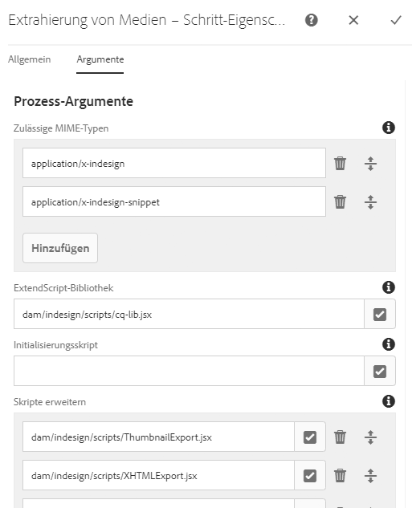
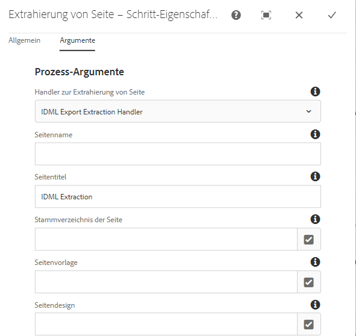
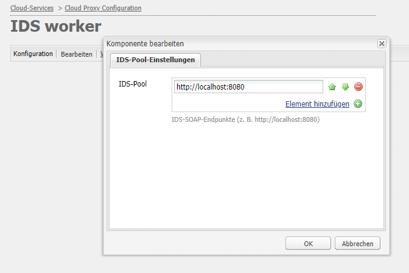

# Integration von [!DNL Adobe Experience Manager Assets] mit [!DNL Adobe InDesign Server] {#integrating-aem-assets-with-indesign-server}

[!DNL Adobe Experience Manager Assets] den:

* Einen Proxy für den Lastenausgleich bei der Verarbeitung bestimmter Aufgaben. Ein Proxy ist eine [!DNL Experience Manager]-Instanz, die mit einem Proxy Worker kommuniziert, um eine bestimmte Aufgabe zu erfüllen, und mit anderen [!DNL Experience Manager]-Instanzen, um die Ergebnisse bereitzustellen.
* Einen Proxy Worker zum Definieren und Verwalten einer bestimmten Aufgabe.
Diese können eine Vielzahl von Aufgaben abdecken; Beispielsweise mithilfe eines [!DNL InDesign Server] zur Verarbeitung von Dateien.

Um Dateien vollständig in [!DNL Experience Manager Assets] hochzuladen, die Sie mit [!DNL Adobe InDesign] erstellt haben, wird ein Proxy verwendet. Hierbei wird ein Proxy Worker verwendet, um mit [!DNL Adobe InDesign Server] zu kommunizieren, wobei [Skripte](https://www.adobe.com/devnet/indesign/documentation.html#idscripting) ausgeführt werden, um Metadaten zu extrahieren und verschiedene Ausgabedarstellungen für [!DNL Experience Manager Assets] zu generieren. Der Proxy Worker aktiviert die bidirektionale Kommunikation zwischen den [!DNL InDesign Server]- und den [!DNL Experience Manager]-Instanzen in einer Cloud-Konfiguration.

>[!NOTE]
>
>[!DNL Adobe InDesign] wird als zwei separate Angebote angeboten. [Adobe ](https://www.adobe.com/de/products/indesign.html) InDesign-Desktop-Programm, das zum Entwerfen von Seitenlayouts für den Druck und die digitale Distribution verwendet wird. [Adobe InDesign ](https://www.adobe.com/de/products/indesignserver.html) Server ermöglicht die programmgesteuerte Erstellung automatisierter Dokumente basierend auf dem, was Sie mit erstellt haben  [!DNL InDesign]. Sie fungiert als Dienst, der eine Schnittstelle zu ihrer [ExtendScript](https://www.adobe.com/devnet/scripting.html)-Engine anbietet. Die Skripte sind in [!DNL ExtendScript] geschrieben, was [!DNL JavaScript] ähnlich ist. Weitere Informationen zu [!DNL InDesign] Skripten finden Sie unter [https://www.adobe.com/devnet/indesign/documentation.html#idscripting](https://www.adobe.com/devnet/indesign/documentation.html#idscripting).

## Funktionsweise der Extraktion {#how-the-extraction-works}

[!DNL Adobe InDesign Server] kann in [!DNL Experience Manager Assets] integriert werden, sodass INDD-Dateien, die mit [!DNL InDesign] erstellt wurden, hochgeladen, Ausgabeformate generiert, alle Medien extrahiert (z. B. Video) und als Assets gespeichert werden können:

>[!NOTE]
>
>Frühere Versionen von [!DNL Experience Manager] konnten XMP und die Miniaturansicht extrahieren, jetzt können alle Medien extrahiert werden.

1. Laden Sie Ihre INDD-Datei auf [!DNL Experience Manager Assets] hoch.
1. Ein Framework sendet Befehlsskripte über SOAP (Simple Object Access Protocol) an [!DNL InDesign Server].
Dieses Befehlsskript führt folgende Aktionen aus:

   * Ruft die INDD-Datei ab.
   * Führen Sie [!DNL InDesign Server]-Befehle aus:

      * Struktur, Text und alle Mediendateien werden extrahiert.
      * PDF- und JPG-Ausgabeformate werden generiert.
      * HTML- und IDML-Ausgabeformate werden generiert.
   * Posten Sie die resultierenden Dateien zurück in [!DNL Experience Manager Assets].

   >[!NOTE]
   >
   >IDML ist ein XML-basiertes Format, das den gesamten Inhalt der Datei [!DNL InDesign] rendert. Sie wird als komprimiertes Paket mit der Komprimierung [ZIP](https://www.techterms.com/definition/zip) gespeichert. Weitere Informationen finden Sie unter [InDesign Interchange Formats INX and IDML](https://www.peachpit.com/articles/article.aspx?p=1381880&amp;seqNum=8).

   >[!CAUTION]
   >
   >Wenn [!DNL InDesign Server] nicht installiert oder konfiguriert ist, können Sie dennoch eine INDD-Datei in [!DNL Experience Manager] hochladen. Allerdings sind die generierten Ausgabeformate auf PNG und JPEG beschränkt und Sie können keine HTML- oder IDML-Dateien sowie keine Seitenausgabe generieren.

1. Nach der Extraktion und Ausgabegenerierung:

   * Die Struktur wird auf einer `cq:Page` repliziert (Ausgabetyp).
   * Der extrahierte Text und die Dateien werden in [!DNL Experience Manager Assets] gespeichert.
   * Alle Ausgabedarstellungen werden in [!DNL Experience Manager Assets] im Asset selbst gespeichert.

## Integrieren von [!DNL InDesign Server] in Experience Manager {#integrating-the-indesign-server-with-aem}

Um [!DNL InDesign Server] für die Verwendung mit [!DNL Experience Manager Assets] zu integrieren und nach der Konfiguration Ihres Proxys müssen Sie:

1. [Installieren Sie InDesign Server](#installing-the-indesign-server).
1. Falls erforderlich, konfigurieren Sie [den Experience Manager Assets Workflow](#configuring-the-aem-assets-workflow).
Dies ist nur dann notwendig, wenn die Standardwerte für Ihre Instanz nicht geeignet sind.
1. Konfigurieren Sie einen [Proxy Worker für InDesign Server](#configuring-the-proxy-worker-for-indesign-server).

### [!DNL InDesign Server] installieren {#installing-the-indesign-server}

So installieren und starten Sie [!DNL InDesign Server] zur Verwendung mit [!DNL Experience Manager]:

1. Laden Sie [!DNL InDesign Server] herunter und installieren Sie es.

1. Bei Bedarf können Sie die Konfiguration Ihrer [!DNL InDesign Server]-Instanz anpassen.

1. Starten Sie den Server über die Befehlszeile:

   `<*ids-installation-dir*>/InDesignServer.com -port 8080`

   Dadurch wird der Server mit dem SOAP-Plug-in gestartet, das Port 8080 abhört. Alle Protokollmeldungen und Ausgaben werden direkt im Befehlsfenster angezeigt.

   >[!NOTE]
   >
   >Wenn Sie die Ausgabemeldungen in einer Datei speichern möchten, müssen Sie dazu eine Umleitung verwenden, z. B. unter Windows:
   >`<ids-installation-dir>/InDesignServer.com -port 8080 > ~/temp/INDD-logfile.txt 2>&1`

### Workflow [!DNL Experience Manager Assets] konfigurieren {#configuring-the-aem-assets-workflow}

[!DNL Experience Manager Assets] verfügt über einen vorkonfigurierten Workflow  **[!UICONTROL DAM Update Asset]**, der mehrere Prozessschritte speziell für  [!DNL InDesign]Folgendes umfasst:

* [Extrahierung von Medien](#media-extraction)
* [Extrahierung von Seiten  ](#page-extraction)

Dieser Workflow wird mit Standardwerten konfiguriert, die für Ihr Setup in den verschiedenen Autoreninstanzen angepasst werden können. (Dies ist ein Standard-Workflow. Deshalb finden Sie weitere Information unter [Bearbeiten eines Workflows](/help/sites-developing/workflows-models.md#configuring-a-workflow-step).) Wenn Sie die Standardwerte (einschließlich SOAP-Port) verwenden, ist keine Konfiguration erforderlich.

Nach dem Setup wird beim Hochladen von [!DNL InDesign]-Dateien in [!DNL Experience Manager Assets] (durch eine der üblichen Methoden) der Workflow Trigger, das Asset zu verarbeiten und die verschiedenen Ausgabedarstellungen vorzubereiten. Testen Sie Ihre Konfiguration, indem Sie eine INDD-Datei in [!DNL Experience Manager Assets] hochladen, um sicherzustellen, dass Sie die verschiedenen Ausgabeformate sehen, die von IDS unter `<*your_asset*>.indd/Renditions` erstellt wurden.

#### Medienextraktion {#media-extraction}

Dieser Schritt steuert die Extrahierung von Medien aus der INDD-Datei.

Anpassungen können Sie im Schritt **[!UICONTROL Extrahierung von Medien]** auf der Registerkarte **[!UICONTROL Argumente]** vornehmen.

Argumente und Skriptpfade zum Extrahieren von Medien

* **ExtendScript-Bibliothek**: Dies ist eine einfache HTTP-GET/Post-Methodenbibliothek, die von anderen Skripten benötigt wird.

* **Skripten erweitern**: Hier können Sie unterschiedliche Skriptkombinationen angeben. Wenn Sie möchten, dass Ihre eigenen Skripte auf dem [!DNL InDesign Server] ausgeführt werden, speichern Sie die Skripte unter `/apps/settings/dam/indesign/scripts`.

<!-- TBD: Hiding this link since ADC is not available anymore. 
For information about [!DNL Adobe InDesign] scripts, see [InDesign developer documentation](https://www.adobe.com/devnet/indesign/documentation.html#idscripting).
-->

>[!CAUTION]
>
>Ändern Sie nicht die ExtendScript-Bibliothek. Diese Bibliothek bietet die HTTP-Funktionen, die für die Kommunikation mit Sling erforderlich sind. Diese Einstellung gibt die Bibliothek an, die zur Verwendung an [!DNL InDesign Server] gesendet werden soll.

Das Skript `ThumbnailExport.jsx`, das vom Workflow-Schritt &quot;Extrahierung von Medien&quot;ausgeführt wird, generiert eine Miniaturansicht im JPG-Format. Diese Ausgabedarstellung wird vom Workflow-Schritt &quot;Miniaturansichten verarbeiten&quot;verwendet, um die für [!DNL Experience Manager] erforderlichen statischen Ausgabedarstellungen zu generieren.

Sie können den Workflow-Schritt „Miniaturansichten verarbeiten“ so konfigurieren, dass statische Darstellungen in verschiedenen Größen generiert werden. Stellen Sie sicher, dass Sie die Standardwerte nicht entfernen, da sie für die [!DNL Experience Manager Assets]-Schnittstelle erforderlich sind. Schließlich entfernt der Workflow-Schritt Bildvorschau-Wiedergabe löschen die JPG-Miniaturansicht, da sie nicht mehr benötigt wird.

#### Seitenextraktion {#page-extraction}

Dadurch wird aus den extrahierten Elementen eine [!DNL Experience Manager]-Seite erstellt. Das Extrahieren von Daten aus einem Ausgabeformat (aktuell HTML oder IDML) erfolgt mithilfe eines Extrahierungshandlers. Diese Daten werden verwendet, um eine Seite mit PageBuilder zu erstellen.

Anpassungen können Sie im Schritt **[!UICONTROL Extrahierung von Seiten]** auf der Registerkarte **[!UICONTROL Argumente]** vornehmen.

* **Seitenextraktions-Handler**: Wählen Sie in der Popup-Liste den Handler aus, den Sie verwenden möchten. Ein Extrahierungs-Handler arbeitet mit einem bestimmten Ausgabeformat, das mit einem entsprechenden `RenditionPicker` ausgewählt wird (siehe `ExtractionHandler`-API). In einer standardmäßigen [!DNL Experience Manager]-Installation ist Folgendes verfügbar:
   * IDML-Export-Extraktionshandbuch: Bearbeitet das im Schritt MediaExtract generierte `IDML`-Ausgabeformat.

* **Seitenname**: Geben Sie den Namen an, den Sie der resultierenden Seite zuweisen möchten. Wenn Sie das Feld leer lassen, wird als Name „Seite“ gewählt (oder eine Ableitung, falls „Seite“ bereits vorhanden ist).

* **Seitentitel**: Geben Sie den Titel an, den Sie der resultierenden Seite zuweisen möchten.

* **Stammverzeichnis der Seite**: Der Pfad zum Stammverzeichnis der resultierenden Seite. Wenn Sie das Feld leer lassen, wird der Knoten mit den Ausgabeformaten des Assets verwendet.

* **Seitenvorlage**: Die Vorlage, die beim Generieren der resultierenden Seite verwendet werden soll.

* **Seitendesign**: Der Seitenentwurf, der beim Generieren der resultierenden Seite verwendet werden soll.

### Proxy Worker für [!DNL InDesign Server] konfigurieren {#configuring-the-proxy-worker-for-indesign-server}

>[!NOTE]
>
>Der Worker befindet sich in der Proxy-Instanz.

1. Erweitern Sie in der Tools-Konsole im linken Bereich den Eintrag **[!UICONTROL Cloud-Service-Konfigurationen]**. Anschließend erweitern Sie den Eintrag **[!UICONTROL Cloud-Proxy-Konfiguration]**.

1. Doppelklicken Sie auf den **[!UICONTROL IDS-Worker]**, um ihn für die Konfiguration zu öffnen.

1. Klicken Sie auf **[!UICONTROL Bearbeiten]**, um das Konfigurationsdialogfeld zu öffnen und die erforderlichen Einstellungen vorzunehmen:

   

   * **IDS**
PoolDie SOAP-Endpunkte, die für die Kommunikation mit der  [!DNL InDesign Server]verwendet werden sollen. Sie können Elemente nach Bedarf hinzufügen, entfernen und ordnen.

1. Klicken Sie zum Speichern auf „OK“.

### Konfigurieren von Day CQ Link Externalizer {#configuring-day-cq-link-externalizer}

Wenn sich die [!DNL InDesign Server] und [!DNL Experience Manager] auf unterschiedlichen Hosts befinden oder eine oder beide Anwendungen nicht an Standardanschlüssen funktionieren, konfigurieren Sie [!UICONTROL Day CQ Link Externalizer], um den Hostnamen, Port und Inhaltspfad für [!DNL InDesign Server] festzulegen.

1. Rufen Sie die Web-Konsole unter `https://[aem_server]:[port]/system/console/configMgr` auf.
1. Suchen Sie die Konfiguration **[!UICONTROL Day CQ Link Externalizer]**. Klicken Sie auf **[!UICONTROL Bearbeiten]** , um zu öffnen.
1. Die Einstellungen von Link Externalizer helfen beim Erstellen absoluter URLs für die [!DNL Experience Manager] -Implementierung und für [!DNL InDesign Server]. Verwenden Sie das Feld **[!UICONTROL Domains]** , um den Hostnamen für [!DNL Adobe InDesign Server] anzugeben. Klicken Sie auf **Speichern**.

   In absoluten URLs müssen Sie `localhost` als Hostnamen für Ihre lokalen, Autoren- und Veröffentlichungsinstanzen verwenden.

   

### Aktivieren der parallelen Auftragsverarbeitung für [!DNL InDesign Server] {#enabling-parallel-job-processing-for-indesign-server}

Sie können jetzt die parallele Auftragsverarbeitung für IDS aktivieren. Bestimmen Sie die maximale Anzahl paralleler Aufträge (`x`), die von [!DNL InDesign Server] verarbeitet werden können:

* Auf einem einzelnen Multiprozessorcomputer ist die maximale Anzahl von parallelen Aufträgen (`x`), die ein [!DNL InDesign Server] verarbeiten kann, eine weniger als die Anzahl der Prozessoren, auf denen IDS ausgeführt wird.
* Wenn Sie IDS auf mehreren Computern ausführen, müssen Sie von der Gesamtanzahl der verfügbaren Prozessoren (auf allen Computern) die Gesamtanzahl der Computer abziehen.

So konfigurieren Sie die Anzahl der parallelen IDS-Aufträge:

1. Öffnen Sie die Registerkarte **[!UICONTROL Konfigurationen]** der Felix-Konsole. Beispiel:   `https://[aem_server]:[port]/system/console/configMgr`.

1. Wählen Sie die IDS-Verarbeitungsschlange unter `Apache Sling Job Queue Configuration`.

1. Satz:

   * **Typ** - `Parallel`
   * **Maximal parallel ausführbare Aufträge** –`<*x*>` (Berechnung siehe oben)

1. Speichern Sie diese Änderungen.
1. Um die Unterstützung für mehrere Sitzungen für Adobe CS6 und höher zu aktivieren, aktivieren Sie das Kontrollkästchen `enable.multisession.name` unter `com.day.cq.dam.ids.impl.IDSJobProcessor.name` -Konfiguration.
1. Erstellen Sie einen [Pool von`x` IDS-Workern, indem Sie SOAP-Endpunkte zur IDS-Worker-Konfiguration](#configuring-the-proxy-worker-for-indesign-server) hinzufügen.

   Wenn mehrere Computer mit [!DNL InDesign Server] ausgeführt werden, fügen Sie SOAP-Endpunkte (Anzahl der Prozessoren pro Computer -1) für jeden Computer hinzu.

<!-- 
TBD: Make updates to configurations for allow and block list after product updates are done.
-->

>[!NOTE]
>
>Wenn Sie mit einem Pool von Mitarbeitern arbeiten, können Sie die Blockierungsliste von IDS-Arbeitern aktivieren.
>
>Aktivieren Sie dazu das Kontrollkästchen **[!UICONTROL enable.retry.name]** unter der `com.day.cq.dam.ids.impl.IDSJobProcessor.name`-Konfiguration, das Wiederholungen von IDS-Aufträgen ermöglicht.
>
>Legen Sie außerdem unter der `com.day.cq.dam.ids.impl.IDSPoolImpl.name`-Konfiguration einen positiven Wert für den Parameter `max.errors.to.blacklist` fest, der die Anzahl der Auftragswiederholungen bestimmt, bevor ein IDS aus der Auftrags-Handler-Liste ausgeschlossen wird.
>
>Standardmäßig wird der IDS-Worker nach der konfigurierbaren (`retry.interval.to.whitelist.name`) Zeit in Minuten erneut validiert. Wenn der Worker online gefunden wird, wird er aus der Blockierungsliste entfernt.

## Unterstützung für [!DNL InDesign Server] 10.0 oder höher aktivieren {#enabling-support-for-indesign-server-or-later}

Führen Sie für [!DNL InDesign Server] 10.0 oder höher die folgenden Schritte aus, um die Unterstützung für mehrere Sitzungen zu aktivieren.

1. Öffnen Sie Configuration Manager über Ihre [!DNL Experience Manager Assets]-Instanz `https://[aem_server]:[port]/system/console/configMgr`.
1. Bearbeiten Sie die Konfiguration `com.day.cq.dam.ids.impl.IDSJobProcessor.name`.
1. Aktivieren Sie die Option **[!UICONTROL ids.cc.enable]** und klicken Sie auf **[!UICONTROL Speichern]**.

>[!NOTE]
>
>Verwenden Sie für die Integration von [!DNL InDesign Server] mit [!DNL Experience Manager Assets] einen Multicore-Prozessor, da die für die Integration erforderliche Sitzungsunterstützungsfunktion auf einzelnen Kernsystemen nicht unterstützt wird.

## Konfigurieren von [!DNL Experience Manager]-Anmeldedaten {#configure-aem-credentials}

Sie können die standardmäßigen Administratorberechtigungen (Benutzername und Kennwort) für den Zugriff auf [!DNL InDesign Server] aus Ihrer [!DNL Experience Manager]-Implementierung ändern, ohne die Integration mit [!DNL InDesign Server] zu unterbrechen.

1. Wechseln zu `/etc/cloudservices/proxy.html`.
1. Geben Sie in diesem Dialogfeld den neuen Benutzernamen und das Kennwort ein.
1. Speichern Sie die Anmeldedaten.

>[!MORELIKETHIS]
>
>* [Über Adobe InDesign Server](https://www.adobe.com/products/indesignserver/faq.html)

