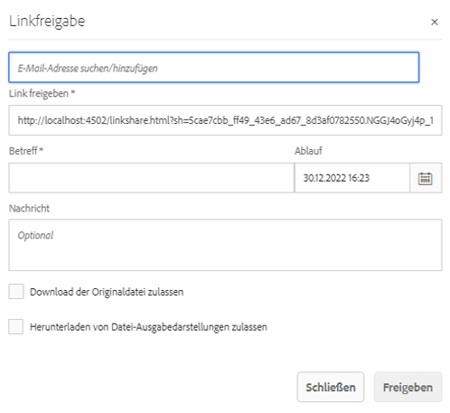
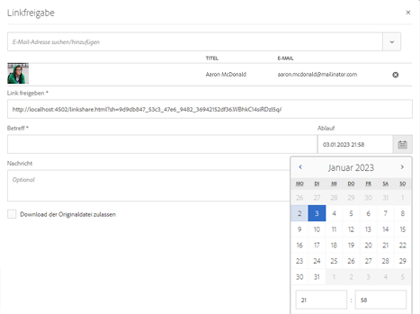
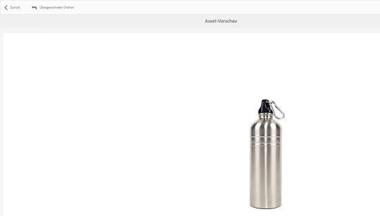
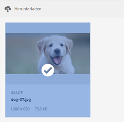

# Asset als Link freigeben {#asset-link-sharing}

[!DNL Adobe Experience Manager Assets]Mit können Sie Assets, Ordner und Sammlungen als URL für Mitglieder Ihres Unternehmens und externe Einheiten (z. B. Partner und Anbieter) freigeben. Die Freigabe von Assets über einen Link ist eine praktische Methode, um Ressourcen für externe Parteien verfügbar zu machen, ohne dass diese sich zuerst bei anmelden müssen. [!DNL Assets].

>[!PREREQUISITES]
>
>* Sie benötigen `Edit ACL` -Berechtigung für den Ordner oder das Asset, das Sie als Link freigeben möchten.
>* Um E-Mails an die Benutzer zu senden, konfigurieren Sie die SMTP-Serverdetails unter [Day CQ Mail Service](#configmailservice).

## Freigeben von Assets {#share-assets}

Um die URL für Assets zu generieren, die Sie für Benutzer freigeben möchten, verwenden Sie die [!UICONTROL Linkfreigabe] angezeigt.

* Benutzer mit Administratorrechten oder mit Leserechten unter `/var/dam/share` -Speicherort können die für sie freigegebenen Links anzeigen.
* Benutzer mit Leserechten für `/var/dam/jobs/download` -Speicherort können Assets aus dem freigegebenen Link herunterladen.

1. Wählen Sie in der [!DNL Assets]-Benutzeroberfläche das Asset aus, das als Link freigegeben werden soll.

1. Klicken Sie in der Symbolleiste auf die **[!UICONTROL Link freigeben]** . Der Link, der nach dem Klicken auf **[!UICONTROL Freigeben]** wird im Voraus im [!UICONTROL Link freigeben] -Feld. Der Link wird erst erstellt, wenn Sie **[!UICONTROL Einsenden]**.

   

   *Abbildung: Das Dialogfeld zum Freigeben von Assets als Link.*

1. Geben Sie im Dialogfeld **[!UICONTROL Linkfreigabe]** in das Feld „E-Mail-Adresse“ die E-Mail-ID des Benutzers ein, für den Sie den Link freigeben möchten. Sie können einen oder mehrere Benutzer hinzufügen.

   >[!NOTE]
   >
   >Wenn Sie eine E-Mail-ID eines Benutzers eingeben, der nicht Mitglied Ihres Unternehmens ist, werden die folgenden Wörter [!UICONTROL Externer Benutzer] mit dem Präfix der E-Mail-ID des Benutzers versehen.

1. Geben Sie in das Feld **[!UICONTROL Betreff]** einen Betreff für das freizugebende Asset ein.

1. Geben Sie im Feld **[!UICONTROL Meldung]** eine optionale Meldung ein.

1. Im **[!UICONTROL Ablauf]** -Feld ein Ablaufdatum und eine Ablaufuhrzeit angeben, damit der Link nicht mehr funktioniert. Die Standard-Ablaufzeit für den Link beträgt einen Tag.

   

1. Wenn Benutzer das Original-Asset herunterladen möchten, wählen Sie **[!UICONTROL Download der Originaldatei zulassen]**. Wenn Benutzer nur die Ausgabeformate der freigegebenen Assets herunterladen möchten, wählen Sie **[!UICONTROL Herunterladen von Ausgabeformaten der Datei zulassen]**.

1. Klicken Sie auf **[!UICONTROL Freigeben]**. Eine Meldung bestätigt, dass der Link per E-Mail für die Benutzer freigegeben wurde.

1. Um das freigegebene Asset anzuzeigen, klicken Sie auf den Link in der E-Mail, die an den Benutzer gesendet wird. Um eine Vorschau des Assets zu generieren, klicken Sie auf das freigegebene Asset. Um die Vorschau zu schließen, klicken Sie auf **[!UICONTROL Zurück]**. Wenn Sie einen Ordner freigegeben haben, klicken Sie auf **[!UICONTROL Übergeordneter Ordner]** , um zum übergeordneten Ordner zurückzukehren.

   

   >[!NOTE]
   >
   >[!DNL Experience Manager] unterstützt nur das Generieren der Asset-Vorschau von [die unterstützten Dateitypen](/help/assets/assets-formats.md). Wenn andere MIME-Typen freigegeben sind, können Sie nur die Assets herunterladen und keine Vorschau anzeigen.

1. Um das freigegebene Asset herunterzuladen, klicken Sie auf **[!UICONTROL Auswählen]** Klicken Sie in der Symbolleiste auf das Asset und klicken Sie dann auf **[!UICONTROL Download]** aus der Symbolleiste.

   

1. Um die Assets anzuzeigen, die Sie als Links freigegeben haben, gehen Sie zu [!DNL Assets] und klicken Sie auf [!DNL Experience Manager] Logo. Auswählen **[!UICONTROL Navigation]**. Wählen Sie im Navigationsfenster die Option **[!UICONTROL Freigegebene Links]** , um eine Liste der freigegebenen Assets anzuzeigen.

1. Um die Freigabe eines Assets aufzuheben, wählen Sie es aus und klicken Sie auf **[!UICONTROL Freigabe aufheben]** aus der Symbolleiste. Es folgt eine Bestätigungsmeldung. Der Eintrag für das Asset wird aus der Liste entfernt.

## Konfigurieren von Day CQ Mail Service {#configure-day-cq-mail-service}

1. Im [!DNL Experience Manager] Startseite, navigieren Sie zu **[!UICONTROL Instrumente]** > **[!UICONTROL Aktivitäten]** > **[!UICONTROL Web-Konsole]**.
1. Wählen Sie in der Liste der Dienste **[!UICONTROL Day CQ Mail Service]** aus.
1. Klicken **[!UICONTROL Bearbeiten]** neben dem Dienst und konfigurieren Sie die folgenden Parameter für **[!UICONTROL Day CQ Mail Service]** mit den genannten Angaben unter ihren Namen:

   * SMTP-Server-Hostname: email server host name
   * SMTP-Server-Anschluss: email server port
   * SMTP-Benutzer: email server user name
   * SMTP-Kennwort: email server password

   

1. Klicken Sie auf **[!UICONTROL Speichern]**.

## Konfigurieren der maximal zulässigen Datengröße  {#configure-maximum-data-size}

Wenn Sie Assets von dem Link herunterladen, der über die Funktion &quot;Linkfreigabe&quot;freigegeben wurde, [!DNL Experience Manager] komprimiert die Asset-Hierarchie aus dem Repository und gibt dann das Asset in einer ZIP-Datei zurück. Da jedoch die Datenmenge, die in einer ZIP-Datei komprimiert werden kann, nicht begrenzt wird, kann es bei großen komprimierten Datenmengen zu Speicherfehlern in JVM kommen. Um das System vor einem damit zusammenhängenden potenziellen DoS-Angriff zu schützen, konfigurieren Sie die Maximalgröße mithilfe des Parameters **[!UICONTROL Maximale Größe von Inhalten (unkomprimiert)]** für das Day CQ DAM Adhoc Asset Share Proxy Servlet in Configuration Manager. **** Wenn die unkomprimierte Größe des Assets den konfigurierten Wert überschreitet, werden Asset-Download-Anfragen abgelehnt. Der Standardwert lautet 100 MB.

1. Klicken Sie auf [!DNL Experience Manager] Logo und gehen Sie dann zu **[!UICONTROL Instrumente]** > **[!UICONTROL Aktivitäten]** > **[!UICONTROL Web-Konsole]**.
1. Suchen Sie in der Web-Konsole die **[!UICONTROL Day CQ DAM Adhoc Asset Share Proxy Servlet]** Konfiguration.
1. Öffnen Sie die Konfiguration **[!UICONTROL Day CQ DAM Adhoc Asset Share Proxy Servlet]** im Bearbeitungsmodus und ändern Sie den Wert des Parameters **[!UICONTROL Maximale Größe von Inhalten (unkomprimiert)]**.

   

1. Speichern Sie die Änderungen.

## Best Practices und Fehlerbehebung {#best-practices-and-troubleshooting}

* Asset-Ordner oder Sammlungen, die ein Leerzeichen im Namen enthalten, werden möglicherweise nicht freigegeben.
* Wenn Benutzer die freigegebenen Assets nicht herunterladen können, fragen Sie bei Ihrer [!DNL Experience Manager] Administrator, was die [Download-Beschränkungen](#configure-maximum-data-size) sind.
* Wenn Sie keine E-Mail mit Links zu freigegebenen Assets senden können oder die anderen Benutzer Ihre E-Mail nicht empfangen können, fragen Sie bei Ihrer [!DNL Experience Manager] Administrator , wenn die [E-Mail-Dienst](#configure-day-cq-mail-service) konfiguriert ist oder nicht.
* Wenn Sie Assets nicht mit der Funktion zum Freigeben von Links freigeben können, stellen Sie sicher, dass Sie über die entsprechenden Berechtigungen verfügen. Siehe [Freigeben von Assets](#share-assets).
* Wenn ein freigegebenes Asset an einen anderen Speicherort verschoben wird, funktioniert der Link zum Asset nicht mehr. Erstellen Sie den Link erneut und geben Sie ihn für die Benutzer frei.

* Wenn Sie Links von Ihrer [!DNL Experience Manager] Autorenbereitstellung für externe Entitäten stellen Sie sicher, dass Sie nur die folgenden URLs verfügbar machen, die für die Linkfreigabe verwendet werden, zum Beispiel `GET` -Anfragen. Blockieren Sie aus Sicherheitsgründen andere URLs.

   * `http://[aem_server]:[port]/linkshare.html`
   * `http://[aem_server]:[port]/linksharepreview.html`
   * `http://[aem_server]:[port]/linkexpired.html`
   In [!DNL Experience Manager] Benutzeroberfläche, Zugriff **[!UICONTROL Instrumente]** > **[!UICONTROL Aktivitäten]** > **[!UICONTROL Web-Konsole]**. Öffnen Sie die **[!UICONTROL Day CQ Link Externalizer]** Konfiguration und Änderung der folgenden Eigenschaften in der **[!UICONTROL Domänen]** mit den Werten, die gegen erwähnt werden `local`, `author`und `publish`. Für `local` und `author` -Eigenschaften die URL für die lokale und die Autoreninstanz angeben. Wenn Sie eine [!DNL Experience Manager] Autoreninstanz verwenden denselben Wert für `local` und `author` Eigenschaften. Geben Sie für Veröffentlichungsinstanzen die URL der [!DNL Experience Manager] Veröffentlichungsinstanz.
