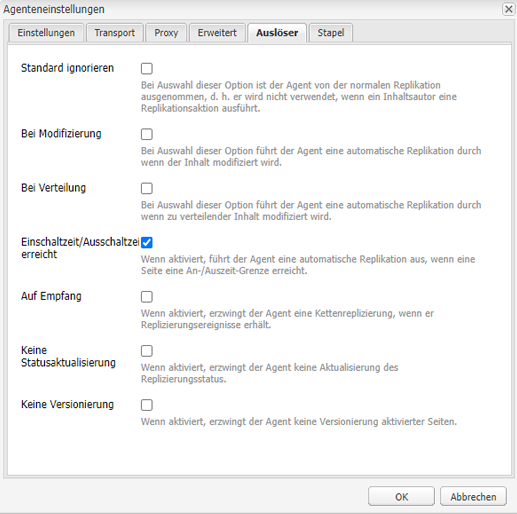

# Verwalten digitaler Assets {#manage-digital-assets}

| Version | Artikel-Link |
| -------- | ---------------------------- |
| AEM as a Cloud Service | [Hier klicken](https://experienceleague.adobe.com/docs/experience-manager-cloud-service/content/assets/manage/manage-digital-assets.html?lang=de) |
| AEM 6.5 | Dieser Artikel |

In [!DNL Adobe Experience Manager Assets] können Sie nicht nur Assets speichern und steuern. [!DNL Experience Manager] bietet Asset-Management-Funktionen auf Unternehmensniveau. Sie können Assets bearbeiten und freigeben, erweiterte Suchen durchführen und mehrere Ausgabedarstellungen von Dutzenden von unterstützten Dateiformaten erstellen. Sie können auch Versionen und digitale Rechte verwalten, die Verarbeitung von Assets automatisieren, Metadaten verwalten und steuern, Anmerkungen für die Zusammenarbeit nutzen und vieles mehr.

In diesem Artikel werden grundlegende Asset-Management-Aufgaben wie das Erstellen oder Hochladen, Metadatenaktualisierungen; Kopieren, Verschieben und Löschen; Veröffentlichen, Rückgängigmachen der Veröffentlichung und Suchen von Assets beschrieben. Informationen zur Benutzeroberfläche finden Sie unter [Erste Schritte mit der Assets-Benutzeroberfläche](/help/sites-authoring/basic-handling.md). Informationen zum Verwalten von Inhaltsfragmenten finden Sie unter [Verwalten von Inhaltsfragmenten](/help/assets/content-fragments/content-fragments-managing.md).

## Erstellen von Ordnern {#creating-folders}

Wenn Sie eine Sammlung von Assets organisieren, etwa alle `Nature`-Aufnahmen, können Sie Ordner erstellen, um diese zu gruppieren. Mit Ordnern können Sie Assets kategorisieren und organisieren. Bei [!DNL Experience Manager Assets] müssen Sie Assets nicht in Ordner organisieren, um besser zu arbeiten.

>[!NOTE]
>
>* Die Freigabe eines [!DNL Assets]-Ordners vom Typ `sling:OrderedFolder` wird bei der Weitergabe an Experience Cloud nicht unterstützt. Wenn Sie einen Ordner freigeben möchten, wählen Sie beim Erstellen eines Ordners nicht [!UICONTROL Geordnet] aus.
>* In [!DNL Experience Manager] ist die Verwendung von `subassets` als Ordnername nicht zulässig. Dieses Keyword ist für Knoten reserviert, die Unter-Assets für ebenenübergreifende Assets enthalten.

1. Navigieren Sie zu dem Ort in Ihrem Ordner „Digitale Assets“, an dem Sie einen neuen Ordner erstellen möchten. Klicken Sie im Menü auf **[!UICONTROL Erstellen]**. Wählen Sie **[!UICONTROL Neuer Ordner]** aus.
1. Geben Sie in das Feld **[!UICONTROL Titel]** einen Ordnernamen an. Standardmäßig verwendet DAM den von Ihnen als Ordnernamen angegebenen Titel. Wenn der Ordner erstellt wurde, können Sie die Standardeinstellung überschreiben und einen anderen Ordnernamen angeben.
1. Klicken Sie auf **[!UICONTROL Erstellen]**. Ihr Ordner wird im Ordner „Digitale Assets“ angezeigt.

Die folgenden Zeichen (in der Liste durch Leerzeichen getrennt) werden nicht unterstützt:

* Der Name einer Asset-Datei darf keines der folgenden Zeichen enthalten: `* / : [ \\ ] | # % { } ? &`
* Der Name eines Asset-Ordners darf keines der folgenden Zeichen enthalten: `* / : [ \\ ] | # % { } ? \" . ^ ; + & \t`

Schließen Sie keine Sonderzeichen in die Erweiterungen der Asset-Dateinamen ein.

## Hochladen von Assets {#uploading-assets}

<!-- TBD the following:
Move this section into a new article. CQDOC-14874 ticket is created for this.
In this complete article, replace emphasis with UICONTROL where appropriate.
-->

Sie können verschiedene Arten von Assets (z. B. Bilder, PDF-Dateien, Raw-Dateien usw.) von Ihrem lokalen Ordner oder Netzlaufwerk in [!DNL Experience Manager Assets] hochladen. 

>[!NOTE]
>
>Im Modus „Dynamic Media – Scene7“ beträgt die Standardgröße der Asset-Upload-Datei höchstens 2 GB. Informationen zum Konfigurieren des Uploads von Assets mit einer Größe zwischen 2 GB und 15 GB finden Sie unter [(Optional) Konfigurieren des Dynamic Media-Scene7-Modus für das Hochladen von Assets mit mehr als 2 GB](/help/assets/config-dms7.md#optional-config-dms7-assets-larger-than-2gb).

>[!IMPORTANT]
>
>Assets, die Sie in Experience Manager hochladen und deren Dateiname 100 Zeichen überschreitet, haben einen gekürzten Namen, wenn sie in Dynamic Media verwendet werden.
>
>Die ersten 100 Zeichen des Dateinamens werden unverändert verwendet; die restlichen Zeichen werden durch eine alphanumerische Zeichenfolge ersetzt. Diese Umbenennungsmethode stellt einen eindeutigen Namen sicher, wenn das Asset in Dynamic Media verwendet wird. Sie soll auch die maximale Länge der Asset-Dateinamen berücksichtigen, die in Dynamic Media zulässig ist.

Sie können Assets mit oder ohne zugewiesenes Verarbeitungsprofil in Ordner hochladen.

Für Ordner mit zugewiesenem Verarbeitungsprofil wird der Profilname in der Miniatur der Kartenansicht angezeigt. In der Listenansicht wird der Profilname in der Spalte **Verarbeitungsprofil** angezeigt. Siehe [Verarbeitungsprofile](/help/assets/processing-profiles.md).

Bevor Sie ein Asset hochladen, stellen Sie sicher, dass das [Format](/help/assets/assets-formats.md) von [!DNL Experience Manager Assets] unterstützt wird.

1. Navigieren Sie in der [!DNL Assets]-Benutzeroberfläche zu dem Speicherort, an dem Sie digitale Assets hinzufügen möchten.
1. Führen Sie einen der folgenden Schritte aus, um die Assets hochzuladen:

   * Klicken Sie auf der Symbolleiste auf **[!UICONTROL Erstellen]**. Klicken Sie dann im Menü auf **[!UICONTROL Dateien]**. Sie können die Datei im angezeigten Dialogfeld bei Bedarf umbenennen.
   * Ziehen Sie die Assets in einem Browser, der HTML5 unterstützt, direkt auf die [!DNL Assets]-Benutzeroberfläche. Das Dialogfeld zum Umbenennen der Datei wird nicht angezeigt.

   

   Wenn Sie mehrere Dateien auswählen möchten, markieren Sie die Assets im Dialogfeld für die Dateiauswahl bei gedrückter `Ctrl`- oder `Command`-Taste. Bei Verwendung eines iPads können Sie jeweils nur eine Datei auswählen.

   Sie können das Hochladen von großen Assets (größer als 500 MB) anhalten und später von der gleichen Seite aus fortsetzen. Klicken Sie neben der Fortschrittsleiste, die angezeigt wird, wenn ein Upload beginnt, auf **[!UICONTROL Anhalten]**.

   

Die Größe, ab der ein Asset als großes Asset gilt, lässt sich konfigurieren. Beispielsweise können Sie das System so konfigurieren, dass Assets über 1000 MB (anstelle von 500 MB) als große Assets betrachtet werden. In diesem Fall wird **[!UICONTROL Pause]** in der Fortschrittsleiste angezeigt, wenn Assets hochgeladen werden, die größer als 1000 MB sind.

Die Option [!UICONTROL Pause] wird nicht angezeigt, wenn eine Datei, die größer ist als 1000 MB, mit einer Datei hochgeladen wird, die kleiner ist als 1000 MB. Wenn Sie jedoch den Upload der Datei abbrechen, die kleiner ist als 1000-MB, wird die Option **[!UICONTROL Pause]** angezeigt.

Um die Größenbegrenzung zu ändern, konfigurieren Sie die Eigenschaft `chunkUploadMinFileSize` des Knotens `fileupload` im CRX-Repository, das unter `/apps/dam/gui/content/assets/jcr:content/actions/secondary/create/items/fileupload` verfügbar ist.

Wenn Sie auf **[!UICONTROL Anhalten]** klicken, wird stattdessen die Option **[!UICONTROL Play]** angezeigt. Um den Upload fortzusetzen, klicken Sie auf **[!UICONTROL Play]**.

Um einen laufenden Upload abzubrechen, klicken Sie auf „Schließen“ (`X`) neben der Fortschrittsleiste. Wenn Sie den Upload abbrechen, löscht [!DNL Assets] den teilweise hochgeladenen Teil des Assets.

Die Möglichkeit, den Upload fortzusetzen, ist insbesondere in Szenarien mit geringer Bandbreite und Netzwerkfehlern hilfreich, in denen das Hochladen großer Assets lange dauert. Sie können den Upload-Vorgang anhalten und später fortfahren, wenn sich die Situation verbessert. Wenn Sie fortfahren, beginnt der Upload an dem Punkt, an dem Sie den Upload pausiert haben.

Während des Uploads speichert [!DNL Experience Manager] die Teile des hochgeladenen Assets als Datenblöcke im CRX-Repository. Wenn der Upload abgeschlossen ist, konsolidiert [!DNL Experience Manager] diese Blöcke in einem einzelnen Datenblock im Repository.

Die Bereinigungsaufgabe für nicht abgeschlossene Chunkupload-Aufträge können Sie unter `https://[aem_server]:[port]/system/console/configMgr/org.apache.sling.servlets.post.impl.helper.ChunkCleanUpTask` konfigurieren.

>[!CAUTION]
>
>Der Chunkupload wird ausgelöst, wenn der Standardwert 500 MB und die Chunk-Größe 50 MB beträgt. Wenn Sie [Apache Jackrabbit Oak TokenConfiguration](https://experienceleague.adobe.com/docs/experience-cloud-kcs/kbarticles/KA-16464.html?lang=de) bearbeiten und `timeout configuration` auf eine kürzere Zeit festlegen, als für das Hochladen eines Assets erforderlich ist, tritt während des Hochladens des Assets ein Sitzungs-Timeout auf. Ändern Sie daher `chunkUploadMinFileSize` und `chunksize` so, dass die Sitzung bei jeder Chunk-Anfrage aktualisiert wird.
>
>Angesichts des Ablauf-Timeouts für Anmeldedaten, Latenz, Bandbreite und erwarteten gleichzeitigen Uploads wird der höchste Wert gewählt, mit dem Folgendes erreicht wird:
>
>* Dass der Chunk-Upload für Dateien aktiviert wird, deren Größe während des Uploads wahrscheinlich zum Ablauf der Anmeldedaten führt.
>
>* Dass jeder Chunk abgeschlossen wird, bevor die Anmeldedaten ablaufen.

Wenn Sie ein Asset unter einem Namen hochladen, der bereits für ein Asset am Zielort verwendet wird, wird eine Warnmeldung angezeigt.

Sie können festlegen, ob ein vorhandenes Asset ersetzt, eine neue Version erstellt oder beide Assets beibehalten werden sollen, indem Sie das neue hochgeladene Asset umbenennen. Wenn Sie ein vorhandenes Asset ersetzen, werden die Metadaten für das Asset und alle vorherigen Änderungen (z. B. Anmerkungen oder Zuschnitte), die Sie am vorhandenen Asset vorgenommen haben, gelöscht. Wenn Sie sich dafür entscheiden, beide Assets zu behalten, wird das neue Asset umbenannt und die Ziffer `1` an den Namen angehängt.


>[!NOTE]
>
>Wenn Sie im Dialogfeld [!UICONTROL Namenskonflikt] die Option **[!UICONTROL Ersetzen]** auswählen, wird die Asset-ID für das neue Asset neu generiert. Diese ID unterscheidet sich von der ID des vorherigen Assets.
>
>Wenn Asset Insights zur Verfolgung von Impressionen oder Klicks mit [!DNL Adobe Analytics] aktiviert ist, werden die für das Asset in [!DNL Analytics] erfassten Daten durch die erneut generierte Asset-ID ungültig.

Wenn das hochgeladene Asset in [!DNL Assets] vorhanden ist, werden Sie im Dialogfeld **[!UICONTROL Duplikate gefunden]** darauf hingewiesen, dass Sie versuchen, ein doppeltes Asset hochzuladen. Das Dialogfeld wird nur angezeigt, wenn der `SHA 1`-Prüfsummenwert der Binärdatei des bestehenden Assets dem des Assets entspricht, das Sie gerade hochladen. In diesem Fall sind die Namen der Assets nicht von Bedeutung.

>[!NOTE]
>
>Das Dialogfeld [!UICONTROL Duplikate gefunden] wird nur angezeigt, wenn die Funktion zur Duplikatserkennung aktiviert ist. Informationen zum Aktivieren der Funktion zur Duplikatserkennung finden Sie unter [Aktivieren der Duplikatserkennung](/help/assets/duplicate-detection.md).


Um das doppelte Asset in [!DNL Assets] beizubehalten, klicken Sie auf **[!UICONTROL Behalten]**. Tippen oder klicken Sie auf **[!UICONTROL Löschen]**, um das doppelte Asset zu löschen, das Sie gerade hochgeladen haben.

[!DNL Experience Manager Assets] verhindert, dass Sie Assets hochladen, deren Dateinamen unzulässige Zeichen enthalten. Wenn Sie versuchen, ein Asset mit einem Dateinamen mit einem oder mehreren nicht zulässigen Zeichen hochzuladen, zeigt [!DNL Assets] eine Warnmeldung an und stoppt den Upload, bis Sie diese Zeichen entfernen oder mit einem zulässigen Namen hochladen.

Um bestimmte Dateibenennungskonventionen für Ihre Organisation einzuhalten, können Sie im Dialogfeld [!UICONTROL Assets hochladen] lange Namen für die Dateien angeben, die Sie hochladen möchten.

Allerdings werden die folgenden Zeichen (in der Liste durch Leerzeichen getrennt) nicht unterstützt:

* Der Asset-Dateiname darf nicht enthalten: `* / : [ \\ ] | # % { } ? &`
* Der Asset-Ordnername darf nicht enthalten: `* / : [ \\ ] | # % { } ? \" . ^ ; + & \t`

Schließen Sie keine Sonderzeichen in die Erweiterungen der Asset-Dateinamen ein.


Darüber hinaus zeigt die [!DNL Assets]-Benutzeroberfläche das zuletzt hochgeladene Asset oder den Ordner an, den Sie zuerst erstellt haben.

Wenn Sie den Upload abbrechen, bevor die Dateien hochgeladen sind, unterbricht [!DNL Assets] den Upload der aktuellen Datei und aktualisiert den Inhalt. Dateien, die bereits hochgeladen wurden, werden jedoch nicht gelöscht.

Das Dialogfeld für den Upload-Fortschritt in [!DNL Assets] zeigt die Anzahl der erfolgreich hochgeladenen Dateien und die der Dateien an, die nicht hochgeladen werden konnten.

### Serielle Uploads {#serialuploads}

Das gleichzeitige Hochladen einer Vielzahl von Assets verbraucht erhebliche E/A-Ressourcen, was sich negativ auf die Leistung Ihrer [!DNL Assets]-Bereitstellung auswirken kann. Insbesondere bei einer langsamen Internetverbindung erhöht sich die Ladezeit aufgrund einer Auslastungsspitze beim Festplatten-E/A erheblich. Von Ihrem Webbrowser können weitere Einschränkungen auferlegt werden, die die Anzahl der POST-Anfragen betreffen, die [!DNL Assets] für gleichzeitige Asset-Uploads verarbeiten kann. Fehler oder ein vorzeitiger Abbruch des Upload-Vorgangs können die Folge sein. Es kann also vorkommen, dass in [!DNL Experience Manager Assets] bei der Erfassung großer Dateienmengen einige Dateien verloren gehen oder der Erfassungsvorgang insgesamt nicht ausgeführt werden kann.

Um diese Situation zu vermeiden, gibt es die Möglichkeit, Ladevorgänge im Stapelmodus seriell durchzuführen. Dabei werden in die Assets nicht gleichzeitig, sondern einzeln nacheinander von [!DNL Assets] erfasst.

Der serielle Upload von Assets ist standardmäßig aktiviert. Um die Funktion zu deaktivieren und gleichzeitiges Hochladen zuzulassen, überlagern Sie den `fileupload`-Knoten in Crx-de und setzen den Wert der Eigenschaft `parallelUploads` auf `true`.

### Hochladen von Assets per FTP {#uploading-assets-using-ftp}

Dynamic Media ermöglicht das stapelweise Hochladen von Assets über FTP-Server. Wenn Sie große Assets (über 1 GB) oder ganze Ordner und Unterordner hochladen möchten, sollten Sie FTP verwenden. Sie können das Hochladen per FTP auch einrichten, um Uploads regelmäßig und nach Plan durchzuführen.

>[!NOTE]
>
>Im Modus „Dynamic Media – Scene7“ beträgt die Standardgröße der Asset-Upload-Datei höchstens 2 GB. Informationen zum Konfigurieren des Uploads von Assets mit einer Größe zwischen 2 GB und 15 GB finden Sie unter [(Optional) Konfigurieren des Dynamic Media-Scene7-Modus für das Hochladen von Assets mit mehr als 2 GB](/help/assets/config-dms7.md#optional-config-dms7-assets-larger-than-2gb).

>[!NOTE]
>
>Um Assets über FTP im Modus „Dynamic Media – Scene7“ hochzuladen, installieren Sie Feature Pack 18912 auf den [!DNL Experience Manager]-Autoreninstanzen. Wenden Sie sich an den [Adobe-Support](https://experienceleague.adobe.com/?support-solution=General&amp;lang=de#support), um auf FP-18912 zugreifen zu können, und schließen Sie das Setup Ihres FTP-Kontos ab. Weitere Informationen finden Sie unter [Installieren von Feature Pack 18912 für die Massenmigration von Assets](/help/assets/bulk-ingest-migrate.md).
>
>Die in [!DNL Experience Manager] angegebenen Upload-Einstellungen werden ignoriert, wenn Sie FTP zum Hochladen von Assets verwenden. Stattdessen werden Dateiverarbeitungsregeln, wie in Dynamic Media Classic definiert, verwendet.    

**So laden Sie Assets per FTP hoch**

1. Melden Sie sich mit Ihrem FTP-Client unter Verwendung des FTP-Benutzernamens und des Passworts, den Sie aus der Bereitstellungs-E-Mail erhalten haben, beim FTP-Server an. Laden Sie im FTP-Client Dateien oder Ordner auf den FTP-Server hoch.

1. Öffnen Sie das [Dynamic Media Classic-Desktop-Programm](https://experienceleague.adobe.com/docs/dynamic-media-classic/using/intro/dynamic-media-classic-desktop-app.html?lang=de#system-requirements-dmc-app) und melden Sie sich bei Ihrem Konto an.

   Ihre Benutzer- und Anmeldedaten haben Sie zum Zeitpunkt der Bereitstellung von Adobe erhalten. Wenn Sie nicht über diese Informationen verfügen, wenden Sie sich an den Support von Adobe.

1. Klicken Sie in der Leiste „Globale Navigation“ auf **[!UICONTROL Hochladen]**.
1. Klicken Sie auf der Seite „Hochladen“ in der Nähe der linken oberen Ecke auf die Registerkarte **[!UICONTROL Über FTP]**.
1. Wählen Sie auf der linken Seite der Seite einen FTP-Ordner aus, aus dem Dateien hochgeladen werden sollen. Wählen Sie rechts auf der Seite einen Zielordner aus.
1. Klicken Sie in der unteren rechten Ecke der Seite auf **[!UICONTROL Auftragsoptionen]** und legen Sie dann die gewünschten Optionen für die Assets im ausgewählten Ordner fest.

   Siehe [Upload-Auftragsoptionen](#upload-job-options).

   >[!NOTE]
   >
   >Wenn Sie Assets per FTP hochladen, haben Optionen für das Hochladen, die Sie in Dynamic Media Classic (S7) festgelegt haben, Vorrang vor den in [!DNL Experience Manager] festgelegten Asset-Verarbeitungsparametern. 

1. Klicken Sie in der rechten unteren Ecke des Dialogfelds „Upload-Auftragsoptionen“ auf **[!UICONTROL Speichern]**.
1. Klicken Sie in der rechten unteren Ecke der Seite „Hochladen“ auf **[!UICONTROL Upload starten]**.

   Um den Upload-Fortschritt anzuzeigen, klicken Sie in der Leiste „Globale Navigation“ auf **[!UICONTROL Aufträge]**. Auf der Seite „Aufträge“ wird der Fortschritt des Uploads angezeigt. Sie können mit der Arbeit in [!DNL Experience Manager] fortfahren und jederzeit wieder in Dynamic Media Classic zur Seite „Aufträge“ zurückkehren, um einen gerade verarbeiteten Auftrag zu überprüfen.
Um die laufende Verarbeitung eines Upload-Auftrags abzubrechen, klicken Sie neben „Dauer“ auf die Schaltfläche **[!UICONTROL Abbrechen]**.

#### Upload-Auftragsoptionen {#upload-job-options}

| Uploadoptionen | Unteroption | Beschreibung |
|---|---|---|
| Auftragsname | | Der Name, der standardmäßig in diesem Feld erstellt wird, enthält den vom Benutzer eingegebenen Teil des Namens und einen Zeitstempel samt Datum. Für diesen Upload-Auftrag können Sie den Standardnamen oder einen von Ihnen selbst erstellten Namen verwenden. <br>Der Auftrag und andere Upload- und Veröffentlichungsaufträge werden auf der Seite „Aufträge“ aufgezeichnet, wo Sie den Status der Aufträge prüfen können. |
| Nach dem Hochladen veröffentlichen | | Veröffentlicht die hochgeladenen Assets automatisch. |
| In belieb. Ordner Assets mit ident. Namen unabh. von Erweit. überschreiben | | Wählen Sie diese Option aus, wenn die hochgeladenen Dateien bestehende Dateien mit denselben Namen ersetzen sollen. Der Name dieser Option könnte anders lauten, je nach den Einstellungen in **[!UICONTROL Anwendungseinstellungen]** > **[!UICONTROL Allgemeine Einstellungen]** > **[!UICONTROL In Applikation hochladen]** > **[!UICONTROL Bilder überschreiben]**. |
| Komprimieren von ZIP- oder TAR-Dateien beim Hochladen | | |
| Auftragsoptionen | | Klicken Sie auf **[!UICONTROL Auftragsoptionen]**, um das Dialogfeld [!UICONTROL Upload-Auftragsoptionen] anzuzeigen und Optionen auszuwählen, die für den gesamten Upload-Auftrag gelten. Diese Optionen sind für alle Dateitypen gleich.<br>Sie können über die Seite „Allgemeine Programmeinstellungen“ Standardoptionen für das Hochladen von Dateien auswählen. Um diese Seite zu öffnen, wählen Sie **[!UICONTROL Einstellung]** > **[!UICONTROL Anwendungseinstellungen]**. Wählen Sie die Option **[!UICONTROL Standard-Uploadoptionen]** aus, um das Dialogfeld [!UICONTROL Upload-Auftragsoptionen] zu öffnen. |
| | Wenn | Wählen Sie „Einmalig“ oder „Wiederkehrend“ aus. Zum Einrichten eines wiederkehrenden Auftrags wählen Sie eine Wiederholungsoption („Täglich“, „Wöchentlich“, „Monatlich“ oder „Benutzerdefiniert“), um anzugeben, wie oft der FTP-Upload-Auftrag wiederholt werden soll. Geben Sie dann bei Bedarf die Planungsoptionen an. |
| | Einschließen von Unterordnern | Laden Sie alle Unterordner in den Ordner hoch, den Sie hochladen möchten. Die Namen des hochgeladenen Ordners und der darin enthaltenen Unterordner werden automatisch in [!DNL Experience Manager Assets] erfasst. |
| | Optionen für Beschneiden | Um die Seiten eines Bildes manuell zu beschneiden, wählen Sie im Menü „Beschneiden“ die Option „Manuell“ aus. Geben Sie dann die Anzahl der Pixel ein, die von einer beliebigen Bildseite oder jeder Bildseite abgeschnitten werden sollen. Wie viel des Bildes beschnitten wird, hängt von der ppi-Einstellung (Pixel pro Zoll) in der Bilddatei ab. Beispiel: Wenn das Bild 150 ppi aufweist und Sie 75 in die Textfelder für oben, rechts, unten und links eingeben, wird ein halber Zoll von jeder Seite abgeschnitten.<br> Zum automatischen Beschneiden der Leerraumpixel eines Bildes öffnen Sie das Menü „Beschneiden“, wählen Sie „Manuell“ und geben Sie zum Beschneiden der Seiten die Pixelwerte in die Felder „Oben“, „Rechts“, „Unten“ und „Links“ ein. Sie können im Menü „Beschneiden“ auch „Zuschneiden“ und anschließend folgende Optionen auswählen:<br> **Beschneiden basierend auf** <ul><li>**Farbe**: Wählen Sie die Option „Farbe“. Wählen Sie anschließend im Menü „Ecke“ die Bildecke mit der Farbe aus, die am besten der Leerraumfarbe entspricht, die Sie entfernen möchten.</li><li>**Transparenz** – Wählen Sie die Option „Transparenz“.<br> **Toleranz**: Ziehen Sie den Regler, um eine Toleranz von 0 bis 1 festzulegen. Für das Zuschneiden auf Grundlage der Farbe geben Sie 0 an, damit Pixel nur dann abgeschnitten werden, wenn sie genau der Farbe entsprechen, die Sie in der Bildecke ausgewählt haben. Werte, die näher an 1 liegen, lassen eine größere Farbdifferenz zu.<br>Für das Zuschneiden auf der Grundlage der Transparenz geben Sie den Wert 0 an, damit Pixel nur dann abgeschnitten werden, wenn sie transparent sind. Werte, die näher an 1 liegen, lassen eine größere Transparenz zu.</li></ul><br>Diese Zuschnittsoptionen sind zerstörungsfrei. |
| | Farbprofiloptionen | Wählen Sie beim Erstellen optimierter Dateien eine Farbkonvertierung aus, die für die Bereitstellung verwendet wird:<ul><li>Beibehaltung der Standardfarbe: Behält die Farben des Quellbildes bei, wenn die Bilder Farbrauminformationen enthalten. Es findet keine Farbkonvertierung statt. Heutzutage ist in fast allen Bildern das entsprechende Farbprofil eingebettet. Wenn jedoch ein CMYK-Quellbild kein eingebettetes Farbprofil enthält, werden die Farben in den Farbraum sRGB (standardmäßiges Rot, Grün, Blau) konvertiert. sRGB ist der empfohlene Farbraum für die Anzeige von Bildern auf Webseiten.</li><li>Ursprünglichen Farbraum beibehalten: Behält die ursprünglichen Farben bei, ohne dass an der betreffenden Stelle eine Farbkonvertierung stattfindet. Bei Bildern ohne eingebettetes Farbprofil wird jede Farbkonvertierung mit den in den Veröffentlichungseinstellungen konfigurierten Standardfarbprofilen durchgeführt. Die Farbprofile stimmen möglicherweise nicht mit der Farbe in den mit dieser Option erstellten Dateien überein. Deshalb empfiehlt es sich, die Option „Beibehaltung der Standardfarbe“ zu verwenden.</li><li>Benutzerdefiniert von > in<br> Öffnet Menüs, in denen Sie einen Farbraum für „Konvertieren von“ und „Konvertieren in“ auswählen können. Diese erweiterte Option überschreibt alle Farbinformationen, die in die Quelldatei eingebettet sind. Wählen Sie diese Option aus, wenn alle Bilder, die Sie senden, falsche oder fehlende Farbprofildaten enthalten.</li></ul> |
| | Bildbearbeitungsoptionen | Sie können die Schnittmasken in Bildern beibehalten und ein Farbprofil auswählen.<br> Siehe [Festlegen von Optionen für die Bildbearbeitung beim Hochladen](#setting-image-editing-options-at-upload). |
| | PostScript-Optionen | Sie können PostScript®-Dateien rastern, Dateien beschneiden, transparente Hintergründe beibehalten sowie eine Auflösung und einen Farbraum auswählen.<br> Siehe [Festlegen von PostScript- und Illustrator-Uploadoptionen](#setting-postscript-and-illustrator-upload-options). |
| | Photoshop-Optionen | Sie können Vorlagen aus Adobe® Photoshop®-Dateien erstellen, Ebenen beibehalten, Ebenennamen angeben, Text extrahieren und angeben, wie Bilder in Vorlagen verankert werden.<br> Vorlagen werden in [!DNL Experience Manager] nicht unterstützt.<br> Siehe [Festlegen von Photoshop-Uploadoptionen](#setting-photoshop-upload-options). |
| | PDF-Optionen | Sie können die Dateien rastern, Suchbegriffe und -links extrahieren, automatisch einen E-Katalog erstellen, die Auflösung einstellen und einen Farbraum auswählen.<br>E-Kataloge werden in [!DNL Experience Manager] nicht unterstützt. <br> Siehe [Festlegen von PDF-Uploadoptionen](#setting-pdf-upload-options).<br>**Hinweis**: Die maximale Seitenanzahl, damit eine PDF-Datei für die Extraktion berücksichtigt werden kann, beträgt 5.000 Seiten für neue Uploads. Dieser Grenzwert wird am 31. Dezember 2022 auf 100 Seiten geändert (für alle PDF-Dateien). Siehe auch [Grenzwerte für Dynamic Media](/help/assets/limitations.md). |
| | Illustrator-Optionen | Sie können Adobe Illustrator®-Dateien rastern, transparente Hintergründe beibehalten sowie eine Auflösung und einen Farbraum auswählen.<br> Siehe [Festlegen von PostScript- und Illustrator-Uploadoptionen](#setting-postscript-and-illustrator-upload-options). |
| | eVideo-Optionen | Sie können eine Videodatei transkodieren, indem Sie eine Videovorgabe auswählen.<br> Siehe [Festlegen von eVideo-Uploadoptionen](#setting-evideo-upload-options). |
| | Stapelsatz-Vorgaben | Um ein Bild- oder Rotationsset aus den hochgeladenen Dateien zu erstellen, klicken Sie auf die Spalte „Aktiv“ der Vorgabe, die Sie verwenden möchten. Sie können mehrere Vorgaben auswählen. Sie erstellen die Voreinstellungen auf der Seite Anwendungseinstellungen/Stapelsatzvorgaben von Dynamic Media Classic.<br> Weitere Informationen zur Erstellung von Stapelsatzvorgaben finden Sie unter [Konfigurieren von Stapelsatzvorgaben zum automatischen Erstellen von Bild- und Rotationssets](config-dms7.md#creating-batch-set-presets-to-auto-generate-image-sets-and-spin-sets).<br> Siehe [Festlegen von Stapelsatzvorgaben beim Hochladen](#setting-batch-set-presets-at-upload). |

#### Festlegen von Optionen für die Bildbearbeitung beim Hochladen {#setting-image-editing-options-at-upload}

Beim Hochladen von Bilddateien, einschließlich AI-, EPS- und PSD-Dateien, können Sie folgende Bearbeitungsaktionen im Dialogfeld [!UICONTROL Upload-Auftragsoptionen] vornehmen:

* Leerraum am Rand von Bildern beschneiden (siehe Beschreibung in der oben stehenden Tabelle).
* Manuelles Beschneiden der Seiten von Bildern (siehe Beschreibung der oben stehenden Tabelle).
* Wählen Sie ein Farbprofil aus (siehe Beschreibung der Option der oben stehenden Tabelle).
* Erstellen Sie eine Maske aus einem Beschneidungspfad.
* Scharfzeichnen von Bildern mit Optionen für die Unschärfemaske
* Aussparen des Hintergrunds

<!--
| Option | Sub-option | Description |
|---|---|---|
| Create Mask From Clipping Path | | Create a mask for the image based on its clipping path information. This option applies to images created with image-editing applications in which a clipping path was created. |
| Unsharp Masking | | Lets you fine-tune a sharpening filter effect on the final downsampled image, controlling the intensity of the effect, the radius of the effect (as measured in pixels), and a threshold of contrast that is ignored.<br> This effect uses the same options as Photoshop's Unsharp Mask filter. Contrary to what the name suggests, Unsharp Mask is a sharpening filter. Under Unsharp Masking, set the options you want. Setting options are described in the following: |
| | Amount | Controls the amount of contrast that is applied to edge pixels.<br> Think of it as the intensity of the effect. The main difference between the amount values of Unsharp Mask in Dynamic Media and the amount values in Adobe Photoshop, is that Photoshop has an amount range of 1% to 500%. Whereas, in Dynamic Media, the value range is 0.0 to 5.0. A value of 5.0 is the rough equivalent of 500% in Photoshop; a value of 0.9 is the equivalent of 90%, and so on. |
| | Radius | Controls the radius of the effect. The value range is 0-250.<br> The effect is run on all pixels in an image and radiates out from all pixels in all directions. The radius is measured in pixels. For example, to get a similar sharpening effect for a 2000 x 2000 pixel image and 500 x 500 pixel image, you would set a radius of two pixels on the 2000 x 2000 pixel image and a radius value of one pixel on the 500 x 500 pixel image. A larger value is used for an image that has more pixels. |
| | Threshold | Threshold is a range of contrast that is ignored when the Unsharp Mask filter is applied. It is important so that no "noise" is introduced to an image when this filter is used. The value range is 0-255, which is the number of brightness steps in a grayscale image. 0=black, 128=50% gray and 255=white.<br> For example, a threshold value of 12 ignores slight variations is skin tone brightness to avoid adding noise, but still add edge contrast to areas such as where eyelashes meet skin.<br> For example, if you have a photo of someone's face, the Unsharp Mask affects the parts of the image, such as where eyelashes and skin meet to create an obvious area of contrast, and the smooth skin itself. Even the smoothest skin exhibits subtle changes in brightness values. If you do not use a threshold value, the filter accentuates these subtle changes in skin pixels. In turn, a noisy and undesirable effect is created while contrast on the eyelashes is increased, enhancing sharpness.<br> To avoid this issue, a threshold value is introduced that tells the filter to ignore pixels that do not change contrast dramatically, like smooth skin.<br> In the zipper graphic shown earlier, notice the texture next to the zippers. Image noise is exhibited because the threshold values were too low to suppress the noise. |
| | Monochrome | Select to unsharp-mask image brightness (intensity).<br> Deselect to unsharp-mask each color component separately. |
| Knockout Background | | Automatically removes the background of an image when you upload it. This technique is useful to draw attention to a particular object and make it stand out from a busy background. Select to enable or "turn on" the Knockout Background feature and the following sub-options: |
| | Corner | Required.<br> The corner of the image that is used to define the background color to knockout.<br> You can choose from **Upper Left**, **Bottom Left**, **Upper Right**, or **Bottom Right**. |
| | Fill Method | Required.<br> Controls pixel transparency from the Corner location that you set.<br> You can choose from the following fill methods: <ul><li>**Flood Fill** - turns all pixels transparent that match the Corner that you have specified and are connected to it.</li><li>**Match Pixel** - turns all matching pixels transparent, regardless of their location on the image.</li></ul> |
| | Tolerance | Optional.<br> Controls the allowable amount of variation in pixel color matching based on the Corner location that you set.<br> Use a value of 0.0 to match pixel colors exactly or, use a value of 1.0 to allow for the greatest variation. |
-->

#### Festlegen von PostScript- und Illustrator-Uploadoptionen {#setting-postscript-and-illustrator-upload-options}

Wenn Sie PostScript (EPS)- oder Illustrator (AI)-Bilddateien hochladen, können Sie diese auf verschiedene Arten formatieren. Sie können die Dateien rastern, den transparenten Hintergrund beibehalten sowie eine Auflösung und einen Farbraum auswählen. Optionen zum Formatieren von PostScript- und Illustrator-Dateien stehen im Dialogfeld [!UICONTROL Upload-Auftragsoptionen] unter [!UICONTROL PostScript-] und [!UICONTROL Illustrator-Optionen] zur Verfügung.

| Option | Unteroption | Beschreibung |
|---|---|---|
| Verarbeitung | | Wählen Sie **[!UICONTROL Rastern]**, um Vektorgrafiken in der Datei in das Bitmap-Format zu konvertieren. |
| Transparenten Hintergrund in gerendertem Bild beibehalten | | Zur Beibehaltung der Hintergrundtransparenz der Datei. |
| Auflösung | | Zum Festlegen der Auflösung: Diese Einstellung bestimmt, wie viele Pixel pro Zoll in der Datei angezeigt werden. |
| Farbraum | | Klicken Sie auf das Menü „Farbraum“ und wählen Sie unter den folgenden Farbraumoptionen: |
| | Automatisch erkennen | Der Farbraum der Datei wird beibehalten. |
| | Immer RGB | Zur Konvertierung in den RGB-Farbraum. |
| | Immer CMYK | Zur Konvertierung in den CMYK-Farbraum. |
| | Immer Graustufen | Zur Konvertierung in den Graustufenfarbraum. |

#### Festlegen von Photoshop-Uploadoptionen {#setting-photoshop-upload-options}

PSD-Dateien (Photoshop Document) werden am häufigsten zum Erstellen von Bildvorlagen verwendet. Wenn Sie eine PSD-Datei hochladen, können Sie daraus automatisch eine Bildvorlage erstellen (aktivieren Sie auf dem Upload-Bildschirm die Option [!UICONTROL Vorlage erstellen]).

Dynamic Media erstellt mehrere Bilder aus einer PSD-Datei mit Ebenen, wenn Sie die Datei zum Erstellen einer Vorlage verwenden. Für jede Ebene wird ein Bild erstellt.

Verwenden Sie die oben beschriebenen Optionen für [!UICONTROL Beschneiden] und [!UICONTROL Farbprofile] zusammen mit Photoshop-Uploadoptionen.

>[!NOTE]
>
>Vorlagen werden in [!DNL Experience Manager] nicht unterstützt.

| Option | Unteroption | Beschreibung |
|---|---|---|
| Ebenen beibehalten | | Teilt die Ebenen in der PSD-Datei ggf. in einzelne Assets auf. Die Asset-Ebenen bleiben der PSD-Datei zugeordnet. Sie können sie anzeigen, indem Sie die PSD-Datei in der Detailansicht öffnen und das Ebenenfenster auswählen. |
| Erstellen einer Vorlage | | Erstellt eine Vorlage aus den Ebenen der PSD-Datei. |
| Text extrahieren | | Extrahiert den Text, damit Benutzer den Text in einem Viewer suchen können. |
| Ebenen auf Hintergrundgröße ausdehnen | | Erweitert die Größe aufgeteilter Bildebenen auf die Größe der Hintergrundebene. |
| Ebenenbenennung | | Ebenen in der PSD-Datei werden als separate Bilder hochgeladen. |
| | Ebenennamen | Benennt die Bilder nach ihren Ebenennamen in der PSD-Datei. Wenn eine Ebene in der Original-PSD-Datei beispielsweise „Preisschild“ heißt, wird auch das zugehörige Bild „Preisschild“ genannt. Wenn es sich bei den Ebenennamen in der PSD-Datei jedoch um standardmäßige Photoshop-Ebenennamen handelt (Hintergrund, Ebene 1, Ebene 2 usw.), werden die Bilder nach den zugehörigen Ebenennummern in der PSD-Datei benannt. Sie werden nicht nach ihren standardmäßigen Ebenennamen benannt. |
| | Photoshop- und Ebenennummer | Benennt die Bilder nach ihren Ebenennummern in der PSD-Datei und ignoriert die ursprünglichen Ebenennamen. Bilder werden mit dem Photoshop-Dateinamen und einer angefügten Ebenennummer benannt. So wird z. B. die zweite Ebene einer Datei mit dem Namen „Spring Ad.psd“ als „Spring Ad_2“ bezeichnet, auch wenn sie in Photoshop einen anderen Namen als den Standardnamen hatte. |
| | Photoshop- und Ebenenname | Benennt die Bilder nach der PSD-Datei, gefolgt vom Ebenennamen oder der -nummer. Die Ebenennummer wird verwendet, wenn es sich bei den Ebenennamen in der PSD-Datei um standardmäßige Photoshop-Ebenennamen handelt. Zum Beispiel erhält eine Ebene mit dem Namen „Price Tag“ in einer PSD-Datei mit dem Namen „SpringAd“ den Namen „Spring Ad_Price Tag“. Eine Ebene mit dem standardmäßigen Namen „Layer 2“ erhält den Namen „Spring Ad_2“. |
| Anker | | Geben Sie an, wie Bilder in Vorlagen, die aus der Zusammenstellung der Ebenen aus der PSD-Datei erstellt werden, verankert werden. Der Anker ist standardmäßig zentriert. Ein zentrierter Anker eignet sich am besten zum Auffüllen desselben Raums mit Ersatzbildern, unabhängig vom Seitenverhältnis der Ersatzbilder. Bilder mit einem anderen Seitenverhältnis, die dieses Bild ersetzen, nehmen effektiv denselben Raum ein, wenn auf die Vorlage verwiesen und die Parameterersetzung durchgeführt wird. Wechseln Sie zu einer anderen Einstellung, wenn Ihre Applikation erfordert, dass die Ersatzbilder den zugewiesenen Platz in der Vorlage ausfüllen. |

#### Festlegen von PDF-Uploadoptionen {#setting-pdf-upload-options}

Wenn Sie eine PDF-Datei hochladen, können Sie sie auf verschiedene Arten formatieren. Sie können ihre Seiten zuschneiden, Suchbegriffe extrahieren, eine ppi (Pixel pro Zoll)-Auflösung eingeben und einen Farbraum auswählen. PDF-Dateien enthalten oft einen Zuschnittrand, Schnittmarken, Registrierungsmarken und andere Druckermarken. Sie können diese Marken von den Seitenrändern aus zuschneiden, wenn Sie eine PDF-Datei hochladen.

Die maximale Seitenanzahl, damit eine PDF-Datei für die Extraktion berücksichtigt werden kann, beträgt 5.000 Seiten für neue Uploads. Dieser Grenzwert wird am 31. Dezember 2022 auf 100 Seiten geändert (für alle PDF-Dateien). Siehe auch [Grenzwerte für Dynamic Media](/help/assets/limitations.md).

>[!NOTE]
>
>E-Kataloge werden in [!DNL Experience Manager] nicht unterstützt.

Wählen Sie unter folgenden Optionen:

| Option | Unteroption | Beschreibung |
|---|---|---|
| Verarbeitung | Rastern | (Standard) Zum Extrahieren der Seiten aus der PDF-Datei und zum Konvertieren von Vektorgrafiken in Bitmap-Bilder. Wählen Sie diese Option, wenn Sie einen E-Katalog erstellen möchten. |
| Extrahieren | Suchbegriffe | Zum Extrahieren von Wörtern aus der PDF-Datei, damit die Datei in einem E-Katalog-Viewer mit einem Schlüsselwort durchsucht werden kann. |
| | Links | Extrahiert Links aus den PDF-Dateien und wandelt sie in Image Maps um, die in einem E-Katalog-Viewer verwendet werden. |
| E-Katalog aus mehrseitiger PDF automatisch erstellen | | Erstellt automatisch einen E-Katalog aus der PDF-Datei. Der E-Katalog wird nach der von Ihnen hochgeladenen PDF-Datei benannt. (Diese Option ist nur verfügbar, wenn Sie die PDF-Datei beim Hochladen rastern.) |
| Auflösung | | Zum Festlegen der Auflösung: Diese Einstellung bestimmt, wie viele Pixel pro Zoll in der PDF-Datei angezeigt werden. Der Standardwert ist 150. |
| Farbraum | | Wählen Sie das Farbraummenü und einen Farbraum für die PDF-Datei aus. Die meisten PDF-Dateien haben sowohl RGB- als auch CMYK-Farbbilder. Der RGB-Farbraum ist für die Online-Anzeige vorzuziehen. |
| | Automatisch erkennen | Behält den Farbraum der PDF-Datei bei. |
| | RGB erzwingen | Konvertiert in den RGB-Farbraum. |
| | CMYK erzwingen | Konvertiert in den CMYK-Farbraum. |
| | Graufstufen erzwingen | Konvertiert in den Graustufenfarbraum. |

#### Festlegen von eVideo-Uploadoptionen {#setting-evideo-upload-options}

Zum Transkodieren einer Videodatei, indem Sie aus verschiedenen Videovorgaben auswählen.

| Option | Unteroption | Beschreibung |
|---|---|---|
| Adaptives Video | | Eine einzelne Kodierungsvorgabe, die mit jedem Seitenverhältnis verwendet werden kann, um Videos für die Bereitstellung auf Mobilgeräten, Tablets und Desktops zu erstellen. Hochgeladene Quellvideos, die mit dieser Vorgabe kodiert wurden, weisen eine feste Höhe auf. Die Breite wird jedoch automatisch skaliert, um das Seitenverhältnis des Videos beizubehalten. <br>Am besten ist es, adaptive Videokodierung zu verwenden. |
| Einzelne Kodierungsvorgaben | Sortieren von Kodierungsvorgaben | Wählen Sie **[!UICONTROL Name]** oder **[!UICONTROL Größe]** aus, wenn Sie die unter „Desktop, Mobile und Tablet“ aufgelisteten Kodierungsvorgaben nach Name oder Auflösungsgröße sortieren möchten. |
| | Desktop | Erstellen Sie eine MP4-Datei für die Ausgabe eines Streaming- oder progressiven Videoerlebnisses auf Desktop-Computern. Wählen Sie hier ein oder mehrere Seitenverhältnisse mit der gewünschten Auflösungsgröße und Zieldatenrate aus. |
| | Mobilgerät | Erstellen Sie eine MP4-Datei zur Bereitstellung auf iPhone- oder Android™-Mobilgeräten. Wählen Sie hier ein oder mehrere Seitenverhältnisse mit der gewünschten Auflösungsgröße und Zieldatenrate aus. |
| | Tablet | Erstellen Sie eine MP4-Datei zur Bereitstellung auf iPad- oder Android™-Tablet-Geräten. Wählen Sie hier ein oder mehrere Seitenverhältnisse mit der gewünschten Auflösungsgröße und Zieldatenrate aus. |

#### Festlegen von Stapelsatzvorgaben beim Hochladen {#setting-batch-set-presets-at-upload}

Wenn Sie automatisch ein Bild- oder Rotationsset aus den hochgeladenen Bildern erstellen möchten, klicken Sie auf die Spalte „Aktiv“ der Vorgabe, die Sie verwenden möchten. Sie können mehrere Vorgaben auswählen. 

Weitere Informationen zur Erstellung von Stapelsatzvorgaben finden Sie unter [Konfigurieren von Stapelsatzvorgaben zum automatischen Erstellen von Bild- und Rotationssätzen](/help/assets/config-dms7.md#creating-batch-set-presets-to-auto-generate-image-sets-and-spin-sets).

### Gestreamte Uploads {#streamed-uploads}

Wenn Sie viele Assets in Adobe Experience Manager hochladen, erhöhen sich die E/A-Anfragen an den Server drastisch, was die Upload-Effizienz verringern und sogar dazu führen kann, dass es bei einigen Upload-Aufgaben zu einer Zeitüberschreitung kommt. [!DNL Experience Manager Assets] unterstützt gestreamte Uploads von Assets. Gestreamte Uploads sorgen für eine Datenträger-E/A-Reduzierung beim Hochladen, da die Speicherung von Assets in einem temporären Ordner auf dem Server vermieden wird, bevor Assets in das Repository kopiert werden. Stattdessen werden die Daten direkt an das Repository übertragen. Auf diese Weise wird die Zeit zum Hochladen großer Assets und die Möglichkeit von Timeouts reduziert. Gestreamte Uploads sind in [!DNL Assets] standardmäßig aktiviert.

>[!NOTE]
>
>Gestreamte Uploads sind für den Betrieb von Adobe Experience Manager auf JEE-Servern mit Servlet-API Version unter 3.1 deaktiviert.

### ZIP-Archiv mit Assets extrahieren {#extractzip}

Sie können ZIP-Archive wie jedes andere unterstützte Asset hochladen. Für ZIP-Dateien gelten dieselben Regeln für Dateinamen. [!DNL Experience Manager] können Sie ein ZIP-Archiv an einen DAM-Speicherort extrahieren. Wenn die Aktivdateien nicht die Erweiterung ZIP haben, aktivieren Sie die Dateityperkennung über den Inhalt.

Wählen Sie jeweils ein ZIP-Archiv aus, klicken Sie auf **[!UICONTROL Archiv extrahieren]** und wählen Sie einen Zielordner aus. Wählen Sie eine Option für den Umgang mit eventuellen Konflikten aus. Wenn die Assets in der ZIP-Datei bereits im Zielordner vorhanden sind, können Sie eine der folgenden Optionen auswählen: Extrahieren überspringen, vorhandene Dateien ersetzen, beide Assets durch Umbenennen behalten oder neue Version erstellen.

Nach Abschluss des Extrahierungsvorgangs erhalten Sie von [!DNL Experience Manager] eine Benachrichtigung im Benachrichtigungsbereich. Während [!DNL Experience Manager] das ZIP-Archiv extrahiert, können Sie ohne Unterbrechung des Extrahierungsvorgangs mit Ihrer Arbeit fortfahren.


Die Funktion hat einige Einschränkungen:

* Wenn sich ein gleichnamiger Ordner am Ziel befindet, werden die Assets aus der ZIP-Datei in diesen extrahiert.
* Wenn Sie die Extraktion abbrechen, werden die bereits extrahierten Assets nicht gelöscht.
* Sie können nicht gleichzeitig zwei ZIP-Dateien auswählen und extrahieren. Sie können jeweils nur ein ZIP-Archiv extrahieren.
* Wenn beim Hochladen eines ZIP-Archivs im Dialogfeld „Hochladen“ der Fehler „500 Server Error“ angezeigt wird, versuchen Sie es nach der Installation des [neuesten Service Packs](/help/release-notes/release-notes.md) erneut.

## Anzeigen einer Vorschau für Assets {#previewing-assets}

Gehen Sie wie folgt vor, um eine Vorschau für ein Asset anzuzeigen.

1. Navigieren Sie auf der [!DNL Assets]-Benutzeroberfläche zum Speicherort des Assets, für das Sie eine Vorschau anzeigen möchten.
1. Klicken Sie auf das gewünschte Asset, um es zu öffnen.

1. Im Vorschaumodus ist eine Zoom-Funktion für [unterstützte Bildtypen](/help/assets/assets-formats.md#supported-raster-image-formats) verfügbar (mit interaktiver Bearbeitung).

   Um ein Asset heranzuzoomen, klicken Sie auf `+` (oder das Lupensymbol auf dem Asset). Um auszuzoomen, klicken Sie auf `-`. Beim Heranzoomen können Sie beliebige Bildbereiche durch Schwenken genauer untersuchen. Mit dem Pfeil „Zoom zurücksetzen“ gelangen Sie zurück zur Originalansicht. Um die Originalgröße der Ansicht wiederherzustellen, klicken Sie auf **[!UICONTROL Zurücksetzen]** .

**Asset-Vorschau nur mit Tastaturbefehlen**

Gehen Sie wie folgt vor, um eine Vorschau für ein Asset mit der Tastatur anzuzeigen:

1. Navigieren Sie auf der [!DNL Assets] -Benutzeroberfläche mithilfe der `Tab`- und Pfeiltasten zum gewünschten Asset.

1. Drücken Sie auf dem gewünschten Asset die `Enter`-Taste, um es zu öffnen. Sie können Assets im Vorschaumodus heranzoomen.

1. So zoomen Sie das Asset heran:
   1. Verwenden Sie die `Tab`-Taste, um den Fokus auf die Option zum Heranzoomen zu verschieben.
   1. Verwenden Sie die `Enter`-Taste zum Vergrößern des Bildes.

   Verwenden Sie zum Auszoomen die `Tab`-Taste, um den Fokus auf die Option zum Auszoomen zu verschieben, und drücken Sie `Enter`.

1. Verwenden Sie Tasten `Shift` + `Tab`, um den Fokus wieder auf das Bild zu verschieben.

1. Verwenden Sie die Pfeiltasten, um sich in dem gezoomten Bild zu bewegen.

>[!MORELIKETHIS]
>
>* [Anzeigen von Dynamic Media-Assets in der Vorschau](/help/assets/previewing-assets.md).
>* [Anzeigen von Unter-Assets](managing-linked-subassets.md#viewing-subassets).

## Eigenschaften und Metadaten bearbeiten {#editing-properties}

1. Navigieren Sie zum Speicherort des Assets, dessen Metadaten Sie bearbeiten möchten.

1. Markieren Sie das Asset und wählen Sie dann auf der Symbolleiste **[!UICONTROL Eigenschaften]**, um die Eigenschaften des Assets anzuzeigen. Wählen Sie alternativ die Schnellaktion **[!UICONTROL Eigenschaften]** auf der Asset-Karte aus.

   

1. Bearbeiten Sie auf der Registerkarte [!UICONTROL Eigenschaften] die Metadateneigenschaften auf den verschiedenen Registerkarten. Bearbeiten Sie beispielsweise auf der Registerkarte **[!UICONTROL Allgemein]** den Titel und die Beschreibung.

   >[!NOTE]
   >
   >Das Layout der Seite [!UICONTROL Eigenschaften] und die verfügbaren Metadaten sind vom zugrunde liegenden Metadatenschema abhängig. Informationen dazu, wie Sie das Layout der Seite [!UICONTROL Eigenschaften] ändern können, finden Sie unter [Metadatenschemata](/help/assets/metadata-schemas.md).

1. Um ein bestimmtes Datum/eine Zeit für die Aktivierung der Assets einzustellen, verwenden Sie die Datumsauswahl neben dem Feld **[!UICONTROL Einschaltzeit]**.

   

   *Abbildung: Verwenden der Datumsauswahl, um die Asset-Aktivierung zu planen.*

1. Aktivieren Sie die Option **[!UICONTROL Einschaltzeit/Ausschaltzeit erreicht]**, wenn Sie die Auslöser des Replikationsagenten in den Metadaten-Eigenschaften aktualisieren möchten.
   

1. Um das Asset nach einer bestimmten Laufzeit zu deaktivieren, wählen Sie das Datum/den Zeitpunkt mit der Datumsauswahl neben dem Feld **[!UICONTROL Ausschaltzeit]**. Das Deaktivierungsdatum sollte nach dem Aktivierungsdatum für ein Asset liegen. Nach der [!UICONTROL Ausschaltzeit] sind ein Asset und seine Ausgabedarstellungen weder über die [!DNL Assets]-Web-Oberfläche noch über die HTTP-API verfügbar.

1. Wählen Sie im Feld **[!UICONTROL Tags]** ein oder mehrere Tags aus. Um ein benutzerdefiniertes Tag hinzuzufügen, geben Sie den Namen des Tags in das Feld ein und wählen Sie anschließend `Enter` aus. Das neue Tag wird in [!DNL Experience Manager] gespeichert. [!DNL YouTube] erfordert die Veröffentlichung von Tags. Informationen finden Sie im Thema zum [Veröffentlichen von Videos in YouTube](video.md#publishing-videos-to-youtube).

   >[!NOTE]
   >
   >Um Tags zu erstellen, benötigen Sie Schreibberechtigungen für `/content/cq:tags/default` im CRX-Repository.

1. Um eine Bewertung für das Asset anzugeben, klicken Sie auf die Registerkarte **[!UICONTROL Erweitert]** und dann auf den Stern an der richtigen Position, um die gewünschte Bewertung zuzuweisen.

   

   Das Bewertungsergebnis, das Sie dem Asset zuweisen, wird unter **[!UICONTROL Ihre Bewertungen]** angezeigt. Das durchschnittliche Bewertungsergebnis, das das Asset von Benutzenden erhalten hat, die das Asset bewertet haben, wird unter **[!UICONTROL Bewertung]** angezeigt. Darüber hinaus wird die Aufschlüsselung der Bewertungsergebnisse, die zum durchschnittlichen Bewertungsergebnis beitragen, unter **[!UICONTROL Bewertungsaufschlüsselung]** angezeigt. Sie können Assets je nach durchschnittlichen Bewertungsergebnissen suchen.

1. Um Nutzungsstatistiken für das Asset anzuzeigen, klicken Sie auf die Registerkarte **[!UICONTROL Insights]**.

   Nutzungsstatistiken beinhalten Folgendes:

   * Anzahl der Aufrufe oder Downloads des Assets
   * Kanäle/Geräte, über die das Asset verwendet wurde
   * Kreativlösungen, in denen das Asset kürzlich verwendet wurde

   Weitere Informationen finden Sie unter [Asset Insights](/help/assets/asset-insights.md).

1. Klicken Sie auf **[!UICONTROL Speichern und schließen]**.
1. Navigieren Sie zur [!DNL Assets]-Benutzeroberfläche. Die bearbeiteten Metadateneigenschaften wie Titel, Beschreibung, Bewertungen usw. werden auf der Asset-Karte in der Kartenansicht sowie in den relevanten Spalten der Listenansicht angezeigt.

## Kopieren von Assets {#copying-assets}

Wenn Sie ein Asset oder einen Ordner kopieren, wird das gesamte Asset oder der Ordner zusammen mit der Inhaltsstruktur kopiert. Ein kopiertes Asset oder ein Ordner wird am Zielspeicherort dupliziert. Das Asset am Quellspeicherort wird nicht geändert.

Einige wenige, für eine bestimmte Kopie eines Assets eindeutige Attribute werden nicht übertragen. Beispiele:

* Asset-ID, Erstellungsdatum und -zeitpunkt sowie Versionen und Versionsverlauf. Einige dieser Eigenschaften sind an den Eigenschaften `jcr:uuid`, `jcr:created` und `cq:name` zu erkennen.

* Der Erstellungszeitpunkt und referenzierte Pfade sind für jedes Asset und jede seiner Ausgabedarstellungen eindeutig.

Die anderen Eigenschaften und Metadateninformationen werden beibehalten. Beim Kopieren eines Assets wird keine Teilkopie erstellt.

1. Wählen Sie auf der [!DNL Assets]-Benutzeroberfläche ein oder mehrere Assets aus und klicken Sie auf der Symbolleiste auf **[!UICONTROL Kopieren]**. Alternativ können Sie die Schnellaktion **[!UICONTROL Kopieren]**  auf der Asset-Karte verwenden.

   >[!NOTE]
   >
   >Wenn Sie die Schnellaktion [!UICONTROL Kopieren] verwenden, können Sie immer nur ein Asset gleichzeitig kopieren.

1. Navigieren Sie zum Speicherort, an den Sie die Assets kopieren möchten.

   >[!NOTE]
   >
   >Wenn Sie ein Asset an denselben Speicherort kopieren, generiert [!DNL Experience Manager] automatisch eine Variante des Namens. Beispiel: Wenn Sie ein Asset mit dem Namen `Square` kopieren, generiert [!DNL Experience Manager] automatisch den Namen `Square1` für die Kopie.

1. Klicken Sie auf die Option **[!UICONTROL Einfügen]**  auf der Symbolleiste. Die Assets werden an diesen Speicherort kopiert.

   >[!NOTE]
   >
   >Die Option **[!UICONTROL Einfügen]** ist auf der Symbolleiste verfügbar, bis das Einfügen abgeschlossen ist.

## Verschieben oder Umbenennen von Assets {#moving-or-renaming-assets}

Wenn Sie Assets (oder Ordner) an einen anderen Speicherort verschieben, werden die Assets (oder Ordner) anders als beim Kopieren nicht dupliziert. Die Assets (oder Ordner) werden am Zielspeicherort platziert und vom Quellspeicherort entfernt. Sie können das Asset auch umbenennen, wenn Sie es an den neuen Speicherort verschieben.
Wenn Sie ein veröffentlichtes Asset an einen anderen Speicherort verschieben, können Sie es optional erneut veröffentlichen. Standardmäßig wird die Veröffentlichung eines veröffentlichten Assets durch den Verschiebevorgang automatisch aufgehoben. Ein verschobenes Asset wird erneut veröffentlicht, wenn beim Verschieben des Assets die Option [!UICONTROL Neu veröffentlichen] ausgewählt wird.


So verschieben Sie Assets oder Ordner:

1. Navigieren Sie zum Speicherort des Assets, das Sie verschieben möchten.

1. Wählen Sie das Asset aus und klicken Sie auf das Symbol **[!UICONTROL Verschieben]** auf der Symbolleiste.
   

1. Führen Sie im Assistenten [!UICONTROL Assets verschieben] eine der folgenden Aktionen aus:

   * Geben Sie nach dem Verschieben den Namen für das Asset an. Klicken Sie anschließend auf **[!UICONTROL Weiter]**, um fortzufahren.

   * Klicken Sie auf **[!UICONTROL Abbrechen]**, um den Vorgang abzubrechen.

   >[!NOTE]
   >
   >* Sie können denselben Namen für das Asset angeben, wenn am neuen Speicherort kein Asset mit diesem Namen vorhanden ist. Sie sollten jedoch einen anderen Namen verwenden, wenn Sie das Asset an einen Speicherort verschieben, an dem sich ein Asset mit demselben Namen befindet. Wenn Sie denselben Namen verwenden, erzeugt das System automatisch eine Variation des Namens. Wenn Sie beispielsweise ein Asset mit dem Namen „Quadrat“ kopieren, generiert das System den Namen „Quadrat1“ für die Kopie.
   >* Beim Umbenennen sind Leerzeichen im Dateinamen nicht zulässig.

1. Führen Sie im Dialogfeld **[!UICONTROL Ziel auswählen]** eine der folgenden Aktionen aus:

   * Navigieren Sie zum neuen Speicherort für die Assets und klicken Sie auf **[!UICONTROL Weiter]**, um fortzufahren.

   * Klicken Sie auf **[!UICONTROL Zurück]**, um zum Bildschirm **[!UICONTROL Umbenennen]** zurückzukehren.

1. Wenn die verschobenen Assets verweisende Seiten, Assets oder Sammlungen umfassen, wird die Registerkarte **[!UICONTROL Verweise anpassen]** neben der Registerkarte **[!UICONTROL Ziel auswählen]** angezeigt.

   Führen Sie im Bildschirm **[!UICONTROL Verweise anpassen]** einen der folgenden Schritte aus:

   * Geben Sie die Verweise an, die den neuen Details entsprechend angepasst werden sollen, und klicken Sie anschließend auf **[!UICONTROL Verschieben]**, um fortzufahren.

   * Aktivieren/deaktivieren Sie in der Spalte **[!UICONTROL Anpassen]** Verweise auf die Assets.
   * Klicken Sie auf **[!UICONTROL Zurück]**, um zum Bildschirm **[!UICONTROL Ziel auswählen]** zurückzukehren.

   * Klicken Sie auf **[!UICONTROL Abbrechen]**, um den Verschiebevorgang abzubrechen.

   Wenn Sie die Verweise nicht aktualisieren, verweisen sie weiterhin auf den alten Asset-Pfad. Wenn Sie die Verweise aktualisieren, werden sie an den neuen Asset-Pfad angepasst.

### Verschieben von Assets durch Ziehen {#move-using-drag}

Sie können Assets (oder Ordner) in einen gleichgeordneten Ordner verschieben, indem Sie sie an den Zielspeicherort ziehen, anstatt die Option [!UICONTROL Verschieben] auf der Benutzeroberfläche zu verwenden. Dieser Vorgang ist jedoch nur in der Listenansicht möglich.

Beim Verschieben von Assets durch Ziehen wird der Assistent [!UICONTROL Asset verschieben] nicht geöffnet. Sie haben daher keine Möglichkeit, die Assets beim Verschieben umzubenennen. Darüber hinaus werden die bereits veröffentlichten Assets erneut veröffentlicht, wenn Sie sie durch Ziehen verschieben, ohne die Zustimmung des Benutzers zur erneuten Veröffentlichung einzuholen.


## Verwalten von Ausgabedarstellungen {#managing-renditions}

1. Sie können Ausgabedarstellungen für ein Asset hinzufügen oder entfernen, mit Ausnahme des Originals. Navigieren Sie zum Speicherort des Assets, für das Sie Ausgabedarstellungen hinzufügen oder entfernen möchten.

1. Klicken Sie auf das Asset, um die entsprechende Seite zu öffnen.
1. Wählen Sie auf der Experience Manager-Benutzeroberfläche die Option **[!UICONTROL Ausgabedarstellungen]** in der Liste aus.
1. Im Bereich **[!UICONTROL Ausgabedarstellungen]** wird die Liste der für das Asset generierten Ausgabedarstellungen angezeigt.

   

   >[!NOTE]
   >
   >Standardmäßig zeigt [!DNL Assets] im Vorschaumodus nicht die ursprüngliche Ausgabedarstellung des Assets an. Wenn Sie ein Administrator sind, können Sie Überlagerungen verwenden, um [!DNL Assets] so zu konfigurieren, dass ursprüngliche Ausgabedarstellungen im Vorschaumodus angezeigt werden.

1. Wählen Sie eine Ausgabedarstellung aus, um sie anzuzeigen oder zu löschen.

   **Löschen einer Ausgabedarstellung**

   Wählen Sie eine Ausgabedarstellung im Bedienfeld **[!UICONTROL Ausgabedarstellungen]** aus und klicken Sie dann auf die Option **[!UICONTROL Ausgabeformat löschen]**  auf der Symbolleiste. Ausgabedarstellungen können nach Abschluss der Asset-Verarbeitung nicht mehr stapelweise gelöscht werden. Bei einzelnen Assets können Sie Ausgabedarstellungen manuell aus der Benutzeroberfläche entfernen. Bei mehreren Assets können Sie Experience Manager so anpassen, dass entweder bestimmte Ausgabedarstellungen gelöscht oder die Assets gelöscht und die gelöschten Assets erneut hochgeladen werden.

   **Hochladen einer neuen Ausgabedarstellung**

   Navigieren Sie zur Seite mit Asset-Details für das Asset und klicken Sie auf die Option **[!UICONTROL Ausgabedarstellung hinzufügen]**  auf der Symbolleiste, um eine neue Ausgabedarstellung für das Asset hochzuladen.

   >[!NOTE]
   >
   >Wenn Sie eine Ausgabedarstellung im Bedienfeld **[!UICONTROL Ausgabedarstellungen]** auswählen, wird der Kontext der Symbolleiste geändert, sodass nur die für die Ausgabedarstellung relevanten Aktionen angezeigt werden. Optionen wie [!UICONTROL Ausgabedarstellungen hochladen] werden nicht angezeigt. Um diese Optionen in der Symbolleiste anzuzeigen, navigieren Sie zur Detailseite für das Asset.

   Sie können die Dimensionen für die anzuzeigende Ausgabedarstellung auf der Detailseite des entsprechenden Bild- oder Video-Assets konfigurieren. Anhand der von Ihnen angegebenen Abmessungen werden in [!DNL Assets] die Ausgabedarstellung mit den exakten oder möglichst genauen Abmessungen angezeigt.

   Überlagern Sie zum Konfigurieren der Ausgabedarstellungsabmessungen eines Bildes auf der Asset-Detailebene den Knoten `renditionpicker` (`libs/dam/gui/content/assets/assetpage/jcr:content/body/content/content/items/assetdetail/items/col1/items/assetview/renditionpicker`) und konfigurieren Sie den Wert für die width-Eigenschaft. Konfigurieren Sie die Eigenschaft **[!UICONTROL size (Long) in KB]** anstelle von „width“, um die Ausgabedarstellung auf der Asset-Detailseite auf Grundlage der Bildgröße anzupassen. Bei größenbasierter Anpassung gibt die Eigenschaft `preferOriginal` der Originalgröße den Vorzug, wenn die angepasste Ausgabedarstellung größer ist als das Original.

   Ebenso können Sie das Bild der Anmerkungsseite durch Überlagern von `libs/dam/gui/content/assets/annotate/jcr:content/body/content/content/items/content/renditionpicker` anpassen.

   

   Navigieren Sie zur Konfiguration der Ausgabedarstellungsabmessungen für ein Video-Asset zum Knoten `videopicker` im CRX-Repository am Speicherort `/libs/dam/gui/content/assets/assetpage/jcr:content/body/content/content/items/assetdetail/items/col1/items/assetview/videopicker`, überlagern Sie den Knoten und bearbeiten Sie dann die entsprechende Eigenschaft.

   >[!NOTE]
   >
   >Videoanmerkungen werden nur bei Browsern mit HTML5-kompatiblen Videoformaten unterstützt. Darüber hinaus werden je nach Browser unterschiedliche Videoformate unterstützt. Das MXF-Videoformat wird jedoch noch nicht mit Videoanmerkungen unterstützt.

Weitere Informationen zum Generieren und Anzeigen von Unter-Assets finden Sie unter [Verwalten von Unter-Assets](managing-linked-subassets.md#generate-subassets).

## Löschen von Assets {#deleting-assets}

Zum Löschen von Assets benötigen Sie Löschberechtigungen für `dam/asset`. Wenn Sie nur über Änderungsberechtigungen verfügen, können Sie nur die Asset-Metadaten bearbeiten und dem Asset Anmerkungen hinzufügen. Sie können das Asset oder dessen Metadaten jedoch nicht löschen.

Um die eingehenden Verweise von anderen Seiten aufzulösen oder zu entfernen, aktualisieren Sie die entsprechenden Verweise, bevor Sie ein Asset löschen. Um Benutzerinnen und Benutzer daran zu hindern, referenzierte Assets zu löschen und fehlerhafte Links zu hinterlassen, deaktivieren Sie die Option „Löschen erzwingen“ mit einer Überlagerung.

So löschen Sie ein Asset oder einen Ordner mit einem Asset:

1. Navigieren Sie zum Speicherort des Assets oder des Ordners, das bzw. den Sie löschen möchten.

1. Wählen Sie das Asset oder den Ordner aus und klicken Sie auf das Symbol **[!UICONTROL Löschen]**  auf der Symbolleiste.

   Nachdem Sie den Löschvorgang bestätigt haben:

   * Wenn das Asset keine Referenzen aufweist, wird es gelöscht.

   * Wenn das Asset Verweise enthält, werden Sie durch eine Fehlermeldung darüber informiert, dass **Ein oder mehrere Assets werden referenziert**. Sie können **[!UICONTROL Löschen erzwingen]** oder **[!UICONTROL Abbrechen]**.

   >[!NOTE]
   >
   >* Um die eingehenden Verweise von anderen Seiten aufzulösen oder zu entfernen, aktualisieren Sie die entsprechenden Verweise, bevor Sie ein Asset löschen. Deaktivieren Sie außerdem die Option „Löschen erzwingen“ mithilfe einer Überlagerung, um zu verhindern, dass Benutzerinnen und Benutzer referenzierte Assets löschen und fehlerhafte Links hinterlassen.
   >* Es ist möglich, einen *Ordner* zu löschen, der ausgecheckte Asset-Dateien enthält. Stellen Sie vor dem Löschen eines Ordners sicher, dass er keine von Benutzern ausgecheckte digitale Assets enthält.

>[!NOTE]
>
>Wenn Sie einen Ordner mit der oben genannten Methode aus der Benutzeroberfläche löschen, werden auch die zugehörigen Benutzergruppen gelöscht.
>
>Vorhandene redundante, nicht verwendete und automatisch generierte Benutzergruppen können jedoch mithilfe der `clean`-Methode in JMX in der Autoreninstanz (`https://[server]:[port]/system/console/jmx/com.day.cq.dam.core.impl.team%3Atype%3DClean+redundant+groups+for+Assets`) entfernt werden.

## Herunterladen von Assets {#downloading-assets}

Siehe [Herunterladen von Assets von Experience Manager](/help/assets/download-assets-from-aem.md).

## Veröffentlichen oder Rückgängigmachen der Veröffentlichung von Assets {#publish-assets}

Nach dem Hochladen, Verarbeiten oder Bearbeiten Ihrer Assets in der Autoreninstanz von [!DNL Experience Manager] veröffentlichen Sie das Asset auf dem Veröffentlichungsserver. Durch das Veröffentlichen wird das Asset öffentlich verfügbar. Beim Rückgängigmachen der Veröffentlichung wurde das Asset vom Veröffentlichungsserver, nicht jedoch vom Authoring-Server entfernt.

Spezifische Informationen für [!DNL Dynamic Media], siehe [Veröffentlichen von  [!DNL Dynamic Media] -Assets](/help/assets/publishing-dynamicmedia-assets.md).

1. Gehen Sie zum Speicherort des Assets oder Asset-Ordners, das/den Sie veröffentlichen möchten oder das/den Sie aus der Publishing-Umgebung entfernen möchten (Veröffentlichung rückgängig machen).

1. Wählen Sie das Asset oder den Ordner aus, dessen Veröffentlichung rückgängig gemacht werden soll, und wählen Sie auf der Symbolleiste die Option **[!UICONTROL Veröffentlichung verwalten]**  aus. Um eine schnelle Veröffentlichung durchzuführen, wählen Sie alternativ in der Symbolleiste die Option **[!UICONTROL Quick Publish]** aus. Wenn der Ordner, den Sie veröffentlichen möchten, einen leeren Ordner enthält, wird der leere Ordner nicht veröffentlicht.

1. Wählen Sie je nach Bedarf ddie Option **[!UICONTROL Veröffentlichen]** oder **[!UICONTROL Veröffentlichung rückgängig machen]** aus.

   
   *Abbildung: Veröffentlichen und Rückgängigmachen der Veröffentlichung sowie die Planungsoption.*

1. Wählen Sie **[!UICONTROL Jetzt]** aus, um das Asset sofort zu bearbeiten, oder wählen Sie **[!UICONTROL Später]** aus, um die Aktion zu planen. Wählen Sie ein Datum und eine Uhrzeit aus, wenn Sie die Option **[!UICONTROL Später]** wählen. Klicken Sie auf **[!UICONTROL Weiter]**.

1. Wenn ein Asset beim Veröffentlichen auf andere Assets verweist, werden seine Referenzen im Assistenten aufgelistet. Es werden nur die Verweise angezeigt, die seit der letzten Veröffentlichung entweder rückgängig gemacht oder geändert wurden. Wählen Sie die Referenzen aus, die Sie veröffentlichen möchten.

1. Wenn beim Rückgängigmachen der Veröffentlichung ein Asset auf andere Assets verweist, wählen Sie die Referenzen, deren Veröffentlichung Sie aufheben möchten. Klicken Sie auf **[!UICONTROL Veröffentlichung aufheben]**. Klicken Sie im Bestätigungsdialog auf **[!UICONTROL Abbrechen]**, um die Aktion abzubrechen, oder klicken Sie auf **[!UICONTROL Veröffentlichung rückgängig machen]**, um zu bestätigen, dass die Veröffentlichung der Assets zum angegebenen Datum aufgehoben werden soll.

Machen Sie sich mit den folgenden Einschränkungen und Tipps im Zusammenhang mit dem Veröffentlichen oder Rückgängigmachen der Veröffentlichung von Assets oder Ordnern vertraut:

* Die Option [!UICONTROL Veröffentlichung verwalten] ist nur für Benutzerkonten mit Berechtigungen zur Replikation verfügbar.
* Wenn Sie die Veröffentlichung eines komplexen Assets aufheben möchten, achten Sie darauf, nur die Veröffentlichung des Assets aufzuheben. Machen Sie die Veröffentlichung der Verweise nicht rückgängig, da sie möglicherweise auch von anderen veröffentlichten Assets referenziert werden.
* Leere Ordner werden nicht veröffentlicht.
* Wenn Sie ein Asset veröffentlichen, das verarbeitet wird, wird nur der Originalinhalt veröffentlicht. Die Ausgabedarstellungen fehlen. Warten Sie entweder, bis die Verarbeitung abgeschlossen ist, und veröffentlichen Sie das Asset erst dann, oder veröffentlichen Sie es erneut, wenn die Verarbeitung abgeschlossen ist.

## Geschlossene Benutzergruppe {#closed-user-group}

Eine geschlossene Benutzergruppe (Closed User Group, CUG) wird verwendet, um den Zugriff auf bestimmte aus [!DNL Experience Manager] veröffentlichte Asset-Ordner zu beschränken. Wenn Sie eine CUG für einen Ordner erstellen, ist der Zugriff auf den Ordner (einschließlich Ordner-Assets und Unterordnern) nur auf zugewiesene Mitglieder oder Gruppen beschränkt. Um auf einen Ordner zuzugreifen, müssen Benutzende mit ihren Sicherheitsanmeldedaten angemeldet sein.

CUGs bieten eine zusätzliche Möglichkeit, den Zugriff auf Ihre Assets zu beschränken. Sie können auch eine Anmeldeseite für den Ordner konfigurieren.

1. Wählen Sie auf der [!DNL Assets]-Benutzeroberfläche einen Ordner aus und klicken Sie auf der Symbolleiste auf die Option [!UICONTROL Eigenschaften], um die Eigenschaftenseite anzuzeigen.
1. Fügen Sie auf der Registerkarte **[!UICONTROL Berechtigungen]** unter **[!UICONTROL Geschlossene Benutzergruppe]** Mitglieder oder Gruppen hinzu.

   

1. Um einen Anmeldebildschirm anzuzeigen, wenn Benutzer auf den Ordner zugreifen, wählen Sie die Option **[!UICONTROL Aktivieren]** aus. Wählen Sie anschließend den Pfad zur Anmeldeseite in [!DNL Experience Manager] aus und speichern Sie die Änderungen.

   

   >[!NOTE]
   >
   >Wenn Sie den Pfad zur Anmeldeseite nicht angeben, zeigt [!DNL Experience Manager] die standardmäßige Anmeldeseite in der Veröffentlichungsinstanz an.

1. Veröffentlichen Sie den Ordner und versuchen Sie dann, über die Veröffentlichungsinstanz darauf zuzugreifen. Ein Anmeldebildschirm wird angezeigt.
1. Wenn Sie CUG-Mitglied sind, geben Sie Ihre Sicherheitsanmeldedaten ein. Nachdem Sie von [!DNL Experience Manager] authentifiziert wurden, wird der Ordner angezeigt.

## Suchen von Assets {#assetsearch}

Die Suche nach Assets ist von zentraler Bedeutung für die Verwendung eines Digital Asset Management-Systems. Diese Funktion ist für Kreativprofis, für eine robuste Verwaltung von Assets durch Business-Anwenderinnen und -Anwender und Marketing-Experten sowie für die Verwaltung durch DAM-Admins wichtig.

Einfache, erweiterte und benutzerdefinierte Suchen zur Erkennung und Verwendung der am besten geeigneten Assets finden Sie unter [Assets in Experience Manager suchen](search-assets.md).

## Schnellaktionen {#quick-actions}

Schnellaktion-Symbole sind jeweils nur für ein Asset verfügbar. Führen Sie je nach Gerät folgende Aktionen durch, um die Symbole der Schnellaktionen anzuzeigen:

* Touch-Geräte: Tippen und halten. Beispielsweise können Sie in einem iPad ein Asset auswählen und halten, damit die Schnellaktionen angezeigt werden.
* Nicht-Touch-Geräte: Mit Mauszeiger darüberfahren. Auf einem Desktop-Gerät wird beispielsweise eine Schnellzugriffsleiste angezeigt, wenn Sie mit dem Mauszeiger über die Miniatur des Assets fahren.

### Navigieren und Auswählen von Assets {#navigating-and-selecting-assets}

Sie können Assets in allen verfügbaren Ansichten (Karte, Spalten und Liste) mit der Option **[!UICONTROL Auswählen]** ansehen, durchsuchen und auswählen.

In der Listenansicht und Spaltenansicht wird die Option **[!UICONTROL Auswählen]** angezeigt, wenn Sie den Mauszeiger über die Miniaturansicht eines Assets bewegen.

In der Kartenansicht wird die Option **[!UICONTROL Auswählen]** als Schnellaktion angezeigt.

Beim Durchsuchen eines Ordners oder einer Sammlung auf der [!DNL Assets]-Benutzeroberfläche in einem Browser können Sie alle angezeigten oder geladenen Assets mithilfe der option [!UICONTROL Alle auswählen] in der oberen rechten Ecke auswählen. Zunächst werden in der Kartenansicht nur 100 Assets und in der Listenansicht nur 200 Assets geladen. Beim Scrollen durch die Suchergebnisseite werden weitere Assets geladen. Mit der Option [!UICONTROL Alle auswählen] werden nur die geladenen Assets ausgewählt.

Weitere Informationen finden Sie unter [Anzeigen und Auswählen Ihrer Ressourcen](/help/sites-authoring/basic-handling.md#viewing-and-selecting-resources).

## Bearbeiten von Bildern {#editing-images}

Mit den Bearbeitungswerkzeugen in der Oberfläche von [!DNL Assets] können Sie kleine Bearbeitungsaktionen in Bild-Assets durchführen. Sie können Bilder beschneiden, drehen, spiegeln und andere Bild-Bearbeitungsvorgänge ausführen. Sie können auch Imagemaps zu Assets hinzufügen.

>[!NOTE]
>
>Für einige Komponenten stehen im Vollbildmodus zusätzliche Optionen zur Verfügung.

1. Sie haben folgende Möglichkeiten, um ein Asset im Bearbeitungsmodus zu öffnen:

   * Wählen Sie das Asset aus und klicken Sie auf der Symbolleiste auf **[!UICONTROL Bearbeiten]**.
   * Klicken auf die Option **[!UICONTROL Bearbeiten]**, die über einem Asset in der Kartenansicht angezeigt wird.
   * Klicken Sie auf der Symbolleiste auf **[!UICONTROL Bearbeiten]** .

1. Um das Bild zu beschneiden, klicken Sie auf die Option **[!UICONTROL Zuschneiden]** .

1. Wählen Sie die gewünschte Option aus der Liste aus. Der Zuschneidebereich wird auf dem Bild je nach der von Ihnen gewählten Option angezeigt. Mit der Option **Freihand** können Sie das Bild ohne Einschränkungen des Seitenverhältnisses zuschneiden.

1. Wählen Sie den Bereich aus, der beschnitten werden soll, und ändern Sie seine Größe oder Position auf dem Bild.

1. Verwenden Sie die Optionen **[!UICONTROL Rückgängig]**  und **[!UICONTROL Wiederholen]** , um zum nicht zugeschnittenen Bild zurückzukehren oder das zugeschnittene Bild beizubehalten.
1. Klicken Sie auf die entsprechende Option zum **[!UICONTROL Drehen]**, um das Bild im oder entgegen dem Uhrzeigersinn zu drehen.

   

1. Klicken Sie auf die entsprechenden Optionen zum **[!UICONTROL Spiegeln]**, um das Bild horizontal  oder vertikal  zu spiegeln.

1. Um die Bildbearbeitung abzuschließen, klicken Sie auf **[!UICONTROL Fertigstellen]** . Durch Klicken auf **Fertigstellen** wird auch die Neuerstellung von Ausgabedarstellungen gestartet.

>[!NOTE]
>
>Bildbearbeitung wird für die Dateiformate BMP, GIF, PNG und JPEG unterstützt.

Sie können Imagemaps auch mit dem Bildeditor hinzufügen. Weitere Informationen finden Sie unter [Hinzufügen von Imagemaps](/help/assets/image-maps.md).

>[!NOTE]
>
>Zum Bearbeiten einer TXT-Datei verwenden Sie **Day CQ Link Externalizer** in Configuration Manager.

## Zeitleiste {#timeline}

In der Zeitleiste können Sie diverse Ereignisse für ein ausgewähltes Objekt ansehen, wie z. B. aktive Workflows für ein Asset, Kommentare/Anmerkungen, Aktivitätsprotokolle und Versionen.


*Abbildung: Sortieren von Zeitleisteneinträgen für ein Asset.*

>[!NOTE]
>
>In der [Konsole für Sammlungen](/help/assets/manage-collections.md#navigating-the-collections-console) bietet die Liste **[!UICONTROL Alle anzeigen]** Optionen, um nur Kommentare und Workflows anzuzeigen. Darüber hinaus wird die Zeitleiste nur für Sammlungen auf der höchsten Ebene angezeigt, die in der Konsole aufgelistet sind. Sie wird nicht angezeigt, wenn Sie in einer der Sammlungen navigieren.

>[!NOTE]
>
>Die Zeitleiste enthält mehrere [inhaltsfragmentspezifische Optionen](/help/assets/content-fragments/content-fragments-managing.md#timeline-for-content-fragments).

## Kommentieren von Assets {#annotating}

Anmerkungen sind Kommentare oder erläuternde Hinweise, die Bildern oder Videos hinzugefügt werden. Anmerkungen bieten Marketern die Möglichkeit, zusammenzuarbeiten und Feedback zu Assets bereitzustellen.

Videoanmerkungen werden nur bei Browsern mit HTML5-kompatiblen Videoformaten unterstützt. Welche Videoformate von [!DNL Assets] unterstützt werden, ist vom jeweiligen Browser abhängig. Das MXF-Videoformat wird jedoch noch nicht mit Videoanmerkungen unterstützt.

>[!NOTE]
>
>Bei Inhaltsfragmenten werden [Anmerkungen im Fragmenteditor erstellt](/help/assets/content-fragments/content-fragments-variations.md#annotating-a-content-fragment).

1. Navigieren Sie zum Speicherort des Assets, dem Sie Anmerkungen hinzufügen möchten.
1. Klicken Sie in einem der folgenden Elemente auf die Option **[!UICONTROL Anmerken]**:

   * [Schnellaktionen](/help/assets/manage-assets.md#quick-actions)
   * Wählen Sie in der Symbolleiste das Asset aus oder navigieren Sie zur Asset-Seite.

1. Fügen Sie im Feld **[!UICONTROL Kommentar]** am unteren Rand der Zeitleiste einen Kommentar hinzu. Sie haben auch die Möglichkeit, einen Bereich im Bild zu markieren und im Dialogfeld **[!UICONTROL Anmerkung hinzufügen]** eine Anmerkung hinzuzufügen.

1. Um Benutzende über eine Anmerkung zu benachrichtigen, geben Sie die betreffende E-Mail-Adresse an und fügen den Kommentar hinzu. Um beispielsweise Aaron Müller über eine Anmerkung zu benachrichtigen, geben Sie „@aa“ ein. Hinweise für alle entsprechenden Benutzenden werden in einer Liste angezeigt. Wählen Sie aus der Liste die E-Mail-Adresse von Aaron aus, damit Sie der Person den Kommentar zuordnen können. Sie können auch weitere Benutzer innerhalb, vor oder nach der Anmerkung taggen.

   

   >[!NOTE]
   >
   >Für Benutzerinnen und Benutzer ohne Administratorberechtigung sind Vorschläge nur dann sichtbar, wenn sie über Leseberechtigungen in `/home` in CRXDE verfügen.

1. Nachdem Sie die Anmerkung hinzugefügt haben, klicken Sie auf **[!UICONTROL Hinzufügen]**, um sie zu speichern. Eine Benachrichtigung über die Anmerkung wird an Aaron gesendet.

   >[!NOTE]
   >
   >Sie können mehrere Anmerkungen hinzufügen, bevor Sie diese speichern.

1. Klicken Sie auf **[!UICONTROL Schließen]**, um den Anmerkungsmodus zu verlassen.
1. Um die Benachrichtigung zu sehen, melden Sie sich mit den Anmeldedaten von Aaron MacDonald bei [!DNL Assets] an und klicken Sie auf die Option **[!UICONTROL Benachrichtigungen]**.

   >[!NOTE]
   >
   >Anmerkungen können auch zu Video-Assets hinzugefügt werden. Während Videos mit Anmerkungen versehen werden, wird der Player angehalten, damit Sie einem Frame eine Anmerkung hinzufügen können. Details finden Sie unter [Verwalten von Video-Assets](/help/assets/managing-video-assets.md). Anmerkungen zu Video im MXF-Videoformat werden noch nicht unterstützt.

1. Wenn Sie eine andere Farbe auswählen möchten, um zwischen Benutzerinnen und Benutzern zu unterscheiden, klicken Sie auf die Option „Profil“ und anschließend auf **[!UICONTROL Benutzereinstellungen]**.

   

   Geben Sie die gewünschte Farbe im Feld **[!UICONTROL Anmerkungsfarbe]** an und klicken Sie auf **[!UICONTROL Annehmen]**.

   

>[!NOTE]
>
>Sie können auch Anmerkungen zu einer Sammlung hinzufügen. Wenn eine Sammlung jedoch untergeordnete Sammlungen enthält, können Sie der übergeordneten Sammlung nur Anmerkungen/Kommentare hinzufügen. Die Anmerkungs-Option ist nicht für untergeordnete Sammlungen verfügbar.

### Anzeigen gespeicherter Anmerkungen {#viewing-saved-annotations}

Sie können immer nur eine Anmerkung auf einmal anzeigen.

>[!NOTE]
>
>Wenn Sie mehrere Anmerkungen auswählen, wird die neueste Anmerkung auf der Benutzeroberfläche angezeigt.
>
>Die Mehrfachauswahl wird nur zum Drucken von Assets mit Anmerkungen als PDF unterstützt.

**So zeigen Sie gespeicherte Anmerkungen für ein Asset an:**

1. Wechseln Sie zum Speicherort des Assets und öffnen Sie die Asset-Seite.

1. Wählen Sie auf der Experience Manager-Benutzeroberfläche **[!UICONTROL Zeitleiste]**.
1. Wählen Sie in der Liste **[!UICONTROL Alle anzeigen]** in der Zeitleiste **[!UICONTROL Kommentare]** aus, um die Ergebnisse anhand von Anmerkungen zu filtern.

   Klicken Sie im Bedienfeld **[!UICONTROL Zeitleiste]** auf einen Kommentar, um die entsprechende Anmerkung auf dem Bild anzuzeigen.

   

   Klicken Sie auf **[!UICONTROL Löschen]**, um einen bestimmten Kommentar zu löschen.

### Drucken von Anmerkungen {#printing-annotations}

Wenn ein Asset Anmerkungen aufweist oder einem Prüfungs-Workflow unterzogen wurde, können Sie das Asset einschließlich der Anmerkungen und des Prüfungsstatus für die Offline-Prüfung als PDF-Datei drucken.

Sie können auch nur die Anmerkungen oder nur den Prüfungsstatus drucken.

>[!NOTE]
>
>Beim Drucken des Assets mit Anmerkungen als PDF können Sie mehrere Anmerkungen auswählen.

Zum Drucken der Anmerkungen und des Prüfungsstatus klicken Sie auf **[!UICONTROL Drucken]** und folgen Sie den Anweisungen im Assistenten. Die Option **[!UICONTROL Drucken]** erscheint nur dann auf der Symbolleiste, wenn dem Asset mindestens eine Anmerkung oder ein Prüfungsstatus zugewiesen ist.

1. Öffnen Sie auf der [!DNL Assets]-Benutzeroberfläche die Vorschauseite für ein Asset.
1. Führen Sie einen der folgenden Schritte aus:

   * Um alle Anmerkungen und den Prüfungsstatus zu drucken, überspringen Sie Schritt 3 und fahren Sie direkt mit Schritt 4 fort.
   * Zum Drucken bestimmter Anmerkungen und des Prüfungsstatus öffnen Sie die [Zeitleiste](/help/assets/manage-assets.md#timeline) und fahren Sie mit Schritt 3 fort.

1. Zum Drucken bestimmter Anmerkungen wählen Sie die Anmerkungen aus der Zeitleiste aus.

   

   Um nur den Prüfungsstatus zu drucken, wählen Sie ihn aus der Zeitleiste aus.

1. Klicken Sie auf der Symbolleiste auf **[!UICONTROL Drucken]**.

1. Wählen Sie im Dialogfeld „Drucken“ die Position, deren Anmerkungen/Prüfungsstatus in der PDF-Datei angezeigt werden sollen. Wenn Sie beispielsweise die Anmerkungen/den Status in der linken oberen Ecke der Seite drucken möchten, die das gedruckte Bild enthält, verwenden Sie die Einstellung **Oben links**. Sie ist standardmäßig aktiviert.

   Sie können auch andere Einstellungen wählen, je nach der von Ihnen gewünschten Position der Anmerkungen oder des Status in der gedruckten PDF-Datei. Wenn sich die von Ihnen gewünschte Position der Anmerkungen/des Status auf einer Seite befindet, die nicht zum gedruckten Asset gehört, wählen Sie **[!UICONTROL Nächste Seite]**.

1. Klicken Sie auf **[!UICONTROL Drucken]**. Je nach der Option, die Sie in Schritt 2 wählen, zeigt die erstellte PDF-Datei die Anmerkungen/den Status an der angegebenen Position an. Beispiel: Wenn Sie beide Anmerkungen und den Prüfungsstatus mithilfe der Einstellung **Oben links** drucken, ähnelt die erstellte Ausgabe der hier dargestellten PDF-Datei.

   

1. Verwenden Sie zum Herunterladen  oder Drucken  der PDF die Optionen oben rechts.

   >[!NOTE]
   >
   >Wenn das Asset Unter-Assets enthält, können Sie alle Unter-Assets zusammen mit ihren jeweiligen seitenweisen Anmerkungen drucken.

   Um das Erscheinungsbild der gerenderten PDF-Datei zu bearbeiten, z. B. Schriftfarbe, -größe und -stil, öffnen Sie die **[!UICONTROL PDF-Konfiguration von Anmerkungen]** und ändern Sie die gewünschten Optionen. Um beispielsweise die Anzeigefarbe des Status „Bestätigt“ zu ändern, modifizieren Sie im entsprechenden Feld den Farb-Code. Informationen zum Ändern der Schriftfarbe von Anmerkungen finden Sie unter [Anmerkungen](/help/assets/manage-assets.md#annotating).

   

   Kehren Sie zur gerenderten PDF-Datei zurück und aktualisieren Sie sie. Die aktualisierte PDF-Datei spiegelt die von Ihnen vorgenommenen Änderungen wider.

Wenn ein Asset Anmerkungen in Fremdsprachen (insbesondere nicht lateinischen Sprachen) enthält, müssen Sie zunächst den CQ-DAM-Handler-Gibson Font Manager Service auf dem [!DNL Experience Manager]-Server konfigurieren, um diese Anmerkungen drucken zu können. Beim Konfigurieren des CQ-DAM-Handler-Gibson Font Manager Service geben Sie den Pfad an, über den auf die gewünschten Sprachen zugegriffen werden kann.

1. Öffnen Sie die Konfigurationsseite „CQ-DAM-Handler-Gibson Font Manager Service“ über die URL `https://[aem_server]:[port]/system/console/configMgr/com.day.cq.dam.handler.gibson.fontmanager.impl.FontManagerServiceImpl`.
1. Sie haben folgende Möglichkeiten, um den CQ-DAM-Handler-Gibson Font Manager Service zu konfigurieren:

   * Geben Sie in der Option „Ordner für Systemschriftarten“ den vollständigen Pfad zum Ordner „Schriftarten“ in Ihrem System an. Wenn Sie z. B. zu den Mac-Nutzerinnen bzw. -Nutzern gehören, können Sie den Pfad in der Option „Ordner für Systemschriftarten“ als */Library/Fonts* angeben. [!DNL Experience Manager] ruft die Schriftarten aus diesem Verzeichnis ab.
   * Erstellen Sie ein Verzeichnis mit dem Namen `fonts` im Ordner `crx-quickstart`. Der CQ-DAM-Handler-Gibson Font Manager Service ruft die Schriftarten automatisch vom Speicherort `crx-quickstart/fonts` ab. Sie können diesen Standardpfad innerhalb der Option „Verzeichnis für Adobe-Serverschriftarten“ überschreiben.

   * Erstellen Sie einen Ordner für Schriftarten in Ihrem System und speichern Sie die gewünschten Schriftarten in dem Ordner. Anschließend geben Sie in der Option „Verzeichnis für Kundenschriftarten“ den vollständigen Pfad zu diesem Ordner ein.

1. Greifen Sie über die URL `https://[aem_server]:[4502]/system/console/configMgr/com.day.cq.dam.core.impl.annotation.pdf.AnnotationPdfConfig` auf die Konfiguration für PDF-Anmerkungen zu.
1. Konfigurieren Sie die PDF-Datei, die Anmerkungen enthält, wie folgt mit der richtigen Schriftart:

   * Schließen Sie die Zeichenfolge `<font_family_name_of_custom_font, sans-serif>` in der Schriftartoption ein. Wenn Sie z. B. Anmerkungen in CJK (Chinesisch, Japanisch und Koreanisch) drucken möchten, schließen Sie die Zeichenfolge `Arial Unicode MS, Noto Sans, Noto Sans CJK JP, sans-serif` in die Schriftartoption ein. Wenn Sie Anmerkungen in Hindi drucken möchten, laden Sie die entsprechende Schriftart herunter. Anschließend konfigurieren Sie die Schriftart als Arial® Unicode MS®, Noto Sans, Noto Sans CJK JP, Noto Sans Devanagari, Sans-Serif.

1. Starten Sie die [!DNL Experience Manager]-Bereitstellung.

Es folgt ein Beispiel, wie Sie [!DNL Experience Manager] konfigurieren können, um Anmerkungen in CJK (Chinesisch, Japanisch und Koreanisch) zu drucken:

1. Laden Sie die Google Noto CJK-Schriftarten über die folgenden Links herunter und speichern Sie sie im Schriftartenverzeichnis, das in Font Manager Service konfiguriert ist.

   * All In One Super CJK-Schriftart: [https://fonts.google.com/noto/use](https://fonts.google.com/noto/use)
   * Noto Sans (für europäische Sprachen): [https://fonts.google.com/noto](https://fonts.google.com/noto)
   * Noto-Schriftarten für eine Sprache Ihrer Wahl: [https://fonts.google.com/noto](https://fonts.google.com/noto)

1. Konfigurieren Sie die PDF-Datei, die Anmerkungen enthält, indem Sie den Schriftartparameter auf `Arial Unicode MS, Noto Sans, Noto Sans CJK JP, sans-serif` setzen. Diese Konfiguration ist standardmäßig verfügbar und funktioniert für alle europäischen und CJK-Sprachen.
1. Wenn sich die Sprache Ihrer Wahl von den Sprachen unterscheidet, die in Schritt 2 erwähnt werden, fügen Sie der Standard-Schriftfamilie einen entsprechenden (kommagetrennten) Eintrag hinzu.

## Erstellen, Verwalten, Anzeigen einer Vorschau und Wiederherstellen von Asset-Versionen {#asset-versioning}

Bei der Versionierung wird eine Momentaufnahme von digitalen Assets zu einem bestimmten Zeitpunkt aufgezeichnet. Mithilfe der Versionierung können Sie Assets später wieder in einen früheren Status zurücksetzen. Wenn Sie etwa eine Änderung an einem Asset rückgängig machen wollen, stellen Sie die unbearbeitete Version des Assets wieder her. In [!DNL Experience Manager]können Sie eine Version erstellen, die aktuelle Version anzeigen, Unterschiede zwischen zwei Versionen von Bildern nebeneinander anzeigen und ein Asset wieder in der vorherigen Version anzeigen.

Sie können Versionen in [!DNL Experience Manager] in den folgenden Szenarien erstellen:

* Laden Sie ein Asset mit einem Dateinamen hoch, der am selben Speicherort bereits vorhanden ist. Es kann sich um ein neues Asset oder eine geänderte Version desselben Assets handeln.
* Bearbeiten Sie ein Bild in [!DNL Experience Manager] und speichern Sie die Änderungen.
* Bearbeiten Sie die Metadaten eines Assets.
* Verwenden Sie die [!DNL Experience Manager]-Desktop-Anwendung zum Auschecken eines vorhandenen Assets, Bearbeiten des Assets und [Hochladen Ihrer Änderungen](https://experienceleague.adobe.com/docs/experience-manager-desktop-app/using/using.html?lang=de#edit-assets-upload-updated-assets).

Sie können mithilfe eines Workflows die automatische Versionierung aktivieren. Wenn Sie eine Version für ein Asset erstellen, werden die Metadaten und Ausgabedarstellungen gemeinsam mit der Version gespeichert. Ausgabedarstellungen sind gerenderte Alternativen für dieselben Bilder, z. B. eine PNG-Ausgabedarstellung einer hochgeladenen JPEG-Datei.

1. Navigieren Sie zum Speicherort des Assets, von dem Sie eine Version erstellen möchten, und klicken Sie darauf, um es in der Vorschau zu öffnen. Öffnen Sie das Menü in der linken oberen Ecke der Seite und wählen Sie **[!UICONTROL Zeitleiste]** aus.

   

   *Abbildung: Öffnen Sie das Menü im linken oberen Seitenbereich und wählen Sie die Option [!UICONTROL Zeitleiste] aus.*

1. So erstellen Sie eine Version eines Assets:

   * Klicken Sie unten auf **[!UICONTROL Aktionen]**.
   * Klicken Sie auf **[!UICONTROL Als Version speichern]**, um eine Version für das Asset zu erstellen. Fügen Sie optional eine Beschriftung und einen Kommentar hinzu.
   * Klicken Sie auf **[!UICONTROL Erstellen]**, um eine Version zu erstellen.

     

     *Abbildung: Erstellen Sie eine Version eines Assets über die [!UICONTROL Zeitleiste] in der linken Seitenleiste.*

1. So zeigen Sie eine Version eines Assets an:

   * Klicken Sie auf **[!UICONTROL Alle anzeigen]** in der [!UICONTROL Zeitleiste].
   * Klicken Sie auf **[!UICONTROL Versionen]**. Alle für ein Asset erstellten Versionen werden auf der linken Seitenleiste aufgeführt.

   * Wählen Sie eine bestimmte Version des Assets aus und klicken Sie auf **[!UICONTROL Vorschau der Version]**.

1. Gehen Sie wie folgt vor, um zu einer älteren Version des Assets zurückzukehren. Nach dem Zurücksetzen wird diese Version auf der [!DNL Assets]-Benutzeroberfläche angezeigt und steht zur Verwendung zur Verfügung.

   * Klicken Sie auf eine Version des Assets. Fügen Sie optional einen Titel und einen Kommentar hinzu.
   * Klicken Sie auf **[!UICONTROL Auf diese Version zurück]**.

     

     *Abbildung: Wählen Sie eine Version aus und stellen Sie sie wieder her. Sie wird zur aktuellen Version, die dann für DAM-Benutzerinnen und -Benutzer verfügbar ist.*

1. Gehen Sie wie folgt vor, um zwei Versionen eines Bildes zu vergleichen:
   * Klicken Sie auf die Version, die mit der aktuellen Version verglichen werden soll.
   * Ziehen Sie den Regler nach links, um diese Version über der aktuellen Version zu platzieren und mit ihr zu vergleichen.

   

   *Abbildung: Verwenden Sie den Regler, um die ausgewählten Versionen eines Assets mühelos mit der aktuellen Version zu vergleichen.*

### Starten eines Workflows für ein Asset {#starting-a-workflow-on-an-asset}

Informationen zum Anwenden eines Workflows für die Verarbeitung eines Assets finden Sie unter [Starten eines Workflows für ein Asset](/help/assets/assets-workflow.md#apply-a-workflow-to-an-asset).

## Sammlungen {#collections}

Eine Sammlung ist ein geordneter Satz von Assets. Verwenden Sie Sammlungen, um verwandte Assets zwischen Benutzerinnen und Benutzern freizugeben oder um ähnliche Assets zur einfachen Erkennung zu gruppieren.

* Eine Sammlung kann Assets aus verschiedenen Speicherorten enthalten, da sie nur Verweise auf diese Assets enthalten. Jede Sammlung behält die referenzielle Integrität von Assets bei.
* Sie können Sammlungen für mehrere Benutzende mit unterschiedlichen Berechtigungsstufen (Bearbeiten, Anzeigen usw.) freigeben.

Weitere Informationen zur Sammlungsverwaltung finden Sie unter [Verwalten von Sammlungen digitaler Assets](/help/assets/manage-collections.md).

## Ausblenden abgelaufener Assets beim Anzeigen von Assets im Desktop-Programm oder Adobe Asset Link {#hide-expired-assets-via-acp-api}

Das [!DNL Experience Manager]-Desktop-Programm ermöglicht den Zugriff auf das DAM-Repository über Windows- oder Mac-Desktops. Adobe Asset Link ermöglicht den Zugriff auf Assets aus den unterstützten [!DNL Creative Cloud]-Desktop-Programmen.

Beim Durchsuchen von Assets in der [!DNL Experience Manager]-Benutzeroberfläche werden die abgelaufenen Assets nicht angezeigt. Um die Anzeige, das Durchsuchen und den Abruf abgelaufener Assets beim Durchsuchen von Assets im Desktop-Programm und über Asset Link zu verhindern, können Administratoren die folgende Konfiguration durchführen. Die Konfiguration funktioniert für alle Benutzer, unabhängig von den Administratorberechtigungen.

Führen Sie den folgenden CURL-Befehl aus. Stellen Sie den Lesezugriff auf `/conf/global/settings/dam/acpapi/` für Benutzer sicher, die auf Assets zugreifen. Benutzer, die zur Gruppe `dam-user` gehören, haben standardmäßig die Berechtigung dazu.

```curl
curl -v -u admin:admin --location --request POST 'http://localhost:4502/conf/global/settings/dam/acpapi/configuration/_jcr_content' \
--header 'Content-Type: application/x-www-form-urlencoded' \
--data-urlencode 'jcr:title=acpapiconfig' \
--data-urlencode 'hideExpiredAssets=true' \
--data-urlencode 'hideExpiredAssets@TypeHint=Boolean' \
--data-urlencode 'jcr:primaryType=nt:unstructured' \
--data-urlencode '../../jcr:primaryType=sling:Folder'
```

Weitere Informationen finden Sie unter [Durchsuchen von DAM-Assets mit dem Desktop-Programm](https://experienceleague.adobe.com/docs/experience-manager-desktop-app/using/using.html?lang=de#browse-search-preview-assets) und [Verwenden von Adobe Asset Link](https://helpx.adobe.com/de/enterprise/using/manage-assets-using-adobe-asset-link.html).
