# Verwalten digitaler Assets {#manage-digital-assets}

In [!DNL Adobe Experience Manager Assets] können Sie mehr tun, als Assets zu speichern und zu steuern. [!DNL Experience Manager] bietet Asset-Management-Funktionen auf Unternehmensniveau. Sie können Assets bearbeiten und freigeben, erweiterte Suchen durchführen und mehrere Ausgabedarstellungen von Dutzenden von unterstützten Dateiformaten erstellen. Sie können auch Versionen und digitale Rechte verwalten, die Verarbeitung von Assets automatisieren, Metadaten verwalten und steuern, mit Anmerkungen zusammenarbeiten und vieles mehr.

In diesem Artikel werden die grundlegenden Asset-Management-Aufgaben wie Erstellen oder Hochladen beschrieben. Metadatenaktualisierungen; Kopieren, Verschieben und Löschen; Veröffentlichen, Rückgängigmachen der Veröffentlichung und Suchen von Assets. Informationen zur Benutzeroberfläche finden Sie unter [Erste Schritte mit der Assets-Benutzeroberfläche](/help/sites-authoring/basic-handling.md). Informationen zum Verwalten von Inhaltsfragmenten finden Sie unter [Verwalten von Inhaltsfragmenten](/help/assets/content-fragments/content-fragments-managing.md)-Assets.

## Erstellen von Ordnern   {#creating-folders}

Wenn Sie eine Sammlung von Assets organisieren, etwa alle `Nature`-Aufnahmen, können Sie Ordner erstellen, um diese zu gruppieren. Mit Ordnern können Sie Assets kategorisieren und organisieren. Bei [!DNL Experience Manager Assets] müssen Sie Assets nicht in Ordner organisieren, um besser zu arbeiten.

>[!NOTE]
>
>* Die Freigabe eines Ordners [!DNL Assets] vom Typ `sling:OrderedFolder` wird bei der Freigabe für Experience Cloud nicht unterstützt. Wenn Sie einen Ordner freigeben möchten, wählen Sie beim Erstellen eines Ordners nicht [!UICONTROL Geordnet] aus.
>* [!DNL Experience Manager]In ist die Verwendung von `subassets` als Ordnername nicht zulässig. Dies ist ein Keyword, das für einen Knoten reserviert ist, der Teil-Assets für ebenenübergreifende Assets enthält.


1. Navigieren Sie zu dem Ort in Ihrem Ordner „Digitale Assets“, an dem Sie einen neuen Ordner erstellen möchten. Klicken Sie im Menü auf **[!UICONTROL Erstellen]**. Wählen Sie **[!UICONTROL Neuer Ordner]** aus.
1. Geben Sie in das Feld **[!UICONTROL Titel]** einen Ordnernamen an. DAM verwendet standardmäßig den Titel, den Sie als Ordnernamen angegeben haben. Wenn der Ordner erstellt wurde, können Sie die Standardeinstellung außer Kraft setzen und einen anderen Ordnernamen angeben.
1. Klicken Sie auf **[!UICONTROL Erstellen]**. Ihr Ordner wird im Ordner „Digitale Assets“ angezeigt.

Die folgenden Zeichen (in der Liste durch Leerzeichen getrennt) werden nicht unterstützt:

* Der Name einer Asset-Datei darf keines der folgenden Zeichen enthalten: `* / : [ \\ ] | # % { } ? &`
* Der Name eines Asset-Ordners darf keines der folgenden Zeichen enthalten: `* / : [ \\ ] | # % { } ? \" . ^ ; + & \t`

Schließen Sie keine Sonderzeichen in die Erweiterungen der Asset-Dateinamen ein.

## Hochladen von Assets {#uploading-assets}

<!-- TBD the following:
Move this section into a new article. CQDOC-14874 ticket is created for this.
In this complete article, replace emphasis with UICONTROL where appropriate.
-->

Sie können verschiedene Asset-Typen (z. B. Bilder, PDF-Dateien, RAW-Dateien usw.) von Ihrem lokalen Ordner oder Netzlaufwerk zu [!DNL Experience Manager Assets] hochladen.

>[!NOTE]
>
>Im Modus Dynamic Media - Scene7 beträgt die standardmäßige Größe der Asset-Upload-Datei 2 GB oder weniger. Informationen zum Konfigurieren des Uploads von Assets mit einer Größe von mehr als 2 GB bis zu 15 GB finden Sie unter [(Optional) Konfigurieren des Dynamic Media - Scene7-Modus für das Hochladen von Assets mit einer Größe von mehr als 2 GB](/help/assets/config-dms7.md#optional-config-dms7-assets-larger-than-2gb).

Sie können Assets in Ordnern mit oder ohne zugewiesenem Verarbeitungsprofil hochladen.

Für Ordner mit zugewiesenem Verarbeitungsprofil wird der Profilname in der Miniaturansicht der Kartenansicht angezeigt. In der Listenansicht wird der Profilname in der Spalte **Verarbeitungsprofil** angezeigt. Siehe [Verarbeitungsprofile](/help/assets/processing-profiles.md).

Stellen Sie vor dem Hochladen eines Assets sicher, dass es sich in einem [Format](/help/assets/assets-formats.md) befindet, das [!DNL Experience Manager Assets] unterstützt.

1. Navigieren Sie in der [!DNL Assets]-Benutzeroberfläche zu dem Speicherort, an dem Sie digitale Assets hinzufügen möchten.
1. Führen Sie einen der folgenden Schritte aus, um die Assets hochzuladen:

   * Klicken Sie in der Symbolleiste auf **[!UICONTROL Erstellen]**. Klicken Sie dann im Menü auf **[!UICONTROL Dateien]**. Sie können die Datei im angezeigten Dialogfeld bei Bedarf umbenennen.
   * Ziehen Sie die Assets in einem Browser, der HTML5 unterstützt, direkt auf die [!DNL Assets]-Benutzeroberfläche. Das Dialogfeld zum Umbenennen der Datei wird nicht angezeigt.

   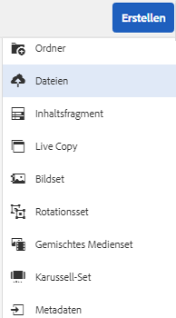

   Um mehrere Dateien auszuwählen, wählen Sie den Schlüssel `Ctrl` oder `Command` aus und wählen Sie die Assets im Dialogfeld für die Dateiauswahl aus. Bei Verwendung eines iPads können Sie jeweils nur eine Datei auswählen.

   Sie können das Hochladen von großen Assets (größer als 500 MB) anhalten und später von der gleichen Seite aus fortsetzen. Klicken Sie auf **[!UICONTROL Pause]** neben dem Fortschrittsbalken, der beim Start eines Uploads angezeigt wird.

   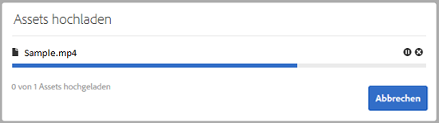

Die Größe, ab der ein Asset als großes Asset gilt, lässt sich konfigurieren. Sie können das System beispielsweise so konfigurieren, dass Assets über 1000 MB (anstatt 500 MB) als große Assets angesehen werden. In diesem Fall wird **[!UICONTROL Pause]** in der Fortschrittsleiste angezeigt, wenn Assets mit einer Größe von mehr als 1000 MB hochgeladen werden.

Die Option [!UICONTROL Pause] zeigt nicht an, ob eine Datei mit einer Größe von mehr als 1000 MB mit einer Datei von weniger als 1000 MB hochgeladen wurde. Wenn Sie jedoch den Datei-Upload mit einer Größe von weniger als 1000 MB abbrechen, wird die Option **[!UICONTROL Pause]** angezeigt.

Um die Größenbeschränkung zu ändern, konfigurieren Sie die Eigenschaft `chunkUploadMinFileSize` des Knotens `fileupload` im CRX-Repository.

Wenn Sie auf **[!UICONTROL Pause]** klicken, wird zur Option **[!UICONTROL Wiedergabe]** gewechselt. Um den Upload fortzusetzen, klicken Sie auf **[!UICONTROL Abspielen]**.

Um einen laufenden Upload abzubrechen, klicken Sie auf „Schließen“ (`X`) neben der Fortschrittsleiste. Wenn Sie den Upload abbrechen, löscht [!DNL Assets] den teilweise hochgeladenen Teil des Assets.

Den Upload fortsetzen zu können, ist besonders hilfreich bei geringer Bandbreite und Netzwerkfehlern, bei denen der Upload großer Assets lange dauern kann. Sie können den Uploadvorgang anhalten und später fortsetzen, wenn die Bedingungen besser sind. Beim Fortsetzen beginnt der Upload an dem Punkt, an dem Sie pausiert haben.

Während des Upload-Vorgangs speichert [!DNL Experience Manager] die Teile des hochgeladenen Assets als Datenblöcke im CRX-Repository. Nach Abschluss des Uploads konsolidiert [!DNL Experience Manager] diese Blöcke in einem einzigen Datenblock im Repository.

Um die Bereinigungsaufgabe für die nicht abgeschlossenen Chunk-Upload-Aufträge zu konfigurieren, gehen Sie zu `https://[aem_server]:[port]/system/console/configMgr/org.apache.sling.servlets.post.impl.helper.ChunkCleanUpTask`.

>[!CAUTION]
>
>Der Chunk-Upload wird ausgelöst, wenn der Standardwert 500 MB und die Chunk-Größe 50 MB beträgt. Wenn Sie [Apache Jackrabbit Oak TokenConfiguration](https://experienceleague.adobe.com/docs/experience-cloud-kcs/kbarticles/KA-16464.html) bearbeiten und `timeout configuration` auf weniger Zeit als für das Hochladen eines Assets festlegen, tritt während des Hochladevorgangs eine Sitzungs-Timeout-Situation auf. Ändern Sie daher die Werte `chunkUploadMinFileSize` und `chunksize`, sodass jede Chunk-Anforderung die Sitzung aktualisiert.
>
>Angesichts der Zeitüberschreitung bei Anmeldedaten, Latenz, Bandbreite und erwarteten gleichzeitigen Uploads ist der höchste Wert, mit dem Sie sicherstellen können, dass Folgendes ausgewählt wird:
>
>* Um sicherzustellen, dass der Chunk-Upload für Dateien aktiviert ist, deren Größe während des Uploads wahrscheinlich zum Ablauf der Anmeldedaten führt.
   >
   >
* Um sicherzustellen, dass jeder Chunk abgeschlossen wird, bevor die Berechtigung abläuft.


Wenn Sie ein Asset mit demselben Namen wie ein Asset hochladen, das bereits an dem Speicherort verfügbar ist, an den Sie das Asset hochladen, wird ein Warndialogfeld angezeigt.

Sie können festlegen, ob ein vorhandenes Asset ersetzt, eine neue Version erstellt oder beide Assets beibehalten werden sollen, indem Sie das neue hochgeladene Asset umbenennen. Wenn Sie ein vorhandenes Asset ersetzen, werden die Metadaten für das Asset und alle vorherigen Änderungen (z. B. Anmerkungen oder Zuschnitte), die Sie am vorhandenen Asset vorgenommen haben, gelöscht. Wenn Sie beide Assets beibehalten möchten, wird das neue Asset umbenannt und die Zahl `1` an den Namen angehängt.

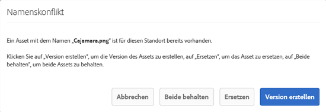

>[!NOTE]
>
>Wenn Sie im Dialogfeld [!UICONTROL Namenskonflikt] die Option **[!UICONTROL Ersetzen]** auswählen, wird die Asset-ID für das neue Asset neu generiert. Diese ID unterscheidet sich von der ID des vorherigen Assets.
>
>Wenn Assets Insights zur Verfolgung von Impressionen oder Klicks mit [!DNL Adobe Analytics] aktiviert ist, werden die für das Asset erfassten Daten durch die neu generierte Asset-ID ungültig gemacht.[!DNL Analytics]

Wenn das hochgeladene Asset in [!DNL Assets] vorhanden ist, wird im Dialogfeld **[!UICONTROL Duplikate gefunden]** gewarnt, dass Sie versuchen, ein doppeltes Asset hochzuladen. Das Dialogfeld wird nur angezeigt, wenn der Prüfsummenwert `SHA 1` der Binärdatei des vorhandenen Assets mit dem Prüfsummenwert des hochgeladenen Assets übereinstimmt. In diesem Fall sind die Namen der Assets von Bedeutung.

>[!NOTE]
>
>Das Dialogfeld [!UICONTROL Duplikate gefunden] wird nur angezeigt, wenn die Funktion zur Duplikatserkennung aktiviert ist. Informationen zum Aktivieren der Funktion zur Duplikatserkennung finden Sie unter [Duplikatserkennung aktivieren](/help/assets/duplicate-detection.md).

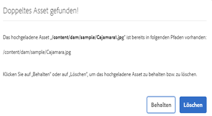

Um das doppelte-Asset in [!DNL Assets] beizubehalten, klicken Sie auf **[!UICONTROL Behalten]**. Um das doppelte Asset zu löschen, das Sie hochgeladen haben, klicken Sie auf **[!UICONTROL Löschen]**.

[!DNL Experience Manager Assets] verhindert, dass Sie Assets hochladen, deren Dateinamen unzulässige Zeichen enthalten. Wenn Sie versuchen, ein Asset mit einem Dateinamen mit einem oder mehreren nicht zulässigen Zeichen hochzuladen, zeigt [!DNL Assets] eine Warnmeldung an und stoppt den Upload, bis Sie diese Zeichen entfernen oder mit einem zulässigen Namen hochladen.

Um bestimmte Dateibenennungskonventionen für Ihre Organisation einzuhalten, können Sie im Dialogfeld [!UICONTROL Assets hochladen] lange Namen für die Dateien angeben, die Sie hochladen möchten.

Allerdings werden die folgenden Zeichen (in der Liste durch Leerzeichen getrennt) nicht unterstützt:

* Der Asset-Dateiname darf nicht enthalten: `* / : [ \\ ] | # % { } ? &`
* Der Asset-Ordnername darf nicht enthalten: `* / : [ \\ ] | # % { } ? \" . ^ ; + & \t`

Schließen Sie keine Sonderzeichen in die Erweiterungen der Asset-Dateinamen ein.

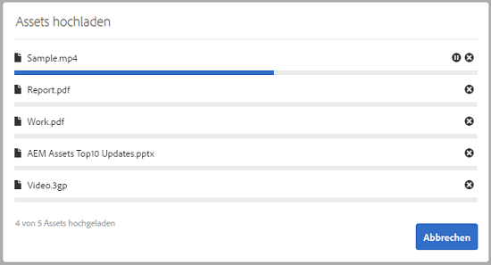

Darüber hinaus zeigt die [!DNL Assets]-Benutzeroberfläche das zuletzt hochgeladene Asset oder den Ordner an, den Sie zuerst erstellt haben.

Wenn Sie den Upload abbrechen, bevor die Dateien hochgeladen sind, unterbricht [!DNL Assets] den Upload der aktuellen Datei und aktualisiert den Inhalt. Dateien, die bereits hochgeladen wurden, werden jedoch nicht gelöscht.

Das Dialogfeld für den Upload-Fortschritt in [!DNL Assets] zeigt die Anzahl der erfolgreich hochgeladenen Dateien und die der Dateien an, die nicht hochgeladen werden konnten.

### Serielle Uploads {#serialuploads}

Das Hochladen zahlreicher Assets in großen Mengen verbraucht erhebliche I/O-Ressourcen, was sich negativ auf die Leistung Ihrer [!DNL Assets]-Implementierung auswirken kann. Insbesondere wenn Sie eine langsame Internetverbindung haben, nimmt die Zeit zum Hochladen aufgrund eines Spitzenwertes der Festplatten-I/O drastisch zu. Darüber hinaus kann Ihr Webbrowser zusätzliche Einschränkungen hinsichtlich der Anzahl der POST-Anforderungen einführen, die [!DNL Assets] für gleichzeitige Asset-Uploads verarbeiten kann. Daher schlägt der Upload-Vorgang fehl oder wird vorzeitig beendet. Mit anderen Worten: [!DNL Experience Manager Assets] kann einige Dateien bei der Aufnahme einer Reihe von Dateien vermissen oder überhaupt keine Datei erfassen.

Um dies zu vermeiden, erfasst [!DNL Assets] während eines Massen-Upload-Vorgangs ein Asset nach dem anderen (serieller Upload), anstatt alle Assets gleichzeitig aufzunehmen.

Der serielle Upload von Assets ist standardmäßig aktiviert. Um die Funktion zu deaktivieren und das gleichzeitige Hochladen zuzulassen, überlagern Sie den Knoten `fileupload` in Crx-de und setzen Sie den Wert der Eigenschaft `parallelUploads` auf `true`.

### Hochladen von Assets über FTP {#uploading-assets-using-ftp}

Dynamic Media ermöglicht das stapelweise Hochladen von Assets über FTP-Server. Wenn Sie große Assets (über 1 GB) oder ganze Ordner und Unterordner hochladen möchten, sollten Sie FTP verwenden. Sie können das Hochladen per FTP auch einrichten, um Uploads regelmäßig und nach Plan durchzuführen.

>[!NOTE]
>
>Im Modus Dynamic Media - Scene7 beträgt die standardmäßige Größe der Asset-Upload-Datei 2 GB oder weniger. Informationen zum Konfigurieren des Uploads von Assets mit einer Größe von mehr als 2 GB bis zu 15 GB finden Sie unter [(Optional) Konfigurieren des Dynamic Media - Scene7-Modus für das Hochladen von Assets mit einer Größe von mehr als 2 GB](/help/assets/config-dms7.md#optional-config-dms7-assets-larger-than-2gb).

>[!NOTE]
>
>Um Assets über FTP im Modus Dynamic Media - Scene7 hochzuladen, installieren Sie Feature Pack 18912 in den [!DNL Experience Manager] Autoreninstanzen. Wenden Sie sich an die [Adobe-Kundenunterstützung](https://experienceleague.adobe.com/?support-solution=General#support), um Zugriff auf FP-18912 zu erhalten und die Einrichtung Ihres FTP-Kontos abzuschließen. Weitere Informationen finden Sie unter [Feature Pack 18912 für Massenmigration von Assets installieren](/help/assets/bulk-ingest-migrate.md).
>
>Wenn Sie FTP zum Hochladen von Assets verwenden, werden die unter [!DNL Experience Manager] angegebenen Upload-Einstellungen ignoriert. Stattdessen werden Dateiverarbeitungsregeln, wie in Dynamic Media Classic definiert, verwendet.    

**So laden Sie Assets per FTP hoch**

1. Verwenden Sie den FTP-Client Ihrer Wahl und melden Sie sich beim FTP-Server mit dem FTP-Benutzernamen und -Kennwort aus der Bereitstellungs-E-Mail an. Laden Sie die Dateien und/oder Ordner über den FTP-Client auf den FTP-Server hoch.

1. Öffnen Sie das [Dynamic Media Classic-Desktop-Programm](https://experienceleague.adobe.com/docs/dynamic-media-classic/using/intro/dynamic-media-classic-desktop-app.html#system-requirements-dmc-app) und melden Sie sich bei Ihrem Konto an.

   Ihre Anmeldedaten und Ihre Anmeldung wurden von Adobe zum Zeitpunkt der Bereitstellung bereitgestellt. Wenn Ihnen die Informationen nicht vorliegen, wenden Sie sich an den technischen Support.

1. Klicken Sie in der Leiste „Globale Navigation“ auf **[!UICONTROL Hochladen]**.
1. Klicken Sie auf der Seite „Hochladen“ in der Nähe der linken oberen Ecke auf die Registerkarte **[!UICONTROL Über FTP]**.
1. Wählen Sie im linken Bereich der Seite einen FTP-Ordner aus, aus dem Sie Dateien hochladen. Auf der rechten Seite der Seite wählen Sie einen Zielordner aus.
1. Klicken Sie in der rechten unteren Ecke der Seite auf **[!UICONTROL Auftragsoptionen]** und legen Sie auf der Grundlage der Assets, die in dem von Ihnen gewählten Ordner enthalten sind, die gewünschten Optionen fest.

   Siehe [Upload-Auftragsoptionen](#upload-job-options).

   >[!NOTE]
   >
   >Beim Hochladen von Assets über FTP haben die in Dynamic Media Classic (S7) festgelegten Upload-Auftragsoptionen Vorrang vor den in [!DNL Experience Manager] festgelegten Asset-Verarbeitungsparametern.

1. Klicken Sie in der rechten unteren Ecke des Dialogfelds „Upload-Auftragsoptionen“ auf **[!UICONTROL Speichern]**.
1. Klicken Sie in der rechten unteren Ecke der Seite „Hochladen“ auf **[!UICONTROL Upload starten]**.

   Um den Uploadfortschritt anzuzeigen, klicken Sie in der Leiste „Globale Navigation“ auf **[!UICONTROL Aufträge]**. Auf der Seite „Aufträge“ wird der Uploadfortschritt angezeigt. Sie können weiterhin in [!DNL Experience Manager] arbeiten und jederzeit zur Seite &quot;Aufträge&quot;in Dynamic Media Classic zurückkehren, um einen laufenden Auftrag zu überprüfen.
Um einen laufenden Upload-Auftrag abzubrechen, klicken Sie neben der Dauer auf **[!UICONTROL Abbrechen]** .

#### Upload-Auftragsoptionen {#upload-job-options}

| Upload-Optionen | Unteroption | Beschreibung |
|---|---|---|
| Auftragsname |  | Der Name, der standardmäßig in diesem Feld erstellt wird, enthält den vom Benutzer eingegebenen Teil des Namens und einen Zeitstempel samt Datum. Für diesen Upload-Auftrag können Sie den Standardnamen oder einen von Ihnen selbst erstellten Namen verwenden. <br>Der Auftrag und andere Upload- und Veröffentlichungsaufträge werden auf der Seite „Aufträge“ aufgezeichnet, wo Sie den Status der Aufträge prüfen können. |
| Nach dem Hochladen veröffentlichen |  | Veröffentlicht Assets automatisch nach dem Hochladen. |
| In belieb. Ordner Assets mit ident. Namen unabh. von Erweit. überschreiben |  | Wählen Sie diese Option aus, wenn hochgeladene Dateien vorhandene Dateien mit denselben Namen ersetzen sollen. Der Name dieser Option kann möglicherweise anders lauten, je nach den Einstellungen in **[!UICONTROL Anwendungseinstellungen]** > **[!UICONTROL Allgemeine Einstellungen]** > **[!UICONTROL Zur Anwendung hochladen]** > **[!UICONTROL Bilder überschreiben]**. |
| Zip- oder Tar-Dateien beim Hochladen dekomprimieren |  |  |
| Auftragsoptionen |  | Klicken Sie auf **[!UICONTROL Auftragsoptionen]**, damit Sie das Dialogfeld [!UICONTROL Upload-Auftragsoptionen] öffnen und Optionen auswählen können, die sich auf den gesamten Upload-Auftrag auswirken. Diese Optionen sind für alle Dateitypen gleich.<br>Sie können über die Seite „Allgemeine Programmeinstellungen“ Standardoptionen für das Hochladen von Dateien auswählen. Um diese Seite zu öffnen, wählen Sie **[!UICONTROL Einstellung]** > **[!UICONTROL Anwendungseinstellungen]**. Wählen Sie die Option **[!UICONTROL Standard-Upload-Optionen]** aus, um das Dialogfeld [!UICONTROL Upload-Auftragsoptionen] zu öffnen. |
|  | Wenn | Wählen Sie „Einmalig“ oder „Wiederkehrend“ aus. Zum Einrichten eines wiederkehrenden Auftrags wählen Sie eine Wiederholungsoption („Täglich“, „Wöchentlich“, „Monatlich“ oder „Benutzerdefiniert“), um anzugeben, wie oft der FTP-Upload-Auftrag wiederholt werden soll. Dann geben Sie nach Bedarf die Planungsoptionen an. |
|  | Unterordner einschließen | Laden Sie alle Unterordner im hochzuladenden Ordner hoch. Die Namen des Ordners und der von Ihnen hochgeladenen Unterordner werden automatisch in [!DNL Experience Manager Assets] eingegeben. |
|  | Optionen für das Zuschneiden | Um die Seiten eines Bildes manuell zu beschneiden, wählen Sie im Menü „Beschneiden“ die Option „Manuell“ aus. Dann geben Sie die Anzahl von Pixeln ein, die an einer oder jeder Seite des Bildes abgeschnitten werden sollen. Um wie viel das Bild beschnitten wird, hängt von der ppi-Einstellung (Pixel per Inch; Pixel pro Zoll) in der Bilddatei ab. Beispiel: Wenn das Bild 150 ppi aufweist und Sie 75 in die Textfelder für oben, rechts, unten und links eingeben, wird ein halber Zoll von jeder Seite abgeschnitten.<br> Zum automatischen Beschneiden der Leerraumpixel eines Bildes öffnen Sie das Menü „Beschneiden“, wählen Sie „Manuell“ und geben Sie zum Beschneiden der Seiten die Pixelwerte in die Felder „Oben“, „Rechts“, „Unten“ und „Links“ ein. Sie können im Menü „Beschneiden“ auch „Zuschneiden“ und anschließend folgende Optionen auswählen:<br> **Beschneiden basierend auf** <ul><li>**Farbe**  - Wählen Sie die Option &quot;Farbe&quot;. Wählen Sie anschließend im Menü „Ecke“ die Bildecke mit der Farbe aus, die am besten der Leerraumfarbe entspricht, die Sie entfernen möchten.</li><li>**** Transparenz – Wählen Sie die Option „Transparenz“.<br> **Toleranz**  - Ziehen Sie den Regler, um eine Toleranz von 0 bis 1 festzulegen. Für das Zuschneiden auf Grundlage der Farbe geben Sie 0 an, damit Pixel nur dann abgeschnitten werden, wenn sie genau der Farbe entsprechen, die Sie in der Bildecke ausgewählt haben. Werte, die näher an 1 liegen, lassen eine größere Farbdifferenz zu.<br>Für das Zuschneiden auf der Grundlage der Transparenz geben Sie den Wert 0 an, damit Pixel nur dann abgeschnitten werden, wenn sie transparent sind. Werte, die näher an 1 liegen, lassen eine größere Transparenz zu.</li></ul><br>Diese Zuschnittsoptionen sind zerstörungsfrei. |
|  | Farbprofiloptionen | Wählen Sie beim Erstellen optimierter Dateien eine Farbkonversion aus, die für die Bereitstellung verwendet wird:<ul><li>Beibehaltung der Standardfarbe: Behält die Farben des Quellbildes bei, wenn die Bilder Farbrauminformationen enthalten. Es findet keine Farbkonversion statt. Heutzutage ist in fast allen Bildern das entsprechende Farbprofil eingebettet. Wenn jedoch ein CMYK-Quellbild kein eingebettetes Farbprofil enthält, werden die Farben in den Farbraum sRGB (standardmäßiges Rot Grün Blau) konvertiert. sRGB ist der empfohlene Farbraum zum Anzeigen von Bildern auf Webseiten.</li><li>Ursprünglichen Farbraum beibehalten: Behält die ursprünglichen Farben bei, ohne dass an der betreffenden Stelle eine Farbkonversion stattfindet. Bei Bildern ohne eingebettetes Farbprofil wird jede Farbkonversion mit den in den Veröffentlichungseinstellungen konfigurierten Standardfarbprofilen durchgeführt. Die Farbprofile stimmen möglicherweise nicht mit der Farbe in den Dateien überein, die mit dieser Option erstellt wurden. Deshalb empfiehlt es sich, die Option „Beibehaltung der Standardfarbe“ zu verwenden.</li><li>Benutzerdefinierte Einstellung von > in:<br> Öffnet Menüs, damit Sie einen „Konvertieren von“- und einen „Konvertieren in“-Farbraum auswählen können. Diese erweiterte Option überschreibt alle Farbinformationen, die in die Quelldatei eingebettet sind. Wählen Sie diese Option aus, wenn alle Bilder, die Sie senden, falsche oder fehlende Farbprofildaten enthalten.</li></ul> |
|  | Bildbearbeitungsoptionen | Sie können die Beschneidungsmasken in Bildern beibehalten und ein Farbprofil auswählen.<br> Siehe  [Festlegen von Optionen für Bildbearbeitungen beim Hochladen](#setting-image-editing-options-at-upload). |
|  | PostScript-Optionen | Sie können PostScript®-Dateien rastern, Dateien beschneiden, transparente Hintergründe beibehalten sowie eine Auflösung und einen Farbraum auswählen.<br> Siehe [Festlegen von PostScript- und Illustrator-Uploadoptionen](#setting-postscript-and-illustrator-upload-options). |
|  | Photoshop-Optionen | Sie können Vorlagen aus Adobe® Photoshop®-Dateien erstellen, Ebenen beibehalten, Ebenennamen angeben, Text extrahieren und angeben, wie Bilder in Vorlagen verankert sind.<br> Vorlagen werden in nicht unterstützt  [!DNL Experience Manager].<br> Siehe [Festlegen von Photoshop-Uploadoptionen](#setting-photoshop-upload-options). |
|  | PDF-Optionen | Sie können die Dateien rastern, Suchbegriffe und -links extrahieren, automatisch einen E-Katalog erstellen, die Auflösung einstellen und einen Farbraum auswählen.<br>E-Kataloge werden in nicht unterstützt  [!DNL Experience Manager]. <br> Siehe [Festlegen von PDF-Uploadoptionen](#setting-pdf-upload-options). |
|  | Illustrator-Optionen | Sie können Adobe Illustrator®-Dateien rastern, transparente Hintergründe beibehalten sowie eine Auflösung und einen Farbraum auswählen.<br> Siehe [Festlegen von PostScript- und Illustrator-Uploadoptionen](#setting-postscript-and-illustrator-upload-options). |
|  | eVideo-Optionen | Sie können eine Videodatei durch Auswahl einer Videovorgabe transkodieren.<br> Siehe [Festlegen von eVideo-Uploadoptionen](#setting-evideo-upload-options). |
|  | Stapelsatzvorgaben | Um ein Bild- oder Rotationsset aus den hochgeladenen Dateien zu erstellen, klicken Sie auf die Spalte „Aktiv“ der Vorgabe, die Sie verwenden möchten. Sie können mehrere Vorgaben auswählen. Die Vorgaben erstellen Sie auf der Seite „Anwendungseinstellungen/Stapelsatzvorgaben“ von Dynamic Media Classic.<br> Weitere Informationen zur Erstellung von Stapelsatzvorgaben finden Sie unter [Konfigurieren von Stapelsatzvorgaben zum automatischen Erstellen von Bild- und Rotationssets](config-dms7.md#creating-batch-set-presets-to-auto-generate-image-sets-and-spin-sets).<br> Siehe [Festlegen von Stapelsatzvorgaben beim Hochladen](#setting-batch-set-presets-at-upload). |

#### Festlegen von Optionen für Bildbearbeitungen beim Hochladen {#setting-image-editing-options-at-upload}

Beim Hochladen von Bilddateien, einschließlich AI-, EPS- und PSD-Dateien, können Sie die folgenden Bearbeitungsaktionen im Dialogfeld [!UICONTROL Upload-Auftragsoptionen] ausführen:

* Beschneiden von Leerzeichen am Rand von Bildern (siehe Beschreibung in der obigen Tabelle).
* Ränder von Bildern manuell beschneiden (siehe Beschreibung in der oben stehenden Tabelle)
* Ein Farbprofil auswählen (siehe Optionsbeschreibung in der oben stehenden Tabelle)
* Eine Maske aus einem Beschneidungspfad erstellen
* Bilder scharfzeichnen mit Optionen für „Unscharf maskieren“
* Hintergrund aussparen

<!--
| Option | Sub-option | Description |
|---|---|---|
| Create Mask From Clipping Path | | Create a mask for the image based on its clipping path information. This option applies to images created with image-editing applications in which a clipping path was created. |
| Unsharp Masking | | Lets you fine-tune a sharpening filter effect on the final downsampled image, controlling the intensity of the effect, the radius of the effect (as measured in pixels), and a threshold of contrast that is ignored.<br> This effect uses the same options as Photoshop’s Unsharp Mask filter. Contrary to what the name suggests, Unsharp Mask is a sharpening filter. Under Unsharp Masking, set the options you want. Setting options are described in the following: |
| | Amount | Controls the amount of contrast that is applied to edge pixels.<br> Think of it as the intensity of the effect. The main difference between the amount values of Unsharp Mask in Dynamic Media and the amount values in Adobe Photoshop, is that Photoshop has an amount range of 1% to 500%. Whereas, in Dynamic Media, the value range is 0.0 to 5.0. A value of 5.0 is the rough equivalent of 500% in Photoshop; a value of 0.9 is the equivalent of 90%, and so on. |
| | Radius | Controls the radius of the effect. The value range is 0-250.<br> The effect is run on all pixels in an image and radiates out from all pixels in all directions. The radius is measured in pixels. For example, to get a similar sharpening effect for a 2000 x 2000 pixel image and 500 x 500 pixel image, you would set a radius of two pixels on the 2000 x 2000 pixel image and a radius value of one pixel on the 500 x 500 pixel image. A larger value is used for an image that has more pixels. |
| | Threshold | Threshold is a range of contrast that is ignored when the Unsharp Mask filter is applied. It is important so that no "noise" is introduced to an image when this filter is used. The value range is 0-255, which is the number of brightness steps in a grayscale image. 0=black, 128=50% gray and 255=white.<br> For example, a threshold value of 12 ignores slight variations is skin tone brightness to avoid adding noise, but still add edge contrast to areas such as where eyelashes meet skin.<br> For example, if you have a photo of someone’s face, the Unsharp Mask affects the parts of the image, such as where eyelashes and skin meet to create an obvious area of contrast, and the smooth skin itself. Even the smoothest skin exhibits subtle changes in brightness values. If you do not use a threshold value, the filter accentuates these subtle changes in skin pixels. In turn, a noisy and undesirable effect is created while contrast on the eyelashes is increased, enhancing sharpness.<br> To avoid this issue, a threshold value is introduced that tells the filter to ignore pixels that do not change contrast dramatically, like smooth skin.<br> In the zipper graphic shown earlier, notice the texture next to the zippers. Image noise is exhibited because the threshold values were too low to suppress the noise. |
| | Monochrome | Select to unsharp-mask image brightness (intensity).<br> Deselect to unsharp-mask each color component separately. |
| Knockout Background | | Automatically removes the background of an image when you upload it. This technique is useful to draw attention to a particular object and make it stand out from a busy background. Select to enable or “turn on” the Knockout Background feature and the following sub-options: |
| | Corner | Required.<br> The corner of the image that is used to define the background color to knockout.<br> You can choose from **Upper Left**, **Bottom Left**, **Upper Right**, or **Bottom Right**. |
| | Fill Method | Required.<br> Controls pixel transparency from the Corner location that you set.<br> You can choose from the following fill methods: <ul><li>**Flood Fill** - turns all pixels transparent that match the Corner that you have specified and are connected to it.</li><li>**Match Pixel** - turns all matching pixels transparent, regardless of their location on the image.</li></ul> |
| | Tolerance | Optional.<br> Controls the allowable amount of variation in pixel color matching based on the Corner location that you set.<br> Use a value of 0.0 to match pixel colors exactly or, use a value of 1.0 to allow for the greatest variation. |
-->

#### Festlegen von PostScript- und Illustrator-Uploadoptionen {#setting-postscript-and-illustrator-upload-options}

Wenn Sie PostScript (EPS)- oder Illustrator (AI)-Bilddateien hochladen, können Sie diese auf verschiedene Arten formatieren. Sie können die Dateien rastern, den transparenten Hintergrund beibehalten sowie eine Auflösung und einen Farbraum auswählen. Optionen zum Formatieren von PostScript- und Illustrator-Dateien finden Sie im Dialogfeld [!UICONTROL Upload-Auftragsoptionen] unter [!UICONTROL PostScript-Optionen] und [!UICONTROL Illustrator-Optionen].

| Option | Unteroption | Beschreibung |
|---|---|---|
| Verarbeitung |  | Wählen Sie **[!UICONTROL Rastern]**, um Vektorgrafiken in der Datei in das Bitmap-Format zu konvertieren. |
| Transparenten Hintergrund in gerendertem Bild beibehalten |  | Zur Beibehaltung der Hintergrundtransparenz der Datei. |
| Auflösung |  | Zur Einstellung der Auflösung. Mit dieser Einstellung wird bestimmt, wie viele Pixel pro Zoll in der Datei angezeigt werden. |
| Farbraum |  | Klicken Sie auf das Menü „Farbraum“ und wählen Sie unter den folgenden Farbraumoptionen: |
|  | Automatisch erkennen | Der Farbraum der Datei wird beibehalten. |
|  | Immer RGB | Zur Konvertierung in den RGB-Farbraum. |
|  | Immer CMYK | Zur Konvertierung in den CMYK-Farbraum. |
|  | Immer Graustufen | Zur Konvertierung in den Graustufenfarbraum. |

#### Festlegen von Photoshop-Uploadoptionen {#setting-photoshop-upload-options}

Photoshop Document (PSD)-Dateien werden meist zum Erstellen von Bildvorlagen verwendet. Wenn Sie eine PSD-Datei hochladen, können Sie automatisch eine Bildvorlage aus der Datei erstellen (wählen Sie im Bildschirm &quot;Hochladen&quot;die Option [!UICONTROL Vorlage erstellen] aus).

Dynamic Media erstellt mehrere Bilder aus einer PSD-Datei mit Ebenen, wenn Sie die Datei zum Erstellen einer Vorlage verwenden. Für jede Ebene wird ein Bild erstellt.

Verwenden Sie die oben beschriebenen [!UICONTROL Zuschnitt-Optionen] und [!UICONTROL Farbprofiloptionen] mit Photoshop-Uploadoptionen.

>[!NOTE]
>
>Vorlagen werden in [!DNL Experience Manager] nicht unterstützt.

| Option | Unteroption | Beschreibung |
|---|---|---|
| Ebenen beibehalten |  | Teilt die Ebenen in der PSD-Datei ggf. in einzelne Assets auf. Die Asset-Ebenen bleiben der PSD-Datei zugeordnet. Sie können sie anzeigen, indem Sie die PSD-Datei in der Detailansicht öffnen und das Ebenenfenster auswählen. |
| Vorlage erstellen |  | Erstellt eine Vorlage aus den Ebenen der PSD-Datei. |
| Text extrahieren |  | Extrahiert den Text, damit Benutzer im Viewer den Text durchsuchen können. |
| Ebenen auf Hintergrundgröße ausdehnen |  | Erweitert die Größe aufgeteilter Bildebenen auf die Größe der Hintergrundebene. |
| Ebenenbenennung |  | Ebenen in der PSD-Datei werden als separate Bilder hochgeladen. |
|  | Ebenenname | Benennt die Bilder nach ihren Ebenennamen in der PSD-Datei. Wenn eine Ebene in der Original-PSD-Datei beispielsweise „Preisschild“ heißt, wird auch das zugehörige Bild „Preisschild“ genannt. Wenn es sich bei den Ebenennamen in der PSD-Datei jedoch um standardmäßige Photoshop-Ebenennamen handelt (Hintergrund, Ebene 1, Ebene 2 usw.), werden die Bilder nach ihren Ebenennummern in der PSD-Datei benannt. Sie werden nicht nach ihren standardmäßigen Ebenennamen benannt. |
|  | Photoshop- und Ebenennummer | Benennt die Bilder nach ihren Ebenennummern in der PSD-Datei und ignoriert die ursprünglichen Ebenennamen. Bilder werden mit dem Photoshop-Dateinamen und einer angefügten Ebenennummer benannt. Zum Beispiel erhält die zweite Ebene der Datei Frühjahrsannonce.psd den Namen Frühjahrsannonce_2, auch wenn sie in Photoshop einen nicht standardmäßigen Namen hatte. |
|  | Photoshop- und Ebenenname | Benennt die Bilder nach der PSD-Datei, gefolgt vom Ebenennamen oder der -nummer. Die Ebenennummer wird verwendet, wenn es sich bei den Ebenennamen in der PSD-Datei um standardmäßige Photoshop-Ebenennamen handelt. Zum Beispiel erhält eine Ebene mit dem Namen „Preisschild“ in einer PSD-Datei mit dem Namen „Frühjahrsannonce“ den Namen „Frühjahrsannonce_Preisschild“. Eine Ebene mit dem standardmäßigen Namen „Ebene 2“ erhält den Namen „Frühjahrsannonce_2“. |
| Anker |  | Geben Sie an, wie Bilder in Vorlagen, die aus der Zusammenstellung der Ebenen aus der PSD-Datei erstellt werden, verankert werden. Der Anker ist standardmäßig zentriert. Ein zentrierter Anker eignet sich am besten zum Auffüllen desselben Raums mit Ersatzbildern, unabhängig vom Seitenverhältnis der Ersatzbilder. Bilder mit einem anderen Seitenverhältnis, die dieses Bild ersetzen, nehmen effektiv denselben Raum ein, wenn auf die Vorlage verwiesen und die Parameterersetzung durchgeführt wird. Wählen Sie eine andere Einstellung, wenn es für Ihre Anwendung erforderlich ist, dass die Ersatzbilder den zugeordneten Raum in der Vorlage ausfüllen. |

#### PDF-Uploadoptionen festlegen {#setting-pdf-upload-options}

Wenn Sie eine PDF-Datei hochladen, können Sie diese auf verschiedene Arten formatieren. Sie können ihre Seiten zuschneiden, Suchbegriffe extrahieren, eine ppi (Pixel pro Zoll)-Auflösung eingeben und einen Farbraum auswählen. PDF-Dateien enthalten oft einen Beschnittrand, Schnittmarken, Registrierungsmarken und andere Druckermarken. Sie können diese Marken von den Seitenrändern aus zuschneiden, wenn Sie eine PDF-Datei hochladen.

>[!NOTE]
>
>eCatalog werden in [!DNL Experience Manager] nicht unterstützt.

Wählen Sie unter folgenden Optionen:

| Option | Unteroption | Beschreibung |
|---|---|---|
| Verarbeitung | Rastern | (Standard) Zum Extrahieren der Seiten aus der PDF-Datei und zum Konvertieren von Vektorgrafiken in Bitmap-Bilder. Wählen Sie diese Option, wenn Sie einen E-Katalog erstellen möchten. |
| Extrahieren | Suchbegriffe | Zum Extrahieren von Wörtern aus der PDF-Datei, damit die Datei in einem E-Katalog-Viewer mit einem Schlüsselwort durchsucht werden kann. |
|  | Links | Zum Extrahieren von Links aus den PDF-Dateien und zum Konvertieren der PDF-Dateien in Imagemaps, die in einem E-Katalog-Viewer verwendet werden. |
| E-Katalog aus mehrseitiger PDF automatisch erstellen |  | Zum automatischen Erstellen eines E-Katalogs aus der PDF-Datei. Der E-Katalog wird nach der von Ihnen hochgeladenen PDF-Datei benannt. (Diese Option ist nur dann verfügbar, wenn Sie die PDF-Datei beim Hochladen rastern.) |
| Auflösung |  | Zum Festlegen der Auflösung: Mit dieser Einstellung wird bestimmt, wie viele Pixel pro Zoll in der PDF-Datei angezeigt werden. Standard: 150. |
| Farbraum |  | Wählen Sie das Farbraummenü und einen Farbraum für die PDF-Datei aus. Die meisten PDF-Dateien enthalten sowohl RGB- als auch CMYK-Farbbilder. Der RGB-Farbraum eignet sich besonders gut, um Dateien online anzuzeigen. |
|  | Automatisch erkennen | Der Farbraum der PDF-Datei wird beibehalten. |
|  | Immer RGB | Zur Konvertierung in den RGB-Farbraum. |
|  | Immer CMYK | Zur Konvertierung in den CMYK-Farbraum. |
|  | Immer Graustufen | Zur Konvertierung in den Graustufenfarbraum. |

#### Festlegen von eVideo-Uploadoptionen {#setting-evideo-upload-options}

So transkodieren Sie eine Videodatei, indem Sie aus verschiedenen Videovorgaben auswählen.

| Option | Unteroption | Beschreibung |
|---|---|---|
| Adaptives Video |  | Eine einzelne Kodierungsvorgabe, die mit jedem Seitenverhältnis verwendet werden kann, um Videos für die Bereitstellung auf Mobilgeräten, Tablets und Desktops zu erstellen. Hochgeladene Quellvideos, die mit dieser Vorgabe kodiert wurden, weisen eine feste Höhe auf. Die Breite wird jedoch automatisch skaliert, um das Seitenverhältnis des Videos beizubehalten. <br>Es empfiehlt sich, die adaptive Videokodierung zu verwenden. |
| Einzelne Kodierungsvorgaben | Kodierungsvorgaben sortieren | Wählen Sie **[!UICONTROL Name]** oder **[!UICONTROL Größe]** aus, wenn Sie die unter &quot;Desktop, Mobile und Tablet&quot;aufgelisteten Kodierungsvorgaben nach Name oder Auflösung sortieren möchten. |
|  | Desktop | Erstellen Sie eine MP4-Datei, um Desktop-Computern ein Streaming- oder progressives Videoerlebnis bereitzustellen. Wählen Sie hier ein oder mehrere Seitenverhältnisse mit der gewünschten Auflösungsgröße und Zieldatenrate aus. |
|  | Mobilgerät | Erstellen Sie eine MP4-Datei zur Bereitstellung auf iPhone- oder Android™-Mobilgeräten. Wählen Sie hier ein oder mehrere Seitenverhältnisse mit der gewünschten Auflösungsgröße und Zieldatenrate aus. |
|  | Tablet | Erstellen Sie eine MP4-Datei zur Bereitstellung auf iPad- oder Android™-Tablet-Geräten. Wählen Sie hier ein oder mehrere Seitenverhältnisse mit der gewünschten Auflösungsgröße und Zieldatenrate aus. |

#### Festlegen von Stapelsatzvorgaben beim Hochladen {#setting-batch-set-presets-at-upload}

Wenn Sie aus hochgeladenen Bildern automatisch ein Bildset oder Rotationsset erstellen möchten, klicken Sie auf die Spalte Aktiv für die Vorgabe, die Sie verwenden möchten. Sie können mehrere Vorgaben auswählen. 

Weitere Informationen zur Erstellung von Stapelsatzvorgaben finden Sie unter [Konfigurieren von Stapelsatzvorgaben zum automatischen Erstellen von Bild- und Rotationssets](/help/assets/config-dms7.md#creating-batch-set-presets-to-auto-generate-image-sets-and-spin-sets).

### Gestreamte Uploads {#streamed-uploads}

Wenn Sie viele Assets in Adobe Experience Manager hochladen, erhöhen sich die I/O-Anforderungen an den Server drastisch, was die Upload-Effizienz verringert und sogar dazu führen kann, dass bei einigen Upload-Aufgaben eine Zeitüberschreitung auftritt. [!DNL Experience Manager Assets] unterstützt gestreamte Uploads von Assets. Gestreamte Uploads sorgen für eine Datenträger-E/A-Reduzierung beim Hochladen, da die Speicherung von Assets in einem temporären Ordner auf dem Server vermieden wird, bevor Assets in das Repository kopiert werden. Stattdessen werden die Daten direkt an das Repository übertragen. Auf diese Weise wird die Zeit für das Hochladen von Assets und die Möglichkeit von Zeitüberschreitungen verringert. Gestreamte Uploads sind in [!DNL Assets] standardmäßig aktiviert.

>[!NOTE]
>
>Der Streaming-Upload ist für Adobe Experience Manager deaktiviert, der auf dem JEE-Server mit Servlet-API-Version unter 3.1 ausgeführt wird.

### ZIP-Archiv mit Assets extrahieren {#extractzip}

Sie können ZIP-Archive wie jedes andere unterstützte Asset hochladen. Für ZIP-Dateien gelten dieselben Regeln für Dateinamen. [!DNL Experience Manager]Mit können Sie ein ZIP-Archiv in einen DAM-Speicherort extrahieren. Wenn die Aktivdateien nicht die Erweiterung ZIP haben, aktivieren Sie die Dateityperkennung über den Inhalt.

Wählen Sie jeweils ein ZIP-Archiv aus, klicken Sie auf **[!UICONTROL Archiv extrahieren]** und wählen Sie einen Zielordner aus. Wählen Sie eine Option aus, die Sie ggf. mit Konflikten verarbeiten möchten. Wenn die Assets in der ZIP-Datei im Zielordner vorhanden sind, können Sie eine der folgenden Optionen auswählen: die Extraktion überspringen, vorhandene Dateien ersetzen, beide Assets durch Umbenennen beibehalten oder eine Version erstellen.

Nach Abschluss der Extraktion benachrichtigt Sie [!DNL Experience Manager] im Benachrichtigungsbereich. Während [!DNL Experience Manager] die ZIP-Datei extrahiert, können Sie ohne Unterbrechung der Extraktion zu Ihrer Arbeit zurückkehren.

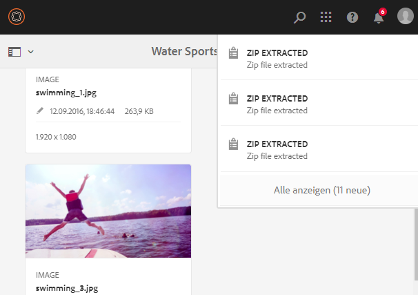

Die Funktion hat einige Einschränkungen:

* Wenn sich ein gleichnamiger Ordner am Ziel befindet, werden die Assets aus der ZIP-Datei in diesen extrahiert.
* Wenn Sie die Extrahierung abbrechen, werden die bereits extrahierten Assets nicht gelöscht.
* Sie können nicht gleichzeitig zwei ZIP-Dateien auswählen und extrahieren. Sie können jeweils nur ein ZIP-Archiv extrahieren.
* Wenn beim Hochladen eines ZIP-Archivs im Dialogfeld &quot;Hochladen&quot;ein 500-Server-Fehler angezeigt wird, versuchen Sie es nach der Installation von [dem neuesten Service Pack](/help/release-notes/sp-release-notes.md) erneut.

## Anzeigen einer Vorschau für Assets {#previewing-assets}

Gehen Sie wie folgt vor, um eine Vorschau für ein Asset anzuzeigen.

1. Navigieren Sie in der Benutzeroberfläche [!DNL Assets] zum Speicherort des Assets, das Sie in der Vorschau anzeigen möchten.
1. Klicken Sie auf das gewünschte Asset, damit Sie es öffnen können.

1. Im Vorschaumodus ist eine Zoom-Funktion für [unterstützte Bildtypen](/help/assets/assets-formats.md#supported-raster-image-formats) verfügbar (mit interaktiver Bearbeitung).

   Klicken Sie zum Vergrößern eines Assets auf `+` (oder klicken Sie auf die Lupe des Assets). Um auszuzoomen, klicken Sie auf `-`. Beim Heranzoomen können Sie beliebige Bildbereiche durch Schwenken genauer untersuchen. Mit dem Pfeil „Zoom zurücksetzen“ gelangen Sie zurück zur Originalansicht. Um die Originalgröße der Ansicht wiederherzustellen, klicken Sie auf **[!UICONTROL Zurücksetzen]** .

**Asset-Vorschau nur mit Tastaturbefehlen**

Gehen Sie wie folgt vor, um eine Asset-Vorschau über die Tastatur anzuzeigen:

1. Navigieren Sie in der Benutzeroberfläche [!DNL Assets] mit den Pfeiltasten zum gewünschten Asset.`Tab`

1. Drücken Sie die `Enter`-Taste auf das gewünschte Asset, damit Sie es öffnen können. Sie können Assets im Vorschaumodus heranzoomen.

1. So zoomen Sie in das Asset:
   1. Verwenden Sie die `Tab`-Taste, um den Fokus auf die Zoom-in-Option zu verschieben.
   1. Verwenden Sie die `Enter`-Taste, um in das Bild zu zoomen.

   Verwenden Sie zum Verkleinern die `Tab`-Taste, um den Fokus auf die Zoom-out-Option zu legen, und drücken Sie die Taste `Enter`.

1. Verwenden Sie `Shift` + `Tab` -Schlüssel, um den Fokus zurück auf das Bild zu verschieben.

1. Verwenden Sie die Pfeiltasten, um sich um das gezoomte Bild zu bewegen.

>[!MORELIKETHIS]
>
>* [Vorschau von Dynamic Media Assets](/help/assets/previewing-assets.md) anzeigen.
>* [Anzeigen von Unter-Assets](managing-linked-subassets.md#viewing-subassets).


## Eigenschaften und Metadaten bearbeiten {#editing-properties}

1. Navigieren Sie zum Speicherort des Assets, dessen Metadaten Sie bearbeiten möchten.

1. Wählen Sie das Asset aus und wählen Sie dann in der Symbolleiste **[!UICONTROL Eigenschaften]** aus, damit Sie die Eigenschaften des Assets anzeigen können. Wählen Sie alternativ die Schnellaktion **[!UICONTROL Eigenschaften]** auf der Asset-Karte aus.

   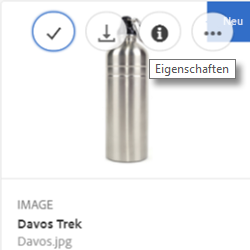

1. Bearbeiten Sie auf der Registerkarte [!UICONTROL Eigenschaften] die Metadateneigenschaften auf den verschiedenen Registerkarten. Bearbeiten Sie beispielsweise auf der Registerkarte **[!UICONTROL Einfach]** den Titel und die Beschreibung.

   >[!NOTE]
   >
   >Das Layout der Seite [!UICONTROL Eigenschaften] und die verfügbaren Metadaten sind vom zugrunde liegenden Metadatenschema abhängig. Informationen dazu, wie Sie das Layout der Seite [!UICONTROL Eigenschaften] ändern können, finden Sie unter [Metadatenschemata](/help/assets/metadata-schemas.md).

1. Um ein bestimmtes Datum/eine Zeit für die Aktivierung der Assets einzustellen, verwenden Sie die Datumsauswahl neben dem Feld **[!UICONTROL Einschaltzeit]**.

   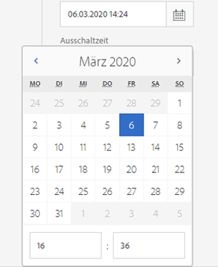

   *Abbildung: Verwenden Sie die Datumsauswahl, um die Asset-Aktivierung zu planen.*

1. Um das Asset nach einer bestimmten Laufzeit zu deaktivieren, wählen Sie das Datum/den Zeitpunkt mit der Datumsauswahl neben dem Feld **[!UICONTROL Ausschaltzeit]**. Das Deaktivierungsdatum sollte nach dem Aktivierungsdatum für ein Asset liegen. Nach der [!UICONTROL Ausschaltzeit] sind ein Asset und seine Ausgabedarstellungen weder über die [!DNL Assets]-Web-Oberfläche noch über die HTTP-API verfügbar.

1. Wählen Sie im Feld **[!UICONTROL Tags]** ein oder mehrere Tags aus. Um ein benutzerdefiniertes Tag hinzuzufügen, geben Sie den Namen des Tags in das Feld ein und wählen Sie `Enter` aus. Das neue Tag wird in [!DNL Experience Manager] gespeichert. [!DNL YouTube] erfordert die Veröffentlichung von Tags. Siehe [Veröffentlichen von Videos in YouTube](video.md#publishing-videos-to-youtube).

   >[!NOTE]
   >
   >Um Tags zu erstellen, benötigen Sie eine Schreibberechtigung für `/content/cq:tags/default` im CRX-Repository.

1. Um eine Bewertung für das Asset anzugeben, klicken Sie auf die Registerkarte **[!UICONTROL Erweitert]** und dann auf den Stern an der richtigen Position, um die gewünschte Bewertung zuzuweisen.

   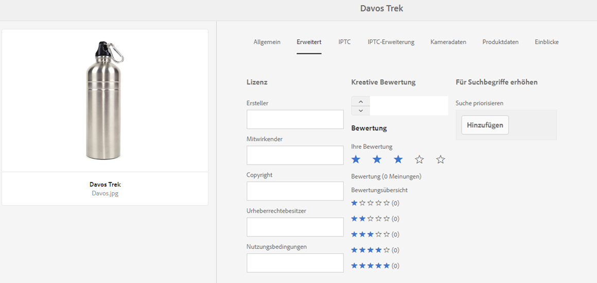

   Die Bewertungsnote, die Sie dem Asset zuweisen, wird unter **[!UICONTROL Ihre Bewertungen]** angezeigt. Die durchschnittliche Bewertungsnote, die das Asset von Benutzern erhält, wird unter **[!UICONTROL Bewertung]** angezeigt. Darüber hinaus wird die Aufschlüsselung der Bewertungen, die zur durchschnittlichen Bewertungsnote beitragen, unter **[!UICONTROL Bewertungsübersicht]** angezeigt. Sie können Assets basierend auf der durchschnittlichen Bewertungsnote durchsuchen.

1. Um Nutzungsstatistiken für das Asset anzuzeigen, klicken Sie auf die Registerkarte **[!UICONTROL Insights]** .

   Nutzungsstatistiken umfassen folgende Metriken:

   * Anzahl der Aufrufe oder Downloads des Assets
   * Kanäle/Geräte, über die das Asset genutzt wurde
   * Kreativlösungen, in denen das Asset kürzlich verwendet wurde

   Weitere Informationen finden Sie unter [Assets Insights](/help/assets/asset-insights.md).

1. Klicken Sie auf **[!UICONTROL Speichern und schließen]**.
1. Navigieren Sie zur Benutzeroberfläche [!DNL Assets] . Die bearbeiteten Metadateneigenschaften wie Titel, Beschreibung, Bewertungen usw. werden auf der Asset-Karte in der Kartenansicht und in den relevanten Spalten der Listenansicht angezeigt.

## Kopieren von Assets {#copying-assets}

Beim Kopieren eines Assets oder eines Ordners wird das gesamte Asset bzw. der Ordner mitsamt seiner Inhaltsstruktur kopiert. Ein kopiertes Asset oder ein kopierter Ordner wird am Zielspeicherort dupliziert. Das Asset am Quellspeicherort bleibt unverändert.

Einige wenige, für eine bestimmte Kopie eines Assets eindeutige Attribute werden nicht übertragen. Beispiele:

* Asset-ID, Erstellungsdatum und -zeitpunkt sowie Versionen und Versionsverlauf. Einige dieser Eigenschaften sind an den Eigenschaften `jcr:uuid`, `jcr:created` und `cq:name` zu erkennen.

* Der Erstellungszeitpunkt und referenzierte Pfade sind für jedes Asset und jede seiner Ausgabedarstellungen eindeutig.

Die übrigen Eigenschaften und Metadateninformationen werden beibehalten. Eine Teilkopie wird beim Kopieren eines Assets nicht erstellt.

1. Wählen Sie in der [!DNL Assets]-Benutzeroberfläche mindestens ein Asset aus und klicken Sie in der Symbolleiste auf **[!UICONTROL Kopieren]** . Alternativ können Sie die Schnellaktion **[!UICONTROL Kopieren]**  auf der Asset-Karte auswählen.

   >[!NOTE]
   >
   >Wenn Sie die Schnellaktion [!UICONTROL Kopieren] verwenden, können Sie immer nur ein Asset gleichzeitig kopieren.

1. Navigieren Sie zum Speicherort, an den Sie die Assets kopieren möchten.

   >[!NOTE]
   >
   >Wenn Sie ein Asset an denselben Speicherort kopieren, generiert [!DNL Experience Manager] automatisch eine Variante des Namens. Beispiel: Wenn Sie ein Asset mit dem Namen `Square` kopieren, generiert [!DNL Experience Manager] automatisch den Namen `Square1` für die Kopie.

1. Klicken Sie in der Symbolleiste auf die Option **[!UICONTROL Einfügen]**  . Assets werden dann an diesen Speicherort kopiert.

   >[!NOTE]
   >
   >Die Option **[!UICONTROL Paste]** ist in der Symbolleiste verfügbar, bis der Einfügevorgang abgeschlossen ist.

## Verschieben und Umbenennen von Assets {#moving-or-renaming-assets}

Wenn Sie Assets (oder Ordner) an einen anderen Speicherort verschieben, werden die Assets (oder Ordner) im Gegensatz zum Kopieren des Assets nicht dupliziert. Die Assets (oder die Ordner) werden am Zielspeicherort platziert und vom Quellspeicherort entfernt. Sie können das Asset auch umbenennen, wenn Sie es an den neuen Speicherort verschieben.
Wenn Sie ein veröffentlichtes Asset an einen anderen Speicherort verschieben, können Sie es optional erneut veröffentlichen. Standardmäßig wird die Veröffentlichung eines veröffentlichten Assets durch den Verschiebevorgang automatisch aufgehoben. Ein verschobenes Asset wird erneut veröffentlicht, wenn der Autor beim Verschieben des Assets die Option [!UICONTROL Neu veröffentlichen] auswählt.

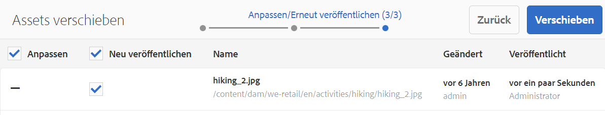

So verschieben Sie Assets oder Ordner:

1. Navigieren Sie zum Speicherort des Assets, das Sie verschieben möchten.

1. Wählen Sie das Asset aus und klicken Sie in der Symbolleiste auf die Option **[!UICONTROL Verschieben]** .
   

1. Führen Sie im Assistenten [!UICONTROL Assets verschieben] einen der folgenden Schritte aus:

   * Geben Sie nach dem Verschieben den Namen für das Asset an. Klicken Sie dann auf **[!UICONTROL Weiter]** , um fortzufahren.

   * Klicken Sie auf **[!UICONTROL Abbrechen]** , um den Vorgang abzubrechen.
   >[!NOTE]
   >
   >* Sie können denselben Namen für das Asset angeben, wenn sich am neuen Speicherort kein Asset mit diesem Namen befindet. Sie sollten jedoch einen anderen Namen verwenden, wenn Sie das Asset an einen Speichertort verschieben, an dem bereits ein Asset mit demselben Namen vorhanden ist. Wenn Sie denselben Namen verwenden, generiert das System automatisch eine Variante dieses Namens. Wenn Sie beispielsweise ein Asset mit dem Namen „Quadrat“ kopieren, generiert das System den Namen „Quadrat1“ für die Kopie.
   >* Beim Umbenennen sind keine Leerzeichen in Dateinamen zulässig.


1. Führen Sie im Dialogfeld **[!UICONTROL Ziel auswählen]** eine der folgenden Aktionen aus:

   * Navigieren Sie zum neuen Speicherort für die Assets und klicken Sie dann auf **[!UICONTROL Weiter]** , um fortzufahren.

   * Klicken Sie auf **[!UICONTROL Zurück]** , um zum Bildschirm **[!UICONTROL Umbenennen]** zurückzukehren.

1. Wenn die verschobenen Assets verweisende Seiten, Assets oder Sammlungen umfassen, wird die Registerkarte **[!UICONTROL Verweise anpassen]** neben der Registerkarte **[!UICONTROL Ziel auswählen]** angezeigt.

   Führen Sie im Bildschirm **[!UICONTROL Verweise anpassen]** einen der folgenden Schritte aus:

   * Geben Sie die Verweise an, die anhand der neuen Details angepasst werden sollen, und klicken Sie dann auf **[!UICONTROL Verschieben]**, um fortzufahren.

   * Aktivieren/deaktivieren Sie in der Spalte **[!UICONTROL Anpassen]** Verweise auf die Assets.
   * Klicken Sie auf **[!UICONTROL Zurück]** , um zum Bildschirm **[!UICONTROL Ziel]** auszuwählen.

   * Klicken Sie auf **[!UICONTROL Abbrechen]** , um den Verschiebevorgang abzubrechen.

   Wenn Sie die Verweise nicht aktualisieren, verweisen sie weiterhin auf den alten Asset-Pfad. Wenn Sie die Verweise aktualisieren, werden sie an den neuen Asset-Pfad angepasst.

### Verschieben von Assets mithilfe des Drag-Vorgangs {#move-using-drag}

Sie können Assets (oder Ordner) in einen gleichrangigen Ordner verschieben, indem Sie sie an den Zielspeicherort ziehen, anstatt die Option [!UICONTROL Verschieben] in der Benutzeroberfläche zu verwenden. Dieser Vorgang ist jedoch nur in der Listenansicht möglich.

Wenn Sie Assets durch Ziehen verschieben, wird der Assistent [!UICONTROL Asset verschieben] nicht geöffnet. Daher erhalten Sie keine Option, die Assets beim Verschieben umzubenennen. Darüber hinaus werden die bereits veröffentlichten Assets erneut veröffentlicht, wenn Sie sie durch Ziehen verschieben, ohne die Zustimmung des Benutzers zur erneuten Veröffentlichung einzuholen.


## Verwalten von Ausgabedarstellungen {#managing-renditions}

1. Sie können Ausgabedarstellungen für ein Asset hinzufügen oder entfernen, mit Ausnahme des Originals. Navigieren Sie zum Speicherort des Assets, für das Sie Ausgabedarstellungen hinzufügen oder entfernen möchten.

1. Klicken Sie auf das Asset, damit seine Seite geöffnet wird.
1. Wählen Sie in der Experience Manager-Benutzeroberfläche **[!UICONTROL Ausgabeformate]** aus der Liste aus.
1. Im Bereich **[!UICONTROL Ausgabedarstellungen]** wird die Liste der für das Asset generierten Ausgabedarstellungen angezeigt.

   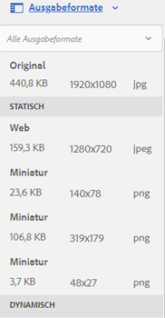

   >[!NOTE]
   >
   >Standardmäßig zeigt [!DNL Assets] im Vorschaumodus nicht die ursprüngliche Ausgabedarstellung des Assets an. Wenn Sie ein Administrator sind, können Sie Überlagerungen verwenden, um [!DNL Assets] so zu konfigurieren, dass ursprüngliche Ausgabedarstellungen im Vorschaumodus angezeigt werden.

1. Wählen Sie eine Ausgabedarstellung aus, um sie anzuzeigen oder zu löschen.

   **Löschen einer Ausgabedarstellung**

   Wählen Sie eine Ausgabedarstellung aus dem Bedienfeld **[!UICONTROL Ausgabedarstellungen]** und klicken Sie dann auf die Option **[!UICONTROL Ausgabedarstellung löschen]**  in der Symbolleiste. Ausgabedarstellungen können nach Abschluss der Asset-Verarbeitung nicht mehr stapelweise gelöscht werden. Bei einzelnen Assets können Sie Ausgabedarstellungen manuell aus der Benutzeroberfläche entfernen. Bei mehreren Assets können Sie den Experience Manager anpassen, um entweder bestimmte Ausgabeformate zu löschen oder die Assets zu löschen und die gelöschten Assets erneut hochzuladen.

   **Eine neue Ausgabedarstellung hochladen**

   Navigieren Sie zur Asset-Detailseite für das Asset und klicken Sie auf die Option **[!UICONTROL Ausgabedarstellung hinzufügen]**  in der Symbolleiste hochzuladen, um eine neue Ausgabedarstellung für das Asset hochzuladen.

   >[!NOTE]
   >
   >Wenn Sie eine Ausgabedarstellung im Bedienfeld **[!UICONTROL Ausgabedarstellungen]** auswählen, wird der Kontext der Symbolleiste geändert, sodass nur die für die Ausgabedarstellung relevanten Aktionen angezeigt werden. Optionen wie die Option [!UICONTROL Ausgabedarstellung hochladen] werden nicht angezeigt. Um diese Optionen in der Symbolleiste anzuzeigen, navigieren Sie zur Detailseite für das Asset.

   Sie können die Dimensionen für die anzuzeigende Ausgabedarstellung auf der Detailseite des entsprechenden Bild- oder Video-Assets konfigurieren. Abhängig von den angegebenen Dimensionen zeigt [!DNL Assets] die Ausgabedarstellung mit den genauen oder nächstgelegenen Dimensionen an.

   Überlagern Sie zum Konfigurieren der Ausgabedarstellungsabmessungen eines Bildes auf der Asset-Detailebene den Knoten `renditionpicker` (`libs/dam/gui/content/assets/assetpage/jcr:content/body/content/content/items/assetdetail/items/col1/items/assetview/renditionpicker`) und konfigurieren Sie den Wert für die width-Eigenschaft. Konfigurieren Sie die Eigenschaft **[!UICONTROL size (Long) in KB]** anstelle von &quot;width&quot;, damit Sie die Ausgabedarstellung auf der Asset-Detailseite basierend auf der Bildgröße anpassen können. Bei größenbasierter Anpassung gibt die Eigenschaft `preferOriginal` der Originalgröße den Vorzug, wenn die angepasste Ausgabedarstellung größer ist als das Original.

   Ebenso können Sie das Bild der Anmerkungsseite durch Überlagern von `libs/dam/gui/content/assets/annotate/jcr:content/body/content/content/items/content/renditionpicker` anpassen.

   

   Navigieren Sie zur Konfiguration der Ausgabedarstellungsabmessungen für ein Video-Asset zum Knoten `videopicker` im CRX-Repository am Speicherort `/libs/dam/gui/content/assets/assetpage/jcr:content/body/content/content/items/assetdetail/items/col1/items/assetview/videopicker`, überlagern Sie den Knoten und bearbeiten Sie dann die entsprechende Eigenschaft.

   >[!NOTE]
   >
   >Videoanmerkungen werden nur bei Browsern mit HTML5-kompatiblen Videoformaten unterstützt. Darüber hinaus werden je nach Browser unterschiedliche Videoformate unterstützt.

Weitere Informationen zum Generieren und Anzeigen von Unter-Assets finden Sie unter [Verwalten von Unter-Assets](managing-linked-subassets.md#generate-subassets).

## Löschen von Assets {#deleting-assets}

Zum Löschen von Assets benötigt ein Benutzer Löschberechtigungen für `dam/asset`. Wenn Sie nur eine Änderungsberechtigung haben, haben Sie nur die Möglichkeit, die Asset-Metadaten zu bearbeiten und Notizen zum Asset hinzuzufügen. Sie können jedoch das Asset oder dessen Metadaten nicht löschen.

Um die eingehenden Verweise von anderen Seiten aufzulösen oder zu entfernen, aktualisieren Sie die entsprechenden Verweise, bevor Sie ein Asset löschen. Um Benutzer daran zu hindern, referenzierte Assets zu löschen und fehlerhafte Links zu hinterlassen, deaktivieren Sie die Option Löschen erzwingen mit einer Überlagerung.

So löschen Sie ein Asset oder einen Ordner mit einem Asset:

1. Navigieren Sie zum Speicherort des Assets oder des Ordners, den Sie löschen möchten.

1. Wählen Sie das Asset oder den Ordner aus und klicken Sie in der Symbolleiste auf **[!UICONTROL Löschen]**  .

   Nachdem Sie den Löschvorgang bestätigt haben:

   * Wenn das Asset keine Referenzen aufweist, wird es gelöscht.

   * Wenn das Asset Referenzen aufweist, wird eine Fehlermeldung angezeigt mit dem Hinweis **Es wird auf ein oder mehrere Asset(s) verwiesen.** Sie können **[!UICONTROL Löschen erzwingen]** oder **[!UICONTROL Abbrechen]** auswählen.
   >[!NOTE]
   >
   >* Um die eingehenden Verweise von anderen Seiten aufzulösen oder zu entfernen, aktualisieren Sie die entsprechenden Verweise, bevor Sie ein Asset löschen. Deaktivieren Sie außerdem die Option Löschen erzwingen mit einer Überlagerung, um Benutzer daran zu hindern, referenzierte Assets zu löschen und fehlerhafte Links zu hinterlassen.
   >* Es ist möglich, einen *Ordner* zu löschen, der ausgecheckte Asset-Dateien enthält. Stellen Sie vor dem Löschen eines Ordners sicher, dass keine digitalen Assets von Benutzern ausgecheckt werden.


>[!NOTE]
>
>Wenn Sie einen Ordner mit der oben genannten Methode aus der Benutzeroberfläche löschen, werden auch die zugehörigen Benutzergruppen gelöscht.
>
>Vorhandene redundante, nicht verwendete und automatisch generierte Benutzergruppen können jedoch mithilfe der `clean`-Methode in JMX in Ihrer Autoreninstanz (`http://[server]:[port]/system/console/jmx/com.day.cq.dam.core.impl.team%3Atype%3DClean+redundant+groups+for+Assets`) aus dem Repository bereinigt werden.

## Herunterladen von Assets {#downloading-assets}

Siehe [Herunterladen von Assets aus Experience Manager](/help/assets/download-assets-from-aem.md).

## Veröffentlichen oder Rückgängigmachen der Veröffentlichung von Assets {#publish-assets}

Nach dem Hochladen, Verarbeiten oder Bearbeiten Ihrer Assets auf der Autoreninstanz [!DNL Experience Manager] veröffentlichen Sie das Asset auf dem Veröffentlichungsserver. Durch das Veröffentlichen wird das Asset öffentlich verfügbar. Beim Rückgängigmachen der Veröffentlichung wurde das Asset vom Veröffentlichungs-Server, jedoch nicht vom Authoring-Server entfernt.

Weitere Informationen zu [!DNL Dynamic Media] finden Sie unter [Publishing [!DNL Dynamic Media] Assets](/help/assets/publishing-dynamicmedia-assets.md).

1. Gehen Sie zum Speicherort des Assets oder Asset-Ordners, das/den Sie veröffentlichen möchten oder das/den Sie aus der Veröffentlichungsumgebung entfernen möchten (Veröffentlichung rückgängig machen).

1. Wählen Sie das Asset oder den Ordner aus, dessen Veröffentlichung Sie rückgängig machen möchten, und klicken Sie in der Symbolleiste auf die Option **[!UICONTROL Veröffentlichung verwalten]**  . Um eine schnelle Veröffentlichung durchzuführen, wählen Sie alternativ in der Symbolleiste die Option **[!UICONTROL Quick Publish]** aus. Wenn der Ordner, den Sie veröffentlichen möchten, einen leeren Ordner enthält, wird der leere Ordner nicht veröffentlicht.

1. Wählen Sie je nach Bedarf ddie Option **[!UICONTROL Veröffentlichen]** oder **[!UICONTROL Veröffentlichung rückgängig machen]** aus.

   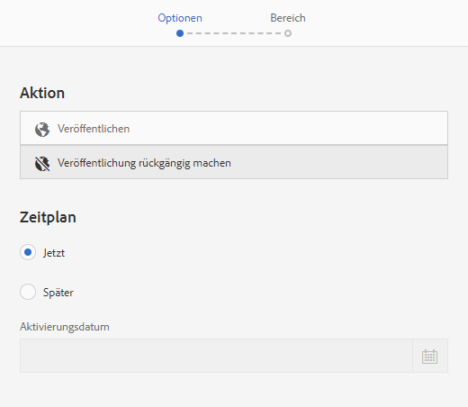
   *Abbildung: Veröffentlichen und Rückgängigmachen der Veröffentlichung sowie die Planungsoption.*

1. Wählen Sie **[!UICONTROL Jetzt]** aus, um das Asset sofort zu bearbeiten, oder wählen Sie **[!UICONTROL Später]** aus, um die Aktion zu planen. Wählen Sie ein Datum und eine Uhrzeit aus, wenn Sie die Option **[!UICONTROL Später]** wählen. Klicken Sie auf **[!UICONTROL Weiter]**.

1. Wenn ein Asset beim Veröffentlichen auf andere Assets verweist, werden seine Referenzen im Assistenten aufgelistet. Es werden nur die Verweise angezeigt, die seit der letzten Veröffentlichung entweder rückgängig gemacht oder geändert wurden. Wählen Sie die Referenzen aus, die Sie veröffentlichen möchten.

1. Wenn beim Rückgängigmachen der Veröffentlichung ein Asset auf andere Assets verweist, wählen Sie die Referenzen, deren Veröffentlichung Sie rückgängig machen möchten. Klicken Sie auf **[!UICONTROL Veröffentlichung rückgängig machen]**. Klicken Sie im Bestätigungsdialog auf **[!UICONTROL Abbrechen]**, um die Aktion abzubrechen, oder klicken Sie auf **[!UICONTROL Veröffentlichung rückgängig machen]**, um zu bestätigen, dass die Veröffentlichung der Assets zum angegebenen Datum rückgängig gemacht werden soll.

Machen Sie sich mit den folgenden Einschränkungen und Tipps im Zusammenhang mit dem Veröffentlichen oder Rückgängigmachen der Veröffentlichung von Assets oder Ordnern vertraut:

* Die Option [!UICONTROL Veröffentlichung verwalten] ist nur für Benutzerkonten mit Berechtigungen zur Replikation verfügbar.
* Wenn Sie die Veröffentlichung eines komplexen Assets rückgängig machen möchten, achten Sie darauf, nur die Veröffentlichung des Assets rückgängig zu machen. Machen Sie nicht die Veröffentlichung der Referenzen rückgängig, da diese möglicherweise auch von anderen veröffentlichten Assets referenziert werden.
* Leere Ordner werden nicht veröffentlicht.
* Wenn Sie ein Asset veröffentlichen, das gerade verarbeitet wird, wird nur der ursprüngliche Inhalt veröffentlicht. Die Ausgabedarstellungen fehlen. Warten Sie entweder auf den Abschluss der Verarbeitung und veröffentlichen Sie das Asset dann oder veröffentlichen Sie es erneut, sobald die Verarbeitung abgeschlossen ist.

## Geschlossene Benutzergruppe {#closed-user-group}

Eine geschlossene Benutzergruppe (Closed User Group, CUG) wird verwendet, um den Zugriff auf bestimmte aus [!DNL Experience Manager] veröffentlichte Asset-Ordner zu beschränken. Wenn Sie eine CUG für einen Ordner erstellen, wird der Zugriff auf diesen Ordner (einschließlich Ordner-Assets und Unterordnern) auf zugewiesene Mitglieder und Gruppen beschränkt. Um auf einen Ordner zuzugreifen, müssen Benutzer mit ihren Sicherheitsanmeldedaten angemeldet sein.

CUGs stellen eine zusätzliche Möglichkeit dar, den Zugang zu Ihren Assets zu beschränken. Sie können auch eine Anmeldeseite für den Ordner konfigurieren.

1. Wählen Sie in der [!DNL Assets]-Benutzeroberfläche einen Ordner aus und klicken Sie in der Symbolleiste auf die Option [!UICONTROL Eigenschaften] , um die Eigenschaftenseite anzuzeigen.
1. Fügen Sie auf der Registerkarte **[!UICONTROL Berechtigungen]** unter **[!UICONTROL Geschlossene Benutzergruppe]** Mitglieder oder Gruppen hinzu.

   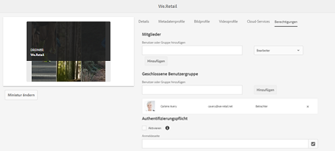

1. Um einen Anmeldebildschirm anzuzeigen, wenn Benutzer auf den Ordner zugreifen, wählen Sie die Option **[!UICONTROL Aktivieren]** aus. Wählen Sie anschließend den Pfad zur Anmeldeseite in [!DNL Experience Manager] aus und speichern Sie die Änderungen.

   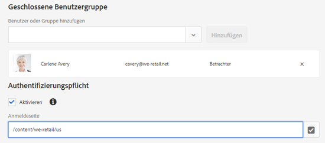

   >[!NOTE]
   >
   >Wenn Sie den Pfad zur Anmeldeseite nicht angeben, zeigt [!DNL Experience Manager] die standardmäßige Anmeldeseite in der Veröffentlichungsinstanz an.

1. Veröffentlichen Sie den Ordner und versuchen Sie, über die Veröffentlichungsinstanz darauf zuzugreifen. Es wird ein Anmeldebildschirm angezeigt.
1. Wenn Sie Mitglied der CUG sind, geben Sie Ihre Anmeldedaten ein. Nachdem Sie von [!DNL Experience Manager] authentifiziert wurden, wird der Ordner angezeigt.

## Suchen von Assets   {#assetsearch}

Die Suche nach Assets ist von zentraler Bedeutung für die Verwendung eines Digital Asset Management-Systems. Diese Funktion ist für Kreative, für eine robuste Verwaltung von Assets durch Geschäftsbenutzer und Marketing-Experten oder für die Verwaltung durch DAM-Administratoren wichtig.

Einfache, erweiterte und benutzerdefinierte Suchen zum Auffinden und Verwenden der am besten geeigneten Assets finden Sie unter [Suchen von Assets in Experience Manager](search-assets.md).

## Schnellaktionen {#quick-actions}

Schnellaktion-Symbole sind jeweils nur für ein Asset verfügbar. Führen Sie je nach Gerät folgende Aktionen durch, um die Symbole der Schnellaktionen anzuzeigen:

* Touch-Geräte: Tippen und halten. Mit einem Touch-Gerät, wie z. B. einem iPad, können Sie länger auf ein Asset tippen, damit die Schnellaktionen angezeigt werden.
* Nicht-Touch-Geräte: Mit Mauszeiger darüberfahren. Auf einem Desktop-Gerät wird beispielsweise eine Schnellzugriffsleiste angezeigt, wenn Sie mit dem Mauszeiger über die Miniaturansicht des Assets fahren.

### Navigieren und Auswählen von Assets {#navigating-and-selecting-assets}

Mit der Option **[!UICONTROL Auswählen]** können Sie Assets in allen verfügbaren Ansichten (Karte, Spalte und Liste) anzeigen, durch sie navigieren und diese auswählen.

In der Listen- und Spaltenansicht wird die Option **[!UICONTROL Auswählen]** angezeigt, wenn Sie den Mauszeiger über die Asset-Miniaturansicht bewegen.

In der Kartenansicht wird die Option **[!UICONTROL Auswählen]** als Schnellaktion angezeigt.

Beim Durchsuchen eines Ordners oder einer Sammlung in der Benutzeroberfläche von [!DNL Assets] in einem Browser können Sie alle angezeigten oder geladenen Assets mithilfe der Option [!UICONTROL Alle auswählen] oben rechts auswählen. Zunächst werden nur 100 Assets in der Kartenansicht geladen und 200 werden in der Listenansicht geladen. Weitere Assets werden in der Ansicht geladen, während Sie auf der Suchergebnisseite scrollen. Die Option [!UICONTROL Alle auswählen] wählt nur die geladenen Assets aus.

Weitere Informationen finden Sie unter [Anzeigen und Auswählen Ihrer Ressourcen](/help/sites-authoring/basic-handling.md#viewing-and-selecting-resources).

## Bearbeiten von Bildern {#editing-images}

Mit den Bearbeitungswerkzeugen in der Oberfläche von [!DNL Assets] können Sie kleine Bearbeitungsaktionen in Bild-Assets durchführen. Sie können Bilder beschneiden, drehen, spiegeln und auf andere Arten bearbeiten. Sie können auch Imagemaps zu den Assets hinzufügen.

>[!NOTE]
>
>Bei manchen Komponenten sind für den Vollbildmodus zusätzliche Optionen verfügbar.

1. Führen Sie einen der folgenden Schritte aus, um ein Element im Bearbeitungsmodus zu öffnen:

   * Wählen Sie das Asset aus und klicken Sie dann in der Symbolleiste auf **[!UICONTROL Bearbeiten]** .
   * Klicken Sie auf die Option **[!UICONTROL Bearbeiten]** , die in der Kartenansicht für ein Asset angezeigt wird.
   * Klicken Sie in der Symbolleiste  auf **[!UICONTROL Bearbeiten]**.

1. Um das Bild zu beschneiden, klicken Sie auf **[!UICONTROL Zuschneiden]** .

1. Wählen Sie die gewünschte Option aus der Liste aus. Der Zuschneidebereich wird auf dem Bild je nach gewählter Option angezeigt. Mit der Option **Freihand** können Sie das Bild ohne Einschränkungen des Seitenverhältnisses zuschneiden.

1. Wählen Sie den zuzuschneidenden Bereich und ändern Sie die Größe oder Position auf dem Bild.

1. Verwenden Sie die Optionen **[!UICONTROL Rückgängig]**  und **[!UICONTROL Wiederherstellen]**  , um zum nicht zugeschnittenen Bild zurückzukehren oder das zugeschnittene Bild beizubehalten.
1. Klicken Sie auf die entsprechende Option **[!UICONTROL Drehen]**, um das Bild im oder entgegen dem Uhrzeigersinn zu drehen.

   

1. Klicken Sie auf die entsprechenden Optionen **[!UICONTROL Spiegeln]** , wenn Sie das Bild horizontal spiegeln möchten  oder vertikal  reflektieren.

1. Um die Bildbearbeitung abzuschließen, klicken Sie auf **[!UICONTROL Finish]** &quot;. Durch Klicken auf **Finish** wird auch die Neuerstellung der Ausgabedarstellungen gestartet.

>[!NOTE]
>
>Bildbearbeitung wird für die Dateiformate BMP, GIF, PNG und JPEG unterstützt.

Sie können auch Imagemaps mit dem Bild-Editor hinzufügen. Einzelheiten dazu finden Sie in [Hinzufügen von Imagemaps](/help/assets/image-maps.md).

>[!NOTE]
>
>Zum Bearbeiten einer TXT-Datei verwenden Sie **Day CQ Link Externalizer** in Configuration Manager.

## Zeitleiste {#timeline}

In der Zeitleiste können Sie diverse Ereignisse für ein ausgewähltes Objekt ansehen, wie z. B. aktive Workflows für ein Asset, Kommentare/Anmerkungen, Aktivitätsprotokolle und Versionen.

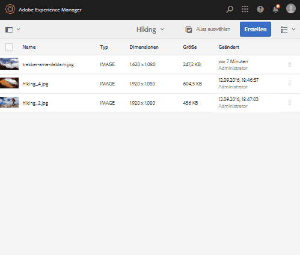

*Abbildung: Sortieren von Zeitleisten-Einträgen für ein Asset.*

>[!NOTE]
>
>In der [Konsole für Sammlungen](/help/assets/manage-collections.md#navigating-the-collections-console) bietet die Liste **[!UICONTROL Alle anzeigen]** Optionen, um nur Kommentare und Workflows anzuzeigen. Darüber hinaus wird die Zeitleiste nur für Sammlungen auf der höchsten Ebene angezeigt, die in der Konsole aufgelistet sind. Sie wird nicht angezeigt, wenn Sie in einer der Sammlungen navigieren.

>[!NOTE]
>
>Die Zeitleiste enthält mehrere [inhaltsfragmentspezifische Optionen](/help/assets/content-fragments/content-fragments-managing.md#timeline-for-content-fragments).

## Anmerkungen zu Assets {#annotating}

Anmerkungen sind Kommentare oder erläuternde Hinweise, die Bildern oder Videos hinzugefügt werden. Anmerkungen bieten Marketern die Möglichkeit, zusammenzuarbeiten und Feedback zu Assets bereitzustellen.

Videoanmerkungen werden nur bei Browsern mit HTML5-kompatiblen Videoformaten unterstützt. Welche Videoformate [!DNL Assets] unterstützt, hängt vom Browser ab.

>[!NOTE]
>
>Bei Inhaltsfragmenten werden [Anmerkungen im Fragmenteditor erstellt](/help/assets/content-fragments/content-fragments-variations.md#annotating-a-content-fragment).

1. Navigieren Sie zum Speicherort des Assets, dem Sie Anmerkungen hinzufügen möchten.
1. Klicken Sie in einer der folgenden Optionen auf die Option **[!UICONTROL Anmerken]** :

   * [Schnellaktionen](/help/assets/manage-assets.md#quick-actions)
   * In der Symbolleiste, nachdem Sie das Asset ausgewählt haben   oder zur Asset-Seite navigiert sind.

1. Fügen Sie im Feld **[!UICONTROL Kommentar]** am unteren Rand der Zeitleiste einen Kommentar hinzu. Sie haben auch die Möglichkeit, einen Bereich im Bild zu markieren und im Dialogfeld **[!UICONTROL Anmerkung hinzufügen]** eine Anmerkung hinzuzufügen.

1. Um einen Benutzer über eine Anmerkung zu benachrichtigen, geben Sie die E-Mail-Adresse des Benutzers an und fügen Sie den Kommentar hinzu. Beispiel: Um Aaron MacDonald über eine Anmerkung zu benachrichtigen, geben Sie „@aa“ ein. Vorschläge für alle übereinstimmenden Benutzer werden in einer Liste angezeigt. Wählen Sie aus der Liste die E-Mail-Adresse von Aaron aus, damit Sie der Person den Kommentar zuordnen können. Sie können auch weitere Benutzer innerhalb, vor oder nach der Anmerkung taggen.

   

   >[!NOTE]
   >
   >Für Benutzer ohne Administratorrechte werden die Vorschläge nur angezeigt, wenn der Benutzer über Leseberechtigungen für den Pfad `/home` in CRXDE verfügt.

1. Nachdem Sie die Anmerkung hinzugefügt haben, klicken Sie auf **[!UICONTROL Hinzufügen]**, um sie zu speichern. Eine Benachrichtigung über die Anmerkung wird an Aaron gesendet.

   >[!NOTE]
   >
   >Sie können mehrere Anmerkungen hinzufügen, bevor Sie diese speichern.

1. Klicken Sie auf **[!UICONTROL Schließen]**, um den Anmerkungsmodus zu verlassen.
1. Um die Benachrichtigung anzuzeigen, melden Sie sich mit den Anmeldedaten von Aaron MacDonald bei [!DNL Assets] an und klicken Sie auf die Option **[!UICONTROL Benachrichtigungen]** , um die Benachrichtigung anzuzeigen.

   >[!NOTE]
   >
   >Sie können Video-Assets auch Anmerkungen hinzufügen. Während Videos mit Anmerkungen versehen werden, wird der Player angehalten, damit Sie einem Frame eine Anmerkung hinzufügen können. Details finden Sie unter [Verwalten von Video-Assets](/help/assets/managing-video-assets.md).

1. Um eine andere Farbe auszuwählen, sodass Sie zwischen Benutzern unterscheiden können, klicken Sie auf die Option Profil und dann auf **[!UICONTROL Meine Voreinstellungen]**.

   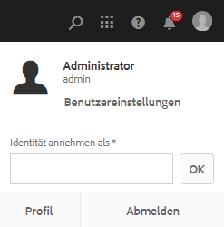

   Geben Sie die gewünschte Farbe in das Feld **[!UICONTROL Anmerkungsfarbe]** ein und klicken Sie dann auf **[!UICONTROL Accept]**.

   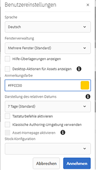

>[!NOTE]
>
>Sie können auch Anmerkungen zu einer Sammlung hinzufügen. Wenn eine Sammlung jedoch untergeordnete Sammlungen enthält, können Sie nur der übergeordneten Sammlung Anmerkungen/Kommentare hinzufügen. Die Option „Anmerken“ ist nicht für untergeordnete Sammlungen verfügbar.

### Anzeigen gespeicherter Anmerkungen {#viewing-saved-annotations}

Sie können jeweils nur eine Anmerkung anzeigen.

>[!NOTE]
>
>Wenn Sie mehrere Anmerkungen auswählen, wird die neueste Anmerkung in der Benutzeroberfläche angezeigt.
>
>Die Mehrfachauswahl wird nur zum Drucken des kommentierten Assets als PDF unterstützt.

**So zeigen Sie gespeicherte Anmerkungen für ein Asset an:**

1. Wechseln Sie zum Speicherort des Assets und öffnen Sie die Asset-Seite.

1. Wählen Sie in der Experience Manager-Benutzeroberfläche **[!UICONTROL Timeline]** aus.
1. Wählen Sie in der Liste **[!UICONTROL Alle anzeigen]** in der Zeitleiste **[!UICONTROL Kommentare]** aus, um die Ergebnisse anhand von Anmerkungen zu filtern.

   Klicken Sie auf einen Kommentar im Bedienfeld **[!UICONTROL Timeline]** , wenn Sie die entsprechende Anmerkung auf dem Bild anzeigen möchten.

   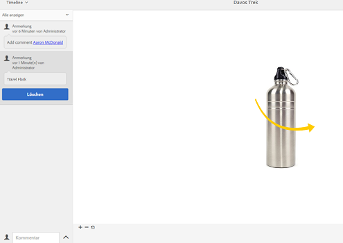

   Klicken Sie auf **[!UICONTROL Löschen]**, um einen bestimmten Kommentar zu löschen.

### Drucken von Anmerkungen {#printing-annotations}

Wenn ein Asset Anmerkungen aufweist oder einem Prüfungs-Workflow unterzogen wurde, können Sie das Asset einschließlich der Anmerkungen und des Prüfungsstatus für die Offline-Prüfung als PDF-Datei drucken.

Sie können auch nur die Anmerkungen oder nur den Prüfungsstatus drucken.

>[!NOTE]
>
>Sie können beim Drucken des kommentierten Assets mehrere Anmerkungen als PDF auswählen.

Um die Anmerkungen und den Prüfungsstatus zu drucken, klicken Sie auf **[!UICONTROL Drucken]** und befolgen Sie die Anweisungen im Assistenten. Die Option **[!UICONTROL Drucken]** wird nur dann in der Symbolleiste angezeigt, wenn dem Asset mindestens eine Anmerkung oder ein Prüfungsstatus zugewiesen ist.

1. Öffnen Sie in der [!DNL Assets]-Benutzeroberfläche die Vorschauseite für ein Asset.
1. Führen Sie einen der folgenden Schritte aus:

   * Zum Drucken aller Anmerkungen und des Prüfungsstatus überspringen Sie Schritt 3. Dann fahren Sie direkt mit Schritt 4 fort.
   * Zum Drucken bestimmter Anmerkungen und des Prüfungsstatus öffnen Sie die [Zeitleiste](/help/assets/manage-assets.md#timeline) und fahren Sie mit Schritt 3 fort.

1. Zum Drucken bestimmter Anmerkungen wählen Sie die Anmerkungen aus der Zeitleiste aus.

   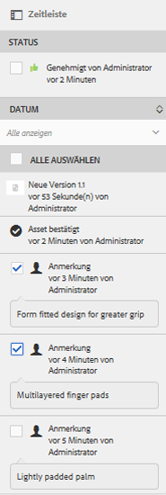

   Um nur den Prüfungsstatus zu drucken, wählen Sie ihn aus der Zeitleiste aus.

1. Klicken Sie in der Symbolleiste auf **[!UICONTROL Drucken]**.

1. Wählen Sie im Dialogfeld „Drucken“ die Position, deren Anmerkungen/Prüfungsstatus in der PDF-Datei angezeigt werden sollen. Wenn Sie beispielsweise die Anmerkungen/den Status in der linken oberen Ecke der Seite drucken möchten, die das gedruckte Bild enthält, verwenden Sie die Einstellung **Oben links**. Sie ist standardmäßig aktiviert.

   Sie können auch andere Einstellungen wählen, je nach der von Ihnen gewünschten Position der Anmerkungen oder des Status in der gedruckten PDF-Datei. Wenn sich die von Ihnen gewünschte Position der Anmerkungen/des Status auf einer Seite befindet, die nicht zum gedruckten Asset gehört, wählen Sie **[!UICONTROL Nächste Seite]**.

1. Klicken Sie auf **[!UICONTROL Drucken]**. Je nach der Option, die Sie in Schritt 2 wählen, zeigt die erstellte PDF-Datei die Anmerkungen/den Status an der angegebenen Position an. Beispiel: Wenn Sie beide Anmerkungen und den Prüfungsstatus mithilfe der Einstellung **Oben links** drucken, ähnelt die erstellte Ausgabe der hier dargestellten PDF-Datei.

   

1. Laden Sie  herunter oder drucken Sie  die PDF-Datei mithilfe der Optionen oben rechts.

   >[!NOTE]
   >
   >Wenn das Asset Unter-Assets enthält, können Sie alle Unter-Assets zusammen mit ihren jeweiligen seitenweisen Anmerkungen drucken.

   Um das Erscheinungsbild der gerenderten PDF-Datei zu bearbeiten, z. B. Schriftfarbe, -größe und -stil, öffnen Sie die **[!UICONTROL PDF-Konfiguration für Anmerkungen]** in Configuration Manager und ändern Sie die gewünschten Optionen. Um beispielsweise die Anzeigefarbe des Status „Bestätigt“ zu ändern, modifizieren Sie im entsprechenden Feld den Farb-Code. Informationen zum Ändern der Schriftfarbe von Anmerkungen finden Sie unter [Anmerken](/help/assets/manage-assets.md#annotating).

   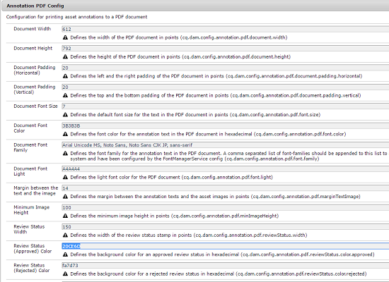

   Kehren Sie zu der gerenderten PDF-Datei zurück und aktualisieren Sie sie. Der aktualisierte PDF-Datei spiegelt die von Ihnen vorgenommenen Änderungen wider.

Wenn ein Asset Anmerkungen in Fremdsprachen enthält (insbesondere Sprachen, die nicht lateinisch sind), müssen Sie zunächst den CQ-DAM-Handler-Gibson Font Manager Service auf dem Server [!DNL Experience Manager] konfigurieren, damit Sie diese Anmerkungen drucken können. Beim Konfigurieren des CQ-DAM-Handler-Gibson Font Manager Service geben Sie den Pfad an, über den auf die gewünschten Sprachen zugegriffen werden kann.

1. Öffnen Sie die Konfigurationsseite „CQ-DAM-Handler-Gibson Font Manager Service“ über die URL `https://[aem_server]:[port]/system/console/configMgr/com.day.cq.dam.handler.gibson.fontmanager.impl.FontManagerServiceImpl`.
1. Um den CQ-DAM-Handler-Gibson Font Manager Service zu konfigurieren, führen Sie einen der folgenden Schritte aus:

   * Unter der Option „Verzeichnis der Systemschriftarten“ geben Sie den vollständigen Pfad für das Verzeichnis der Schriftarten auf Ihrem System an. Als Mac-Benutzer können Sie beispielsweise unter der Option „Verzeichnis der Systemschriftarten“ den Pfad als */Library/Fonts* angeben. [!DNL Experience Manager] ruft die Schriftarten aus diesem Verzeichnis ab.
   * Erstellen Sie ein Verzeichnis mit dem Namen `fonts` im Ordner `crx-quickstart`. Der CQ-DAM-Handler-Gibson Font Manager Service ruft die Schriftarten automatisch vom Speicherort `crx-quickstart/fonts` ab. Sie können diesen Standardpfad innerhalb der Option „Verzeichnis für Adobe-Serverschriftarten“ überschreiben.

   * Erstellen Sie einen Ordner für Schriftarten in Ihrem System und speichern Sie in diesem Ordner die gewünschten Schriftarten. Anschließend geben Sie in der Option „Verzeichnis für Kundenschriftarten“ den vollständigen Pfad zu diesem Ordner ein.

1. Greifen Sie über die URL `https://[aem_server]:[4502]/system/console/configMgr/com.day.cq.dam.core.impl.annotation.pdf.AnnotationPdfConfig` auf die Konfiguration für PDF-Anmerkungen zu.
1. Konfigurieren Sie die PDF-Datei, die Anmerkungen enthält, wie folgt mit der richtigen Schriftart:

   * Schließen Sie die Zeichenfolge `<font_family_name_of_custom_font, sans-serif>` in der Schriftartoption ein. Wenn Sie z. B. Anmerkungen in CJK (Chinesisch, Japanisch und Koreanisch) drucken möchten, schließen Sie die Zeichenfolge `Arial Unicode MS, Noto Sans, Noto Sans CJK JP, sans-serif` in die Schriftartoption ein. Wenn Sie Anmerkungen in Hindi drucken möchten, laden Sie die entsprechende Schriftart herunter und konfigurieren Sie die Schriftfamilie als Arial® Unicode MS®, Noto Sans, Noto Sans CJK JP, Noto Sans Devanagari, Sans-Serif.

1. Starten Sie die [!DNL Experience Manager] -Implementierung neu.

Hier ist ein Beispiel dafür, wie Sie [!DNL Experience Manager] so konfigurieren können, dass Anmerkungen in CJK (Chinesisch, Japanisch und Koreanisch) gedruckt werden:

1. Laden Sie die Google Noto CJK-Schriftarten über die folgenden Links herunter und speichern Sie sie im Schriftartenverzeichnis, das in Font Manager Service konfiguriert ist.

   * Schriftart All In One Super CJK: [https://www.google.com/get/noto/help/cjk/](https://www.google.com/get/noto/help/cjk/)
   * Noto Sans (für europäische Sprachen): [https://www.google.com/get/noto/](https://www.google.com/get/noto/)
   * Noto-Schriftarten für eine Sprache Ihrer Wahl: [https://www.google.com/get/noto/](https://www.google.com/get/noto/)

1. Konfigurieren Sie die PDF-Datei, die Anmerkungen enthält, indem Sie den Schriftartparameter auf `Arial Unicode MS, Noto Sans, Noto Sans CJK JP, sans-serif` setzen. Diese Konfiguration ist standardmäßig verfügbar und funktioniert bei allen europäischen und CJK-Sprachen.
1. Wenn sich die Sprache Ihrer Wahl von den Sprachen unterscheidet, die in Schritt 2 erwähnt werden, fügen Sie der Standardschriftart einen entsprechenden (kommagetrennten) Eintrag hinzu.

## Erstellen, Verwalten, Anzeigen einer Vorschau und Wiederherstellen von Asset-Versionen {#asset-versioning}

Bei der Versionierung wird eine Momentaufnahme von digitalen Assets zu einem bestimmten Zeitpunkt aufgezeichnet. Mithilfe der Versionierung können Sie Assets später wieder in einen vorherigen Status zurücksetzen. Wenn Sie etwa eine Änderung an einem Asset rückgängig machen wollen, stellen Sie die unbearbeitete Version des Assets wieder her. In [!DNL Experience Manager] können Sie eine Version erstellen, die aktuelle Version anzeigen, nebeneinander vorhandene Unterschiede zwischen zwei Versionen von Bildern anzeigen und ein Asset auf die vorherige Version zurücksetzen.

Sie können Versionen in [!DNL Experience Manager] in den folgenden Szenarien erstellen:

* Laden Sie ein Asset mit demselben Dateinamen hoch, der am selben Speicherort vorhanden ist. Es kann sich um ein neues Asset oder eine geänderte Version desselben Assets handeln.
* Bearbeiten Sie ein Bild in [!DNL Experience Manager] und speichern Sie die Änderungen.
* Bearbeiten Sie die Metadaten eines Assets.
* Verwenden Sie das [!DNL Experience Manager]-Desktop-Programm, um ein vorhandenes Asset auszuchecken, es zu bearbeiten und [Ihre Änderungen hochzuladen](https://experienceleague.adobe.com/docs/experience-manager-desktop-app/using/using.html#edit-assets-upload-updated-assets).

Sie können mithilfe eines Workflows die automatische Versionierung aktivieren. Wenn Sie eine Version für ein Asset erstellen, werden die Metadaten und Ausgabedarstellungen gemeinsam mit der Version gespeichert. Ausgabedarstellungen sind gerenderte Alternativen für dieselben Bilder, z. B. eine PNG-Ausgabedarstellung einer hochgeladenen JPEG-Datei.

1. Navigieren Sie zum Speicherort des Assets, für das Sie eine Version erstellen möchten, und klicken Sie darauf, um die Vorschau zu öffnen. Öffnen Sie das Menü in der linken oberen Ecke der Seite und wählen Sie **[!UICONTROL Timeline]** aus.

   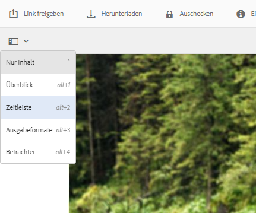

   *Abbildung: Öffnen Sie das Menü im linken oberen Bereich der Seite und wählen Sie die Option   Zeiteinteilung aus.*

1. So erstellen Sie eine Version des Assets:

   * Klicken Sie unten auf **[!UICONTROL Aktionen]**.
   * Klicken Sie auf **[!UICONTROL Als Version speichern]**, damit Sie eine Version für das Asset erstellen können. Fügen Sie optional eine Beschriftung und einen Kommentar hinzu.
   * Klicken Sie auf **[!UICONTROL Erstellen]** , um eine Version zu erstellen.

      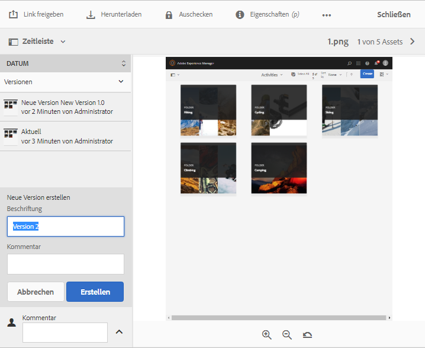

      *Abbildung: Erstellen Sie eine Version eines Assets über die   Timelineleft-Seitenleiste.*

1. So zeigen Sie eine Version eines Assets an:

   * Klicken Sie auf **[!UICONTROL Alle anzeigen]** in [!UICONTROL Timeline].
   * Klicken Sie auf **[!UICONTROL Versionen]**. Alle für ein Asset erstellten Versionen werden in der linken Seitenleiste aufgeführt.

   * Wählen Sie eine bestimmte Version des Assets aus und klicken Sie auf **[!UICONTROL Vorschau der Version]**.

1. Gehen Sie wie folgt vor, um zu einer älteren Version des Assets zurückzukehren. Nach dem Zurücksetzen wird diese Version in der [!DNL Assets]-Benutzeroberfläche angezeigt und kann verwendet werden.

   * Klicken Sie auf eine Version des Assets. Fügen Sie optional einen Titel und einen Kommentar hinzu.
   * Klicken Sie auf **[!UICONTROL Auf diese Version zurücksetzen]**.

      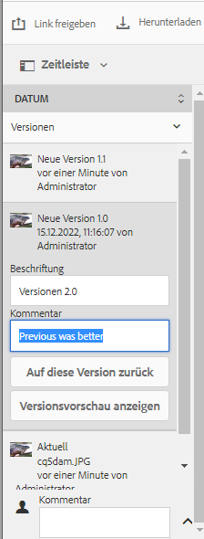

      *Abbildung: Wählen Sie eine Version aus und stellen Sie sie wieder her. Es wird zur aktuellen Version, die dann für die DAM-Benutzer verfügbar ist.*

1. Gehen Sie wie folgt vor, um zwischen zwei Versionen eines Bildes zu vergleichen:
   * Klicken Sie auf die Version, die mit der aktuellen Version verglichen werden soll.
   * Ziehen Sie den Regler nach links, um diese Version über die aktuelle Version zu platzieren und zu vergleichen.

   

   *Abbildung: Verwenden Sie den Schieberegler, um die ausgewählten Versionen eines Assets mühelos mit der aktuellen Version zu vergleichen.*

### Starten eines Workflows für ein Asset {#starting-a-workflow-on-an-asset}

Informationen zum Anwenden eines Workflows auf die Verarbeitung eines Assets finden Sie unter [Workflow zum Starten eines Assets](/help/assets/assets-workflow.md#apply-a-workflow-to-an-asset).

## Sammlungen {#collections}

Bei einer Sammlung handelt es sich um eine sortierte Gruppe von Assets. Verwenden Sie Sammlungen, um verwandte Assets zwischen Benutzern freizugeben oder um ähnliche Assets zur einfachen Erkennung zu gruppieren.

* Eine Sammlung kann Assets aus verschiedenen Speicherorten enthalten, da sie nur Verweise zu diesen Assets aufweisen. Jede Sammlung hält die referenzielle Integrität von Assets aufrecht.
* Sie können Sammlungen für mehrere Benutzer mit unterschiedlichen Berechtigungsstufen wie Bearbeiten, Anzeigen usw. freigeben.

Weitere Informationen zur Sammlungsverwaltung finden Sie unter [Verwalten von Sammlungen](/help/assets/manage-collections.md).

## Ausblenden abgelaufener Assets beim Anzeigen von Assets im Desktop-Programm oder Adobe Asset Link {#hide-expired-assets-via-acp-api}

Das [!DNL Experience Manager]-Desktop-Programm ermöglicht den Zugriff auf das DAM-Repository über Windows- oder Mac-Desktops. Adobe Asset Link ermöglicht den Zugriff auf Assets aus den unterstützten [!DNL Creative Cloud]-Desktop-Programmen.

Beim Durchsuchen von Assets in der [!DNL Experience Manager]-Benutzeroberfläche werden die abgelaufenen Assets nicht angezeigt. Um die Anzeige, das Durchsuchen und den Abruf abgelaufener Assets beim Durchsuchen von Assets im Desktop-Programm und über Asset Link zu verhindern, können Administratoren die folgende Konfiguration durchführen. Die Konfiguration funktioniert für alle Benutzer, unabhängig von den Administratorberechtigungen.

Führen Sie den folgenden CURL-Befehl aus. Stellen Sie den Lesezugriff auf `/conf/global/settings/dam/acpapi/` für Benutzer sicher, die auf Assets zugreifen. Benutzer, die zur Gruppe `dam-user` gehören, haben standardmäßig die Berechtigung dazu.

```curl
curl -v -u admin:admin --location --request POST 'http://localhost:4502/conf/global/settings/dam/acpapi/configuration/_jcr_content' \
--header 'Content-Type: application/x-www-form-urlencoded' \
--data-urlencode 'jcr:title=acpapiconfig' \
--data-urlencode 'hideExpiredAssets=true' \
--data-urlencode 'hideExpiredAssets@TypeHint=Boolean' \
--data-urlencode 'jcr:primaryType=nt:unstructured' \
--data-urlencode '../../jcr:primaryType=sling:Folder'
```

Weitere Informationen finden Sie unter [Durchsuchen von DAM-Assets mit dem Desktop-Programm](https://experienceleague.adobe.com/docs/experience-manager-desktop-app/using/using.html#browse-search-preview-assets) und [Verwenden von Adobe Asset Link](https://helpx.adobe.com/de/enterprise/admin-guide.html/enterprise/using/manage-assets-using-adobe-asset-link.ug.html).
