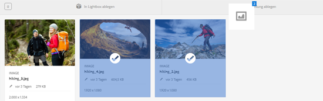
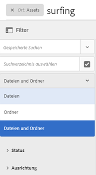
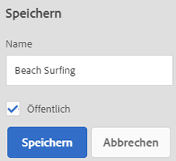
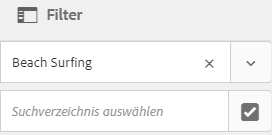
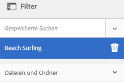
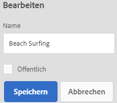
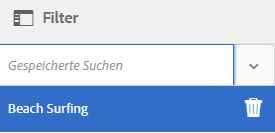

# Verwalten von Sammlungen {#managing-collections}

| Version | Artikel-Link |
| -------- | ---------------------------- |
| AEM as a Cloud Service | [Hier klicken](https://experienceleague.adobe.com/docs/experience-manager-cloud-service/content/assets/manage/manage-collections.html?lang=de) |
| AEM 6.5 | Dieser Artikel |

Eine Sammlung ist ein Satz von Assets innerhalb von [!DNL Adobe Experience Manager Assets]. Anhand von Sammlungen können Assets von mehreren Benutzern gemeinsam verwendet werden. Der Satz kann eine statische Sammlung oder eine dynamische Sammlung sein, die auf Suchergebnissen basiert.

Im Gegensatz zu Ordnern kann eine Sammlung Assets von verschiedenen Speicherorten enthalten. Sie können Sammlungen für verschiedene Benutzende freigeben, denen unterschiedliche Berechtigungsstufen zugewiesen sind, z. B. „Anzeigen“, „Bearbeiten“ usw.

Sie können mehrere Sammlungen für eine Benutzerin bzw. einen Benutzer freigeben. Jede Sammlung enthält Verweise auf Assets. Die referenzielle Integrität von Assets wird sammlungsübergreifend aufrechterhalten.

Sammlungen weisen die folgenden Typen auf, basierend auf der Art und Weise, wie sie Assets zusammenstellen:

* Eine Sammlung mit einer statischen Referenzliste von Assets, Ordnern und anderen Sammlungen.

* Eine Smart-Sammlung, die Assets auf Grundlage eines Suchkriteriums dynamisch verwendet.

## Aufrufen der Konsole „Sammlungen“ {#navigating-the-collections-console}

Zum Öffnen der **[!UICONTROL Sammlungen]** navigieren Sie in der [!DNL Experience Manager]-Benutzeroberfläche zu **[!UICONTROL Assets]** > **[!UICONTROL Sammlungen]**.

## Erstellen von Sammlungen {#creating-a-collection}

Sie können eine Sammlung mit [statischen Referenzen](#creating-a-collection-with-static-references) oder basierend auf einem [Suchkriterien-spezifischen Filter](#creating-a-smart-collection) erstellen. Sie können eine Sammlung auch über eine Lightbox erstellen.

### Erstellen von Sammlungen mit statischen Referenzen {#creating-a-collection-with-static-references}

Sie können eine Sammlung mit statischen Referenzen erstellen, z. B. eine Sammlung mit Referenzen zu Assets, Ordnern, Sammlungen, Rotationssets und Bildsets.

1. Navigieren Sie zur Konsole **[!UICONTROL Sammlungen]**.
1. Klicken Sie auf der Symbolleiste auf **[!UICONTROL Erstellen]**.
1. Geben Sie auf der Seite **[!UICONTROL Sammlung erstellen]** einen Titel und eine optionale Beschreibung für die Sammlung ein.
1. Fügen Sie Mitglieder zur Sammlung hinzu und weisen Sie entsprechende Berechtigungen zu. Wählen Sie alternativ **[!UICONTROL Öffentliche Sammlung]**, um allen Benutzern Zugriff auf die Sammlung zu ermöglichen.

   >[!NOTE]
   >
   >Um es Mitgliedern zu ermöglichen, Sammlungen mit anderen Benutzern zu teilen, gewähren Sie der Gruppe `dam-users` Leseberechtigungen für den Pfad `home/users`. Erteilen Sie den Benutzern eine Berechtigung für den Pfad `/content/dam/collections`, damit Benutzer Sammlungen in Popup-Listen anzeigen können. Alternativ dazu können Sie Benutzer auch in die Gruppe `dam-users` aufnehmen.

1. (Optional) Fügen Sie eine Miniatur für die Sammlung hinzu.
1. Klicken Sie auf **[!UICONTROL Erstellen]** und dann auf **[!UICONTROL OK]**, um das Dialogfeld zu schließen. In der Konsole „Sammlungen“ wird eine Sammlung mit dem angegebenen Titel und ihren Eigenschaften geöffnet.

   >[!NOTE]
   >
   >[!DNL Experience Manager Assets]Mit können Sie Prüfungsaufgaben für eine Sammlung auf ähnliche Weise wie Prüfungsaufgaben für einen Assets-Ordner erstellen.

   Um Assets zur Sammlung hinzuzufügen, navigieren Sie zur [!DNL Assets]-Benutzeroberfläche. Weitere Informationen finden Sie unter [Hinzufügen von Assets zu einer Sammlung](#adding-assets-to-a-collection).

### Erstellen von Sammlungen mithilfe der Dropzone {#create-collections-using-dropzone}

Sie können Assets aus der [!DNL Assets]-Benutzeroberfläche ziehen und in einer Sammlung ablegen. Sie können auch eine Kopie einer Sammlung erstellen und Assets dort hinziehen.

1. Wählen Sie in der [!DNL Assets]-Benutzeroberfläche die Assets aus, die Sie zu einer Sammlung hinzufügen möchten.
1. Ziehen Sie die Assets in den Bereich **[!UICONTROL In Sammlung ablegen]**. Klicken Sie alternativ auf der Symbolleiste auf **[!UICONTROL Zu Sammlung]**.

   

1. Klicken Sie auf der Symbolleiste auf der Seite **[!UICONTROL Zu Sammlung hinzufügen]** auf **[!UICONTROL Sammlung erstellen]**.

   Wenn Sie die Assets zu einer vorhandenen Sammlung hinzufügen möchten, wählen Sie sie auf der Seite aus und klicken Sie auf **[!UICONTROL Hinzufügen]**. Standardmäßig wird die zuletzt aktualisierte Sammlung ausgewählt.

1. Geben Sie im Dialogfeld **[!UICONTROL Neue Sammlung erstellen]** einen Namen für die Sammlung an. Wenn die Sammlung allen Benutzern zugänglich sein soll, wählen Sie **[!UICONTROL Öffentliche Sammlung]** aus.
1. Klicken Sie auf **[!UICONTROL Fortsetzen]**, um die Sammlung zu erstellen.

### Erstellen von Smart-Sammlungen {#creating-a-smart-collection}

Eine Smart-Sammlung verwendet Suchkriterien, um Assets dynamisch zu füllen. Sie können eine Smart-Sammlung nur mit Dateien und nicht mit Ordnern oder Dateien und Ordnern erstellen.

Zum Erstellen einer Smart-Sammlung führen Sie die folgenden Schritte aus:

1. Navigieren Sie zu [!DNL Assets] und klicken Sie auf „Suchen“.

1. Geben Sie den Suchbegriff in das OmniSearch-Feld ein und wählen Sie `Enter` aus. Öffnen Sie den Bereich „Filter“ und wenden Sie einen Suchfilter an.

1. Wählen Sie aus der Liste **[!UICONTROL Dateien und Ordner]** die Option **[!UICONTROL Dateien]** aus.

   

1. Klicken Sie auf **[!UICONTROL Smart-Sammlung speichern]**.

1. Geben Sie einen Namen für die Sammlung an. Aktivieren Sie **[!UICONTROL Öffentlich]**, um die DAM-Benutzergruppe mit der Rolle „Betrachter“ zur Smart-Sammlung hinzuzufügen.

   

   >[!NOTE]
   >
   >Bei Auswahl von **[!UICONTROL Öffentlich]** wird die Smart-Sammlung nach dem Erstellen für alle Benutzerinnen und Benutzer mit der Eigentümerrolle verfügbar. Wenn Sie die Option **[!UICONTROL Öffentlich]** deaktivieren, ist die DAM-Benutzergruppe nicht mehr mit der Smart-Sammlung verknüpft.

1. Klicken Sie auf **[!UICONTROL Speichern]**, um die Smart-Sammlung zu erstellen, und schließen Sie dann das Meldungsfenster, um den Vorgang abzuschließen.

   Die neue Smart-Sammlung wird auch zur Liste **[!UICONTROL Gespeicherte Suchen]** hinzugefügt.

   

   Die Bezeichnung der Option **[!UICONTROL Smart-Sammlung erstellen]** wird in **[!UICONTROL Smart-Sammlung bearbeiten]** geändert. Um die Einstellungen der Smart-Sammlung zu bearbeiten, wählen Sie **[!UICONTROL Dateien]** aus der Liste **[!UICONTROL Dateien und Ordner]** aus. Klicken Sie auf die Option **[!UICONTROL Smart-Auswahl bearbeiten]** .

## Hinzufügen von Assets zu einer Sammlung {#adding-assets-to-a-collection}

Sie können einer Sammlung mit einer Liste referenzierter Assets oder Ordner Assets hinzufügen. Smart-Sammlungen verwenden eine Suchabfrage zum Ausfüllen von Assets. Daher sind statische Referenzen zu Assets und Ordnern für sie nicht anwendbar.

1. Wählen Sie in der [!DNL A]ssets-Benutzeroberfläche das Asset aus und klicken Sie auf der Symbolleiste auf **[!UICONTROL Zu Sammlung]** .
Alternativ können Sie das Asset in den Bereich **[!UICONTROL In Sammlung ablegen]** auf der Benutzeroberfläche ziehen. Fügen Sie die Assets hinzu, wenn sich die Bezeichnung der Region in **[!UICONTROL Zum Hinzufügen ablegen]** ändert.

1. Wählen Sie auf der Seite **[!UICONTROL Zu Sammlung hinzufügen]** die Sammlung aus, der Sie das Asset hinzufügen möchten.

1. klicken Sie auf **[!UICONTROL Hinzufügen]** und schließen Sie die Bestätigungsmeldung. Das Asset wird zur Sammlung hinzugefügt.

## Bearbeiten von Smart-Sammlungen {#editing-a-smart-collection}

Smart-Sammlungen werden durch Speichern von Suchvorgängen erstellt. Das heißt, Sie können den Inhalt ändern, indem Sie die Suchparameter der [gespeicherten Suche](#saved-searches) ändern.

1. Klicken Sie auf der [!DNL Assets]-Benutzeroberfläche auf die Suchoption  auf der Symbolleiste.
1. Betätigen Sie bei in das OmniSearch-Feld gesetztem Cursor die `Return`-Taste.
1. Öffnen Sie in der [!DNL Experience Manager]-Benutzeroberfläche Bereich „Filter“.
1. Wählen Sie in der Liste **[!UICONTROL Gespeicherte Suchen]** die Smart-Sammlung aus, die Sie ändern möchten. Im Suchbereich werden die für die gespeicherte Suche konfigurierten Filter angezeigt.

   

1. Wählen Sie aus der Liste **[!UICONTROL Dateien und Ordner]** die Option **[!UICONTROL Dateien]** aus.
1. Ändern Sie den bzw. die Filter nach Bedarf. Klicken Sie auf **[!UICONTROL Smart-Sammlung bearbeiten]**.

   Sie können auch den Namen der Smart-Sammlung ändern.

   

1. Klicken Sie auf **[!UICONTROL Speichern]**. Das Dialogfeld **[!UICONTROL Smart-Sammlung bearbeiten]** wird angezeigt.
1. Klicken Sie auf **[!UICONTROL Überschreiben]**, um die ursprüngliche Smart-Sammlung durch die bearbeitete Sammlung zu ersetzen. Wählen Sie alternativ **[!UICONTROL Speichern unter]** aus, um die bearbeitete Sammlung separat zu speichern.
1. Klicken Sie im Bestätigungsdialogfeld auf **[!UICONTROL Speichern]**, um den Vorgang abzuschließen.

## Anzeigen und Bearbeiten von Sammlungsmetadaten {#view-edit-collection-metadata}

Sammlungsmetadaten umfassen die Daten zur Sammlung, einschließlich aller hinzugefügten Tags.

1. Wählen Sie in der Konsole [!UICONTROL Sammlungen] eine Sammlung aus und klicken Sie auf der Symbolleiste auf **[!UICONTROL Eigenschaften]**.
1. Zeigen Sie auf der Seite **[!UICONTROL Sammlungs-Metadaten]** die Metadaten der Sammlung auf den Registerkarten **[!UICONTROL Allgemein]** und **[!UICONTROL Erweitert]** an.
1. Ändern Sie bei Bedarf die Metadatenfelder. Um die Änderungen zu speichern, klicken Sie auf der Symbolleiste auf **[!UICONTROL Speichern und schließen]**.

## Stapelweises Bearbeiten der Metadaten mehrerer Sammlungen {#editing-collection-metadata-in-bulk}

Sie können die Metadaten mehrerer Sammlungen gleichzeitig bearbeiten. Mit dieser Funktion können Sie gängige Metadaten in mehreren Sammlungen schnell replizieren.

1. Wählen Sie in der Konsole „Sammlungen“ mindestens zwei Sammlungen aus.
1. Klicken Sie auf der Symbolleiste auf **[!UICONTROL Eigenschaften]**.
1. Bearbeiten Sie auf der Seite **[!UICONTROL Sammlungs-Metadaten]** die Metadaten auf den Registerkarten **[!UICONTROL Allgemein]** und **[!UICONTROL Erweitert]** nach Bedarf.
1. Heben Sie die Auswahl der anderen Sammlungen in der Sammlungsliste auf, um die Metadateneigenschaften für eine bestimmte Sammlung anzuzeigen. Die Metadateneditorfelder werden mit den Metadaten für die bestimmte Sammlung gefüllt.

   >[!NOTE]
   >
   >* Auf der Seite [!UICONTROL Eigenschaften] können Sie Sammlungen aus der Liste entfernen, indem Sie die Auswahl aufheben. In der Sammlungsliste sind alle Sammlungen standardmäßig ausgewählt. [!DNL Experience Manager] aktualisiert nicht die Metadaten der Sammlungen, die Sie entfernen.
   >* Aktivieren Sie über der Sammlungsliste das Kontrollkästchen neben **[!UICONTROL Titel]**, um zwischen der Auswahl von Sammlungen und dem Deaktivieren der Liste umzuschalten.

1. Klicken Sie auf der Symbolleiste auf **[!UICONTROL Speichern und schließen]** und schließen Sie dann das Bestätigungsdialogfeld.
1. Um die neuen Metadaten an die vorhandenen anzuhängen, wählen Sie **[!UICONTROL Beifügemodus]** aus. Wenn Sie diese Option nicht auswählen, ersetzen die neuen Metadaten die vorhandenen Metadaten in den entsprechenden Feldern. Klicken Sie auf **[!UICONTROL Senden]**.

   >[!NOTE]
   >
   >Die Metadaten, die Sie für die ausgewählten Sammlungen hinzufügen, überschreiben die vorherigen Metadaten für diese Sammlungen. Verwenden Sie den [!UICONTROL Anlagenmodus], um den vorhandenen Metadaten in Feldern, die mehrere Werte enthalten können, neue Werte hinzuzufügen. Einzelwertfelder werden immer überschrieben. Alle Tags, die Sie im Feld [!UICONTROL Tags] hinzufügen, werden der vorhandenen Liste der Tags in den Metadaten anhängt.

Verwenden Sie zum Anpassen der Seite mit den [!UICONTROL Eigenschaften] von Metadaten, einschließlich Hinzufügen, Ändern und Löschen von Metadateneigenschaften, den Schemaeditor.

>[!TIP]
>
>Die Massenbearbeitung kann auf Assets angewendet werden, die in einer Sammlung enthalten sind. Für Assets, die in verschiedenen Ordnern enthalten sind oder gemeinsamen Kriterien entsprechen, können die [Metadaten nach einer Suche stapelweise aktualisiert werden](/help/assets/search-assets.md#metadataupdates).

## Suchen nach Sammlungen {#searching-collections}

Sie können mit der Konsole „Sammlungen“ nach Sammlungen suchen. Wenn Sie die Suche mit Keywords im Suchfeld durchführen, sucht [!DNL Assets] nach Sammlungsnamen, Sammlungsmetadaten und den Tags, die zu den Sammlungen hinzugefügt wurden.

Wenn Sie auf der obersten Ebene nach Sammlungen suchen, werden in den Suchergebnissen nur einzelne Sammlungen zurückgegeben. [!DNL Assets] oder Ordner in den Sammlungen werden ausgeschlossen. In allen anderen Fällen (z. B. innerhalb einer individuellen Sammlung oder in einer Ordnerhierarchie) werden alle relevanten Assets, Ordner und Sammlungen zurückgegeben.

## Suchen in Sammlungen {#searching-within-collections}

Klicken Sie in der Konsole „Sammlungen“ auf eine Sammlung, um diese zu öffnen.

Innerhalb einer Sammlung ist die Suche von [!DNL Experience Manager] auf Assets (sowie deren Tags und Metadaten) in der angezeigten Sammlung begrenzt. Wenn Sie in einem Ordner suchen, werden alle passenden Assets und untergeordneten Ordner innerhalb des aktuellen Ordners zurückgegeben. Wenn Sie in einer Sammlung suchen, werden nur übereinstimmende Assets, Ordner und andere Sammlungen zurückgegeben, die direkt zur Sammlung gehören.

## Bearbeiten von Sammlungseinstellungen {#editing-collection-settings}

Sie können Sammlungseinstellungen, wie z. B. Titel und Beschreibung, bearbeiten oder Mitglieder zu einer Sammlung hinzufügen.

1. Wählen Sie eine Sammlung aus und klicken Sie auf der Symbolleiste auf **[!UICONTROL Einstellungen]**. Verwenden Sie alternativ die Schnellaktion **[!UICONTROL Einstellungen]** in der Miniatur der Sammlung.
1. Ändern Sie die Sammlungseinstellungen auf der Seite **[!UICONTROL Sammlungseinstellungen]**. Beispiel: Ändern Sie den Sammlungstitel, die Beschreibung, die Mitglieder und Berechtigungen wie unter [Hinzufügen von Sammlungen](#creating-a-collection) beschrieben.

1. Klicken Sie auf **[!UICONTROL Speichern]**, um die Änderungen zu speichern.

## Löschen von Sammlungen {#deleting-a-collection}

1. Wählen Sie in der Konsole „Sammlungen“ mindestens eine Sammlung aus und klicken Sie auf der Symbolleiste auf „Löschen“.

1. Klicken Sie im Dialogfeld auf **[!UICONTROL Löschen]**, um den Löschvorgang zu bestätigen.

   >[!NOTE]
   >
   >Sie können Smart-Sammlungen auch löschen, indem Sie [gespeicherte Suchen löschen](#saved-searches).

## Herunterladen von Sammlungen {#downloading-a-collection}

Wenn Sie eine Sammlung herunterladen, wird die gesamte Asset-Hierarchie innerhalb der Sammlung ebenfalls heruntergeladen, einschließlich Ordnern und untergeordneten Sammlungen.

1. Wählen Sie in der Konsole „Sammlungen“ eine oder mehrere Sammlungen für den Download aus.
1. Klicken Sie auf der Symbolleiste auf **[!UICONTROL Herunterladen]**.
1. Klicken Sie im Dialogfeld **[!UICONTROL Herunterladen]** auf **[!UICONTROL Herunterladen]**. Wählen Sie **[!UICONTROL Ausgabedarstellungen]** aus, wenn Sie die Ausgabedarstellungen des Assets in der Sammlung herunterladen möchten. Wählen Sie die Option **[!UICONTROL E-Mail]** aus, um eine E-Mail-Benachrichtigung an die verantwortliche Person der Sammlung zu senden.

   Bei Auswahl einer Sammlung für den Download wird die gesamte Ordnerstruktur unter dieser Sammlung heruntergeladen. Um jede Sammlung (einschließlich Assets in untergeordneten Sammlungen, die unter der übergeordneten Sammlung verschachtelt sind), die Sie herunterladen, in einem eigenen Ordner zu speichern, wählen Sie **[!UICONTROL Separaten Ordner für jedes Asset erstellen]** aus.

## Erstellen verschachtelter Sammlungen {#creating-nested-collections}

Sie können eine Sammlung zu einer anderen Sammlung hinzufügen und so eine verschachtelte Sammlung erstellen.

1. Wählen Sie in der Konsole „Sammlungen“ die gewünschte Sammlung oder Gruppe von Sammlungen aus und klicken Sie auf der Symbolleiste auf **[!UICONTROL Zu Sammlung]**.

1. Wählen Sie auf der Seite **[!UICONTROL Zu Sammlung hinzufügen]** die Sammlung aus, der die Sammlung hinzugefügt werden soll.

   >[!NOTE]
   >
   >Die zuletzt aktualisierte Sammlung wird standardmäßig auf der Seite **[!UICONTROL Zu Sammlung hinzufügen]** ausgewählt.

1. Klicken Sie auf **[!UICONTROL Hinzufügen]**. Eine Meldung bestätigt, dass die Sammlung zur Zielsammlung auf der Seite **[!UICONTROL Ziel auswählen]** hinzugefügt wird. Schließen Sie die Meldung, um den Vorgang abzuschließen.

>[!NOTE]
>
>Smart-Sammlungen können nicht verschachtelt werden. Mit anderen Worten: Smart-Sammlungen können keine andere Sammlung enthalten.

## Gespeicherte Suchvorgänge {#saved-searches}

In der [!DNL Assets]-Benutzeroberfläche können Sie basierend auf bestimmten Regeln, Suchkriterien oder benutzerdefinierten Suchfacetten durchsuchen oder filtern. Wenn Sie diese Einstellungen als **[!UICONTROL Gespeicherte Suchen]** speichern, können Sie später in der Liste **[!UICONTROL Gespeicherte Suchen]** im Filterbereich darauf zugreifen. Beim Erstellen einer gespeicherten Suche wird auch eine Smart-Sammlung erstellt.

Gespeicherte Suchen werden erstellt, wenn Sie eine Smart-Sammlung erstellen. Smart-Sammlungen werden automatisch der Liste **[!UICONTROL Gespeicherte Suchen]** hinzugefügt. Die Abfrage der [!UICONTROL gespeicherten Suche] für die Sammlung wird in der Eigenschaft `dam:query` in CRXDE unter dem relativen Speicherort `/content/dam/collections/` gespeichert. Die Suchen, die Sie speichern können, und die gespeicherten Suchen, die in der Liste angezeigt werden, sind unbegrenzt.

>[!NOTE]
>
>Sie können Smart-Sammlungen auf gleiche Weise wie statische Sammlungen freigeben.

Gespeicherte Suchen werden genauso wie Smart-Sammlungen bearbeitet. Einzelheiten dazu finden Sie unter [Bearbeiten von Smart-Sammlungen](#editing-a-smart-collection).

Gehen Sie wie folgt vor, um gespeicherte Suchen zu löschen:

1. Klicken Sie in der [!DNL Assets]-Benutzeroberfläche auf „Suchen“ .
1. Betätigen Sie bei in das OmniSearch-Feld gesetztem Cursor die `Return`-Taste.
1. Öffnen Sie in der [!DNL Experience Manager]-Benutzeroberfläche Bereich „Filter“.
1. Klicken Sie in der Liste **[!UICONTROL Gespeicherte Suchen]** neben der Smart-Sammlung, die Sie löschen möchten, auf **[!UICONTROL Löschen]**.

   

1. Klicken Sie im Dialogfeld auf **[!UICONTROL Löschen]**, um die gespeicherte Suche zu löschen.

## Ausführen eines Workflows für eine Sammlung {#running-a-workflow-on-a-collection}

Sie können einen Workflow für die Assets in einer Sammlung ausführen. Wenn die Sammlung verschachtelte Sammlungen enthält, wird der Workflow auch für die Assets innerhalb der verschachtelten Sammlungen ausgeführt. Wenn die Sammlung und die verschachtelte Sammlung jedoch doppelte Assets enthalten, wird der Workflow für diese Assets nur einmal ausgeführt.

1. Öffnen Sie **[!UICONTROL Assets]** > **[!UICONTROL Sammlungen]**. Um einen Workflow für eine bestimmte Sammlung auszuführen, wählen Sie diese aus.
1. Öffnen Sie die **[!UICONTROL Zeitleiste]**. Klicken Sie auf den  und dann auf **[!UICONTROL Workflow starten]**.
1. Wählen Sie im Abschnitt **[!UICONTROL Workflow starten]** ein Workflow-Modell aus der Liste aus. Wählen Sie beispielsweise das **[!UICONTROL DAM Update Asset]**-Modell aus.
1. Geben Sie einen Titel für den Workflow ein und klicken Sie auf **[!UICONTROL Starten]**.
1. Klicken Sie im Dialogfeld auf **[!UICONTROL Fortfahren]**. Der Workflow verarbeitet alle Assets in der ausgewählten Sammlung.

>[!MORELIKETHIS]
>
>* [Konfigurieren von Experience Manager Assets-E-Mail-Benachrichtigungen](/help/sites-administering/notification.md#assetsconfig)
>* [Erstellen einer Prüfungsaufgabe für Sammlungen](bulk-approval.md)
