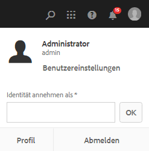

# Digitale Assets verwalten {#managing-assets-with-the-touch-optimized-ui}

In diesem Artikel wird das Verwalten und Bearbeiten von Assets in Adobe Experience Manager (AEM) beschrieben. Informationen zu den ersten Schritten mit der Benutzeroberfläche und dem Layout finden Sie unter [Grundlegende Handhabung der Touch-Benutzeroberfläche](/help/sites-authoring/basic-handling.md). Informationen zum Verwalten von Inhaltsfragmenten finden Sie unter [Verwalten von Inhaltsfragmenten](content-fragments-managing.md) -Assets.

## Erstellen von Ordnern {#creating-folders}

When organizing a collection of assets, for example, all `Nature` images, you can create folders to keep them together. Mit Ordnern können Sie Assets kategorisieren und organisieren. Bei AEM Assets müssen Sie Assets nicht in Ordner organisieren, um besser zu arbeiten.

>[!NOTE]
>
>* Die Freigabe eines Asset-Ordners vom Typ `sling:OrderedFolder` wird bei der Weitergabe an Marketing Cloud nicht unterstützt. If you want to share a folder, do not select [!UICONTROL Ordered] when creating a folder.
>* Experience Manager lässt die Verwendung von `subassets` Wort als Ordnername nicht zu. Es ist ein Schlüsselwort, das für Knoten reserviert ist, die Teilassets für zusammengesetzte Assets enthalten.

1. Navigieren Sie zu dem Ort in Ihrem Ordner „Digitale Assets“, an dem Sie einen neuen Ordner erstellen möchten. Klicken Sie im Menü auf **[!UICONTROL Erstellen]**. Select **[!UICONTROL New Folder]**.
1. In the **[!UICONTROL Title]** field, provide a folder name. DAM verwendet standardmäßig den Titel, den Sie als Ordnernamen angegeben haben. Wenn der Ordner erstellt wurde, können Sie die Standardeinstellung außer Kraft setzen und einen anderen Ordnernamen angeben.
1. Klicken Sie auf **[!UICONTROL Erstellen]**. Ihr Ordner wird im Ordner „Digitale Assets“ angezeigt.

Die folgenden Zeichen (in der Liste durch Leerzeichen getrennt) werden nicht unterstützt:

* Der Name einer Asset-Datei darf keines der folgenden Zeichen enthalten: `* / : [ \\ ] | # % { } ? &`
* Der Name eines Asset-Ordners darf keines der folgenden Zeichen enthalten: `* / : [ \\ ] | # % { } ? \" . ^ ; + & \t`

## Upload assets {#uploading-assets}

<!-- TBD the following:
Move this section into a new article. CQDOC-14874 ticket is created for this.
In this complete article, replace emphasis with UICONTROL where appropriate.
-->

Sie können verschiedene Arten von Assets (z. B. Bilder, PDF-Dateien, Raw-Dateien usw.) von Ihrem lokalen Ordner oder Netzlaufwerk in AEM Assets hochladen.

>[!NOTE]
>
>Im Dynamic Media Scene 7-Modus können Sie nur Assets mit einer Dateigröße von maximal 2 GB hochladen.

Sie können Assets in Ordnern mit oder ohne zugewiesenem Verarbeitungsprofil hochladen.

Für Ordner mit zugewiesenem Verarbeitungsprofil wird der Profilname in der Miniaturansicht der Kartenansicht angezeigt. In der Listenansicht wird der Profilname in der Spalte **Verarbeitungsprofil** angezeigt. Siehe [Verarbeitungsprofile](/help/assets/processing-profiles.md).

Before uploading an asset, ensure that it is in a [format](/help/assets/assets-formats.md) that AEM Assets supports.

1. Navigieren Sie in der Benutzeroberfläche &quot;Assets&quot;zu dem Speicherort, an dem Sie digitale Assets hinzufügen möchten.
1. Führen Sie einen der folgenden Schritte aus, um die Assets hochzuladen:

   * On the toolbar, tap the **[!UICONTROL Create]** icon. Then on the menu, tap **[!UICONTROL Files]**. Sie können die Datei im angezeigten Dialogfeld bei Bedarf umbenennen.
   * Ziehen Sie die Assets in einem Browser, der HTML5 unterstützt, direkt auf die Benutzeroberfläche &quot;Assets&quot;. Das Dialogfeld zum Umbenennen der Datei wird nicht angezeigt.
   

   Um mehrere Dateien auszuwählen, drücken Sie die Strg- oder Befehlstaste und wählen Sie die Assets im Dateiauswahl-Dialogfeld aus. Bei Verwendung eines iPads können Sie jeweils nur eine Datei auswählen.

   Sie können das Hochladen von großen Assets (größer als 500 MB) anhalten und später von der gleichen Seite aus fortsetzen. Tap the **[!UICONTROL Pause]** icon beside progress bar that appears when an upload starts.

   

   Die Größe, ab der ein Asset als großes Asset gilt, lässt sich konfigurieren. Sie können das System beispielsweise so konfigurieren, dass Assets über 1000 MB (anstatt 500 MB) als große Assets angesehen werden. In this case, **[!UICONTROL Pause]** appears on the progress bar when assets of size greater than 1000 MB are uploaded.

   Die Schaltfläche „Pause“ wird nicht angezeigt, wenn eine Datei, die größer ist als 1000 MB, mit einer Datei hochgeladen wird, die kleiner ist als 1000 MB. Wenn Sie jedoch den Upload der Datei abbrechen, die kleiner ist als 1000 MB, wird die Schaltfläche **[!UICONTROL Pause]** angezeigt.

   To modify the size limit, configure the `chunkUploadMinFileSize` property of the `fileupload`node in the CRX repository.

   Wenn Sie auf das Symbol **[!UICONTROL Pause]** klicken, wird es zum Symbol **[!UICONTROL Wiedergabe]**. Um das Hochladen fortzusetzen, klicken Sie auf das Symbol **[!UICONTROL Wiedergabe.]**

   

   To cancel an ongoing upload, click close (`X`) next to the progress bar. Wenn Sie den Upload abbrechen, löscht AEM Assets den teilweise hochgeladenen Teil des Assets.

   Den Upload fortsetzen zu können, ist besonders hilfreich bei geringer Bandbreite und Netzwerkfehlern, bei denen der Upload großer Assets lange dauern kann. Sie können den Uploadvorgang anhalten und später fortsetzen, wenn die Bedingungen besser sind. Beim Fortsetzen beginnt der Upload an dem Punkt, an dem Sie pausiert haben.

   Während des Uploads speichert AEM die Teile des hochgeladenen Assets als Datenblöcke im CRX-Repository. Wenn der Upload abgeschlossen ist, konsolidiert AEM diese Blöcke in einem einzelnen Datenblock im Repository.

   To configure the cleanup task for the unfinished chunk upload jobs, go to `https://[aem_server]:[port]/system/console/configMgr/org.apache.sling.servlets.post.impl.helper.ChunkCleanUpTask`.

   Wenn Sie ein Asset unter einem Namen hochladen, der bereits für ein Asset verwendet wird, das sich am Zielort befindet, wird eine Warnmeldung angezeigt.

   Sie können festlegen, ob ein vorhandenes Asset ersetzt, eine neue Version erstellt oder beide Assets beibehalten werden sollen, indem Sie das neue hochgeladene Asset umbenennen. Wenn Sie ein vorhandenes Asset ersetzen, werden die Metadaten für das Asset sowie alle zuvor vorgenommenen Änderungen (z. B. Anmerkungen oder Zuschneiden) gelöscht. If you choose to keep both assets, the new asset is renamed with number `1` appended to its name.

   

   >[!NOTE]
   >
   >When you select **[!UICONTROL Replace]** in the [!UICONTROL Name Conflict] dialog, the asset ID is regenerated for the new asset. Diese ID unterscheidet sich von der ID des vorherigen Assets.
   >
   >Wenn Asset Insights in Adobe Analytics zur Verfolgung von Impressionen/Klicks aktiviert ist, werden die für das Asset in Analytics erfassten Daten mit der neu generierten Asset-ID ungültig.

   If the asset you upload exists in AEM Assets, the **[!UICONTROL Duplicates Detected]** dialog warns that you are attempting to upload a duplicate asset. The dialog appears only if the `SHA 1` checksum value of the binary of the existing asset matches the checksum value of the asset you upload. In diesem Fall spielen die Namen der Assets keine Rolle.

   >[!NOTE]
   >
   >The [!UICONTROL Duplicates Detected] dialog appears only when the duplicate detection feature is enabled. To enable the duplicate detection feature, see [Enable Duplicate Detection](/help/assets/duplicate-detection.md).

   

   Um das Duplikat des Assets in AEM Assets beizubehalten, tippen/klicken Sie auf &quot; **[!UICONTROL Behalten]**&quot;. Um das hochgeladene Duplikat zu löschen, tippen/klicken Sie auf **[!UICONTROL Löschen]**.

   AEM Assets verhindert, dass Sie Assets mit den verbotenen Zeichen in ihren Dateinamen hochladen. Wenn Sie versuchen, ein Asset mit einem Dateinamen mit einem nicht zulässigen Zeichen oder mehr hochzuladen, zeigt AEM Assets eine Warnmeldung an und stoppt den Upload, bis Sie diese Zeichen entfernen oder mit einem zulässigen Namen hochladen.

   To suit specific file naming conventions for your organization, the [!UICONTROL Upload Assets] dialog lets you specify long names for the files that you upload.

   Allerdings werden die folgenden Zeichen (in der Liste durch Leerzeichen getrennt) nicht unterstützt:

   * asset file name must not contain `* / : [ \\ ] | # % { } ? &`
   * asset folder name must not contain `* / : [ \\ ] | # % { } ? \" . ^ ; + & \t`
   

   Darüber hinaus zeigt die Assets-Benutzeroberfläche das zuletzt hochgeladene Asset oder den Ordner, den Sie zuerst erstellt haben.

   Wenn Sie den Upload abbrechen, bevor die Dateien hochgeladen sind, unterbricht AEM Assets den Upload der aktuellen Datei und aktualisiert den Inhalt. Dateien, die bereits hochgeladen wurden, werden jedoch nicht gelöscht.

   Das Dialogfeld „Upload-Fortschritt“ in AEM Assets zeigt die Anzahl der erfolgreich hochgeladenen Dateien und die der Dateien an, die nicht hochgeladen werden konnten.

### Serielle Uploads {#serialuploads}

Das gleichzeitige Laden einer Vielzahl von Assets verbraucht erhebliche I/O-Ressourcen, die sich negativ auf die Leistung Ihrer AEM Assets-Instanz auswirken. Insbesondere bei einer langsamen Internetverbindung erhöht sich die Ladezeit aufgrund einer Auslastungsspitze beim Festplatten-I/O erheblich. Von Ihrem Webbrowser können weitere Einschränkungen auferlegt werden, die die Anzahl der POST-Anfragen betreffen, die AEM Assets für gleichzeitige Asset-Uploads verarbeiten kann. Fehler oder ein vorzeitiger Abbruch der Upload-Vorgänge können die Folge sein. Dabei kann es vorkommen, dass in AEM Assets bei der Erfassung großer Dateienmengen einige Dateien verloren gehen oder der Erfassungsvorgang insgesamt nicht ausgeführt werden kann.

Um diese Situation zu vermeiden, gibt es die Möglichkeit, Ladevorgänge im Stapelmodus seriell durchzuführen. Dabei werden in AEM Assets die Assets nicht gleichzeitig, sondern einzeln nacheinander erfasst.

Der serielle Upload von Assets ist standardmäßig aktiviert. To disable the feature and allow concurrent uploading, overlay the `fileupload` node in Crx-de and set the value of the `parallelUploads` property to `true`.

### Upload assets using FTP {#uploading-assets-using-ftp}

Dynamic Media ermöglicht das stapelweise Hochladen von Assets über FTP-Server. Wenn Sie große Assets (> 1 GB) hochladen oder ganze Ordner und Unterordner hochladen möchten, sollten Sie FTP verwenden. Sie können das Hochladen per FTP auch einrichten, um Uploads regelmäßig und nach Plan durchzuführen.

>[!NOTE]
>
>Im Dynamic Media Scene 7-Modus können Sie nur Assets mit einer Dateigröße von maximal 2 GB hochladen.

>[!NOTE]
>
>Um Assets über FTP in den Modus &quot;Dynamische Medien - Scene7&quot;hochzuladen, installieren Sie Feature Pack 18912 in den AEM-Autoreninstanzen. Contact [Adobe Customer Care](https://helpx.adobe.com/contact/enterprise-support.ec.html) to get access to FP-18912 and complete the setup of your FTP account. Weitere Informationen finden Sie unter [Installieren von Feature Pack 18912 für die Migration](/help/assets/bulk-ingest-migrate.md)von Massenelementen.
>
>Die in AEM angegebenen Upload-Einstellungen werden ignoriert, wenn Sie FTP zum Hochladen von Assets verwenden. Stattdessen werden Dateiverarbeitungsregeln, wie in Dynamic Media Classic definiert, verwendet.    

**So laden Sie Assets per FTP hoch**

1. Verwenden Sie den FTP-Client Ihrer Wahl und melden Sie sich beim FTP-Server mit dem FTP-Benutzernamen und -Kennwort aus der Bereitstellungs-E-Mail an. Laden Sie die Dateien und/oder Ordner über den FTP-Client auf den FTP-Server hoch.
1. [Melden Sie sich bei Dynamic Media Classic an](https://www.adobe.com/marketing-cloud/experience-manager/scene7-login.html), indem Sie die Anmeldeinformationen verwenden, die Sie in der Bereitstellungs-E-Mail erhalten haben. Tippen oder klicken Sie in der Leiste „Globale Navigation“ auf **[!UICONTROL Hochladen]**.

1. Klicken Sie auf der Seite „Hochladen“ in der Nähe der linken oberen Ecke auf die Registerkarte **[!UICONTROL Über FTP]**.
1. Wählen Sie im linken Bereich der Seite einen FTP-Ordner aus, aus dem Sie Dateien hochladen. Auf der rechten Seite der Seite wählen Sie einen Zielordner aus.
1. Klicken Sie in der rechten unteren Ecke der Seite auf **[!UICONTROL Auftragsoptionen]** und legen Sie auf der Grundlage der Assets, die in dem von Ihnen gewählten Ordner enthalten sind, die gewünschten Optionen fest.

   Siehe [Upload-Auftragsoptionen](#upload-job-options).

   >[!NOTE]
   >
   >Wenn Sie Assets per FTP hochladen, haben Optionen für das Hochladen, die Sie in Dynamic Media Classic (S7) festgelegt haben, Vorrang vor den in AEM festgelegten Asset-Verarbeitungsparametern.

1. Tippen Sie in der rechten unteren Ecke des Dialogfelds „Upload-Auftragsoptionen“ auf **[!UICONTROL Speichern]**.
1. Tippen Sie in der rechten unteren Ecke der Seite „Hochladen“ auf **[!UICONTROL Upload starten]**.

   Um den Upload-Fortschritt anzuzeigen, tippen Sie in der Leiste „Globale Navigation“ auf **[!UICONTROL Aufträge]**. Auf der Seite „Aufträge“ wird der Upload-Fortschritt angezeigt. Sie können mit der Arbeit in AEM fortfahren und jederzeit wieder in Dynamic Media Classic zur Seite „Aufträge“ zurückkehren, um einen gerade verarbeiteten Auftrag zu überprüfen.
Um die laufende Verarbeitung eines Upload-Auftrags abzubrechen, tippen oder klicken Sie neben der Information „Dauer“ auf die Schaltfläche **[!UICONTROL Abbrechen]**.

#### Upload-Auftragsoptionen {#upload-job-options}

| Upload-Optionen | Unteroption | Beschreibung |
|---|---|---|
| Auftragsname |  | Der Name, der standardmäßig in diesem Feld erstellt wird, enthält den vom Benutzer eingegebenen Teil des Namens und einen Zeitstempel samt Datum. Für diesen Upload-Auftrag können Sie den Standardnamen oder einen von Ihnen selbst erstellten Namen verwenden.  Der Auftrag und andere Upload- und Veröffentlichungsaufträge werden auf der Seite „Aufträge“ aufgezeichnet, wo Sie den Status der Aufträge prüfen können. |
| Nach dem Hochladen veröffentlichen |  | Veröffentlicht Assets automatisch nach dem Hochladen. |
| In belieb. Ordner Assets mit ident. Namen unabh. von Erweit. überschreiben |  | Wählen Sie diese Option aus, wenn hochgeladene Dateien vorhandene Dateien mit denselben Namen ersetzen sollen. Der Name dieser Option kann möglicherweise anders lauten, je nach den Einstellungen in **[!UICONTROL Anwendungseinstellungen]** > **[!UICONTROL Allgemeine Einstellungen]** > **[!UICONTROL Zur Anwendung hochladen]** > **[!UICONTROL Bilder überschreiben]**. |
| Zip- oder Tar-Dateien beim Hochladen dekomprimieren |  |  |
| Auftragsoptionen |  | Tap/ click **[!UICONTROL Job Options]** to open the [!UICONTROL Upload Job Options] dialog box and choose options that affect the entire upload job. Diese Optionen sind für alle Dateitypen gleich. Sie können über die Seite „Allgemeine Programmeinstellungen“ Standardoptionen für das Hochladen von Dateien auswählen. Um diese Seite zu öffnen, wählen Sie **[!UICONTROL Einstellung]** > **[!UICONTROL Anwendungseinstellungen]**. Tap the **[!UICONTROL Default Upload Options]** button to open the [!UICONTROL Upload Job Options] dialog box. |
|  | Wann | Wählen Sie „Einmalig“ oder „Wiederkehrend“ aus. Zum Einrichten eines wiederkehrenden Auftrags wählen Sie eine Wiederholungsoption („Täglich“, „Wöchentlich“, „Monatlich“ oder „Benutzerdefiniert“), um anzugeben, wie oft der FTP-Upload-Auftrag wiederholt werden soll. Dann geben Sie nach Bedarf die Planungsoptionen an. |
|  | Unterordner einschließen | Laden Sie alle Unterordner im hochzuladenden Ordner hoch. Der Name des hochgeladenen Ordners und die Namen der darin enthaltenen Unterordner werden automatisch in AEM Assets erfasst. |
|  | Optionen für das Zuschneiden | Um die Seiten eines Bildes manuell zu beschneiden, wählen Sie im Menü „Beschneiden“ die Option „Manuell“ aus. Dann geben Sie die Anzahl von Pixeln ein, die an einer oder jeder Seite des Bildes abgeschnitten werden sollen. Um wie viel das Bild beschnitten wird, hängt von der ppi-Einstellung (Pixel per Inch; Pixel pro Zoll) in der Bilddatei ab. Beispiel: Wenn das Bild 150 ppi aufweist und Sie 75 in die Textfelder für oben, rechts, unten und links eingeben, wird ein halber Zoll von jeder Seite abgeschnitten.  Zum automatischen Beschneiden der Leerraumpixel eines Bildes öffnen Sie das Menü „Beschneiden“, wählen Sie „Manuell“ und geben Sie zum Beschneiden der Seiten die Pixelwerte in die Felder „Oben“, „Rechts“, „Unten“ und „Links“ ein. Sie können im Menü „Beschneiden“ auch „Zuschneiden“ und anschließend folgende Optionen auswählen:  **Beschneiden basierend auf** <ul><li>**Farbe** : Wählen Sie die Option &quot;Farbe&quot;. Wählen Sie anschließend im Menü „Ecke“ die Bildecke mit der Farbe aus, die am besten der Leerraumfarbe entspricht, die Sie entfernen möchten.</li><li>**** Transparenz – Wählen Sie die Option „Transparenz“.  **Toleranz** - Ziehen Sie den Schieberegler, um eine Toleranz von 0 bis 1 festzulegen. Beim Beschneiden basierend auf Farbe geben Sie 0 an, damit Pixel nur abgeschnitten werden, wenn sie exakt der Farbe entsprechen, die Sie in der Bildecke ausgewählt haben. Werte, die näher an 1 liegen, lassen eine größere Farbdifferenz zu. Für das Zuschneiden auf der Grundlage der Transparenz geben Sie den Wert 0 an, damit Pixel nur dann abgeschnitten werden, wenn sie transparent sind. Werte, die näher an 1 liegen, lassen eine größere Transparenz zu.</li></ul> Beachten Sie, dass diese Optionen für das Beschneiden zerstörungsfrei sind. |
|  | Farbprofiloptionen | Wählen Sie beim Erstellen optimierter Dateien eine Farbkonversion aus, die für die Bereitstellung verwendet wird:<ul><li>Beibehaltung der Standardfarbe: Behält die Farben des Quellbildes bei, wenn die Bilder Farbrauminformationen enthalten. Es findet keine Farbkonversion statt. Heutzutage ist in fast allen Bildern das entsprechende Farbprofil eingebettet. Wenn jedoch ein CMYK-Quellbild kein eingebettetes Farbprofil enthält, werden die Farben in den Farbraum sRGB (standardmäßiges Rot Grün Blau) konvertiert. sRGB ist der empfohlene Farbraum zum Anzeigen von Bildern auf Webseiten.</li><li>Ursprünglichen Farbraum beibehalten: Behält die ursprünglichen Farben bei, ohne dass an der betreffenden Stelle eine Farbkonversion stattfindet. Bei Bildern ohne eingebettetes Farbprofil wird jede Farbkonversion mit den in den Veröffentlichungseinstellungen konfigurierten Standardfarbprofilen durchgeführt. Die Farbprofile stimmen möglicherweise nicht mit der Farbe in den Dateien überein, die mit dieser Option erstellt wurden. Deshalb empfiehlt es sich, die Option „Beibehaltung der Standardfarbe“ zu verwenden.</li><li>Benutzerdefinierte Einstellung von > in:  Öffnet Menüs, damit Sie einen „Konvertieren von“- und einen „Konvertieren in“-Farbraum auswählen können. Diese erweiterte Option überschreibt alle Farbinformationen, die in die Quelldatei eingebettet sind. Wählen Sie diese Option aus, wenn alle Bilder, die Sie senden, falsche oder fehlende Farbprofildaten enthalten.</li></ul> |
|  | Bildbearbeitungsoptionen | Sie können die Beschneidungsmasken in Bildern beibehalten und ein Farbprofil auswählen.  Siehe [Festlegen von Bildbearbeitungsoptionen beim Hochladen](#setting-image-editing-options-at-upload). |
|  | PostScript-Optionen | Sie können PostScript®-Dateien rastern, Dateien beschneiden, transparente Hintergründe beibehalten sowie eine Auflösung und einen Farbraum auswählen.  Siehe [Festlegen von PostScript- und Illustrator-Uploadoptionen](#setting-postscript-and-illustrator-upload-options). |
|  | Photoshop-Optionen | Sie können Vorlagen aus Adobe® Photoshop®-Dateien erstellen, Ebenen beibehalten, Ebenennamen angeben, Text extrahieren und angeben, wie Bilder in Vorlagen verankert sind.  Beachten Sie, dass in AEM Vorlagen nicht unterstützt werden.  Siehe [Festlegen von Photoshop-Uploadoptionen](#setting-photoshop-upload-options). |
|  | PDF-Optionen | Sie können die Dateien rastern, Suchbegriffe und -links extrahieren, automatisch einen E-Katalog erstellen, die Auflösung einstellen und einen Farbraum auswählen.  Beachten Sie, dass in AEM E-Kataloge nicht unterstützt werden.   Siehe [Festlegen von PDF-Uploadoptionen](#setting-pdf-upload-options). |
|  | Illustrator-Optionen | Sie können Adobe Illustrator®-Dateien rastern, transparente Hintergründe beibehalten sowie eine Auflösung und einen Farbraum auswählen.  Siehe [Festlegen von PostScript- und Illustrator-Uploadoptionen](#setting-postscript-and-illustrator-upload-options). |
|  | eVideo-Optionen | Sie können eine Videodatei durch Auswahl einer Videovorgabe transkodieren.  Siehe [Festlegen von eVideo-Uploadoptionen](#setting-evideo-upload-options). |
|  | Stapelsatzvorgaben | Um ein Bild- oder Rotationsset aus den hochgeladenen Dateien zu erstellen, klicken Sie auf die Spalte „Aktiv“ der Vorgabe, die Sie verwenden möchten. Sie können mehrere Vorgaben auswählen. Die Vorgaben erstellen Sie auf der Seite „Anwendungseinstellungen/Stapelsatzvorgaben“ von Dynamic Media Classic.  Weitere Informationen zur Erstellung von Stapelsatzvorgaben finden Sie unter [Konfigurieren von Stapelsatzvorgaben zum automatischen Erstellen von Bild- und Rotationssets](config-dms7.md#creating-batch-set-presets-to-auto-generate-image-sets-and-spin-sets).  Siehe [Festlegen von Stapelsatzvorgaben beim Hochladen](#setting-batch-set-presets-at-upload). |

#### Set image editing options at upload {#setting-image-editing-options-at-upload}

When uploading image files, including AI, EPS, and PSD files, you can take the following editing actions in the [!UICONTROL Upload Job Options] dialog box:

* Leerraum am Rand von Bildern beschneiden (siehe Beschreibung in der oben stehenden Tabelle) 
* Ränder von Bildern manuell beschneiden (siehe Beschreibung in der oben stehenden Tabelle)
* Ein Farbprofil auswählen (siehe Optionsbeschreibung in der oben stehenden Tabelle)
* Eine Maske aus einem Beschneidungspfad erstellen
* Bilder scharfzeichnen mit Optionen für „Unscharf maskieren“
* Hintergrund aussparen

<!--
| Option | Sub-option | Description |
|---|---|---|
| Create Mask From Clipping Path | | Create a mask for the image based on its clipping path information. This option applies to images created with image-editing applications in which a clipping path was created. |
| Unsharp Masking | | Lets you fine-tune a sharpening filter effect on the final downsampled image, controlling the intensity of the effect, the radius of the effect (as measured in pixels), and a threshold of contrast that is ignored.  This effect uses the same options as Photoshop’s Unsharp Mask filter. Contrary to what the name suggests, Unsharp Mask is a sharpening filter. Under Unsharp Masking, set the options you want. Setting options are described in the following: |
| | Amount | Controls the amount of contrast that is applied to edge pixels.  Think of it as the intensity of the effect. The main difference between the amount values of Unsharp Mask in Dynamic Media and the amount values in Adobe Photoshop, is that Photoshop has an amount range of 1% to 500%. Whereas, in Dynamic Media, the value range is 0.0 to 5.0. A value of 5.0 is the rough equivalent of 500% in Photoshop; a value of 0.9 is the equivalent of 90%, and so on. |
| | Radius | Controls the radius of the effect. The value range is 0-250.  The effect is run on all pixels in an image and radiates out from all pixels in all directions. The radius is measured in pixels. For example, to get a similar sharpening effect for a 2000 x 2000 pixel image and 500 x 500 pixel image, you would set a radius of two pixels on the 2000 x 2000 pixel image and a radius value of one pixel on the 500 x 500 pixel image. A larger value is used for an image that has more pixels. |
| | Threshold | Threshold is a range of contrast that is ignored when the Unsharp Mask filter is applied. It is important so that no "noise" is introduced to an image when this filter is used. The value range is 0-255, which is the number of brightness steps in a grayscale image. 0=black, 128=50% gray and 255=white.  For example, a threshold value of 12 ignores slight variations is skin tone brightness to avoid adding noise, but still add edge contrast to areas such as where eyelashes meet skin.  For example, if you have a photo of someone’s face, the Unsharp Mask affects the parts of the image, such as where eyelashes and skin meet to create an obvious area of contrast, and the smooth skin itself. Even the smoothest skin exhibits subtle changes in brightness values. If you do not use a threshold value, the filter accentuates these subtle changes in skin pixels. In turn, a noisy and undesirable effect is created while contrast on the eyelashes is increased, enhancing sharpness.  To avoid this issue, a threshold value is introduced that tells the filter to ignore pixels that do not change contrast dramatically, like smooth skin.  In the zipper graphic shown earlier, notice the texture next to the zippers. Image noise is exhibited because the threshold values were too low to suppress the noise. |
| | Monochrome | Select to unsharp-mask image brightness (intensity).  Deselect to unsharp-mask each color component separately. |
| Knockout Background | | Automatically removes the background of an image when you upload it. This technique is useful to draw attention to a particular object and make it stand out from a busy background. Select to enable or “turn on” the Knockout Background feature and the following sub-options: |
| | Corner | Required.  The corner of the image that is used to define the background color to knockout.  You can choose from **Upper Left**, **Bottom Left**, **Upper Right**, or **Bottom Right**. |
| | Fill Method | Required.  Controls pixel transparency from the Corner location that you set.  You can choose from the following fill methods: <ul><li>**Flood Fill** - turns all pixels transparent that match the Corner that you have specified and are connected to it.</li><li>**Match Pixel** - turns all matching pixels transparent, regardless of their location on the image.</li></ul> |
| | Tolerance | Optional.  Controls the allowable amount of variation in pixel color matching based on the Corner location that you set.  Use a value of 0.0 to match pixel colors exactly or, use a value of 1.0 to allow for the greatest variation. |
-->

#### Set PostScript and Illustrator upload options {#setting-postscript-and-illustrator-upload-options}

Wenn Sie PostScript (EPS)- oder Illustrator (AI)-Bilddateien hochladen, können Sie diese auf verschiedene Arten formatieren. Sie können die Dateien rastern, den transparenten Hintergrund beibehalten sowie eine Auflösung und einen Farbraum auswählen. Options for formatting PostScript and Illustrator files are available in the [!UICONTROL Upload Job Options] dialog box under [!UICONTROL PostScript Options] and [!UICONTROL Illustrator Options].

| Wahl | Unteroption | Beschreibung |
|---|---|---|
| Verarbeitung |  | Wählen Sie **[!UICONTROL Rastern]**, um Vektorgrafiken in der Datei in das Bitmap-Format zu konvertieren. |
| Transparenten Hintergrund in gerendertem Bild beibehalten |  | Zur Beibehaltung der Hintergrundtransparenz der Datei. |
| Auflösung |  | Zur Einstellung der Auflösung. Mit dieser Einstellung wird bestimmt, wie viele Pixel pro Zoll in der Datei angezeigt werden. |
| Farbraum |  | Klicken Sie auf das Menü „Farbraum“ und wählen Sie unter den folgenden Farbraumoptionen: |
|  | Automatisch erkennen | Der Farbraum der Datei wird beibehalten. |
|  | Immer RGB | Zur Konvertierung in den RGB-Farbraum. |
|  | Immer CMYK | Zur Konvertierung in den CMYK-Farbraum. |
|  | Immer Graustufen | Zur Konvertierung in den Graustufenfarbraum. |

#### Festlegen von Upload-Optionen für Fotoshop {#setting-photoshop-upload-options}

Fotoshop-Dokumentdateien (PSD-Dateien) werden meist zum Erstellen von Bildvorlagen verwendet. When you upload a PSD file, you can create an image template automatically from the file (select the [!UICONTROL Create Template] option on the Upload screen).

Dynamic Media erstellt mehrere Bilder aus einer PSD-Datei mit Ebenen, wenn Sie die Datei zum Erstellen einer Vorlage verwenden. Für jede Ebene wird ein Bild erstellt.

Use the [!UICONTROL Crop Options] and [!UICONTROL Color Profile Options], described above, with Photoshop upload options.

>[!NOTE]
>
>Vorlagen werden nicht in AEM unterstützt.

| Wahl | Unteroption | Beschreibung |
|---|---|---|
| Ebenen beibehalten |  | Teilt die Ebenen in der PSD-Datei ggf. in einzelne Assets auf. Die Asset-Ebenen bleiben der PSD-Datei zugeordnet. Sie können sie anzeigen, indem Sie die PSD-Datei in der Detailansicht öffnen und das Ebenenfenster auswählen. |
| Vorlage erstellen |  | Erstellt eine Vorlage aus den Ebenen der PSD-Datei. |
| Text extrahieren |  | Extrahiert den Text, damit Benutzer im Viewer den Text durchsuchen können. |
| Ebenen auf Hintergrundgröße ausdehnen |  | Erweitert die Größe aufgeteilter Bildebenen auf die Größe der Hintergrundebene. |
| Ebenenbenennung |  | Ebenen in der PSD-Datei werden als separate Bilder hochgeladen. |
|  | Ebenenname | Benennt die Bilder nach ihren Ebenennamen in der PSD-Datei. Wenn eine Ebene in der Original-PSD-Datei beispielsweise „Preisschild“ heißt, wird auch das zugehörige Bild „Preisschild“ genannt. Wenn es sich bei den Ebenennamen in der PSD-Datei jedoch um standardmäßige Photoshop-Ebenennamen handelt (Hintergrund, Ebene 1, Ebene 2 usw.), werden die Bilder nicht nach den Standardebenennamen, sondern nach den zugehörigen Ebenennummern in der PSD-Datei benannt. |
|  | Photoshop- und Ebenennummer | Benennt die Bilder nach ihren Ebenennummern in der PSD-Datei und ignoriert die ursprünglichen Ebenennamen. Bilder werden mit dem Photoshop-Dateinamen und einer angefügten Ebenennummer benannt. Zum Beispiel erhält die zweite Ebene der Datei Frühjahrsannonce.psd den Namen Frühjahrsannonce_2, auch wenn sie in Photoshop einen nicht standardmäßigen Namen hatte. |
|  | Photoshop- und Ebenenname | Benennt die Bilder nach der PSD-Datei, gefolgt vom Ebenennamen oder der -nummer. Die Ebenennummer wird verwendet, wenn es sich bei den Ebenennamen in der PSD-Datei um standardmäßige Photoshop-Ebenennamen handelt. Zum Beispiel erhält eine Ebene mit dem Namen „Preisschild“ in einer PSD-Datei mit dem Namen „Frühjahrsannonce“ den Namen „Frühjahrsannonce_Preisschild“. Eine Ebene mit dem standardmäßigen Namen „Ebene 2“ erhält den Namen „Frühjahrsannonce_2“. |
| Anker |  | Geben Sie an, wie Bilder in Vorlagen, die aus der Zusammenstellung der Ebenen aus der PSD-Datei erstellt werden, verankert werden. Der Anker ist standardmäßig zentriert. Ein zentrierter Anker eignet sich am besten zum Auffüllen desselben Raums mit Ersatzbildern, unabhängig vom Seitenverhältnis der Ersatzbilder. Bilder mit einem anderen Seitenverhältnis, die dieses Bild ersetzen, nehmen effektiv denselben Raum ein, wenn auf die Vorlage verwiesen und die Parameterersetzung durchgeführt wird. Wählen Sie eine andere Einstellung, wenn es für Ihre Anwendung erforderlich ist, dass die Ersatzbilder den zugeordneten Raum in der Vorlage ausfüllen. |

#### Optionen zum Hochladen von PDF festlegen {#setting-pdf-upload-options}

Wenn Sie eine PDF-Datei hochladen, können Sie diese auf verschiedene Arten formatieren. Sie können ihre Seiten zuschneiden, Suchbegriffe extrahieren, eine ppi (Pixel pro Zoll)-Auflösung eingeben und einen Farbraum auswählen. PDF-Dateien enthalten oft einen Beschnittrand, Schnittmarken, Registrierungsmarken und andere Druckermarken. Sie können diese Marken von den Seitenrändern aus zuschneiden, wenn Sie eine PDF-Datei hochladen.

>[!NOTE]
>
>E-Kataloge werden nicht in AEM unterstützt.

Wählen Sie unter folgenden Optionen:

| Wahl | Unteroption | Beschreibung |
|---|---|---|
| Verarbeitung | Rastern | (Standard) Zum Extrahieren der Seiten aus der PDF-Datei und zum Konvertieren von Vektorgrafiken in Bitmap-Bilder. Wählen Sie diese Option, um einen E-Katalog zu erstellen. |
| Extrahieren | Suchbegriffe | Zum Extrahieren von Wörtern aus der PDF-Datei, damit die Datei in einem E-Katalog-Viewer mit einem Schlüsselwort durchsucht werden kann. |
|  | Links | Zum Extrahieren von Links aus den PDF-Dateien und zum Konvertieren der PDF-Dateien in Imagemaps, die in einem E-Katalog-Viewer verwendet werden. |
| E-Katalog aus mehrseitiger PDF automatisch erstellen |  | Zum automatischen Erstellen eines E-Katalogs aus der PDF-Datei. Der E-Katalog wird nach der von Ihnen hochgeladenen PDF-Datei benannt. (Diese Option ist nur dann verfügbar, wenn Sie die PDF-Datei beim Hochladen rastern.) |
| Auflösung |  | Zum Festlegen der Auflösung: Mit dieser Einstellung wird bestimmt, wie viele Pixel pro Zoll in der PDF-Datei angezeigt werden. Standard: 150. |
| Farbraum |  | Wählen Sie das Farbraummenü und einen Farbraum für die PDF-Datei aus. Die meisten PDF-Dateien enthalten sowohl RGB- als auch CMYK-Farbbilder. Der RGB-Farbraum eignet sich besonders gut, um Dateien online anzuzeigen. |
|  | Automatisch erkennen | Der Farbraum der PDF-Datei wird beibehalten. |
|  | Immer RGB | Zur Konvertierung in den RGB-Farbraum. |
|  | Immer CMYK | Zur Konvertierung in den CMYK-Farbraum. |
|  | Immer Graustufen | Zur Konvertierung in den Graustufenfarbraum. |

#### Festlegen von eVideo-Upload-Optionen {#setting-evideo-upload-options}

So transkodieren Sie eine Videodatei, indem Sie aus einer Vielzahl von Video-Vorgaben wählen.

| Wahl | Unteroption | Beschreibung |
|---|---|---|
| Adaptives Video |  | Eine einzelne Kodierungsvorgabe, die mit jedem Seitenverhältnis verwendet werden kann, um Videos zur Wiedergabe auf Mobilgeräten, Tablets und Desktops zu erstellen. Hochgeladene Quellvideos, die mit dieser Vorgabe kodiert wurden, weisen eine feste Höhe auf. Die Breite wird jedoch automatisch skaliert, um das Seitenverhältnis des Videos beizubehalten.  Die beste Vorgehensweise ist die Verwendung der adaptiven Videokodierung. |
| Einzelne Kodierungsvorgaben | Kodierungsvorgaben sortieren | Wählen Sie &quot;Name&quot;oder &quot;Größe&quot;, um die unter &quot;Desktop&quot;, &quot;Mobil&quot;und &quot;Tablet&quot;aufgelisteten Kodierungsvorgaben nach Name oder Auflösung zu sortieren. |
|  | Desktop | Erstellen Sie eine MP4-Datei zur Bereitstellung eines Streaming- oder progressiven Videoerlebnisses auf Desktop-Computern.Wählen Sie ein oder mehrere Seitenverhältnisse mit der gewünschten Auflösung und Zieldatenrate aus. |
|  | Mobilgerät | Erstellen Sie eine MP4-Datei zur Bereitstellung auf iPhone- oder Android-Mobilgeräten.Wählen Sie ein oder mehrere Seitenverhältnisse mit der gewünschten Auflösung und Zieldatenrate aus. |
|  | Tablet | Erstellen Sie eine MP4-Datei zur Wiedergabe auf iPad- oder Android-Tablet-Geräten.Wählen Sie ein oder mehrere Seitenverhältnisse mit der gewünschten Auflösung und Zieldatenrate aus. |

#### Set Batch Set Presets at upload {#setting-batch-set-presets-at-upload}

Wenn Sie aus hochgeladenen Bildern automatisch einen Bildsatz oder ein Rotationsset erstellen möchten, klicken Sie auf die Spalte &quot;Aktiv&quot;für die gewünschte Vorgabe. Sie können mehrere Vorgaben auswählen. 

Weitere Informationen zur Erstellung von Stapelsatzvorgaben finden Sie unter [Konfigurieren von Stapelsatzvorgaben zum automatischen Erstellen von Bild- und Rotationssets](/help/assets/config-dms7.md#creating-batch-set-presets-to-auto-generate-image-sets-and-spin-sets).

### Gestreamte Uploads {#streamed-uploads}

Wenn Sie viele Assets in AEM hochladen, erhöhen sich die E/A-Anforderungen an den Server drastisch, was die Upload-Effizienz verringert und sogar dazu führen kann, dass einige Upload-Aufgaben zeitaufwendig ausfallen. AEM Assets unterstützt gestreamte Uploads von Assets. Durch Streaming-Uploads wird der I/O-Speicher des Datenträgers während des Upload-Vorgangs reduziert, da der Speicher des Assets in einem temporären Ordner auf dem Server vermieden wird, bevor er in das Repository kopiert wird. Stattdessen werden die Daten direkt an das Repository übertragen. Auf diese Weise wird die Zeit für das Hochladen von Assets und die Möglichkeit von Zeitüberschreitungen verringert. Das gestreamte Hochladen ist in AEM Assets standardmäßig aktiviert.

>[!NOTE]
>
>Das Hochladen von Streaming ist für AEM, das auf dem JEE-Server ausgeführt wird, mit einer Servlet-API-Version unter 3.1 deaktiviert.

### ZIP-Archiv mit Assets extrahieren {#extractzip}

Sie können ZIP-Archive wie jedes andere unterstützte Asset hochladen. Für ZIP-Dateien gelten dieselben Regeln für Dateinamen. Mit AEM können Sie ein ZIP-Archiv in einen DAM-Speicherort extrahieren. Wenn die Aktivdateien nicht die Erweiterung ZIP haben, aktivieren Sie die Dateityperkennung über den Inhalt.

Wählen Sie jeweils ein ZIP-Archiv aus, klicken Sie auf **[!UICONTROL Archiv extrahieren]** und wählen Sie einen Zielordner aus. Wählen Sie eine Option für den Umgang mit eventuellen Konflikten. Wenn die Assets in der ZIP-Datei bereits im Zielordner vorhanden sind, können Sie eine der folgenden Optionen auswählen: Extrahieren überspringen, vorhandene Dateien ersetzen, beide Assets durch Umbenennen behalten oder neue Version erstellen.

Nach Abschluss des Extrahierungsvorgangs erhalten Sie von AEM eine Benachrichtigung im Benachrichtigungsbereich. Während AEM das ZIP-Archiv extrahiert, können Sie ohne Unterbrechung des Extrahierungsvorgangs zu Ihrer Arbeit zurückkehren.

Die Funktion hat einige Einschränkungen:

* Wenn sich ein gleichnamiger Ordner am Ziel befindet, werden die Assets aus der ZIP-Datei in diesen extrahiert.
* Wenn Sie die Extrahierung abbrechen, werden die bereits extrahierten Assets nicht gelöscht.
* Sie können nicht gleichzeitig zwei ZIP-Dateien auswählen und extrahieren. Sie können jeweils nur ein ZIP-Archiv extrahieren.
* Wenn beim Hochladen eines ZIP-Archivs im Dialogfeld „Hochladen“ ein „500 Server Error“ angezeigt wird, versuchen Sie es nach der Installation des neuesten Service Packs erneut.

## Anzeigen einer Asset-Vorschau {#previewing-assets}

Gehen Sie wie folgt vor, um eine Vorschau eines Assets anzuzeigen.

1. Navigieren Sie in der Benutzeroberfläche &quot;Assets&quot;zum Speicherort des Assets, dessen Vorschau Sie anzeigen möchten.
1. Tippen Sie auf das gewünschte Asset, um es zu öffnen.

1. Im Vorschaumodus ist eine Zoom-Funktion für [unterstützte Bildtypen](/help/assets/assets-formats.md#supported-raster-image-formats) verfügbar (mit interaktiver Bearbeitung).

   To zoom into an asset, tap/click `+` (or tap/click the magnifying glass on the asset). To zoom out, tap/click `-`. Beim Heranzoomen können Sie beliebige Bildbereiche durch Schwenken genauer untersuchen. Mit dem Zurücksetzen-Zoom-Pfeil kehren Sie zur ursprünglichen Ansicht zurück.

   

   Tap **[!UICONTROL Reset]** to reset the view to the original size.

   

**Anzeigen einer Asset-Vorschau nur mit Tastaturbefehlen**

Gehen Sie wie folgt vor, um eine Vorschau eines Assets über die Tastatur anzuzeigen:

1. Navigieren Sie in der Benutzeroberfläche &quot;Assets&quot;mithilfe der Pfeiltasten zum Speicherort des Assets, das Sie in der Vorschau anzeigen möchten, `Tab` und wählen Sie den Speicherort aus.

1. Öffnen Sie das gewünschte Asset.

   In the preview mode, zoom and reset options are available for [supported Image types](/help/assets/assets-formats.md#supported-raster-image-formats) (with interactive editing).
1. So vergrößern Sie das Asset:
   1. Verwenden Sie die `Tab` Taste, um den Fokus auf das Einzoomen-Symbol zu verschieben.
   1. Verwenden Sie die `Enter` Taste, um das Bild zu vergrößern.
   Zum Auszoomen verwenden Sie die `Tab` Taste, um den Fokus auf das Zoomsymbol zu verschieben, und drücken `Enter`Sie die Eingabetaste.

1. Verwenden Sie `Shift` + `Tab` , um den Fokus wieder auf das Bild zu verschieben.

1. Verwenden Sie die Pfeiltasten, um sich um das gezoomte Bild zu bewegen.

See also [Preview Dynamic Media Assets.](/help/assets/previewing-assets.md)

## Eigenschaften und Metadaten bearbeiten {#editing-properties}

1. Navigieren Sie zum Speicherort des Assets, dessen Metadaten Sie bearbeiten möchten.

1. Select the asset, and tap/click **[!UICONTROL Properties]** from the toolbar to view asset properties. Wählen Sie alternativ die Schnellaktion **[!UICONTROL Eigenschaften]** auf der Asset-Karte aus.

   

1. In the [!UICONTROL Properties] page, edit the metadata properties under various tabs. Zum Beispiel bearbeiten Sie auf der Registerkarte **[!UICONTROL Allgemein]** den Titel, die Beschreibung usw.

   >[!NOTE]
   >
   >The layout of the [!UICONTROL Properties] page and the metadata properties available depend on the underlying metadata schema. To learn how to modify the layout of the [!UICONTROL Properties] page, see [Metadata Schemas](/help/assets/metadata-schemas.md).

1. Um ein bestimmtes Datum/eine bestimmte Uhrzeit für die Aktivierung des Assets zu planen, verwenden Sie die Datumsauswahl neben dem Feld **[!UICONTROL Zeit]**.

   

1. To deactivate the asset after a particular duration, choose the deactivation date/time from the date picker beside the **[!UICONTROL Off Time]** field. Das Deaktivierungsdatum sollte später als das Aktivierungsdatum für ein Asset sein. Nach der [!UICONTROL Abschaltzeit]sind ein Asset und seine Darstellungen weder über die Assets-Weboberfläche noch über die HTTP-API verfügbar.

   

1. Wählen Sie im Feld **[!UICONTROL Tags]** ein oder mehrere Tags aus. Um ein benutzerdefiniertes Tag hinzuzufügen, geben Sie den Namen des Tags in das Feld ein. Anschließend drücken Sie die Eingabetaste. Das neue Tag wird in AEM gespeichert. YouTube erfordert Tags zum Veröffentlichen. See [publish videos to YouTube](video.md#publishing-videos-to-youtube).

   >[!NOTE]
   >
   >Zum Erstellen von Tags benötigen Sie Schreibberechtigung `/content/cq:tags/default` im CRX-Repository.

1. Um eine Bewertung für das Asset bereitzustellen, tippen/klicken Sie auf die Registerkarte **[!UICONTROL Erweitert]** und tippen/klicken Sie dann auf den Stern an der entsprechenden Position, um die gewünschte Bewertung zuzuweisen.

   

   Die Bewertungsnote, die Sie dem Asset zuweisen, wird unter **[!UICONTROL Ihre Bewertungen]** angezeigt. Die durchschnittliche Bewertungsnote, die das Asset von Benutzern erhält, wird unter **[!UICONTROL Bewertung]** angezeigt. Darüber hinaus wird die Aufschlüsselung der Bewertungen, die zur durchschnittlichen Bewertungsnote beitragen, unter **[!UICONTROL Bewertungsübersicht]** angezeigt. Sie können Assets basierend auf der durchschnittlichen Bewertungsnote durchsuchen.

1. To view usage usage statistics for the asset, click/tap the **[!UICONTROL Insights]** tab.

   Nutzungsstatistiken umfassen folgende Metriken:

   * Anzahl der Aufrufe oder Downloads des Assets
   * Kanäle/Geräte, über die das Asset genutzt wurde
   * Kreativlösungen, in denen das Asset kürzlich verwendet wurde
   Weitere Informationen finden Sie unter [Asset Insights](/help/assets/touch-ui-asset-insights.md).

1. Tippen oder klicken Sie auf **[!UICONTROL Speichern und schließen]**.
1. Navigieren Sie zur Benutzeroberfläche &quot;Assets&quot;. Die bearbeiteten Metadateneigenschaften, darunter Titel, Beschreibung, Bewertungen usw., werden auf der Asset-Karte in der Kartenansicht sowie in relevanten Spalten in der Listenansicht angezeigt.

## Kopieren von Assets {#copying-assets}

Beim Kopieren eines Assets oder eines Ordners wird das gesamte Asset bzw. der Ordner mitsamt seiner Inhaltsstruktur kopiert. Ein kopiertes Asset oder ein kopierter Ordner wird am Zielspeicherort dupliziert. Das Asset am Quellspeicherort bleibt unverändert.

Einige wenige, für eine bestimmte Kopie eines Assets eindeutige Attribute werden nicht übertragen. Beispiele:

* Asset-ID, Erstellungsdatum und -zeit sowie Versionen und Versionsverlauf. Some of these properties are indicated by the properties `jcr:uuid`, `jcr:created`, and `cq:name`.

* Der Erstellungszeitpunkt und referenzierte Pfade sind für jedes Asset und jede seiner Wiedergaben eindeutig.

Die übrigen Eigenschaften und Metadateninformationen werden beibehalten. Eine Teilkopie wird beim Kopieren eines Assets nicht erstellt.

1. From the Assets UI, select one or more assets, and then tap/click the **[!UICONTROL Copy]** icon from the toolbar. Alternatively, select the **[!UICONTROL Copy]** quick action from the asset card.
   

   >[!NOTE]
   >
   >If you use the [!UICONTROL Copy] quick action, you can only copy one asset at a time.

1. Navigieren Sie zum Speicherort, in den Sie die Assets kopieren möchten.

   >[!NOTE]
   >
   >Wenn Sie ein Asset in denselben Speicherort kopieren, generiert AEM automatisch eine Variation des Namens. For example, if you copy an asset titled `Square`, AEM automatically generates the title for its copy as `Square1`.

1. Click/ tap the **[!UICONTROL Paste]** asset icon from the toolbar.

   Assets werden dann an diesen Speicherort kopiert.

   >[!NOTE]
   >
   >The **[!UICONTROL Paste]** icon is available in the toolbar until the paste operation is completed.

### Verschieben oder Umbenennen von Assets {#moving-or-renaming-assets}

1. Navigieren Sie zum Speicherort des Assets, das Sie verschieben möchten.

1. Select the asset, and tap/click the **[!UICONTROL Move]** icon from the toolbar.
   

1. Führen Sie im Assistenten „Assets verschieben“ eine der folgenden Aktionen aus:

   * Geben Sie nach dem Verschieben den Namen für das Asset an. Then tap/click **[!UICONTROL Next]** to proceed.

   * Tap/click **[!UICONTROL Cancel]** to stop the process.
   >[!NOTE]
   >
   >* Sie können denselben Namen für das Asset angeben, wenn sich am neuen Speicherort kein Asset mit diesem Namen befindet. Sie sollten jedoch einen anderen Namen verwenden, wenn Sie das Asset an einen Speichertort verschieben, an dem bereits ein Asset mit demselben Namen vorhanden ist. Wenn Sie denselben Namen verwenden, generiert das System automatisch eine Variante dieses Namens. Wenn Sie beispielsweise ein Asset mit dem Namen „Quadrat“ kopieren, generiert das System den Namen „Quadrat1“ für die Kopie.
   >* Beim Umbenennen sind keine Leerzeichen in Dateinamen zulässig.

1. On the **[!UICONTROL Select Destination]** dialog, do one of the following:

   * Navigate to the new location for the assets, and then tap/click **[!UICONTROL Next]** to proceed.

   * Tap/click **[!UICONTROL Back]** to return to the **[!UICONTROL Rename]** screen.

1. If the assets being moved have any referencing pages, assets, or collections, the **[!UICONTROL Adjust References]** tab appears beside the **[!UICONTROL Select Destination]** tab.

   Do one of the following in the **[!UICONTROL Adjust References]** screen:

   * Specify the references to be adjusted based on the new details, and then tap/click **[!UICONTROL Move]** to proceed.

   * Aktivieren/deaktivieren Sie in der Spalte **[!UICONTROL Anpassen]** Referenzen zu den Assets.
   * Tap/click **[!UICONTROL Back]** to return to the **[!UICONTROL Select Destination]** screen.

   * Tap/click **[!UICONTROL Cancel]** to stop the move operation.
   Wenn Sie Verweise nicht aktualisieren, verweisen sie weiterhin auf den vorherigen Pfad des Assets. Wenn Sie die Verweise aktualisieren, werden sie an den neuen Asset-Pfad angepasst.

## Darstellungen verwalten {#managing-renditions}

1. Sie können Wiedergabeformate für ein Asset hinzufügen oder entfernen, mit Ausnahme des Originals. Navigieren Sie zum Speicherort des Assets, für das Sie Ausgabeformate hinzufügen oder entfernen möchten.

1. Tippen oder klicken Sie auf das Asset, um die Asset-Seite zu öffnen.

   

1. Tap/click the GlobalNav icon, and select **[!UICONTROL Renditions]** from the list.

   

1. Im Bereich **[!UICONTROL Wiedergabeformate]** wird die Liste der für das Asset generierten Wiedergabeformate angezeigt.

   

   >[!NOTE]
   >
   >Standardmäßig zeigt AEM Assets im Vorschaumodus nicht das ursprüngliche Wiedergabeformat des Assets an. Wenn Sie ein Administrator sind, können Sie Überlagerungen verwenden, um AEM Assets so zu konfigurieren, dass ursprüngliche Wiedergabeformate im Vorschaumodus angezeigt werden.

1. Wählen Sie ein Wiedergabeformat aus, um es anzuzeigen oder zu löschen.

   **Eine Darstellung löschen**

   Select a rendition from the **[!UICONTROL Renditions]** panel, and then tap/click the **[!UICONTROL Delete Rendition]** icon from the toolbar.

   

   **Eine neue Darstellung hochladen**

   Navigieren Sie zur Seite mit den Asset-Details und tippen/klicken Sie auf das Symbol **[!UICONTROL Ausgabedarstellung hinzufügen]** in der Symbolleiste, um eine neue Ausgabedarstellung für das Asset hochzuladen.

   

   >[!NOTE]
   >
   >Wenn Sie eine Ausgabedarstellung aus dem Bedienfeld **[!UICONTROL Ausgabedarstellungen]** auswählen, ändert sich der Kontext in der Symbolleiste und zeigt nur die Aktionen an, die für die Ausgabedarstellung relevant sind. Optionen wie das Symbol „Ausgabedarstellung hochladen“ werden nicht angezeigt. Um diese Optionen in der Symbolleiste anzuzeigen, navigieren Sie zur Detailseite für das Asset.

   Sie können die Dimensionen für das anzuzeigende Ausgabeformat auf der Detailseite des entsprechenden Bild- oder Video-Assets konfigurieren. AEM Assets zeigt anhand der von Ihnen angegebenen Abmessungen das Ausgabeformat mit den genauen oder möglichst genauen Abmessungen an.

   Um die Ausgabedarstellungsdimensionen eines Bildes auf der Stufe der Asset-Details zu konfigurieren, überlagern Sie den `renditionpicker`-Knoten (`libs/dam/gui/content/assets/assetpage/jcr:content/body/content/content/items/assetdetail/items/col1/items/assetview/renditionpicker`) und konfigurieren Sie den Wert der Eigenschaft „width“. Konfigurieren Sie die Eigenschaft **[!UICONTROL Größe (lang) in KB]** anstelle der Breite, um die Ausgabedarstellung auf der Seite mit den Asset-Details basierend auf der Bildgröße anzupassen. Bei der größenbasierten Anpassung weist die Eigenschaft `preferOriginal` dem Original die Voreinstellung zu, wenn die Größe der übereinstimmenden Ausgabedarstellung größer als das Original ist.

   Ebenso können Sie das Bild der Anmerkungsseite durch Überlagern anpassen `libs/dam/gui/content/assets/annotate/jcr:content/body/content/content/items/content/renditionpicker`.

   

   To configure rendition dimensions for a video asset, navigate to the `videopicker` node in the CRX repository at the location `/libs/dam/gui/content/assets/assetpage/jcr:content/body/content/content/items/assetdetail/items/col1/items/assetview/videopicker`, overlay the node, and then edit the appropriate property.

   >[!NOTE]
   >
   >Videoanmerkungen werden nur für Browser mit HTML5-kompatiblen Videoformaten unterstützt. Darüber hinaus werden je nach Browser unterschiedliche Videoformate unterstützt.

Weitere Informationen zum Erstellen und Anzeigen von Teilassets finden Sie unter [Verwalten von Teilassets](managing-linked-subassets.md#generate-subassets).

## Löschen von Assets {#deleting-assets}

Um die eingehenden Verweise von anderen Seiten aufzulösen oder zu entfernen, aktualisieren Sie die entsprechenden Verweise, bevor Sie ein Asset löschen.

Deaktivieren Sie außerdem die Schaltfläche „Löschen erzwingen“ mithilfe einer Überlagerung, um zu verhindern, dass Benutzer referenzierte Assets löschen und fehlerhafte Links hinterlassen.

1. Navigieren Sie zum Speicherort der Assets, die Sie löschen möchten.

1. Select the asset, and tap/click the **[!UICONTROL Delete]** icon from the toolbar.

   

1. Klicken Sie im Bestätigungsdialogfeld auf:

   * **[!UICONTROL Abbrechen]**, um die Aktion abzubrechen.
   * **[!UICONTROL Löschen]**, um die Aktion zu bestätigen:

      * Wenn das Asset keine Referenzen aufweist, wird es gelöscht.
      * Wenn die Seite Referenzen aufweist, wird eine Fehlermeldung angezeigt mit dem Hinweis **Es wird auf ein oder mehrere Asset(s) verwiesen.** Sie können **[!UICONTROL Löschen erzwingen]** oder **[!UICONTROL Abbrechen]** auswählen.
   >[!NOTE]
   >
   >Zum Löschen von Assets muss ein Benutzer über die entsprechenden Berechtigungen verfügen `dam/asset`. Wenn Sie nur eine Änderungsberechtigung haben, haben Sie nur die Möglichkeit, die Asset-Metadaten zu bearbeiten und Notizen zum Asset hinzuzufügen. Sie können jedoch das Asset oder dessen Metadaten nicht löschen.

   >[!NOTE]
   >
   >Um die eingehenden Verweise von anderen Seiten aufzulösen oder zu entfernen, aktualisieren Sie die entsprechenden Verweise, bevor Sie ein Asset löschen. Deaktivieren Sie außerdem die Schaltfläche „Löschen erzwingen“ mithilfe einer Überlagerung, um zu verhindern, dass Benutzer referenzierte Assets löschen und fehlerhafte Links hinterlassen.

## Herunterladen von Assets {#downloading-assets}

Siehe [Herunterladen von Assets aus AEM](/help/assets/download-assets-from-aem.md).

## Publish assets {#publishing-assets}

>[!NOTE]
>
>Weitere Informationen speziell zu dynamischen Medien finden Sie unter [Veröffentlichen von Assets mit dynamischen Medien](/help/assets/publishing-dynamicmedia-assets.md).

1. Navigieren Sie zum Speicherort des bzw. der Assets/Ordner, das/die/den Sie veröffentlichen möchten.

1. Wählen Sie entweder per Schnellzugriff **[!UICONTROL Veröffentlichen]** auf der Asset-Karte aus oder wählen Sie das Asset aus und tippen/klicken Sie in der Symbolleiste auf das Symbol **[!UICONTROL Schnell veröffentlichen]**.
1. Wenn das Asset andere Assets referenziert, werden die Verweise im Assistenten aufgelistet. Es werden nur Verweise angezeigt, die entweder unveröffentlicht sind oder seit der letzten Veröffentlichung/Aufhebung der Veröffentlichung geändert wurden. Wählen Sie die Referenzen aus, die Sie veröffentlichen möchten.

   >[!NOTE]
   >
   >Leere Ordner, die Teil eines von Ihnen veröffentlichten Ordners sind, werden nicht veröffentlicht.

1. Tippen oder klicken Sie auf **[!UICONTROL Veröffentlichen]**, um die Aktivierung für die Assets zu bestätigen.

>[!CAUTION]
>
>Wenn Sie ein Asset veröffentlichen, das momentan verarbeitet wird, wird nur der ursprüngliche Inhalt veröffentlicht. Die Wiedergabeformate fehlen. Warten Sie entweder bis, die Verarbeitung abgeschlossen ist, und veröffentlichen Sie das Asset erst dann bzw. veröffentlichen Sie es erneut, wenn die Verarbeitung abgeschlossen ist.

## Rückgängigmachen der Veröffentlichung von Assets {#unpublishing-assets}

1. Navigieren Sie zum Speicherort des Assets/Asset-Ordners, das bzw. den Sie aus der Veröffentlichungsumgebung entfernen möchten (Veröffentlichung rückgängig machen).

1. Select the asset/folder to unpublish, and tap/click the **[!UICONTROL Manage Publication]** icon from the toolbar.

   

1. Select the **[!UICONTROL Unpublish]** action from the list.

   

1. Um die Veröffentlichung des Assets später rückgängig zu machen, wählen Sie **[!UICONTROL Veröffentlichung später rückgängig machen]** und anschließend ein Datum aus, an dem die Veröffentlichung des Assets rückgängig gemacht werden soll.
1. Legen Sie ein Datum fest, an dem die Assets aus der Veröffentlichungsumgebung entfernt werden sollen.
1. Wenn das Asset andere Assets referenziert, wählen Sie die Verweise aus, deren Veröffentlichung Sie rückgängig machen möchten. Tap/click **[!UICONTROL Unpublish]**.
1. Tippen oder klicken Sie im Bestätigungsdialogfeld auf:

   * **[!UICONTROL Abbrechen]**, um die Aktion abzubrechen.
   * **[!UICONTROL Rückgängigmachen der Veröffentlichung]** , um zu bestätigen, dass die Veröffentlichung der Assets am angegebenen Datum rückgängig gemacht wurde (sie sind nicht mehr in der Veröffentlichungsumgebung verfügbar).
   >[!NOTE]
   >
   >Wenn Sie die Veröffentlichung eines komplexen Assets rückgängig machen möchten, achten Sie darauf, nur die Veröffentlichung des Assets rückgängig zu machen. Machen Sie nicht die Veröffentlichung der Referenzen rückgängig, da diese möglicherweise auch von anderen veröffentlichten Assets referenziert werden.

## Geschlossene Benutzergruppe {#closed-user-group}

Eine geschlossene Benutzergruppe (Closed User Group, CUG) wird verwendet, um den Zugriff auf bestimmte aus AEM veröffentlichte Asset-Ordner zu beschränken. Wenn Sie eine CUG für einen Ordner erstellen, wird der Zugriff auf diesen Ordner (einschließlich Ordner-Assets und Unterordnern) auf zugewiesene Mitglieder und Gruppen beschränkt. Um auf einen Ordner zuzugreifen, müssen Benutzer mit ihren Sicherheitsanmeldedaten angemeldet sein.

CUGs stellen eine zusätzliche Möglichkeit dar, den Zugang zu Ihren Assets zu beschränken. Sie können auch eine Anmeldeseite für den Ordner konfigurieren.

1. Wählen Sie in der Assets-Benutzeroberfläche einen Ordner aus und tippen oder klicken Sie in der Symbolleiste auf das Symbol „Eigenschaften“, um die Eigenschaftsseite anzuzeigen.
1. Fügen Sie auf der Registerkarte **[!UICONTROL Berechtigungen]** unter **[!UICONTROL Geschlossene Benutzergruppe]** Mitglieder oder Gruppen hinzu.

   

1. Um einen Anmeldebildschirm anzuzeigen, wenn Benutzer auf den Ordner zugreifen, wählen Sie die Option **[!UICONTROL Aktivieren]** aus. Wählen Sie anschließend den Pfad zur Anmeldeseite in AEM aus und speichern Sie die Änderungen.

   

   >[!NOTE]
   >
   >Wenn Sie den Pfad zur Anmeldeseite nicht angeben, zeigt AEM die standardmäßige Anmeldeseite in der Veröffentlichungsinstanz an.

1. Veröffentlichen Sie den Ordner und versuchen Sie, über die Veröffentlichungsinstanz darauf zuzugreifen. Es wird ein Anmeldebildschirm angezeigt.
1. Wenn Sie Mitglied der CUG sind, geben Sie Ihre Anmeldedaten ein. Nachdem Sie von AEM authentifiziert wurden, wird der Ordner angezeigt.

## Suchen nach Assets {#assetsearch}

Die Suche nach Assets ist ein zentraler Faktor für die Nutzung eines digitalen Asset-Managements – sowohl für eine weitere Verwendung durch kreative Elemente als auch für eine robuste Verwaltung von Assets durch die Geschäftsbenutzer und Marketingexperten oder für die Verwaltung durch DAM-Administratoren.

Einfache, erweiterte und benutzerdefinierte Suchen zur Erkennung und Verwendung der am besten geeigneten Assets finden Sie unter [Assets in AEM suchen](search-assets.md).

## Schnellaktionen {#quick-actions}

Schnellaktion-Symbole sind jeweils nur für ein Asset verfügbar. Führen Sie je nach Gerät folgende Aktionen durch, um die Symbole der Schnellaktionen anzuzeigen:

* Touch-Geräte: Tippen und halten. Beispielsweise können Sie auf einem iPad auf ein Asset tippen und halten, damit die Schnellaktionen angezeigt werden.
* Non-Touch-Geräte: Mit Mauszeiger darüberfahren. Beispielsweise wird auf einem Desktop-Gerät die Schnellaktion angezeigt, wenn Sie den Mauszeiger über die Asset-Miniaturansicht bewegen.

### Navigieren und Auswählen von Assets {#navigating-and-selecting-assets}

You can view, navigate through, and select assets with any of the available views (Card, Column, and List) using the **[!UICONTROL Select]** option.

In der Listen- und Spaltenansicht wird die Option &quot; **[!UICONTROL Auswählen]** &quot;angezeigt, wenn Sie den Mauszeiger über die Asset-Miniaturansicht bewegen.

In der Kartenansicht wird die Option &quot; **[!UICONTROL Auswählen]** &quot;als Schnellaktion angezeigt.

Beim Durchsuchen eines Ordners oder einer Sammlung in der Benutzeroberfläche &quot;Assets&quot;in einem Browser können Sie alle angezeigten oder geladenen Assets mit der Option &quot;Alle [!UICONTROL auswählen] &quot;in der oberen rechten Ecke auswählen. Wenn Sie nicht weiter unten scrollen, werden nur 100 Assets in der Kartenansicht geladen und 200 werden in der Listenansicht geladen. Bei Auswahl der Option &quot;Alle&quot;werden nur diese vielen Assets ausgewählt.

For more information, see [view and selecting your resources](/help/sites-authoring/basic-handling.md#viewing-and-selecting-resources).

## Bilder bearbeiten {#editing-images}

Mit den Bearbeitungswerkzeugen in der Oberfläche von AEM Assets können Sie kleine Bearbeitungsaktionen in Bild-Assets durchführen. Sie können Bilder beschneiden, drehen, spiegeln und auf andere Arten bearbeiten. Sie können auch Imagemaps zu den Assets hinzufügen.

>[!NOTE]
>
>Bei manchen Komponenten sind für den Vollbildmodus zusätzliche Optionen verfügbar.

1. Führen Sie einen der folgenden Schritte aus, um ein Element im Bearbeitungsmodus zu öffnen:

   * Select the asset and then click/tap the **[!UICONTROL Edit]** icon in the toolbar.
   * Tap/click the **[!UICONTROL Edit]** icon that appears on an asset in the Card view.
   * In the asset page, tap/click the **[!UICONTROL Edit]** icon in the toolbar.
   

1. To crop the image, tap/click the **Crop** icon.

   

1. Wählen Sie die gewünschte Option aus der Liste aus. Der Zuschneidebereich wird auf dem Bild je nach gewählter Option angezeigt. Mit der Option **Freihand** können Sie das Bild ohne Einschränkungen des Seitenverhältnisses zuschneiden.

   

1. Wählen Sie den zuzuschneidenden Bereich und ändern Sie die Größe oder Position auf dem Bild.
1. Verwenden Sie das Symbol **Fertig** (in der rechten oberen Ecke), um das Bild zu beschneiden. Durch Klicken auf **Fertigstellen** wird auch die Neuerstellung von Ausgabeformaten ausgelöst.

   

1. Verwenden Sie die Symbole **Rückgängig** und **Wiederholen** oben rechts, um zum nicht zugeschnittenen Bild zurückzukehren oder das nicht geschnittene Bild beizubehalten.

   

1. Tippen oder klicken Sie auf das entsprechende Drehsymbol, um das Bild im oder entgegen dem Uhrzeigersinn zu drehen.

   

1. Tippen oder klicken Sie auf das entsprechende Spiegelsymbol, um das Bild horizontal oder vertikal zu spiegeln.

   

1. Tap/click the **Finish** icon to save the changes.

   

>[!NOTE]
>
>Bildbearbeitung wird für die Dateiformate BMP, GIF, PNG und JPEG unterstützt.

Sie können auch Imagemaps mit dem Bild-Editor hinzufügen. Einzelheiten dazu finden Sie in [Hinzufügen von Imagemaps](/help/assets/image-maps.md).

>[!NOTE]
>
>To edit a TXT file, set **Day CQ Link Externalizer** from Configuration Manager.

## Zeitleiste {#timeline}

In der Timeline können Sie diverse Ereignisse für ein ausgewähltes Objekt ansehen, wie z. B. aktive Workflows für ein Asset, Kommentare/Anmerkungen, Aktivitätsprotokolle und Versionen.

*Abbildung: Sortieren von Zeitleisteneinträgen für ein Asset*

>[!NOTE]
>
>In der [Konsole für Sammlungen](/help/assets/managing-collections-touch-ui.md#navigating-the-collections-console) bietet die Liste **[!UICONTROL Alle anzeigen]** Optionen, um nur Kommentare und Workflows anzuzeigen. Darüber hinaus wird die Timeline nur für Sammlungen auf der höchsten Ebene angezeigt, die in der Konsole aufgelistet sind. Sie wird nicht angezeigt, wenn Sie in einer der Sammlungen navigieren.

>[!NOTE]
>
>Die Timeline enthält mehrere [inhaltsfragmentspezifische Optionen](/help/assets/content-fragments-managing.md#timeline-for-content-fragments).

## Anmerkungen zu Assets {#annotating}

Anmerkungen sind Kommentare oder erläuternde Hinweise, die Bildern oder Videos hinzugefügt werden. Anmerkungen bieten Marketern die Möglichkeit, zusammenzuarbeiten und Feedback zu Assets bereitzustellen.

Videoanmerkungen werden nur für Browser mit HTML5-kompatiblen Videoformaten unterstützt. Videoformate, die von AEM Assets unterstützt werden, hängen vom Browser ab.

>[!NOTE]
>
>Bei Inhaltsfragmenten werden [Anmerkungen im Fragment-Editor erstellt](/help/assets/content-fragments-variations.md#annotating-a-content-fragment).

1. Navigieren Sie zum Speicherort des Assets, dem Sie Anmerkungen hinzufügen möchten.
1. Tap/click the **[!UICONTROL Annotate]** icon from one of the following:

   * [Schnellaktionen](/help/assets/managing-assets-touch-ui.md#quick-actions)
   * In der Symbolleiste, nachdem Sie das Asset ausgewählt haben     oder zur Asset-Seite navigiert sind
   

1. Fügen Sie im Feld **[!UICONTROL Kommentar]** am unteren Rand der Timeline einen Kommentar hinzu. Alternativ können Sie einen Bildbereich markieren und eine Anmerkung im Dialogfeld **[!UICONTROL Anmerkung hinzufügen]** hinzufügen.

   

1. Um einen Benutzer über eine Anmerkung zu benachrichtigen, geben Sie die E-Mail-Adresse des Benutzers an und fügen Sie den Kommentar hinzu. Beispiel: Um Aaron MacDonald über eine Anmerkung zu benachrichtigen, geben Sie „@aa“ ein. Vorschläge für alle übereinstimmenden Benutzer werden in einer Liste angezeigt. Wählen Sie die E-Mail-Adresse von Aaron in der Liste aus, um ihn über den Kommentar zu informieren. Sie können auch weitere Benutzer innerhalb, vor oder nach der Anmerkung taggen.

   >[!NOTE]
   >
   >For a non-administrator user, suggestions appear only if the user has Read permissions at */home* in Crx-de.

   

1. Nachdem Sie die Anmerkung hinzugefügt haben, klicken Sie auf **[!UICONTROL Hinzufügen]**, um sie zu speichern. Eine Benachrichtigung über die Anmerkung wird an Aaron gesendet.

   

   >[!NOTE]
   >
   >Sie können mehrere Anmerkungen hinzufügen, bevor Sie diese speichern.

1. Tippen oder klicken Sie auf **[!UICONTROL Schließen]**, um den Anmerkungsmodus zu verlassen.
1. To view the notification, log in to AEM Assets with Aaron MacDonald&#39;s credentials and click the **[!UICONTROL Notifications]** icon to view the notification.

   >[!NOTE]
   >
   >Sie können Video-Assets auch Anmerkungen hinzufügen. Während Videos mit Anmerkungen versehen werden, wird der Player angehalten, damit Sie einem Frame eine Anmerkung hinzufügen können. For details, see [managing video assets](/help/assets/managing-video-assets.md).

1. Wenn Sie eine andere Farbe auswählen möchten, um zwischen Benutzern zu unterscheiden, klicken/tippen Sie auf das Symbol „Profil“. Anschließend klicken/tippen Sie auf **[!UICONTROL Eigene Voreinstellungen]**.

   

   Geben Sie die gewünschte Farbe im Feld **[!UICONTROL Anmerkungsfarbe]** an und klicken Sie dann auf **[!UICONTROL Akzeptieren]**.

   

>[!NOTE]
>
>Sie können auch Anmerkungen zu einer Sammlung hinzufügen. Wenn eine Sammlung jedoch untergeordnete Sammlungen enthält, können Sie nur der übergeordneten Sammlung Anmerkungen/Kommentare hinzufügen. Die Option „Anmerken“ ist nicht für untergeordnete Sammlungen verfügbar.

### Gespeicherte Anmerkungen anzeigen {#viewing-saved-annotations}

1. Um die gespeicherten Anmerkungen zu einem Asset anzuzeigen, navigieren Sie zum Speicherort des Assets und öffnen Sie die Asset-Seite für dieses Asset.

1. Tap/click the GlobalNav icon, and choose **[!UICONTROL Timeline]** from the list.

   

1. Wählen Sie in der Timeline in der Liste **[!UICONTROL Alle anzeigen]** die Option **[!UICONTROL Kommentare]**, um die Ergebnisse auf der Grundlage von Anmerkungen zu filtern.

   

   Tippen oder klicken Sie im Bedienfeld **[!UICONTROL Timeline]** auf einen Kommentar, um die entsprechende Anmerkung auf dem Bild anzuzeigen.

   

   Tippen oder klicken Sie auf **[!UICONTROL Löschen]**, um einen bestimmten Kommentar zu löschen.

### Drucken von Anmerkungen {#printing-annotations}

Wenn ein Asset Anmerkungen enthält oder einem Review-Arbeitsablauf unterzogen wurde, können Sie das Asset zusammen mit Anmerkungen drucken und den Review-Status als PDF-Datei für die Offline-Überprüfung prüfen.

Sie können auch nur die Anmerkungen oder nur den Prüfungsstatus drucken.

Zum Drucken der Anmerkungen und des Prüfungsstatus tippen/klicken Sie auf das Symbol **[!UICONTROL Drucken]** und folgen Sie den Anweisungen im Assistenten. The **[!UICONTROL Print]** icon appears in the toolbar only when the asset has at least one annotation or review status assigned to it.

1. Öffnen Sie von der Assets-Benutzeroberfläche aus die Vorschauseite für ein Asset.
1. Führen Sie einen der folgenden Schritte aus:

   * Zum Drucken aller Anmerkungen und des Prüfungsstatus überspringen Sie Schritt 3. Dann fahren Sie direkt mit Schritt 4 fort.
   * To print specific annotations and review status, open the [timeline](/help/assets/managing-assets-touch-ui.md#timeline) and then go to step 3.

1. Zum Drucken bestimmter Anmerkungen wählen Sie die Anmerkungen aus der Timeline aus.

   

   Um nur den Prüfungsstatus zu drucken, wählen Sie ihn aus der Timeline aus.

   

1. Tippen/klicken Sie in der Symbolleiste auf das Symbol **[!UICONTROL Drucken]**.

   

1. Wählen Sie im Dialogfeld „Drucken“ die Position, deren Anmerkungen/Prüfungsstatus in der PDF-Datei angezeigt werden sollen. For example, if you want the annotations/status to be printed at the top-right of the page that contains the printed image, use the **Top-Left** setting. Sie ist standardmäßig aktiviert.

   

   Sie können je nach Position, an der Anmerkungen/Status in der gedruckten PDF-Datei angezeigt werden sollen, andere Einstellungen auswählen. Wenn Anmerkungen/Status auf einer Seite angezeigt werden sollen, die vom gedruckten Asset getrennt ist, wählen Sie **[!UICONTROL Nächste Seite]**.

   >[!NOTE]
   >
   >Längere Anmerkungen werden in der PDF-Datei möglicherweise nicht richtig gerendert. Für optimales Rendering wird empfohlen, Anmerkungen auf 50 Wörter zu begrenzen.

1. Tippen/Klicken Sie auf **[!UICONTROL Drucken]**. Basierend auf der in Schritt 2 gewählten Option zeigt die erstellte PDF-Datei die Anmerkungen/den Status an der angegebenen Position an. Wenn Sie z. B. mit der Einstellung **Oben links** sowohl Anmerkungen als auch Prüfungsstatus drucken möchten, entspricht die generierte Ausgabe der hier dargestellten PDF-Datei.

   

1. Laden Sie die PDF-Datei herunter oder drucken Sie sie mithilfe der Optionen in der rechten oberen Ecke.

   

   >[!NOTE]
   >
   >Wenn das Asset Unter-Assets enthält, können Sie alle Unter-Assets zusammen mit ihren jeweiligen seitenweisen Anmerkungen drucken.

   Um das Erscheinungsbild der gerenderten PDF-Datei zu ändern, z. B. Schriftfarbe, Größe, Stil und Hintergrundfarbe der Kommentare und Status, öffnen Sie in Configuration Manager die **[!UICONTROL Konfiguration für PDF-Anmerkungen]** und ändern Sie die gewünschten Optionen. Um beispielsweise die Anzeigefarbe des Status „Bestätigt“ zu ändern, modifizieren Sie im entsprechenden Feld den Farbcode. Informationen zum Ändern der Schriftfarbe von Anmerkungen finden Sie unter [Anmerken](/help/assets/managing-assets-touch-ui.md#annotating).

   

   Kehren Sie zu der gerenderten PDF-Datei zurück und aktualisieren Sie sie. Der aktualisierte PDF-Datei spiegelt die von Ihnen vorgenommenen Änderungen wider.

Wenn ein Asset Anmerkungen in Fremdsprachen (insbesondere nicht lateinischen Sprachen) enthält, müssen Sie zunächst den CQ-DAM-Handler-Gibson Font Manager Service auf dem AEM-Server konfigurieren, um diese Anmerkungen drucken zu können. Beim Konfigurieren des CQ-DAM-Handler-Gibson Font Manager Service geben Sie den Pfad an, über den auf die gewünschten Sprachen zugegriffen werden kann.

1. Open the CQ-DAM-Handler-Gibson Font Manager Service configuration page from the URL `https://[aem_server]:[port]/system/console/configMgr/com.day.cq.dam.handler.gibson.fontmanager.impl.FontManagerServiceImpl`.
1. Um den CQ-DAM-Handler-Gibson Font Manager Service zu konfigurieren, führen Sie einen der folgenden Schritte aus:

   * Unter der Option „Verzeichnis der Systemschriftarten“ geben Sie den vollständigen Pfad für das Verzeichnis der Schriftarten auf Ihrem System an. Als Mac-Benutzer können Sie beispielsweise unter der Option „Verzeichnis der Systemschriftarten“ den Pfad als */Library/Fonts* angeben. AEM ruft die Schriftarten aus diesem Verzeichnis ab.
   * Create a directory named `fonts` inside the ``crx-quickstart`` folder. CQ-DAM-Handler-Gibson Font Manager Service automatically fetches the fonts at the location `crx-quickstart/fonts`. Sie können diesen Standardpfad innerhalb der Option „Verzeichnis für Adobe-Serverschriftarten“ überschreiben.

   * Erstellen Sie einen neuen Ordner für Schriftarten in Ihrem System und speichern Sie in diesem Ordner die gewünschten Schriftarten. Anschließend geben Sie in der Option „Verzeichnis für Kundenschriftarten“ den vollständigen Pfad zu diesem Ordner ein.

1. Access the Annotation PDF configuration from the URL `https://[aem_server]:[4502]/system/console/configMgr/com.day.cq.dam.core.impl.annotation.pdf.AnnotationPdfConfig`.
1. Konfigurieren Sie die PDF-Datei, die Anmerkungen enthält, wie folgt mit der richtigen Schriftart:

   * Schließen Sie die Zeichenfolge `<font_family_name_of_custom_font, sans-serif>` in der Schriftfamilie ein. For example, if you want to print annotations in CJK (Chinese, Japanese and Korean), include the string `Arial Unicode MS, Noto Sans, Noto Sans CJK JP, sans-serif` in the font-family option. Wenn Sie Anmerkungen in Hindi drucken möchten, laden Sie die entsprechende Schrift herunter und konfigurieren Sie die Schriftfamilie als Arial Unicode MS, Noto Sans, Noto Sans CJK JP, Noto Sans Devanagari, sans-serif.

1. Starten Sie die AEM-Instanz neu.

Es folgt ein Beispiel, wie Sie AEM konfigurieren können, um Anmerkungen in CJK (Chinesisch, Japanisch und Koreanisch) zu drucken:

1. Laden Sie die Google Noto CJK-Schriftarten über die folgenden Links herunter und speichern Sie sie im Schriftartenverzeichnis, das in Font Manager Service konfiguriert ist.

   * All In One Super CJK font: [https://www.google.com/get/noto/help/cjk/](https://www.google.com/get/noto/help/cjk/)
   * Noto Sans (for European languages): [https://www.google.com/get/noto/](https://www.google.com/get/noto/)
   * Noto fonts for a language of your choice: [https://www.google.com/get/noto/](https://www.google.com/get/noto/)

1. Configure the annotation PDF file by setting the font-family parameter to `Arial Unicode MS, Noto Sans, Noto Sans CJK JP, sans-serif`. Diese Konfiguration ist standardmäßig verfügbar und funktioniert bei allen europäischen und CJK-Sprachen.
1. Wenn sich die Sprache Ihrer Wahl von den Sprachen unterscheidet, die in Schritt 2 erwähnt werden, fügen Sie der Standardschriftart einen entsprechenden (kommagetrennten) Eintrag hinzu.

## Asset-Versionen {#asset-versioning}

Bei der Versionierung wird eine Momentaufnahme von digitalen Assets zu einem bestimmten Zeitpunkt aufgezeichnet. Sie hilft Ihnen bei der späteren Wiederherstellung eines vorherigen Asset-Zustands. Wenn Sie etwa eine Änderung an einem Asset rückgängig machen wollen, stellen Sie die unbearbeitete Version des Assets wieder her.

In folgenden Szenarien werden Versionen erstellt:

* Sie ändern ein Bild in einer anderen Anwendung und laden es in AEM Assets hoch. Es wird eine Version des Bildes erstellt, damit das Original nicht überschrieben wird.
* Sie können die Metadaten eines Assets bearbeiten.
* Mit der AEM-Desktop-App können Sie ein vorhandenes Asset auschecken und Ihre Änderungen speichern. Es wird nicht bei jedem Speichern des Assets eine neue Version erstellt.

Sie können mithilfe eines Workflows die automatische Versionierung einstellen. Wenn Sie eine Version für ein Asset erstellen, werden die Metadaten und Darstellungen zusammen mit der Version gespeichert. Ausgabeformate sind gerenderte Alternativen für dieselben Bilder, z. B. ein PNG-Ausgabeformat einer hochgeladenen JPEG-Datei.

Die Versionierungsfunktion bietet folgende Möglichkeiten:

* Erstellen einer Version eines Assets
* Anzeigen der aktuellen Version eines Assets
* Zurücksetzen des Assets auf eine frühere Version

1. Navigieren Sie zum Speicherort des Assets, von dem Sie eine Version erstellen möchten, und klicken/tippen Sie es an, um seine Asset-Seite zu öffnen.

1. Tippen oder klicken Sie auf das GlobalNav-Symbol und wählen Sie **[!UICONTROL Timeline]** aus dem Menü aus.

   

1. Tap/click the **[!UICONTROL Actions]** (arrow) icon at the bottom to view the available actions you can perform on the asset.

   

1. Tippen oder klicken Sie auf **[!UICONTROL Als Version speichern]**, um eine Version für das Asset zu erstellen.

   

1. Add a label and comment, and then click **[!UICONTROL Create]** to create a version. Alternatively, tap/click **Cancel** to exit the operation.

   

1. Um die neue Version anzuzeigen, öffnen Sie auf der Seite mit den Asset-Details oder in der Benutzeroberfläche „Assets“ die Liste **[!UICONTROL Alle anzeigen]** und wählen Sie **[!UICONTROL Versionen]** aus. Alle für ein Asset erstellten Versionen werden auf der Registerkarte „Timeline“ aufgeführt. Sie können die Liste filtern, um Versionen anzuzeigen, indem Sie auf den Pfeil klicken und in der Liste **[!UICONTROL Versionen]** auswählen.

   

1. Wählen Sie eine bestimmte Version für das Asset aus, um sie in der Vorschau anzuzeigen, oder aktivieren Sie sie, damit sie in der Assets-Benutzeroberfläche angezeigt wird.

   

   >[!NOTE]
   >
   >You can also select the asset from the [List view](/help/sites-authoring/basic-handling.md#viewing-and-selecting-resources) or the [Column view](/help/sites-authoring/basic-handling.md#viewing-and-selecting-resources).

1. Fügen Sie eine Beschriftung und Kommentare für die Version hinzu, um in der Assets-Benutzeroberfläche auf diese bestimmte Version zurückzusetzen.

   

1. Um eine Vorschau für die Version zu generieren, tippen/klicken Sie auf **[!UICONTROL Versionsvorschau anzeigen]**.
1. To display this version in the Assets UI, select **[!UICONTROL Revert to this Version]**.
1. Um zwei Versionen miteinander zu vergleichen, gehen Sie zur Asset-Seite des Assets und tippen oder klicken Sie auf die Version, die mit der aktuellen Version verglichen werden soll.

   

1. Wählen Sie in der Timeline die Version aus, die Sie vergleichen wollen, und ziehen Sie den Schieberegler nach links, um diese Version über die aktuelle Version zu setzen.

   

### Start a workflow on an asset {#starting-a-workflow-on-an-asset}

1. Navigieren Sie zum Speicherort des Assets, für das Sie einen Workflow beginnen möchten, und tippen/klicken Sie auf das Asset, um die Asset-Seite zu öffnen.
1. Tap the GlobalNav icon, then select **[!UICONTROL Timeline]** from the menu to display the timeline.

   

1. Tap the **[!UICONTROL Actions]** (arrow) icon at the bottom to open the list of actions available for the asset.

   

1. Tap **[!UICONTROL Start Workflow]** from the list.

   

1. Wählen Sie im Dialogfeld **[!UICONTROL Workflow beginnen]** ein Workflow-Modell aus der Liste.

   

1. (Optional) Geben Sie einen Titel für den Workflow an, der für den Verweis auf die Workflow-Instanz verwendet werden kann.

   

1. Tap **[!UICONTROL Start]**, then tap **[!UICONTROL Proceed]** in the dialog to confirm. Jeder Schritt des Workflows wird in der Timeline als Ereignis angezeigt.

   

## Sammlungen {#collections}

Bei einer Sammlung handelt es sich um eine sortierte Gruppe von Assets. Verwenden Sie Sammlungen, um verwandte Assets zwischen Benutzern freizugeben oder ähnliche Assets zu gruppieren, um sie einfach zu finden.

* Eine Sammlung kann Assets aus verschiedenen Speicherorten enthalten, da sie nur Verweise zu diesen Assets aufweisen. Jede Sammlung hält die referenzielle Integrität von Assets aufrecht.
* Sie können Sammlungen für mehrere Benutzer mit unterschiedlichen Berechtigungsstufen wie Bearbeiten, Anzeigen usw. freigeben.

See [manage collections](/help/assets/managing-collections-touch-ui.md) for details on collection management.
