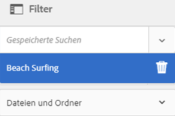

# Verwalten von Sammlungen {#managing-collections}

Eine Sammlung ist ein Satz von Assets in Adobe Experience Manager Assets. Anhand von Sammlungen können Assets von mehreren Benutzern gemeinsam verwendet werden. Der Satz kann eine statische Sammlung oder eine dynamische Sammlung sein, die auf Suchergebnissen basiert.

Im Gegensatz zu Ordnern kann eine Sammlung Assets von verschiedenen Speicherorten enthalten. Sie können Sammlungen für mehrere Benutzer mit unterschiedlichen Berechtigungsstufen, wie Anzeigen, Bearbeiten usw., freigeben.

Sie können mehrere Sammlungen für einen Benutzer freigeben. Jede Sammlung enthält Referenzen zu Assets. Die referenzielle Integrität von Assets wird sammlungsübergreifend aufrechterhalten.

Sammlungen sind von den folgenden Typen, und zwar auf Grundlage, wie sie Assets sortieren:

* Eine Sammlung, die eine statische Referenzliste mit Assets, Ordnern und anderen Sammlungen enthält.

* Eine intelligente Sammlung, die basierend auf Suchkriterien dynamisch Elemente enthält.

## Zugriff auf die Sammlungskonsole {#navigating-the-collections-console}

Um die **[!UICONTROL Sammlungen]** zu öffnen, tippen oder klicken Sie auf das Experience Manager-Logo. From the navigation page, go to **[!UICONTROL Assets]** > **[!UICONTROL Collections]**.

## Sammlung erstellen {#creating-a-collection}

You can create a collection either with [static references](#creating-a-collection-with-static-references) or based on a [search criteria-based filter](#creating-a-smart-collection). Sie können eine Sammlung auch über eine Lightbox erstellen.

### Create a collection with static references {#creating-a-collection-with-static-references}

Sie können eine Sammlung mit statischen Referenzen erstellen, wie eine Sammlung mit Referenzen zu Assets, Ordnern, Sammlungen, Rotationssets und Bildsets.

1. Navigieren Sie zur Konsole **[!UICONTROL Sammlungen]**.
1. From the toolbar, tap/click **[!UICONTROL Create]**.
1. Geben Sie auf der Seite **[!UICONTROL Sammlung erstellen]** einen Titel und eine optionale Beschreibung für die Sammlung ein.
1. Fügen Sie Mitglieder zur Sammlung hinzu und weisen Sie entsprechende Berechtigungen zu. Wählen Sie alternativ **[!UICONTROL Öffentliche Sammlung]**, um allen Benutzern Zugriff auf die Sammlung zu ermöglichen.

   >[!NOTE]
   >
   >Um es Mitgliedern zu ermöglichen, Sammlungen mit anderen Benutzern zu teilen, gewähren Sie der Gruppe `dam-users` Leseberechtigungen für den Pfad `home/users`. Give permission to the users at `/content/dam/collections` location to allow the users to view the Collections in pop up lists. Alternativ dazu können Sie Benutzer auch in die Gruppe `dam-users` aufnehmen.

1. (Optional) Fügen Sie eine Miniaturansicht für die Sammlung hinzu.
1. Tippen/Klicken Sie auf **[!UICONTROL Erstellen]** und dann auf **[!UICONTROL OK]**, um das Dialogfeld zu schließen. Eine Sammlung mit dem angegebenen Titel und den angegebenen Eigenschaften wird in der Sammlungskonsole geöffnet.

   >[!NOTE]
   >
   >Mit Experience Manager Assets können Sie Review-Aufgaben für eine Sammlung erstellen, ähnlich wie Sie Review-Aufgaben für einen Asset-Ordner erstellen.

   Um Assets zur Sammlung hinzuzufügen, navigieren Sie zur Assets-Benutzeroberfläche. For details, see [Add assets to a collection](#adding-assets-to-a-collection).

### Create collections using dropzone {#create-collections-using-dropzone}

Sie können Assets aus der Assets-Benutzeroberfläche ziehen und in einer Sammlung ablegen. Sie können auch eine Kopie einer Sammlung erstellen und Assets dort hinziehen.

1. Wählen Sie in der Benutzeroberfläche &quot;Assets&quot;die Assets aus, die Sie einer Sammlung hinzufügen möchten.
1. Drag the assets to the **[!UICONTROL Drop in Collection]** zone. Tippen oder klicken Sie alternativ in der Symbolleiste auf das Symbol **[!UICONTROL Zu Sammlung]**.

   

1. Tippen/Klicken Sie auf der Seite **[!UICONTROL Zur Sammlung hinzufügen]** in der Symbolleiste auf das Symbol **[!UICONTROL Sammlung erstellen]**.

   Wenn Sie die Assets zu einer vorhandenen Sammlung hinzufügen möchten, wählen Sie sie auf der Seite aus und tippen/klicken Sie auf **[!UICONTROL Hinzufügen]**. Standardmäßig wird die zuletzt aktualisierte Sammlung ausgewählt.

1. Geben Sie im Dialogfeld **[!UICONTROL Neue Sammlung erstellen]** einen Namen für die Sammlung an. Wenn die Sammlung allen Benutzern zugänglich sein soll, wählen Sie **[!UICONTROL Öffentliche Sammlung]** aus.
1. Tap/click **[!UICONTROL Continue]** to create the collection.

### Erstellen einer intelligenten Sammlung {#creating-a-smart-collection}

Eine Smart-Sammlung verwendet Suchkriterien, um Assets dynamisch zu füllen. Sie können eine Smart-Sammlung erstellen, indem Sie Dateien und Ordner oder nur Dateien nutzen.

Gehen Sie wie folgt vor, um eine intelligente Sammlung zu erstellen:

1. Navigieren Sie zur Benutzeroberfläche &quot;Assets&quot;und tippen/klicken Sie auf das Suchsymbol.

1. Geben Sie in das Feld Omniture Search den Suchbegriff ein und drücken Sie die Eingabetaste. Öffnen Sie das Filterbedienfeld und wenden Sie einen Suchfilter an.

1. Wählen Sie aus der Liste **[!UICONTROL Dateien und Ordner]** die Option **[!UICONTROL Dateien]** aus.

   

1. Tippen oder klicken Sie auf **[!UICONTROL Smart-Sammlung speichern]**.

1. Geben Sie einen Namen für die Sammlung an. Aktivieren Sie **[!UICONTROL Öffentlich]**, um die DAM-Benutzergruppe mit der Rolle „Betrachter“ zur Smart-Sammlung hinzuzufügen.

   

   >[!NOTE]
   >
   >If you select **[!UICONTROL Public]**, the smart collection becomes available to everyone with the owner role after you create it. Wenn Sie die Option **[!UICONTROL Öffentlich]** deaktivieren, ist die DAM-Benutzergruppe nicht mehr mit der Smart-Sammlung verknüpft.

1. Tippen/Klicken Sie auf **[!UICONTROL Speichern]**, um die Smart-Sammlung zu erstellen, und schließen Sie dann das Meldungsfeld, um den Prozess abzuschließen.

   The new smart collection is also added to the **[!UICONTROL Saved Searches]** list.

   

   Die Beschriftung der Schaltfläche **[!UICONTROL Smart-Auswahl erstellen]** ändert sich in **[!UICONTROL Smart-Auswahl bearbeiten]**. Um die Einstellungen der Smart-Sammlung zu bearbeiten, wählen Sie **[!UICONTROL Dateien]** aus der Liste **[!UICONTROL Dateien und Ordner]** aus. Tippen Sie dann auf die Schaltfläche **[!UICONTROL Smart-Auswahl bearbeiten]**.

   

## Add assets to a collection {#adding-assets-to-a-collection}

Sie können einer Sammlung mit einer Liste referenzierter Assets oder Ordner Assets hinzufügen. Smart-Sammlungen füllen Assets anhand einer Suchabfrage. Daher sind statische Referenzen zu Assets und Ordnern für sie nicht anwendbar.

1. In the Assets user interface, select the asset and tap/click the **[!UICONTROL To Collection]** icon from the toolbar.

   

   Alternativ können Sie das Asset in den Bereich &quot;In Sammlung **[!UICONTROL ablegen]** &quot;auf der Benutzeroberfläche ziehen. Fügen Sie die Assets hinzu, wenn die Beschriftung der Region in **[!UICONTROL Zu Hinzufügen]** ablegen geändert wird.

1. In the **[!UICONTROL Add To Collection]** page, select the collection to which you want to add the asset.

1. Tippen oder klicken Sie auf **[!UICONTROL Hinzufügen]** und schließen Sie die Bestätigungsnachricht. Das Asset wird zur Sammlung hinzugefügt.

## Bearbeiten einer intelligenten Sammlung {#editing-a-smart-collection}

Smart collections are built by saving a search so you can alter their content by modifying the search parameters of the [saved search](#editing-saved-searches).

1. Tippen bzw. klicken Sie in der Benutzeroberfläche &quot;Assets&quot;in der Symbolleiste auf das Suchsymbol.

   

1. Drücken Sie mit dem Cursor in das Feld Omniture Search die Eingabetaste.
1. Tippen oder klicken Sie auf das GlobalNav-Symbol, um den Filterbereich anzuzeigen.
1. Wählen Sie in der Liste **[!UICONTROL Gespeicherte Suchen]** die Smart-Sammlung aus, die Sie ändern möchten. Im Suchbereich werden die für die gespeicherte Suche konfigurierten Filter angezeigt.

   

1. Wählen Sie aus der Liste **[!UICONTROL Dateien und Ordner]** die Option **[!UICONTROL Dateien]** aus.
1. Ändern Sie den bzw. die Filter nach Bedarf. Tap/click **[!UICONTROL Edit Smart Collection]**.

   Sie können auch den Namen der Smart-Sammlung ändern.

   

1. Tippen oder klicken Sie auf **[!UICONTROL Speichern]**. Das Dialogfeld **[!UICONTROL Smart-Sammlung bearbeiten]** wird angezeigt.
1. Tippen oder klicken Sie auf **[!UICONTROL Überschreiben]**, um die ursprüngliche Smart-Sammlung durch die bearbeitete Sammlung zu ersetzen. Wählen Sie alternativ **[!UICONTROL Speichern unter]** aus, um die bearbeitete Sammlung separat zu speichern.
1. Tippen oder klicken Sie im Bestätigungsdialogfeld auf **[!UICONTROL Speichern]**, um den Vorgang abzuschließen.

## View and edit collection metadata {#viewing-and-editing-collection-metadata}

Sammlungsmetadaten umfassen die Daten zur Sammlung, einschließlich aller hinzugefügten Tags.

1. From the Collections console, select a collection and tap/click the **[!UICONTROL Properties]** icon from the toolbar.
1. Zeigen Sie auf der Seite **[!UICONTROL Sammlungsmetadaten]** die Sammlungsmetadaten der Registerkarten **[!UICONTROL Einfach]** und **[!UICONTROL Erweitert]** an.
1. Modify the metadata, as necessary, and then tap/click **[!UICONTROL Save &amp; Close]** from the toolbar to save the changes.

## Metadaten mehrerer Sammlungen stapelweise bearbeiten {#editing-collection-metadata-in-bulk}

Sie können die Metadaten von mehreren Sammlungen gleichzeitig bearbeiten. Mit dieser Funktion können Sie schnell allgemeine Metadaten in mehreren Sammlungen replizieren.

1. Wählen Sie in der Konsole „Sammlungen“ zwei oder mehr Sammlungen aus, für die Sie Metadaten bearbeiten möchten.
1. From the toolbar, tap/click the **[!UICONTROL Properties]** icon.
1. Bearbeiten Sie auf der Seite **[!UICONTROL Sammlungsmetadaten]** die Metadaten nach Bedarf auf den Registerkarten **[!UICONTROL Einfach]** und **[!UICONTROL Erweitert]**.
1. Heben Sie die Auswahl der anderen Sammlungen in der Sammlungsliste auf, um die Metadateneigenschaften für eine bestimmte Sammlung anzuzeigen. Die Metadateneditorfelder werden mit den Metadaten für die bestimmte Sammlung gefüllt.

   >[!NOTE]
   >
   >* Auf der Sammlungseigenschaftenseite können Sie Sammlungen aus der Liste der Sammlungen entfernen, indem Sie die Auswahl aufheben. In der Sammlungsliste sind alle Sammlungen standardmäßig ausgewählt. Die Metadaten für Sammlungen, die Sie entfernen, werden nicht aktualisiert.
   >* At the top of the list, select the check box near **[!UICONTROL Title]** to toggle between selecting the collections and clearing the list.

1. Tap/click **[!UICONTROL Save &amp; Close]** from the toolbar, and then close the confirmation dialog to complete the process.
1. To append the new metadata with the existing metadata, select **[!UICONTROL Append mode]**. Wenn Sie diese Option nicht auswählen, ersetzen die neuen Metadaten die vorhandenen Metadaten in den entsprechenden Feldern. Tippen/Klicken Sie auf **[!UICONTROL Senden]**.

   >[!NOTE]
   >
   >Die Metadaten, die Sie für die ausgewählten Sammlungen hinzufügen, überschreiben die vorherigen Metadaten für diese Sammlungen. Verwenden Sie den Modus [!UICONTROL Anhängen] , um den vorhandenen Metadaten in den Feldern, die mehrere Werte enthalten können, neue Werte hinzuzufügen. Felder mit einem Wert werden immer überschrieben. Any tags you add in the [!UICONTROL Tags] field, are appended to the existing list of tags in the metadata.

To customize the metadata [!UICONTROL Properties] page, including adding, modifying, deleting metadata properties, use the Schema editor.

>[!TIP]
>
>Die Massenbearbeitungsmethode funktioniert bei Assets, die in einer Sammlung verfügbar sind. Für Assets, die in verschiedenen Ordnern enthalten sind oder gemeinsamen Kriterien entsprechen, können die [Metadaten nach einer Suche stapelweise aktualisiert werden](/help/assets/search-assets.md#metadataupdates).

## Sammlungen durchsuchen {#searching-collections}

Sie können mit der Konsole „Sammlungen“ nach Sammlungen suchen. Wenn Sie die Suche mit Schlüsselwörtern im Suchfeld durchführen, sucht AEM Assets nach Sammlungsnamen, Sammlungsmetadaten und den Tags, die zu den Sammlungen hinzugefügt wurden.

Wenn Sie auf der obersten Ebene nach Sammlungen suchen, werden nur die einzelnen Sammlungen in den Suchergebnissen zurückgegeben. Assets oder Ordner in den Sammlungen werden ausgeschlossen. In allen anderen Fällen (z. B. innerhalb einer individuellen Sammlung oder in einer Ordnerhierarchie) werden alle relevanten Assets, Ordner und Sammlungen zurückgegeben.

## In Sammlungen suchen {#searching-within-collections}

Tippen/klicken Sie in der Sammlungskonsole auf eine Sammlung, um sie zu öffnen.

Innerhalb einer Sammlung ist die Suche von AEM Assets auf Assets (sowie deren Tags und Metadaten) in der angezeigten Sammlung begrenzt. Wenn Sie in einem Ordner suchen, werden alle passenden Assets und untergeordneten Ordner innerhalb des aktuellen Ordners zurückgegeben. Wenn Sie in einer Sammlung suchen, werden nur übereinstimmende Assets, Ordner und andere Sammlungen zurückgegeben, die direkt zur Sammlung gehören.

## Sammlungseinstellungen bearbeiten {#editing-collection-settings}

Sie können Sammlungseinstellungen, wie z. B. Titel und Beschreibung, bearbeiten oder Mitglieder zu einer Sammlung hinzufügen.

1. Select a collection, and tap/click the **[!UICONTROL Settings]** icon in the toolbar. Verwenden Sie alternativ die Schnellaktion **[!UICONTROL Einstellungen]** über die Miniaturansicht der Sammlung.
1. Modify the collection settings in the **[!UICONTROL Collection Settings]** page. For example, modify the collection title, descriptions, members, and permissions as discussed in [Adding Collections](#creating-a-collection).

1. Um die Änderungen zu speichern, tippen/klicken Sie auf **[!UICONTROL Speichern]**.

## Eine Sammlung löschen {#deleting-a-collection}

1. Wählen Sie in der Sammlungskonsole eine oder mehrere Sammlungen aus und tippen/klicken Sie auf das Löschsymbol in der Symbolleiste.

   

1. In the dialog, tap/click **[!UICONTROL Delete]** to confirm the delete action.

   >[!NOTE]
   >
   >You can also delete smart collections by [deleting saved searches](#deleting-saved-searches).

## Sammlung herunterladen {#downloading-a-collection}

Wenn Sie eine Sammlung herunterladen, wird die gesamte Hierarchie der Assets in der Sammlung heruntergeladen, einschließlich der Ordner und untergeordneten Sammlungen.

1. Wählen Sie in der Konsole „Sammlungen“ eine oder mehrere Sammlungen für den Download aus.
1. Tippen bzw. klicken Sie in der Symbolleiste auf das Symbol Herunterladen.
1. Tippen oder klicken Sie im Dialogfeld **[!UICONTROL Herunterladen]** auf **[!UICONTROL Herunterladen]**. Wählen Sie **[!UICONTROL Ausgabeformate]** aus, wenn Sie die Ausgabeformate des Assets in der Sammlung herunterladen möchten. Wählen Sie die Option **[!UICONTROL E-Mail]** aus, um eine E-Mail-Benachrichtigung an den Eigentümer der Sammlung zu senden.

   Bei Auswahl einer Sammlung für den Download wird die gesamte Ordnerstruktur unter dieser Sammlung heruntergeladen. To include each collection you download (including assets in child collections nested under the parent collection) in an individual folder, select **[!UICONTROL Create separate folder for each asset]**.

## Erstellen verschachtelter Sammlungen {#creating-nested-collections}

Sie können eine Sammlung zu einer anderen Sammlung hinzufügen und so eine verschachtelte Sammlung erstellen.

1. From the Collections console, select the desired collection or group of collections, and tap or click **[!UICONTROL To Collection]** in the toolbar.

1. Wählen Sie auf der Seite **[!UICONTROL Zu Sammlung hinzufügen]** die Sammlung aus, zu der die Sammlung hinzugefügt werden soll.

   >[!NOTE]
   >
   >The most recently updated collection is selected by default in the **[!UICONTROL Add To Collection]** page.

1. Tippen oder klicken Sie auf **[!UICONTROL Hinzufügen]**. Eine Meldung bestätigt, dass die Sammlung zur Zielsammlung auf der Seite **[!UICONTROL Ziel auswählen]** hinzugefügt wird. Schließen Sie die Meldung, um den Vorgang abzuschließen.

>[!NOTE]
>
>Smart-Sammlungen können nicht verschachtelt werden. Das heißt, Smart-Sammlungen können keine anderen Sammlungen enthalten.

## Gespeicherte Suchvorgänge {#saved-searches}

In der Assets-Benutzeroberfläche können Sie Assets nach bestimmten Regeln, Suchkriterien oder benutzerdefinierten Suchfacetten suchen bzw. filtern. Wenn Sie diese als **[!UICONTROL Gespeicherte Suchen]** speichern, können Sie sie später über die Liste **[!UICONTROL Gespeicherte Suchen]** im Filterbedienfeld aufrufen. Beim Erstellen einer gespeicherten Suche wird auch eine Smart-Sammlung erstellt.

Gespeicherte Suchen werden erstellt, wenn Sie eine Smart-Sammlung erstellen. Smart-Sammlungen werden automatisch der Liste **[!UICONTROL Gespeicherte Suchen]** hinzugefügt. Die Abfrage „Gespeicherte Suchen“ für die Sammlung wird in der `dam:query`-Eigenschaft in CRXDE am relativen Speicherort `/content/dam/collections/` gespeichert.

>[!NOTE]
>
>Sie können Smart-Sammlungen auf gleiche Weise wie statische Sammlungen freigeben.

Gespeicherte Suchen werden genauso wie Smart-Sammlungen bearbeitet. For details, see [edit a smart collection](#editing-a-smart-collection).

Gehen Sie wie folgt vor, um gespeicherte Suchen zu löschen:

1. Tippen bzw. klicken Sie in der Benutzeroberfläche &quot;Assets&quot;in der Symbolleiste auf das Suchsymbol.

   

1. Drücken Sie mit dem Cursor im Feld Omniture die Eingabetaste.

1. Klicken oder tippen Sie auf das GlobalNav-Symbol, um das Bedienfeld „Filter“ anzuzeigen.

1. From the **[!UICONTROL Saved Searches]** list, tap/click **[!UICONTROL Delete]** next to the smart collection that you want to delete.

   

1. In the dialog, tap/click **[!UICONTROL Delete]** to delete the saved search.

## Execute a workflow on a collection {#running-a-workflow-on-a-collection}

Sie können einen Workflow für die Assets in einer Sammlung ausführen. Wenn die Sammlung verschachtelte Sammlungen enthält, wird der Workflow auch für die Assets in den verschachtelten Sammlungen ausgeführt. Wenn jedoch die Sammlung und die verschachtelte Sammlung doppelte Assets enthalten, wird der Workflow nur einmal für solche Assets ausgeführt.

1. Wählen Sie in der Konsole „Sammlungen“ eine Sammlung aus, für die Sie einen Workflow ausführen möchten.
1. Tap/click the GlobalNav icon, and choose **[!UICONTROL Timeline]** from the list.
1. Tippen/Klicken Sie in der Timeline auf das Symbol „Karriere“ am unteren Rand und dann auf **[!UICONTROL Workflow starten]**.

   

1. Wählen Sie im Abschnitt **[!UICONTROL Workflow starten]** ein Workflow-Modell aus der Liste aus. Wählen Sie beispielsweise das **[!UICONTROL DAM Update Asset]**-Modell aus.
1. Geben Sie einen Titel für den Workflow ein und tippen oder klicken Sie auf **[!UICONTROL Start]**.
1. Tippen oder klicken Sie im Dialogfeld auf **[!UICONTROL Fortfahren]**. Der Workflow wird für alle Assets in der Sammlung ausgeführt.

>[!MORELIKETHIS]
>
>* [E-Mail-Benachrichtigungen zu Experience Manager Assets konfigurieren](/help/sites-administering/notification.md#assetsconfig)
>* [Erstellen einer Prüfungsaufgabe für Sammlungen](bulk-approval.md)

