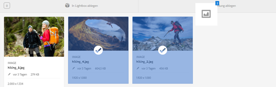
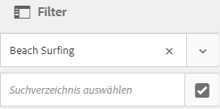
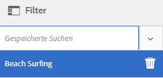

# Verwalten von Sammlungen {#managing-collections}

A collection is a set of assets within [!DNL Adobe Experience Manager Assets]. Anhand von Sammlungen können Assets von mehreren Benutzern gemeinsam verwendet werden. Der Satz kann eine statische Sammlung oder eine dynamische Sammlung sein, die auf Suchergebnissen basiert.

Im Gegensatz zu Ordnern kann eine Sammlung Assets von verschiedenen Speicherorten enthalten. Sie können Sammlungen für mehrere Benutzer mit unterschiedlichen Berechtigungsstufen, wie Anzeigen, Bearbeiten usw., freigeben.

Sie können mehrere Sammlungen für einen Benutzer freigeben. Jede Sammlung enthält Referenzen zu Assets. Die referenzielle Integrität von Assets wird sammlungsübergreifend aufrechterhalten.

Sammlungen sind von den folgenden Typen, und zwar auf Grundlage, wie sie Assets sortieren:

* Eine Sammlung mit einer statischen Referenzliste von Assets, Ordnern und anderen Sammlungen.

* Eine Smart-Sammlung, die Assets auf Grundlage eines Suchkriteriums dynamisch verwendet.

## Aufrufen der Konsole „Sammlungen“ {#navigating-the-collections-console}

Um die **[!UICONTROL Sammlungen]** zu öffnen, gehen Sie auf der [!DNL Experience Manager] Benutzeroberfläche zu **[!UICONTROL Assets]** > **[!UICONTROL Sammlungen]**.

## Erstellen von Sammlungen {#creating-a-collection}

Sie können eine Sammlung mit [statischen Referenzen](#creating-a-collection-with-static-references) oder basierend auf einem [Suchkriterien-spezifischen Filter](#creating-a-smart-collection) erstellen. Sie können eine Sammlung auch über eine Lightbox erstellen.

### Erstellen von Sammlungen mit statischen Referenzen {#creating-a-collection-with-static-references}

Sie können eine Sammlung mit statischen Referenzen erstellen, wie eine Sammlung mit Referenzen zu Assets, Ordnern, Sammlungen, Rotationssets und Bildsets.

1. Navigieren Sie zur Konsole **[!UICONTROL Sammlungen]**.
1. From the toolbar, click **[!UICONTROL Create]**.
1. Geben Sie auf der Seite **[!UICONTROL Sammlung erstellen]** einen Titel und eine optionale Beschreibung für die Sammlung ein.
1. Fügen Sie Mitglieder zur Sammlung hinzu und weisen Sie entsprechende Berechtigungen zu. Wählen Sie alternativ **[!UICONTROL Öffentliche Sammlung]**, um allen Benutzern Zugriff auf die Sammlung zu ermöglichen.

   >[!NOTE]
   >
   >Um es Mitgliedern zu ermöglichen, Sammlungen mit anderen Benutzern zu teilen, gewähren Sie der Gruppe `dam-users` Leseberechtigungen für den Pfad `home/users`. Erteilen Sie den Benutzern eine Berechtigung für den Pfad `/content/dam/collections`, damit Benutzer Sammlungen in Popup-Listen anzeigen können. Alternativ dazu können Sie Benutzer auch in die Gruppe `dam-users` aufnehmen.

1. (Optional) Fügen Sie eine Miniaturansicht für die Sammlung hinzu.
1. Click **[!UICONTROL Create]**, and then click **[!UICONTROL OK]** to close the dialog. In der Konsole „Sammlungen“ wird eine Sammlung mit dem angegebenen Titel und ihren Eigenschaften geöffnet.

   >[!NOTE]
   >
   >[!DNL Experience Manager Assets]Mit können Sie Prüfungsaufgaben für eine Sammlung auf ähnliche Weise wie Prüfungsaufgaben für einen Assets-Ordner erstellen.

   To add assets to the collection, navigate to the [!DNL Assets] user interface. Weitere Informationen finden Sie unter [Hinzufügen von Assets zu einer Sammlung](#adding-assets-to-a-collection).

### Erstellen von Sammlungen mithilfe der Dropzone {#create-collections-using-dropzone}

You can drag assets from the [!DNL Assets] user interface to a collection. Sie können auch eine Kopie einer Sammlung erstellen und Assets dort hinziehen.

1. From the [!DNL Assets] user interface, select the assets you want to add to a collection.
1. Ziehen Sie die Assets in den Bereich **[!UICONTROL In Sammlung ablegen]**. Alternativ können Sie in der Symbolleiste auf &quot; **[!UICONTROL Zur Sammlung]** &quot;klicken.

   

1. In the **[!UICONTROL Add To Collection]** page, click **[!UICONTROL Create Collection]** from the toolbar.

   If you want to add the assets to an existing collection, select it from the page, and click **[!UICONTROL Add]**. Standardmäßig wird die zuletzt aktualisierte Sammlung ausgewählt.

1. Geben Sie im Dialogfeld **[!UICONTROL Neue Sammlung erstellen]** einen Namen für die Sammlung an. Wenn die Sammlung allen Benutzern zugänglich sein soll, wählen Sie **[!UICONTROL Öffentliche Sammlung]** aus.
1. Click **[!UICONTROL Continue]** to create the collection.

### Erstellen von Smart-Sammlungen {#creating-a-smart-collection}

Eine Smart-Sammlung verwendet Suchkriterien, um Assets dynamisch zu füllen. Sie können eine Smart-Sammlung erstellen, indem Sie Dateien und Ordner oder nur Dateien nutzen.

Gehen Sie wie folgt vor, um eine intelligente Sammlung zu erstellen:

1. Navigieren Sie zur [!DNL Assets] Benutzeroberfläche und klicken Sie auf Suchen.

1. Geben Sie den Suchbegriff in das Feld Omniture Search ein und drücken Sie `Enter`. Öffnen Sie das Bedienfeld &quot;Filter&quot;und wenden Sie einen Suchfilter an.

1. Wählen Sie aus der Liste **[!UICONTROL Dateien und Ordner]** die Option **[!UICONTROL Dateien]** aus.

   

1. Click **[!UICONTROL Save Smart Collection]**.

1. Geben Sie einen Namen für die Sammlung an. Aktivieren Sie **[!UICONTROL Öffentlich]**, um die DAM-Benutzergruppe mit der Rolle „Betrachter“ zur Smart-Sammlung hinzuzufügen.

   

   >[!NOTE]
   >
   >If you select **[!UICONTROL Public]**, the smart collection becomes available to everyone with the owner role after you create it. Wenn Sie die Option **[!UICONTROL Öffentlich]** deaktivieren, ist die DAM-Benutzergruppe nicht mehr mit der Smart-Sammlung verknüpft.

1. Click **[!UICONTROL Save]** to create the smart collection, and then close the message box to complete the process.

   Die neue Smart-Sammlung wird auch zur Liste **[!UICONTROL Gespeicherte Suchen]** hinzugefügt.

   

   The label of the **[!UICONTROL Create Smart Selection]** option changes to **[!UICONTROL Edit Smart Selection]**. Um die Einstellungen der Smart-Sammlung zu bearbeiten, wählen Sie **[!UICONTROL Dateien]** aus der Liste **[!UICONTROL Dateien und Ordner]** aus. Klicken Sie auf die Option &quot;Intelligente Auswahl **** bearbeiten&quot;  bearbeiten&quot;.

## Hinzufügen von Assets zu einer Sammlung {#adding-assets-to-a-collection}

Sie können einer Sammlung mit einer Liste referenzierter Assets oder Ordner Assets hinzufügen. Smart-Sammlungen füllen Assets anhand einer Suchabfrage. Daher sind statische Referenzen zu Assets und Ordnern für sie nicht anwendbar.

1. Wählen Sie in der Benutzeroberfläche &quot; [!DNL A]Assets&quot;das Asset aus und klicken Sie in der Symbolleiste auf &quot; **[!UICONTROL Zu Sammlung]** hinzufügen&quot;  .
Alternativ können Sie das Asset in den Bereich &quot;In Sammlung **[!UICONTROL ablegen]** &quot;auf der Benutzeroberfläche ziehen. Hinzufügen die Assets, wenn die Beschriftung des Bereichs in **[!UICONTROL Ablegen in Hinzufügen]** geändert wird.

1. Wählen Sie auf der Seite **[!UICONTROL Zu Sammlung hinzufügen]** die Sammlung aus, der Sie das Asset hinzufügen möchten.

1. Click **[!UICONTROL Add]**, and then close the confirmation message. Das Asset wird zur Sammlung hinzugefügt.

## Bearbeiten von Smart-Sammlungen {#editing-a-smart-collection}

Smart-Sammlungen werden durch Speichern von Suchvorgängen erstellt. Das heißt, Sie können den Inhalt ändern, indem Sie die Suchparameter der [gespeicherten Suche](#saved-searches) ändern.

1. Klicken Sie in der [!DNL Assets] Benutzeroberfläche in der Symbolleiste auf die  .
1. Betätigen Sie bei in das OmniSearch-Feld gesetztem Cursor die Eingabetaste.
1. Öffnen Sie auf der [!DNL Experience Manager] Benutzeroberfläche das Bedienfeld &quot;Filter&quot;.
1. Wählen Sie in der Liste **[!UICONTROL Gespeicherte Suchen]** die Smart-Sammlung aus, die Sie ändern möchten. Im Suchbereich werden die für die gespeicherte Suche konfigurierten Filter angezeigt.

   

1. Wählen Sie aus der Liste **[!UICONTROL Dateien und Ordner]** die Option **[!UICONTROL Dateien]** aus.
1. Ändern Sie den bzw. die Filter nach Bedarf. Klicken Sie auf **[!UICONTROL Smart-Sammlung bearbeiten]**.

   Sie können auch den Namen der Smart-Sammlung ändern.

   

1. Klicken Sie auf **[!UICONTROL Speichern]**. Das Dialogfeld **[!UICONTROL Smart-Sammlung bearbeiten]** wird angezeigt.
1. Click **[!UICONTROL Overwrite]** to replace the original smart collection with the edited collection. Wählen Sie alternativ **[!UICONTROL Speichern unter]** aus, um die bearbeitete Sammlung separat zu speichern.
1. In the confirmation dialog, Click **[!UICONTROL Save]** to complete the process.

## Anzeigen und Bearbeiten von Sammlungsmetadaten {#viewing-and-editing-collection-metadata}

Sammlungsmetadaten umfassen die Daten zur Sammlung, einschließlich aller hinzugefügten Tags.

1. From the [!UICONTROL Collections] console, select a collection and click **[!UICONTROL Properties]** from the toolbar.
1. Zeigen Sie auf der Seite **[!UICONTROL Sammlungs-Metadaten]** die Metadaten der Sammlung auf den Registerkarten **[!UICONTROL Allgemein]** und **[!UICONTROL Erweitert]** an.
1. Ändern Sie die Metadaten nach Bedarf. Um die Änderungen zu speichern, klicken Sie in der Symbolleiste auf **[!UICONTROL Speichern &amp; Schließen]** .

## Metadaten mehrerer Sammlungen stapelweise bearbeiten {#editing-collection-metadata-in-bulk}

Sie können die Metadaten von mehreren Sammlungen gleichzeitig bearbeiten. Mit dieser Funktion können Sie schnell allgemeine Metadaten in mehreren Sammlungen replizieren.

1. Wählen Sie in der Sammlungskonsole zwei oder mehr Sammlungen aus.
1. Klicken Sie in der Symbolleiste auf **[!UICONTROL Eigenschaften]**.
1. Bearbeiten Sie auf der Seite **[!UICONTROL Sammlungs-Metadaten]** die Metadaten auf den Registerkarten **[!UICONTROL Allgemein]** und **[!UICONTROL Erweitert]** nach Bedarf.
1. Heben Sie die Auswahl der anderen Sammlungen in der Sammlungsliste auf, um die Metadateneigenschaften für eine bestimmte Sammlung anzuzeigen. Die Metadateneditorfelder werden mit den Metadaten für die bestimmte Sammlung gefüllt.

   >[!NOTE]
   >
   >* In the [!UICONTROL Properties] page, you can remove collections from the list of collections by deselecting them. In der Sammlungsliste sind alle Sammlungen standardmäßig ausgewählt. [!DNL Experience Manager] aktualisiert nicht die Metadaten der Sammlungen, die Sie entfernen.
   >* Aktivieren Sie über der Sammlungsliste das Kontrollkästchen neben **[!UICONTROL Titel]**, um zwischen der Auswahl von Sammlungen und dem Deaktivieren der Liste umzuschalten.

1. Klicken Sie in der Symbolleiste auf **[!UICONTROL Speichern &amp; Schließen]** und schließen Sie dann das Bestätigungsdialogfeld.
1. To append the new metadata with the existing metadata, select **[!UICONTROL Append mode]**. Wenn Sie diese Option nicht auswählen, ersetzen die neuen Metadaten die vorhandenen Metadaten in den entsprechenden Feldern. Klicken Sie auf **[!UICONTROL Übermitteln]**.

   >[!NOTE]
   >
   >Die Metadaten, die Sie für die ausgewählten Sammlungen hinzufügen, überschreiben die vorherigen Metadaten für diese Sammlungen. Verwenden Sie den Modus [!UICONTROL Anhängen] , um den vorhandenen Metadaten in den Feldern, die mehrere Werte enthalten können, neue Werte hinzuzufügen. Felder mit einem Wert werden immer überschrieben. Alle Tags, die Sie im Feld [!UICONTROL Tags] hinzufügen, werden der vorhandenen Liste der Tags in den Metadaten anhängt.

Verwenden Sie zum Anpassen der Seite mit den [!UICONTROL Eigenschaften] von Metadaten, einschließlich Hinzufügen, Ändern und Löschen von Metadateneigenschaften, den Schemaeditor.

>[!TIP]
>
>Die Massenbearbeitungsmethode funktioniert bei Assets, die in einer Sammlung verfügbar sind. Für Assets, die in verschiedenen Ordnern enthalten sind oder gemeinsamen Kriterien entsprechen, können die [Metadaten nach einer Suche stapelweise aktualisiert werden](/help/assets/search-assets.md#metadataupdates).

## Suchen nach Sammlungen {#searching-collections}

Sie können mit der Konsole „Sammlungen“ nach Sammlungen suchen. When you search with keywords in the Omnisearch box, [!DNL Assets] searches for collection names, metadata, and the tags added to the collections.

Wenn Sie auf der obersten Ebene nach Sammlungen suchen, werden nur die einzelnen Sammlungen in den Suchergebnissen zurückgegeben. [!DNL Assets] oder Ordner in den Sammlungen werden ausgeschlossen. In allen anderen Fällen (z. B. innerhalb einer individuellen Sammlung oder in einer Ordnerhierarchie) werden alle relevanten Assets, Ordner und Sammlungen zurückgegeben.

## Search within collections {#searching-within-collections}

Klicken Sie in der Sammlungskonsole auf eine Sammlung, um sie zu öffnen.

Within a collection, [!DNL Experience Manager] search is restricted to assets (and their tags and metadata) within the collection that you are viewing. Wenn Sie in einem Ordner suchen, werden alle passenden Assets und untergeordneten Ordner innerhalb des aktuellen Ordners zurückgegeben. Wenn Sie in einer Sammlung suchen, werden nur übereinstimmende Assets, Ordner und andere Sammlungen zurückgegeben, die direkt zur Sammlung gehören.

## Bearbeiten von Sammlungseinstellungen {#editing-collection-settings}

Sie können Sammlungseinstellungen, wie z. B. Titel und Beschreibung, bearbeiten oder Mitglieder zu einer Sammlung hinzufügen.

1. Select a collection, and click **[!UICONTROL Settings]** in the toolbar. Verwenden Sie alternativ die Schnellaktion **[!UICONTROL Einstellungen]** in der Miniaturansicht der Sammlung.
1. Modify the collection settings in the **[!UICONTROL Collection Settings]** page. For example, modify the collection title, descriptions, members, and permissions as discussed in [Adding Collections](#creating-a-collection).

1. Klicken Sie zum Speichern der Änderungen auf **[!UICONTROL Speichern]**.

## Löschen von Sammlungen {#deleting-a-collection}

1. Wählen Sie in der Sammlungskonsole eine oder mehrere Sammlungen aus und klicken Sie in der Symbolleiste auf &quot;Löschen&quot;.

1. In the dialog, click **[!UICONTROL Delete]** to confirm the delete action.

   >[!NOTE]
   >
   >You can also delete smart collections by [deleting saved searches](#saved-searches).

## Herunterladen von Sammlungen {#downloading-a-collection}

Wenn Sie eine Sammlung herunterladen, wird die gesamte Asset-Hierarchie innerhalb der Sammlung ebenfalls heruntergeladen, einschließlich Ordnern und untergeordneten Sammlungen.

1. Wählen Sie in der Konsole „Sammlungen“ eine oder mehrere Sammlungen für den Download aus.
1. Klicken Sie in der Symbolleiste auf **[!UICONTROL Herunterladen]**.
1. Klicken Sie im Dialogfeld **[!UICONTROL Herunterladen]** auf **[!UICONTROL Herunterladen]**. Wählen Sie **[!UICONTROL Ausgabeformate]** aus, wenn Sie die Ausgabeformate des Assets in der Sammlung herunterladen möchten. Wählen Sie die Option **[!UICONTROL E-Mail]** aus, um eine E-Mail-Benachrichtigung an den Eigentümer der Sammlung zu senden.

   Bei Auswahl einer Sammlung für den Download wird die gesamte Ordnerstruktur unter dieser Sammlung heruntergeladen. Um jede Sammlung (einschließlich Assets in untergeordneten Sammlungen, die unter der übergeordneten Sammlung verschachtelt sind), die Sie herunterladen, in einem eigenen Ordner zu speichern, wählen Sie **[!UICONTROL Separaten Ordner für jedes Asset erstellen]** aus.

## Erstellen von verschachtelten Sammlungen {#creating-nested-collections}

Sie können eine Sammlung zu einer anderen Sammlung hinzufügen und so eine verschachtelte Sammlung erstellen.

1. From the Collections console, select the desired collection or group of collections, and click **[!UICONTROL To Collection]** in the toolbar.

1. Wählen Sie auf der Seite **[!UICONTROL Zu Sammlung hinzufügen]** die Sammlung aus, der die Sammlung hinzugefügt werden soll.

   >[!NOTE]
   >
   >Die zuletzt aktualisierte Sammlung wird standardmäßig auf der Seite **[!UICONTROL Zu Sammlung hinzufügen]** ausgewählt.

1. Klicken Sie auf **[!UICONTROL Hinzufügen]**. Eine Meldung bestätigt, dass die Sammlung zur Zielsammlung auf der Seite **[!UICONTROL Ziel auswählen]** hinzugefügt wird. Schließen Sie die Meldung, um den Vorgang abzuschließen.

>[!NOTE]
>
>Smart-Sammlungen können nicht verschachtelt werden. Das heißt, Smart-Sammlungen können keine anderen Sammlungen enthalten.

## Gespeicherte Suchvorgänge       {#saved-searches}

In the [!DNL Assets] user interface, you can search or filter assets based on certain rules, search criteria, or custom search facets. Wenn Sie diese Einstellungen als **[!UICONTROL Gespeicherte Suchen]** speichern, können Sie später in der Liste **[!UICONTROL Gespeicherte Suchen]** im Filterbereich darauf zugreifen. Beim Erstellen einer gespeicherten Suche wird auch eine Smart-Sammlung erstellt.

Gespeicherte Suchen werden erstellt, wenn Sie eine Smart-Sammlung erstellen. Smart-Sammlungen werden automatisch der Liste **[!UICONTROL Gespeicherte Suchen]** hinzugefügt. The [!UICONTROL Saved Searches] query for the collection is saved in the `dam:query` property in CRXDE at the relative location `/content/dam/collections/`. Die Suchen, die Sie speichern können, und die gespeicherten Suchen, die in der Liste angezeigt werden, sind unbegrenzt. 

>[!NOTE]
>
>Sie können Smart-Sammlungen auf gleiche Weise wie statische Sammlungen freigeben.

Gespeicherte Suchen werden genauso wie Smart-Sammlungen bearbeitet. For details, see [edit a smart collection](#editing-a-smart-collection).

Gehen Sie wie folgt vor, um gespeicherte Suchen zu löschen:

1. Klicken Sie in der [!DNL Assets] Benutzeroberfläche auf .
1. Drücken Sie mit dem Cursor im Feld Omniture die Eingabetaste.
1. Öffnen Sie auf der [!DNL Experience Manager] Benutzeroberfläche das Bedienfeld &quot;Filter&quot;.
1. From the **[!UICONTROL Saved Searches]** list, click **[!UICONTROL Delete]** next to the smart collection that you want to delete.

   

1. In the dialog, click **[!UICONTROL Delete]** to delete the saved search.

## Ausführen eines Workflows für eine Sammlung {#running-a-workflow-on-a-collection}

Sie können einen Workflow für die Assets in einer Sammlung ausführen. Wenn die Sammlung verschachtelte Sammlungen enthält, wird der Workflow auch für die Assets in den verschachtelten Sammlungen ausgeführt. Wenn jedoch die Sammlung und die verschachtelte Sammlung doppelte Assets enthalten, wird der Workflow nur einmal für solche Assets ausgeführt.

1. Öffnen Sie **[!UICONTROL Assets]** > **[!UICONTROL Sammlungen]**. Um einen Workflow für eine bestimmte Sammlung auszuführen, wählen Sie ihn aus.
1. Open **[!UICONTROL Timeline]** rail. Klicken Sie auf  und dann auf **[!UICONTROL Beginn Workflow]**.
1. Wählen Sie im Abschnitt **[!UICONTROL Workflow starten]** ein Workflow-Modell aus der Liste aus. Wählen Sie beispielsweise das **[!UICONTROL DAM Update Asset]**-Modell aus.
1. Enter a title for the workflow and click **[!UICONTROL Start]**.
1. Klicken Sie im Dialogfeld auf **[!UICONTROL Fortfahren]**. Der Workflow verarbeitet alle Assets in der ausgewählten Sammlung.

>[!MORELIKETHIS]
>
>* [E-Mail-Benachrichtigungen zu Experience Manager Assets konfigurieren](/help/sites-administering/notification.md#assetsconfig)
>* [Erstellen einer Prüfungsaufgabe für Sammlungen](bulk-approval.md)

