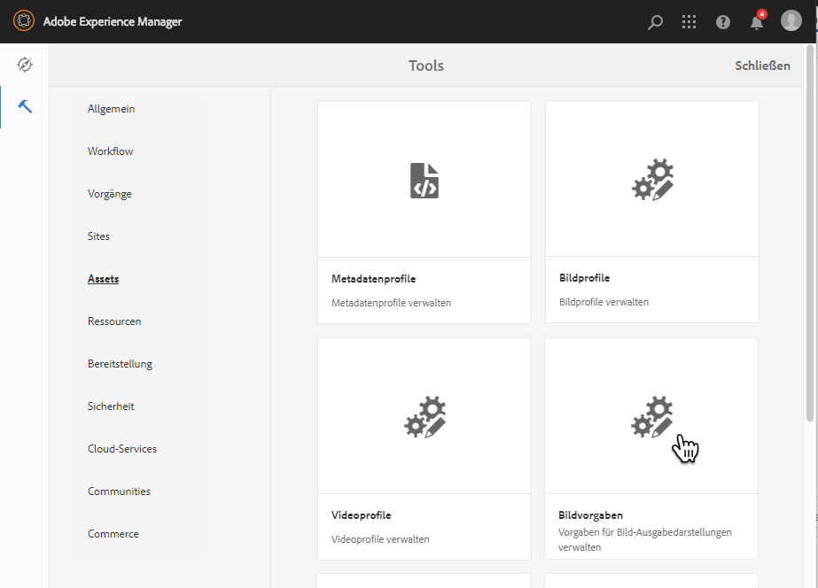
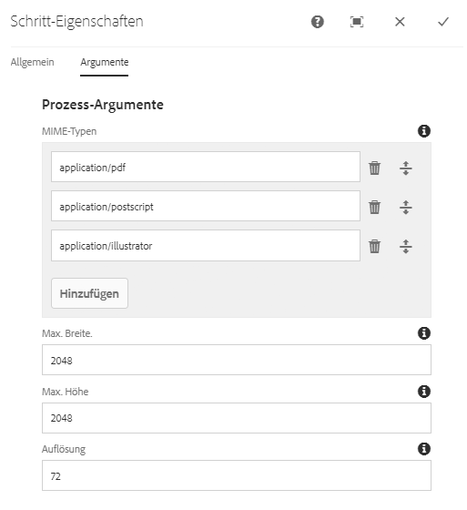
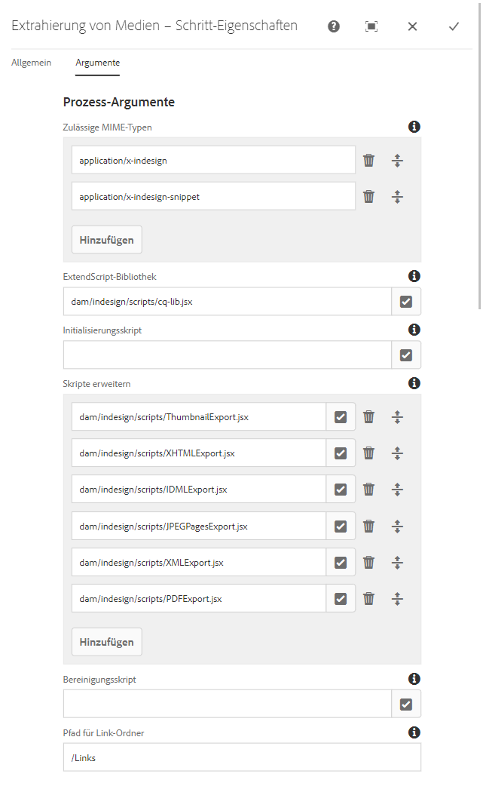
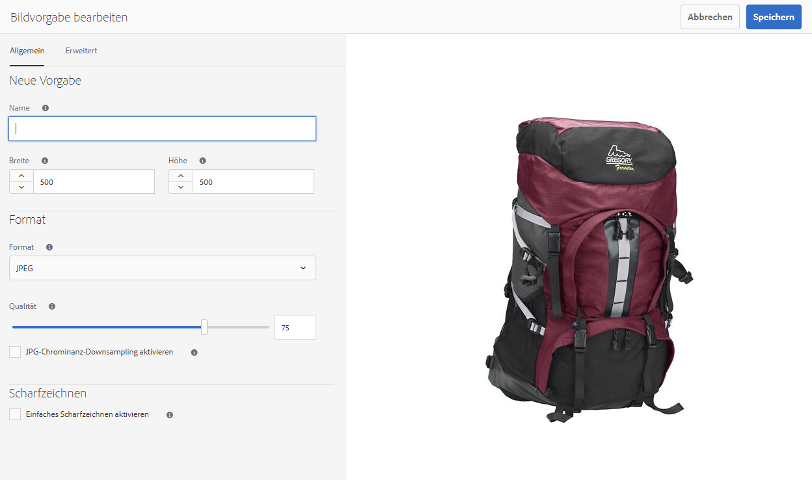
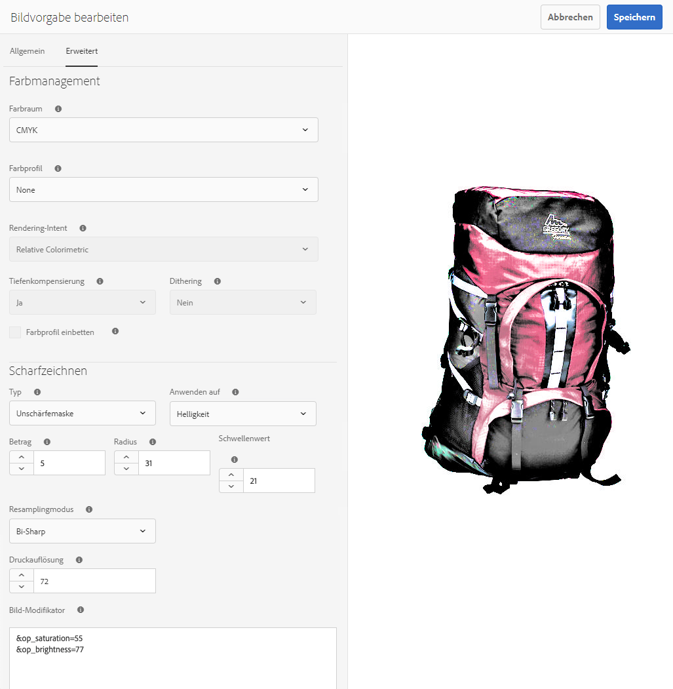
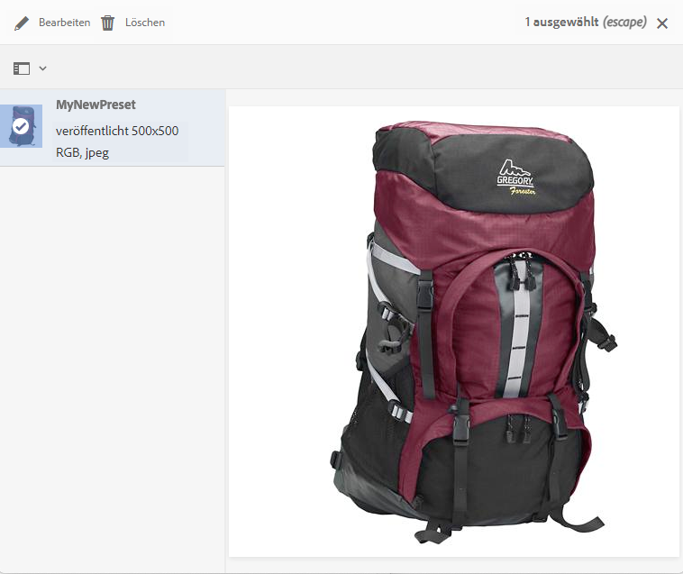

# Verwalten von Bildvorgaben für dynamische Medien{#managing-image-presets}

Anhand von Bildvorgaben kann AEM Assets Bilder mit unterschiedlichen Größen, Formaten oder Bildeigenschaften dynamisch bereitstellen. Jede Bildvorgabe stellt eine vordefinierte Sammlung aus Größen- und Formatierungsbefehlen für die Anzeige von Bildern dar. Beim Erstellen einer Bildvorgabe wählen Sie eine Größe für die Bildbereitstellung aus. Außerdem wählen Sie Formatierungsbefehle, damit die Darstellung des Bildes bei der Bereitstellung zur Anzeige optimiert wird.

Administratoren können Vorgaben für den Export von Assets erstellen. Benutzer können eine Vorgabe auswählen, wenn sie Bilder exportieren, sodass die Bilder entsprechend den Spezifikationen des Administrators umformatiert werden.

Sie können auch responsive Bildvorgaben erstellen. Wenn Sie eine responsive Bildvorgabe auf Assets anwenden, werden diese je nach Gerät oder Bildschirmgröße bei der Anzeige geändert. Sie können Bildvorgaben konfigurieren, um im Farbraum zusätzlich zu RGB oder Graustufen auch CMYK zu verwenden.

In diesem Abschnitt wird beschrieben, wie Bildvorgaben erstellt, geändert und allgemein verwaltet werden. Sie können jederzeit bei der Vorschau eines Bildes eine Bildvorgabe darauf anwenden. See [Applying Image Presets](/help/assets/image-presets.md).

>[!NOTE]
>
>Die intelligente Bildbearbeitung arbeitet mit bestehenden Bildvorgaben und reduziert in der letzten Sekunde abhängig vom Browser oder der Geschwindigkeit der Netzverbindung die Größe der Bilddatei intelligent noch weiter. See [Smart Imaging](/help/assets/imaging-faq.md) for more information.

## Vorgaben für dynamische Medien {#understanding-image-presets}

Wie ein Makro ist eine Bildvorgabe eine vordefinierte Sammlung aus Größenangaben und Formatierungsbefehlen, die unter einem Namen gespeichert wird. Stellen Sie sich folgendes Szenario vor, um ein besseres Verständnis von Bildvorgaben zu erlangen: Für Ihre Website muss jedes Produktbild in unterschiedlichen Größen, Formaten und Kompressionsraten auf Desktop- und Mobilgeräten angezeigt werden.

Sie können zwei Bildvorgaben erstellen: eine mit 500 x 500 Pixel für die Desktopcomputerversion und die andere mit 150 x 150 Pixel für die Mobilgeräteversion. You create two Image Presets, one called `Enlarge` to display images at 500x500 pixels and one called `Thumbnail` to display images at 150 x 150 pixels. To deliver images at the `Enlarge` and `Thumbnail` size, AEM looks up the definition of the Enlarge Image Preset and Thumbnail Image Preset. AEM generiert anschließend dynamisch ein Bild anhand der Größen- und Formatierungsspezifikationen der jeweiligen Bildvorgabe.

Bilder, die bei der dynamischen Bereitstellung verkleinert werden, können an Schärfe und Detailgenauigkeit verlieren. Aus diesem Grund umfasst jede Bildvorgabe Formatierungssteuerelemente für die Optimierung eines Bildes, wenn es mit einer bestimmten Größe bereitgestellt wird. Dadurch wird sichergestellt, dass die Bilder scharf und deutlich auf der Website oder in der Anwendung angezeigt werden.

Administratoren können Bildvorgaben erstellen. Sie können völlig neue Bildvorgaben erstellen oder eine vorhandene Vorgabe bearbeiten und unter einem neuen Namen speichern.

## Verwalten von Bildvorgaben für dynamische Medien {#managing-image-presets-1}

You manage your image presets in AEM by tapping or clicking the AEM logo to access the global navigation console and then tapping or clicking the Tools icon and navigating to **[!UICONTROL Assets > Image Presets]**.



>[!NOTE]
>
>Alle erstellten Bildvorgaben sind auch als dynamische Ausgabeformate verfügbar, wenn Sie eine Vorschau von Assets anzeigen oder Assets bereitstellen.
>
>Im *Modus „Dynamic Media – Scene7“* müssen Sie Bildvorgaben *nicht* veröffentlichen, da die Veröffentlichung von Bildvorgaben automatisch erfolgt.
>
>Im *Modus „Dynamic Media – Hybrid“* müssen Sie Bildvorgaben manuell veröffentlichen.
>
>Siehe [Veröffentlichen von Bildvorgaben](#publishing-image-presets).

>[!NOTE]
>
>Das System zeigt mehrere Ausgabeformate, wenn Sie **[!UICONTROL Ausgabeformate]** in der Detailansicht eines Assets auswählen. Sie können die Anzahl der angezeigten Bildvorgaben erhöhen oder verringern. Siehe [Anzahl der angezeigten Bildvorgaben erhöhen](#increasingthenumberofimagepresetsthatdisplay).

### Dateiformate Adobe Illustrator (AI), Postscript (EPS) und PDF {#adobe-illustrator-ai-postscript-eps-and-pdf-file-formats}

Wenn Sie AI-, EPS- und PDF-Dateien unterstützen möchten, um aus diesen Dateiformaten dynamische Wiedergaben zu generieren, sollten Sie die folgenden Informationen lesen, bevor Sie Bildvorgaben erstellen.

Das Dateiformat von Adobe Illustrator ist eine Variante von PDF. Dies sind die wichtigsten Unterschiede im Hinblick auf AEM Assets:

* Adobe Illustrator-Dokumente bestehen aus einer einzelnen Seite mit mehreren Ebenen. Jede Ebene wird als PNG-Unter-Asset unter dem Illustrator-Haupt-Asset extrahiert.
* PDF-Dokumente bestehen aus einer oder mehreren Seiten. Jede Seite wird als einseitiges PDF-Unter-Asset unter dem mehrseitigen PDF-Hauptdokument extrahiert.

Die Teilassets werden von der `Create Sub Asset process` Komponente im gesamten `DAM Update Asset` Arbeitsablauf erstellt. Um diese Prozesskomponente innerhalb des Workflows anzuzeigen, tippen Sie auf **[!UICONTROL Tools > Workflow > Modelle > DAM-Update-Asset > Bearbeiten]**.

Siehe auch [Seiten einer mehrseitigen Datei anzeigen](/help/assets/managing-linked-subassets.md#view-pages-of-a-multi-page-file).

Sie können die Unter-Assets oder die Seiten anzeigen, wenn Sie das Asset öffnen, auf das Menü „Inhalt“ tippen und **[!UICONTROL Unter-Assets]** oder **[!UICONTROL Seiten]** auswählen. Unter-Assets sind echte Assets. That is, PDF pages are extracted by the `Create Sub Asset` workflow component. They are then stored as `page1.pdf`, `page2.pdf`, and so on below the main asset. Nach dem Speichern verarbeitet der `DAM Update Asset` Workflow sie.

Um Dynamic Media zu verwenden, um dynamische Ausgabeformate für AI-, EPS- oder PDF-Dateien als Vorschau anzuzeigen oder zu generieren, sind folgende Verarbeitungsschritte erforderlich:

1. Im `DAM Update Asset` Workflow wird die erste Seite des ursprünglichen Assets mithilfe der konfigurierten Auflösung von der `Rasterize PDF/AI Image Preview Rendition` Prozesskomponente in einer `cqdam.preview.png` Darstellung gerastert.

1. The `cqdam.preview.png` rendition is then optimized into a PTIFF by the `Dynamic Media Process Image Assets` process component within the workflow.

>[!NOTE]
>
>Im Workflow „DAM-Update-Asset“ generiert der Schritt **[!UICONTROL EPS-Miniaturansichten]** Miniaturansichten für EPS-Dateien.

#### Metadateneigenschaften von PDF-/AI-/EPS-Assets {#pdf-ai-eps-asset-metadata-properties}

| **Metadateneigenschaft** | **Beschreibung** |
|---|---|
| dam:Physikalische Breitengraden | Dokumentbreite in Zoll. |
| dam:Physikalische Höhen | Dokumenthöhe in Zoll |

Sie können über den `Rasterize PDF/AI Image Preview Rendition` Workflow auf Prozesskomponentenoptionen zugreifen `DAM Update Asset` .

Tap on Adobe Experience Manager in the upper left, navigate to **[!UICONTROL Tools > Workflow > Models]**. Wählen Sie auf der Seite „Workflow-Modelle“ **[!UICONTROL DAM-Update-Asset]** aus und tippen Sie dann auf der Symbolleiste auf **[!UICONTROL Bearbeiten]**. Doppeltippen Sie auf der Seite &quot;DAM-Aktualisierung des Asset-Workflows&quot;auf die `Rasterize PDF/AI Image Preview Rendition` Prozesskomponente, um das Dialogfeld &quot;Schritt-Eigenschaften&quot;zu öffnen.

#### PDF-/AI-Bildvorschau-Wiedergabe rastern - Optionen {#rasterize-pdf-ai-image-preview-rendition-options}



Argumente zum Rastern von PDF- oder AI-Workflows

<table>
 <tbody>
  <tr>
   <td><strong>Prozessargument</strong></td>
   <td><strong>Standardeinstellung</strong></td>
   <td><strong>Beschreibung</strong></td>
  </tr>
  <tr>
   <td>MIME-Typen</td>
   <td><p>application/pdf</p> <p>application/postscript</p> <p>application/illustrator<br /> </p> </td>
   <td>Liste der Dokumentmimaltypen, die als PDF- oder Illustrator-Dokumente gelten.<br /> </td>
  </tr>
  <tr>
   <td>Max. Breite</td>
   <td>2048</td>
   <td>Maximale Breite der generierten Vorschaudarstellung in Pixel.<br /> </td>
  </tr>
  <tr>
   <td>Max. Höhe</td>
   <td>2048</td>
   <td>Maximale Höhe der generierten Vorschaudarstellung in Pixel.<br /> </td>
  </tr>
  <tr>
   <td>Auflösung</td>
   <td>72</td>
   <td>Auflösung, um die erste Seite in ppi (Pixel pro Zoll) zu rastern.</td>
  </tr>
 </tbody>
</table>

Bei Verwendung der standardmäßigen Prozessargumente wird die erste Seite eines PDF/AI-Dokuments mit 72 ppi gerastert und das generierte Vorschaubild hat eine Größe von 2048 x 2048 Pixel. Für eine typische Bereitstellung können Sie die Auflösung auf einen Mindestwert von 150 ppi oder mehr erhöhen. Für ein US Letter-Dokument ist z. B. für 300 ppi eine maximale Breite und Höhe von 2550 x 3300 Pixel erforderlich.

Die max. Breite und die max. Höhe beschränken die Auflösung, in der die Rasterung erfolgt. Wenn z. B. die Maximalwerte unverändert bleiben und die Auflösung auf 300 ppi festgelegt wird, wird ein US Letter-Dokument mit 186 ppi gerastert. Das Dokument ist demnach 1581 x 2046 Pixel groß.

The `Rasterize PDF/AI Image Preview Rendition` process component has a maximum defined to ensure that it does not create overly large images in memory. Zu große Bilder können zu einem Überlauf des für die JVM (Java Virtual Machine) bereitgestellten Speichers führen. Achten Sie darauf, der JVM ausreichend Arbeitsspeicher zur Verwaltung der konfigurierten Anzahl paralleler Workflows zur Verfügung zu stellen, da jeder Workflow potenziell ein Bild in der konfigurierten Maximalgröße erstellen kann.

### InDesign-Dateiformat (INDD) {#indesign-indd-file-format}

Wenn Sie INDD-Dateien unterstützen möchten, um aus diesem Dateiformat dynamische Wiedergaben zu generieren, sollten Sie die folgenden Informationen lesen, bevor Sie Bildvorgaben erstellen.

Für InDesign-Dateien werden nur dann Unter-Assets extrahiert, wenn der Adobe InDesign Server in AEM integriert ist. Referenzierte Assets werden auf der Grundlage ihrer Metadaten verknüpft. Für die Verknüpfung ist InDesign Server nicht erforderlich. Die referenzierten Assets müssen jedoch in AEM vorhanden sein, bevor die InDesign-Dateien verarbeitet werden, damit die Verknüpfungen zwischen den InDesign-Dateien und den referenzierten Assets erstellt werden können.

Siehe [Integrieren von AEM Assets in InDesign Server](/help/assets/indesign.md).

The Media Extraction process component in the `DAM Update Asset` workflow runs several preconfigured Extend Scripts to process InDesign files.



Die ExtendScript-Pfade in den Argumenten der Prozesskomponente zum Extrahieren von Medien im Workflow „DAM-Update-Asset“

Die folgenden Skripte werden von der Dynamic Media-Integration verwendet:

<table>
 <tbody>
  <tr>
   <td><strong>Skriptname erweitern</strong></td>
   <td><strong>Default</strong></td>
   <td><strong>Beschreibung</strong></td>
  </tr>
  <tr>
   <td>ThumbnailExport.jsx</td>
   <td>Ja</td>
   <td>Erstellt eine 300 ppi <code>thumbnail.jpg</code> Darstellung, die optimiert und in eine PTIFF-Darstellung nach <code>Dynamic Media Process Image Assets</code> Prozesskomponente umgewandelt wird.<br /> </td>
  </tr>
  <tr>
   <td>JPEGPagesExport.jsx</td>
   <td>Ja</td>
   <td>Generiert ein JPEG-Unterasset mit 300 ppi pro Seite. Das JPEG-Unter-Asset ist ein echtes Asset, das unter dem InDesign-Asset gespeichert wird. Er wird auch vom <code>DAM Update Asset</code> Workflow optimiert und in ein PTIFF umgewandelt.<br /> </td>
  </tr>
  <tr>
   <td>PDFPagesExport.jsx</td>
   <td>Nein</td>
   <td>Generiert ein PDF-Unterasset für jede Seite. Das PDF-Unter-Asset wird wie zuvor beschrieben verarbeitet. Da das PDF-Asset nur eine Seite enthält, werden keine Unter-Assets generiert.<br /> </td>
  </tr>
 </tbody>
</table>

## Configuring image thumbnail size {#configuring-image-thumbnail-size}

Sie können die Größe von Miniaturansichten über die Einstellungen im Workflow **[!UICONTROL DAM-Update-Asset]** konfigurieren. Im Workflow sind zwei Schritte enthalten, in denen Sie die Größe der Miniaturansichten von Bild-Assets konfigurieren können. Obwohl der eine (**[!UICONTROL Dynamic Media Process Image-Assets]**) für das Generieren dynamischer Bild-Assets und der andere (**[!UICONTROL Miniaturansichten verarbeiten]**) für das Generieren statischer Miniaturansichten verwendet wird bzw. dann, wenn alle anderen Prozesse zum Generieren von Miniaturansichten fehlschlagen, sollten *beide* dieselben Einstellungen haben.

Mit dem Schritt **[!UICONTROL Dynamic Media Process Image-Assets]** werden Miniaturansichten durch den Image-Server erstellt. Diese Konfiguration ist unabhängig von der Konfiguration für den Schritt **[!UICONTROL Miniaturansichten verarbeiten]**. Das Generieren von Miniaturansichten mit dem Schritt **[!UICONTROL Miniaturansichten verarbeiten]** ist das langsamste und speicherintensivste Verfahren zum Erstellen von Miniaturansichten.

Die Größe der Miniaturansichten wird im folgenden Format definiert: **[!UICONTROL width:height:center]**, z. B. *80:80:false*. Die Breite und die Höhe legen die Größe der Miniaturansicht in Pixel fest. Für den Center-Wert ist entweder false oder true festgelegt. Wenn true festgelegt ist, hat das Miniaturbild exakt die in der Konfiguration festgelegte Größe. Wenn das in der Größe angepasste Bild kleiner ist, wird es im Miniaturbildfenster zentriert.

>[!NOTE]
>
>* Die Größe der Miniaturansichten für EPS-Dateien wird im Schritt **[!UICONTROL EPS-Miniaturen]** auf der Registerkarte **[!UICONTROL Argumente]** unter „Miniaturansichten“ konfiguriert.
   >
   >
* Die Größe der Miniaturansichten für Videos wird im Schritt **[!UICONTROL FFmpeg-Miniaturen]** auf der Registerkarte **[!UICONTROL Prozess]** unter **[!UICONTROL Argumente]** konfiguriert.
>


**So konfigurieren Sie die Größe** der Miniaturansicht:

1. Tap **[!UICONTROL Tools > Workflow > Models > DAM Update Asset > Edit]**.
1. Tippen Sie auf den Schritt **[!UICONTROL Dynamic Media Process Image-Assets]** und dann auf die Registerkarte **[!UICONTROL Miniaturansichten]**. Ändern Sie bei Bedarf die Größe der Miniaturansichten und tippen Sie auf **[!UICONTROL OK]**.

   

1. Tap the **[!UICONTROL Process Thumbnails]** step, then tap the **[!UICONTROL Thumbnails]** tab. Ändern Sie bei Bedarf die Größe der Miniaturansichten und tippen Sie auf **[!UICONTROL OK]**.

   >[!NOTE]
   >
   >Die Werte im Argument „Miniaturen“ im Schritt **[!UICONTROL Miniaturansichten verarbeiten]** müssen mit denen im Argument „Miniaturen“ im Schritt **[!UICONTROL Dynamic Media Process Image-Assets]** übereinstimmen.

1. Tippen Sie auf **[!UICONTROL Speichern]**, um die Änderungen am Workflow zu speichern.

### Increasing or decreasing the number of Dynamic Media image presets that display {#increasing-or-decreasing-the-number-of-image-presets-that-display}

Erstellte Bildvorgaben sind auch als dynamische Ausgabeformate verfügbar, wenn Sie eine Vorschau von Assets anzeigen. AEM zeigt verschiedene dynamische Ausgabeformate an, wenn Sie ein Asset unter **[!UICONTROL Detailansicht > Ausgabeformate]** anzeigen. Sie können die Anzahl der angezeigten Ausgabeformate erhöhen oder verringern.

**So erhöhen oder verringern Sie die Anzahl der Bildvorgaben** für dynamische Medien:

1. Navigate to CRXDE Lite ([https://localhost:4502/crx/de](https://localhost:4502/crx/de)).
1. Navigieren Sie zum Node für die Bildvorgabenliste unter `/libs/dam/gui/coral/content/commons/sidepanels/imagepresetsdetail/imgagepresetslist`

   

1. Ändern Sie für die Eigenschaft **[!UICONTROL limit]** den **[!UICONTROL Wert]**, für den standardmäßig 15 festgelegt ist, in einen höheren Wert.
1. Navigieren Sie zur Datenquelle der Bildvorgabe unter `/libs/dam/gui/coral/content/commons/sidepanels/imagepresetsdetail/imgagepresetslist/datasource`

   

1. In the limit property, change the number to the desired number, for example `{empty requestPathInfo.selectors[1] ? "20" : requestPathInfo.selectors[1]}`
1. Tippen Sie auf **[!UICONTROL Alle speichern]**.

## Erstellen einer Bildvorgabe für dynamische Medien {#creating-image-presets}

Wenn Sie eine Bildvorgabe für dynamische Medien erstellen, können Sie diese Einstellungen bei der Vorschau oder Veröffentlichung auf alle Bilder anwenden.

>[!NOTE]
>
>Wenn Sie Internet Explorer 9 verwenden und eine Vorgabe erstellen, wird diese nicht sofort nach dem Speichern in der Vorgabenliste angezeigt. Um dieses Problem zu umgehen, deaktivieren Sie den Cache für IE9.

Wenn Sie AI-, PDF-, und EPS-Dateien unterstützen möchten, um aus diesen Dateiformaten dynamische Wiedergaben zu generieren, sollten Sie die folgenden Informationen lesen, bevor Sie Bildvorgaben erstellen.
Siehe [Dateiformate Adobe Illustrator (AI), Postscript (EPS) und PDF](#adobe-illustrator-ai-postscript-eps-and-pdf-file-formats).

Wenn Sie INDD-Dateien unterstützen möchten, um aus diesem Dateiformat dynamische Wiedergaben zu generieren, sollten Sie die folgenden Informationen lesen, bevor Sie Bildvorgaben erstellen.
 Siehe [InDesign-Dateiformat (INDD)](#indesign-indd-file-format).

>[!NOTE]
>
>Zum Erstellen von Bildvorgaben für dynamische Medien benötigen Sie Administratorrechte als AEM-Administrator oder Admin-Konsolenadministrator.

**So erstellen Sie eine Bildvorgabe** für dynamische Medien:

1. In AEM, tap the AEM logo to access the global navigation console, then tap **[!UICONTROL Tools > Assets > Image Presets]**.
1. Klicken Sie auf **[!UICONTROL Erstellen]**. Das Fenster **[!UICONTROL Bildvorgabe bearbeiten]** wird geöffnet.

   

   >[!NOTE]
   >
   >Um eine responsive Bildvorgabe zu erstellen, löschen Sie die Werte in den Feldern **[!UICONTROL Breite]** und **[!UICONTROL Höhe]** und lassen Sie sie leer.

1. Geben Sie die entsprechenden Werte auf den Registerkarten **[!UICONTROL Allgemein]** und **[!UICONTROL Erweitert]** einschließlich eines Namens ein. Die Optionen werden in den [Optionen für die Bildvorgabe](#image-preset-options) hervorgehoben. Vorgaben werden im linken Bereich angezeigt und können nur zusammen mit anderen Assets verwendet werden.

   

1. Klicken Sie auf **[!UICONTROL Speichern**.

## Creating a responsive image preset {#creating-a-responsive-image-preset}

Um eine responsive Bildvorgabe zu erstellen, führen Sie die Schritte unter [Erstellen von Bildvorgaben](#creating-image-presets) durch. Löschen Sie die Werte für Höhe und Breite im Fenster **[!UICONTROL Bildvorgabe bearbeiten]** und lassen Sie sie leer.

Dadurch wird diese Vorgabe in AEM als responsiv erkannt. Sie können die anderen Werte nach Bedarf anpassen.


>[!NOTE]
>
>Um die Schaltflächen **[!UICONTROL URL]** und **[!UICONTROL RESS]** beim Anwenden einer Bildvorgabe auf ein Asset anzuzeigen, muss das Asset veröffentlicht werden.
>
>
>
>Im Modus „Dynamic Media – Scene7“ werden Bildvorgaben und Bildelemente automatisch veröffentlicht.
>
>Im Modus „Dynamic Media – Hybrid“ müssen Sie Bildvorgaben und Bildelemente manuell veröffentlichen.

### Image Preset options {#image-preset-options}

Die in diesem Abschnitt beschriebenen Optionen sind beim Erstellen oder Bearbeiten von Bildvorgaben verfügbar. Adobe empfiehlt zudem die folgenden Best Practices für den Anfang:

* **[!UICONTROL Format** (Registerkarte **[!UICONTROL Einfach]** ) - Wählen Sie **[!UICONTROL JPEG]** oder ein anderes Format, das Ihren Anforderungen entspricht. Alle Webbrowser unterstützen das JPEG-Bildformat. Es bietet einen angemessenen Ausgleich zwischen kleiner Dateigröße und Bildqualität. Das JPEG-Format nutzt aber ein verlustreiches Kompressionsschema, das zu unerwünschten Bildartefakten führen kann, wenn die Komprimierung zu niedrig eingestellt ist. Aus diesem Grund empfiehlt Adobe, die Komprimierungsqualität auf 75 zu setzen. Diese Einstellung bietet einen angemessenen Ausgleich zwischen Bildqualität und kleiner Dateigröße.

* **[!UICONTROL Einfaches Scharfzeichnen]** aktivieren: Wählen Sie **[!UICONTROL Einfaches Scharfzeichnen]** aktivieren nicht aus (dieser Scharfzeichnungsfilter bietet weniger Kontrolle als die Einstellungen für Unschärfemaske).

* **[!UICONTROL Scharfzeichnen: Resampling Mode]** - Wählen Sie **[!UICONTROL Bi-Cubic]**.

#### Optionen auf der Registerkarte „Basis“{#basic-tab-options}

<table>
 <tbody>
  <tr>
   <td><strong>Feld</strong></td>
   <td><strong>Beschreibung</strong></td>
  </tr>
  <tr>
   <td><strong>Name</strong></td>
   <td>Geben Sie einen aussagekräftigen Namen ohne Leerzeichen ein. Nehmen Sie die Bildgröße in den Namen auf, damit Benutzer diese Bildvorgabe einfacher identifizieren können.</td>
  </tr>
  <tr>
   <td><strong>Breite und Höhe</strong></td>
   <td>Geben Sie die Größe in Pixel ein, in der das Bild übermittelt wird. Breite und Höhe müssen größer als 0 Pixel sein. Wenn einer der beiden Werte 0 ist, wird keine Vorgabe erstellt. Wenn beide Werte leer sind, wird eine responsive Bildvorgabe erstellt.</td>
  </tr>
  <tr>
   <td><strong>Format</strong></td>
   <td><p>Wählen Sie ein Format im Menü aus.</p> <p>Bei <strong>JPEG</strong> erhalten Sie die folgenden zusätzlichen Optionen:</p>
    <ul>
     <li><strong>Qualität</strong> - Steuert die JPEG-Komprimierungsstufe. Diese Einstellung wirkt sich sowohl auf die Dateigröße als auch auf die Bildqualität aus. Die JPEG-Qualitätsskala ist 1-100. Die Skalierung ist sichtbar, wenn Sie den Schieberegler ziehen.</li>
     <li><strong>JPG-Chrominanz-Neuberechnung</strong> aktivieren - Da das Auge gegenüber Hochfrequenzfarbinformationen weniger empfindlich ist als bei Hochfrequenz-Leuchtdichte, teilen JPEG-Bilder Bildinformationen in Leuchtdichte- und Farbkomponenten. Wenn ein JPEG-Bild komprimiert wird, bleibt die Leuchtdichtekomponente bei voller Auflösung, während die Farbkomponenten neu berechnet werden, indem der Mittelwert für Pixelgruppen berechnet wird. Die Neuberechnung reduziert das Datenvolumen um ein halbes oder ein Drittel, ohne dass sich dies auf die wahrgenommene Qualität auswirkt. Downsampling kann nicht auf Graustufenbilder angewendet werden. Auf diese Weise wird die für Bilder mit hohem Kontrast (z. B. Bilder mit überlappendem Text) nützliche Komprimierung reduziert.</li>
    </ul>
    <div>
      Bei Auswahl von <strong>GIF</strong> oder <strong>GIF mit Alpha</strong> werden die folgenden zusätzlichen Optionen für <strong>GIF-Farbquantisierung</strong> verfügbar:
    </div>
    <ul>
     <li><strong>Typ </strong>- Wählen Sie <strong>Adaptiv</strong> (Standard), <strong>Web</strong>oder <strong>Macintosh</strong>. Wenn Sie " <strong>GIF mit Alpha</strong>"auswählen, ist die Option "Macintosh"nicht verfügbar.</li>
     <li><strong>Dither</strong> - Wählen Sie <strong>Diffuse</strong> oder <strong>Aus</strong>.</li>
     <li><strong>Anzahl Farben</strong>: Geben Sie eine Zahl zwischen 2 und 256 ein.</li>
     <li><strong>Farbliste</strong>: Geben Sie eie durch Komma getrennte Liste ein. Geben Sie beispielsweise für Weiß, Grau und Schwarz 000000,888888,ffffff ein.</li>
    </ul>
    <div>
      Bei Auswahl von <strong>PDF</strong>, <strong>TIFF</strong> oder <strong>TIFF mit Alpha</strong> erhalten Sie die folgende zusätzliche Option:
    </div>
    <ul>
     <li><strong>Komprimierung</strong>: Wählen Sie einen Komprimierungsalgorithmus. Die Algorithmusoptionen für PDF lauten <strong>Kein</strong>, <strong>ZIP</strong> und <strong>JPEG</strong>. Für TIFF lauten sie <strong>Kein</strong>, <strong>LZW</strong>, <strong>JPEG</strong> und <strong>ZIP</strong>. Für TIFF mit Alpha lauten sie <strong>Kein</strong>, <strong>LZW</strong> und <strong>ZIP</strong>.</li>
    </ul> <p>Die Auswahl <strong>PNG</strong>, <strong>PNG mit Alpha</strong> oder <strong>EPS</strong> ergibt keine zusätzlichen Optionen.</p> </td>
  </tr>
  <tr>
   <td><strong>Scharfzeichnen</strong></td>
   <td>Wählen Sie die Option <strong>Einfaches Scharfzeichnen aktivieren</strong>, um einen einfachen Scharfzeichnungsfilter auf das Bild anzuwenden, nachdem die Skalierung abgeschlossen ist. Mit der Scharfzeichnung können Sie unter Umständen Weichzeichnung kaschieren, die durch die Anzeige eines Bildes in einer anderen Größe entsteht. </td>
  </tr>
 </tbody>
</table>

#### Optionen auf der Registerkarte „Erweitert“{#advanced-tab-options}

<table>
 <tbody>
  <tr>
   <td><strong>Feld</strong></td>
   <td><strong>Beschreibung</strong></td>
  </tr>
  <tr>
   <td><strong>Farbraum</strong></td>
   <td>Select <strong>RGB, CMYK,</strong> or <strong>Grayscale</strong> for the color space.</td>
  </tr>
  <tr>
   <td><strong>Farbprofil</strong></td>
   <td>Wählen Sie das Profil des Ausgabefarbraums aus, in den das Asset konvertiert werden soll, sofern dieser sich von dem des Arbeitsprofils unterscheidet.</td>
  </tr>
  <tr>
   <td><strong>Rendering-Intent</strong></td>
   <td>Sie können den Standardwert für Rendering-Intent überschreiben. Rendering-Intent legt fest, was mit Farben passiert, die im Farbprofil des Ziels nicht wiedergegeben werden können (außerhalb der Farbskala). Rendering-Intent wird ignoriert, wenn das ICC-Profil nicht kompatibel ist.
    <ul>
     <li>Wählen Sie <strong>Wahrnehmungsoptimiert</strong> aus, damit die gesamte Farbskala von einem Farbraum in einen anderen Farbraum komprimiert wird, wenn eine oder mehrere Farben im Originalbild außerhalb der Farbskala des Zielfarbraums liegen.</li>
     <li>Wählen Sie <strong>Relativ farbmetrisch</strong> aus, wenn eine Farbe des aktuellen Farbraums im Zielfarbraum außerhalb der Farbskala liegt und auf die nächstmögliche Farbe der Farbskala des Zielfarbraums abgebildet werden soll, ohne dass andere Farben betroffen sind. </li>
     <li>Wählen Sie <strong>Sättigung</strong> aus, um die Sättigung des Originalbilds beim Konvertieren in den Zielfarbraum zu übernehmen. </li>
     <li>Wählen Sie <strong>Absolut farbmetrisch</strong> aus, um Farben exakt und ohne Weißpunkt- oder Schwarzpunktanpassung abzubilden, wodurch die Helligkeit verändert würde.</li>
    </ul> </td>
  </tr>
  <tr>
   <td><strong>Tiefenkompensierung</strong></td>
   <td>Wählen Sie diese Option aus, wenn das Ausgabeprofil diese Funktion unterstützt. Die Tiefenkompensierung wird ignoriert, wenn sie nicht mit dem angegebenen ICC-Profil kompatibel ist.</td>
  </tr>
  <tr>
   <td><strong>Dithering</strong></td>
   <td>Wählen Sie diese Option aus, um Farbstreifen-Artefakte möglichst zu vermeiden oder zu reduzieren. </td>
  </tr>
  <tr>
   <td><strong>Scharfzeichnungstyp </strong></td>
   <td><p>Wählen Sie <strong>Kein</strong>, <strong>Scharfzeichnen</strong> oder <strong>Unschärfemaske</strong> aus. </p>
    <ul>
     <li>Wählen Sie <strong>Kein</strong>, um die Scharfzeichnung zu deaktivieren.</li>
     <li>Aktivieren Sie <strong>Scharfzeichnen</strong>, um einen einfachen Scharfzeichnungsfilter auf das Bild anzuwenden, nachdem die Skalierung abgeschlossen ist. Mit der Scharfzeichnung können Sie unter Umständen Weichzeichnung kaschieren, die durch die Anzeige eines Bildes in einer anderen Größe entsteht. </li>
     <li>Select<strong> Unsharp mask</strong> to fine-tune a sharpening filter effect on the final downsampled image. You can control intensity of effect, radius of the effect (measured in pixels) and a threshold of contrast that will be ignored. This effect uses the same options as Photoshop’s “Unsharp Mask” filter.</li>
    </ul> <p>In <strong>Unschärfemaske</strong> sind die folgenden Optionen verfügbar:</p>
    <ul>
     <li><strong>Stärke</strong> - Steuert den Kontrastgrad, der auf die Kantenpixel angewendet wird. Der Standardwert für die reelle Zahl ist 1,0. Bei hochauflösenden Bildern können Sie ihn auf bis zu 5,0 erhöhen. Der Wert dient hierbei als ein Maß für die Filterintensität.</li>
     <li><strong>Radius</strong> : Bestimmt die Anzahl der Pixel, die die Kantenpixel umgeben und die Scharfzeichnung beeinflussen. Geben Sie für Bilder mit hoher Auflösung eine reelle Zahl zwischen 1 und 2 ein. Mit einem niedrigeren Wert werden nur die Kantenpixel scharfgezeichnet, während mit einem höheren Wert mehr Pixel scharfgezeichnet werden. Der korrekte Wert hängt von der Bildgröße ab.</li>
     <li><strong>Schwellenwert</strong> : Bestimmt den Kontrastbereich, der ignoriert werden soll, wenn der Filter "Unschärfemaske"angewendet wird. Mit anderen Worten, diese Option bestimmt, wie stark sich die scharfgezeichneten Pixel vom umgebenden Bereich unterscheiden müssen, bevor sie als Kantenpixel betrachtet und scharfgezeichnet werden. Um Rauschen zu vermeiden, sollten Sie mit Ganzzahlwerten zwischen 2 und 20 experimentieren. </li>
     <li><strong>Anwenden auf</strong> - Bestimmt, ob die Scharfzeichnung für jede Farbe oder Helligkeit gilt.</li>
    </ul>
    <div>
      Das Scharfzeichnen wird unter <a href="https://docs.adobe.com/content/help/en/dynamic-media-classic/using/assets/s7_sharpening_images.pdf">Scharfzeichnen von Bildern</a> beschrieben.
    </div> </td>
  </tr>
  <tr>
   <td><strong>Resamplingmodus</strong></td>
   <td>Wählen Sie eine Option für den <strong>Resamplingmodus</strong>. Diese Optionen sorgen dafür, dass das Bild beim Downsampling scharf bleibt:
    <ul>
     <li><strong>Bi-Linear</strong> - Die schnellste Resamplingmethode. Einige Aliasing-Artefakte sind bemerkbar.</li>
     <li><strong>Bi-Cubic</strong> - Erhöht die CPU-Auslastung, erzielt aber schärfere Bilder mit weniger bemerkbaren Aliasing-Artefakten.</li>
     <li><strong>Sharp2</strong> - Kann etwas schärfere Ergebnisse liefern als Bi-Cubic, aber zu noch höheren CPU-Kosten.</li>
     <li><strong>Bi-Sharp</strong> - Wählt Fotoshop Standard-Resampler zum Reduzieren der Bildgröße aus, der in Adobe Fotoshop als <strong>bikubischer Scharfzeichner</strong> bezeichnet wird.</li>
     <li><strong>Jede Farbe</strong> und <strong>Helligkeit</strong>: Jede Methode kann auf Farbe oder Helligkeit basieren. Standardmäßig ist <strong>Jede Farbe</strong> ausgewählt.</li>
    </ul> </td>
  </tr>
  <tr>
   <td><strong>Druckauflösung</strong></td>
   <td>Wählen Sie eine Auflösung für den Druck dieses Bildes. Der Standardwert beträgt 72 Pixel</td>
  </tr>
  <tr>
   <td><strong>Bild-Modifikator</strong></td>
   <td><p>Beyond the common image settings available in the UI, Dynamic Media supports numerous advanced image modifications that you can specify in the <strong>Image Modifiers</strong> field. These parameters are defined in the <a href="https://marketing.adobe.com/resources/help/en_US/s7/is_ir_api/is_api/http_ref/c_command_reference.html">Image Server Protocol command reference</a>.</p> <p>Wichtig: Die folgenden in der API aufgelisteten Funktionen werden nicht unterstützt:</p>
    <ul>
     <li>Grundlegende Befehle zum Vorbereiten und Wiedergeben von Text: <code>text= textAngle= textAttr= textFlowPath= textFlowXPath= textPath=</code> und <code>textPs=</code></li>
     <li>Lokalisierungsbefehle: <code>locale=</code> und <code>req=xlate</code></li>
     <li><code>req=set</code> nicht zur allgemeinen Verwendung verfügbar ist.</li>
     <li><code>req=mbrset</code></li>
     <li><code>req=saveToFile</code></li>
     <li><code>req=targets</code></li>
     <li><code>template=</code></li>
     <li>Dynamic Media-Nebenservices: SVG, Rendering von Bildern und Web-to-Print</li>
    </ul> </td>
  </tr>
 </tbody>
</table>

## Defining image preset options with Image Modifiers {#defining-image-preset-options-with-image-modifiers}

Zusätzlich zu den auf den Registerkarten „Allgemein“ und „Erweitert“ verfügbaren Optionen können Sie Bildmodifikatoren definieren, damit Sie beim Definieren von Bildvorgaben über mehr Optionen verfügen. Das Rendern von Bildern basiert auf der Scene7-Image-Rendering-API und wird ausführlich in der [HTTP-Protokollreferenz](https://microsite.omniture.com/t2/help/en_US/s7/is_ir_api/is_api/http_ref/c_http_protocol_reference.html) beschrieben.

Im Folgenden finden Sie einige einfache Beispiele für die Nutzung von Bild-Modifikatoren.

>[!NOTE]
>
>Some image modifiers [cannot be used in AEM](#advanced-tab-options).

* [op_invert](https://microsite.omniture.com/t2/help/en_US/s7/is_ir_api/is_api/http_ref/r_op_invert.html) - Invertiert jede Farbkomponente für einen negativen Bildeffekt.

   ```xml
   &op_invert=1
   ```

   

* [op_blur](https://microsite.omniture.com/t2/help/en_US/s7/is_ir_api/is_api/http_ref/r_op_blur.html) – Wendet einen Weichzeichenfilter auf das Bild an.

   ```xml
   &op_blur=7
   ```

   

* Kombinierte Befehle - op_blur und op-invert

   ```xml
   &op_invert=1&op_blur=7
   ```

   

* [op_brightness](https://microsite.omniture.com/t2/help/en_US/s7/is_ir_api/is_api/http_ref/r_op_brightness.html) - Verringert oder erhöht die Helligkeit.

   ```xml
   &op_brightness=58
   ```

   

* [opac](https://microsite.omniture.com/t2/help/en_US/s7/is_ir_api/is_api/http_ref/r_opac.html) – Passt die Bilddeckkraft an. Ermöglicht es Ihnen, die Vordergrunddeckkraft zu verringern.

   ```xml
   opac=29
   ```

   

## Bearbeiten von Bildvorgaben {#modifying-image-presets}

1. In AEM, tap the AEM logo to access the global navigation console, then tap **[!UICONTROL Tools > Assets > Image Presets]**.

   

1. Select a preset and then click **[!UICONTROL Edit]**. The **[!UICONTROL Edit Image Preset]** window opens.
1. Nehmen Sie Änderungen vor und klicken Sie auf **[!UICONTROL Speichern]**, um die Änderungen zu speichern, oder auf **[!UICONTROL Abbrechen]**, um sie zu verwerfen.

## Veröffentlichen von Bildvorgaben für dynamische Medien {#publishing-image-presets}

Wenn Sie den Modus „Dynamic Media –Hybrid“ ausführen, müssen Sie Bildvorgaben manuell veröffentlichen.

(Wenn Sie den Modus „Dynamic Media – Scene7“ ausführen, werden Bildvorgaben automatisch veröffentlicht und Sie müssen diese Schritte nicht ausführen.)

**So veröffentlichen Sie Bildvorgaben im dynamischen Medienmodus**:

1. In AEM, tap or click the AEM logo to access the global navigation console and tap or click the Tools icon and navigate to **[!UICONTROL Assets > Image Presets]**.
1. Wählen Sie in der Liste der Bildvorgaben eine oder mehrere Bildvorgaben aus und klicken oder tippen Sie auf **[!UICONTROL Veröffentlichen]**.
1. Nachdem die Bildvorgabe veröffentlicht wurde, ändert sich der Status von „Nicht veröffentlicht“ in „Veröffentlicht“.

   

## Löschen von Bildvorgaben für dynamische Medien {#deleting-image-presets}

1. Tippen oder klicken Sie in AEM auf das AEM-Logo, um auf die globale Navigationskonsole zuzugreifen.
1. Tippen Sie auf das Symbol **[!UICONTROL Werkzeuge]** und navigieren Sie dann zu **[!UICONTROL Assets > Bildvorgaben]**.
1. Select a preset, and then click **[!UICONTROL Delete**. Dynamic Media bestätigt Ihre Löschabsicht. Tap **[!UICONTROL Delete]** to delete or tap **[!UICONTROL Cancel]** to abort.

