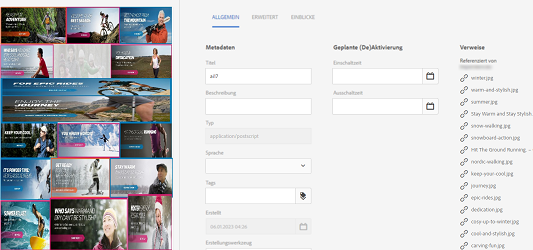
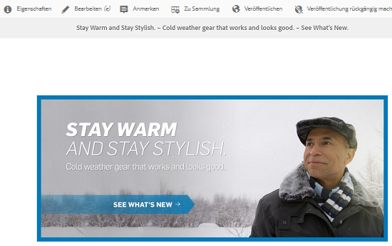
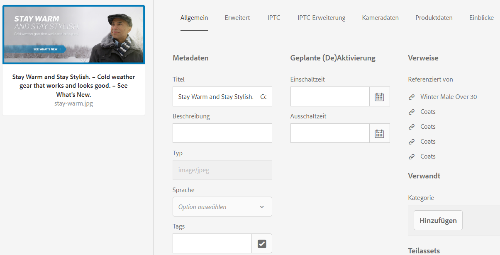
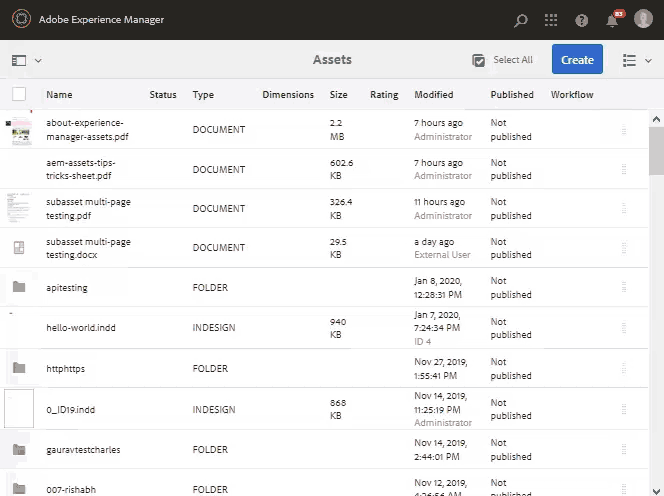

# Verwalten von ebenenübergreifenden und mehrseitigen Assets {#managing-compound-assets}

[!DNL Adobe Experience Manager Assets] kann erkennen, ob eine hochgeladene Datei Verweise auf Assets enthält, die bereits im Repository vorhanden sind. Diese Funktion ist nur für unterstützte Dateiformate verfügbar. Wenn das hochgeladene Asset Verweise auf [!DNL Experience Manager]-Assets enthält, wird eine bidirektionale Verknüpfung zwischen den hochgeladenen und den referenzierten Assets erstellt.

Die Referenzierung der Assets in [!DNL Adobe Creative Cloud]-Anwendungen sorgt nicht nur für Redundanz, sondern verbessert auch die Zusammenarbeit und erhöht die Effizienz und Produktivität der Benutzer.

[!DNL Experience Manager Assets] unterstützt bidirektionale Referenzierung. Referenzierte Assets finden Sie auf der Asset-Detailseite der hochgeladenen Datei. Darüber hinaus können Sie die referenzierenden Dateien auf der Asset-Detailseite des referenzierten Assets anzeigen.

Referenzen werden auf der Grundlage von Pfad, Dokument-ID und Instanz-ID der referenzierten Assets aufgelöst.

## [!DNL Adobe Illustrator]: Hinzufügen digitaler Assets als Referenzen {#refai}

Sie können vorhandene digitale Assets aus einer [!DNL Adobe Illustrator]-Datei referenzieren.

1. Rufen Sie mit dem [[!DNL Experience Manager] Desktop-Programm](https://experienceleague.adobe.com/docs/experience-manager-desktop-app/using/using.html?lang=de) die digitalen Assets im lokalen Dateisystem ab. Navigieren Sie zum Dateisystemspeicherort des Assets, auf das Sie verweisen möchten.
1. Ziehen Sie das Asset aus dem lokalen Ordner in die Datei [!DNL Illustrator] .

1. Speichern Sie die Datei [!DNL Illustrator] auf dem bereitgestellten Laufwerk oder [laden Sie ](/help/assets/manage-assets.md#uploading-assets) in das [!DNL Experience Manager]-Repository hoch.

1. Nachdem der Workflow abgeschlossen ist, navigieren Sie zur Detailseite für das Asset. Die Verweise auf vorhandene digitale Assets werden unter **[!UICONTROL Abhängigkeiten]** in der Spalte **[!UICONTROL Verweise]** aufgeführt.

   

1. Es ist auch möglich, dass andere Dateien als die aktuelle Datei auf die referenzierten Assets verweisen, die unter **[!UICONTROL Abhängigkeiten]** angezeigt werden. Um eine Liste der referenzierenden Dateien für ein Asset anzuzeigen, klicken Sie unter **[!UICONTROL Abhängigkeiten]** auf das Asset.

   

1. Klicken Sie in der Symbolleiste auf **[!UICONTROL Eigenschaften anzeigen]** . Auf der Seite [!UICONTROL Eigenschaften] wird die Liste der Dateien, die auf das aktuelle Asset verweisen, in der Spalte **[!UICONTROL Verweise]** auf der Registerkarte **[!UICONTROL Einfach]** angezeigt.

   

   *Abbildung: Asset-Verweise in Asset-Details.*

## [!DNL Adobe InDesign]: Hinzufügen digitaler Assets als Referenzen {#add-aem-assets-as-references-in-adobe-indesign}

Um digitale Assets aus einer [!DNL InDesign]-Datei zu referenzieren, ziehen Sie die Assets in die Datei [!DNL InDesign] oder exportieren Sie die Datei [!DNL InDesign] als ZIP-Archiv.

Referenzierte Assets sind bereits in [!DNL Experience Manager Assets] vorhanden. Sie können Unter-Assets extrahieren, indem Sie [InDesign Server](indesign.md) konfigurieren. Eingebettete Assets in einer [!DNL InDesign]-Datei werden als Teil-Assets extrahiert.

>[!NOTE]
>
>Wenn die [!DNL InDesign Server] Proxys verwendet werden, ist die Vorschau für [!DNL InDesign]-Dateien in die XMP Metadaten eingebettet. In diesem Fall ist die Extraktion von Miniaturen nicht explizit erforderlich. Wenn [!DNL InDesign Server] jedoch nicht bereitgestellt wird, müssen Miniaturansichten explizit für [!DNL InDesign]-Dateien extrahiert werden.

Wenn eine INDD-Datei hochgeladen wird, werden die Verweise abgerufen, indem Assets mit der Eigenschaft `xmpMM:InstanceID` und `xmpMM:DocumentID` im Repository abgefragt werden.

### Erstellen von Referenzen durch Ziehen von Assets {#create-references-by-dragging-aem-assets}

Dieses Verfahren ähnelt [Hinzufügen digitaler Assets als Referenzen in Adobe Illustrator](#refai).

### Erstellen von Referenzen zu Assets durch Exportieren einer ZIP-Datei {#create-references-to-aem-assets-by-exporting-a-zip-file}

1. Führen Sie die Schritte unter [Workflow-Modelle erstellen](/help/sites-developing/workflows-models.md) aus, um einen neuen Workflow zu erstellen.
1. Verwenden Sie die [Paketfunktion](https://helpx.adobe.com/indesign/how-to/indesign-package-files-for-handoff.html) von [!DNL Adobe InDesign], um das Dokument zu exportieren. [!DNL Adobe InDesign] kann ein Dokument und die verknüpften Assets als Paket exportieren. In diesem Fall enthält der exportierte Ordner einen Ordner `Links` , der Teil-Assets in der Datei [!DNL InDesign] enthält. Der Ordner `Links` befindet sich im selben Ordner wie die INDD-Datei.
1. Erstellen Sie eine ZIP-Datei und laden Sie sie in das [!DNL Experience Manager]-Repository hoch.
1. Starten Sie den Workflow `Unarchiver`.
1. Nach Abschluss des Workflows werden die Referenzen im Ordner &quot;Links&quot;automatisch als Teil-Assets referenziert. Um eine Liste der referenzierten Assets anzuzeigen, navigieren Sie zur Asset-Detailseite des [!DNL InDesign]-Assets und schließen Sie die [Leiste](/help/sites-authoring/basic-handling.md#rail-selector).

## [!DNL Adobe Photoshop]: Hinzufügen digitaler Assets als Referenzen {#refps}

1. Verwenden Sie das [!DNL Experience Manager]-Desktop-Programm, um auf [!DNL Experience Manager Assets] zuzugreifen. Laden Sie die Assets herunter und zeigen Sie sie im lokalen Dateisystem an. Verwenden Sie die Funktion [!UICONTROL Linked] in [!DNL Adobe Photoshop]. Siehe [Platzieren von Assets im Desktop-Programm](https://experienceleague.adobe.com/docs/experience-manager-desktop-app/using/using.html#place-assets-in-native-documents).

1. Speichern Sie die Datei [!DNL Photoshop] auf dem bereitgestellten Laufwerk oder [laden Sie ](/help/assets/manage-assets.md#uploading-assets) in das [!DNL Experience Manager]-Repository hoch.
1. Nach Abschluss des Workflows werden die Verweise auf vorhandene [!DNL Experience Manager]-Assets auf der Asset-Detailseite aufgelistet.

   Rufen Sie die referenzierten Assets auf, indem Sie die [Leiste](/help/sites-authoring/basic-handling.md#rail-selector) auf der Asset-Detailseite schließen.

1. Die referenzierten Assets enthalten auch die Liste der Assets, von denen sie referenziert werden. Um eine Liste der referenzierten Assets anzuzeigen, navigieren Sie zur Asset-Detailseite und schließen Sie die [Leiste](/help/sites-authoring/basic-handling.md#rail-selector).

>[!NOTE]
>
>Die Assets innerhalb der ebenenübergreifenden Assets können ebenfalls basierend auf ihrer Dokument-ID und ihrer Instanz-ID referenziert werden. Diese Funktion ist nur für [!DNL Adobe Illustrator]- und [!DNL Adobe Photoshop]-Versionen verfügbar. Für andere erfolgt der Verweis auf Basis des relativen Pfads verknüpfter Assets im Haupt-ebenenübergreifenden Asset, wie in früheren Versionen von [!DNL Experience Manager] ausgeführt.

## Erstellen von Unter-Assets {#generate-subassets}

Für die unterstützten Assets mit mehrseitigen Formaten - PDF-Dateien, AI-Dateien, [!DNL Microsoft PowerPoint]- und [!DNL Apple Keynote]-Dateien und [!DNL Adobe InDesign]-Dateien - kann [!DNL Experience Manager] Unter-Assets generieren, die jeder einzelnen Seite des ursprünglichen Assets entsprechen. Diese Teil-Assets sind mit dem *übergeordneten*-Asset verknüpft und erleichtern die mehrseitige Ansicht. Für alle anderen Zwecke werden die Unter-Assets wie normale Assets in [!DNL Experience Manager] behandelt.

Die Erstellung von Unter-Assets ist standardmäßig deaktiviert. Gehen Sie wie folgt vor, um die Erstellung von Unter-Assets zu aktivieren:

1. Melden Sie sich bei [!DNL Experience Manager] als Administrator an. Rufen Sie **[!UICONTROL Tools]** > **[!UICONTROL Workflow]** > **[!UICONTROL Modelle]** auf.
1. Wählen Sie den Workflow **[!UICONTROL DAM Update Asset]** aus und klicken Sie auf **[!UICONTROL Bearbeiten]**.
1. Klicken Sie auf **[!UICONTROL Seitliches Bedienfeld ein/aus]** und suchen Sie den Schritt **[!UICONTROL Untergeordnetes Asset erstellen]** . Fügen Sie den Schritt zum Workflow hinzu. Klicken Sie auf **[!UICONTROL Synchronisieren]**.

Führen Sie einen der folgenden Schritte aus, um die Unter-Assets zu generieren:

* Neue Assets: Der Workflow [!UICONTROL DAM-Update-Assets] wird für jedes neue Asset ausgeführt, das in [!DNL Experience Manager] hochgeladen wird. Teil-Assets werden automatisch für neue mehrseitige Assets generiert.
* Vorhandene mehrseitige Assets: Führen Sie den Workflow [!UICONTROL DAM Update Assets] manuell aus, indem Sie einen der folgenden Schritte ausführen:

   * Wählen Sie ein Asset aus und klicken Sie auf [!UICONTROL Timeline] , um das linke Bedienfeld zu öffnen. Verwenden Sie alternativ den Tastaturbefehl `alt + 3`. Klicken Sie auf [!UICONTROL Workflow starten], wählen Sie [!UICONTROL DAM Update Asset], klicken Sie auf [!UICONTROL Start] und klicken Sie auf [!UICONTROL Weiter].
   * Wählen Sie ein Asset aus und klicken Sie in der Symbolleiste auf [!UICONTROL Erstellen] > [!UICONTROL Workflow] . Wählen Sie im Popup-Dialogfeld den Workflow [!UICONTROL DAM Update Asset] aus, klicken Sie auf [!UICONTROL Start] und klicken Sie auf [!UICONTROL Weiter].

Führen Sie insbesondere für Microsoft Word-Dokumente den Workflow **[!UICONTROL DAM Parse Word Documents]** aus. Es wird eine `cq:Page`-Komponente aus dem Inhalt des Microsoft Word-Dokuments generiert. Die `cq:Page`-Komponente verweist auf die aus dem Dokument extrahierten Bilder. Diese Bilder werden auch dann extrahiert, wenn die Erstellung von Unter-Assets deaktiviert ist.

## Anzeigen von Unter-Assets {#viewing-subassets}

Die Teil-Assets werden nur angezeigt, wenn die Teil-Assets generiert wurden und für das ausgewählte mehrseitige Asset verfügbar sind. Um die generierten Teil-Assets anzuzeigen, öffnen Sie das mehrseitige Asset. Klicken Sie im linken oberen Bereich der Seite auf  zu öffnen, und klicken Sie in der Liste auf **[!UICONTROL Unter-Assets]** . Wenn Sie **[!UICONTROL Unter-Assets]** aus der Liste auswählen. Verwenden Sie alternativ den Tastaturbefehl `alt + 5`.

## Anzeigen von Seiten einer mehrseitigen Datei  {#view-pages-of-a-multi-page-file}

Sie können eine mehrseitige Datei, z. B. PDF, INDD, PPT, PPTX und AI-Datei, mit der Funktion &quot;Seiten-Viewer&quot;von [!DNL Experience Manager Assets] anzeigen. Öffnen Sie ein mehrseitiges Asset und klicken Sie oben links auf der Seite auf **[!UICONTROL Seiten anzeigen]** . Der daraufhin geöffnete Seiten-Viewer zeigt die Seiten des Assets und die Steuerelemente zum Durchsuchen und Zoomen der einzelnen Seiten an.

Für [!DNL InDesign] können Sie Seiten mit [!DNL InDesign Server] extrahieren. Wenn die Seitenvorschau während der Erstellung einer Datei gespeichert wird, ist [!DNL InDesign Server] nicht für die Seitenextrahierung erforderlich.[!DNL InDesign]

Die folgenden Optionen sind in der Symbolleiste, in der linken Leiste und in den Steuerelementen des Seiten-Viewers verfügbar:

* **[!UICONTROL Desktop-]** Aktionen zum Öffnen oder Anzeigen eines bestimmten Unter-Assets mithilfe des  [!DNL Experience Manager] Desktop-Programms. Erfahren Sie, wie Sie [Desktop-Aktionen](https://experienceleague.adobe.com/docs/experience-manager-desktop-app/using/using.html?lang=de#desktopactions-v2) konfigurieren, wenn Sie das [!DNL Experience Manager]-Desktop-Programm verwenden.

* **** Eigenschaften-Option öffnet die   Eigenschaftsseite des jeweiligen Unter-Assets.

* **** Mit der Option &quot;Anmerken&quot;können Sie das spezifische Unter-Asset kommentieren. Die Anmerkungen, die Sie für separate Unter-Assets verwenden, werden erfasst und zusammen angezeigt, wenn das übergeordnete Asset zur Anzeige geöffnet wird.

* **[!UICONTROL Die Option]** &quot;Seitenübersicht&quot;zeigt alle Teil-Assets gleichzeitig an.

* **** Die Zeitleistenoption in der linken Leiste nach dem Klicken auf   Schiene zeigt den Aktivitäts-Stream für die Datei an.

## Best Practices und Einschränkungen {#best-practice-limitation-tips}

* Die Erstellung von Unter-Assets kann bei jeder [!DNL Experience Manager]-Implementierung sehr ressourcenintensiv sein. Wenn Sie Teil-Assets generieren, wenn komplexe Assets hochgeladen werden, fügen Sie den Schritt im Workflow DAM-Update-Asset hinzu. Wenn Sie Teil-Assets On-Demand generieren, erstellen Sie einen separaten Workflow zum Generieren von Teil-Assets. Mit einem speziellen Workflow können Sie die anderen Schritte im Workflow DAM-Update-Asset überspringen und Rechenressourcen speichern.

>[!MORELIKETHIS]
>
>* [Verwenden des Adobe Experience Manager-Desktop-Programms](https://experienceleague.adobe.com/docs/experience-manager-desktop-app/using/using.html)
>* [Konfigurieren von Desktop-Aktionen in Adobe Experience Manager](https://experienceleague.adobe.com/docs/experience-manager-desktop-app/using/using.html#desktopactions-v2)
>* [Verknüpfte Smart-Objekte in Adobe Photoshop erstellen](https://helpx.adobe.com/photoshop/using/create-smart-objects.html#create-linked-smart-objects)
>* [Platzieren von Grafiken in Adobe InDesign](https://helpx.adobe.com/de/indesign/using/placing-graphics.html)

