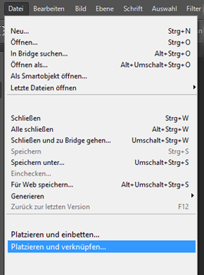

# Verwalten von zusammengesetzten und mehrseitigen Elementen {#managing-compound-assets}

[!DNL Adobe Experience Manager Assets] kann identifizieren, ob eine hochgeladene Datei Verweise auf Assets enthält, die bereits im Repository vorhanden sind. Diese Funktion ist nur für unterstützte Dateiformate verfügbar. Wenn das hochgeladene Asset Verweise auf [!DNL Experience Manager]-Assets enthält, wird eine bidirektionale Verknüpfung zwischen den hochgeladenen und den referenzierten Assets erstellt.

Neben der Eliminierung von Redundanz wird die Zusammenarbeit durch Referenzieren der Elemente in [!DNL Adobe Creative Cloud]-Anwendungen verbessert und die Effizienz und Produktivität der Benutzer erhöht.

[!DNL Experience Manager Assets] unterstützt bidirektionale Verweise. Referenzierte Assets finden Sie auf der Asset-Detailseite der hochgeladenen Datei. Darüber hinaus können Sie die referenzierenden Dateien auf der Seite mit den Asset-Details des referenzierten Assets Ansicht haben.

Referenzen werden auf der Grundlage von Pfad, Dokument-ID und Instanz-ID der referenzierten Assets aufgelöst.

## [!DNL Adobe Illustrator]: hinzufügen digitaler Assets als Referenz  {#refai}

Sie können auf vorhandene digitale Assets in einer [!DNL Adobe Illustrator]-Datei verweisen.

1. Rufen Sie die digitalen Assets mit [[!DNL Experience Manager] Desktop-App](https://experienceleague.adobe.com/docs/experience-manager-desktop-app/using/using.html?lang=de) auf dem lokalen Dateisystem ab. Navigieren Sie zum Dateisystemspeicherort des Assets, auf den Sie verweisen möchten.
1. Ziehen Sie das Asset aus dem lokalen Ordner in die Datei [!DNL Illustrator].

1. Speichern Sie die Datei [!DNL Illustrator] auf dem gemounteten Laufwerk oder [upload](/help/assets/manage-assets.md#uploading-assets) in das [!DNL Experience Manager]-Repository.

1. Nachdem der Workflow abgeschlossen ist, navigieren Sie zur Detailseite für das Asset. Die Verweise auf vorhandene digitale Assets werden unter **[!UICONTROL Abhängigkeiten]** in der Spalte **[!UICONTROL Verweise]** aufgeführt.

   

1. Es ist auch möglich, dass andere Dateien als die aktuelle Datei auf die referenzierten Assets verweisen, die unter **[!UICONTROL Abhängigkeiten]** angezeigt werden. Um eine Liste der referenzierenden Dateien für ein Asset anzuzeigen, klicken Sie unter **[!UICONTROL Abhängigkeiten]** auf das Asset.

   

1. Klicken Sie in der Symbolleiste auf **[!UICONTROL Eigenschaften von Ansichten]**. Auf der Seite [!UICONTROL Properties] wird die Liste der Dateien, die auf das aktuelle Asset verweisen, in der Spalte **[!UICONTROL References]** auf der Registerkarte **[!UICONTROL Basic]** angezeigt.

   

   *Abbildung: Asset-Verweise in den Asset-Details.*

## [!DNL Adobe InDesign]: hinzufügen digitaler Assets als Referenz  {#add-aem-assets-as-references-in-adobe-indesign}

Um auf digitale Assets aus einer [!DNL InDesign]-Datei zu verweisen, ziehen Sie entweder Assets in die Datei [!DNL InDesign] oder exportieren Sie die Datei [!DNL InDesign] als ZIP-Archiv.

Verweisende Assets sind bereits in [!DNL Experience Manager Assets] vorhanden. Sie können Teilassets extrahieren, indem Sie [InDesign Server](indesign.md) konfigurieren. Eingebettete Assets in einer [!DNL InDesign]-Datei werden als Teilassets extrahiert.

>[!NOTE]
>
>Wenn [!DNL InDesign Server] angegeben ist, ist die Vorschau der [!DNL InDesign]-Dateien in ihre XMP-Metadaten eingebettet. In diesem Fall ist die Extraktion von Miniaturen nicht explizit erforderlich. Wenn [!DNL InDesign Server] jedoch nicht proximiert ist, müssen Miniaturansichten explizit für [!DNL InDesign]-Dateien extrahiert werden.

Beim Hochladen einer INDD-Datei werden die Verweise abgerufen, indem Assets mit der Eigenschaft `xmpMM:InstanceID` und `xmpMM:DocumentID` im Repository abgefragt werden.

### Erstellen von Verweisen durch Ziehen von Assets {#create-references-by-dragging-aem-assets}

Dieser Vorgang ähnelt dem Vorgang [Digitale Assets als Referenz in Adobe Illustrator](#refai) hinzufügen.

### Erstellen von Referenzen zu Assets durch Exportieren einer ZIP-Datei {#create-references-to-aem-assets-by-exporting-a-zip-file}

1. Führen Sie die Schritte unter [Workflow-Modelle erstellen](/help/sites-developing/workflows-models.md) aus, um einen neuen Workflow zu erstellen.
1. Verwenden Sie die Paketfunktion [a1/> von [!DNL Adobe InDesign], um das Dokument zu exportieren. ](https://helpx.adobe.com/indesign/how-to/indesign-package-files-for-handoff.html) [!DNL Adobe InDesign] kann ein Dokument und die verknüpften Assets als Paket exportieren. In diesem Fall enthält der exportierte Ordner den Ordner `Links`, der Unterelemente in der Datei [!DNL InDesign] enthält. Der Ordner `Links` befindet sich im selben Ordner wie die INDD-Datei.
1. Erstellen Sie eine ZIP-Datei und laden Sie sie in das [!DNL Experience Manager]-Repository hoch.
1. Beginn des Arbeitsablaufs `Unarchiver`.
1. Nach Abschluss des Workflows werden die Verweise im Ordner &quot;Links&quot;automatisch als Teilassets referenziert. Um eine Liste der referenzierten Assets Ansicht, navigieren Sie zur Asset-Detailseite des Assets [!DNL InDesign] und schließen Sie die Leiste [a2/>.](/help/sites-authoring/basic-handling.md#rail-selector)

## [!DNL Adobe Photoshop]: hinzufügen digitaler Assets als Referenz  {#refps}

1. Verwenden Sie die [!DNL Experience Manager]-Desktop-App, um auf [!DNL Experience Manager Assets] zuzugreifen. Laden Sie die Assets herunter und zeigen Sie sie auf dem lokalen Dateisystem an. Verwenden Sie die Funktion [!UICONTROL Linked] in [!DNL Adobe Photoshop] platzieren. Siehe [Platzieren von Assets in der Desktop-App](https://experienceleague.adobe.com/docs/experience-manager-desktop-app/using/using.html#place-assets-in-native-documents).

   

1. Speichern Sie die Datei in der Datei [!DNL Photoshop] auf dem gemounteten Laufwerk oder [upload](/help/assets/manage-assets.md#uploading-assets) in das [!DNL Experience Manager]-Repository.
1. Nach Abschluss des Workflows werden die Verweise auf vorhandene [!DNL Experience Manager]-Assets auf der Seite mit den Asset-Details aufgelistet.

   Rufen Sie die referenzierten Assets auf, indem Sie die [Leiste](/help/sites-authoring/basic-handling.md#rail-selector) auf der Asset-Detailseite schließen.

1. Die referenzierten Assets enthalten auch die Liste der Assets, von denen sie referenziert werden. Um eine Liste der referenzierten Assets anzuzeigen, navigieren Sie zur Asset-Detailseite und schließen Sie die [Leiste](/help/sites-authoring/basic-handling.md#rail-selector).

>[!NOTE]
>
>Die Assets innerhalb der ebenenübergreifenden Assets können ebenfalls basierend auf ihrer Dokument-ID und ihrer Instanz-ID referenziert werden. Diese Funktion ist nur in den Versionen [!DNL Adobe Illustrator] und [!DNL Adobe Photoshop] verfügbar. Bei anderen erfolgt die Referenzierung auf der Grundlage des relativen Pfads verknüpfter Assets im Hauptverknüpfungsasset, wie in früheren Versionen von [!DNL Experience Manager] ausgeführt.

## Erstellen von Teilassets {#generate-subassets}

Für die unterstützten Assets mit mehrseitigen Formaten — PDF-Dateien, AI-Dateien, [!DNL Microsoft PowerPoint]- und [!DNL Apple Keynote]-Dateien und [!DNL Adobe InDesign]-Dateien — [!DNL Experience Manager] kann Teilassets generieren, die jeder einzelnen Seite des ursprünglichen Assets entsprechen. Diese Teilassets sind mit dem Element *parent* verknüpft und erleichtern die mehrseitige Ansicht. Für alle anderen Zwecke werden die Teilassets wie normale Vermögenswerte in [!DNL Experience Manager] behandelt.

Die Erstellung von Unter-Assets ist standardmäßig deaktiviert. Gehen Sie wie folgt vor, um die Erzeugung von Teilassets zu aktivieren:

1. Melden Sie sich bei [!DNL Experience Manager] als Administrator an. Öffnen Sie **[!UICONTROL Tools]** > **[!UICONTROL Workflow]** > **[!UICONTROL Modelle]**.
1. Wählen Sie den Workflow **[!UICONTROL DAM-Update-Asset]** und klicken Sie auf **[!UICONTROL Bearbeiten]**.
1. Klicken Sie auf **[!UICONTROL Seitliches Bedienfeld]** ein/aus und suchen Sie den Schritt **[!UICONTROL Unterasset]** erstellen. hinzufügen den Schritt zum Workflow. Klicken Sie auf **[!UICONTROL Synchronisieren]**.

Führen Sie zum Generieren der Teilassets einen der folgenden Schritte aus:

* Neue Assets: Der Workflow [!UICONTROL DAM Update Assets] wird für jedes neue Asset ausgeführt, das nach [!DNL Experience Manager] hochgeladen wird. Teilassets werden automatisch für neue mehrseitige Assets generiert.
* Vorhandene mehrseitige Assets: Führen Sie den Workflow [!UICONTROL DAM Update Assets] manuell aus, indem Sie einen der folgenden Schritte ausführen:

   * Wählen Sie ein Asset aus und klicken Sie auf [!UICONTROL Zeitschiene], um das linke Bedienfeld zu öffnen. Verwenden Sie alternativ den Tastaturbefehl `alt + 3`. Klicken Sie auf [!UICONTROL Beginn-Workflow], wählen Sie [!UICONTROL DAM-Update-Asset], klicken Sie auf [!UICONTROL Beginn] und klicken Sie auf [!UICONTROL Fortfahren].
   * Wählen Sie ein Asset aus und klicken Sie in der Symbolleiste auf [!UICONTROL Erstellen] > [!UICONTROL Workflow]. Wählen Sie im Popup-Dialogfeld [!UICONTROL DAM-Update-Asset]-Arbeitsablauf, klicken Sie auf [!UICONTROL Beginn] und klicken Sie auf [!UICONTROL Fortfahren].

Führen Sie insbesondere für Microsoft Word-Dokumente den Arbeitsablauf **[!UICONTROL DAM Parse Word-Dokumente]** aus. Es wird eine `cq:Page`-Komponente aus dem Inhalt des Microsoft Word-Dokuments generiert. Die `cq:Page`-Komponente verweist auf die aus dem Dokument extrahierten Bilder. Diese Bilder werden auch dann extrahiert, wenn die Erstellung von Unter-Assets deaktiviert ist.

## Anzeigen von Unter-Assets {#viewing-subassets}

Die Teilassets werden nur angezeigt, wenn die Teilassets generiert wurden und für das ausgewählte mehrseitige Asset verfügbar sind. Um die generierten Teilassets Ansicht, öffnen Sie das mehrseitige Asset. Klicken Sie im oberen linken Seitenbereich auf  zu öffnen, und klicken Sie in der Liste auf **[!UICONTROL Teilassets]**. Wenn Sie **[!UICONTROL Subassets]** aus der Liste auswählen. Verwenden Sie alternativ den Tastaturbefehl `alt + 5`.

## Anzeigen von Seiten einer mehrseitigen Datei  {#view-pages-of-a-multi-page-file}

Mit der Seitenansichtsfunktion von [!DNL Experience Manager Assets] können Sie eine mehrseitige Datei wie PDF, INDD, PPT, PPTX und AI-Ansicht erstellen. Öffnen Sie ein mehrseitiges Asset und klicken Sie auf **[!UICONTROL Ansichten]** oben links auf der Seite. Der daraufhin geöffnete Seiten-Viewer zeigt die Seiten des Assets und die Steuerelemente zum Durchsuchen und Zoomen der einzelnen Seiten an.

Für [!DNL InDesign] können Sie Seiten mit [!DNL InDesign Server] extrahieren. Wenn die Vorschauen der Seiten während der [!DNL InDesign]-Dateierstellung gespeichert werden, ist [!DNL InDesign Server] für die Extraktion der Seite nicht erforderlich.

Die folgenden Optionen stehen in der Symbolleiste, in der linken Leiste und in den Seiten-Viewer-Steuerelementen zur Verfügung:

* **[!UICONTROL Desktop-]** Aktionen zum Öffnen oder Einblenden eines bestimmten Teilassets mit der  [!DNL Experience Manager] Desktop-App. Erfahren Sie, wie Sie mit der Desktop-App [die Desktop-Aktionen](https://experienceleague.adobe.com/docs/experience-manager-desktop-app/using/using.html?lang=de#desktopactions-v2) konfigurieren, wenn Sie [!DNL Experience Manager] verwenden.

* **[!UICONTROL Mit]** der Option &quot;Eigenschaften&quot;wird die Seite &quot;  Eigenschaften&quot;des jeweiligen Unterassets geöffnet.

* **[!UICONTROL Mit der]** Option &quot;Annotator&quot;können Sie das spezifische Unterelement kommentieren. Die Anmerkungen, die Sie in separaten Teilassets verwenden, werden zusammen erfasst und angezeigt, wenn das übergeordnete Asset zur Ansicht geöffnet wird.

* **[!UICONTROL Die Option &quot;Seitenübersicht&quot;]** zeigt alle Teilassets gleichzeitig an.

* **[!UICONTROL Bei]** der Option &quot;Zeitablauf&quot;in der linken Leiste nach dem Klicken auf   Leiste wird der Dateistream angezeigt.

## Bewährte Verfahren und Einschränkungen {#best-practice-limitation-tips}

* Die Erzeugung von Teilassets kann bei jeder [!DNL Experience Manager]-Bereitstellung sehr ressourcenintensiv sein. Wenn Sie beim Hochladen komplexer Assets Teilassets generieren, fügen Sie den Schritt im DAM-Arbeitsablauf zum Aktualisieren von Assets hinzu. Wenn Sie bei Bedarf Teilassets erstellen, erstellen Sie einen separaten Workflow, um Teilassets zu generieren. Ein dedizierter Arbeitsablauf ermöglicht es Ihnen, die anderen Schritte im DAM Update Asset-Arbeitsablauf zu überspringen und Rechenressourcen zu speichern.

>[!MORELIKETHIS]
>
>* [Verwenden des Adobe Experience Manager-Desktop-Programms](https://experienceleague.adobe.com/docs/experience-manager-desktop-app/using/using.html)
>* [Konfigurieren von Desktop-Aktionen in Adobe Experience Manager](https://experienceleague.adobe.com/docs/experience-manager-desktop-app/using/using.html#desktopactions-v2)
>* [Verknüpfte Smartobjekte in Adobe Photoshop erstellen](https://helpx.adobe.com/photoshop/using/create-smart-objects.html#create-linked-smart-objects)
>* [Platzieren von Grafiken in Adobe InDesign](https://helpx.adobe.com/de/indesign/using/placing-graphics.html)

