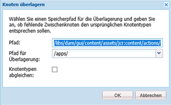
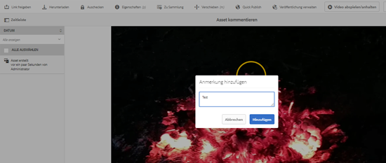
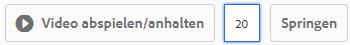
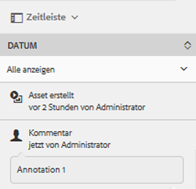

# Verwalten von Video-Assets  {#manage-video-assets}

Das Videoformat ist ein wichtiger Bestandteil der digitalen Assets eines Unternehmens. [!DNL Adobe Experience Manager] bietet ausgereifte Produkte und Funktionen, mit denen Sie den gesamten Lebenszyklus von Video-Assets nach deren Erstellung verwalten können.

Lernen Sie, wie Sie die Video-Assets in [!DNL Adobe Experience Manager Assets] verwalten und bearbeiten. Videokodierung und -transkodierung, z. B. FFmpeg-Transkodierung, ist mit der [!DNL Dynamic Media]-Integration möglich.

## Hochladen und Anzeigen der Vorschau von Video-Assets {#upload-and-preview-video-assets}

[!DNL Adobe Experience Manager Assets] generiert eine Vorschau für Video-Assets mit der Erweiterung MP4. Wenn das Asset nicht im MP4-Format vorliegt, installieren Sie das FFmpeg-Paket, um eine Vorschau zu generieren. FFmpeg erstellt Videodarstellungen vom Typ OGG und MP4. Sie können eine Vorschau dieser Ausgabedarstellungen in der Benutzeroberfläche von [!DNL Assets] anzeigen.

1. Navigieren Sie im Ordner „Digitale Assets“ (oder dessen Unterordnern) zum Speicherort, an dem Sie digitale Assets hinzufügen möchten.
1. Um Assets hochzuladen, klicken Sie in der Symbolleiste auf **[!UICONTROL Erstellen]** und wählen dann **[!UICONTROL Dateien]** aus. Alternativ können Sie eine Datei auf die Benutzeroberfläche ziehen. Weitere Informationen finden Sie unter [Hochladen von Assets](manage-assets.md#uploading-assets).
1. Um ein Video in der Ansicht &quot;Karte&quot;Vorschau, klicken Sie auf die Option **[!UICONTROL Abspielen]**  im Video-Asset. Sie können Videos nur in der Kartenansicht anhalten oder wiedergeben. Die Optionen [!UICONTROL Wiedergabe] und [!UICONTROL Pause] sind in der Listenansicht nicht verfügbar.

1. Um das Video auf der Seite mit den Asset-Details Vorschau, klicken Sie auf der Karte auf **[!UICONTROL Bearbeiten]**. Das Video wird im systemeigenen Video-Player des Browsers wiedergegeben. Sie können das Video wiedergeben und anhalten, die Lautstärke regeln und in den Vollbildmodus wechseln.

   

## Konfiguration zum Hochladen von Assets, die größer als 2 GB sind {#configuration-to-upload-assets-that-are-larger-than-gb}

Standardmäßig können Sie mit [!DNL Assets] keine Assets hochladen, die aufgrund einer Dateigrößenbeschränkung größer als 2 GB sind. Sie können diese Beschränkung aber umgehen, indem Sie CRXDE Lite aufrufen und im Verzeichnis `/apps` einen Knoten erstellen. Der Knoten muss denselben Knotennamen, dieselbe Verzeichnisstruktur und vergleichbare Knoteneigenschaften im Hinblick auf die Reihenfolge aufweisen.

Ändern Sie zusätzlich zur Konfiguration [!DNL Assets] die folgenden Konfigurationen, um große Assets hochzuladen:

* Erhöhen Sie die Ablaufzeit des Tokens. Siehe [!UICONTROL Adobe Granite CSRF Servlet] in der Webkonsole unter `https://[aem_server]:[port]/system/console/configMgr`. Weitere Informationen finden Sie unter [CSRF-Schutz](/help/sites-developing/csrf-protection.md).
* Erhöhen Sie `receiveTimeout` in der Dispatcher-Konfiguration. Weitere Informationen finden Sie unter [Experience Manager Dispatcher-Konfiguration](https://experienceleague.adobe.com/docs/experience-manager-dispatcher/using/configuring/dispatcher-configuration.html#renders-options).

>[!NOTE]
>
>Die Benutzeroberfläche [!DNL Experience Manager] Classic hat keine Beschränkung der Dateigröße von 2 GB. Außerdem werden End-to-End-Workflows für große Videos nicht vollständig unterstützt.

Um eine höhere Dateigrößenbeschränkung zu konfigurieren, führen Sie die folgenden Schritte im Verzeichnis `/apps` aus.

1. Klicken Sie in [!DNL Experience Manager] auf **[!UICONTROL Tools]** > **[!UICONTROL Allgemein]** > **[!UICONTROL CRXDE Lite]**.
1. Navigieren Sie in CRXDE Lite zu `/libs/dam/gui/content/assets/jcr:content/actions/secondary/create/items/fileupload`. Um das Ordnerfenster anzuzeigen, klicken Sie auf `>>`.
1. Klicken Sie in der Symbolleiste auf **[!UICONTROL Überlagerungsknoten]**. Wählen Sie alternativ **[!UICONTROL Überlagerungsknoten]** aus dem Kontextmenü aus.
1. Klicken Sie im Dialogfeld **[!UICONTROL Überlagerungsknoten]** auf **[!UICONTROL OK]**.

   

1. Aktualisieren Sie die Browser-Ansicht. Der Überlagerungsknoten `/apps/dam/gui/content/assets/jcr:content/actions/secondary/create/items/fileupload` ist ausgewählt.
1. Geben Sie auf der Registerkarte **[!UICONTROL Eigenschaften]** den gewünschten Wert in Byte ein, um die maximale Größe festzulegen. Um beispielsweise die Größenbeschränkung auf 30 GB zu erhöhen, geben Sie den Wert `32212254720` ein.

1. Klicken Sie in der Symbolleiste auf **[!UICONTROL Alle speichern]**.
1. Klicken Sie in [!DNL Experience Manager] auf **[!UICONTROL Tools]** > **[!UICONTROL Vorgänge]** > **[!UICONTROL Webkonsole]**.
1. Suchen Sie auf der Seite [!DNL Adobe Experience Manager] [!UICONTROL Webkonsole Bundles] unter der Tabellenspalte &quot;Name&quot;nach **[!UICONTROL Adobe Granite Workflow External Process Job Handler]** und klicken Sie darauf.
1. Stellen Sie auf der Seite [!UICONTROL Adobe Granite Workflow External Process Job Handler] die Sekunden für die Felder **[!UICONTROL Default Timeout]** und **[!UICONTROL Max Timeout]** auf `18000` (fünf Stunden) ein. Klicken Sie auf **[!UICONTROL Speichern]**.
1. Klicken Sie in [!DNL Experience Manager] auf **[!UICONTROL Tools]** > **[!UICONTROL Workflow]** > **[!UICONTROL Modelle]**.
1. Wählen Sie auf der Seite &quot;Workflow-Modelle&quot;die Option **[!UICONTROL Dynamic Media-Kodierungsvideo]** und klicken Sie dann auf **[!UICONTROL Bearbeiten]**.
1. Klicken Sie auf der Seite &quot;Workflow&quot;mit der Dublette auf die Komponente **[!UICONTROL Dynamic Media Video Service Process]**.
1. Erweitern Sie im Dialogfeld [!UICONTROL Schritteigenschaften] auf der Registerkarte **[!UICONTROL Allgemein]** die Option **Erweiterte Einstellungen**.
1. Geben Sie im Feld **[!UICONTROL Timeout]** den Wert `18000` ein und klicken Sie dann auf **[!UICONTROL OK]**, um zur Workflow-Seite **[!UICONTROL Dynamic Media Encode Video]** zurückzukehren.
1. Klicken Sie oben auf der Seite unter dem Seitentitel [!UICONTROL Dynamic Media-Kodierung Video] auf **[!UICONTROL Speichern]**.

## Veröffentlichen von Video-Assets {#publish-video-assets}

Nach der Veröffentlichung können Sie die Video-Assets als URL in eine Web-Seite einbeziehen oder die Assets direkt einbetten. Weitere Informationen finden Sie unter [Veröffentlichen von Dynamic Media-Assets](/help/assets/publishing-dynamicmedia-assets.md).

## Hinzufügen von Anmerkungen zu Video-Assets {#annotate-video-assets}

1. Wählen Sie in der [!DNL Assets]-Konsole auf der Asset-Karte die Option **[!UICONTROL Bearbeiten]**, um die Seite mit den Asset-Details anzuzeigen.
1. Um das Video wiederzugeben, klicken Sie auf **[!UICONTROL Vorschau]**.
1. Um das Video zu kommentieren, klicken Sie auf **[!UICONTROL Kommentieren]**. Zu dem jeweiligen Zeitpunkt (Frame) im Video wird eine Anmerkung hinzugefügt. Beim Hinzufügen von Anmerkungen können Sie auf der Arbeitsfläche zeichnen und einen Kommentar zur Zeichnung aufnehmen. Kommentare werden automatisch gespeichert. Um den Anmerkungsassistenten zu schließen, klicken Sie auf **[!UICONTROL Schließen]**.

   

1. Suchen Sie nach einem bestimmten Punkt im Video, indem Sie die Zeit in Sekunden in das **Textfeld** eingeben und auf **Springen** klicken. Um beispielsweise die ersten 20 Sekunden des Videos zu überspringen, geben Sie „20“ in das Textfeld ein.

   

1. Klicken Sie auf eine Anmerkung, um sie in der Zeitleiste anzuzeigen. Um die Anmerkung aus der Zeitleiste zu löschen, klicken Sie auf **[!UICONTROL Löschen]**.

   

>[!MORELIKETHIS]
>
>* [Digitale Assets in Experience Manager-Assets verwalten](/help/assets/manage-assets.md)
>* [Verwalten von Sammlungen in Experience Manager-Assets](/help/assets/manage-collections.md)
>* [Dokumentation zu Dynamic Media-Videos](/help/assets/video.md).

