# Verwalten von Video-Assets  {#manage-video-assets}

| Version | Artikel-Link |
| -------- | ---------------------------- |
| AEM as a Cloud Service | [Hier klicken](https://experienceleague.adobe.com/docs/experience-manager-cloud-service/content/assets/manage/manage-video-assets.html?lang=de) |
| AEM 6.5 | Dieser Artikel |
| AEM 6.4 | [Hier klicken](https://experienceleague.adobe.com/docs/experience-manager-64/assets/managing/managing-video-assets.html?lang=de) |

Das Videoformat ist ein wichtiger Bestandteil der digitalen Assets eines Unternehmens. [!DNL Adobe Experience Manager] bietet ausgereifte Produkte und Funktionen, mit denen Sie den gesamten Lebenszyklus von Video-Assets nach deren Erstellung verwalten können.

Lernen Sie, wie Sie die Video-Assets in [!DNL Adobe Experience Manager Assets] verwalten und bearbeiten. Videokodierung und -transkodierung, z. B. FFmpeg-Transkodierung, ist mithilfe der [!DNL Dynamic Media]-Integration möglich.

## Hochladen und Anzeigen der Vorschau von Video-Assets {#upload-and-preview-video-assets}

[!DNL Adobe Experience Manager Assets] generiert eine Vorschau für Video-Assets mit der Erweiterung MP4. Wenn das Format des Assets nicht MP4 lautet, installieren Sie das FFmpeg-Pack, um die Vorschau zu generieren. FFmpeg erstellt Video-Ausgabedarstellungen vom Typ OGG und MP4. Sie können eine Vorschau dieser Ausgabedarstellungen in der Benutzeroberfläche von [!DNL Assets] anzeigen.

1. Navigieren Sie im Ordner „Digitale Assets“ (oder dessen Unterordnern) zum Speicherort, an dem Sie digitale Assets hinzufügen möchten.
1. Um Assets hochzuladen, klicken Sie in der Symbolleiste auf **[!UICONTROL Erstellen]** und wählen dann **[!UICONTROL Dateien]** aus. Alternativ können Sie eine Datei auf die Benutzeroberfläche ziehen. Weitere Informationen finden Sie unter [Hochladen von Assets](manage-assets.md#uploading-assets).
1. Rufen Sie die Vorschau eines Videos in der Kartenansicht auf, indem Sie auf die Schaltfläche **[!UICONTROL Wiedergabe]**  im Video-Asset klicken. Sie können Videos nur in der Kartenansicht anhalten oder wiedergeben. Die Optionen [!UICONTROL Wiedergabe] und [!UICONTROL Pause] sind in der Listenansicht nicht verfügbar.

1. Klicken Sie auf der Karte auf **[!UICONTROL Bearbeiten]**, um eine Vorschau des Videos auf der Seite mit Asset-Details anzuzeigen. Das Video wird im systemeigenen Video-Player des Browsers wiedergegeben. Sie können das Video wiedergeben und anhalten, die Lautstärke regeln und in den Vollbildmodus wechseln.

   

## Konfiguration zum Hochladen von Assets, die größer als 2 GB sind {#configuration-to-upload-assets-that-are-larger-than-gb}

Sie können aufgrund einer Größenbeschränkung für Dateien über [!DNL Assets] standardmäßig keine Assets hochladen, die größer als 2 GB sind. Sie können diese Beschränkung aber umgehen, indem Sie CRXDE Lite aufrufen und im Verzeichnis `/apps` einen Knoten erstellen. Der Knoten muss denselben Knotennamen, dieselbe Verzeichnisstruktur und vergleichbare Knoteneigenschaften im Hinblick auf die Reihenfolge aufweisen.

Ändern Sie zusätzlich zur Konfiguration von [!DNL Assets] die folgenden Konfigurationen, um große Assets hochzuladen:

* Erhöhen Sie die Ablaufzeit des Tokens. Siehe [!UICONTROL Adobe Granite CSRF Servlet] in der Web-Konsole unter `https://[aem_server]:[port]/system/console/configMgr`. Weitere Informationen finden Sie unter [CSRF-Schutz](/help/sites-developing/csrf-protection.md).
* Erhöhen Sie `receiveTimeout` in der Dispatcher-Konfiguration. Weitere Informationen finden Sie unter [Experience Manager Dispatcher-Konfiguration](https://experienceleague.adobe.com/docs/experience-manager-dispatcher/using/configuring/dispatcher-configuration.html?lang=de#renders-options).

>[!NOTE]
>
>Die [!DNL Experience Manager] Classic-Benutzeroberfläche hat keine Dateigrößenbeschränkung von 2-GB. Außerdem werden End-to-End-Workflows für große Videos nicht vollständig unterstützt.

Um eine höhere Dateigrößenbeschränkung zu konfigurieren, führen Sie die folgenden Schritte im Verzeichnis `/apps` aus.

1. Klicken Sie in [!DNL Experience Manager] auf **[!UICONTROL Tools]** > **[!UICONTROL Allgemein]** > **[!UICONTROL CRXDE Lite]**.
1. Navigieren Sie in CRXDE Lite zu `/libs/dam/gui/content/assets/jcr:content/actions/secondary/create/items/fileupload`. Um das Verzeichnisfenster anzuzeigen, klicken Sie auf `>>`.
1. Klicken Sie auf der Symbolleiste auf **[!UICONTROL Überlagerungsknoten]**. Wählen Sie alternativ **[!UICONTROL Überlagerungsknoten]** aus dem Kontextmenü aus.
1. Klicken Sie im Dialogfeld **[!UICONTROL Überlagerungsknoten]** auf **[!UICONTROL OK]**.

   

1. Aktualisieren Sie die Browser-Ansicht. Der Überlagerungsknoten `/apps/dam/gui/content/assets/jcr:content/actions/secondary/create/items/fileupload` ist ausgewählt.
1. Geben Sie auf der Registerkarte **[!UICONTROL Eigenschaften]** den gewünschten Wert in Byte ein, um die maximale Größe festzulegen. Um beispielsweise die Größenbeschränkung auf 30 GB zu erhöhen, geben Sie den Wert `32212254720` ein.

1. Klicken Sie auf der Symbolleiste auf **[!UICONTROL Alle speichern]**.
1. Klicken Sie in [!DNL Experience Manager] auf **[!UICONTROL Tools]** > **[!UICONTROL Vorgänge]** > **[!UICONTROL Web-Konsole]**.
1. Suchen Sie auf der Seite [!DNL Adobe Experience Manager] [!UICONTROL Web Console Bundles] unter der Namensspalte der Tabelle nach **[!UICONTROL Adobe Granite Workflow External Process Job Handler]** und klicken Sie darauf.
1. Stellen Sie auf der Seite [!UICONTROL Adobe Granite Workflow External Process Job Handler] die Sekunden für die Felder **[!UICONTROL Timeout-Standardwert]** und **[!UICONTROL Max. Timeout]** auf `18000` (fünf Stunden) ein. Klicken Sie auf **[!UICONTROL Speichern]**.
1. Klicken Sie in [!DNL Experience Manager] auf **[!UICONTROL Tools]** > **[!UICONTROL Workflow]** > **[!UICONTROL Modelle]**.
1. Wählen Sie auf der Seite „Workflow-Modelle“ die Option **[!UICONTROL Dynamic Media-Videokodierung]** aus und klicken Sie auf **[!UICONTROL Bearbeiten]**.
1. Doppelklicken Sie auf der Workflow-Seite auf die Komponente **[!UICONTROL Prozess für Dynamic Media-Videodienst]**.
1. Erweitern Sie im Dialogfeld [!UICONTROL Schritteigenschaften] auf der Registerkarte **[!UICONTROL Allgemein]** die Option **Erweiterte Einstellungen**.
1. Geben Sie im Feld **[!UICONTROL Timeout]** den Wert `18000` an und klicken Sie dann auf **[!UICONTROL OK]**, um zur Workflow-Seite **[!UICONTROL Dynamic Media-Videokodierung]** zurückzukehren.
1. Klicken Sie oben auf der Seite unter dem Seitentitel [!UICONTROL Dynamic Media-Videokodierung] auf **[!UICONTROL Speichern]**.

## Veröffentlichen von Video-Assets {#publish-video-assets}

Nach der Veröffentlichung können Sie die Video-Assets als URL in eine Web-Seite einbeziehen oder die Assets direkt einbetten. Weitere Informationen finden Sie unter [Veröffentlichen von Dynamic Media-Assets](/help/assets/publishing-dynamicmedia-assets.md).

## Veröffentlichen von Videos auf YouTube {#publishing-videos-to-youtube}

Sie können lokale Experience Manager-Video-Assets direkt in einem YouTube-Kanal veröffentlichen, den Sie zuvor erstellt haben.

Um Video-Assets in YouTube zu veröffentlichen, richten Sie Experience Manager-Assets mit Tags ein. Diese Tags verknüpfen Sie mit einem YouTube-Kanal. Wenn das Tag eines Video-Assets mit dem Tag eines YouTube-Kanals übereinstimmt, wird das Video auf YouTube veröffentlicht. Die Veröffentlichung auf YouTube erfolgt neben einer normalen Veröffentlichung des Videos, solange ein entsprechendes Tag verwendet wird.

YouTube verwendet eine eigene Kodierung. Daher wird die ursprüngliche Videodatei, die in Experience Manager hochgeladen wurde, auf YouTube veröffentlicht und nicht das Videoausgabeformat, das durch die Codierung von Dynamic Media erstellt wurde. Die Verarbeitung von Videos mit Dynamic Media ist zwar nicht erforderlich, wird aber für den Fall vorausgesetzt, dass eine Viewer-Vorgabe für die Wiedergabe benötigt wird.

Wenn Sie das Videoverarbeitungsprofil umgehen und Videos direkt auf YouTube veröffentlichen, bedeutet das einfach, dass das Video-Asset in Experience Manager Asset keine anzeigbare Miniatur erhält. Das bedeutet auch, dass nicht kodierte Videos in den Ausführungsmodi `dynamicmedia` oder `dynamicmedia_scene7` nicht mit den Asset-Typen für Dynamic Media funktionieren.

Für das Veröffentlichen von Video-Assets auf YouTube-Video-Servern müssen folgende Aufgaben abgeschlossen werden, um eine sichere Server-zu-Server-Authentifizierung mit YouTube zu erlauben.

1. [Konfigurieren von Google Cloud-Einstellungen](#configuring-google-cloud-settings)
1. [Erstellen eines YouTube-Kanals](#creating-a-youtube-channel)
1. [Hinzufügen von Tags zur Veröffentlichung](#adding-tags-for-publishing)
1. [Aktivieren des Agenten für die YouTube-Veröffentlichungsreplikation](#enabling-the-youtube-publish-replication-agent)
1. [Einrichten von YouTube in Experience Manager](#setting-up-youtube-in-aem)
1. [(Optional) Automatisieren der Einstellung von YouTube-Standardeigenschaften für hochgeladene Videos](#optional-automating-the-setting-of-default-youtube-properties-for-your-uploaded-videos)
1. [Veröffentlichen von Videos in Ihrem YouTube-Kanal](#publishing-videos-to-your-youtube-channel)
1. [(Optional) Überprüfen des auf YouTube veröffentlichten Videos](/help/assets/video.md#optional-verifying-the-published-video-on-youtube)
1. [Verknüpfen von YouTube-URLs mit einer Web-Anwendung](#linking-youtube-urls-to-your-web-application)

Sie können auch [die Veröffentlichung von Videos aufheben, um diese von YouTube zu entfernen](#unpublishing-videos-to-remove-them-from-youtube).

### Konfigurieren von Google Cloud-Einstellungen {#configuring-google-cloud-settings}

Um Inhalte auf YouTube zu veröffentlichen, benötigen Sie ein Google-Konto. Wenn Sie über ein Gmail-Konto verfügen, besitzen Sie bereits ein Google-Konto. Wenn Sie noch nicht über ein Google-Konto verfügen, können Sie einfach eines erstellen. Sie benötigen das Konto, um Anmeldeinformationen für die Veröffentlichung von Video-Assets auf YouTube zu erhalten. Wenn Sie bereits ein Konto erstellt haben, überspringen Sie diese Aufgabe und fahren Sie direkt mit dem [Erstellen eines YouTube-Kanals](#creating-a-youtube-channel) fort.

Das mit Google Cloud verwendete Konto und das für YouTube verwendete Google-Konto müssen nicht übereinstimmen.

Google ändert regelmäßig seine Benutzeroberfläche. Daher können die Schritte zum Veröffentlichen von Videos auf YouTube leicht von der folgenden Dokumentation abweichen. Dieser Hinweis gilt auch für YouTube, wenn Sie prüfen möchten, ob Videos hochgeladen wurden.

>[!NOTE]
>
>Zum Zeitpunkt der Veröffentlichung dieses Artikels waren die folgenden Schritte korrekt. Google aktualisiert jedoch regelmäßig ohne vorherige Ankündigung seine Websites. Daher können die Schritte geringfügig abweichen.

So konfigurieren Sie Google Cloud-Einstellungen:

1. Erstellen Sie ein Google-Konto.
   [https://accounts.google.com/SignUp?service=mail](https://accounts.google.com/SignUp?service=mail)

   Wenn Sie bereits über ein Google-Konto verfügen, können Sie zum nächsten Schritt wechseln.

1. Rufen Sie [https://cloud.google.com/](https://cloud.google.com/) auf.
1. Klicken Sie auf der Google Cloud-Seite rechts oben auf **[!UICONTROL Konsole]**.

   Sie müssen sich möglicherweise mit den Anmeldedaten für Ihr Google-Konto **[!UICONTROL Anmelden]**, um die Option **[!UICONTROL Konsole]** anzuzeigen.

1. Klicken Sie auf der Dashboard-Seite rechts neben **[!UICONTROL Google Cloud Platform]** auf die Dropdown-Liste mit den Projekten, um das Dialogfeld zum Auswählen eines Projekts zu öffnen.
1. Tippen Sie im Dialogfeld zum Auswählen eines Projekts auf **[!UICONTROL Neues Projekt]**.

   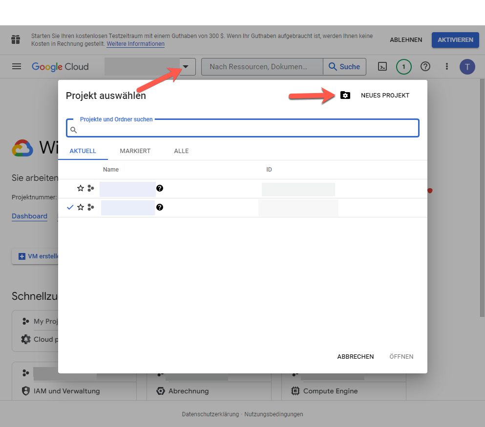

1. Geben Sie im Dialogfeld für das neue Projekt in das Feld für den Projektnamen den Namen Ihres neuen Projekts ein.

   Ihre Projekt-ID basiert auf dem Projektnamen. Wählen Sie daher den Projektnamen sorgfältig. Er kann nach seiner Erstellung nicht geändert werden. Außerdem müssen Sie dieselbe Projekt-ID erneut eingeben, wenn Sie YouTube später in Experience Manager einrichten; denken Sie daran, sie aufzuschreiben.

1. Klicken Sie auf **[!UICONTROL Erstellen]**.

1. Nehmen Sie eine der folgenden Aktionen vor:

   * Tippen Sie im Dashboard Ihres Projekts auf der Karte „Erste Schritte“ auf die Option zum **[!UICONTROL Entdecken und Aktivieren von APIs]**.
   * Tippen Sie im Dashboard Ihres Projekts auf der API-Karte auf die Option zum **[!UICONTROL Aufrufen der API-Übersicht]**.

   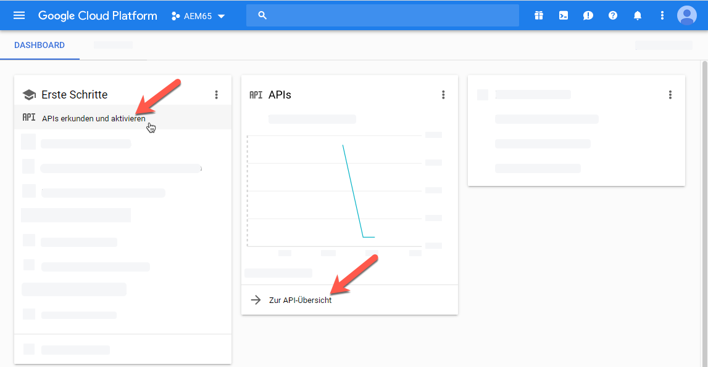

1. Tippen Sie oben auf der Seite mit den APIs und Services auf die Option zum **[!UICONTROL Aktivieren von APIs und Services]**.
1. Tippen Sie in der API-Bibliothek auf der linken Seite unter **[!UICONTROL Kategorie]** auf **[!UICONTROL YouTube]**. Tippen Sie rechts auf der Seite auf **[!UICONTROL YouTube-Daten-API]**.
1. Tippen Sie auf der Seite zur YouTube-Daten-API v3 auf die Option **[!UICONTROL Aktivieren]**.

   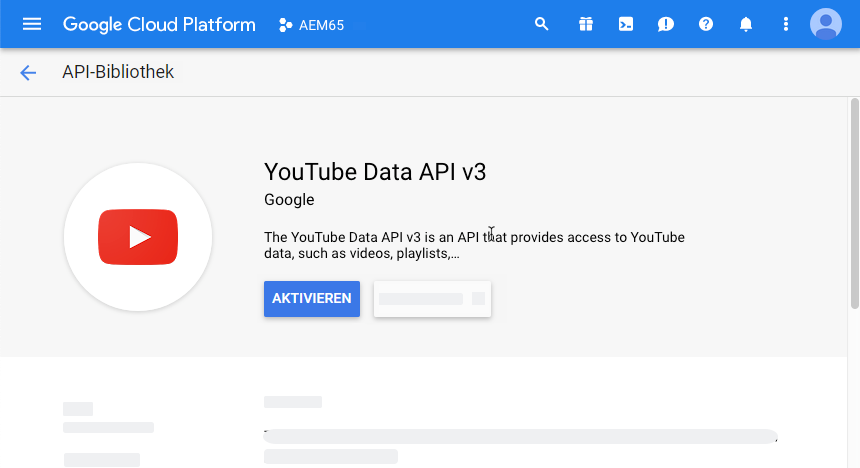

1. Um die API zu verwenden, benötigen Sie Anmeldeinformationen. Klicken Sie bei Bedarf auf **[!UICONTROL Berechtigungen erstellen]**.

   

1. Gehen Sie auf der Seite zum **[!UICONTROL Anmeldedaten zu Projekt hinzufügen]** in Schritt 1 wie folgt vor:

   * Wählen Sie in der Dropdown-Liste **[!UICONTROL Welche API verwenden Sie?]** die Option **[!UICONTROL YouTube Data API v3]**.

   * Wählen Sie aus der Dropdown-Liste **[!UICONTROL Von wo wird die API abgerufen?]** die Option **[!UICONTROL Webserver (z. B. node.js, Tomcat)]**

   * Tippen Sie in der Dropdown-Liste **[!UICONTROL Auf welche Daten wird zugegriffen?]** auf die Option **[!UICONTROL Nutzerdaten]**.

   

1. Tippen Sie auf **[!UICONTROL Welche Anmeldedaten brauche ich?]**
1. Geben Sie auf der Seite **[!UICONTROL Anmeldedaten zu Projekt hinzufügen]** in Schritt 2 unter der Überschrift **[!UICONTROL OAuth 2.0-Client-ID generieren]** im Feld „Name“ ggf. einen eindeutigen Namen ein. Sie können auch den von Google angegebenen Standardnamen verwenden.
1. Geben Sie im Textfeld unter der Überschrift **[!UICONTROL Autorisierte Javascript-Quellen]** den folgenden Pfad ein. Ersetzen Sie Ihre eigene Domain und Port-Nummer im Pfad und drücken Sie die **[!UICONTROL Eingabetaste]**, um den Pfad zur Liste hinzuzufügen:

   `https://<servername.domain>:<port_number>`

   Beispiel: `https://1a2b3c.mycompany.com:4321`

   **Hinweis**: Dieses Pfadbeispiel dient nur zu Veranschaulichungszwecken.

   

1. Geben Sie unter der Überschrift **[!UICONTROL Autorisierte Weiterleitungs-URIs]** im Textfeld den folgenden Pfad ein, ersetzen Sie Ihre eigene Domain und Port-Nummer im Pfad und drücken Sie dann die **[!UICONTROL Eingabetaste]**, um den Pfad der Liste hinzuzufügen:

   `https://<servername.domain>:<port_number>/etc/cloudservices/youtube.youtubecredentialcallback.json`

   Beispiel: `https://1a2b3c.mycompany.com:4321/etc/cloudservices/youtube.youtubecredentialcallback.json`

   **Hinweis**: Dieses Pfadbeispiel dient nur zu Veranschaulichungszwecken.

1. Klicken Sie auf **[!UICONTROL OAuth-Client-ID erstellen]**.
1. Wählen Sie auf der Seite **[!UICONTROL Anmeldeinformationen zu Projekt hinzufügen]** in Schritt 3 unter der Überschrift **[!UICONTROL OAuth 2.0-Einverständnisbildschirm einrichten]** die derzeit verwendete E-Mail-Adresse für Gmail aus.

   

1. Geben Sie unter der Überschrift **[!UICONTROL Benutzern angezeigter Produktname]** im Textfeld ein, was Sie auf der Zustimmungsseite anzeigen möchten.

   Der Einverständnisbildschirm wird Experience Manager-Admins angezeigt, wenn sie sich auf YouTube authentifizieren. Experience Manager kontaktiert YouTube, um die Berechtigung zu erhalten.

1. Klicken Sie auf **[!UICONTROL Weiter]**.
1. Tippen Sie auf der Seite „Anmeldeinformationen zu Ihrem Projekt hinzufügen“ in Schritt 4 unter der Überschrift **[!UICONTROL Anmeldedaten herunterladen]** auf **[!UICONTROL Herunterladen]**.

   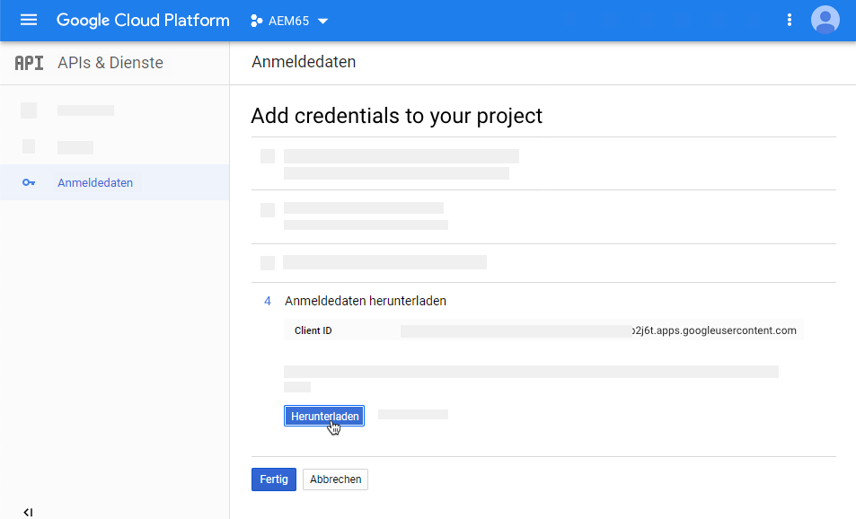

1. Speichern Sie die Datei `client_id.json`.

   Sie benötigen diese heruntergeladene JSON-Datei beim späteren Einrichten von YouTube in Adobe Experience Manager.

1. Klicken Sie auf **[!UICONTROL Fertig]**.

   Melden Sie sich von Ihrem Google-Konto ab. Erstellen Sie jetzt einen YouTube-Kanal.

### Erstellen eines YouTube-Kanals {#creating-a-youtube-channel}

Für das Veröffentlichen von Videos auf YouTube benötigen Sie mindestens einen Kanal. Wenn Sie bereits einen YouTube-Kanal erstellt haben, können Sie diese Aufgabe überspringen und zur Aufgabe [Hinzufügen von Tags für die Veröffentlichung](/help/assets/video.md#adding-tags-for-publishing) wechseln.

>[!WARNING]
>
>Sie müssen mindestens einen Kanal in YouTube eingerichtet haben, *bevor* Sie unter den YouTube-Einstellungen in Experience Manager (siehe [Einrichten von YouTube in Experience Manager](#setting-up-youtube-in-aem) unten) Kanäle hinzufügen. Wenn Sie es versäumen, einen oder mehrere Kanäle einzurichten, werden Sie nicht vor nicht existierenden Kanälen gewarnt. Beim Hinzufügen eines Kanals wird allerdings weiterhin eine Google-Authentifizierung vorgenommen. Es kann jedoch nicht ausgewählt werden, an welchen Kanal das Video gesendet wird.

**So erstellen Sie einen YouTube-Kanal:**

1. Rufen Sie [https://www.youtube.com](https://www.youtube.com/) auf und melden Sie sich mithilfe Ihrer Google-Kontoanmeldeinformationen an.
1. Klicken Sie in der rechten oberen Ecke der YouTube-Seite auf Ihr Profilbild (kann auch als Buchstabe in einem einfarbigen Kreis angezeigt werden). Klicken Sie dann auf **[!UICONTROL YouTube-Einstellungen]** (Zahnradsymbol).
1. Klicken Sie auf der Seite „Überblick“ unter der Überschrift „Zusätzliche Funktionen“ auf **[!UICONTROL Alle meine Kanäle anzeigen oder neuen Kanal erstellen]**.
1. Klicken Sie auf der Seite „Kanal“ auf **[!UICONTROL Neuen Kanal erstellen]**.
1. Geben Sie auf der Seite „Markenkonto“ im Feld „Name Markenkonto“ einen Unternehmensnamen oder den Namen eines anderen beliebigen Kanals ein, in dem Ihre Video-Assets veröffentlicht werden sollen. Klicken Sie dann auf **[!UICONTROL Erstellen]**.

   Merken Sie sich den hier eingegebenen Namen. Sie müssen ihn erneut eingeben, wenn Sie YouTube in Experience Manager einrichten.

1. (Optional) Fügen Sie gegebenenfalls weitere Kanäle hinzu.

   Fügen Sie nun die Tags für die Veröffentlichung hinzu.

### Hinzufügen von Tags zur Veröffentlichung {#adding-tags-for-publishing}

Um Ihre Videos auf YouTube zu veröffentlichen, werden Tags von Experience Manager einem oder mehreren YouTube-Kanälen zugeordnet. Informationen zum Hinzufügen von Tags für die Veröffentlichung finden Sie unter [Verwalten von Tags](/help/sites-administering/tags.md).

Falls Sie die Standard-Tags in Experience Manager verwenden möchten, können Sie diese Aufgabe überspringen und zu [Aktivieren des Agenten für die YouTube-Veröffentlichungsreplikation](#enabling-the-youtube-publish-replication-agent) gehen.

### Aktivieren des Agenten für die YouTube-Veröffentlichungsreplikation {#enabling-the-youtube-publish-replication-agent}

Wenn Sie nach dem Aktivieren des Agenten für die YouTube-Veröffentlichungsreplikation die Verbindung zum Google-Konto testen möchten, tippen Sie auf **[!UICONTROL Verbindung testen]**. Auf einer Browser-Registerkarte werden die Verbindungsergebnisse angezeigt. Wenn Sie YouTube-Kanäle hinzugefügt haben, wird als Teil des Tests eine Liste dieser Kanäle angezeigt.

1. Klicken Sie oben links in Experience Manager auf das Experience Manager-Logo und anschließend in der linken Leiste auf **[!UICONTROL Tools]** > **[!UICONTROL Implementierung]** > **[!UICONTROL Replikation]** > **[!UICONTROL Agenten für Autor]**.
1. Klicken Sie auf der Seite „Agenten für Autor“ auf **[!UICONTROL In Youtube veröffentlichen]**.
1. Klicken Sie auf der Symbolleiste rechts neben den Einstellungen auf **[!UICONTROL Bearbeiten]**.
1. Markieren Sie das Kontrollkästchen **[!UICONTROL Aktiviert]**, um den Replikationsagenten einzuschalten.
1. Klicken Sie auf **[!UICONTROL OK]**.

   Richten Sie jetzt YouTube in Experience Manager ein.

### Einrichten von YouTube in Experience Manager {#setting-up-youtube-in-aem}

Mit Experience Manager 6.4 wurde eine neue Methode für die Touch-Benutzeroberfläche eingeführt, um die YouTube-Veröffentlichung in Experience Manager einzurichten. Führen Sie je nach der installierten Experience Manager-Instanz, die Sie verwenden, einen der folgenden Schritte aus:

* Informationen zum Konfigurieren von YouTube in Experience Manager vor 6.4 finden Sie unter [Einrichten von YouTube in Experience Manager vor 6.4](/help/assets/video.md#setting-up-youtube-in-aem-before).
* Informationen zum Konfigurieren von YouTube in Experience Manager 6.4 oder höher finden Sie im Abschnitt zum [Einrichten von YouTube in Experience Manager 6.4 oder höher](#setting-up-youtube-in-aem-and-later).

#### Einrichten von YouTube in Experience Manager 6.4 oder höher {#setting-up-youtube-in-aem-and-later}

1. Melden Sie sich als Administrator bei Ihrer Dynamic Media-Instanz an.
1. Tippen Sie oben links in Experience Manager auf das Experience Manager-Logo und dann in der linken Leiste auf **[!UICONTROL Tools]** (Hammersymbol) > **[!UICONTROL Cloud Services]** > **[!UICONTROL Konfiguration der YouTube-Veröffentlichung]**.
1. Tippen Sie auf **[!UICONTROL global]** (nicht auswählen).

1. Klicken Sie oben rechts auf der globalen Seite auf **[!UICONTROL Erstellen]**.
1. Geben Sie auf der Seite „YouTube-Veröffentlichungskonfiguration erstellen“ unter „Google Cloud Platform-Einstellungen“ im Feld **[!UICONTROL Anwendungsname]** die Google-Projekt-ID ein.

   Sie haben die Projekt-ID bereits während der Konfiguration der Google Cloud-Einstellungen angegeben.
Lassen Sie die Seite „YouTube-Konfiguration erstellen“ geöffnet, Sie werden gleich zu ihr zurückkehren.

   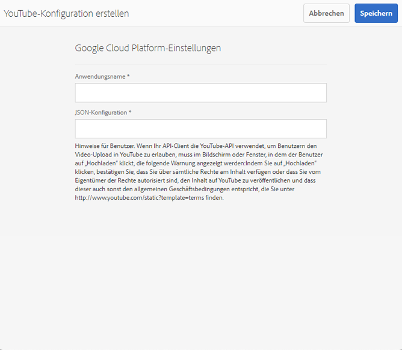

1. Öffnen Sie die in der vorherigen Aufgabe zum [Konfigurieren von Google Cloud-Einstellungen](/help/assets/video.md#configuring-google-cloud-settings) heruntergeladene und gespeicherte JSON-Datei in einem Nur-Text-Editor.
1. Markieren und kopieren Sie den gesamten JSON-Text.
1. Kehren Sie zum Dialogfeld „YouTube-Kontoeinstellungen“ zurück. Fügen Sie im Feld **[!UICONTROL JSON-Konfiguration]** den JSON-Text ein.
1. Tippen Sie oben rechts auf **[!UICONTROL Speichern]**.

   Richten Sie jetzt YouTube-Kanäle in Experience Manager ein.

1. Tippen Sie auf **[!UICONTROL Kanal hinzufügen]**.
1. Geben Sie im Dialogfeld „Kanalname“ den Namen des Kanals ein, den Sie zuvor in der Aufgabe zum **[!UICONTROL Hinzufügen von Kanälen zu YouTube]** erstellt haben.

   Sie können optional eine Beschreibung hinzufügen.

1. Tippen Sie auf **[!UICONTROL Hinzufügen]**.
1. Die YouTube-/Google-Authentifizierung wird angezeigt. Wenn Sie nicht bereits beim Google Cloud-Konto angemeldet sind, überspringen Sie diesen Schritt.

   * Geben Sie den Google-Benutzernamen und das -Kennwort ein, der bzw. das mit der Google-Projekt-ID und dem obigen JSON-Text verknüpft ist.
   * In Abhängigkeit davon, über wie viele Kanäle Ihr Konto verfügt, werden mindestens zwei Elemente angezeigt. Wählen Sie einen Kanal aus. Wählen Sie keine E-Mail-Adresse aus, da es sich hierbei nicht um einen Kanal handelt.
   * Tippen Sie auf der nächsten Seite auf **[!UICONTROL Akzeptieren]**, um Zugriff auf diesen Kanal zu gewähren.

1. Tippen Sie auf **[!UICONTROL Zulassen]**.

   Richten Sie jetzt Tags für die Veröffentlichung ein.

1. **[!UICONTROL Festlegen von Tags für die Veröffentlichung]**: Tippen Sie auf der Seite „Cloud Services“ > „YouTube“ auf das Stiftsymbol, um die Liste der Tags zu bearbeiten, die Sie verwenden möchten.
1. Tippen Sie auf das Symbol der Dropdown-Liste (umgekehrtes Caret-Zeichen), um die Liste der verfügbaren Tags in Experience Manager anzuzeigen.
1. Tippen Sie auf einen oder mehrere Tags, damit Sie sie hinzufügen können.

   Wählen Sie zum Löschen eines von Ihnen hinzugefügten Tags das Tag aus und tippen Sie auf **[!UICONTROL X]**.

1. Wenn Sie alle gewünschten Tags hinzugefügt haben, tippen Sie auf **[!UICONTROL Speichern]**.

   Nun können Sie Videos in Ihrem YouTube-Kanal veröffentlichen.

#### Einrichten von YouTube in Experience Manager vor 6.4 {#setting-up-youtube-in-aem-before}

1. Melden Sie sich als Administrator bei Ihrer Dynamic Media-Instanz an.

1. Tippen Sie in der linken oberen Ecke von Experience Manager auf das Experience Manager-Logo und tippen Sie dann in der linken Leiste auf **[!UICONTROL Tools]** (Hammersymbol) > **[!UICONTROL Implementierung]** > **[!UICONTROL Cloud-Services]**.
1. Tippen Sie unter der Überschrift „Services von Dritten“ unter „YouTube“ auf **[!UICONTROL Jetzt konfigurieren]**.
1. Geben Sie im Dialogfeld „Konfiguration erstellen“ einen Titel (obligatorisch) und einen Namen (optional) in die entsprechenden Felder ein.
1. Tippen Sie auf **[!UICONTROL Erstellen]**.
1. Geben Sie im Dialogfeld „YouTube-Kontoeinstellungen“ im Feld **[!UICONTROL Anwendungsname]** die Google-Projekt-ID ein.

   Sie haben die Projekt-ID bereits während der [Konfiguration der Google Cloud-Einstellungen](/help/assets/video.md#configuring-google-cloud-settings) angegeben.
Lassen Sie das Dialogfeld „YouTube-Kontoeinstellungen“ geöffnet, da Sie gleich zu ihm zurückkehren werden.

1. Öffnen Sie die in der vorherigen Aufgabe zum Konfigurieren von Google Cloud-Einstellungen heruntergeladene und gespeicherte JSON-Datei in einem Nur-Text-Editor.
1. Markieren und kopieren Sie den gesamten JSON-Text.
1. Kehren Sie zum Dialogfeld „YouTube-Kontoeinstellungen“ zurück. Fügen Sie im Feld **[!UICONTROL JSON-Konfiguration]** den JSON-Text ein.
1. Tippen Sie auf **[!UICONTROL OK]**.

   Richten Sie jetzt YouTube-Kanäle in Experience Manager ein.

1. Tippen Sie rechts neben **[!UICONTROL Verfügbare Kanäle]** auf **+** (Pluszeichen).
1. Geben Sie im Dialogfeld „Einstellungen für YouTube-Kanal“ im Feld „Titel“ den Namen des Kanals ein, den Sie zuvor in der Aufgabe **[!UICONTROL Hinzufügen von Kanälen zu YouTube]** erstellt haben.

   Sie können optional eine Beschreibung hinzufügen.

1. Tippen Sie auf **[!UICONTROL OK]**.
1. Die YouTube-/Google-Authentifizierung wird angezeigt. Wenn Sie nicht bereits beim Google Cloud-Konto angemeldet sind, überspringen Sie diesen Schritt.

   * Geben Sie den Google-Benutzernamen und das -Kennwort ein, der bzw. das mit der Google-Projekt-ID und dem obigen JSON-Text verknüpft ist.
   * In Abhängigkeit davon, über wie viele Kanäle Ihr Konto verfügt, werden mindestens zwei Elemente angezeigt. Wählen Sie einen Kanal aus. Wählen Sie keine E-Mail-Adresse aus, da es sich hierbei nicht um einen Kanal handelt.
   * Tippen Sie auf der nächsten Seite auf **[!UICONTROL Akzeptieren]**, um Zugriff auf diesen Kanal zu gewähren.

1. Tippen Sie auf **[!UICONTROL Zulassen]**.

   Richten Sie jetzt Tags für die Veröffentlichung ein.

1. **[!UICONTROL Festlegen von Tags für die Veröffentlichung]**: Tippen Sie auf der Seite „Cloud Services“ > „YouTube“ auf das Stiftsymbol, um die Liste der Tags zu bearbeiten, die Sie verwenden möchten.
1. Tippen Sie auf das Symbol der Dropdown-Liste (umgekehrtes Caret-Zeichen), um die Liste der verfügbaren Tags in Experience Manager anzuzeigen.
1. Tippen Sie auf einen oder mehrere Tags, damit Sie sie hinzufügen können.

   Um ein von Ihnen hinzugefügtes Tag zu löschen, wählen Sie das Tag aus und tippen Sie auf **X**.

1. Wenn Sie alle gewünschten Tags hinzugefügt haben, tippen Sie auf **[!UICONTROL OK]**.

   Nun können Sie Videos in Ihrem YouTube-Kanal veröffentlichen.

### (Optional) Automatisieren der Einstellung von YouTube-Standardeigenschaften für hochgeladene Videos {#optional-automating-the-setting-of-default-youtube-properties-for-your-uploaded-videos}

Optional können Sie die Einstellung von YouTube-Eigenschaften beim Hochladen Ihrer Videos automatisieren, indem Sie ein Metadaten-Verarbeitungsprofil in Experience Manager erstellen.

Um das Metadaten-Verarbeitungsprofil zu erstellen, kopieren Sie zunächst die Werte aus den Feldern **[!UICONTROL Feldbezeichnung]**, **[!UICONTROL Zuordnung zu Eigenschaft]** und **[!UICONTROL Auswahl]**, die alle in den Metadatenschemata für Videos enthalten sind. Anschließend erstellen Sie Ihr YouTube-Metadaten-Verarbeitungsprofil, indem Sie ihm diese Werte hinzufügen.

So automatisieren Sie die Einstellung von YouTube-Standardeigenschaften für hochgeladene Videos:

1. Tippen Sie in der linken oberen Ecke von Experience Manager auf das Experience Manager-Logo und tippen Sie dann in der linken Leiste auf **[!UICONTROL Tools]** (Hammersymbol) > **[!UICONTROL Assets]** > **[!UICONTROL Metadatenschemata]**.
1. Klicken Sie auf **[!UICONTROL Standard]**. (Aktiveren Sie nicht das Auswahlfeld links neben „Standard“.)
1. Markieren Sie auf der Seite **[!UICONTROL Standard]** das Kontrollkästchen links neben **[!UICONTROL Video]** und klicken Sie dann auf **[!UICONTROL Bearbeiten]**.
1. Klicken Sie auf der Seite „Metadatenschema-Editor“ auf die Registerkarte **[!UICONTROL Erweitert]**.
1. Klicken Sie unter der Überschrift „YouTube-Publishing“ auf **[!UICONTROL YouTube-Kategorie]**.
1. Führen Sie auf der Registerkarte **[!UICONTROL Einstellungen]** rechts auf der Seite folgende Schritte aus:

   * Wählen Sie den Wert im Textfeld **[!UICONTROL Zu Eigenschaft zuordnen]** aus und kopieren Sie ihn.
Fügen Sie den kopierten Wert in den geöffneten Texteditor ein. Sie benötigen diesen Wert später, wenn Sie das Metadaten-Verarbeitungsprofil erstellen. Lassen Sie den Texteditor geöffnet.

   * Wählen Sie unter **[!UICONTROL Wahlen]** den Standardwert aus, den Sie verwenden möchten (beispielsweise „Personen und Blogs“ oder „Wissenschaft und Technik“).
Fügen Sie den kopierten Wert in den geöffneten Texteditor ein. Sie benötigen diesen Wert später, wenn Sie das Metadaten-Verarbeitungsprofil erstellen. Lassen Sie den Texteditor geöffnet.

1. Tippen Sie unter der Überschrift „Veröffentlichen auf YouTube“ auf **[!UICONTROL YouTube-Datenschutz]**.
1. Führen Sie auf der Registerkarte **[!UICONTROL Einstellungen]** rechts auf der Seite folgende Schritte aus:

   * Wählen Sie den Wert im Textfeld **[!UICONTROL Zu Eigenschaft zuordnen]** aus und kopieren Sie ihn.
Fügen Sie den kopierten Wert in den geöffneten Texteditor ein. Sie benötigen diesen Wert später, wenn Sie das Metadaten-Verarbeitungsprofil erstellen. Lassen Sie den Texteditor geöffnet.

   * Wählen Sie unter **[!UICONTROL Wahlen]** den Standardwert aus, den Sie verwenden möchten, und kopieren Sie ihn. Beachten Sie, dass unter „Wahlen“ Paare von jeweils zwei Werten vorliegen. Das untere Feld des Wertepaars ist der Standardwert, den Sie kopieren müssen, beispielsweise „Öffentlich“, „Nicht aufgeführt“ oder „Privat“.
Fügen Sie den kopierten Wert in den geöffneten Texteditor ein. Sie benötigen diesen Wert später, wenn Sie das Metadaten-Verarbeitungsprofil erstellen. Lassen Sie den Texteditor geöffnet.

1. Klicken Sie in der rechten oberen Ecke der Seite „Metadatenschema-Editor“ auf **[!UICONTROL Abbrechen]**.
1. Tippen Sie in der linken oberen Ecke von Experience Manager auf das Experience Manager-Logo und tippen Sie dann in der linken Leiste auf **[!UICONTROL Tools]** (Hammersymbol) > **[!UICONTROL Assets]** > **[!UICONTROL Metadatenprofile]**.

1. Klicken Sie auf der Seite „Metadatenprofile“ in der rechten oberen Ecke der Seite auf **[!UICONTROL Erstellen]**.
1. Geben Sie im Dialogfeld „Metadatenprofil hinzufügen“ im Textfeld **[!UICONTROL Profiltitel]** den Namen `YouTube Video` ein. Klicken Sie danach auf **[!UICONTROL Erstellen]**.
1. Klicken Sie auf der Seite „Metadatenprofil-Editor“ auf die Registerkarte **[!UICONTROL Erweitert]**.
1. Fügen Sie die kopierten YouTube-Publishing-Werte dem Profil hinzu, indem Sie folgende Schritte ausführen:

   * Klicken Sie rechts auf der Seite auf die Registerkarte **[!UICONTROL Formular erstellen]**.
   * (Optional) Ziehen Sie die Komponente mit der Beschriftung **[!UICONTROL Bereichs-Kopfzeile]** nach links und legen Sie sie im Formularbereich ab.
   * (Optional) Klicken Sie auf **[!UICONTROL Feldbezeichnung]**, um die Komponente auszuwählen.
   * (Optional) Geben Sie rechts auf der Seite auf der Registerkarte „Einstellungen“ im Textfeld „Feldbezeichnung“ den Text `YouTube Publishing` ein.
   * Klicken Sie auf die Registerkarte **[!UICONTROL Formular erstellen]**. Ziehen Sie dann die Komponente mit der Bezeichnung **[!UICONTROL Mehrwerttext]** und legen Sie sie unter der Überschrift **[!UICONTROL YouTube-Veröffentlichung]** ab, die Sie gerade erstellt haben.

   * Klicken Sie auf **[!UICONTROL Feldbezeichnung]**, sodass die Komponente ausgewählt ist.
   * Fügen Sie die zuvor kopierten YouTube-Publishing-Werte („Feldbezeichnung“ und „Zu Eigenschaft zuordnen“) in die entsprechenden Felder des Formulars ein, das sich rechts auf der Seite „Formular bearbeiten“ auf der Registerkarte „Einstellungen“ befindet. Fügen Sie den Wert für „Wahlen“ in das Feld „Standardwert“ ein.

1. Fügen Sie die kopierten YouTube-Datenschutzwerte dem Profil hinzu, indem Sie folgende Schritte ausführen:

   * Klicken Sie rechts auf der Seite auf die Registerkarte **[!UICONTROL Formular erstellen]**.
   * (Optional) Ziehen Sie die Komponente mit der Beschriftung **[!UICONTROL Bereichs-Kopfzeile]** nach links und legen Sie sie im Formularbereich ab.
   * (Optional) Klicken Sie auf **[!UICONTROL Feldbezeichnung]**, um die Komponente auszuwählen.
   * (Optional) Geben Sie rechts auf der Seite auf der Registerkarte „Einstellungen“ im Textfeld „Feldbezeichnung“ den Text `YouTube Privacy` ein.
   * Klicken Sie auf die Registerkarte **[!UICONTROL Formular erstellen]**. Ziehen Sie dann die Komponente mit der Bezeichnung **[!UICONTROL Mehrwerttext]** und legen Sie sie unter der Überschrift **[!UICONTROL YouTube-Datenschutz]** ab, die Sie gerade erstellt haben.

   * Klicken Sie auf **[!UICONTROL Feldbezeichnung]**, sodass die Komponente ausgewählt ist.
   * Fügen Sie die zuvor kopierten YouTube-Publishing-Werte („Feldbezeichnung“ und „Zu Eigenschaft zuordnen“) in die entsprechenden Felder des Formulars ein, das sich rechts auf der Seite „Formular bearbeiten“ auf der Registerkarte „Einstellungen“ befindet. Fügen Sie den Wert für „Wahlen“ in das Feld „Standardwert“ ein.

1. Klicken Sie oben rechts auf der Seite auf **[!UICONTROL Speichern]**.
1. Wenden Sie das Metadatenprofil für YouTube Publishing auf die Ordner an, in die Sie Videos hochladen möchten. Sie müssen sowohl das Metadatenprofil als auch das Videoprofil festlegen.

   Siehe [Metadatenprofile](/help/assets/metadata-config.md#metadata-profiles) und [Videoprofile](/help/assets/video-profiles.md).

### Veröffentlichen von Videos in Ihrem YouTube-Kanal {#publishing-videos-to-your-youtube-channel}

Nun verknüpfen Sie die Tags, die Sie den Video-Assets zuvor hinzugefügt haben. Dieser Prozess teilt Experience Manager mit, welche Assets in Ihrem YouTube-Kanal veröffentlicht werden sollen.

>[!NOTE]
>
>Bei der Ausführung des Dynamic Media-Scene7-Modus wird Ihr Asset bei der Veröffentlichung nicht automatisch auf YouTube veröffentlicht. Nach der Einrichtung des Scene7-Modus von Dynamic Media stehen zwei Veröffentlichungsoptionen zur Auswahl: **[!UICONTROL Sofort]** oder **[!UICONTROL Bei Aktivierung]**.
>
>**[!UICONTROL Sofort veröffentlichen]** bedeutet, dass das hochgeladene Asset nach dem Synchronisieren mit IPS automatisch im Bereitstellungssystem veröffentlicht wird. Das gilt zwar für Dynamic Media, aber nicht für YouTube. Um auf YouTube zu veröffentlichen, müssen Sie über die Experience Manager-Autorenumgebung veröffentlichen.

>[!NOTE]
>
>Um Inhalte über YouTube zu veröffentlichen, verwendet Experience Manager den Workflow **[!UICONTROL In YouTube veröffentlichen]**, mit dem Sie den Fortschritt überwachen und Fehlerinformationen anzeigen können.
>
>Siehe [Überwachen der Videokodierung und des YouTube-Veröffentlichungs-Fortschritts](#monitoring-video-encoding-and-youtube-publishing-progress).
>
>Ausführlichere Fortschrittsinformation können Sie dem YouTube-Protokoll unter „Replikation“ entnehmen. Beachten Sie allerdings, dass Sie für die Überwachung solcher Informationen einen Administratorzugriff benötigen.

**So veröffentlichen Sie Videos in Ihrem YouTube-Kanal:**

1. Gehen Sie in Experience Manager zu einem Video-Asset, das Sie in Ihrem YouTube-Kanal veröffentlichen möchten.
1. Wählen Sie das Video-Asset aus (das adaptive Videoset).
1. Klicken Sie in der Symbolleiste auf **[!UICONTROL Eigenschaften]**.
1. Klicken Sie auf der Registerkarte „Allgemein“ unter der Überschrift „Metadaten“ rechts neben dem Feld „Tags“ auf **[!UICONTROL Auswahl-Dialogfeld öffnen]**.
1. Navigieren Sie auf der Seite „Tags auswählen“ zu den Tags, die Sie verwenden möchten, und wählen Sie ein oder mehrere Tags aus.

   Denken Sie daran, dass die Tags mit dem YouTube-Kanal verknüpft werden müssen.

1. Klicken Sie oben rechts auf **[!UICONTROL Auswählen]**.
1. Klicken Sie in der rechten oberen Ecke der Seite mit den Videoeigenschaften auf **[!UICONTROL Speichern und schließen]**.
1. Wählen Sie in der Symbolleiste **[!UICONTROL Quick Publish]** aus.

   Weitere Informationen finden Sie im Abschnitt zum [Verwalten von Veröffentlichungen mit Experience Manager Sites](https://experienceleague.adobe.com/docs/experience-manager-learn/sites/page-authoring/publication-management-feature-video-use.html?lang=de).

   Optional können Sie das veröffentlichte Video in Ihrem YouTube-Kanal überprüfen.

### (Optional) Überprüfen des auf YouTube veröffentlichten Videos {#optional-verifying-the-published-video-on-youtube}

Sie können auch den Fortschritt der YouTube-Veröffentlichung (oder des Aufhebens der Veröffentlichung) überwachen.

Siehe [Überwachen der Videokodierung und des YouTube-Veröffentlichungs-Fortschritts](#monitoring-video-encoding-and-youtube-publishing-progress).

Publishing-Zeiten können abhängig von zahlreichen Faktoren erheblich variieren, einschließlich Format des Primärvideos, Dateigröße und Upload-Datenverkehr. Der Publishing-Prozess kann einige Minuten bis zu mehrere Stunden dauern. Außerdem werden Formate mit höherer Auflösung viel langsamer gerendert. Bei 720p und 1080p beispielsweise dauert es sehr viel länger als bei 480p, bis das Video erscheint.

Wenn nach acht Stunden noch immer die Statusmeldung **[!UICONTROL Hochgeladen (Verarbeitung läuft, bitte warten)]** angezeigt wird, entfernen Sie das Video von der Adobe-Website und laden Sie es erneut hoch.

### Verknüpfen von YouTube-URLs mit einer Web-Anwendung {#linking-youtube-urls-to-your-web-application}

Sie können nach dem Veröffentlichen des Videos eine YouTube-URL-Zeichenfolge abrufen, die durch Dynamic Media generiert wird. Wenn Sie die YouTube-URL kopieren, wird sie in der Zwischenablage abgelegt, sodass Sie sie nach Bedarf in Seiten einer Website oder einem Programm einfügen können.

>[!NOTE]
>
>Die YouTube-URL kann erst kopiert werden, wenn Sie das Video-Asset in YouTube veröffentlicht haben.

**So verknüpfen Sie YouTube-URLs mit einer Web-Anwendung:**

1. Navigieren Sie zum *auf YouTube veröffentlichten* Video-Asset, dessen URL Sie kopieren möchten, und wählen Sie es aus.

   Denken Sie daran, dass YouTube-URLs erst kopiert werden können, *nachdem* Sie die Video-Assets in YouTube *veröffentlicht* haben.

1. Klicken Sie in der Symbolleiste auf **[!UICONTROL Eigenschaften]**.
1. Klicken Sie auf die Registerkarte **[!UICONTROL Erweitert]**.
1. Wählen und kopieren Sie unter der Überschrift „YouTube-Veröffentlichung“ in der YouTube-URL-Liste den URL-Text in Ihren Webbrowser, um das Asset in einer Vorschau anzuzeigen oder der Seite mit den Web-Inhalten hinzuzufügen.

### Rückgängigmachen der Veröffentlichung von Videos, damit sie aus YouTube entfernt werden können {#unpublishing-videos-to-remove-them-from-youtube}

Wenn Sie die Veröffentlichung eines Video-Assets in Experience Manager aufheben, wird das Video aus YouTube entfernt.

>[!CAUTION]
>
>Videos, die Sie direkt in YouTube entfernen, erkennt Experience Manager nicht als gelöscht und verhält sich so, als wären sie auf YouTube weiterhin veröffentlicht. Heben Sie die Veröffentlichung von Video-Assets in YouTube immer über Experience Manager auf.

>[!NOTE]
>
>Um Inhalte aus YouTube zu entfernen, verwendet Experience Manager den Workflow **[!UICONTROL Veröffentlichung auf YouTube rückgängig machen]**, mit dem Sie den Fortschritt überwachen und Fehlerinformationen anzeigen können.
>
>Siehe [Überwachen der Videokodierung und des YouTube-Veröffentlichungs-Fortschritts](#monitoring-video-encoding-and-youtube-publishing-progress).

**So heben Sie die Veröffentlichung von Videos auf, um sie aus YouTube zu entfernen:**

1. Navigieren Sie zu den Video-Assets, deren Veröffentlichung in Ihrem YouTube-Kanal Sie aufheben möchten.
1. Wählen Sie in einem Asset-Auswahlmodus eines oder mehrere der veröffentlichten Video-Assets aus.
1. Klicken Sie in der Symbolleiste auf **[!UICONTROL Veröffentlichung verwalten]**. Tippen Sie auf das Drei-Punkte-Symbol (. . . ) in der Symbolleiste, sodass **[!UICONTROL Veröffentlichung verwalten]** geöffnet wird.
1. Klicken Sie auf der Seite „Veröffentlichung verwalten“ auf **[!UICONTROL Veröffentlichung rückgängig machen]**.
1. Tippen Sie oben rechts auf der Seite auf **[!UICONTROL Weiter]**.
1. Klicken Sie oben rechts auf der Seite auf **[!UICONTROL Veröffentlichung rückgängig machen]**.

## Überwachen des Fortschritts von Videokodierung und YouTube-Veröffentlichung {#monitoring-video-encoding-and-youtube-publishing-progress}

Wenn Sie ein neues Video in einen Ordner hochladen, auf den Videokodierung angewendet wird, oder Ihr Video auf YouTube veröffentlichen, können Sie den Fortschritt der Videokodierung/YouTube-Veröffentlichung überwachen. Der tatsächliche Veröffentlichungsfortschritt bei YouTube ist nur über die Protokolle verfügbar. Ein Fehlschlagen oder der Erfolg wird jedoch auf weitere Arten aufgeführt, die im folgenden Verfahren beschrieben werden. Darüber hinaus können Sie in einer E-Mail-Benachrichtigung darüber informiert werden, ob ein Workflow zur YouTube-Veröffentlichung oder Videokodierung abgeschlossen oder unterbrochen wurde.

### Überwachen des Fortschritts {#monitoring-progress}

1. Fortschritt der Videokodierung in Ihrem Asset-Ordner anzeigen:

   * In der Kartenansicht wird der Fortschritt der Videokodierung in Prozent auf dem Asset angezeigt. Falls ein Fehler auftritt, werden diese Informationen ebenfalls für das Asset angezeigt.

   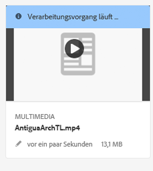

   * In der Listenansicht wird der Fortschritt der Videokodierung in der Spalte **[!UICONTROL Verarbeitungsstatus]** angezeigt. Bei einem Fehler wird die Nachricht in derselben Spalte angezeigt.

   

   Diese Spalte wird standardmäßig nicht angezeigt. Um die Spalte zu aktivieren, wählen Sie aus dem Dropdown-Menü **[!UICONTROL Anzeigeeinstellungen]** und fügen Sie die Spalte **[!UICONTROL Verarbeitungsstatus]** hinzu oder tippen bzw. klicken Sie auf **[!UICONTROL Aktualisieren]**.

   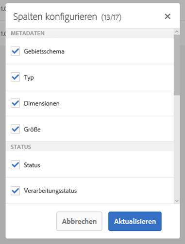

1. Anzeigen des Fortschritts in den Asset-Details. Wenn Sie auf ein Asset tippen oder klicken, öffnen Sie das Dropdown-Menü und wählen Sie die Option **[!UICONTROL Zeitleistensegment]**. Um die Ergebnisse auf Workflow-Aktivitäten wie Kodierung oder YouTube-Veröffentlichung zu begrenzen, wählen Sie **[!UICONTROL Workflows]**.

   

   Workflow-Informationen wie Kodierung werden in der Zeitleiste angezeigt. Bei YouTube-Veröffentlichungen enthält die Workflow-Zeitleistensegment auch den Namen des YouTube-Kanals und die URL zum YouTube-Video. In der Workflow-Zeitleistensegment werden Sie nach der Veröffentlichung auch über eventuelle Fehler benachrichtigt.

   >[!NOTE]
   >
   >Die endgültige Aufzeichnung von Fehlschlag-/Fehlernachrichten kann länger dauern, da für **[!UICONTROL Wiederholungen]**, **[!UICONTROL Wiederholungsverzögerung]** und **[!UICONTROL Zeitüberschreitung]** unter [https://localhost:4502/system/console/configMgr](https://localhost:4502/system/console/configMgr) mehrere Workflow-Konfigurationen vorliegen, beispielsweise:
   >
   >    * Konfiguration der Warteschlange für Apache Sling-Aufträge
   >    * Handler für externe Prozessaufträge im Adobe Granite-Workflow
   >    * Granite-Workflow – Zeitlimit-Warteschlange
   >
   >In diesen Konfigurationen können Sie die Eigenschaften für **[!UICONTROL Wiederholungen]**, **[!UICONTROL Wiederholungsverzögerung]** und **[!UICONTROL Zeitüberschreitung]** anpassen.

1. Informationen zu gestarteten Workflows finden Sie anhand der Workflow-Instanzen unter **[!UICONTROL Tools]** > **[!UICONTROL Workflow]** > **[!UICONTROL Instanzen]**.

   >[!NOTE]
   >
   >Sie benötigen Administratorrechte, um auf das Menü **[!UICONTROL Tools]** zugreifen zu können.

   

   Wählen Sie die Instanz aus und tippen Sie auf **[!UICONTROL Verlauf öffnen]**.

   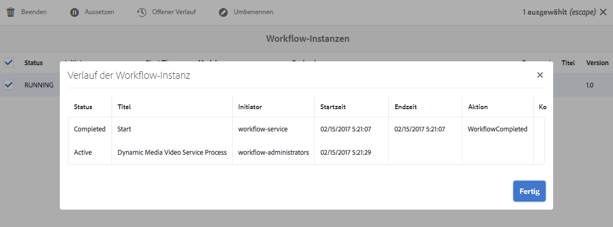

   Im Bereich „Workflow-Instanzen“ können Sie Workflows auch aussetzen, beenden oder umbenennen. Weitere Informationen finden Sie unter [Workflows verwalten](/help/sites-administering/workflows-administering.md).

1. Fehlgeschlagene Aufträge finden Sie unter „Workflowfehler“ unter **[!UICONTROL Tools]** > **[!UICONTROL Workflow]** > **[!UICONTROL Fehler]**. Unter **[!UICONTROL Workflowfehler]** werden alle fehlgeschlagenen Workflowaktivitäten aufgelistet.

   >[!NOTE]
   >
   >Sie benötigen Administratorrechte, um auf das Menü **[!UICONTROL Tools]** zugreifen zu können.

   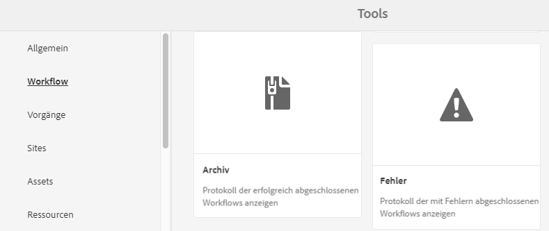

   >[!NOTE]
   >
   >Die endgültige Aufzeichnung von Fehlernachrichten kann länger dauern, da für **[!UICONTROL Wiederholungen]**, **[!UICONTROL Wiederholungsverzögerung]** und **[!UICONTROL Zeitüberschreitung]** unter [https://localhost:4502/system/console/configMgr](https://localhost:4502/system/console/configMgr) mehrere Workflow-Konfigurationen vorliegen, beispielsweise:
   >
   >
   >
   >    * Konfiguration der Warteschlange für Apache Sling-Aufträge
   >    * Handler für externe Prozessaufträge im Adobe Granite-Workflow
   >    * Granite-Workflow – Zeitlimit-Warteschlange
   >
   >
   >In diesen Konfigurationen können Sie die Eigenschaften für **[!UICONTROL Wiederholungen]**, **[!UICONTROL Wiederholungsverzögerung]** und **[!UICONTROL Zeitüberschreitung]** anpassen.

1. Informationen zu abgeschlossenen Workflows finden Sie im Workflow-Archiv, das unter **[!UICONTROL Tools]** > **[!UICONTROL Workflow]** > **[!UICONTROL Archiv]** zur Verfügung steht. Im **[!UICONTROL Workflow-Archiv]** sind alle abgeschlossenen Workflow-Aktivitäten aufgeführt.

   >[!NOTE]
   >
   >Sie benötigen Administratorrechte, um auf das Menü **[!UICONTROL Tools]** zugreifen zu können.

   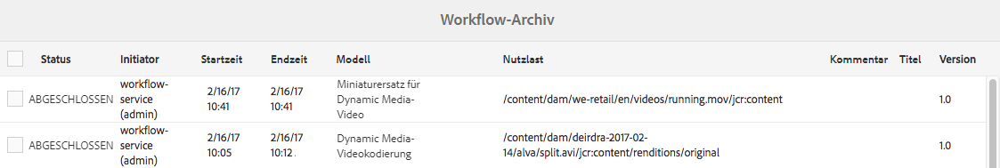

1. Sie erhalten E-Mail-Benachrichtigungen über abgebrochene oder fehlgeschlagene Workflow-Aufträge. Diese E-Mail-Benachrichtigungen können von einem Administrator konfiguriert werden. Siehe [Konfigurieren von E-Mail-Benachrichtigungen](#configuring-e-mail-notifications).

#### Konfigurieren von E-Mail-Benachrichtigungen {#configuring-e-mail-notifications}

>[!NOTE]
>
>Sie benötigen Administratorrechte, um auf das Menü **[!UICONTROL Tools]** zugreifen zu können.

Wie Sie Benachrichtigungen konfigurieren, hängt davon ab, ob Sie Benachrichtigungen für Kodierungs- oder YouTube-Veröffentlichungsaufträge benötigen:

* Kodierungsaufträge: Sie können unter **[!UICONTROL Tools]** > **[!UICONTROL Vorgänge]** > **[!UICONTROL Webkonsole]** auf die Konfigurationsseite für alle Experience Manager-Workflows zugreifen – und indem Sie nach **[!UICONTROL E-Mail-Benachrichtigungsservice für Day CQ-Workflow]** suchen. Siehe [Konfigurieren der E-Mail-Benachrichtigung in Experience Manager](/help/sites-administering/notification.md). Sie können die Kontrollkästchen **[!UICONTROL Bei Abbruch benachrichtigen]** oder **[!UICONTROL Bei Abschluss benachrichtigen]** entsprechend aktivieren oder deaktivieren.

* Gehen Sie bei YouTube-Veröffentlichungsaufträgen wie folgt vor:

1. Tippen Sie in Experience Manager auf **[!UICONTROL Tools]** > **[!UICONTROL Workflow]** > **[!UICONTROL Modelle]**.
1. Wählen Sie auf der Seite zu den Workflow-Modellen die Option **[!UICONTROL In YouTube veröffentlichen]** und tippen Sie dann auf **[!UICONTROL Bearbeiten]** in der Symbolleiste.
1. Tippen Sie in der rechten oberen Ecke der Workflow-Seite „In YouTube veröffentlichen“ auf **[!UICONTROL Bearbeiten]**.
1. Zeigen Sie mit der Maus auf die Komponente für den YouTube-Upload und tippen Sie einmal, um die Inline-Symbolleiste anzuzeigen.

   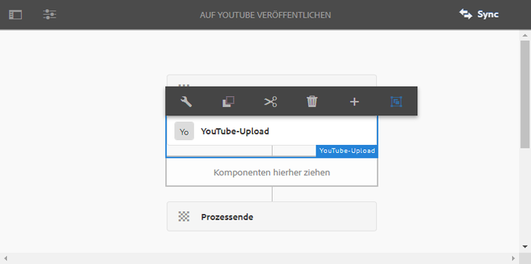

1. Tippen Sie auf der Inline-Symbolleiste auf das Konfigurationssymbol (Schraubschlüssel). Klicken Sie auf die Registerkarte **[!UICONTROL Argumente.]**

   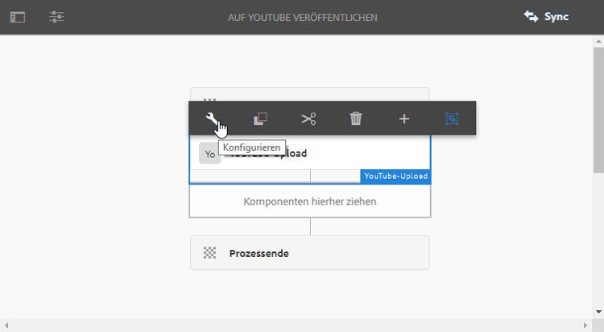

1. Tippen Sie im Dialogfeld „YouTube-Upload-Prozess – Schritteigenschaften“ auf die Registerkarte **[!UICONTROL Argumente]**.

   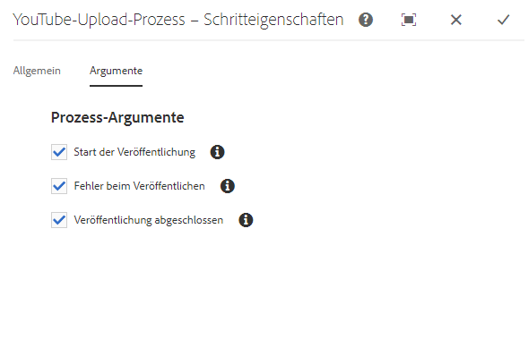

1. Sie können die folgenden Kontrollkästchen aktivieren oder deaktivieren:

   * Start der Veröffentlichung
   * Fehler beim Veröffentlichen
   * Abschluss der Veröffentlichung – enthält Informationen zu Kanälen und URLs

   Wenn Sie ein Kontrollkästchen deaktivieren, erhalten Sie die angegebene E-Mail-Benachrichtigung vom Workflow „YouTube-Veröffentlichung“ nicht.

   >[!NOTE]
   >
   >Diese E-Mails sind für YouTube spezifisch und eine Ergänzung der generischen Workflow-E-Mail-Benachrichtigungen. Sie können daher je nach den Konfigurationseinstellungen zwei E-Mail-Benachrichtigungen erhalten – die im **[!UICONTROL E-Mail-Benachrichtigungsservice Day CQ-Workflow]** verfügbare generische Benachrichtigung und eine für YouTube spezifische Benachrichtigung.

1. Wenn Sie fertig sind, tippen Sie oben rechts im Dialogfeld auf das Symbol **[!UICONTROL Fertig]** (Häkchensymbol).
1. Tippen Sie auf der Workflow-Seite „Auf YouTube veröffentlichen“ auf **[!UICONTROL Synchronisieren]**.

## Hinzufügen von Anmerkungen zu Video-Assets {#annotate-video-assets}

1. Wählen Sie in der [!DNL Assets]-Konsole auf der Asset-Karte die Option **[!UICONTROL Bearbeiten]**, um die Seite mit den Asset-Details anzuzeigen.
1. Um das Video wiederzugeben, klicken Sie auf **[!UICONTROL Vorschau]**.
1. Um das Video zu kommentieren, klicken Sie auf **[!UICONTROL Kommentieren]**. Zu dem jeweiligen Zeitpunkt (Frame) im Video wird eine Anmerkung hinzugefügt. Beim Hinzufügen von Anmerkungen können Sie auf der Arbeitsfläche zeichnen und einen Kommentar zur Zeichnung aufnehmen. Kommentare werden automatisch gespeichert. Um den Anmerkungsassistenten zu schließen, klicken Sie auf **[!UICONTROL Schließen]**.

   

1. Suchen Sie nach einem bestimmten Punkt im Video, indem Sie die Zeit in Sekunden in das **Textfeld** eingeben und auf **Springen** klicken. Um beispielsweise die ersten 20 Sekunden des Videos zu überspringen, geben Sie „20“ in das Textfeld ein.

   

1. Klicken Sie auf eine Anmerkung, um sie in der Zeitleiste anzuzeigen. Um die Anmerkung aus der Zeitleiste zu löschen, klicken Sie auf **[!UICONTROL Löschen]**.

   

>[!MORELIKETHIS]
>
>* [Verwalten digitaler Assets in Experience Manager Assets](/help/assets/manage-assets.md)
>* [Verwalten von Sammlungen in Experience Manager Assets](/help/assets/manage-collections.md)
>* [Dokumentation zu Dynamic Media-Videos](/help/assets/video.md).

