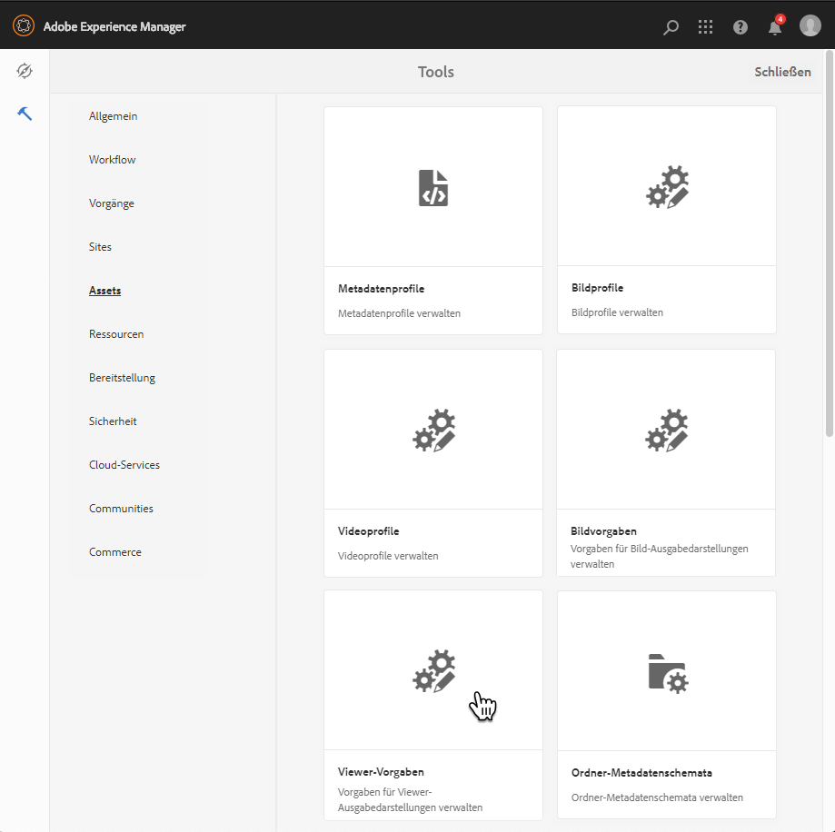
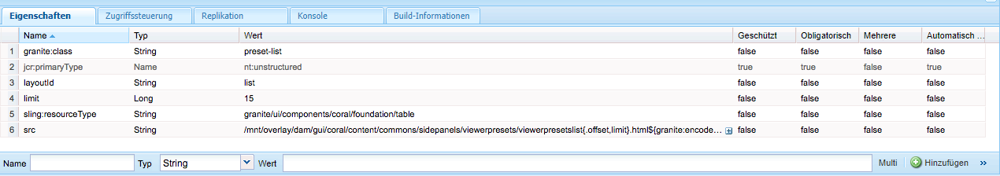
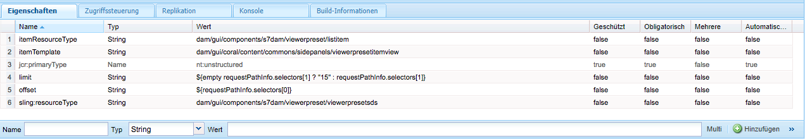
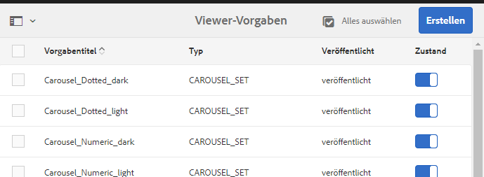

# Verwalten von Viewer-Vorgaben{#managing-viewer-presets}

Eine Viewer-Vorgabe ist eine Sammlung aus Einstellungen, die bestimmen, wie Benutzer Rich-Media-Assets auf ihren Computer-Bildschirmen und Mobilgeräten anzeigen. Viewer-Vorgaben können von Administratoren erstellt werden. Einstellungen sind für eine Vielzahl an Viewer-Konfigurationsoptionen verfügbar. Sie können beispielsweise die Viewer-Anzeigegröße oder das Zoom-Verhalten ändern.

Anweisungen zum Erstellen und Anpassen Ihrer eigenen HTML5-Viewer-Vorgaben finden Sie in der Adobe Dynamic Media *HTML5 Viewer SDK API Documentation*. Das SDK ist auf dem im SDK eingebetteten IS-Veröffentlichungsserver verfügbar. Jede Bibliotheksversion verfügt über eine eigene SDK-Dokumentation.

Pfad: `<scene7_domain>/s7sdk/<library_version>/docs/jsdocs/index.html`.\
Beispiel: 3.10 SDK: [https://s7d1.scene7.com/s7sdk/3.10/docs/jsdoc/index.html](https://s7d1.scene7.com/s7sdk/3.10/docs/jsdoc/index.html)

Weitere Informationen finden Sie im [Adobe Dynamic Media Viewers Reference Guide](https://experienceleague.adobe.com/docs/dynamic-media-developer-resources.html?lang=de).

In diesem Abschnitt wird beschrieben, wie Viewer-Vorgaben erstellt, bearbeitet und verwaltet werden. Sie können jederzeit bei der Vorschau eines Assets eine Viewer-Vorgabe darauf anwenden. Siehe [Anwenden von Viewer-Vorgaben](#applying-a-viewer-preset-to-an-asset).

>[!NOTE]
>
>Die Bearbeitung von *vordefinierten, standardmäßig vorhandenen Viewer-Vorgaben* wird als Szenario nicht unterstützt. Wenn Sie versuchen, eine standardmäßig vorhandene Viewer-Vorgabe zu bearbeiten, werden Sie aufgefordert, die Viewer-Vorgabe unter einem neuen Namen zu speichern.

## Möglichkeit des Zugriffs auf die Tastatur im Viewer {#keyboard-accessibility-for-viewers}

Alle standardmäßigen Viewer unterstützen den Zugriff auf die Tastatur.

Weitere Informationen finden Sie unter [Tastaturzugriff und Navigation](https://experienceleague.adobe.com/docs/dynamic-media-developer-resources/library/c-keyboard-accessibility.html?lang=de).

## Verwalten von Viewer-Vorgaben {#managing-viewer-presets-1}

Sie können Viewer-Vorgaben in Adobe Experience Manager hinzufügen, bearbeiten, löschen, veröffentlichen sowie Veröffentlichungen aufheben und eine Vorschau anzeigen, indem Sie **[!UICONTROL Tools]** (Hammersymbol) > **[!UICONTROL Assets]** > **[!UICONTROL Viewer-Vorgaben]** auswählen.

>[!NOTE]
>
>Standardmäßig zeigt das System 15 Viewer-Vorgaben, wenn Sie in einer Detailansicht eines Assets „Viewer“ auswählen. Sie können diese Grenze erhöhen. Siehe [Erhöhen der Anzahl angezeigter Viewer-Vorgaben](#increasing-the-number-of-viewer-presets-that-display).

### Viewer-Unterstützung für Web-Seiten mit responsivem Design {#viewer-support-for-responsive-designed-web-pages}

Unterschiedliche Web-Seiten haben unterschiedliche Anforderungen. Mitunter möchten Sie vielleicht, dass eine Web-Seite über einen Link verfügt, der den HTML5-Viewer in einem separaten Browser-Fenster öffnet. In anderen Fällen kann es aber auch erforderlich sein, den HTML5-Viewer direkt auf der Host-Seite einzubetten. In letzterem Fall kann die Web-Seite ein statisches Layout aufweisen. Oder sie kann „responsiv“ sein und auf verschiedenen Geräten oder bei verschieden großen Browser-Fenstern anders angezeigt werden. Um all diese Anforderungen zu berücksichtigen, unterstützen sämtliche vordefinierten, standardmäßig vorhandenen HTML5-Viewer, die mit Dynamic Media bereitgestellt werden, sowohl statische als auch responsive Web-Seiten.

Weitere Informationen zum Einbetten responsiver Viewer auf Webseiten finden Sie unter [Bibliothek responsiver Bilder](https://experienceleague.adobe.com/docs/dynamic-media-developer-resources/image-serving-api/image-serving-api/responsive-static-image-library/c-about-responsive-static-image-library.html?lang=de) .

>[!NOTE]
>
>Sie müssen zunächst alle standardmäßig vorhandenen Viewer veröffentlichen, um sie verwenden zu können.
>Siehe [Veröffentlichen von Viewer-Vorgaben].(#publishing-viewer-presets)

### Systemkompatibilität der Viewer-Vorgaben  {#viewer-preset-system-compatibility}

Alle standardmäßig vorhandenen Viewer-Vorgaben, die mit Dynamic Media bereitgestellt werden, sind mit den folgenden Systemen vollständig kompatibel:

* Desktops
* Apple iPhones
* Apple iPads
* Android™-Smartphone
* Android™-Tablet
* Video: Zusätzliche Unterstützung für die MP4-Wiedergabe für [BlackBerry®](https://developer.blackberry.com/devzone/develop/supported_media/bb_media_support_at_a_glance.html#kba1328730952678) und [Windows Phone](https://docs.microsoft.com/en-us/windows/uwp/audio-video-camera/supported-codecs).

### Rich-Media-Typen für Viewer-Vorgaben {#rich-media-types-for-viewer-presets}

Administratoren können bei der Erstellung von Viewer-Vorgaben die folgenden Rich-Media-Typen hinzufügen und anpassen.

<table>
 <tbody>
  <tr>
   <td><strong>Karussellset</strong>  </td>
   <td>
Hotspots, Imagemaps oder beide werden zu einer Serie von mindestens zwei Bildern hinzugefügt. Ein Kunde kann die Bilder nach links oder rechts schwenken und dann einen Hotspot auf einem Bild auswählen, um zusätzliche Details zu erhalten oder direkt über die Kategorie, Startseite oder Landingpages einer Website zu kaufen.
 </td>
  </tr>
  <tr>
   <td><strong>Dimensional</strong>  </td>
   <td>
Zeigt 3D-Szenen an, mit denen Sie Ihre Kamera drehen, schwenken, zoomen oder neu zentrieren können.
 </td>
  </tr>
  <tr>
   <td><strong>Flyout-Zoom</strong></td>
   <td>
Zeigt ein zweites Bild des vergrößerten Bereichs neben dem Originalbild an. Dafür gibt es keine Steuerelemente. Benutzer verschieben die Auswahl auf den gewünschten Bereich.
 
Bei der Bestimmung der vollständigen Bandbreitenauslastung für diesen Viewer müssen Sie berücksichtigen, dass sowohl das Hauptbild als auch das Flyout-Bild im Viewer verarbeitet werden. Die Größe des Hauptbildes (Anzeigenbreite und -höhe) und der Zoomfaktor bestimmen die Größe des Flyout-Bildes. Sie müssen ein Gleichgewicht zwischen diesen beiden Werten schaffen, um zu verhindern, dass die Flyout-Datei zu groß wird: Wenn das Hauptbild sehr groß ist, reduzieren Sie den Zoomfaktor-Wert. (Die Flyout-Breite und Flyout-Höhe bestimmen die Größe des Flyout-Fensters, aber nicht die Größe des Flyout-Bildes, das im Viewer verarbeitet wird.)
 
Beispiel: Wenn das Hauptbild eine Größe von 350 x 350 Pixel und einen Zoomfaktor von 3 aufweist, hat das resultierende Flyout-Bild eine Größe von 1050 x 1050 Pixel. Wenn das Hauptbild eine Größe von 300 x 300 Pixel und einen Zoomfaktor von 4 aufweist, hat das Flyout-Bild eine Größe von 1200 x 1200 Pixel. Abhängig von der JPEG-Qualitätseinstellung (empfohlene Einstellungen liegen zwischen 80 und 90) können Sie die Dateigröße erheblich reduzieren. Als Zoomfaktor wird ein Wert zwischen 2,5 und 4 empfohlen, je nach Größe des Hauptbildes.
 </td>
  </tr>
  <tr>
   <td><strong>Inline-Zoom</strong></td>
   <td>Zeigt ein Bild des hereingezoomten Bereichs im ursprünglichen Viewer an. Es stehen keinerlei Steuerelemente zur Verfügung. Benutzer verschieben vielmehr die Auswahl über den Bereich, der angezeigt werden soll.</td>
  </tr>
  <tr>
   <td><strong>Bildset</strong></td>
   <td>Im Bildset-Viewer können Benutzer verschiedene Ansichten oder Farbvarianten eines Elements sehen, indem sie eine Miniaturansicht auswählen. Dieser Viewer bietet auch Zoomtools, mit denen Bilder genauer untersucht werden können.</td>
  </tr>
  <tr>
   <td><strong>Interaktives Bild</strong></td>
   <td>Hotspots werden zu Teilen eines Bildes hinzugefügt, die ein Kunde dann für zusätzliche Details oder zum direkten Kauf über die Kategorie einer Website, über die Startseite oder Landingpages auswählen kann.</td>
  </tr>
  <tr>
   <td><strong>Interaktives Video</strong></td>
   <td>Miniaturansichten werden zu Zeitleistensegmenten in einem Video hinzugefügt, die ein Kunde dann für zusätzliche Details oder zum direkten Kauf über die Kategorie einer Website, über die Startseite oder Landingpages auswählen kann.</td>
  </tr>
  <tr>
   <td><strong>Gemischte Medien</strong></td>
   <td>Zeigt unterschiedliche Medientypen in einem Viewer an. Dort können Sie Rotationssets, Bildsets, Bilder und Videos aufnehmen.</td>
  </tr>
  <tr>
   <td><strong>Panoramabild</strong></td>
   <td>
Die Viewer für Panoramabilder und PanoramicVR geben Kugelpanoramen wieder, um Benutzern ein 360°-Betrachtererlebnis eines Zimmers, einer Immobilie, eines Orts oder einer Landschaft zu bieten.
 
Damit ein hochgeladenes Bild als Kugelpanorama gilt, muss mindestens eine der beiden folgenden Eigenschaften zutreffen:

    <ul>
     <li>Ein Seitenverhältnis von 2:1.</li>
     <li>Mit den Keywords <code>equirectangular</code> oder <code>spherical</code> und <code>panorama</code> oder <code>spherical </code> und <code>panoramic</code> als Tags versehen. Weitere Informationen finden Sie unter <a href="/help/sites-authoring/tags.md">Verwenden von Tags</a>.</li>
    </ul> 
Die Kriterien für das Seitenverhältnis sowie die Keywords gelten für Panorama-Assets für die Asset-Detailseite und die WCM-Komponente „Panoramamedien“.
 
<strong>Wichtig:</strong> Dieser Viewer ist nur im Scene7-Modus von Dynamic Media verfügbar.
 </td>
  </tr>
  <tr>
   <td><strong>Smartes Zuschneiden von Videos</strong>  </td>
   <td>
Verwenden Sie diesen Viewer, um den Fokus in einem Videos automatisch zu erkennen und das Video entsprechend zuzuschneiden.
 </td>
  </tr>
  <tr>
   <td><strong>Rotationsset</strong></td>
   <td>Stellt mehrere Ansichten eines Bildes bereit, sodass Benutzer den Gegenstand drehen können, um ihn von allen Seiten zu betrachten.</td>
  </tr>
  <tr>
   <td><strong>360-Grad-Video</strong></td>
   <td>
Verwenden Sie den 360/VR-Video-Viewer, um ein Panoramavideo für eine interaktive Anzeige eines Raums, einer Eigenschaft, eines Standorts, einer Landschaft oder eines medizinischen Verfahrens zu rendern.
 
Während der Wiedergabe auf einer flachen Anzeige hat der Benutzer die Kontrolle über den Anzeigewinkel. Die Wiedergabe auf Mobilgeräten wendet in der Regel die integrierten gyroskopischen Steuerelemente an.
 
Der Viewer bietet native Unterstützung für die Bereitstellung von 360-Grad-Video-Assets. Standardmäßig ist keine weitere Konfiguration für die Anzeige oder die Wiedergabe erforderlich. 360-Grad-Videos werden mit Standardvideoerweiterungen wie .mp4, .mkv und .mov bereitgestellt. Der am häufigsten verwendete Codec ist H.264.
 
<strong>Wichtig:</strong> Dieser Viewer ist nur im Scene7-Modus von Dynamic Media verfügbar.
 </td>
  </tr>
  <tr>
   <td><strong>Video</strong></td>
   <td>
Wiedergeben von Videos unter Verwendung des progressiven oder adaptiven Bitraten-Streamings. Beim Streaming mit adaptiver Bitrate wird eine automatische Geräte- und Brandbreitenerkennung durchgeführt, um Videos mit der richtigen Qualität und im richtigen Format bereitzustellen.
 </td>
  </tr>
  <tr>
   <td><strong>Vertikaler Zoom</strong></td>
   <td>
Mit dem Viewer für vertikalen Zoom können Sie das Betrachtererlebnis für Produktbilder optimieren, um Ihren Benutzern die bestmögliche Darstellung eines Produktes zu bieten. Die vertikale Positionierung von Farbfeldern:

    <ul>
     <li>Stellt sicher, dass sich Farbfelder „oberhalb der Falte“ befinden.  Bei horizontalen Farbfeldern sind sie je nach Bildschirmgröße des Benutzers auf dem Desktop erst sichtbar, wenn der Benutzer einen Bildlauf auf der Seite nach unten durchführt. Wenn die Farbfelder vertikal im Viewer platziert werden, sind sie unabhängig von der Bildschirmgröße des Benutzers sichtbar.</li>
     <li>Maximiert die Größe des Hauptbildes.  Bei horizontalen Farbfeldern ist es erforderlich, Platz auf der Seite zu lassen, um sicherzustellen, dass sie sichtbar sind. Diese Positionierung verringerte die mögliche Größe des Hauptbildes. Bei einer vertikalen Farbfeld-Platzierung ist es jedoch nicht notwendig, diesen Platz freizulassen. Somit können Sie die Größe des Hauptbildes maximieren.</li>
    </ul> </td>
  </tr>
  <tr>
   <td><strong>Zoom</strong></td>
   <td>Ermöglicht Benutzern das Vergrößern des Bereichs durch Auswahl. Benutzer können Steuerelemente zum Vergrößern, Verkleinern und Zurücksetzen des Bildes auf die Standardgröße auswählen.</td>
  </tr>
 </tbody>
</table>

### Liste standardmäßig vorhandener Viewer-Vorgaben {#list-of-out-of-the-box-viewer-presets}

In der folgenden Tabelle werden alle vordefinierten, standardmäßig vorhandenen Viewer-Vorgaben, die mit Dynamic Media bereitgestellt werden, aufgeführt.

Siehe auch [Live-Demos](https://landing.adobe.com/en/na/dynamic-media/ctir-2755/live-demos.html).

Informationen zu unterstützten Webbrowsern und Betriebssystemversionen für Viewer finden Sie in den Viewer-Versionshinweisen.

Weitere Informationen finden Sie in den Viewer-Versionshinweisen im Inhaltsverzeichnis des [Viewers-Referenzhandbuchs](https://experienceleague.adobe.com/docs/dynamic-media-developer-resources.html).

>[!NOTE]
>
>Alle nativen Viewer-Vorgaben in Dynamic Media sind bereits aktiviert (ein), müssen jedoch veröffentlicht werden.
>Siehe [Veröffentlichen von Viewer-Vorgaben](#publishing-viewer-presets).
>
>Alle neuen Viewer-Vorgaben, die Sie erstellen und hinzufügen, müssen aktiviert *und* veröffentlicht werden.
>Siehe [Aktivieren oder Deaktivieren von Viewer-Vorgaben](#activating-or-deactivating-viewer-presets) und [Veröffentlichen von Viewer-Vorgaben](#publishing-viewer-presets).

<table>
 <tbody>
  <tr>
   <td><strong>Viewer-Vorgabentitel</strong></td>
   <td><strong>Typ</strong></td>
   <td><strong>CSS-Dateiname</strong>  </td>
  </tr>
  <tr>
   <td>Carousel_Dotted_dark</td>
   <td>Carousel_Set</td>
   <td><code>html5_carouselviewer_dotted_dark.css</code></td>
  </tr>
  <tr>
   <td>Carousel_Dotted_light</td>
   <td>Karussell_Set</td>
   <td><code>html5_carouselviewer_dotted_light.css</code></td>
  </tr>
  <tr>
   <td>Carousel_Numeric_dark</td>
   <td>Karussell_Set</td>
   <td><code>html5_carouselviewer_numeric_dark.css</code></td>
  </tr>
  <tr>
   <td>Carousel_Numeric_light</td>
   <td>Karussell_Set</td>
   <td><code>html5_carouselviewer_numeric_light.css</code></td>
  </tr>
  <tr>
   <td>Dimensional</td>
   <td>Dimensional</td>
   <td><code>html5_dimensionalviewer.css</code></td>
  </tr>
  <tr>
   <td>Flyout</td>
   <td>Flyout_Zoom</td>
   <td><code>html5_flyoutviewer.css</code></td>
  </tr>
  <tr>
   <td>ImageSet_dark</td>
   <td>Bildset</td>
   <td><code>html5_zoomviewer_dark.css</code></td>
  </tr>
  <tr>
   <td>ImageSet_light</td>
   <td>Bildset</td>
   <td><code>html5_zoomviewer_light.css</code></td>
  </tr>
  <tr>
   <td>InlineMixedMedia_dark</td>
   <td>Mixed_Media</td>
   <td><code>html5_inlinemixedmediaviewer_dark.css</code></td>
  </tr>
  <tr>
   <td>InlineMixedMedia_light</td>
   <td>Gemischte Medien</td>
   <td><code>html5_inlinemixedmediaviewer_light.css</code></td>
  </tr>
  <tr>
   <td>InlineZoom</td>
   <td>Flyout_Zoom</td>
   <td><code>html5_inlinezoomviewer.css</code></td>
  </tr>
  <tr>
   <td>MixedMedia_dark</td>
   <td>Gemischte Medien</td>
   <td><code>html5_mixedmediaviewer_dark.css</code></td>
  </tr>
  <tr>
   <td>MixedMedia_light</td>
   <td>Gemischte Medien</td>
   <td><code>html5_mixedmediaviewer_light.css</code></td>
  </tr>
  <tr>
   <td>PanoramicImage</td>
   <td>Panoramic_Image</td>
   <td><code>html5_panoramicimage.css</code></td>
  </tr>
  <tr>
   <td>PanoramicImageVR</td>
   <td>panoramic_image</td>
   <td><code>html5_panoramicimage.css</code></td>
  </tr>
  <tr>
   <td>Shoppable_Banner</td>
   <td>Interactive_Image</td>
   <td><code>html5_interactiveimage.css</code></td>
  </tr>
  <tr>
   <td>Shoppable_Video_dark</td>
   <td>Interactive_Video</td>
   <td><code>html5_interactivevideoviewer_dark.css</code></td>
  </tr>
  <tr>
   <td>Shoppable_Video_light</td>
   <td>Interactive_Video</td>
   <td><code>html5_interactivevideovewer_light.css</code></td>
  </tr>
  <tr>
   <td>SmartCropVideo</td>
   <td>Smart_Crop_Video</td>
   <td><code>html5_smartcropvideoviewer.css</code></td>
  </tr>
  <tr>
   <td>SmartCropVideo_social</td>
   <td>Smart_Crop_Video</td>
   <td><code>html5_smartcropvideoviewersocial.css</code></td>
  </tr>
  <tr>
   <td>SpinSet_dark</td>
   <td>Spin_Set</td>
   <td><code>html5_spinviewer_dark.css</code></td>
  </tr>
  <tr>
   <td>SpinSet_light</td>
   <td>Rotationsset</td>
   <td><code>html5_spinviewer_light.css</code></td>
  </tr>
  <tr>
   <td>
Video
 
(mit Unterstützung für Untertitel)
 </td>
   <td>Video</td>
   <td><code>html5_videoviewer.css</code></td>
  </tr>
  <tr>
   <td>
Video360_social
 
(Enthält grundlegende Steuerelemente für die Videowiedergabe, das Video-Rendering erfolgt im Stereomodus, und die manuelle Blickwinkelsteuerung ist deaktiviert. Jedoch sind die gyroskopischen Funktionen aktiviert und die Social-Media-Eigenschaften deaktiviert)
 </td>
   <td>Video_360</td>
   <td><code>html5_video360viewersocial.css</code></td>
  </tr>
  <tr>
   <td>
Video360VR
 
(Für Endbenutzer, die Virtual-Reality-Brillen verwenden. Enthält grundlegende Steuerelemente für die Videowiedergabe und Social-Media-Eigenschaften)
 </td>
   <td>Video_360</td>
   <td><code>html5_video360viewer.css</code></td>
  </tr>
  <tr>
   <td>
Video_social
 
(mit Unterstützung für Untertitel und soziale Medien)
 </td>
   <td>Video</td>
   <td><code>html5_videoviewersocial.css</code></td>
  </tr>
  <tr>
   <td>Zoom_dark  </td>
   <td>Zoom  </td>
   <td><code>html5_basiczoomviewer_dark.css</code></td>
  </tr>
  <tr>
   <td>Zoom_light  </td>
   <td>Zoom</td>
   <td><code>html5_basiczoomviewer_light.css</code></td>
  </tr>
  <tr>
   <td>ZoomVertical_dark  </td>
   <td>Vertical_Zoom</td>
   <td><code>html5_zoomverticalviewer_dark.css</code></td>
  </tr>
  <tr>
   <td>ZoomVertical_light</td>
   <td>Vertikaler_Zoom</td>
   <td><code>html5_zoomverticalviewer_light.css</code></td>
  </tr>
 </tbody>
</table>

### Matrix unterstützter Mobile Viewer-Gesten {#supported-mobile-viewers-gestures-matrix}

In der folgenden Tabelle werden die Mobile Viewer-Gesten aufgeführt, die auf iOS-, Android™ 2.x- und Android™ 3.x-Geräten unterstützt werden.

<table>
 <tbody>
  <tr>
   <td><strong>Geste</strong></td>
   <td><strong>Flyout-Zoom</strong></td>
   <td><strong>Zoom</strong></td>
   <td><strong>Drehung</strong></td>
  </tr>
  <tr>
   <td>
<strong>Ziehen</strong>
 </td>
   <td>
Schwenkt
 </td>
   <td>
Schwenkt
 </td>
   <td>
Schwenkt
 </td>
  </tr>
  <tr>
   <td>
<strong>Auswählen</strong>
 </td>
   <td>
Blendet Flyout-Fenster ein
 </td>
   <td>
Blendet die Benutzeroberfläche ein oder aus
 </td>
   <td>
Blendet die Benutzeroberfläche ein oder aus
 </td>
  </tr>
  <tr>
   <td>
<strong>Doppeltippen</strong>
 </td>
   <td>
Trifft nicht zu
 </td>
   <td>
Zoomt ein oder setzt zurück
 </td>
   <td>
Zoomt ein oder setzt zurück
 </td>
  </tr>
  <tr>
   <td>
<strong>Aufziehen</strong>
 </td>
   <td>
Trifft nicht zu
 </td>
   <td>
Zoomt ein (nur iOS und Android™ 3x)
 </td>
   <td>
Zoomt ein (nur iOS und Android™ 3x)
 </td>
  </tr>
  <tr>
   <td>
<strong>Zuziehen</strong>
 </td>
   <td>
Trifft nicht zu
 </td>
   <td>
Zoomt aus (nur iOS und Android™ 3x)
 </td>
   <td>
Zoomt aus (nur iOS und Android™ 3x)
 </td>
  </tr>
  <tr>
   <td>
<strong>Streichen</strong>
 </td>
   <td>
Scrollt Farbfeldleiste
 </td>
   <td>
Scrollt Bilder
 </td>
   <td>
Dreht
 </td>
  </tr>
  <tr>
   <td>
<strong>Schnippen</strong>
 </td>
   <td>
Scrollt Farbfeldleiste
 </td>
   <td>
Scrollt Bilder
 </td>
   <td>
Dreht
 </td>
  </tr>
 </tbody>
</table>

## Erhöhung der Anzahl angezeigter Viewer-Vorgaben {#increasing-the-number-of-viewer-presets-that-display}

Experience Manager zeigt eine Vielzahl von Viewer-Vorgaben an, wenn Sie ein Asset unter **[!UICONTROL Detailansicht]** > **[!UICONTROL Viewer]** anzeigen. Sie können die Anzahl der angezeigten Viewer erhöhen oder verringern.

**Erhöhen Sie die Anzahl der angezeigten Viewer-Vorgaben:**

1. Navigieren Sie zu CRXDE Lite ([https://localhost:4502/crx/de](https://localhost:4502/crx/de)).
1. Navigieren Sie zum Knoten mit der Viewer-Vorgabenliste am folgenden Speicherort:

   `/libs/dam/gui/coral/content/commons/sidepanels/viewerpresets/viewerpresetslist`

   

1. Ändern Sie für die Eigenschaft **[!UICONTROL limit]** den **[!UICONTROL Wert]**, für den standardmäßig 15 festgelegt ist, in einen höheren Wert.
1. Navigieren Sie zur Datenquelle der Viewer-Vorgabe unter `/libs/dam/gui/coral/content/commons/sidepanels/viewerpresets/viewerpresetslist/datasource`

   

1. Ändern Sie in der Eigenschaft „limit“ den Wert auf die gewünschte Zahl, z. B. `{empty requestPathInfo.selectors[1] ? "20" : requestPathInfo.selectors[1]}`.
1. Wählen Sie **[!UICONTROL Alle speichern]** aus.

## Erstellen von Viewer-Vorgaben {#creating-a-new-viewer-preset}

Durch Erstellen von Viewer-Vorgaben können Sie verschiedene Einstellungen anwenden, um Assets anzuzeigen und mit diesen zu interagieren. Sie müssen jedoch keine Viewer-Vorgaben erstellen. Wenn Sie dies bevorzugen, können Sie auch die bereits standardmäßig in AEM Assets verfügbaren Viewer-Vorgaben verwenden.

Wenn Sie eine Viewer-Vorgabe erstellen möchten, wird nach deren Speicherung der Viewer-Status auf der Seite „Viewer-Vorgaben“ automatisch aktiviert (auf **[!UICONTROL Ein]** gesetzt). Dieser Status bedeutet, dass die Vorgabe in der Komponente für Dynamic Media und in der Komponente für interaktive Medien sowie bei jeder Bild- oder Videovorschau sichtbar ist.

Bestimmte Viewer-Vorgaben weisen exklusive Einstellungen auf, die die Nutzung und das Gesamtverhalten des Viewers beeinflussen können. Abhängig von der von Ihnen erstellten Viewer-Vorgabe sollten Sie diese besonderen Aspekte beachten.

Siehe [Besondere Hinweise zum Erstellen von Vorgaben für interaktive Viewer](#special-considerations-for-creating-an-interactive-viewer-preset).

Siehe [Besondere Hinweise zum Erstellen von Viewer-Vorgaben für Karussellbanner](#special-considerations-for-creating-a-carousel-banner-viewer-preset).

**So erstellen Sie eine Viewer-Vorgabe:**

1. Wählen Sie in der linken oberen Ecke des Experience Managers das Experience Manager-Logo aus und wählen Sie dann in der linken Leiste **[!UICONTROL Tools]** (Hammersymbol) > **[!UICONTROL Assets] > [!UICONTROL Viewer-Vorgaben]** aus.

   

1. Wählen Sie auf der Seite &quot;Viewer-Vorgaben&quot;in der Symbolleiste **[!UICONTROL Erstellen]** aus.
1. Geben Sie im Dialogfeld **[!UICONTROL Neue Viewer-Vorgabe]** in das Feld **[!UICONTROL Vorgabename]** den Namen der neuen Vorgabe ein. Wählen Sie einen Namen sorgfältig aus. Er kann nach Auswahl von **[!UICONTROL Erstellen]** nicht bearbeitet werden.

   Wenn Sie die Vorgabe an späterer Stelle in diesen Schritten speichern, wird der Name auf der Seite „Viewer-Vorgaben“ unter der Spaltenüberschrift „Vorgabentitel“ angezeigt.

1. Wählen Sie im Dropdown-Menü &quot;Rich-Media-Typ&quot;den Typ der zu erstellenden Viewer-Vorgabe aus und klicken Sie dann oben rechts auf der Seite auf **[!UICONTROL Erstellen]**.

   Siehe [Rich-Media-Typen für Viewer-Vorgaben](#rich-media-types-for-viewer-presets).

1. Wählen Sie auf der Seite &quot;Viewer-Vorgabe bearbeiten&quot;die Registerkarte **[!UICONTROL Erscheinungsbild]** aus.
1. Führen Sie einen der folgenden Schritte aus:

   * Wählen Sie aus dem Pulldown-Menü **[!UICONTROL Ausgewählter Typ]** eine Komponente aus, deren visuelles Design angepasst werden soll. Alternativ können Sie ein beliebiges visuelles Element im Viewer auswählen, um es zur Konfiguration auszuwählen.

      Der Visual Editor zeigt Ihnen, wie sich eine bestimmte Eigenschaft auf einen Stil auswirkt. Legen Sie eine beliebige Eigenschaft fest bzw. passen Sie diese an, um sofort anhand des Beispiels auf der linken Seite des Editors zu sehen, wie sich dies auf den Viewer auswirkt.

      Die CSS-Stileigenschaften für alle Viewer-Vorgabetypen werden im Abschnitt „Anpassen des *`<viewer name>`*-Viewers“ in den Hilfethemen im [Viewers-Referenzhandbuch](https://experienceleague.adobe.com/docs/dynamic-media-developer-resources.html) beschrieben. Wenn Sie z. B. eine Viewer-Vorgabe vom Typ `Mixed_Media` erstellen, finden Sie im Thema zum [Anpassen von Viewern für gemischte Medien](https://experienceleague.adobe.com/docs/dynamic-media-developer-resources/library/viewers-aem-assets-dmc/mixed-media/customing-mixed-media/c-html5-mixedmedia-viewer-customizingviewer.html?lang=de) eine Aufstellung und Beschreibung jeder Eigenschaft.

   * Wenn Stileinstellungen in einer separaten CSS-Datei definiert sind, können Sie die CSS-Datei in AEM Assets hochladen. Wählen Sie **[!UICONTROL CSS importieren]** unter dem Pulldown-Menü **[!UICONTROL Ausgewählter Typ]** aus (führen Sie ggf. einen Bildlauf im Visual Editor durch, um ihn zu sehen), damit Sie die hochgeladene CSS-Datei finden und sie mit der Viewer-Vorgabe verknüpfen können.

      Beim Importieren einer CSS-Datei überprüft der Visual Editor, ob CSS die korrekten Viewer-Markierungen verwendet. Wenn Sie etwa einen Zoom-Viewer erstellen, müssen alle CSS-Regeln, die Sie importieren, mit dem zugehörigen Viewer-Klassennamen `.s7mixedmediaviewer` (definiert in einem übergeordneten Viewer-Element) festgelegt werden.

      Sie können beliebige, selbst definierte CSS-Dateien importieren, solange diese die CSS-Markierungen für den jeweiligen Viewer ordnungsgemäß definieren. (CSS-Markierungen werden im Hilfethema „Anpassen des *&lt;Viewer-Name>*-Viewers“ im [Viewers-Referenzhandbuch](https://experienceleague.adobe.com/docs/dynamic-media-developer-resources.html) erläutert. Wenn Sie beispielsweise mehr über CSS-Markierungen für den Zoom-Viewer erfahren möchten, lesen Sie den Abschnitt [Anpassen des Zoom-Viewers](https://experienceleague.adobe.com/docs/dynamic-media-developer-resources/library/viewers-aem-assets-dmc/zoom/customizing-zoom/c-html5-20-zoom-viewer-customizingviewer.html?lang=de).) Es ist jedoch möglich, dass der Visual Editor nicht alle CSS-Werte versteht. In diesem Fall versucht der Visual Editor, die Fehler zu überschreiben, damit CSS nach wie vor verwendet werden kann.
   >[!NOTE]
   >
   >Wenn Sie CSS lieber direkt im Rohformat bearbeiten möchten, wählen Sie **[!UICONTROL CSS ein-/ausblenden]** unter dem Pulldown-Menü Ausgewählter Typ aus (führen Sie ggf. einen Bildlauf im Visual Editor durch, um ihn anzuzeigen).
   >Wie beim Visual Editor können Sie beim direkten Ändern einer Eigenschaft im CSS sofort sehen, welche Auswirkungen dies auf das Viewer-Beispiel hat. Außerdem wird zur gleichen Zeit genau diese Eigenschaft automatisch im Visual Editor aktualisiert. Daher können Sie entweder den CSS-Editor, den Visual Editor oder beide abwechselnd verwenden.

   >[!NOTE]
   >
   >Für Schaltflächengrafiken wählen Sie das 2x-Bild aus und laden Sie Grafiken mit hoher Auflösung hoch. Beim Arbeiten mit interaktiven Bildern und Bannern mit Einkaufsfunktion können Sie auch aus verschiedenen standardmäßig vorhandenen Hotspot-Schaltflächen wählen.

1. (Optional) Wählen Sie oben auf der Seite &quot;Viewer-Vorgabe bearbeiten&quot;die Option **[!UICONTROL Desktop]**, **[!UICONTROL Tablet]** oder **[!UICONTROL Telefon]** aus, um visuelle Stile für verschiedene Geräte- und Bildschirmtypen eindeutig zu definieren.
1. Wählen Sie auf der Seite &quot;Viewer-Vorgabe bearbeiten&quot;die Registerkarte **[!UICONTROL Verhalten]** aus. Alternativ können Sie ein beliebiges visuelles Element im Viewer auswählen, um es zur Konfiguration auszuwählen.
1. Wählen Sie im Pulldown-Menü **[!UICONTROL Ausgewählter Typ]** eine Komponente aus, deren Verhalten Sie ändern möchten.

   Viele Komponenten im Visual Editor sind mit einer detaillierten Beschreibung verknüpft. Diese Beschreibungen werden in blauen Feldern angezeigt, wenn Sie eine Komponente zum Anzeigen der mit ihr verknüpften Parameter einblenden.

   Einige Viewer-Typen verfügen über Komponenten, mit denen Sie Befehle zum Image Serving in einem **[!UICONTROL IS-Befehl]**-Textfeld angeben können. Eine Liste der verfügbaren Befehle finden Sie in der [Image Serving API-Referenz](https://experienceleague.adobe.com/docs/dynamic-media-developer-resources/image-serving-api/image-serving-api/c-is-home.html?lang=de).

   >[!NOTE]
   >
   >**Bei Nutzung eines Touch-Geräts, etwa eines Smartphones oder Tablets:**
   >
   >
   >Nachdem Sie einen Wert in das Textfeld eingegeben haben, wählen Sie an einer anderen Stelle in der Benutzeroberfläche aus, um die Änderung zu senden und die virtuelle Tastatur zu schließen. Wenn Sie die Option &quot;Eingabetaste&quot;auswählen, wird keine Aktion ausgeführt.

1. Wählen Sie in der rechten oberen Ecke der Seite **[!UICONTROL Speichern]** aus.
1. Veröffentlichen Sie die neue Viewer-Vorgabe, damit Sie sie auf Ihrer Website verwenden können.

   Siehe [Veröffentlichen von Viewer-Vorgaben](#publishing-viewer-presets).

### Besondere Hinweise zum Erstellen von Viewer-Vorgaben für interaktive Videos {#special-considerations-for-creating-an-interactive-viewer-preset}

**Wissenswertes über Anzeigemodi für Bildminiaturansichten im Anzeigefeld**

Wenn Sie eine Viewer-Vorgabe für interaktive Videos erstellen oder bearbeiten, können Sie festlegen, welcher Anzeigemodus verwendet werden soll, wenn Sie `InteractiveSwatches` aus dem Menü **[!UICONTROL Ausgewählte Komponente]** unter der Registerkarte **[!UICONTROL Verhalten]** auswählen. Der von Ihnen gewählte Anzeigemodus beeinflusst, wie und wann Miniaturansichten während der Videowiedergabe angezeigt werden.  Sie können entweder einen `segment`Anzeigemodus (Standard) oder einen `continuous` Anzeigemodus wählen.

<table>
 <tbody>
  <tr>
   <td><strong>Anzeigemodus</strong></td>
   <td><strong>Beschreibung</strong></td>
  </tr>
  <tr>
   <td>Segment</td>
   <td>
<code>Segment </code>ist der Standardanzeigemodus für die vordefinierten Viewer-Vorgaben für interaktive Videos <code>Shoppable_Video_light</code> und <code>Shoppable_Video_dark</code> sowie alle Viewer-Vorgaben für interaktive Videos, die Sie selbst erstellen.
 
In diesem Modus sind einem Videosegment weniger Miniaturansichten zugewiesen als die Anzahl der sichtbaren Spots im Anzeigefeld. Außerdem werden Miniaturansichten aus den nächsten oder vorherigen Untersegmenten <i>nicht </i>herangezogen, um leere Spots im Bedienfeld auszufüllen. So bleibt die Anzeige von einem bestimmten Videosegment zugewiesenen Mustern erhalten.
 </td>
  </tr>
  <tr>
   <td>Kontinuierlich</td>
   <td>
Wenn im Anzeigemodus <code>continuous </code>die Anzahl der Miniaturansichten in einem Segment kleiner ist als die Anzahl, die im Bedienfeld sichtbar ist, schließt der Viewer automatisch die Anzeige der Miniaturansichten aus dem nächsten Segment ein. Oder der Viewer schließt die Anzeige der Miniaturansichten aus dem vorherigen Segment automatisch ein, wenn die letzte Miniaturansicht angezeigt wird.
 
Das <a href="/help/assets/interactive-videos.md">Video in diesem Thema</a> ist ein Beispiel für den Anzeigemodus <code>continuous </code>.
 </td>
  </tr>
 </tbody>
</table>

**Wissenswertes über den automatischen Bildlauf im Viewer für interaktive Videos**

Das automatische Bildlaufverhalten von Miniaturansichten der Viewer-Funktionen für interaktive Videos erfolgt unabhängig vom gewählten Anzeigemodus.

Wenn Sie eine interaktive Video-Viewer-Voreinstellung erstellen oder bearbeiten, können Sie über die Registerkarte „Verhalten“ auf „Auto-Bildlauf“ zugreifen. Wählen Sie auf der Registerkarte Verhalten im Dropdown-Menü **[!UICONTROL Ausgewählte Komponenten]** die Option **[!UICONTROL InteractiveSwatches]**. Das Kontrollkästchen „Automatischer Bildlauf“ befindet sich unter dem Textfeld „IS-Befehl“.

Wenn Sie in der Viewer-Vorgabe bei der Videowiedergabe durch den Benutzer die Option **[!UICONTROL Automatischer Bildlauf]** deaktivieren (das Kontrollkästchen abwählen), wird im Feld während der gesamten Videodauer nur das erste Miniaturbild angezeigt. Allerdings kann der Benutzer ggf. mithilfe der Pfeilsymbole nach oben und nach unten einen manuellen Bildlauf durch die Miniaturansichten durchführen.

Wenn Sie während der Videowiedergabe die Option **[!UICONTROL Automatischer Bildlauf]** in der Viewer-Vorgabe aktivieren (auswählen), werden die Miniaturbilder, die einem Videosegment zugewiesen sind, zu Beginn eines Segments in die Ansicht verschoben. Es gibt jedoch Fälle, in denen bestimmte Miniaturansichten innerhalb eines Segments doppelt so lange angezeigt werden wie andere Miniaturansichten vor oder nach dem Segment. Dieses Verhalten tritt auf, weil die Anzahl der Miniaturansichten in einem Segment größer ist als die Zahl, die im Bedienfeld sichtbar ist, und diese nicht gleichmäßig teilbar ist.

Gehen wir zu Illustrationszwecken von einem 30 Sekunden langen Videosegment aus. Insgesamt gibt es neun Miniaturansichten, die im Laufe dieser 30 Sekunden angezeigt werden. Die Größe Ihres Browsers wird dergestalt geändert, dass vier verfügbare Miniaturpositionen im Anzeigefeld vorliegen. Das 30-sekündige Videozeitsegment ist in drei Untersegmente unterteilt. In der folgenden Tabelle wird die Aufschlüsselung darüber gezeigt, welche Miniaturen für ein bestimmtes Zeituntersegment angezeigt werden:

| **Videountersegment** | **Zeit des Untersegments in Sekunden** | **Im Feld sichtbare Miniaturen** |
|---|---|---|
| 1 | 0–10 | 1, 2, 3, 4 |
| 2 | 10-20 | 4, 5, 6, 7 |
| 3 | 20-30 | 6, 7, 8, 9 |

Das Videountersegment 3 wird nicht über die Miniaturen hinweg erweitert, die ihm zugewiesen sind. Beachten Sie, dass die Miniaturansichten 4, 6 und 7 im Anzeigefeld doppelt so lang sichtbar sind wie die anderen.

Die durch den Viewer zum Bestimmen der Anzahl der im seitlichen Bedienfeld angezeigten Miniaturansichten verwendete Logik basiert wie folgt auf der Anzahl der verfügbaren Positionen:

* Anzahl der Untersegmente = Aufrundung auf das nächste Untersegment (Anzahl der Miniaturansichten: Anzahl der sichtbaren Spots im Miniaturansichtsfeld, auf Grundlage der Browser-Fenstergröße)
Unter Verwendung des Beispiels in der obigen Tabelle ergibt 9 Miniaturansichten : 4 Slots = 2,25, was die Viewer-Logik auf drei Untersegmente aufrundet.

* Anzahl der Miniaturen = Aufrundung auf die nächste Miniaturansicht (Anzahl der Miniaturansichten : Anzahl der Videountersegmente).
Unter Verwendung des Beispiels in der obigen Tabelle ergibt 9 Miniaturansichten : 3 Videountersegmente = 3 Miniaturansichten.

* Dauer des Untersegments = gesamte Videodauer : Anzahl der Videountersegmente.
Unter Verwendung des Beispiels in der obigen Tabelle ergibt 30 Sekunden: 3 Segmente = 10 Sekunden anhaltende Anzeige jedes Segments.

#### Besondere Hinweise zum Erstellen von Viewer-Vorgaben für Karussellbanner {#special-considerations-for-creating-a-carousel-banner-viewer-preset}

Beim Erstellen von Viewer-Vorgaben für Karussellbanner kann der Stil von Hotspots wie folgt geändert werden:

|  | **Beschreibung** | **Aktionen** |
|---|---|---|
| **[!UICONTROL Hotspot-Symbol]** | Ändern des für Hotspots verwendeten Symbols | Um das Bild des Hotspot-Symbols zu ändern, wählen Sie auf der Registerkarte **[!UICONTROL Erscheinungsbild]** in **[!UICONTROL Ausgewählte Komponente]** die Option **[!UICONTROL ImageMapEffect]** aus. Wählen Sie unter **[!UICONTROL Symbol]** die Option **[!UICONTROL Hintergrund]** und navigieren Sie im Feld **[!UICONTROL Bild]** zum gewünschten Hintergrundbild. |

## Aktivieren oder Deaktivieren von Viewer-Vorgaben {#activating-or-deactivating-viewer-presets}

Welche Viewer-Vorgaben in der Benutzeroberfläche verfügbar sind, hängt davon ab, welche Vorgaben im Autorenmodus aktiviert wurden. Nach dem Erstellen ist eine Viewer-Vorgabe standardmäßig auf „Ein“ eingestellt. Wenn Sie die Vorgabe deaktivieren möchten, wird sie nicht im Autorenmodus angezeigt. Wenn die Vorgabe veröffentlicht wird, wird sie immer veröffentlicht, unabhängig davon, ob sie aktiviert oder deaktiviert ist. Ggf. müssen Sie Viewer-Vorgaben deaktivieren, wenn die Liste zu umfangreich wird oder wenn eine Viewer-Vorgabe nicht zur Verfügung gestellt werden soll.

**So aktivieren oder deaktivieren Sie Viewer-Vorgaben:**

1. Wählen Sie in der linken oberen Ecke des Experience Managers das Experience Manager-Logo aus und wählen Sie dann in der linken Leiste **[!UICONTROL Tools]** (Hammersymbol) > **[!UICONTROL Assets]** > **[!UICONTROL Viewer-Vorgaben]** aus.
1. Wählen Sie auf der Seite &quot;Viewer-Vorgabe&quot;unter der Spaltenüberschrift **[!UICONTROL Status]** den Umschalter zum Aktivieren oder Deaktivieren einer Viewer-Vorgabe aus.

   Bei aktivierten Viewer-Vorgaben wird die Umschaltfläche rechts in einem blauen Feld angezeigt; bei deaktivierten Viewer-Vorgaben wird die Umschaltfläche links in einem hellgrauen Feld angezeigt.

## Veröffentlichen von Viewer-Vorgaben {#publishing-viewer-presets}

Wird der Status einer Viewer-Vorgabe aktiviert (auf „Ein“ gestellt), bedeutet dies, dass sie in der Dynamic Media-Komponente, in der Komponente für interaktive Medien und bei jeder Anzeige eines Assets sichtbar ist.

Um jedoch ein Asset mit einer Viewer-Vorgabe *bereitzustellen*, muss die Viewer-Vorgabe auch veröffentlicht werden. Alle Viewer-Vorgaben müssen aktiviert *und* veröffentlicht werden, um die URL oder den Einbettungs-Code für ein Asset zu beziehen. Stellen Sie sicher, dass Sie alle im Lieferumfang von Dynamic Media enthaltenen vordefinierten Viewer-Vorgaben aktivieren und veröffentlichen. Benutzerdefinierte Viewer-Voreinstellungen, die Sie erstellen und hinzufügen, werden automatisch aktiviert, müssen aber auch veröffentlicht werden.

Siehe [Aktivieren oder Deaktivieren von Viewer-Vorgaben](#activating-or-deactivating-viewer-presets).

Siehe auch [Anzeigen von Assets in einer Vorschau](/help/assets/previewing-assets.md).

**So veröffentlichen Sie Viewer-Vorgaben:**

1. Wählen Sie in der linken oberen Ecke des Experience Managers das Experience Manager-Logo aus und wählen Sie dann in der linken Leiste **[!UICONTROL Tools]** (Hammersymbol) > **[!UICONTROL Assets]** > **[!UICONTROL Viewer-Vorgaben]** aus.
1. Wählen Sie eine oder mehrere Viewer-Vorgaben zum Veröffentlichen aus.
1. Wählen Sie in der Symbolleiste das Symbol **[!UICONTROL Veröffentlichen]** aus.

## Sortieren von Viewer-Vorgaben {#sorting-viewer-presets}

1. Wählen Sie in der linken oberen Ecke des Experience Managers das Experience Manager-Logo aus und wählen Sie dann in der linken Leiste **[!UICONTROL Tools]** (Hammersymbol) > **[!UICONTROL Assets]** > **[!UICONTROL Viewer-Vorgaben]** aus.
1. Wählen Sie **[!UICONTROL Vorgabentitel]**, **[!UICONTROL Typ]**, **[!UICONTROL Veröffentlicht]** oder **[!UICONTROL Status]** aus, um nach dieser Spaltenüberschrift zu sortieren. Wählen Sie beispielsweise **[!UICONTROL Typ]** aus, um die Viewer-Vorgabetypen in alphabetischer oder umgekehrt alphabetischer Reihenfolge zu sortieren.

## Bearbeiten von Viewer-Vorgaben {#editing-viewer-presets}

Die Bearbeitung von *vordefinierten, standardmäßig vorhandenen Viewer-Vorgaben* wird als Szenario nicht unterstützt. Wenn Sie eine standardmäßig vorhandene Viewer-Vorgabe bearbeiten, werden Sie aufgefordert, die Viewer-Vorgabe unter einem neuen Namen zu speichern.

**So bearbeiten Sie Viewer-Vorgaben:**

1. Wählen Sie in der linken oberen Ecke des Experience Managers das Experience Manager-Logo aus und wählen Sie dann in der linken Leiste **[!UICONTROL Tools]** (Hammersymbol) > **[!UICONTROL Asset]** > **[!UICONTROL Viewer-Vorgaben]** aus.
1. Wählen Sie eine Vorgabe aus, indem Sie das Kontrollkästchen links neben dem Viewer-Vorgabentitel aktivieren.
1. Wählen Sie in der Symbolleiste **[!UICONTROL Bearbeiten]** aus.
1. Nehmen Sie auf der Seite **[!UICONTROL Viewer-Vorgabe bearbeiten]** die gewünschten Änderungen an der Viewer-Vorgabe vor. Verwenden Sie dazu die Optionen auf den Registerkarten **[!UICONTROL Erscheinungsbild]** und **[!UICONTROL Verhalten]**.

   Wählen Sie auf der Registerkarte **[!UICONTROL Erscheinungsbild]** in der linken oberen Ecke der Seite &quot;Viewer-Vorgabe-Editor&quot;die Option **[!UICONTROL Desktop]**, **[!UICONTROL Tablet]** oder **[!UICONTROL Telefon]** aus, um den Präsentationsmodus des Assets zu ändern.

1. Führen Sie in der oberen rechten Ecke der Seite eine der folgenden Aktionen aus:

   * Wählen Sie **[!UICONTROL Save]** aus, um Ihre Änderungen zu speichern und zur Seite &quot;Viewer-Vorgabe&quot;zurückzukehren.
   * Wählen Sie **[!UICONTROL Abbrechen]** aus, um alle von Ihnen vorgenommenen Änderungen zu vermeiden und zur Seite &quot;Viewer-Vorgabe&quot;zurückzukehren.

## Löschen benutzerdefinierter Viewer-Vorgaben {#deleting-custom-viewer-presets}

Sie können Viewer-Vorgaben löschen, die Sie erstellt und Dynamic Media hinzugefügt haben.

**So löschen Sie benutzerdefinierte Viewer-Vorgaben:**

1. Wählen Sie in der linken oberen Ecke des Experience Managers das Experience Manager-Logo aus und wählen Sie dann in der linken Leiste **[!UICONTROL Tools]** (Hammersymbol) **[!UICONTROL Assets]** > **[!UICONTROL Viewer-Vorgaben]** aus.
1. Markieren Sie auf der Seite &quot;Viewer-Vorgaben&quot;einen Vorgabentitel und wählen Sie dann das Symbol **[!UICONTROL Papierkorb]** aus.
1. Wählen Sie **[!UICONTROL Löschen]** aus.

## Anwenden einer Viewer-Vorgabe auf ein Asset {#applying-a-viewer-preset-to-an-asset}

Wenn Sie das Asset und den ausgewählten Viewer bereits veröffentlicht haben, werden nach Auswahl einer Viewer-Vorgabe die Schaltflächen **[!UICONTROL URL]** und **[!UICONTROL Einbetten]** angezeigt.

**So wenden Sie eine Viewer-Vorgabe auf ein Asset an:**

1. Öffnen Sie das Asset, wählen Sie links oben auf der Seite das Dropdown-Menü aus und klicken Sie auf **[!UICONTROL Viewer]**.

   >[!NOTE]
   >
   >Wenn Sie das Asset und den ausgewählten Viewer bereits veröffentlicht haben, werden nach Auswahl einer Viewer-Vorgabe die Schaltflächen **[!UICONTROL URL]** und **[!UICONTROL Einbetten]** angezeigt.

1. Wählen Sie im linken Bereich eine Viewer-Vorgabe aus, damit Sie sie auf das Asset anwenden können.

   Sie können die [URL kopieren, um sie für andere Benutzer freizugeben](/help/assets/linking-urls-to-yourwebapplication.md).

## Bereitstellen von Assets mit Viewer-Vorgaben {#delivering-assets-with-viewer-presets}

Informationen zum Abrufen der URLs für Viewer-Vorgaben finden Sie unter [Verknüpfen von URLs mit Ihrer Web-Anwendung](/help/assets/linking-urls-to-yourwebapplication.md). Informationen hierzu finden Sie unter [Einbetten des Video-Viewers auf einer Web-Seite](/help/assets/embed-code.md).

Wenn Sie Experience Manager als WCM verwenden, können Sie Assets mithilfe der Viewer-Vorgaben direkt auf der Seite hinzufügen. Siehe [Hinzufügen von Dynamic Media-Assets zu Seiten](/help/assets/adding-dynamic-media-assets-to-pages.md).
