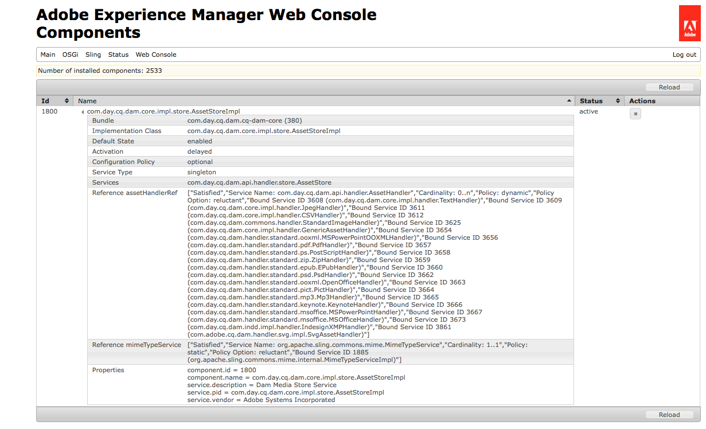

# Process assets using media handlers and workflows {#processing-assets-using-media-handlers-and-workflows}

[!DNL Adobe Experience Manager Assets] verfügt über eine Reihe von Standard-Workflows- und Media-Handlern zur Verarbeitung von Assets. Ein Arbeitsablauf definiert die Aufgaben, die für die Assets ausgeführt werden sollen, und delegiert dann die spezifischen Aufgaben an die Media-Handler, z. B. die Erstellung von Miniaturbildern oder die Metadaten-Extraktion.

Ein Workflow kann so konfiguriert werden, dass er automatisch ausgeführt wird, wenn ein Asset eines bestimmten MIME-Typs hochgeladen wird. The processing steps are defined in terms of a series of [!DNL Assets] media handlers. [!DNL Experience Manager] bietet einige [integrierte Handler](#default-media-handlers) und zusätzliche Handler können entweder [speziell entwickelt](#creating-a-new-media-handler) oder definiert werden, indem der Prozess an ein [Befehlszeilen-Tool](#command-line-based-media-handler) delegiert wird.

Media handlers are services in [!DNL Assets] that perform specific actions on assets. For example, when an MP3 audio file is uploaded into [!DNL Experience Manager], a workflow triggers an MP3 handler that extracts the metadata and generates a thumbnail. Medien-Handler werden normalerweise in Verbindung mit Workflows verwendet. Most common MIME types are supported within [!DNL Experience Manager]. Spezielle Aufgaben können an Assets durchgeführt werden, indem Workflows erweitert bzw. erstellt, Medien-Handler erweitert bzw. erstellt oder Medien-Handler deaktiviert bzw. aktiviert werden.

>[!NOTE]
>
>See the [Assets supported formats](assets-formats.md) page for a description of all the formats supported by [!DNL Assets] as well as features supported for each format.

## Default media handlers {#default-media-handlers}

The following media handlers are available within [!DNL Assets] and handle the most common MIME types:

<!-- TBD: Java versions shouldn't be set to 1.5. Must be updated.
-->

| Handler-Name | Dienstname (in der Systemkonsole) | Unterstützte MIME-Typen |
|--------------|--------------------------------------|----------------------|
| [!UICONTROL TextHandler] | `com.day.cq.dam.core.impl.handler.TextHandler` | text/plain |
| [!UICONTROL PdfHandler] | `com.day.cq.dam.handler.standard.pdf.PdfHandler` | <ul><li>application/pdf</li><li>application/illustrator</li></ul> |
| [!UICONTROL JpegHandler] | `com.day.cq.dam.core.impl.handler.JpegHandler` | image/jpeg |
| [!UICONTROL Mp3Handler] | `com.day.cq.dam.handler.standard.mp3.Mp3Handler` | audio/mpeg |
| [!UICONTROL ZipHandler] | `com.day.cq.dam.handler.standard.zip.ZipHandler` | <ul><li>application/java-archive </li><li> application/zip</li></ul> |
| [!UICONTROL PictHandler] | `com.day.cq.dam.handler.standard.pict.PictHandler` | image/pict |
| [!UICONTROL StandardImageHandler] | `com.day.cq.dam.core.impl.handler.StandardImageHandler` | <ul><li>image/gif </li><li> image/png </li> <li>application/photoshop </li> <li>image/jpeg </li><li> image/tiff </li> <li>image/x-ms-bmp </li><li> image/bmp</li></ul> |
| [!UICONTROL MSOfficeHandler] | `com.day.cq.dam.handler.standard.msoffice.MSOfficeHandler` | application/msword |
| [!UICONTROL MSPowerPointHandler] | `com.day.cq.dam.handler.standard.msoffice.MSPowerPointHandler` | application/vnd.ms-powerpoint |
| [!UICONTROL OpenOfficeHandler] | `com.day.cq.dam.handler.standard.ooxml.OpenOfficeHandler` | <ul><li>application/vnd.openxmlformats-officedocument.wordprocessingml.document</li><li> application/vnd.openxmlformats-officedocument.spreadsheetml.sheet</li><li> application/vnd.openxmlformats-officedocument.presentationml.presentation</li></ul> |
| [!UICONTROL EPubHandler] | `com.day.cq.dam.handler.standard.epub.EPubHandler` | application/epub+zip |
| [!UICONTROL GenericAssetHandler] | `com.day.cq.dam.core.impl.handler.GenericAssetHandler` | Ausweichmöglichkeit, falls kein anderer Handler gefunden wurde, der Daten aus einem Asset extrahiert |

Alle Handler führen folgende Aufgaben aus:

* Extraktion aller verfügbaren Metadaten aus einem Asset.
* Erstellen eines Miniaturbilds eines Assets.

So Ansicht der aktiven Medienhandler:

1. Navigieren Sie im Browser zu `http://localhost:4502/system/console/components`.
1. Klicken Sie auf `com.day.cq.dam.core.impl.store.AssetStoreImpl`.
1. Eine Liste mit allen aktiven Medien-Handlern wird angezeigt. Beispiel:



## Use media handlers in workflows to perform tasks on assets {#using-media-handlers-in-workflows-to-perform-tasks-on-assets}

Medien-Handler sind Dienste, die normalerweise in Verbindung mit Workflows verwendet werden.

[!DNL Experience Manager] bietet verschiedene Standard-Workflows zur Bearbeitung von Assets. Um sie anzuzeigen, öffnen Sie die Workflow-Konsole und klicken Sie auf die Registerkarte **[!UICONTROL Modelle]**: Die Workflow-Namen, die mit beginnen, sind Asset-spezifische Workflows.[!DNL Assets]

Bereits bestehende Workflows können erweitert und neue Workflows können erstellt werden, um Assets nach spezifischen Anforderungen zu bearbeiten.

Das folgende Beispiel zeigt, wie der **[!UICONTROL AEM Assets-Synchronisierungs-Workflow]** erweitert werden kann, damit Teil-Assets für alle Assets außer PDF-Dokumente erstellt werden.

### Deaktivieren oder Aktivieren eines Medienhandlers {#disabling-enabling-a-media-handler}

Die Medien-Handler können über die Apache Felix Web Management-Konsole deaktiviert bzw. aktiviert werden. Wenn der Medien-Handler deaktiviert ist, werden seine Aufgaben zur Bearbeitung von Assets nicht durchgeführt.

So aktivieren/deaktivieren Sie einen Medien-Handler:

1. Navigieren Sie im Browser zu `https://<host>:<port>/system/console/components`.
1. Klicken Sie neben dem Namen des Medien-Handlers auf **[!UICONTROL Deaktivieren]**. Beispiel: `com.day.cq.dam.handler.standard.mp3.Mp3Handler`.
1. Aktualisieren Sie die Seite: Neben dem Medien-Handler wird ein Symbol angezeigt, das angibt, dass er deaktiviert ist.
1. Um den Medien-Handler zu aktivieren, klicken Sie neben dem Namen des Medien-Handlers auf **[!UICONTROL Aktivieren]**.

### Create a new media handler {#creating-a-new-media-handler}

Um einen neuen Medientyp zu unterstützen oder eine bestimmte Aufgabe an einem Asset durchzuführen, muss ein neuer Medien-Handler erstellt werden. In diesem Abschnitt wird beschrieben, wie Sie vorgehen.

#### Important classes and interfaces {#important-classes-and-interfaces}

Am besten ist es, zu Beginn einer Implementierung den Inhalt einer bereitgestellten abstrakten Implementierung zu übernehmen, wodurch die meisten Dinge im Voraus erledigt werden und ein angemessenes Standardverhalten erreicht wird: die `com.day.cq.dam.core.AbstractAssetHandler`-Klasse.

Diese Klasse enthält bereits einen abstrakten Dienst-Deskriptor. Wenn Sie also den Inhalt dieser Klasse übernehmen und das maven-sling-Plug-in verwenden, müssen Sie die Übernahmemarkierung auf `true` setzen.

Implementieren Sie die folgenden Methoden:

* `extractMetadata()`: extrahiert alle verfügbaren Metadaten.
* `getThumbnailImage()`: erstellt ein Miniaturbild aus einem Asset.
* `getMimeTypes()`: gibt die Asset-MIME-Typen zurück.

Hier eine Beispielvorlage:

```Java
package my.own.stuff; /** * @scr.component inherit="true" * @scr.service */ public class MyMediaHandler extends com.day.cq.dam.core.AbstractAssetHandler { // implement the relevant parts }
```

Schnittstelle und Klassen:

* `com.day.cq.dam.api.handler.AssetHandler`-Schnittstelle: Diese Schnittstelle beschreibt den Dienst, der Unterstützung für bestimmte MIME-Typen hinzufügt. Wenn ein neuer MIME-Typ hinzugefügt werden soll, muss diese Schnittstelle implementiert werden. Die Schnittstelle enthält Methoden zum Importieren und Exportieren der jeweiligen Dokumente, zum Erstellen von Miniaturbildern und zum Extrahieren von Metadaten.
* `com.day.cq.dam.core.AbstractAssetHandler`-Klasse: Diese Klasse dient als Grundlage für alle anderen Asset-Handler-Implementierungen und bietet häufig verwendete Funktionen.
* `com.day.cq.dam.core.AbstractSubAssetHandler`-Klasse:
   * Diese Klasse dient als Grundlage für alle anderen Asset-Handler-Implementierungen und bietet häufig verwendete Funktionen sowie häufig verwendete Funktionen für die Extraktion von Teilassets.
   * Die beste Methode zum Beginn einer Implementierung besteht darin, eine bereitgestellte abstrakte Implementierung zu übernehmen, die die meisten Dinge übernimmt und ein vernünftiges Standardverhalten bietet: die Klasse com.day.cq.dam.core.AbstractAssetHandler.
   * Diese Klasse enthält bereits einen abstrakten Dienst-Deskriptor. Wenn Sie also den Inhalt dieser Klasse übernehmen und das maven-sling-Plug-in verwenden, müssen Sie das Übernahme-Flag auf true setzen.

Die folgenden Methoden müssen implementiert werden:

* `extractMetadata()`: Diese Methode extrahiert alle verfügbaren Metadaten.
* `getThumbnailImage()`: Diese Methode erstellt ein Miniaturbild aus dem übergebenen Asset.
* `getMimeTypes()`: Diese Methode gibt den/die Asset-MIME-Typ(en) zurück.

Hier eine Beispielvorlage:

package my.own.stuff; /&amp;ast;&amp;ast; &amp;ast; @scr.component inherit=&quot;true&quot; &amp;ast; @scr.service &amp;ast;/ public class MyMediaHandler extends com.day.cq.dam.core.AbstractAssetHandler { // die relevanten Teile implementieren }

Schnittstelle und Klassen:

* `com.day.cq.dam.api.handler.AssetHandler`-Schnittstelle: Diese Schnittstelle beschreibt den Dienst, der Unterstützung für bestimmte MIME-Typen hinzufügt. Wenn ein neuer MIME-Typ hinzugefügt werden soll, muss diese Schnittstelle implementiert werden. Die Schnittstelle enthält Methoden zum Importieren und Exportieren der jeweiligen Dokumente, zum Erstellen von Miniaturbildern und zum Extrahieren von Metadaten.
* `com.day.cq.dam.core.AbstractAssetHandler`-Klasse: Diese Klasse dient als Grundlage für alle anderen Asset-Handler-Implementierungen und bietet häufig verwendete Funktionen.
* `com.day.cq.dam.core.AbstractSubAssetHandler`-Klasse: Diese Klasse dient als Grundlage für alle anderen Asset-Handler-Implementierungen und bietet häufig verwendete Funktionen sowie übliche Funktionen für die Extrahierung von Teil-Assets.

#### Example: create a specific text handler {#example-create-a-specific-text-handler}

In diesem Abschnitt erstellen Sie einen spezifischen Text-Handler, der Miniaturbilder mit einem Wasserzeichen erstellt.

Gehen Sie wie folgt vor:

Lesen Sie die [Entwicklungstools](../sites-developing/dev-tools.md) , um Eclipse mit einem [!DNL Maven] Plugin zu installieren und einzurichten und um die Abhängigkeiten einzurichten, die für das [!DNL Maven] Projekt benötigt werden.

After you perform the following procedure, when you upload a TXT file into [!DNL Experience Manager], the file&#39;s metadata are extracted and two thumbnails with a watermark are generated.

1. Erstellen Sie in Eclipse `myBundle` ein [!DNL Maven] Projekt:

   1. In the Menu bar, click **[!UICONTROL File]** > **[!UICONTROL New]** > **[!UICONTROL Other]**.
   1. In the dialog, expand the [!DNL Maven] folder, select [!DNL Maven] project and click **[!UICONTROL Next]**.
   1. Check the Create a simple project box and the Use default Workspace locations box, then click **[!UICONTROL Next]**.
   1. Definieren eines [!DNL Maven] Projekts:

      * Group Id: `com.day.cq5.myhandler`.
      * Artefakt-ID: myBundle.
      * Name: Mein [!DNL Experience Manager] Bundle.
      * Description: This is my [!DNL Experience Manager] bundle.
   1. Klicken Sie auf **[!UICONTROL Finish]**.


1. Set the [!DNL Java] compiler to version 1.5:

   1. Right-click the `myBundle` project, select [!UICONTROL Properties].
   1. Select [!UICONTROL Java Compiler] and set following properties to 1.5:

      * Compiler-Kompatibilitätsstufe
      * Kompatibilität von generierten .class-Dateien
      * Quellkompatibilität
   1. Klicken Sie auf **[!UICONTROL OK]**. In the dialog window, click **[!UICONTROL Yes]**.


1. Replace the code in the `pom.xml` file with the following code:

   ```xml
   <project xmlns="https://maven.apache.org/POM/4.0.0" xmlns:xsi="https://www.w3.org/2001/XMLSchema-instance"
    xsi:schemaLocation="https://maven.apache.org/POM/4.0.0 https://maven.apache.org/maven-v4_0_0.xsd">
    <modelVersion>4.0.0</modelVersion>
    <!-- ====================================================================== -->
    <!-- P A R E N T P R O J E C T D E S C R I P T I O N -->
    <!-- ====================================================================== -->
    <parent>
     <groupId>com.day.cq.dam</groupId>
     <artifactId>dam</artifactId>
     <version>5.2.14</version>
     <relativePath>../parent</relativePath>
    </parent>
    <!-- ====================================================================== -->
    <!-- P R O J E C T D E S C R I P T I O N -->
    <!-- ====================================================================== -->
    <groupId>com.day.cq5.myhandler</groupId>
    <artifactId>myBundle</artifactId>
    <name>My CQ5 bundle</name>
    <version>0.0.1-SNAPSHOT</version>
    <description>This is my CQ5 bundle</description>
    <packaging>bundle</packaging>
    <!-- ====================================================================== -->
    <!-- B U I L D D E F I N I T I O N -->
    <!-- ====================================================================== -->
    <build>
     <plugins>
      <plugin>
       <groupId>org.apache.felix</groupId>
       <artifactId>maven-scr-plugin</artifactId>
      </plugin>
      <plugin>
       <groupId>org.apache.sling</groupId>
       <artifactId>maven-sling-plugin</artifactId>
       <configuration>
        <slingUrlSuffix>/libs/dam/install/</slingUrlSuffix>
       </configuration>
      </plugin>
      <plugin>
       <groupId>org.apache.felix</groupId>
       <artifactId>maven-bundle-plugin</artifactId>
       <extensions>true</extensions>
       <configuration>
        <instructions>
         <Bundle-Category>cq5</Bundle-Category>
         <Export-Package> com.day.cq5.myhandler </Export-Package>
        </instructions>
       </configuration>
      </plugin>
     </plugins>
    </build>
    <!-- ====================================================================== -->
    <!-- D E P E N D E N C I E S -->
    <!-- ====================================================================== -->
    <dependencies>
     <dependency>
      <groupId>com.day.cq.dam</groupId>
      <artifactId>cq-dam-api</artifactId>
      <version>5.2.10</version>
      <scope>provided</scope>
     </dependency>
     <dependency>
      <groupId>com.day.cq.dam</groupId>
      <artifactId>cq-dam-core</artifactId>
      <version>5.2.10</version>
      <scope>provided</scope>
     </dependency>
     <dependency>
      <groupId>com.day.cq</groupId>
      <artifactId>cq-commons</artifactId>
     </dependency>
     <dependency>
      <groupId>javax.jcr</groupId>
      <artifactId>jcr</artifactId>
     </dependency>
     <dependency>
      <groupId>org.apache.felix</groupId>
      <artifactId>org.osgi.compendium</artifactId>
     </dependency>
     <dependency>
      <groupId>org.slf4j</groupId>
      <artifactId>slf4j-api</artifactId>
     </dependency>
     <dependency>
      <groupId>commons-lang</groupId>
      <artifactId>commons-lang</artifactId>
     </dependency>
     <dependency>
      <groupId>commons-collections</groupId>
      <artifactId>commons-collections</artifactId>
     </dependency>
     <dependency>
      <groupId>commons-io</groupId>
      <artifactId>commons-io</artifactId>
     </dependency>
     <dependency>
      <groupId>com.day.commons</groupId>
      <artifactId>day-commons-gfx</artifactId>
     </dependency>
     <dependency>
      <groupId>com.day.commons</groupId>
      <artifactId>day-commons-text</artifactId>
     </dependency>
     <dependency>
      <groupId>com.day.cq.workflow</groupId>
      <artifactId>cq-workflow-api</artifactId>
     </dependency>
     <dependency>
      <groupId>com.day.cq.wcm</groupId>
      <artifactId>cq-wcm-foundation</artifactId>
      <version>5.2.22</version>
     </dependency>
    </dependencies>
   ```

1. Erstellen Sie das Paket `com.day.cq5.myhandler` , das die [!DNL Java] Klassen unter `myBundle/src/main/java`:

   1. Under myBundle, right-click `src/main/java`, select New, then Package.
   1. Name it `com.day.cq5.myhandler` and click Finish.

1. Erstellen Sie die [!DNL Java] Klasse `MyHandler`:

   1. Klicken Sie [!DNL Eclipse]unter `myBundle/src/main/java`der rechten Maustaste auf das `com.day.cq5.myhandler` Paket. Wählen Sie [!UICONTROL Neu]und dann [!UICONTROL Klasse].
   1. In the dialog window, name the [!DNL Java] class `MyHandler` and click [!UICONTROL Finish]. [!DNL Eclipse] erstellt und öffnet die Datei `MyHandler.java`.
   1. In `MyHandler.java` replace the existing code with the following and then save the changes:

   ```java
   package com.day.cq5.myhandler;
   import java.awt.Color;
   import java.awt.Rectangle;
   import java.awt.image.BufferedImage;
   import java.io.IOException;
   import java.io.InputStream;
   import java.io.InputStreamReader;
   import javax.jcr.Node;
   import javax.jcr.RepositoryException;
   import javax.jcr.Session;
   import org.apache.commons.io.IOUtils;
   import org.slf4j.Logger;
   import org.slf4j.LoggerFactory;
   import com.day.cq.dam.api.metadata.ExtractedMetadata;
   import com.day.cq.dam.core.AbstractAssetHandler;
   import com.day.image.Font;
   import com.day.image.Layer;
   import com.day.cq.wcm.foundation.ImageHelper;
   
   /**
    * The <code>MyHandler</code> can extract text files
    * @scr.component inherit="true" immediate="true" metatype="false"
    * @scr.service
    *
    **/
   
   public class MyHandler extends AbstractAssetHandler {
    /** * Logger instance for this class. */
    private static final Logger log = LoggerFactory.getLogger(MyHandler.class);
    /** * Music icon margin */
    private static final int MARGIN = 10;
    /** * @see com.day.cq.dam.api.handler.AssetHandler#getMimeTypes() */
    public String[] getMimeTypes() {
     return new String[] {"text/plain"};
    }
   
    public ExtractedMetadata extractMetadata(Node asset) {
     ExtractedMetadata extractedMetadata = new ExtractedMetadata();
     InputStream data = getInputStream(asset);
     try {
      // read text data
      InputStreamReader reader = new InputStreamReader(data);
      char[] buffer = new char[4096];
      String text = "";
      while (reader.read(buffer) != -1) {
       text += new String(buffer);
      }
      reader.close();
      long wordCount = this.wordCount(text);
      extractedMetadata.setProperty("text", text);
      extractedMetadata.setMetaDataProperty("Word Count",wordCount);
      setMimetype(extractedMetadata, asset);
     } catch (Throwable t) {
      log.error("handling error: " + t.toString(), t);
     } finally {
      IOUtils.closeQuietly(data);
     }
     return extractedMetadata; }
    // ----------------------< helpers >----------------------------------------
    protected BufferedImage getThumbnailImage(Node node) {
     ExtractedMetadata metadata = extractMetadata(node);
     final String text = (String) metadata.getProperty("text");
     // create text layer
     final Layer layer = new Layer(500, 600, Color.WHITE);
     layer.setPaint(Color.black);
     Font font = new Font("Arial", 12);
     String displayText = this.getDisplayText(text, 600, 12);
     if(displayText!=null && displayText.length() > 0) {
      // commons-gfx Font class would throw IllegalArgumentException on empty or null text
      layer.drawText(10, 10, 500, 600, displayText, font, Font.ALIGN_LEFT, 0, 0);
     }
     // create watermark and merge with text layer
     Layer watermarkLayer;
     try {
      final Session session = node.getSession();
      watermarkLayer = ImageHelper.createLayer(session, "/content/dam/geometrixx/icons/certificate.png");
      watermarkLayer.setX(MARGIN);
      watermarkLayer.setY(MARGIN);
      layer.merge(watermarkLayer);
     } catch (RepositoryException e) {
      // TODO Auto-generated catch block
      e.printStackTrace();
     } catch (IOException e) {
      // TODO Auto-generated catch block
      e.printStackTrace(); }
     layer.crop(new Rectangle(510, 600));
     return layer.getImage(); }
    // ---------------< private >-----------------------------------------------
    /**
     * This method cuts lines if the text file is too long..
     * * @param text
     * * text to check
     * * @param height
     * * text box height (px)
     * * @param fontheight
     * * font height (px)
     * * @return the text which will fit into the box
     */
    private String getDisplayText(String text, int height, int fontheight) {
     String trimmedText = text.trim();
     int numOfLines = height / fontheight;
     String lines[] = trimmedText.split("\n");
     if (lines.length <= numOfLines) {
      return trimmedText;
     } else {
      String cuttetText = "";
      for (int i = 0; i < numOfLines; i++) {
       cuttetText += lines[i] + "\n";
      }
      return cuttetText;
     }
    }
    /**
     * * This method counts the number of words in a string
     * * @param text the String whose words would like to be counted
     * * @return the number of words in the string
     * */
    private long wordCount(String text) {
     // We need to keep track of the last character, if we have two whitespaces in a row we don't want to double count.
     // The starting of the document is always a whitespace.
     boolean prevWhiteSpace = true;
     boolean currentWhiteSpace = true;
     char c; long numwords = 0;
     int j = text.length();
     int i = 0;
     while (i < j) {
      c = text.charAt(i++);
      if (c == 0) { break; }
      currentWhiteSpace = Character.isWhitespace(c);
      if (currentWhiteSpace && !prevWhiteSpace) { numwords++; }
      prevWhiteSpace = currentWhiteSpace;
     }
     // If we do not end with a whitespace then we need to add one extra word.
     if (!currentWhiteSpace) { numwords++; }
     return numwords;
    }
   }
   ```

1. Compile the [!DNL Java] class and create the bundle:

   1. Right-click the `myBundle` project, select **[!UICONTROL Run As]**, then **[!UICONTROL Maven Install]**.
   1. The bundle `myBundle-0.0.1-SNAPSHOT.jar` (containing the compiled class) is created under `myBundle/target`.

1. In CRX explorer, create a new node under `/apps/myApp`. Name = `install`, Type = `nt:folder`.
1. Copy the bundle `myBundle-0.0.1-SNAPSHOT.jar` and store it under `/apps/myApp/install` (for example with WebDAV). The new text handler is now active in [!DNL Experience Manager].
1. In your browser, open the [!UICONTROL Apache Felix Web Management Console]. Select the [!UICONTROL Components] tab and disable the default text handler `com.day.cq.dam.core.impl.handler.TextHandler`.

## Command Line based media handler {#command-line-based-media-handler}

[!DNL Experience Manager]Mit können Sie ein beliebiges Befehlszeilen-Tool (z. B. ) innerhalb eines Workflows ausführen, um Assets zu konvertieren und dem Asset das neue Ausgabeformat hinzuzufügen. [!DNL ImageMagick] You only need to install the command-line tool on the disk hosting the [!DNL Experience Manager] server and to add and configure a process step to the workflow. Der aufgerufene Prozess `CommandLineProcess` ermöglicht zudem die Filterung nach spezifischen MIME-Typen und die Erstellung mehrerer Miniaturbilder auf der Grundlage des neuen Ausgabeformats.

The following conversions can be automatically run and stored within [!DNL Assets]:

* EPS- und AI-Umwandlung mithilfe von [ImageMagick](https://www.imagemagick.org/script/index.php) und [Ghostscript](https://www.ghostscript.com/).
* FLV-Videotranskodierung mithilfe von [FFmpeg](https://ffmpeg.org/).
* MP3-Kodierung mithilfe von [LAME](https://lame.sourceforge.io/).
* Verarbeitung von Audiodaten mithilfe von [SOX](https://sox.sourceforge.net/).

>[!NOTE]
>
>Bei Nicht-Windows-Systemen gibt das FFmpeg-Tool einen Fehler zurück, wenn Darstellungen für ein Video-Asset generiert werden, dessen Dateiname ein einfaches Anführungszeichen (&#39;) enthält. If the name of your video file includes a single quote, remove it before uploading to [!DNL Experience Manager].

Der Prozess `CommandLineProcess` führt folgende Vorgänge in der angegebenen Reihenfolge aus:

* Filtert die Datei nach bestimmten MIME-Typen, falls angegeben.
* Creates a temporary directory on the disk hosting the [!DNL Experience Manager] server.
* Streamt die Originaldatei in das temporäre Verzeichnis.
* Führt den Befehl aus, der über die Argumente des Schritts definiert ist. The command is being executed within the temporary directory with the permissions of the user running [!DNL Experience Manager].
* Streams the result back into the rendition folder of the [!DNL Experience Manager] server.
* Löscht das temporäre Verzeichnis.
* Erstellt Miniaturbilder auf der Grundlage dieser Ausgabeformate, falls angegeben. Die Anzahl und die Abmessungen von Miniaturbildern werden durch die Argumente des Schritts definiert.

### An example using [!DNL ImageMagick] {#an-example-using-imagemagick}

The following example shows you how to set up the command line process step so that every time an asset with the miMIME e-type GIF or TIFF is added to `/content/dam` on the [!DNL Experience Manager] server, a flipped image of the original is created together with three additional thumbnails (140x100, 48x48, and 10x250).

To do this, use [!DNL ImageMagick]. [!DNL ImageMagick] ist eine kostenlose Befehlszeilensoftware zum Erstellen, Bearbeiten und Erstellen von Bitmapbildern.

Installieren Sie [!DNL ImageMagick] auf dem Datenträger, auf dem der [!DNL Experience Manager] Server gehostet wird:

1. Install [!DNL ImageMagick]: See [ImageMagick documentation](https://www.imagemagick.org/script/download.php).
1. Richten Sie das Tool ein, damit Sie den Befehl „convert“ über die Befehlszeile ausführen können.
1. Um festzustellen, ob das Tool ordnungsgemäß installiert wurde, führen Sie den Befehl `convert -h` über die Befehlszeile aus.

   Es wird ein Hilfebildschirm mit allen möglichen Optionen des Konvertierungs-Tools angezeigt.

   >[!NOTE]
   >
   >In some versions of Windows, the convert command may fail to run because it conflicts with the native convert utility that is part of [!DNL Windows] installation. In this case, mention the complete path for the [!DNL ImageMagick] software used to convert image files to thumbnails. Beispiel: `"C:\Program Files\ImageMagick-6.8.9-Q16\convert.exe" -define jpeg:size=319x319 ${filename} -thumbnail 319x319 cq5dam.thumbnail.319.319.png`.

1. To see if the tool runs properly, add a JPG image to the working directory and run the command convert `<image-name>.jpg -flip <image-name>-flipped.jpg` on the command line. Ein gespiegeltes Bild wird dem Verzeichnis hinzugefügt. Fügen Sie dann den Befehlszeilenprozessschritt dem Workflow **[!UICONTROL DAM-Update-Asset]** hinzu.
1. Rufen Sie die Konsole **[!UICONTROL Workflow]** auf.
1. Bearbeiten Sie auf der Registerkarte **[!UICONTROL Modelle]** das Modell **[!UICONTROL DAM-Update-Asset]**.
1. Ändern Sie die [!UICONTROL Argumente] des Schritts für die **[!UICONTROL Web-aktivierte Darstellung]** in: `mime:image/gif,mime:image/tiff,tn:140:100,tn:48:48,tn:10:250,cmd:convert ${directory}/${filename} -flip ${directory}/${basename}.flipped.jpg`.
1. Speichern Sie den Workflow.

Fügen Sie zum Testen des geänderten Workflows ein Asset zu `/content/dam` hinzu.

1. Rufen Sie im Dateisystem ein TIFF-Bild Ihrer Wahl ab. Benennen Sie es in `myImage.tiff` um und kopieren Sie es in `/content/dam`, z. B. mithilfe von WebDAV.
1. Rufen Sie die Konsole **[!UICONTROL CQ5 DAM]** auf, z. B. `http://localhost:4502/libs/wcm/core/content/damadmin.html`.
1. Öffnen Sie das Asset **[!UICONTROL myImage.tiff]** und prüfen Sie, ob das gespiegelte Bilder und die drei Miniaturbilder erstellt wurden.

#### Configure the CommandLineProcess process step {#configuring-the-commandlineprocess-process-step}

In diesem Abschnitt wird beschrieben, wie die [!UICONTROL Prozess-Argumente] des [!UICONTROL CommandLineProcess] festgelegt werden.

Trennen Sie die Werte der [!UICONTROL Prozessargumente] durch Kommas und verwenden Sie kein Leerzeichen, um sie mit einemLeerzeichen zu versehen.

| Argument-Format | Beschreibung |
|---|---|
| mime:&lt;MIME-Typ> | Optionales Argument. Der Prozess wird angewendet, wenn das Asset denselben MIME-Typ wie das Argument hat. <br>Es können mehrere MIME-Typen definiert werden. |
| tn:&lt;Breite>:&lt;Höhe> | Optionales Argument. Der Prozess erstellt ein Miniaturbild mit den Abmessungen, die im Argument definiert sind. <br>Es können mehrere Miniaturbilder definiert werden. |
| cmd: &lt;Befehl> | Definiert den ausgeführten Befehl. Die Syntax hängt vom Befehlszeilen-Tool ab. Nur ein Befehl kann definiert werden. <br>Die folgenden Variablen können zum Erstellen des Befehls verwendet werden:<br>`${filename}`: Name der Eingabedatei, z. B. original.jpg <br> `${file}`: Vollständiger Pfadname der Eingabedatei, z. B. `/tmp/cqdam0816.tmp/original.jpg` <br> `${directory}`: Verzeichnis der Eingabedatei, z. B. `/tmp/cqdam0816.tmp`<br>`${basename}`: Name der Eingabedatei ohne Erweiterung, z. B. Original <br>`${extension}`: Erweiterung der Eingabedatei, z. B. JPG. |

For example, if [!DNL ImageMagick] is installed on the disk hosting the [!DNL Experience Manager] server and if you create a process step using [!UICONTROL CommandLineProcess] as Implementation and the following values as [!UICONTROL Process Arguments]:

`mime:image/gif,mime:image/tiff,tn:140:100,tn:48:48,tn:10:250,cmd:convert ${directory}/${filename} -flip ${directory}/${basename}.flipped.jpg`

then, when the workflow runs, the step only applies to assets that have `image/gif` or `mime:image/tiff` as `mime-types`, it creates a flipped image of the original, converts it into JPG and creates three thumbnails that have the dimensions: 140x100, 48x48, and 10x250.

Use the following [!UICONTROL Process Arguments] to create the three standard thumbnails using [!DNL ImageMagick]:

`mime:image/tiff,mime:image/png,mime:image/bmp,mime:image/gif,mime:image/jpeg,cmd:convert ${filename} -define jpeg:size=319x319 -thumbnail "319x319>" -background transparent -gravity center -extent 319x319 -write png:cq5dam.thumbnail.319.319.png -thumbnail "140x100>" -background transparent -gravity center -extent 140x100 -write cq5dam.thumbnail.140.100.png -thumbnail "48x48>" -background transparent -gravity center -extent 48x48 cq5dam.thumbnail.48.48.png`

Use the following [!UICONTROL Process Arguments] to create the web-enabled rendition using [!DNL ImageMagick]:

`mime:image/tiff,mime:image/png,mime:image/bmp,mime:image/gif,mime:image/jpeg,cmd:convert ${filename} -define jpeg:size=1280x1280 -thumbnail "1280x1280>" cq5dam.web.1280.1280.jpeg`

>[!NOTE]
>
>The [!UICONTROL CommandLineProcess] step only applies to assets (nodes of type `dam:Asset`) or descendants of an asset.

>[!MORELIKETHIS]
>
>* [Prozesselemente](assets-workflow.md)

