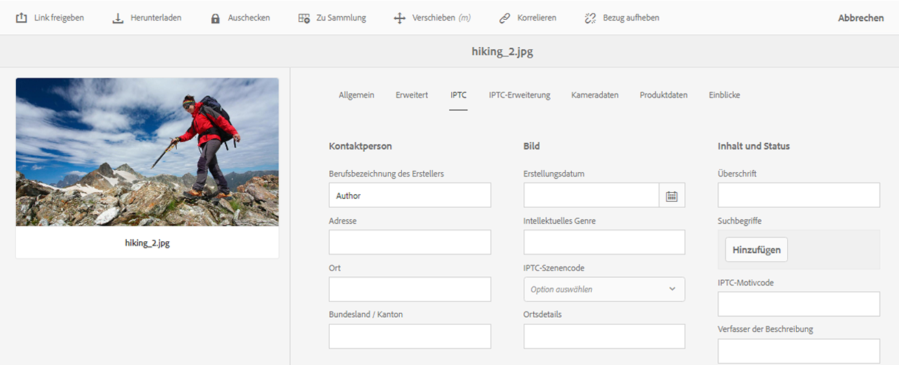

# Grundlagen zu Metadatenkonzepten {#why-we-need-metadata}

Metadaten sind Informationen über Daten. In dieser Hinsicht beziehen sich Daten auf Ihr digitales Asset, z. B. ein Bild. Metadaten sind für ein effizientes Asset-Management von entscheidender Bedeutung.

Metadaten stellen die Sammlung aller für ein Asset verfügbaren Daten dar, die nicht unbedingt im Bild selbst enthalten sind. Beispiele für Metadaten:

* Name des Assets.
* Uhrzeit und Datum der letzten Änderung.
* Größe des Assets bei Speicherung im Repository.
* Name des Ordners, der das Asset enthält.
* Zugehörige Assets oder angewendete Tags.

Dies sind die grundlegenden Metadaten-Eigenschaften, die [!DNL Experience Manager] für Assets verwalten kann, sodass die Benutzer alle Assets anzeigen können. Beispielsweise ist es nützlich, Assets nach dem Datum der letzten Änderung zu ordnen, wenn Sie versuchen, kürzlich hinzugefügte Assets zu finden.

Sie können digitalen Assets auch Daten auf höherer Ebene hinzufügen – darunter:

* Asset-Typ (Bild, Video, Audio-Clip oder Dokument).
* Inhaber des Assets.
* Titel des Assets.
* Beschreibung des Assets.
* Tags, die einem Asset zugewiesen sind.

Mit mehr Metadaten können Sie Assets genauer einteilen. Außerdem erweisen sie sich als nützlich, wenn die Menge digitaler Daten ansteigt. Es ist möglich, einige hundert Dateien nur anhand der Dateinamen zu verwalten. Dieser Ansatz ist jedoch nicht skalierbar. Er bleibt hinter den Erwartungen zurück, wenn die Zahl der beteiligten Personen und die Zahl der verwalteten Assets zunehmen.

Durch das Hinzufügen von Metadaten steigt der Wert eines digitalen Assets, da das Asset folgende Eigenschaften aufweist:

* besser zugänglich – Systeme und Benutzer können es leicht finden.
* einfacher zu verwalten – Sie können Assets mit denselben Eigenschaften einfacher finden und Änderungen auf sie anwenden.
* vollständig – Asset enthält mehr Informationen und Kontext mit mehr Metadaten.

Aus diesen Gründen erhalten Sie mit [!DNL Assets] die richtigen Mittel, um Metadaten für digitale Assets zu erstellen, zu verwalten und auszutauschen.

## Metadatentypen {#types-of-metadata}

Die beiden grundlegenden Metadatentypen sind technische Metadaten und beschreibende Metadaten.

Technische Metadaten eignen sich für Software-Programme, die mit digitalen Assets arbeiten und nicht manuell gepflegt werden sollen. [!DNL Experience Manager Assets] und andere Software ermitteln technische Metadaten automatisch. Die Metadaten können sich ändern, wenn das Asset geändert wird. Die verfügbaren technischen Metadaten für ein Asset hängen größtenteils vom Dateityp des Assets ab. Beispiele für technische Metadaten:

* Größe einer Datei.
* Abmessungen (Höhe und Breite) eines Bildes.
* Bitrate einer Audio- oder Videodatei.
* Auflösung (Detaillierungsgrad) eines Bildes.

Beschreibende Metadaten sind solche, die sich auf die Programm-Domain beziehen – etwa das Unternehmen, aus dem ein Asset stammt. Beschreibende Metadaten können nicht automatisch bestimmt werden. Sie werden manuell oder halbautomatisch erstellt. Beispielsweise kann eine GPS-fähige Kamera automatisch den Längen- und Breitengrad verfolgen und das Bild mit einem Geotag versehen.

Die Kosten für die manuelle Erstellung beschreibender Metadateninformationen sind hoch. Daher werden Standards festgelegt, um den Austausch von Metadaten zwischen Software-Systemen und Organisationen zu erleichtern. [!DNL Experience Manager Assets] unterstützt alle relevanten Standards für die Metadatenverwaltung.

## Codierungsstandards {#encoding-standards}

Es gibt verschiedene Möglichkeiten, Metadaten in Dateien einzubetten. Dazu werden die folgenden Codierungsstandards unterstützt:

* XMP: Damit speichert [!DNL Assets] die extrahierten Metadaten im Repository.
* ID3: für Audio- und Videodateien
* EXIF: für Grafikdateien.
* Andere/Legacy: von [!DNL Microsoft Word], [!DNL PowerPoint], [!DNL Excel] usw.

### XMP {#xmp}

[!DNL Extensible Metadata Platform] (XMP) ist ein offener Standard, der von [!DNL Experience Manager Assets] für die gesamte Metadatenverwaltung verwendet wird. Der Standard bietet eine universelle Metadatencodierung, die in alle Dateiformate eingebettet werden kann. Adobe und andere Firmen unterstützen den XMP-Standard, da er ein umfangreiches Inhaltsmodell bietet. Benutzer des XMP-Standards und von [!DNL Experience Manager Assets] können auf einer leistungsstarken Plattform aufbauen. Weitere Informationen finden Sie unter [XMP](https://www.adobe.com/products/xmp.html).

### ID3 {#id}

In diesen ID3-Tags gespeicherte Daten werden angezeigt, wenn Sie eine digitale Audiodatei auf dem Computer oder einem tragbaren MP3-Player abspielen.

ID3-Tags wurden für das MP3-Dateiformat entwickelt. Weitere Informationen zu Formaten:

* ID3-Tags funktionieren in MP3- und mp3PRO-Dateien.
* WAV weist keine Tags auf.
* WMA verfügt über proprietäre Tags, die keine Open-Source-Implementierung zulassen.
* Ogg Vorbis nutzt Xiph-Kommentare, die in den Ogg-Container eingebettet sind.
* AAC verwendet ein proprietäres Tagging-Format.

### Exif {#exif}

Exchangeable Image File Format (Exif, austauschbares Bilddateiformat) ist das in der digitalen Fotografie am häufigsten verwendete Metadatenformat. Es bietet eine Möglichkeit, ein festes Vokabular von Metadateneigenschaften in viele Dateiformate wie JPEG, TIFF, RIFF und WAV einzubetten. Exif speichert Metadaten als Paare aus Metadatenname und Metadatenwert. Die Name/Wert-Paare für Metadaten werden auch als Tags bezeichnet (nicht zu verwechseln mit dem Tagging in [!DNL Experience Manager]). Moderne Digitalkameras erstellen Exif-Metadaten und moderne Grafik-Software unterstützt sie. Das Exif-Format ist der kleinste gemeinsame Nenner für die Metadatenverwaltung, insbesondere für Bilder.

Eine wichtige Einschränkung von Exif besteht darin, dass das Format von einigen gängigen Bilddateiformaten wie BMP, GIF oder PNG nicht unterstützt wird.

Von Exif definierte Metadatenfelder sind in der Regel technischer Natur und für die beschreibende Metadatenverwaltung nur begrenzt geeignet. Aus diesem Grund bietet [!DNL Experience Manager Assets] die Zuordnung von Exif-Eigenschaften zu [gängigen Metadaten-Schemata](metadata-schemas.md)[ und zu XMP](xmp-writeback.md).

### Andere Metadaten {#other-metadata}

Andere Metadaten können aus Dateien von [!DNL Microsoft Word], [!DNL PowerPoint], [!DNL Excel] usw. eingebettet werden.

## Grundlegendes zu Metadatenschemata {#metadata-schemata}

Metadatenschemata sind vordefinierte Sets aus Metadaten-Eigenschaftsdefinitionen, die in verschiedenen Programmen eingesetzt werden können. Eigenschaften sind stets mit einem Asset verknüpft. Das heißt, die Eigenschaften beziehen sich auf die Ressource.

Sie können auch Ihre eigenen Metadatenschemata entwerfen, falls die vorhandenen Ihren Anforderungen nicht entsprechen. Duplizieren Sie keine vorhandenen Informationen. Innerhalb eines Unternehmens kann die Freigabe von Metadaten durch eine Trennung der Schemata erleichtert werden. [!DNL Experience Manager] stellt eine standardmäßige Liste der beliebtesten Metadatenschemata bereit. Die Liste hilft Ihnen, Ihre Metadatenstrategie zu starten und schnell die benötigten Metadateneigenschaften auszuwählen.

Die unterstützten Metadatenschemata sind unten aufgeführt.

### Standardmetadaten {#standard-metadata}

* DC – [!DNL Dublin Core] ist ein wichtiger und häufig verwendeter Metadatensatz.
* DICOM – Digital Imaging and Communications in Medicine.
* `Iptc4xmpCore` und `iptc4xmpExt` – Internationaler Standard für Pressekommunikation, enthält viele themenspezifische Metadaten.
* RDF – Resource Description Framework: Für generische semantische Web-Metadaten.
* XMP – [!DNL Extensible Metadata Platform].
* `xmpBJ` – Einfaches Job-Ticketing.

### Programmspezifische Metadaten {#application-specific-metadata}

Die programmspezifischen Metadaten umfassen technische und beschreibende Metadaten. Diese Metadaten können unter Umständen nicht von anderen Programmen verwendet werden. Beispielsweise kann ein anderes Programm zum Rendern von Bildern möglicherweise nicht auf [!DNL Adobe Photoshop]-Metadaten zugreifen. Sie können einen Workflow-Schritt erstellen, der eine programmspezifische Eigenschaft in eine Standardeigenschaft ändert.

* ACDSee – Vom [!DNL ACDSee]-Programm verwaltete Metadaten. Siehe [www.acdsee.com/](https://www.acdsee.com/).
* Album – [!DNL Adobe Photoshop Album].
* CQ – Von [!DNL Experience Manager Assets] verwendet.
* DAM – Von [!DNL Experience Manager Assets] verwendet.
* DEX - [!DNL Optima SC Description explorer] ist eine Sammlung von Tools für die Metadaten- und Dateiverwaltung für Windows-Betriebssysteme.
* CRS – [Adobe Photoshop Camera Raw](https://helpx.adobe.com/de/camera-raw/using/introduction-camera-raw.html).
* LR – [!DNL Adobe Lightroom].
* MediaPro – [iView MediaPro](https://de.wikipedia.org/wiki/Phase_One_Media_Pro).
* MicrosoftPhoto und MP – Microsoft Photo.
* PDF und PDF/X.
* Photoshop und psAux – [!DNL Adobe Photoshop].

### Digital Rights Management-Metadaten (DRM) {#digital-rights-management-metadata}

* CC – [!DNL Creative Commons].
* [!DNL XMPRights].
* PLUS – [Picture Licensing Universal System](https://www.useplus.com).
* PRISM – [Publishing Requirements for Industry Standard Metadata](https://www.idealliance.org/prism-metadata).
* PRL – PRISM Rights Language.
* PUR – PRISM Usage Rights.
* `xmpPlus` – Integration von PLUS in XMP.

### Fotografiespezifische Metadaten {#photography-specific-metadata}

* Exif – Technische Informationen von der Kamera, einschließlich GPS-Position.
* CRS – [!DNL Camera Raw]-Schema.
* `iptc4xmpCore` und `iptc4xmpExt`.
* TIFF – Bildmetadaten (nicht nur für TIFF-Bilder).

### Druckspezifische Metadaten {#print-specific-metadata}

* PDF und PDF/X – Adobe PDF und Drittanbieterprogramme.
* PRISM – [Publishing Requirements for Industry Standard Metadata](https://www.idealliance.org/prism-metadata).
* XMP – [!DNL Extensible Metadata Platform].
* `xmpPG` – XMP-Metadaten für Seitentext.

### Multimedia-spezifische Metadaten {#multimedia-specific-metadata}

* `xmpDM` – [!DNL Dynamic Media].
* `xmpMM` – Medienverwaltung.

## Metadatenschema-Referenz {#metadata-schemata-reference}

Die folgende Referenz enthält Informationen zu bestimmten Metadatenschemata (in alphabetischer Reihenfolge) sowie eine Liste mit Eigenschaften und den zugehörigen Definitionen.

### Dublin Core {#dublin-core}

Dublin Core-Metadaten bieten ein standardisiertes Set aus Konventionen für die Beschreibung von Assets, um die Suche nach ihnen zu erleichtern. In [!DNL Assets] beschreibt der Dublin Core digitale Assets wie Video, Ton, Bilder und Dokumente.

Das einfache Dublin Core Metadata Element Set (DCMES) enthält 15 Metadatenelemente, die in der folgenden Tabelle aufgeführt werden. Jedes Dublin Core-Element ist optional und kann wiederholt werden. Sie können Dublin Core-Metadateninformationen genauso wie solche für medientypspezifische Metadaten hinzufügen oder löschen.

Neben dem DCMES wurden auch andere Metadatenelemente von der Dublin Core Initiative erstellt. Weitere Informationen finden Sie unter [Dublin Core Initiative](https://dublincore.org/).

| Eigenschaft | Beschreibung |
| ----------- | ------------------------------------------------------------------------------------------------------------------------ |
| contributor | Die Personen oder das Unternehmen, diedafür verantwortlich sind, zum Inhalt beizutragen. |
| coverage | Der geografische Standort oder Zeitraum, den das Asset abdeckt. |
| creator | Die Personen oder das Unternehmen, die dafür verantwortlich sind, den Inhalt zu erstellen. |
| date | Datum oder Zeitraum, mit dem das Asset verknüpft ist. |
| description | Weitere Informationen zum Asset. |
| format | Das Dateiformat, das physische Medium oder die Dimensionen des Assets. [!DNL Experience Manager] verwendet `dc:format`, um den MIME-Typ des Assets zu kennzeichnen. |
| identifier | Eine eindeutige Referenz zum Asset. |
| language | Die Sprache des Assets (z. B. `en` für Englisch). |
| publisher | Die Personen oder das Unternehmen, die dafür verantwortlich sind, das Asset verfügbar zu machen. |
| relation | Ein zugehöriges Asset. |
| rights | Informationen dazu, wer die Rechte für dieses Asset besitzt. |
| source | Ein zugehöriges Asset, aus dem das Asset abgeleitet wurde. |
| subject | Das Thema des Assets. |
| title | Ein Name für das Asset. |
| type | Die Art oder das Genre des Assets. |

### IPTC {#iptc}

Der International Press Telecommunications Council (IPTC) ist eine Arbeitsgemeinschaft aus Nachrichtenagenturen aus der ganzen Welt. Eines seiner Ziele ist die Entwicklung und Aufrechterhaltung technischer Standards. Der IPTC definiert ein Set aus Fotometadaten-Standards für Bilder, das fast universell von Fotografen anerkannt wird. Diese Metadatenstandards waren Bestandteil des umfassenderen Standards IPTC Information Interchange Model (IIM), der in den 1990er Jahren aufgestellt wurde.

Obwohl die IPTC-Kopfzeileninformationen größtenteils von XMP abgelöst wurden, sind ein IPTC-Kernschema und ein Erweiterungsschema für XMP verfügbar. In Bildprogrammen werden XMP- und IPTC-Eigenschaften synchronisiert.

## Metadatengesteuerte Workflows {#metadata-driven-workflows}

Mit der Erstellung von metadatengesteuerten Workflows können Sie einige Prozesse automatisieren und so die Effizienz steigern. In einem metadatengesteuerten Workflow liest das Workflow-Management-System den Workflow und führt anschließend einige vordefinierte Aktionen aus. Im Folgenden finden Sie einige Beispiele für den Einsatz metadatengesteuerter Workflows:

* Der Workflow kann prüfen, ob ein Bild einen Titel aufweist. Falls nicht, fordert das System auf, einen Titel hinzuzufügen.
* Der Workflow kann prüfen, ob ein Copyright-Hinweis für ein Asset dessen Verteilung zulässt. Das System sendet das Asset also an den einen oder den anderen Server.
* Ein Workflow kann auf Assets ohne vordefinierte, obligatorische Metadaten oder Assets mit *ungültigen* Metadaten prüfen.

## XMP-Metadaten {#xmp-metadata}

XMP (Extensible Metadata Platform) ist der Metadatenstandard, der von [!DNL Adobe Experience Manager Assets] für die gesamte Metadatenverwaltung verwendet wird. XMP liefert ein Standardformat für die Erstellung, die Verarbeitung und den Austausch von Metadaten für eine Vielzahl an Programmen.

XMP bietet nicht nur universelle Metadatenkodierung, die in alle Dateiformate eingebettet werden kann, sondern auch ein [Rich-Content-Modell](#xmp-core-concepts). Außerdem wird XMP [von Adobe](#advantages-of-xmp) und anderen Unternehmen unterstützt, sodass Benutzer, die XMP in Kombination mit einsetzen, über eine leistungsstarke Plattform verfügen.[!DNL Assets]

Die [XMP-Spezifikation](https://www.adobe.com/devnet/xmp.html) wird von Adobe zur Verfügung gestellt.

### Was ist XMP? {#what-is-xmp}

Adobe hat den XMP-Standard zunächst im Rahmen des Adobe Acrobat-Softwareprodukts eingeführt. Mittlerweile ist der XMP-Standard weit verbreitet. [!DNL Assets] unterstützt nativ XMP (die Extensible Metadata Platform von Adobe). XMP ist ein Standard für die Verarbeitung und Speicherung von standardisierten und proprietären Metadaten in digitalen Assets. XMP ist als der gemeinsame Standard konzipiert, dank dem mehrere Programme effektiv mit Metadaten arbeiten können.

Produktionsexperten nutzen beispielsweise die integrierte XMP-Unterstützung innerhalb der Adobe-Programme, um Informationen über mehrere Dateiformate hinweg zu übergeben. [!DNL Assets] Das Repository extrahiert die XMP-Metadaten, verwendet sie zur Verwaltung des Inhaltslebenszyklus und bietet die Möglichkeit, Automatisierungs-Workflows zu erstellen.

XMP standardisiert die Art, wie Metadaten definiert, erstellt und verarbeitet werden, indem ein Datenmodell, ein Speichermodell und Schemata bereitgestellt werden. Diese Grundlagen werden alle in diesem Abschnitt behandelt.

Alle Legacy-Metadaten aus EXIF, ID3 oder Microsoft Office werden automatisch in XMP übersetzt. Dies kann erweitert werden, um kundenspezifische Metadatenschemata wie Produktkataloge zu unterstützen.

Metadaten in XMP bestehen aus einer Reihe von Eigenschaften. Diese Eigenschaften sind stets mit einer
bestimmten Entität verknüpft, die als Ressource bezeichnet wird. Die Eigenschaften beziehen sich also auf die Ressource. Bei XMP ist die Ressource stets das Asset.

### XMP Ökosystem {#xmp-ecosystem}

XMP definiert ein [Metadatenmodell](https://de.wikipedia.org/wiki/Metadaten), das mit jedem definierten Satz von Metadatenelementen verwendet werden kann. XMP definiert außerdem bestimmte [Schemata](https://de.wikipedia.org/wiki/Schemasprache_(XML)) für Standardeigenschaften, die für die Aufzeichnung des Verlaufs einer Ressource nützlich sind, während sie mehrere Verarbeitungsschritte durchläuft – von der Aufnahme über [Scannen](https://de.wikipedia.org/wiki/Scanner_(Datenerfassung)) oder Verfassen als Text und Bildbearbeitungsschritte (wie [Zuschneiden](https://de.wikipedia.org/wiki/Cropping) oder Farbkorrektur) bis hin zur Zusammensetzung in das endgültige Bild. XMP ermöglicht es jedem Softwareprogramm oder Gerät, eigene Informationen zu einer digitalen Ressource hinzuzufügen, die dann in der endgültigen digitalen Datei gespeichert werden kann.

XMP wird am häufigsten mit einer Untergruppe des [W3C](https://de.wikipedia.org/wiki/World_Wide_Web_Consortium) [Resource Description Framework](https://de.wikipedia.org/wiki/Resource_Description_Framework) (RDF) serialisiert und gespeichert, das wiederum in [XML](https://de.wikipedia.org/wiki/Extensible_Markup_Language) ausgedrückt wird.

### Vorteile von XMP {#advantages-of-xmp}

XMP bietet die folgenden Vorteile gegenüber anderen Kodierungsstandards und Schemata:

* XMP-basierte Metadaten sind sehr leistungsstark und fein granuliert.
* Mit XMP können Sie mehrere Werte für eine Eigenschaft festlegen.
* XMP verfügt über standardisierte Kodierung, wodurch Sie Metadaten einfach austauschen können.
* XMP ist erweiterbar. Sie können Assets zusätzliche Informationen hinzufügen.

Das XMP-Standardformat ist erweiterbar, sodass Sie den XMP-Daten benutzerdefinierte Arten von Metadaten hinzufügen können. Bei EXIF ist dies dagegen nicht möglich. Die feste Liste der Eigenschaften kann nicht erweitert werden.

>[!NOTE]
>
>XMP lässt im Allgemeinen nicht zu, dass binäre Datentypen eingebettet werden. Um binäre Daten wie etwa Miniaturansichten in XMP zu übertragen, müssen diese in einem XML-kompatiblen Format wie beispielsweise `Base64` kodiert werden.

### XMP {#xmp-core-concepts}

In den folgenden Abschnitten werden die wesentlichen Grundlagen von XMP beschrieben, einschließlich Namespaces und Schemata, Eigenschaften und Werten sowie Sprachalternativen.

#### Namespaces und Schemata {#namespaces-and-schemata}

Ein XMP-Schema ist ein Set aus Eigenschaftsnamen in einem gemeinsamen XML-Namespace, der
den Datentyp und beschreibende Informationen umfasst. Ein XMP-Schema wird durch die zugehörige XML-Namespace-URI identifiziert. Durch Verwendung von Namespaces werden Konflikte zwischen Eigenschaften in verschiedenen Schemata verhindert, die denselben Namen, aber eine andere Bedeutung haben.

Beispiel: Die Eigenschaft `Creator` in zwei unabhängig voneinander entwickelten Schemata kann einerseits für die Person stehen, die das Asset erstellt hat, oder andererseits für das Programm, von dem das Asset erstellt wurde (z. B. Adobe Photoshop).

#### Eigenschaften und Werte {#properties-and-values}

XMP kann Eigenschaften von einem oder mehreren der Schemata umfassen. Viele Adobe-Programme verwenden beispielsweise Folgendes:

* Dublin Core-Schema: `dc:title`, `dc:creator`, `dc:subject`, `dc:format`, `dc:rights`.
* XMP-Basisschema: `xmp:CreateDate`, `xmp:CreatorTool`, `xmp:ModifyDate`, `xmp:metadataDate`.
* XMP-Rechteverwaltungsschema: `xmpRights:WebStatement`, `xmpRights:Marked`.
* XMP-Medienverwaltungsschema: `xmpMM:DocumentID`.

#### Sprachalternativen {#language-alternatives}

Mit XMP können Sie eine `xml:lang`-Eigenschaft zu Texteigenschaften hinzufügen, um die Sprache des Textes anzugeben.

## Arbeiten mit IPTC-Metadaten {#support-for-iptc-metadata}

Erfahren Sie, wie [!DNL Adobe Experience Manager Assets] die IPTC-Metadaten, kreativen Bewertungen und Suchbegriffe unterstützt, die über [!DNL Adobe Bridge] und andere [!DNL Adobe Creative Cloud]-Apps zu Assets hinzugefügt werden.

[!DNL Adobe Experience Manager Assets] unterstützt den IPTC-Metadatenstandard, der häufig zur Beschreibung von Assets verwendet wird. Auf diese Weise verbessert [!DNL Assets] die Akzeptanz seiner Bilder bei verschiedenen Parteien, einschließlich Fotografen, Kreativagenturen, Bibliotheken, Museen usw.

Das standardmäßige Metadatenschema für Assets enthält nun die Metadatenschemata IPTC Core und IPTC Extension, damit umfassende Metadateneigenschaften definiert werden können, mit denen Benutzer präzise und zuverlässige Daten über in einem Bild gezeigte Personen, Orte und die Produkte hinzufügen können. Darüber hinaus werden Daten, Namen und Bezeichner zur Bilderstellung sowie flexible Möglichkeiten für die Angabe von Rechtinformationen unterstützt.

Die Eigenschaftenseite für Assets enthält jetzt einzelne Registerkarten, auf denen die IPTC Core- und IPTC Extension-Metadaten in bearbeitbaren Feldern angezeigt werden.

1. Wählen Sie in der Benutzeroberfläche [!DNL Assets] ein Bild aus.
1. Klicken Sie in der Symbolleiste auf **[!UICONTROL Eigenschaften]**.
1. Klicken Sie auf die Registerkarte **[!UICONTROL IPTC]** , um die IPTC-Metadaten für das Asset anzuzeigen.
1. Bearbeiten Sie die IPTC-Metadateneigenschaften nach Bedarf.

   

1. Klicken Sie auf die Registerkarte **[!UICONTROL IPTC Extension]** , um die IPTC-Erweiterungsmetadaten für das Asset anzuzeigen.
1. Bearbeiten Sie die Eigenschaften der IPTC-Erweiterungs-Metadaten nach Bedarf.
1. Klicken Sie auf **[!UICONTROL Speichern und schließen]**, um die Änderungen zu speichern.

### Unterstützung kreativer Bewertungen {#creative-rating-support}

Parallel zum Anzeigen individueller Benutzerbewertungen und aggregierter Bewertungen zeigt die Eigenschaftenseite jetzt Asset-Bewertungen an, die über Adobe Bridge und andere Kreativanwendungen erfolgt sind.

Diese Bewertungen sind auf der Registerkarte **[!UICONTROL Erweitert]** im Bereich **[!UICONTROL Kreative Bewertung]** verfügbar.

Diese Bewertung ist schreibgeschützt und erfolgt im Bereich von 1 bis 5. Sie können im Suchbereich nach Assets basierend auf ihrer kreativen Bewertung suchen.

Diese Eigenschaft ist jedoch zurzeit nicht indiziert, um Konflikte mit von Benutzern vorgenommenen Änderungen zu vermeiden.

### Unterstützung von Keywords {#keyword-support}

Auf der Registerkarte **[!UICONTROL IPTC]** der Seite [!UICONTROL Eigenschaften] werden auch Suchbegriffe angezeigt, die über Adobe Bridge und andere Adobe Creative Cloud-Apps zu Assets hinzugefügt wurden. Sie können diese Suchbegriffe auch über die Registerkarte **[!UICONTROL IPTC]** bearbeiten und weitere Suchbegriffe hinzufügen.

