# Konfiguration und Verwaltung der Metadatenfunktionalität in [!DNL Assets] {#config-metadata}

<!-- Scope of metadata articles:
* metadata.md: The scope of this article is basic metadata updates, changes, etc. operations that end-users can do.
* metadata-concepts.md: All conceptual information. Minor instructions are OK but it is an FYI article about support and standards.
* metadata-config.md: New article. Contains all configuration and administration how-to info related to metadata of assets.
-->

[!DNL Adobe Experience Manager Assets] speichert Metadaten für jedes Asset. Damit können Assets einfacher kategorisiert und organisiert und bestimmte Assets leichter von Benutzern gefunden werden. Da Sie Metadaten mit den Assets speichern und verwalten können, können Sie Assets basierend auf ihren Metadaten automatisch organisieren und verarbeiten. [!DNL Adobe Experience Manager Assets] ermöglicht es Administratoren, die Metadatenfunktionalität zu konfigurieren und anzupassen, um das standardmäßige Adobe-Angebot zu ändern.

## Bearbeiten des Metadatenschemas {#metadata-schema}

Weitere Informationen finden Sie unter [Bearbeiten von Metadatenschema-Formularen](metadata-schemas.md#edit-metadata-schema-forms).

## Registrieren Sie einen benutzerdefinierten Namespace in [!DNL Experience Manager] {#registering-a-custom-namespace-within-aem}

Sie können innerhalb von [!DNL Experience Manager] eigene Namespaces hinzufügen. Ebenso wie es vordefinierte Namespaces wie `cq`, `jcr` und `sling` gibt, können Sie einen Namespace für Ihre Repository-Metadaten und die XML-Verarbeitung haben.

1. Rufen Sie die Verwaltungsseite für den Knotentyp `https://[aem_server]:[port]/crx/explorer/nodetypes/index.jsp` auf.
1. Um auf die Seite zur Namespace-Verwaltung zuzugreifen, klicken Sie oben auf der Seite auf **[!UICONTROL Namespaces]** .
1. Um einen Namespace hinzuzufügen, klicken Sie unten auf der Seite auf **[!UICONTROL Neu]**.
1. Geben Sie einen benutzerdefinierten Namespace in der XML-Namespace-Konvention an. Geben Sie die ID in Form eines URI und ein verknüpftes Präfix für die ID an. Klicken Sie auf **[!UICONTROL Speichern]**.

## Konfigurieren von Beschränkungen für die Aktualisierung von Massenmetadaten {#bulk-metadata-update-limit}

Um eine DOS-ähnliche Situation (Denial of Service) zu verhindern, beschränkt [!DNL Enterprise Manager] die Anzahl der Parameter, die in einer Sling-Anfrage unterstützt werden. Wenn Sie die Metadaten vieler Assets auf einmal aktualisieren, erreichen Sie möglicherweise den Grenzwert, sodass die Metadaten für weitere Assets nicht aktualisiert werden können. Enterprise Manager generiert die folgende Warnung in den Protokollen:

`org.apache.sling.engine.impl.parameters.Util Too many name/value pairs, stopped processing after 10000 entries`

Um den Grenzwert zu ändern, greifen Sie auf **[!UICONTROL Tools]** > **[!UICONTROL Vorgänge]** > **[!UICONTROL Web-Konsole]** zu und ändern Sie den Wert von **[!UICONTROL Maximale POST Parameter]** in **[!UICONTROL Apache Sling Request Parameter Handling]** OSGi-Konfiguration.

## Metadatenprofile {#metadata-profiles}

Mit einem Metadatenprofil können Sie Standardmetadaten auf Assets in einem Ordner anwenden. Erstellen Sie ein Metadatenprofil und wenden Sie es auf einen Ordner an. Jedes Asset, das Sie anschließend in den Ordner hochladen, übernimmt die Standardmetadaten, die Sie im Metadatenprofil konfiguriert haben.

### Hinzufügen eines Metadatenprofils {#adding-a-metadata-profile}

1. Navigieren Sie zu **[!UICONTROL Tools]** > **[!UICONTROL Assets]** > **[!UICONTROL Metadatenprofile]** und klicken Sie auf **[!UICONTROL Erstellen]**.
1. Geben Sie einen Titel für das Profil ein, z. B. `Sample Metadata`, und klicken Sie auf **[!UICONTROL Erstellen]**. Das [!UICONTROL Formular bearbeiten] für das Metadatenprofil wird angezeigt.

   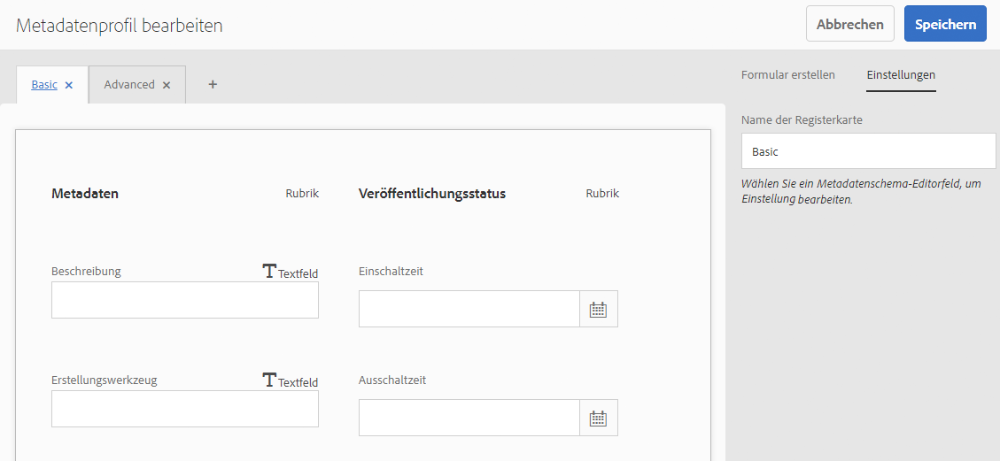

1. Klicken Sie auf eine Komponente und konfigurieren Sie deren Eigenschaften auf der Registerkarte **[!UICONTROL Einstellungen]**. Klicken Sie beispielsweise auf die Komponente **[!UICONTROL Beschreibung]** und bearbeiten Sie die zugehörigen Eigenschaften.

   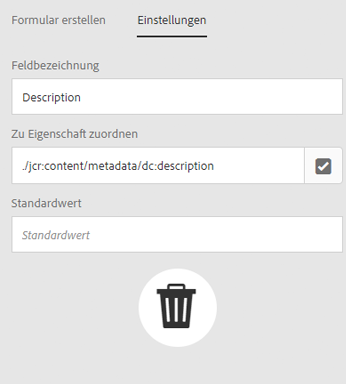

   Bearbeiten Sie die folgenden Eigenschaften für die Komponente **[!UICONTROL Beschreibung]**:

   * **[!UICONTROL Feldbezeichnung]**: Der Anzeigename der Metadateneigenschaft. Dieser dient lediglich als Referenz für den Benutzer.

   * **[!UICONTROL Zu Eigenschaft zuordnen]**: Der Wert dieser Eigenschaft liefert den relativen Pfad oder Namen zum Asset-Knoten, unter dem er im Repository gespeichert ist. Der Wert sollte immer mit `./` beginnen, da er anzeigt, dass sich der Pfad unter dem Knoten des Assets befindet.

   

   Der Wert, den Sie für **[!UICONTROL Zu Eigenschaft zuordnen]** angeben, wird als Eigenschaft unter dem Metadatenknoten des Assets gespeichert. Wenn Sie beispielsweise `./jcr:content/metadata/dc:desc` als Namen von **[!UICONTROL Zu Eigenschaft zuordnen]** angeben, speichert [!DNL Assets] den Wert `dc:desc` im Metadatenknoten des Assets.

   * **[!UICONTROL Standardwert]**: Mit dieser Eigenschaft können Sie einen Standardwert für die Metadatenkomponente hinzufügen. Wenn Sie beispielsweise „Meine Beschreibung“ angeben, wird dieser Wert der Eigenschaft `dc:desc` im Metadatenknoten des Assets zugewiesen.

   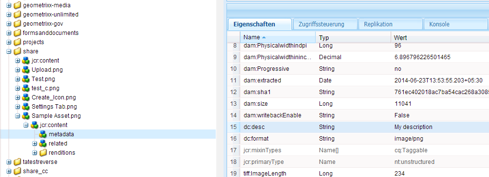

   >[!NOTE]
   >
   >Wenn Sie einer neuen Metadateneigenschaft (die noch nicht im Knoten `/jcr:content/metadata` vorhanden ist) einen Standardwert hinzufügen, werden die Eigenschaft und deren Wert nicht standardmäßig auf der Eigenschaftsseite des Assets angezeigt. Um die neue Eigenschaft auf der Seite [!UICONTROL Eigenschaften] der Assets anzuzeigen, ändern Sie das entsprechende Schemaformular.

1. (Optional) Fügen Sie dem Bearbeitungsformular auf der Registerkarte **[!UICONTROL Formular erstellen]** weitere Komponenten hinzu und konfigurieren Sie die zugehörigen Eigenschaften auf der Registerkarte **[!UICONTROL Einstellungen]**. Die folgenden Eigenschaften sind auf der Registerkarte **[!UICONTROL Formular erstellen]** verfügbar:

| Komponente | Eigenschaften |
| ----------------------------- | ----------------------------------------------------------------------- |
| [!UICONTROL Bereichs-Kopfzeile] | Feldbezeichnung,   Beschreibung |
| [!UICONTROL Einzelzeilentext] | Feldbezeichnung,   Zu Eigenschaft zuordnen,   Standardwert |
| [!UICONTROL Mehrwerttext] | Feldbezeichnung,   Zu Eigenschaft zuordnen,   Standardwert |
| [!UICONTROL Zahl] | Feldbezeichnung,   Zu Eigenschaft zuordnen,   Standardwert |
| [!UICONTROL Datum] | Feldbezeichnung,   Zu Eigenschaft zuordnen,   Standardwert |
| [!UICONTROL Standard-Tags] | Feldbezeichnung,   Zu Eigenschaft zuordnen,   Standardwert,   Beschreibung |

1. Klicken Sie auf **[!UICONTROL Fertig]**. Das Metadatenprofil wird der Liste der Profile auf der Seite **[!UICONTROL Metadatenprofile]** hinzugefügt. 

   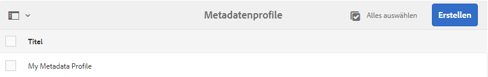

### Kopieren eines Metadatenprofils {#copying-a-metadata-profile}

1. Wählen Sie auf der Seite **[!UICONTROL Metadatenprofile]** ein Metadatenprofil aus, um eine Kopie davon zu erstellen.

   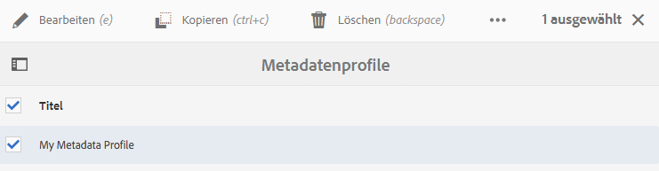

1. Klicken Sie in der Symbolleiste auf **[!UICONTROL Kopieren]** .
1. Geben Sie im Dialogfeld **[!UICONTROL Metadatenprofil kopieren]** einen Titel für die neue Kopie des Metadatenprofils ein.
1. Klicken Sie auf **[!UICONTROL Kopieren]**. Die Kopie des Metadatenprofils wird in der Liste mit Profilen auf der Seite **[!UICONTROL Metadatenprofile]** angezeigt.

   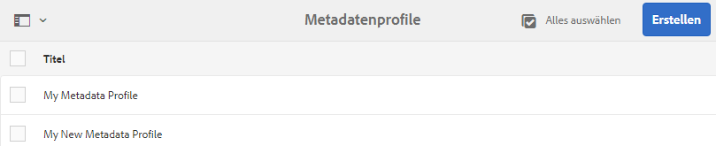

### Löschen eines Metadatenprofils {#deleting-a-metadata-profile}

1. Wählen Sie auf der Seite **[!UICONTROL Metadatenprofile]** das zu löschende Profil aus.

1. Klicken Sie in der Symbolleiste auf **[!UICONTROL Metadatenprofile löschen]** .
1. Klicken Sie im Dialogfeld auf **[!UICONTROL Löschen]**, um den Löschvorgang zu bestätigen. Das Metadatenprofil wird aus der Liste gelöscht.

<!-- TBD: Revisit to find out the correct config. and update these steps. When fixed, also o
These steps have been carried forward from old AEM versions. See https://helpx.adobe.com/experience-manager/6-2/assets/using/metadata-profiles.html#ApplyingaMetadataProfiletoFolders

### Configuration to apply a metadata profile globally {#apply-a-metadata-profile-globally}

In addition to applying a profile to a folder, you can also apply one globally so that any content uploaded into [!DNL Experience Manager] assets in any folder has the selected profile applied.

You can reprocess assets in a folder that already has an existing metadata profile that you later changed. See [Reprocessing assets in a folder after you have edited its processing profile](processing-profiles.md#reprocessing-assets).

To apply a metadata profile globally, follow these steps:

* Navigate to `https://[aem_server]:[port]/mnt/overlay/dam/gui/content/assets/foldersharewizard.html/content/dam` and apply the appropriate profile and click **[!UICONTROL Save]**.

  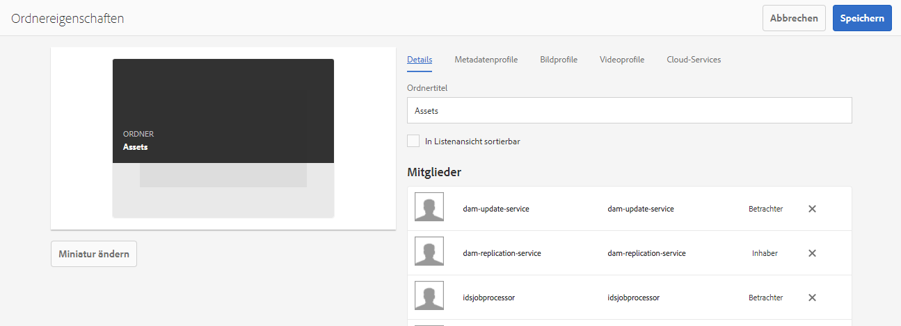

* In CRXDE Lite, navigate to the following node: `/content/dam/jcr:content`. Add the property `metadataProfile:/etc/dam/metadata/dynamicmedia/<name of metadata profile>` and click **[!UICONTROL Save All]**.

  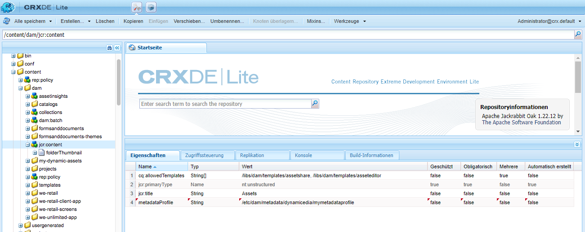
-->

## Metadatenschema für einen Ordner {#folder-metadata-schema}

Mit [!DNL Adobe Experience Manager Assets] können Sie Metadatenschemata für Asset-Ordner erstellen, die die auf Seiten mit Ordnereigenschaften angezeigten Layouts und Metadaten definieren.

### Hinzufügen von Ordner-Metadatenschema-Formularen  {#add-a-folder-metadata-schema-form}

Verwenden Sie den Editor für Metadatenschema-Formulare, um Metadatenschemata für Ordner zu erstellen und zu bearbeiten.

1. Wechseln Sie in der [!DNL Experience Manager]-Benutzeroberfläche zu **[!UICONTROL Tools]** > **[!UICONTROL Assets]** > **[!UICONTROL Ordner-Metadatenschemata]**.
1. Klicken Sie auf der Seite [!UICONTROL Ordner-Metadatenschema Forms] auf **[!UICONTROL Erstellen]**.
1. Geben Sie einen Namen für das Formular ein und klicken Sie auf **[!UICONTROL Erstellen]**. Das neue Schemaformular wird auf der Seite [!UICONTROL Schema Forms] aufgeführt.

### Bearbeiten von Ordner-Metadatenschema-Formularen   {#edit-folder-metadata-schema-forms}

Sie können neu erstellte oder bestehende Metadatenschema-Formulare bearbeiten. Hierzu zählen folgende Elemente:

* Registerkarten
* Formularelemente innerhalb von Registerkarten

Sie können diese Formularelemente einem Feld innerhalb eines Metdatenknotens im CRX-Repository zuordnen bzw. dafür konfigurieren. Sie können dem Metadatenschema-Formular neue Registerkarten oder Formularelemente hinzufügen.

1. Wählen Sie auf der Seite &quot;Schema Forms&quot;das erstellte Formular aus und wählen Sie dann in der Symbolleiste die Option **[!UICONTROL Bearbeiten]** aus.
1. Klicken Sie auf der Seite &quot;Ordner-Metadatenschema-Editor&quot;auf `+` , um dem Formular eine Registerkarte hinzuzufügen. Um die Registerkarte umzubenennen, klicken Sie auf den Standardnamen und geben Sie den neuen Namen unter **[!UICONTROL Einstellungen]** an.

   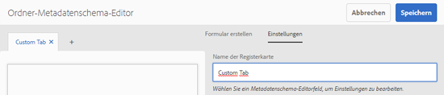

   Um weitere Registerkarten hinzuzufügen, klicken Sie auf `+`. Klicken Sie auf einer Registerkarte auf `X` , um sie zu löschen.

1. Fügen Sie in der aktiven Registerkarte eine oder mehrere Komponenten von der Registerkarte **[!UICONTROL Formular erstellen]** hinzu.

   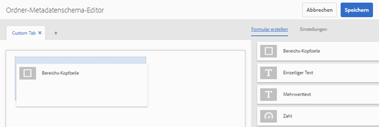

   Wenn Sie mehrere Registerkarten erstellen, klicken Sie auf eine bestimmte Registerkarte, um Komponenten hinzuzufügen.

1. Um eine Komponente zu konfigurieren, wählen Sie diese aus und ändern Sie ihre Eigenschaften auf der Registerkarte **[!UICONTROL Einstellungen]**.

   Löschen Sie ggf. eine Komponente über die Registerkarte **[!UICONTROL Einstellungen]**.

   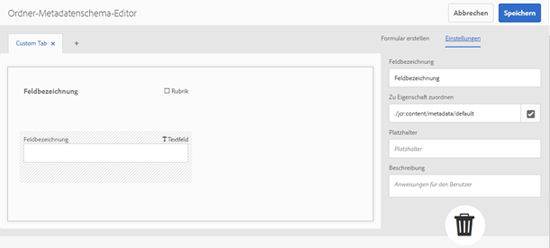

1. Klicken Sie in der Symbolleiste auf **[!UICONTROL Speichern]** , um die Änderungen zu speichern.

#### Komponenten zum Erstellen von Formularen   {#components-to-build-forms}

Die Registerkarte **[!UICONTROL Formular erstellen]** enthält Formularelemente, die Sie im Ordner-Metadatenschema-Formular verwenden. Die Registerkarte **[!UICONTROL Einstellungen]** enthält die Attribute für jedes Element, das Sie auf der Registerkarte **[!UICONTROL Formular erstellen]** auswählen. Im Folgenden finden Sie eine Liste der auf der Registerkarte **[!UICONTROL Formular erstellen]** verfügbaren Elemente:

| Komponentenname | Beschreibung |
|---|---|
| [!UICONTROL Bereichs-Kopfzeile] | Fügen Sie eine Abschnittsüberschrift für eine Liste allgemeiner Komponenten hinzu. |
| [!UICONTROL Einzelzeilentext] | Fügen Sie eine einzeilige Texteigenschaft hinzu. Diese wird als Zeichenfolge gespeichert. |
| [!UICONTROL Mehrwerttext] | Fügen Sie eine Texteigenschaft mit mehreren Werten hinzu. Diese wird als Zeichenfolgen-Array gespeichert. |
| [!UICONTROL Zahl] | Fügen Sie eine Zahlenkomponente hinzu. |
| [!UICONTROL Datum] | Fügen Sie eine Datumskomponente hinzu. |
| [!UICONTROL Dropdown] | Fügen Sie eine Dropdown-Liste hinzu. |
| [!UICONTROL Standard-Tags] | Fügen Sie ein Tag hinzu. |
| [!UICONTROL Ausgeblendetes Feld] | Fügen Sie ein ausgeblendetes Feld hinzu. Dieses wird beim Speichern des Assets als POST-Parameter gesendet. |

#### Bearbeiten von Formularelementen   {#editing-form-items}

Um die Eigenschaften von Formularelementen zu bearbeiten, klicken Sie auf die Komponente und bearbeiten Sie alle oder eine Untergruppe der folgenden Eigenschaften auf der Registerkarte **[!UICONTROL Einstellungen]**.

**[!UICONTROL Feldbezeichnung]**: Der Name der Metadateneigenschaft, der auf der Eigenschaftenseite des Assets angezeigt wird.

**[!UICONTROL Zu Eigenschaft zuordnen]**: Diese Eigenschaft gibt den relativen Pfad des Ordnerknotens im CRX-Repository an, wo das Element gespeichert ist. Sie beginnt mit „**./**“. Dies zeigt an, dass sich der Pfad unter dem Knoten des Ordners befindet.

Im Folgenden finden Sie die gültigen Werte für diese Eigenschaft:

* `./jcr:content/metadata/dc:title`: Speichert den Wert im Metadatenknoten des Ordners als Eigenschaft `dc:title`.

* `./jcr:created`: Zeigt die Eigenschaft „JCR“ im Knoten des Ordners an. Wenn Sie diese Eigenschaften in CRXDE konfigurieren, empfiehlt Adobe, dass Sie sie mit „Bearbeitung deaktivieren“ markieren, da sie geschützt sind. Andernfalls tritt der Fehler `Asset(s) failed to modify` auf, wenn Sie die Eigenschaften des Assets speichern.

Um zu gewährleisten, dass die Komponente ordnungsgemäß im Metadatenschema-Formular angezeigt wird, fügen Sie dem Eigenschaftenpfad keine Leerzeichen hinzu.

**[!UICONTROL JSON-Pfad]**: Verwenden Sie diese Eigenschaft, um den Pfad der JSON-Datei anzugeben, in der Sie Schlüssel-Wert-Paare für Optionen speichern.

**[!UICONTROL Platzhalter]**: Geben Sie mit dieser Eigenschaft relevanten Platzhaltertext zur Metadateneigenschaft an.

**[!UICONTROL Wahlen]**: Mit dieser Eigenschaft legen Sie Optionen in einer Liste fest.

**[!UICONTROL Beschreibung]**: Mit dieser Eigenschaft können Sie eine kurze Beschreibung für die Metadatenkomponente hinzufügen.

**[!UICONTROL Klasse]**: Objektklasse, der die Eigenschaft zugeordnet ist.

### Löschen von Ordner-Metadatenschema-Formularen   {#delete-folder-metadata-schema-forms}

Sie können Ordner-Metadatenschema-Formulare über die Seite „Ordner-Metadatenschema-Formulare“ löschen. Um ein Formular zu löschen, wählen Sie es aus und klicken Sie in der Symbolleiste auf die Option Löschen .

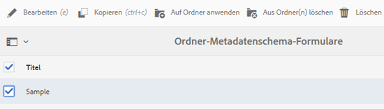

### Zuordnen eines Ordner-Metadatenschemas {#assign-a-folder-metadata-schema}

Sie können ein Ordner-Metadatenschema über die Seite „Ordner-Metadatenschema-Formulare“ oder bei der Ordnererstellung einem Ordner zuordnen.

Wenn Sie ein Metadatenschema für einen Ordner konfigurieren, wird der Pfad zum Schemaformular in der Eigenschaft `folderMetadataSchema` des Ordnerknotens unter `./jcr:content` gespeichert.

#### Zuweisen eines Schemas über die Seite „Ordner-Metadatenschema“   {#assign-to-a-schema-from-the-folder-metadata-schema-page}

1. Wechseln Sie in der [!DNL Experience Manager]-Benutzeroberfläche zu **[!UICONTROL Tools]** > **[!UICONTROL Assets]** > **[!UICONTROL Ordner-Metadatenschemata]**.
1. Wählen Sie auf der Seite „Ordner-Metadatenschema-Formulare“ das Schemaformular aus, das Sie auf einen Ordner anwenden möchten.
1. Klicken Sie in der Symbolleiste auf **[!UICONTROL Auf Ordner anwenden]**.

1. Wählen Sie den Ordner aus, auf den das Schema angewendet werden soll, und klicken Sie dann auf **[!UICONTROL Apply]**. Wenn bereits ein Metadatenschema auf den Ordner angewendet wurde, wird eine Warnung dazu angezeigt, dass das bestehende Schema überschrieben wird. Klicken Sie auf **[!UICONTROL Überschreiben]**.
1. Öffnen Sie die Metadateneigenschaften für den Ordner, auf den Sie das Schema angewendet haben.

   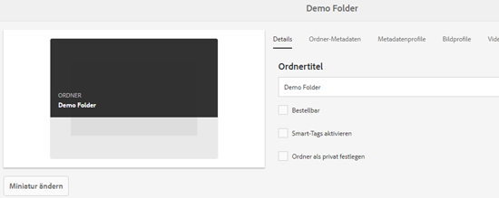

   Um die Ordner-Metadatenfelder anzuzeigen, klicken Sie auf die Registerkarte **[!UICONTROL Ordnermetadaten]** .

   

#### Zuweisen eines Schemas bei der Ordnererstellung {#assign-a-schema-when-creating-a-folder}

Sie können Ordner-Metadatenschemata auch beim Erstellen eines Ordners zuweisen. Wenn bereits mindestens ein Ordner-Metadatenschema im System vorhanden ist, wird eine zusätzliche Liste im Dialogfeld **[!UICONTROL Ordner erstellen]** angezeigt. Sie können das gewünschte Schema auswählen. Standardmäßig ist kein Schema ausgewählt.

1. Klicken Sie in der [!DNL Experience Manager Assets] -Benutzeroberfläche in der Symbolleiste auf **[!UICONTROL Erstellen]** .
1. Geben Sie einen Titel und einen Namen für den Ordner an.
1. Wählen Sie in der Liste „Ordner-Metadatenschema“ das gewünschte Schema aus. Klicken Sie dann auf **[!UICONTROL Erstellen]**.

   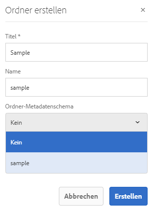

1. Öffnen Sie die Metadateneigenschaften für den Ordner, auf den Sie das Schema angewendet haben.
1. Um die Ordner-Metadatenfelder anzuzeigen, klicken Sie auf die Registerkarte **[!UICONTROL Ordnermetadaten]** .

### Verwenden des Ordner-Metadatenschemas {#use-the-folder-metadata-schema}

Öffnen Sie die Eigenschaften für einen Ordner, der mit einem Ordner-Metadatenschema konfiguriert wurde. Die Registerkarte **[!UICONTROL Ordner-Metadaten]** wird im Ordner [!UICONTROL Eigenschaften] angezeigt. Um das Ordner-Metadatenschema-Formular anzuzeigen, wählen Sie diese Registerkarte aus.

Geben Sie Metadatenwerte in die verschiedenen Felder ein und klicken Sie auf **[!UICONTROL Speichern]**, um die Werte zu speichern. Die angegebenen Werte werden im Ordnerknoten im CRX-Repository gespeichert.

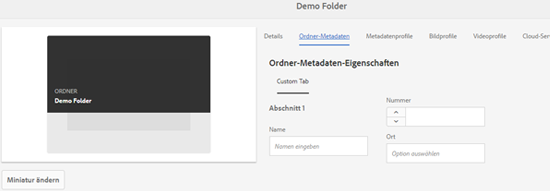

## Tipps und Einschränkungen {#best-practices-limitations}

* Um Metadaten in benutzerdefinierte Namespaces zu importieren, registrieren Sie zunächst die Namespaces.
* Der Eigenschaftenwähler zeigt Eigenschaften an, die in Schema-Editoren und Suchformularen verwendet werden. Der Eigenschaftswähler wählt keine Metadateneigenschaften aus einem Asset aus.
* Möglicherweise gibt es bereits vorhandene Metadatenprofile seit dem Upgrade auf [!DNL Experience Manager] 6.5. Wenn Sie ein solches Profil im Ordner [!UICONTROL Eigenschaften] auf der Registerkarte [!UICONTROL Metadatenprofile] anwenden, werden die Metadatenformularfelder nicht angezeigt. Wenn Sie jedoch ein neu erstelltes Metadatenprofil anwenden, werden die Formularfelder angezeigt, sind aber nicht erwartungsgemäß verfügbar. Es gibt keinen Funktionsverlust. Wenn Sie jedoch die (nicht verfügbaren) Formularfelder anzeigen möchten, bearbeiten und speichern Sie die vorhandenen Metadatenprofile.

>[!MORELIKETHIS]
>
>* [Metadatenkonzepte und -verständnisse](metadata-concepts.md).
>* [Bearbeiten von Metadateneigenschaften von mehreren Sammlungen](manage-collections.md#editing-collection-metadata-in-bulk).
>* [Import und Export von Metadaten in Experience Manager Assets](https://experienceleague.adobe.com/docs/experience-manager-learn/assets/metadata/metadata-import-feature-video-use.html).
>* [Profile zur Verarbeitung von Metadaten, Bildern und Videos](processing-profiles.md).
>* [Best Practices zum Organisieren digitaler Assets für die Verwendung von Verarbeitungsprofilen](/help/assets/organize-assets.md).
>* [XMP-Writeback](/help/assets/xmp-writeback.md).

