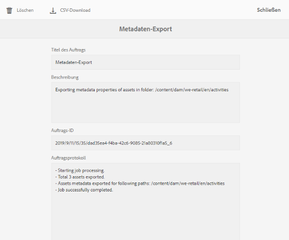

# Stapelweises Importieren und Exportieren von Asset-Metadaten  {#import-and-export-asset-metadata-in-bulk}

[!DNL Adobe Experience Manager Assets]Mit können Sie Asset-Metadaten mithilfe einer CSV-Datei in Massen importieren. Sie können für die kürzlich hochgeladenen Assets oder die vorhandenen Assets eine Massenaktualisierung durchführen, indem Sie eine CSV-Datei importieren. Außerdem können Sie Asset-Metadaten von Drittanbietersystemen mithilfe des CSV-Formats in Batches aufnehmen.

## Importieren von Metadaten   {#import-metadata}

Der Metadaten-Import erfolgt asynchron und beeinträchtigt nicht die Systemleistung. Die gleichzeitige Aktualisierung der Metadaten für mehrere Assets kann aufgrund der XMP-Writeback-Aktivität ressourcenintensiv sein, wenn das Flag für die Arbeitsabläufe gesetzt ist. Planen Sie einen solchen Import während Zeiten geringer Servernutzung, damit die Leistung anderer Benutzer nicht beeinträchtigt wird.

>[!NOTE]
>
>Um Metadaten in benutzerdefinierte Namespaces zu importieren, registrieren Sie zunächst die Namespaces.

1. Navigate to the [!DNL Assets] user interface, and click **[!UICONTROL Create]** from the toolbar.
1. Wählen Sie aus dem Menü **[!UICONTROL Metadaten]** aus.
1. In the **[!UICONTROL Metadata Import]** page, click **[!UICONTROL Select File]**. Wählen Sie die CSV-Datei mit den Metadaten aus.
1. Geben Sie die folgenden Parameter an. Siehe Beispiel für eine CSV-Datei unter [metadata-import-sample-file.csv](assets/metadata-import-sample-file.csv).

   | Metadaten-Importparameter | Beschreibung |
   |:---|:---|
   | [!UICONTROL Batch-Größe] | Anzahl der Assets in einem Batch, für die Metadaten importiert werden sollen. Der Standardwert ist 50. Der Wert darf maximal 100 betragen. |
   | [!UICONTROL Feldtrennzeichen] | Der Standardwert ist `,` (ein Komma). Sie können jedoch ein beliebiges anderes Zeichen eingeben. |
   | [!UICONTROL Mehrfachtrennzeichen] | Trennzeichen für Metadatenwerte. Der Standardwert ist `|`. |
   | [!UICONTROL Workflows starten] | Lautet standardmäßig „False“. When set to `true` and default Launcher settings are in effect for the [!UICONTROL DAM Metadata WriteBack] workflow (that writes metadata to the binary XMP data). Die Aktivierung von Start-Workflows verlangsamt das System. |
   | [!UICONTROL Asset-Pfad-Spaltenname] | Definiert den Namen der Spalte in der CSV-Datei, die die Assets enthält. |

1. Tippen oder klicken Sie in der Symbolleiste auf **[!UICONTROL Importieren]**. After the metadata is imported, a notification is displayed in [!UICONTROL Notification] inbox.

1. Um den korrekten Import zu überprüfen, navigieren Sie zur Seite &quot; [!UICONTROL Eigenschaften] &quot;eines Assets und überprüfen Sie die Werte in den Feldern.

Um beim Importieren von Metadaten Datum und Zeitstempel hinzuzufügen, verwenden Sie das `YYYY-MM-DDThh:mm:ss.fff-00:00` Format für Datum und Uhrzeit. Datum und Uhrzeit werden durch `T`, `hh` Stunden im 24-Stunden-Format, `fff` Nanosekunden und Zeitzonenversatz getrennt `-00:00` angegeben. Zum Beispiel `2020-03-26T11:26:00.000-07:00` ist der 26. März 2020 um 11:26:00 Uhr PST-Zeit.

>[!CAUTION]
>
>Stimmt das Datumsformat nicht überein, `YYYY-MM-DDThh:mm:ss.fff-00:00`werden die Datumswerte nicht eingestellt. Die Datumsformate der exportierten Metadaten-CSV-Datei haben das Format `YYYY-MM-DDThh:mm:ss-00:00`. Wenn Sie es importieren möchten, konvertieren Sie es in das akzeptable Format, indem Sie den von `fff`Ihnen angegebenen Nanosekunden-Wert hinzufügen.

## Export metadata {#export-metadata}

Sie können Metadaten für mehrere Assets in ein CSV-Format exportieren. Die Metadaten werden asynchron exportiert, sodass der Export die Systemleistung nicht beeinträchtigt. To export metadata, [!DNL Experience Manager] traverses through the properties of the asset node `jcr:content/metadata` and its child nodes and exports the metadata properties in a CSV file.

Einige Anwendungsfälle für den Massenexport von Metadaten:

* Importieren Sie die Metadaten in ein Drittanbietersystem, wenn Sie Assets migrieren.
* Geben Sie Asset-Metadaten für ein breiteres Projektteam frei.
* Testen oder prüfen Sie die Metadaten auf Ihre Konformität.
* Externalisieren Sie die Metadaten, um sie separat zu lokalisieren.

1. Wählen Sie einen Asset-Ordner aus, der Assets enthält, für die Sie Metadaten exportieren möchten. Wählen Sie in der Symbolleiste **[!UICONTROL Metadaten exportieren]** aus.

1. In the [!UICONTROL Metadata Export] dialog, specify a name for the CSV file. Um Metadaten von Assets in Unterordnern zu exportieren, wählen Sie **[!UICONTROL Assets in Unterordnern einschließen]**.

   

1. Wählen Sie die gewünschten Optionen aus. Geben Sie einen Dateinamen und ggf. ein Datum an.

1. Geben Sie im Feld **[!UICONTROL Zu exportierende Eigenschaften]** an, ob Sie alle oder nur bestimmte Eigenschaften exportieren wollen. Wenn Sie für den Export „Selektive Eigenschaften“ auswählen, fügen Sie die gewünschten Eigenschaften hinzu.

1. From the toolbar, click **[!UICONTROL Export]**. Sie erhalten eine Meldung, die bestätigt, dass die Metadaten exportiert wurden. Schließen Sie die Meldung.

1. Öffnen Sie die Posteingangsbenachrichtigung für den Exportauftrag. Wählen Sie den Auftrag aus und klicken Sie in der Symbolleiste auf **[!UICONTROL Öffnen]**. To download the CSV file with the metadata, click **[!UICONTROL CSV Download]** from the toolbar. Klicken Sie auf **[!UICONTROL Schließen]**.

   

   *Abbildung: Dialogfeld zum Herunterladen der CSV-Datei mit Metadaten, die stapelweise exportiert wurden.*

## Best Practices, Einschränkungen und Tipps {#best-practices-limitations-tips}

* Die CSV-Datei zum Importieren von Asset-Metadaten ist in einem sehr spezifischen Format verfügbar. Um Arbeitsaufwand und Zeit zu sparen und unbeabsichtigte Fehler zu vermeiden, können Sie mit dem Erstellen der CSV-Datei das Format einer exportierten CSV-Datei verwenden.
* Beim Importieren von Metadaten mit einer CSV-Datei ist das erforderliche Datumsformat `YYYY-MM-DDThh:mm:ss.fff-00:00`erforderlich. Wenn ein anderes Format verwendet wird, werden die Datumswerte nicht festgelegt. Die Datumsformate der exportierten Metadaten-CSV-Datei haben das Format `YYYY-MM-DDThh:mm:ss-00:00`. Wenn Sie es importieren möchten, konvertieren Sie es in das akzeptable Format, indem Sie den von `fff`Ihnen angegebenen Nanosekunden-Wert hinzufügen.
* Um Metadaten in benutzerdefinierte Namespaces zu importieren, registrieren Sie zunächst die Namespaces.

>[!MORELIKETHIS]
>
>* [Metadaten-Import und -Export in Experience Manager-Assets](https://docs.adobe.com/content/help/en/experience-manager-learn/assets/metadata/metadata-import-feature-video-use.html)

