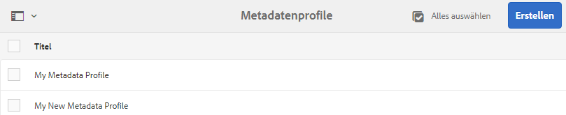

# Metadatenprofile {#metadata-profiles}

Mit einem Metadaten-Profil können Sie Standardmetadaten auf Assets in einem Ordner anwenden. Erstellen Sie ein Metadaten-Profil und wenden Sie es auf einen Ordner an. Alle Assets, die Sie anschließend in den Ordner hochladen, übernehmen die Standardmetadaten, die Sie im Metadaten-Profil konfiguriert haben.

## Hinzufügen eines Metadatenprofils {#adding-a-metadata-profile}

1. Navigieren Sie zu **[!UICONTROL Extras > Assets > Metadaten-Profil]** und tippen Sie auf **[!UICONTROL Erstellen]**.
1. Enter a title for the Metadata Profile, for example Sample Metadata, and tap **[!UICONTROL Create]**. The [!UICONTROL Edit Form] for the metadata profile is displayed.

   

1. Klicken Sie auf eine Komponente und konfigurieren Sie deren Eigenschaften auf der Registerkarte **[!UICONTROL Einstellungen]**. Klicken Sie beispielsweise auf die Komponente **[!UICONTROL Beschreibung]** und bearbeiten Sie die zugehörigen Eigenschaften.

   

   Bearbeiten Sie die folgenden Eigenschaften für die Komponente **[!UICONTROL Beschreibung]**:

   * **[!UICONTROL Feldbeschriftung]**: Der Anzeigename der Metadateneigenschaft. Dieser dient lediglich als Referenz für den Benutzer.

   * **[!UICONTROL Zu Eigenschaft]** zuordnen: Der Wert dieser Eigenschaft stellt den relativen Pfad/Namen zu dem Asset-Knoten bereit, in dem er im Repository gespeichert wird. Der Wert sollte immer mit dem Beginn übereinstimmen, `./` da er angibt, dass sich der Pfad unter der Node des Assets befindet.
   

   Der Wert, den Sie für **[!UICONTROL Zu Eigenschaft zuordnen]** angeben, wird als Eigenschaft unter dem Metadatenknoten des Assets gespeichert. Beispiel: Wenn Sie `/jcr:content/metadata/dc:desc` als Name von **[!UICONTROL Zu Eigenschaft zuordnen]** angeben, wird der Wert `dc:desc` von AEM Assets im Metadatenknoten des Assets gespeichert.

   * **[!UICONTROL Standardwert]**: Mit dieser Eigenschaft können Sie einen Standardwert für die Metadatenkomponente hinzufügen. Wenn Sie beispielsweise „Meine Beschreibung“ angeben, wird dieser Wert der Eigenschaft `dc:desc` im Metadatenknoten des Assets zugewiesen.
   

   >[!NOTE]
   >
   >Wenn Sie einer neuen Metadateneigenschaft (die noch nicht im Knoten `/jcr:content/metadata` vorhanden ist) einen Standardwert hinzufügen, werden die Eigenschaft und deren Wert nicht standardmäßig auf der Eigenschaftsseite des Assets angezeigt. To view the new property on the assets&#39; [!UICONTROL Properties] page, modify the corresponding schema form.

1. (Optional) Fügen Sie dem Bearbeitungsformular auf der Registerkarte **[!UICONTROL Formular erstellen]** weitere Komponenten hinzu und konfigurieren Sie die zugehörigen Eigenschaften auf der Registerkarte **[!UICONTROL Einstellungen]**. Die folgenden Eigenschaften sind auf der Registerkarte **[!UICONTROL Formular erstellen]** verfügbar:

| Komponente | Eigenschaften |
|---|---|
| [!UICONTROL Bereichs-Kopfzeile] | Field Label,   Description |
| [!UICONTROL Einzelzeilentext] | Field Label,   Map to property,   Default Value |
| [!UICONTROL Mehrwerttext] | Field Label,   Map to property,   Default Value |
| [!UICONTROL Zahl] | Field Label,   Map to property,   Default Value |
| [!UICONTROL Datum] | Field Label,   Map to property,   Default Value |
| [!UICONTROL Standard-Tags] | Field Label,   Map to property,   Default Value,   Description |

1. Klicken oder tippen Sie auf **[!UICONTROL Fertig]**. Das Metadatenprofil wird der Liste der Profile auf der Seite **[!UICONTROL Metadatenprofile]** hinzugefügt. 

   

## Kopieren eines Metadatenprofils {#copying-a-metadata-profile}

1. From the **[!UICONTROL Metadata Profiles]** page, select a metadata profile to make a copy of it.

   

1. Tippen Sie in der Symbolleiste auf **[!UICONTROL Kopieren]**.
1. Geben Sie im Dialogfeld **[!UICONTROL Metadatenprofil kopieren]** einen Titel für die neue Kopie des Metadatenprofils ein.
1. Tippen Sie auf **[!UICONTROL Kopieren]**. Die Kopie des Metadatenprofils wird in der Liste mit Profilen auf der Seite **[!UICONTROL Metadatenprofile]** angezeigt.

   

## Löschen eines Metadatenprofils {#deleting-a-metadata-profile}

1. Wählen Sie auf der Seite **[!UICONTROL Metadatenprofile]** das zu löschende Profil aus.

   

1. Ta[] **[!UICONTROL Delete Metadata Profiles]** in the toolbar.
1. Klicken Sie im Dialogfeld auf **[!UICONTROL Löschen]**, um den Löschvorgang zu bestätigen. Das Metadatenprofil wird aus der Liste gelöscht.

## Anwenden eines Metadatenprofils auf Ordner {#applying-a-metadata-profile-to-folders}

Wenn Sie ein Metadatenprofil zu einem Ordner zuweisen, erben automatisch alle Unterordner das Profil vom übergeordneten Ordner. Demzufolge können Sie einem Ordner nur ein Metadatenprofil zuweisen. Daher sollten Sie die Ordnerstruktur sorgfältig planen, in der Sie Assets hochladen, speichern, verwenden und archivieren.

Wenn Sie einem Ordner ein anderes Metadatenprofil zugewiesen haben, überschreibt das neue das vorherige Profil. Die zuvor vorhandenen Ordner-Assets verbleiben unverändert. Das neue Profil wird auf die Assets angewendet, die dem Ordner später hinzugefügt werden.

Ordner, denen ein Profil zugewiesen wurde, werden in der Benutzeroberfläche durch den Namen des Profils angegeben, der im Kartennamen angezeigt wird.

Sie können Metadatenprofile auf bestimmte Ordner oder global auf alle Assets anwenden.

Sie können Assets in einem Ordner erneut verarbeiten, der bereits über ein vorhandenes Metadatenprofil verfügt, das Sie nachträglich geändert haben. Informationen hierzu finden Sie unter [Erneutes Verarbeiten von Assets in einem Ordner nach Bearbeitung des zugehörigen Verarbeitungsprofils](processing-profiles.md#reprocessing-assets).

### Anwenden von Metadatenprofilen auf bestimmte Ordner {#applying-metadata-profiles-to-specific-folders}

Sie können ein Metadatenprofil über das Menü **[!UICONTROL Werkzeuge]** oder, falls Sie sich im Ordner befinden, über **[!UICONTROL Eigenschaften]** auf einen Ordner anwenden. In diesem Abschnitt wird beschrieben, wie Sie Metadatenprofile auf beide Arten auf Ordner anwenden.

Ordner, denen bereits ein Profil zugewiesen wurde, sind dadurch gekennzeichnet, dass der Name des Profils direkt unterhalb des Ordnernamens angezeigt wird.

Sie können Assets in einem Ordner erneut verarbeiten, der bereits über ein vorhandenes Videoprofil verfügt, das Sie nachträglich geändert haben. Informationen hierzu finden Sie unter [Erneutes Verarbeiten von Assets in einem Ordner nach Bearbeitung des zugehörigen Verarbeitungsprofils](processing-profiles.md#reprocessing-assets).

#### Anwenden von Metadatenprofilen auf Ordner über die Benutzeroberfläche „Profile“ {#applying-metadata-profiles-to-folders-from-profiles-user-interface}

Gehen Sie wie folgt vor, um Metadaten-Profil anzuwenden:

1. Tippen Sie auf das AEM-Logo und navigieren Sie zu **[!UICONTROL Tools > Assets > Videoprofile]**.
1. Wählen Sie ein Metadatenprofil aus, das Sie auf einen oder mehrere Ordner anwenden möchten.

   

1. Tippen Sie auf **[!UICONTROL Metadatenprofil auf Ordner anwenden]** und wählen Sie mindestens einen Ordner aus, den Sie verwenden möchten, um neu hochgeladene Assets zu empfangen. Tippen Sie anschließend auf **[!UICONTROL Fertig]**. Ordner, denen bereits ein Profil zugewiesen wurde, sind dadurch gekennzeichnet, dass der Name des Profils direkt unterhalb des Ordnernamens angezeigt wird.

#### Anwenden von Metadatenprofilen auf Ordner aus „Eigenschaften“ {#applying-metadata-profiles-to-folders-from-properties}

1. Tippen Sie auf der linken Leiste auf **[!UICONTROL Assets]** und navigieren Sie dann zu dem Ordner, auf den Sie ein Metadatenprofil anwenden möchten.
1. Tippen oder klicken Sie im Ordner auf das Häkchen, um den Ordner auszuwählen, und tippen oder klicken Sie auf **[!UICONTROL Eigenschaften]**.

1. Select the **[!UICONTROL Metadata Profiles]** tab and select the profile from the drop-down menu and tap **[!UICONTROL Save]**.

   

   Ordner, denen bereits ein Profil zugewiesen wurde, sind dadurch gekennzeichnet, dass der Name des Profils direkt unterhalb des Ordnernamens angezeigt wird.

### Globales Anwenden eines Metadatenprofils {#applying-a-metadata-profile-globally}

Profile können nicht nur auf einzelne Ordner, sondern auch global angewendet werden. Dann wird allen Inhalten, die Sie in AEM-Assets in beliebigen Ordnern hochladen, das ausgewählte Profil zugeordnet.

Sie können Assets in einem Ordner erneut verarbeiten, der bereits über ein vorhandenes Metadatenprofil verfügt, das Sie nachträglich geändert haben. Informationen hierzu finden Sie unter [Erneutes Verarbeiten von Assets in einem Ordner nach Bearbeitung des zugehörigen Verarbeitungsprofils](processing-profiles.md#reprocessing-assets).

**Um ein Metadatenprofil global anzuwenden, führen Sie einen der folgenden Schritte aus:**

* Navigieren Sie zu `https://[aem_server]:[port]/mnt/overlay/dam/gui/content/assets/foldersharewizard.html/content/dam` und wenden Sie das entsprechende Profil an und klicken Sie auf **[!UICONTROL Speichern]**.

   

* Navigieren Sie in CRXDE Lite zum folgenden Knoten: `/content/dam/jcr:content`. Fügen Sie die Eigenschaft `metadataProfile:/etc/dam/metadata/dynamicmedia/<name of metadata profile>` hinzu und tippen Sie auf **Alle speichern**.

   

## Remove a metadata profile from folders {#removing-a-metadata-profile-from-folders}

Wenn Sie ein Metadatenprofil aus einem Ordner entfernen, erben automatisch alle Unterordner das Entfernen des Profils aus dem übergeordneten Ordner. Die Verarbeitung der Dateien, die in den Ordnern stattgefunden hat, verbleibt jedoch intakt.

Sie können ein Metadatenprofil aus einem Ordner im Menü **[!UICONTROL Tools]** entfernen. Wenn Sie sich im Ordner befinden, ist dies über die **[!UICONTROL Eigenschaften]** möglich. In diesem Abschnitt wird beschrieben, wie Sie Metadatenprofile auf beide Arten aus Ordnern entfernen.

### Remove metadata profiles from folders via Profiles user interface {#removing-metadata-profiles-from-folders-via-profiles-user-interface}

1. Tippen oder klicken Sie auf das AEM-Logo und navigieren Sie zu **[!UICONTROL Tools > Assets > Metadatenprofile]**.
1. Wählen Sie ein Metadatenprofil aus, das Sie aus einem oder mehreren Ordnern entfernen möchten.
1. Tippen Sie auf **[!UICONTROL Metadatenprofil aus Ordner(n) entfernen]** und wählen Sie einen oder mehrere Ordner aus, aus dem bzw. denen ein Profil entfernt werden soll, und tippen Sie dann auf **[!UICONTROL Fertig]**.

   Sie können bestätigen, dass das Metadatenprofil nicht länger auf einen Ordner angewendet wird, da der Name in diesem Fall nicht mehr unter dem Ordner angezeigt wird.

### Remove metadata profiles from folders via Properties {#removing-metadata-profiles-from-folders-via-properties}

1. Tippen Sie auf das AEM-Logo und navigieren Sie zu **[!UICONTROL Assets]** und dann in den Ordner, aus dem Sie ein Metadatenprofil entfernen möchten.
1. Tippen Sie im Ordner auf das Kontrollkästchen, um es zu aktivieren, und tippen Sie anschließend auf **[!UICONTROL Eigenschaften]**.
1. Wählen Sie die Registerkarte **[!UICONTROL Metadatenprofile]** aus. Wählen Sie anschließend **[!UICONTROL Keine]** aus dem Dropdown-Menü aus und klicken Sie auf **[!UICONTROL Speichern]**. Ordner, denen bereits ein Profil zugewiesen wurde, sind dadurch gekennzeichnet, dass der Name des Profils direkt unterhalb des Ordnernamens angezeigt wird.

>[!MORELIKETHIS]
>
>* [Profile zur Verarbeitung von Metadaten, Bildern und Videos](processing-profiles.md)
>* [Best Practices zum Organisieren digitaler Assets für die Verwendung von Profilen zur Verarbeitung](/help/assets/organize-assets.md)

