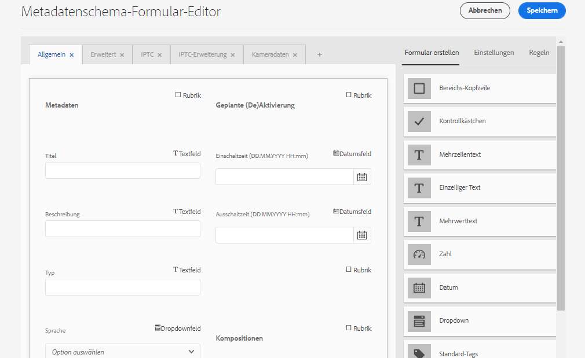

# Metadatenschemata {#metadata-schemas}

Organisationen verfügen über ein Metadatenmodell, das die Ermittlung, Verwendung, Interoperabilität usw. von Assets verbessert. Die Anwendung für korrekte Metadaten ist für die Aufrechterhaltung von metadatenbasierten Workflows und Prozessen ungefährlich. Um die unternehmensweite Metadatenstrategie und -standards einzuhalten, können Sie Metadaten-Schema verwenden, die DAM-Benutzern das Ausrichten erleichtern. Adobe Experience Manager bietet einfache und flexible Methoden zum Erstellen, Verwalten und Anwenden von Metadaten-Schemas.

In [!DNL Adobe Experience Manager Assets]Schemas sind spezielle Felder enthalten, in die die spezifischen Informationen eingetragen werden sollen. Es enthält außerdem Layoutinformationen, um Metadatenfelder benutzerfreundlich anzuzeigen. Zu den Metadateneigenschaften gehören Titel, Beschreibung, MIME-Typen, Tags und mehr. You can use the [!UICONTROL Metadata Schema Forms] editor to modify the existing schemas or add custom metadata schemas.

Gehen Sie wie folgt vor, um die Eigenschaftsseite für ein Asset Ansicht und zu bearbeiten:

1. Klicken Sie auf das Symbol &quot; **[!UICONTROL Ansichten-Eigenschaften]** &quot;in den Schnellaktionen auf der Asset-Kachel in der Ansicht &quot;Karte&quot;.

   

   Alternatively, select an asset and then click or tap the [!UICONTROL Properties] icon from the toolbar.

1. Sie können verschiedene Metadateneigenschaften unter den verfügbaren Registerkarten bearbeiten. However, you cannot modify the asset [!UICONTROL Type] in the [!UICONTROL Basic] tab of properties page.

   

*Abbildung: Registerkarte &quot;Einfach&quot;bei Asset-[!UICONTROL Eigenschaften].*

Verwenden Sie zum Ändern des MIME-Typs für ein Asset ein benutzerdefiniertes Metadatenschema-Formular oder ändern Sie ein vorhandenes Formular. See [Edit Metadata Schema Forms](/help/assets/metadata-schemas.md#edit-metadata-schema-forms) for more information. Wenn Sie das Metadatenschema für einen bestimmten MIME-Typ ändern, werden das Layout der Eigenschaftenseite für Assets mit dem aktuellen MIME-Typ und alle untergeordneten Asset-Typen geändert. Durch die Bearbeitung des jpeg-Schemas unter `default/image` wird nur das Metadaten-Layout (Asset-Eigenschaften) für Assets mit dem MIME-Typ `image/jpeg` bearbeitet. Wenn Sie allerdings das „default“-Schema ändern, wird dadurch das Metadaten-Layout für alle Asset-Typen geändert.

## Metadaten-Schemaformulare {#default-metadata-schema-forms}

Um eine Liste von Formularen/Vorlagen Ansicht, navigieren Sie in der [!DNL Experience Manager] Benutzeroberfläche zu **[!UICONTROL Werkzeuge]** > **[!UICONTROL Assets]** > **[!UICONTROL Metadaten-Schema]**.

[!DNL Experience Manager] stellt die folgenden Metadaten-Schema-Formularvorlagen bereit:

| Vorlagen |  | Beschreibung |
|---|---|---|
| [!UICONTROL default] |  | Dies ist das Basisformular für Assets. |
|  | The following child forms inherit the properties of the [!UICONTROL default] form: |  |
|  | <ul><li> [!UICONTROL image]</li></ul> | Schema-Formular für Assets mit dem MIME-Typ &quot;image&quot;, z. B. image/jpeg, image/png usw.   Das [!UICONTROL Bildformular] verfügt über die folgenden Vorlagen für untergeordnete Formulare: <ul><li> [!UICONTROL jpeg]: Schema-Formular für Assets mit [!UICONTROL JPEG]-Untertyp.</li> <li>[!UICONTROL tiff]: Schema-Formular für die Assets mit Untertyp [!UICONTROL tiff].</li></ul> |
|  | <ul><li> [!UICONTROL Anwendung]</li></ul> | Schema-Formular für Assets mit MIME-Typ &quot;application&quot;, z. B. application/pdf, application/zip usw.  [!UICONTROL pdf]: Schema-Formular für Assets mit dem Untertyp pdf. |
|  | <ul><li>[!UICONTROL Video]</li></ul> | Schemaformular für Assets mit dem MIME-Typ „video“, beispielsweise video/avi, video/mp4 usw. |
| [!UICONTROL collection] |  | Schema-Formular für Sammlungen. |
| [!UICONTROL contentfragment] |  | Schema-Formular für Inhaltsfragmente. |
| [!UICONTROL forms] |  | This schema form relates to [Adobe Experience Manager Forms](/help/forms/home.md). |

>[!NOTE]
>
>Um die untergeordneten Formulare eines Schemaformulars anzuzeigen, klicken Sie auf den Namen des Schemaformulars.

## Hinzufügen von Metadatenschema-Formularen {#add-a-metadata-schema-form}

1. Um eine benutzerdefinierte Vorlage zur Liste hinzuzufügen, klicken Sie in der Symbolleiste auf **[!UICONTROL Erstellen]**.

   >[!NOTE]
   >
   >Nicht bearbeitete Vorlagen haben ein Schloss-Symbol. Wenn Sie eine der Vorlagen anpassen, wird das Sperrsymbol vor der Vorlage ausgeblendet.

1. In the dialog, enter the title of the schema form and click **[!UICONTROL Create]** to complete the form creation process.

## Bearbeiten von Metadatenschema-Formularen {#edit-metadata-schema-forms}

Sie können ein neu hinzugefügtes oder vorhandenes Metadatenschema-Formular bearbeiten. Das Metadaten-Schema-Formular enthält Registerkarten und Formularelemente in Registerkarten. Sie können diese Formularelemente einem Feld innerhalb eines Metdatenknotens im CRX-Repository zuordnen bzw. dafür konfigurieren. Sie können dem Metadatenschema-Formular neue Registerkarten oder Formularelemente hinzufügen. Die vom übergeordneten Objekt abgeleiteten Registerkarten und Formularelemente sind gesperrt. Sie können auf untergeordneter Ebene nicht geändert werden.

1. In the Schema Forms page, select the check box before a form and then click **[!UICONTROL Edit]** on the toolbar.

1. Passen Sie auf der Seite **[!UICONTROL Metadatenschema-Formular]** die Eigenschaftenseite des Assets an, indem Sie Komponenten aus der Komponentenliste auf der Registerkarte **[!UICONTROL Formular erstellen]** in die Registerkarte **[!UICONTROL Basis]** ziehen.

   

   *Abbildung:[!UICONTROL Einfache]Registerkarte des[!UICONTROL Metadaten-Schema]-Editors.*

1. Um eine Komponente zu konfigurieren, wählen Sie diese aus und ändern Sie ihre Eigenschaften auf der Registerkarte **[!UICONTROL Einstellungen]**.

### Komponenten auf der Registerkarte „Formular erstellen“{#components-within-the-build-form-tab}

Die Registerkarte **[!UICONTROL Formular erstellen]** enthält Formularelemente, die Sie im Schemaformular verwenden. Die Registerkarte **[!UICONTROL Einstellungen]** enthält die Attribute für jedes Element, das Sie auf der Registerkarte **[!UICONTROL Formular erstellen]** auswählen. Die folgende Tabelle enthält die auf der Registerkarte **[!UICONTROL Formular erstellen]** verfügbaren Formularelemente:

| Komponentenname | Beschreibung |
| -------------------------------- | ----------------------------------------------------------------------------------- |
| [!UICONTROL Bereichs-Kopfzeile] | Fügen Sie eine Abschnittsüberschrift für eine Liste allgemeiner Komponenten hinzu. |
| [!UICONTROL Einzelzeilentext] | Fügen Sie eine einzeilige Texteigenschaft hinzu. Diese wird als Zeichenfolge gespeichert. |
| [!UICONTROL Mehrwerttext] | Fügen Sie eine Texteigenschaft mit mehreren Werten hinzu. Diese wird als Zeichenfolgen-Array gespeichert. |
| [!UICONTROL Zahl] | Fügen Sie eine Zahlenkomponente hinzu. |
| [!UICONTROL Datum] | Fügen Sie eine Datumskomponente hinzu. |
| [!UICONTROL Dropdown] | Fügen Sie eine Dropdown-Liste hinzu. |
| [!UICONTROL Standard-Tags] | Fügen Sie ein Tag hinzu. |
| [!UICONTROL Smart-Tags] | Fügen Sie automatisch Metadaten-Tags hinzu, um Suchfunktionen zu ergänzen. |
| [!UICONTROL Ausgeblendetes Feld] | Fügen Sie ein ausgeblendetes Feld hinzu. Dieses wird beim Speichern des Assets als POST-Parameter gesendet. |
| [!UICONTROL Asset referenziert von] | Fügen Sie diese Komponente hinzu, um eine Liste der vom Asset referenzierten Assets anzuzeigen. |
| [!UICONTROL Asset-Verweise] | Fügen Sie dies hinzu, um eine Liste der Assets anzuzeigen, die das Asset referenzieren. |
| [!UICONTROL Produktverweise] | Fügen Sie dies hinzu, um die Liste der mit dem Asset verknüpften Produkte anzuzeigen. |
| [!UICONTROL Asset-Bewertung] | Fügen Sie dies hinzu, um Optionen zur Bewertung des Assets anzuzeigen. |
| [!UICONTROL Kontextuelle Metadaten] | Fügen Sie diese Komponente hinzu, um weitere Metadaten auf der Seite „Eigenschaften“ von Assets anzuzeigen. |

<!-- TBD: Check against 6.5.4.0 if the list of components is complete.
-->

#### Bearbeiten von Metadatenkomponenten {#edit-the-metadata-component}

Um die Eigenschaften einer Metadatenkomponente im Formular zu bearbeiten, klicken Sie auf die Komponente und bearbeiten Sie alle Eigenschaften oder einen Teil der folgenden Eigenschaften auf der Registerkarte **[!UICONTROL Einstellungen]**.

**Feldbezeichnung**: Der Name der Metadateneigenschaft, der auf der Eigenschaftenseite des Assets angezeigt wird.

**Zu Eigenschaft zuordnen**: Diese Eigenschaft gibt den relativen Pfad/Namen zum Asset-Knoten an, unter dem die Eigenschaft im CRX-Repository gespeichert ist. Sie beginnt mit `./`, um anzugeben, dass der Pfad sich unter dem Knoten des Assets befindet.

Im Folgenden finden Sie die gültigen Werte für diese Eigenschaft:

* `./jcr:content/metadata/dc:title`: Speichert den Wert im Metadatenknoten des Assets als die Eigenschaft `dc:title`.

* `./jcr:created`: Zeigt die JCR-Eigenschaft am Asset-Knoten an. Wenn Sie diese Eigenschaften für Ansichtseigenschaften konfigurieren, wird empfohlen, dass Sie sie mit „Bearbeitung deaktivieren“ markieren, da sie geschützt sind. Otherwise, the error [!UICONTROL Asset(s) failed to modify] results when you save the asset&#39;s properties.

Um sicherzustellen, dass die Komponente im Metadaten-Schemaformular korrekt angezeigt wird, sollte der Eigenschaftenpfad keine Leerzeichen enthalten.

* **Platzhalter**: Geben Sie mit dieser Eigenschaft relevanten Platzhaltertext zur Metadateneigenschaft an.
* **Erforderlich**: Mit dieser Eigenschaft können Sie eine Metadateneigenschaft auf der Eigenschaftenseite als obligatorisch markieren.
* **Bearbeitung deaktivieren**: Mit dieser Eigenschaft können Sie verhindern, dass eine Metadateneigenschaft auf der Eigenschaftenseite bearbeitet werden kann.
* **Leeres Feld schreibgeschützt anzeigen**: Markieren Sie diese Eigenschaft, um eine Metadateneigenschaft auch dann auf der Eigenschaftenseite anzuzeigen, wenn sie keinen Wert aufweist. Standardmäßig werden Metadateneigenschaften ohne Werte nicht auf der Eigenschaftenseite aufgeführt.
* **Liste geordnet anzeigen**: Mit dieser Eigenschaft zeigen Sie eine geordnete Liste von Optionen an.
* **Wahlen**: Mit dieser Eigenschaft legen Sie Optionen in einer Liste fest.
* **Beschreibung**: Mit dieser Eigenschaft können Sie eine kurze Beschreibung für die Metadatenkomponente hinzufügen.
* **Klasse**: Objektklasse, der die Eigenschaft zugeordnet ist.
* **Löschen**: Klicken Sie auf [!UICONTROL Löschen] , um eine Komponente aus dem Schema-Formular zu löschen.

>[!NOTE]
>
>The [!UICONTROL Hidden Field] component does not include these attributes. Sie enthält stattdessen Eigenschaften wie die Attribute „Name“, „Wert“, „Feldbezeichnung“ und „Beschreibung“. Die Werte für die Komponente „Ausgeblendetes Feld“ werden beim Speichern des Assets als POST-Parameter gesendet. Sie werden nicht als Metadaten für das Asset gespeichert.

Wenn Sie die Option **[!UICONTROL Erforderlich]** auswählen, können Sie nach Assets suchen, denen obligatorische Metadaten fehlen. Erweitern Sie im Bedienfeld **[!UICONTROL Filter]** die Eigenschaft **[!UICONTROL Metadatenvalidierung]** und wählen Sie die Option **[!UICONTROL Ungültig]**. Die Suchergebnisse zeigen Assets an, denen erforderliche Metadaten fehlen, die Sie über das Schemaformular konfiguriert haben.

Wenn Sie die Komponente „Kontextuelle Metadaten“ in eine beliebige Registerkarte eines Schemaformulars einfügen, wird sie in der Eigenschaftenseite der Assets als Liste angezeigt, auf die das bestimmte      Schema angewendet wird. Die Liste enthält alle anderen Registerkarten außer der Registerkarte, auf die Sie die Komponente „Kontextuelle Metadaten“ angewendet haben. Derzeit bietet diese Funktion grundlegende Funktionalität zur Steuerung der Anzeige von Metadaten, die auf dem Kontext basieren.

Um neben der Registerkarte, auf die die Komponente &quot;Kontextuelle Metadaten&quot;angewendet wird, eine beliebige Registerkarte auf der Seite &quot;Eigenschaften&quot;anzuzeigen, wählen Sie die Registerkarte in der Liste aus. Die Registerkarte wird der Eigenschaftenseite hinzugefügt.

*Abbildung: Kontextbezogene Metadaten auf der Seite mit den Asset-Eigenschaften.*

### Festlegen von Eigenschaften in einer JSON-Datei {#specify-properties-in-json-file}

Anstatt die Eigenschaften für die Optionen auf der Registerkarte **[!UICONTROL Einstellungen]** anzugeben, können Sie die Optionen in einer JSON-Datei definieren, indem Sie die entsprechenden Schlüssel/Wert-Paare angeben. Geben Sie den Pfad der JSON-Datei im Feld **[!UICONTROL JSON-Pfad]** an.

#### Hinzufügen oder Löschen von Registerkarten im Schemaformular {#adding-deleting-a-tab-in-the-schema-form}

Mit dem Schema-Editor können Sie Registerkarten hinzufügen oder löschen. The default schema form includes the **[!UICONTROL Basic]**, **[!UICONTROL Advanced]** , **[!UICONTROL IPTC]**, and **[!UICONTROL IPTC Extension]** tabs.

Klicken Sie auf `+`, um einem Schemaformular eine neue Registerkarte hinzuzufügen. Standardmäßig hat die neue Registerkarte den Namen `Unnamed-1`. Sie können den Namen auf der Registerkarte **[!UICONTROL Einstellungen]** ändern.

Klicken Sie auf `X`, um eine Registerkarte zu löschen.

## Löschen von Metadatenschema-Formularen {#delete-metadata-schema-forms}

In [!DNL Experience Manager] können Sie nur benutzerdefinierte Schemaformulare löschen. Die Standardschemaformulare/-vorlagen können nicht gelöscht werden. Sie können aber alle benutzerdefinierten Änderungen in diesen Formularen löschen.

Um ein Formular zu löschen, wählen Sie ein Formular aus und klicken Sie auf &quot;Löschen&quot;.

>[!NOTE]
>
>* Wenn Sie benutzerspezifische Änderungen an einem Standardformular löschen, wird das Sperrsymbol wieder vor dem Formular auf der Metadatenschema-Benutzeroberfläche angezeigt, um zu kennzeichnen, dass das Formular wieder in den Standardzustand versetzt wurde.
>* Die Standard-Metadatenschemaformulare in  Assets können nicht gelöscht werden.

## Schemaformulare für MIME-Typen   {#schema-forms-for-mime-types}

 Assets stellt voreingestellte Standardformulare für verschiedene MIME-Typen bereit. Sie können jedoch benutzerdefinierte Formulare für verschiedene MIME-Typen hinzufügen.

### Add new forms for MIME types {#add-new-forms-for-mime-types}

Erstellen Sie ein neues Formular unter dem entsprechenden Formulartyp. Beispiel: Um eine neue Vorlage für den Untertyp `image/png` hinzuzufügen, erstellen Sie das Formular unter den „image“-Formularen. Der Titel für das Schemaformular ist der Name des Untertyps. In this case, the title is `png`.

#### Use an existing schema template for various MIME types {#use-an-existing-schema-template-for-various-mime-types}

Sie können eine vorhandene Vorlage für einen anderen MIME-Typ verwenden. Nutzen Sie beispielsweise das Formular `image/jpeg` für Assets mit dem MIME-Typ `image/png`.

Erstellen Sie in diesem Fall einen neuen Knoten unter `/etc/dam/metadataeditor/mimetypemappings` im CRX-Repository. Geben Sie einen Namen für den Knoten an und definieren Sie die folgenden Eigenschaften:

| Name | Beschreibung | Typ | Wert |
|------|-------------|------|-------|
| `exposedmimetype` | Name des vorhandenen Formulars, das zugeordnet werden soll | `String` | `image/jpeg` |
| `mimetypes` | Liste der MIME-Typen, die das im Attribut `exposedmimetype` definierte Formular verwenden | `String` | `image/png` |

 Assets ordnet die folgenden MIME-Typen und Schemaformulare zu:

| Schemaformular | MIME-Typen |
| --------------------------- | --------------------------------------------------- |
| image/jpeg | image/pjpeg |
| image/tiff | image/x-tiff |
| application/pdf | application/postscript |
| application/x-ImageSet | Multipart/Related; type=application/x-ImageSet |
| application/x-SpinSet | Multipart/Related; type=application/x-SpinSet |
| application/x-MixedMediaSet | Multipart/Related; type=application/x-MixedMediaSet |
| video/quicktime | video/x-quicktime |
| video/mpeg4 | video/mp4 |
| video/avi | video/avi, video/msvideo, video/x-msvideo |
| video/wmv | video/x-ms-wmv |
| video/flv | video/x-flv |

## Zugriff auf Metadatenschemata gewähren {#grant-access-to-metadata-schemas}

Die Funktion „Metadatenschema“ ist nur für Administratoren verfügbar. Administratoren können anderen Benutzern allerdings Zugriff erteilen, indem sie einige Berechtigungen ändern. Nicht-Administratoren benötigen für den Ordner `/conf` Berechtigungen zum Erstellen, Ändern und Löschen.

## Anwenden von ordnerspezifischen Metadaten {#apply-folder-specific-metadata}

Mit  Assets können Sie Varianten eines Metadatenschemas definieren und auf einen bestimmten Ordner anwenden.

Zum Beispiel können Sie eine Variante des Standard-Metadatenschemas definieren und diese auf einen Ordner anwenden. Das ursprüngliche Standard-Metadatenschema wird dabei überschrieben.

Nur Assets, die in den Ordner hochgeladen wurden, auf den dieses Schema angewendet wird, entsprechen den geänderten Metadaten, die im Schema für Variantenmetadaten definiert wurden. Assets in anderen Ordnern, für die das ursprüngliche Schema gilt, entsprechen weiterhin den im ursprünglichen Schema definierten Metadaten.

Die Metadatenübernahme durch Assets richtet sich nach dem Schema, das auf den Ordner der ersten Ebene in der Hierarchie angewendet wird. Assets in Ordnern, die keine Unterordner enthalten, übernehmen die Metadaten aus dem Schema, das auf ihren Ordner angewendet wird.

Assets in Unterordnern übernehmen die Metadaten aus dem Schema, das auf den Unterordner angewendet wurde, wenn es sich um ein anderes Schema handelt als das des übergeordneten Ordners. Assets in Unterordnern, auf die kein Schema oder dasselbe Schema wie auf den übergeordneten Ordner angewendet wurde, übernehmen die Metadaten des Schemas für den übergeordneten Ordner.

1. Navigieren Sie in der [!DNL Experience Manager] Benutzeroberfläche zu **[!UICONTROL Tools]** > **[!UICONTROL Assets]** > **[!UICONTROL Metadaten-Schema]**. Die Seite **[!UICONTROL Metadatenschema-Formulare]** wird angezeigt.
1. Select the check box before a form, for example the default metadata form, and click the **[!UICONTROL Copy]** and save it as a custom form. Geben Sie einen benutzerdefinierten Namen für das Formular an, beispielsweise `my_default`. Alternativ können Sie ein benutzerdefiniertes Formular erstellen.

1. In the **[!UICONTROL Metadata Schema Forms]** page, select the `my_default` form, and then click **[!UICONTROL Edit]**.

1. Fügen Sie auf der Seite **[!UICONTROL Metadatenschema-Editor]** ein Textfeld in das Schemaformular ein. Fügen Sie beispielsweise ein Feld mit der Bezeichnung **[!UICONTROL Kategorie]** hinzu.

   

   *Abbildung: Textfeld zum Metadaten-Schema-Formulareditor hinzugefügt.*

1. Klicken Sie auf **[!UICONTROL Speichern]**. Das geänderte Formular wird auf der Seite **[!UICONTROL Metadatenschema-Formulare]** aufgeführt.
1. Click **[!UICONTROL Apply to Folder(s)]** from the toolbar to apply the custom metadata to a folder.

1. Select the folder on which to apply the modified schema and then click **[!UICONTROL Apply]**.

   

1. Wurde das andere Metadatenschema auf den Ordner angewendet, erhalten Sie eine Meldung mit der Warnung, dass Sie im Begriff sind, das vorhandene Metadatenschema zu überschreiben. Klicken Sie auf **Überschreiben**.
1. Klicken Sie auf **OK**, um die Erfolgsmeldung zu schließen.
1. Navigieren Sie zu dem Ordner, auf den Sie das geänderte Metadatenschema angewendet haben.

## Definieren obligatorischer Metadaten {#define-mandatory-metadata}

Sie können Pflichtfelder auf Ordnerebene definieren, die für in den Ordner hochgeladene Assets erzwungen werden. Wenn Sie Assets mit fehlenden Metadaten für die zuvor definierten Pflichtfelder hochladen, wird in der Kartenansicht ein entsprechender visueller Hinweis für die Assets angezeigt.

>[!NOTE]
>
>Ein Metadatenfeld kann je nach dem Wert eines weiteren Felds als Pflichtfeld definiert werden. In the card view, [!DNL Experience Manager] does not display the warning message about missing metadata for such mandatory metadata fields.

1. Navigieren Sie in der [!DNL Experience Manager] Benutzeroberfläche zu **[!UICONTROL Tools]** > **[!UICONTROL Assets]** > **[!UICONTROL Metadaten-Schema]**. Die Seite **[!UICONTROL Metadatenschema-Formulare]** wird angezeigt.
1. Speichern Sie die Standard-Metadatenformulare als benutzerdefiniertes Formular. Speichern Sie sie beispielsweise unter dem Namen `my_default`.

1. Bearbeiten Sie das benutzerdefinierte Formular. Fügen Sie ein erforderliches Feld hinzu. Fügen Sie beispielsweise ein Feld mit der Bezeichnung **[!UICONTROL Kategorie]** hinzu und definieren Sie es als Pflichtfeld.

   

   *Abbildung: Obligatorisches Feld im Metadaten-Schema-Formulareditor.*

1. Klicken Sie auf **[!UICONTROL Speichern]**. Das geänderte Formular wird auf der Seite **[!UICONTROL Metadatenschema-Formulare]** aufgeführt. Select the form and then click **[!UICONTROL Apply to Folder(s)]** from the toolbar to apply the custom metadata to a folder.

1. Navigieren Sie zum Ordner und laden Sie einige Assets mit fehlenden Metadaten für das Pflichtfeld, das Sie dem benutzerdefinierten Formular hinzugefügt haben. Eine Meldung über die fehlenden Metadaten für das Pflichtfeld wird auf der Kartenansicht des Assets angezeigt.

   

1. (Optional) Rufen Sie `https://[aem_server]:[port]/system/console/components/` auf. Konfigurieren und aktivieren Sie die Komponente `com.day.cq.dam.core.impl.MissingMetadataNotificationJob`, die standardmäßig deaktiviert ist. Set a frequency at which [!DNL Experience Manager] checks for the validity of metadata on the assets. Diese Konfiguration fügt eine Eigenschaft `hasValidMetadata` zu `jcr:content` in Assets hinzu. Using this property, [!DNL Experience Manager] can invalid filter results in a search. Wenn Sie ein Asset nach einer Prüfung hinzufügen, wird das Asset erst nach der nächsten geplanten Prüfung markiert `hasValidMetadata` . Daher werden die Assets erst nach der nächsten geplanten Prüfung in den Filtern für ungültige Metadaten angezeigt.

   >[!CAUTION]
   >
   >Die Metadaten-Überprüfungen sind ressourcenintensiv und können die Leistung Ihres Systems beeinträchtigen. Planen Sie die Überprüfungen entsprechend. Wenn der Server die Last nicht bewältigen kann, versuchen Sie, diesen Auftrag zu deaktivieren.

<!-- TBD: Add this method to find invalid metadata in the metadata article later.
-->
