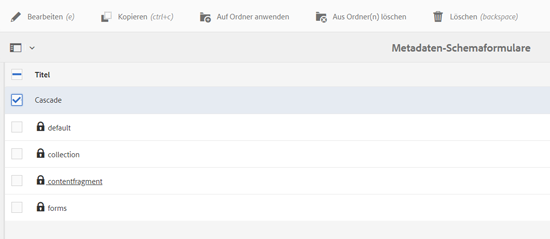

# Metadatenschemata {#metadata-schemas}

| Version | Artikel-Link |
| -------- | ---------------------------- |
| AEM as a Cloud Service | [Hier klicken](https://experienceleague.adobe.com/docs/experience-manager-cloud-service/content/assets/manage/metadata-schemas.html?lang=de) |
| AEM 6.5 | Dieser Artikel |

Unternehmen entwickeln ein Metadatenmodell, das die Asset-Erkennung, -Nutzung, -Interoperabilität usw. verbessert. Die richtige Anwendung der Metadaten ist sakrosankt, um metadatengesteuerte Workflows und Prozesse zu verwalten. Um die unternehmensweite Metadatenstrategie und -standards einzuhalten, können Sie Metadatenschemata verwenden, die DAM-Benutzern die Abstimmung erleichtern. [!DNL Adobe Experience Manager] ermöglicht einfache und flexible Methoden zum Erstellen, Verwalten und Anwenden von Metadatenschemata.

In [!DNL Adobe Experience Manager Assets] enthalten Schemata bestimmte Felder für bestimmte einzutragende Informationen. Es enthält auch Layout-Informationen, um Metadatenfelder benutzerfreundlich anzuzeigen. Zu den Metadaten-Eigenschaften zählen u. a. Titel, Beschreibung, MIME-Typen, Tags usw. Mit dem Editor für [!UICONTROL Metadatenschema-Formulare] können Sie vorhandene Schemata ändern oder benutzerdefinierte Metadatenschemata hinzufügen.

Gehen Sie wie folgt vor, um die Eigenschaftenseite für ein Asset anzuzeigen und zu bearbeiten:

1. Klicken Sie in den Schnellaktionen auf der Asset-Kachel in der Kartenansicht auf die Option **[!UICONTROL Eigenschaften anzeigen]**. Wählen Sie alternativ ein Asset aus und klicken Sie dann in der Symbolleiste auf **[!UICONTROL Eigenschaften]**, .

1. Sie können die verschiedenen bearbeitbaren Metadaten-Eigenschaften auf den verfügbaren Registerkarten bearbeiten. Den Asset-[!UICONTROL Typ] können Sie jedoch nicht auf der Registerkarte [!UICONTROL Standard] der Eigenschaftsseite ändern.

   

   *Abbildung: Registerkarte „Standard“ in den Asset-[!UICONTROL Eigenschaften].*

   Stellen Sie sicher, dass, während Sie das Metadatenschema erstellen oder bearbeiten, nur eine Eigenschaft einem Feld zugeordnet ist.

   Verwenden Sie zum Ändern des MIME-Typs für ein Asset ein benutzerdefiniertes Metadatenschema-Formular oder ändern Sie ein vorhandenes Formular. Weitere Informationen finden Sie unter [Bearbeiten von Metadatenschema-Formularen](#edit-metadata-schema-forms). Wenn Sie das Metadatenschema eines MIME-Typs ändern, wird das Seiten-Layout der Eigenschaften für die Assets und alle Untertypen geändert. Durch die Bearbeitung des jpeg-Schemas unter `default/image` wird nur das Metadaten-Layout (Asset-Eigenschaften) für Assets mit dem MIME-Typ `image/jpeg` bearbeitet. Wenn Sie allerdings das „default“-Schema ändern, wird dadurch das Metadaten-Layout für alle Asset-Typen geändert.

## Metadatenschema-Formulare {#default-metadata-schema-forms}

Um eine Liste von Formularen oder Vorlagen anzuzeigen, gehen Sie in der [!DNL Experience Manager]-Benutzeroberfläche zu **[!UICONTROL Tools]** > **[!UICONTROL Assets]** > **[!UICONTROL Metadatenschemata]**.

[!DNL Experience Manager] stellt die folgenden Metadatenschema-Formularvorlagen bereit.

| Vorlagen | | Beschreibung |
|---|---|---|
| [!UICONTROL default] | | Dies ist das Basis-Metadatenschema-Formular für Assets. |
| | Die folgenden untergeordneten Formulare übernehmen die Eigenschaften des [!UICONTROL Standard]-Formulars: | |
| | <ul><li>[!UICONTROL Dm_video]</li></ul> | Schemaformular für Dynamic Media-Videos. |
| | <ul><li>[!UICONTROL image]</li></ul> | Schemaformular für Bilder mit dem MIME-Typ wie z. B. `image/jpeg` und `image/png`.   Das Formular [!UICONTROL Bild] weist die folgenden untergeordneten Formularvorlagen auf: <ul><li> [!UICONTROL jpeg]: Schemaformular für Assets mit dem Untertyp [!UICONTROL jpeg].</li> <li>[!UICONTROL tiff]: Schemaformular für Assets mit dem Untertyp „tiff“.</li></ul> |
| | <ul><li>[!UICONTROL Anwendung]</li></ul> | Schemaformular für Assets mit dem MIME-Typ wie z. B. `application/pdf` und `application/zip`.  [!UICONTROL pdf]: Schemaformular für Assets mit dem Untertyp „pdf“. |
| | <ul><li>[!UICONTROL Video]</li></ul> | Schemaformular für Video-Assets mit dem MIME-Typ wie z. B. `video/avi` und `video/mp4`. |
| [!UICONTROL collection] | | Schemaformular für Sammlungen. |
| [!UICONTROL contentfragment] | | [Schemaformular für Inhaltsfragmente](/help/sites-developing/customizing-content-fragments.md). |
| [!UICONTROL forms] | | Dieses Schemaformular bezieht sich auf [Adobe Experience Manager Forms](/help/forms/home.md). |
| [!UICONTROL ugc_contentfragment] | | Schemaformular für benutzergenerierte Inhaltselemente und Assets, die aus Social Media in Experience Manager integriert wurden. |

>[!NOTE]
>
>Um die untergeordneten Formulare eines Schemaformulars anzuzeigen, klicken Sie auf den Namen des Schemaformulars.

## Hinzufügen von Metadatenschema-Formularen {#add-a-metadata-schema-form}

Gehen Sie wie folgt vor, um ein Metadatenschema-Formular hinzuzufügen:

1. Um eine benutzerdefinierte Vorlage zur Liste hinzuzufügen, klicken Sie in der Symbolleiste auf **[!UICONTROL Erstellen]**.

   >[!NOTE]
   >
   >Bei den nicht bearbeiteten Vorlagen wird ein Sperrsymbol angezeigt. Wenn Sie eine Vorlage anpassen, ist sie nicht gesperrt .

1. Geben Sie im Dialog den Titel des Schemaformulars ein und klicken Sie auf **[!UICONTROL Erstellen]**, um den Prozess zur Formularerstellung abzuschließen.

## Bearbeiten von Metadatenschema-Formularen {#edit-metadata-schema-forms}

Sie können ein neu hinzugefügtes oder vorhandenes Metadatenschema-Formular bearbeiten. Das Metadatenschema-Formular enthält Registerkarten und Formularelemente auf Registerkarten. Sie können diese Formularelemente einem Feld innerhalb eines Metdatenknotens im CRX-Repository zuordnen bzw. dafür konfigurieren. Sie können dem Metadatenschema-Formular Registerkarten oder Formularelemente hinzufügen. Die vom übergeordneten Objekt abgeleiteten Registerkarten und Formularelemente sind gesperrt. Sie können auf untergeordneter Ebene nicht geändert werden.

1. Wählen Sie auf der Seite [!UICONTROL Metadatenschema-Formulare] ein Formular aus und klicken Sie in der Symbolleiste auf **[!UICONTROL Bearbeiten]**.

1. Passen Sie auf der Seite **[!UICONTROL Metadatenschema-Formular-Editor]** das Metadaten-Formular an. Ziehen Sie die erforderlichen Komponenten von der Registerkarte **[!UICONTROL Formular erstellen]** auf eine der Registerkarten.

1. Um eine Komponente zu konfigurieren, wählen Sie diese aus und ändern Sie ihre Eigenschaften auf der Registerkarte **[!UICONTROL Einstellungen]**.

### Komponenten auf der Registerkarte [!UICONTROL Formular erstellen] {#components-within-the-build-form-tab}

Die Registerkarte **[!UICONTROL Formular erstellen]** enthält Formularelemente, die Sie im Schemaformular verwenden. Die Registerkarte **[!UICONTROL Einstellungen]** enthält die Attribute für jedes Element, das Sie auf der Registerkarte **[!UICONTROL Formular erstellen]** auswählen. Die folgende Tabelle enthält die auf der Registerkarte **[!UICONTROL Formular erstellen]** verfügbaren Formularelemente:

| Komponentenname | Beschreibung |
| -------------------------------- | ----------------------------------------------------------------------------------- |
| [!UICONTROL Bereichs-Kopfzeile] | Fügen Sie eine Abschnittsüberschrift für eine Liste allgemeiner Komponenten hinzu. |
| [!UICONTROL Einzeilentext] | Fügen Sie eine einzeilige Texteigenschaft hinzu. Diese wird als Zeichenfolge gespeichert. |
| [!UICONTROL Mehrfachwerttext] | Fügen Sie eine Texteigenschaft mit mehreren Werten hinzu. Diese wird als Zeichenfolgen-Array gespeichert. |
| [!UICONTROL Zahl] | Fügen Sie eine Zahlenkomponente hinzu. |
| [!UICONTROL Datum] | Fügen Sie eine Datumskomponente hinzu. |
| [!UICONTROL Dropdown] | Fügen Sie eine Dropdown-Liste hinzu. |
| [!UICONTROL Standard-Tags] | Fügen Sie ein Tag hinzu. |
| [!UICONTROL Smart-Tags] | Fügen Sie automatisch Metadaten-Tags hinzu, um Suchfunktionen zu ergänzen. |
| [!UICONTROL Ausgeblendetes Feld] | Fügen Sie ein ausgeblendetes Feld hinzu. Dieses wird beim Speichern des Assets als POST-Parameter gesendet. |
| [!UICONTROL Asset referenziert von] | Fügen Sie diese Komponente hinzu, um eine Liste der vom Asset referenzierten Assets anzuzeigen. |
| [!UICONTROL Asset-Verweise] | Fügen Sie dies hinzu, um eine Liste der Assets anzuzeigen, die das Asset referenzieren. |
| [!UICONTROL Produktverweise] | Fügen Sie dies hinzu, um die Liste der mit dem Asset verknüpften Produkte anzuzeigen. |
| [!UICONTROL Asset-Bewertung] | Fügen Sie dies hinzu, um Optionen zur Bewertung des Assets anzuzeigen. |
| [!UICONTROL Kontextuelle Metadaten] | Fügen Sie diese Komponente hinzu, um weitere Metadaten auf der Seite „Eigenschaften“ von Assets anzuzeigen. |

#### Bearbeiten von Metadatenkomponenten {#edit-the-metadata-component}

Um die Eigenschaften einer Metadaten-Komponente im Formular zu bearbeiten, klicken Sie auf die Komponente und bearbeiten Sie alle Eigenschaften oder einen Teil der folgenden Eigenschaften auf der Registerkarte **[!UICONTROL Einstellungen]**. Es wird empfohlen, nur ein Feld einer bestimmten Eigenschaft im Metadatenschema zuzuordnen. Andernfalls wird das der Eigenschaft zuletzt zugeordnete Feld vom System ausgewählt.

**Feldbezeichnung**: Der Name der Metadateneigenschaft, der auf der Eigenschaftenseite des Assets angezeigt wird.

**Zu Eigenschaft zuordnen**: Diese Eigenschaft gibt den relativen Pfad/Namen zum Asset-Knoten an, unter dem die Eigenschaft im CRX-Repository gespeichert ist. Sie beginnt mit `./`, um anzugeben, dass der Pfad sich unter dem Knoten des Assets befindet.

Im Folgenden finden Sie Beispiele für gültige Werte für eine Eigenschaft:

* `./jcr:content/metadata/dc:title`: Speichert den Wert im Metadatenknoten des Assets als die Eigenschaft `dc:title`.

* `./jcr:created`: Speichert das Erstellungsdatum und die Erstellungsuhrzeit eines Assets. Dies ist eine geschützte Eigenschaft. Wenn Sie diese Eigenschaften konfigurieren, empfiehlt Adobe, dass Sie sie mit Bearbeitung deaktivieren markieren. Andernfalls tritt der Fehler „Assets konnten nicht geändert werden“ auf, wenn Sie die Eigenschaften des Assets speichern.

Um sicherzustellen, dass die Komponente ordnungsgemäß im Metadatenschema-Formular angezeigt wird, sollte der Eigenschaftspfad keine Leerzeichen enthalten.

* **Platzhalter**: Verwenden Sie diese Eigenschaft, um relevanten Platzhaltertext für die Metadateneigenschaft anzugeben.
* **Erforderlich**: Mit dieser Eigenschaft können Sie eine Metadateneigenschaft auf der Eigenschaftsseite als obligatorisch markieren.
* **Bearbeitung deaktivieren**: Verwenden Sie diese Eigenschaft, um die Bearbeitung einer Eigenschaft auf der Eigenschaftsseite zu verbieten.
* **Leeres Feld schreibgeschützt anzeigen**: Markieren Sie diese Eigenschaft, um eine Metadateneigenschaft auch dann auf der Eigenschaftenseite anzuzeigen, wenn sie keinen Wert aufweist. Standardmäßig werden Metadateneigenschaften ohne Werte nicht auf der Eigenschaftenseite aufgeführt.
* **Liste geordnet anzeigen**: Mit dieser Eigenschaft zeigen Sie eine geordnete Liste von Optionen an..
* **Wahlen**: Mit dieser Eigenschaft legen Sie Optionen in einer Liste fest.
* **Beschreibung**: Mit dieser Eigenschaft können Sie eine kurze Beschreibung für die Metadatenkomponente hinzufügen.
* **Klasse**: Objektklasse, mit der die Eigenschaft verknüpft ist.
* **Löschen**: Klicken Sie auf [!UICONTROL Löschen], um eine Komponente aus dem Schemaformular zu löschen.

>[!NOTE]
>
>Die Komponente [!UICONTROL Ausgeblendetes Feld] enthält diese Attribute nicht. Sie enthält stattdessen Eigenschaften wie die Attribute „Name“, „Wert“, „Feldbezeichnung“ und „Beschreibung“. Die Werte für die Komponente „Ausgeblendetes Feld“ werden beim Speichern des Assets als POST-Parameter gesendet. Sie werden nicht als Metadaten für das Asset gespeichert.

Wenn Sie die Option **[!UICONTROL Erforderlich]** auswählen, können Sie nach Assets suchen, denen obligatorische Metadaten fehlen. Erweitern Sie im Bedienfeld **[!UICONTROL Filter]** die Eigenschaft **[!UICONTROL Metadatenvalidierung]** und wählen Sie die Option **[!UICONTROL Ungültig]**. Die Suchergebnisse zeigen Assets an, denen erforderliche Metadaten fehlen, die Sie über das Schemaformular konfiguriert haben.

 

Wenn Sie die Komponente „Kontextuelle Metadaten“ in eine beliebige Registerkarte eines Schemaformulars einfügen, wird sie in der Eigenschaftenseite der Assets als Liste angezeigt, auf die das bestimmte     Schema angewendet wird. Die Liste enthält alle anderen Registerkarten außer der Registerkarte, auf die Sie die Komponente „Kontextuelle Metadaten“ angewendet haben. Derzeit bietet diese Funktion grundlegende Funktionalität zur Steuerung der Anzeige von Metadaten, die auf dem Kontext basieren.

Wenn Sie auf der Eigenschaftenseite zusätzlich zur Registerkarte, auf die die Komponente „Kontextuelle Metadaten“ angewendet wird, eine weitere Registerkarte aufnehmen möchten, wählen Sie die Registerkarte aus der Liste aus. Die Registerkarte wird der Eigenschaftenseite hinzugefügt.

.

*Abbildung: Kontextbezogene Metadaten auf der Seite mit den Asset-Eigenschaften*.

### Festlegen von Eigenschaften in einer JSON-Datei {#specify-properties-in-json-file}

Anstatt die Eigenschaften für die Optionen auf der Registerkarte **[!UICONTROL Einstellungen]** anzugeben, können Sie die Optionen in einer JSON-Datei definieren, indem Sie die entsprechenden Schlüssel/Wert-Paare angeben. Geben Sie den Pfad der JSON-Datei im Feld **[!UICONTROL JSON-Pfad]** an.

#### Hinzufügen oder Löschen von Registerkarten im Schemaformular {#adding-deleting-a-tab-in-the-schema-form}

Mit dem Schema-Editor können Sie Registerkarten hinzufügen oder löschen. Das Standard-Schemaformular umfasst die Registerkarten **[!UICONTROL Standard]**, **[!UICONTROL Erweitert]**, **[!UICONTROL IPTC]** und **[!UICONTROL IPTC-Erweiterung]**.

Klicken Sie auf `+`, um einem Schemaformular eine Registerkarte hinzuzufügen. Standardmäßig hat die neue Registerkarte den Namen `Unnamed-1`. Sie können den Namen auf der Registerkarte **[!UICONTROL Einstellungen]** ändern. Klicken Sie auf `X`, um eine Registerkarte zu löschen.

## Kaskadierende Metadaten {#cascading-metadata}

Beim Erfassen der Metadateninformationen eines Assets stellen Benutzende Informationen in den verschiedenen verfügbaren Feldern bereit. Sie können bestimmte Metadatenfelder oder Feldwerte anzeigen, die von den in den anderen Feldern gewählten Optionen abhängig sind. Solche bedingt angezeigten Metadaten werden als „kaskadierende Metadaten“ bezeichnet. Mit anderen Worten: Sie können eine Abhängigkeit zwischen einem bestimmten Metadatenfeld/-wert und einem oder mehreren Feldern und/oder deren Werten schaffen.

Verwenden Sie Metadatenschemata, um Regeln für die Anzeige kaskadierender Metadaten zu definieren. Wenn Ihr Metadatenschema beispielsweise ein Feld vom Typ Asset enthält, können Sie einen entsprechenden Satz von Feldern definieren, die je nach ausgewähltem Asset-Typ angezeigt werden sollen.

>[!CAUTION]
>
>Kaskadierende Metadaten werden für Inhaltsfragmente nicht unterstützt.

Im Folgenden finden Sie einige Anwendungsfälle, für die Sie kaskadierende Metadaten definieren können:

* Wenn der Benutzerstandort erforderlich ist, können Sie die Namen relevanter Städte basierend auf der von Personen angegebenen Land und Bundesland anzeigen.
* Laden Sie relevante Markennamen basierend auf der von Benutzenden ausgewählten Produktgruppe in einer Liste.
* Aktivieren/Deaktivieren Sie die Sichtbarkeit eines bestimmten Felds, basierend auf dem in einem anderen Feld angegebenen Wert. Zeigen Sie beispielsweise separate Felder für die Versandadresse an, wenn Benutzende die Sendung an eine andere Adresse liefern lassen möchten.
* Legen Sie ein Feld basierend auf dem in einem anderen Feld angegebenen Wert als Pflichtfeld fest.
* Ändern Sie die für ein bestimmtes Feld angezeigten Optionen basierend auf dem in einem anderen Feld angegebenen Wert.
* Legen Sie den standardmäßigen Metadatenwert in einem bestimmten Feld basierend auf dem in einem anderen Feld angegebenen Wert fest.

### Erstellen kaskadierender Metadaten in [!DNL Experience Manager] {#configure-cascading-metadata-in-aem}

Stellen Sie sich ein Szenario vor, in dem kaskadierende Metadaten basierend auf dem ausgewählten Asset-Typ angezeigt werden sollen. Beispiele

* Zeigen Sie für ein Video geeignete Felder wie Format, Codec, Dauer usw. an.
* Zeigen Sie für ein Word- oder PDF-Dokument Felder wie Seitenzahl, Autor usw. an.

Zeigen Sie unabhängig vom ausgewählten Asset-Typ die Copyright-Informationen als erforderliches Feld an.

1. Gehen Sie in der [!DNL Experience Manager]-Benutzeroberfläche zu **[!UICONTROL Tools]** > **[!UICONTROL Assets]** > **[!UICONTROL Metadatenschemata]**.
1. Wählen Sie auf der Seite **[!UICONTROL Schemaformulare]** ein Schemaformular aus und klicken Sie dann in der Symbolleiste auf **[!UICONTROL Bearbeiten]**, um das Schema zu bearbeiten.

   

1. (Optional) Erstellen Sie im Metadatenschema-Editor ein Feld, um Bedingungen zu erstellen. Geben Sie einen Namen und einen Eigenschaftspfad auf der Registerkarte **[!UICONTROL Einstellungen]** an. 

   Um eine Registerkarte zu erstellen, klicken Sie auf `+` , um eine Registerkarte hinzuzufügen und anschließend ein Metadatenfeld hinzuzufügen.

   

1. Fügen Sie ein Dropdown-Feld für den Asset-Typ hinzu. Geben Sie einen Namen und einen Eigenschaftspfad auf der Registerkarte **[!UICONTROL Einstellungen]** an. Fügen Sie eine optionale Beschreibung hinzu.

   

1. Schlüssel-Wert-Paare sind die Optionen, die einem Formularbenutzenden zur Verfügung gestellt werden. Sie können die Schlüssel-Wert-Paare entweder manuell oder aus einer JSON-Datei bereitstellen.

   * Um die Werte manuell anzugeben, wählen Sie **[!UICONTROL Manuell hinzufügen]** aus, klicken Sie auf **[!UICONTROL Auswahl hinzufügen]** und geben Sie den Optionstext und -wert an. Legen Sie z. B. die Asset-Typen „Video“, „PDF“, „Wort“ und „Bild“ fest.

   * Um die Werte dynamisch aus einer JSON-Datei abzurufen, wählen Sie **[!UICONTROL Über JSON-Pfad hinzufügen]** aus und geben Sie den Pfad einer JSON-Datei an. [!DNL Experience Manager] ruft die Schlüssel-Wert-Paare in Echtzeit ab, wenn das Formular dem Anwender angezeigt wird.

   Beide Optionen schließen sich gegenseitig aus. Sie können die Optionen nicht aus einer JSON-Datei importieren und manuell bearbeiten.

   

   >[!NOTE]
   >
   >Wenn Sie eine JSON-Datei hinzufügen, werden die Schlüssel-Wert-Paare nicht im Metadatenschema-Editor angezeigt, sind jedoch im veröffentlichten Formular verfügbar.

   >[!NOTE]
   >
   >Wenn Sie Auswahlmöglichkeiten hinzufügen, wird beim Klicken auf das Dropdown-Feld die Benutzeroberfläche verzerrt dargestellt und die Option „Löschen“ für die Auswahlmöglichkeiten funktioniert nicht mehr. Klicken Sie nicht auf das Dropdown-Menü, bis Sie die Änderungen gespeichert haben. Wenn dieses Problem auftritt, speichern Sie das Schema und öffnen Sie es erneut, um die Bearbeitung fortzusetzen.

1. (Optional) Fügen Sie die anderen erforderlichen Felder hinzu. Beispielsweise das Format, den Codec und die Dauer für den Asset-Typ „Video“.

   Fügen Sie auf ähnliche Weise abhängige Felder für andere Asset-Typen hinzu. Fügen Sie bei Dokumenten-Assets wie PDF- und Word-Dateien beispielsweise die Felder „Seitenanzahl“ und „Autor“ hinzu.

   

1. Um eine Abhängigkeit zwischen dem Feld „Asset-Typ“ und anderen Feldern zu erstellen, wählen Sie das abhängige Feld aus und öffnen Sie die Registerkarte **[!UICONTROL Regeln]**.

   

1. Wählen Sie unter **[!UICONTROL Anforderung]** die Option **[!UICONTROL Erforderlich, basierend auf neuer Regel]** aus.
1. Klicken Sie auf **[!UICONTROL Regel hinzufügen]** und wählen Sie das Feld **[!UICONTROL Asset-Typ]** aus, um eine Abhängigkeit zu erstellen. Wählen Sie auch den Feldwert, auf dessen Grundlage die Abhängigkeit erstellt werden soll. Wählen Sie in diesem Fall **[!UICONTROL Video]** aus. Klicken Sie auf **[!UICONTROL Fertig]**, um die Änderungen zu speichern.

   

   >[!NOTE]
   >
   >Dropdown-Menüs mit manuell vordefinierten Werten können mit Regeln verwendet werden. Dropdown-Menüs mit konfiguriertem JSON-Pfad können nicht mit Regeln verwendet werden, die vordefinierte Werte zur Anwendung von Bedingungen nutzen. Wenn die Werte zur Laufzeit aus einer JSON-Datei geladen werden, ist es nicht möglich, vordefinierte Regeln anzuwenden.

1. Wählen Sie unter **[!UICONTROL Sichtbarkeit]** die Option **[!UICONTROL Sichtbar, basierend auf neuer Regel]** aus.

1. Klicken Sie auf **[!UICONTROL Regel hinzufügen]** und wählen Sie das Feld **[!UICONTROL Asset-Typ]** aus, um eine Abhängigkeit zu erstellen. Wählen Sie auch den Feldwert, auf dessen Grundlage die Abhängigkeit erstellt werden soll. Wählen Sie in diesem Fall **[!UICONTROL Video]** aus. Klicken Sie auf **[!UICONTROL Fertig]**, um die Änderungen zu speichern.

   

   >[!NOTE]
   >
   >Durch Klicken auf einen Leerraum (oder eine andere Stelle als die Werte) werden die Werte zurückgesetzt. Wählen Sie in diesem Fall die Werte erneut aus.

   >[!NOTE]
   >
   >Sie können die Bedingungen **[!UICONTROL Anforderung]** und **[!UICONTROL Sichtbarkeit]** unabhängig voneinander anwenden.

1. Erstellen Sie auf ähnliche Weise eine Abhängigkeit zwischen dem Wert „Video“ im Feld „Asset-Typ“ und anderen Feldern wie „Codec“ und „Dauer“.
1. Wiederholen Sie die Schritte, um eine Abhängigkeit zwischen Dokumenten-Assets (PDF und Word) im Feld [!UICONTROL Asset-Typ] und Feldern wie [!UICONTROL Seitenzahl] und [!UICONTROL Autor] zu erstellen.
1. Klicken Sie auf **[!UICONTROL Speichern]**. Wenden Sie das Metadatenschema auf einen Ordner an.

1. Navigieren Sie zu dem Ordner, auf den Sie das Metadatenschema angewendet haben, und öffnen Sie die Eigenschaftenseite eines Assets. Je nach Ihrer Auswahl im Feld „Asset-Typ“ werden relevante kaskadierende Metadatenfelder angezeigt.

   

   *Abbildung: Kaskadierende Metadaten für ein Video*.

   

   *Abbildung: Kaskadierende Metadaten für ein Dokument*.

## Löschen von Metadatenschema-Formularen {#delete-metadata-schema-forms}

In [!DNL Experience Manager] können Sie nur benutzerdefinierte Schemaformulare löschen. Die Standardschemaformulare/-vorlagen können nicht gelöscht werden. Sie können jedoch alle benutzerdefinierten Änderungen in diesen Formularen löschen.

Um ein Formular zu löschen, wählen Sie das Formular aus und klicken Sie auf „Löschen“.

>[!NOTE]
>
>* Nachdem Sie benutzerdefinierte Änderungen an einem Standardformular gelöscht haben, wird die Sperre  vor dem Formular erneut angezeigt. Sie zeigt an, dass das Formular wieder in den Standardzustand versetzt wurde.
>* Sie können die Standard-Metadatenschema-Formulare in [!DNL Assets] nicht löschen.

## Schemaformulare für MIME-Typen {#schema-forms-for-mime-types}

[!DNL Experience Manager] stellt voreingestellte Standardformulare für verschiedene MIME-Typen bereit. Sie können jedoch benutzerdefinierte Formulare für verschiedene MIME-Typen hinzufügen.

### Hinzufügen neuer Formulare für MIME-Typen {#add-new-forms-for-mime-types}

Erstellen Sie ein neues Formular unter dem entsprechenden Formulartyp. Beispiel: Um eine neue Vorlage für den Untertyp `image/png` hinzuzufügen, erstellen Sie das Formular unter den „Bild“-Formularen. Der Titel für das Schemaformular ist der Name des Untertyps. In diesem Fall ist der Titel `png`.

#### Verwenden einer vorhandenen Schemavorlage für verschiedene MIME-Typen {#use-an-existing-schema-template-for-various-mime-types}

Sie können eine vorhandene Vorlage für einen anderen MIME-Typ verwenden. Nutzen Sie beispielsweise das Formular `image/jpeg` für Assets mit dem MIME-Typ `image/png`.

Erstellen Sie in diesem Fall einen Knoten unter `/etc/dam/metadataeditor/mimetypemappings` im CRX-Repository. Geben Sie einen Namen für den Knoten an und definieren Sie die folgenden Eigenschaften:

| Name | Beschreibung | Typ | Wert |
|------|-------------|------|-------|
| `exposedmimetype` | Name des vorhandenen Formulars, das zugeordnet werden soll | `String` | `image/jpeg` |
| `mimetypes` | Liste der MIME-Typen, die das im Attribut `exposedmimetype` definierte Formular verwenden | `String` | `image/png` |

[!DNL Assets] ordnet die folgenden MIME-Typen und Schemaformulare zu:

| Schemaformular | MIME-Typen |
|---|---|
| image/jpeg | image/pjpeg |
| image/tiff | image/x-tiff |
| application/pdf | application/postscript |
| application/x-ImageSet | Multipart/Related; type=application/x-ImageSet |
| application/x-SpinSet | Multipart/Related; type=application/x-SpinSet |
| application/x-MixedMediaSet | Multipart/Related; type=application/x-MixedMediaSet |
| video/quicktime | video/x-quicktime |
| video/mpeg4 | video/mp4 |
| video/avi | video/avi, video/msvideo, video/x-msvideo |
| video/wmv | video/x-ms-wmv |
| video/flv | video/x-flv |

## Zugriff auf Metadatenschemata gewähren {#grant-access-to-metadata-schemas}

Die Funktion „Metadatenschema“ ist nur für Administratoren verfügbar. Administratoren können anderen Benutzern allerdings Zugriff erteilen, indem sie einige Berechtigungen ändern. Geben Sie Benutzern ohne Administratorrechte Berechtigungen zum Erstellen, Ändern und Löschen für den Ordner `/conf`.

## Anwenden von ordnerspezifischen Metadaten {#apply-folder-specific-metadata}

Mit [!DNL Assets] können Sie Varianten eines Metadatenschemata definieren und auf einen bestimmten Ordner anwenden.

Sie können beispielsweise eine Variante des Standard-Metadatenschemas definieren und auf einen Ordner anwenden. Wenn Sie das geänderte Schema anwenden, überschreibt es das ursprüngliche standardmäßige Metadatenschema, das auf Assets im Ordner angewendet wird.

Nur Assets, die in den Ordner hochgeladen werden, auf den dieses Schema angewendet wird, entsprechen den geänderten Metadaten, die in der Variante des Metadatenschemas definiert sind. [!DNL Assets] in anderen Ordnern, für die das ursprüngliche Schema gilt, entsprechen weiterhin den im ursprünglichen Schema definierten Metadaten.

Die Metadatenübernahme durch Assets richtet sich nach dem Schema, das auf den Ordner der ersten Ebene in der Hierarchie angewendet wird. Dasselbe Schema wird auf die Unterordner angewendet oder von diesen übernommen. Wenn ein anderes Schema auf Unterordnerebene angewendet wird, stoppt die Übernahme.

1. Gehen Sie in der [!DNL Experience Manager]-Benutzeroberfläche zu **[!UICONTROL Tools]** > **[!UICONTROL Assets]** > **[!UICONTROL Metadatenschemata]**. Die Seite **[!UICONTROL Metadatenschema-Formulare]** wird angezeigt.
1. Aktivieren Sie das Kontrollkästchen vor einem Formular, z. B. dem Standard-Metadatenformular, und klicken Sie auf **[!UICONTROL Kopieren]** und speichern Sie es als benutzerdefiniertes Formular. Geben Sie einen benutzerdefinierten Namen für das Formular an, beispielsweise, `my_default`. Alternativ können Sie ein benutzerdefiniertes Formular erstellen.

1. Wählen Sie auf der Seite **[!UICONTROL Metadatenschema-Formulare]** das Formular `my_default` und klicken Sie dann auf **[!UICONTROL Bearbeiten]**.

1. Fügen Sie auf der Seite **[!UICONTROL Metadatenschema-Editor]** ein Textfeld in das Schemaformular ein. Fügen Sie beispielsweise ein Feld mit der Bezeichnung **[!UICONTROL Kategorie]** hinzu.

   

   *Abbildung: Zum Metadatenschema-Formular-Editor hinzugefügtes Textfeld*.

1. Klicken Sie auf **[!UICONTROL Speichern]**. Das geänderte Formular wird auf der Seite **[!UICONTROL Metadatenschema-Formulare]** aufgeführt.
1. Klicken Sie in der Symbolleiste auf **[!UICONTROL Auf Ordner anwenden]**, um die benutzerdefinierten Metadaten auf einen Ordner anzuwenden.

1. Wählen Sie den Ordner aus, auf den Sie das geänderte Schema anwenden möchten, und klicken Sie auf **[!UICONTROL Anwenden]**.

   

1. Wurde das andere Metadatenschema auf den Ordner angewendet, erhalten Sie eine Meldung mit der Warnung, dass Sie im Begriff sind, das vorhandene Metadatenschema zu überschreiben. Klicken Sie auf **Überschreiben**.
1. Klicken Sie auf **OK**, um die Erfolgsmeldung zu schließen.
1. Navigieren Sie zu dem Ordner, auf den Sie das geänderte Metadatenschema angewendet haben.

## Definieren erforderlicher Metadaten {#define-mandatory-metadata}

Sie können Pflichtfelder auf Ordnerebene definieren, die für in den Ordner hochgeladene Assets erzwungen werden. Wenn Sie Assets mit fehlenden Metadaten für die zuvor definierten Pflichtfelder hochladen, wird in der Kartenansicht ein entsprechender visueller Hinweis für die Assets angezeigt.

>[!NOTE]
>
>Ein Metadatenfeld kann je nach dem Wert eines weiteren Felds als Pflichtfeld definiert werden. In der Kartenansicht zeigt [!DNL Experience Manager] keine Warnung zu fehlenden Metadaten für solche obligatorischen Metadatenfelder an.

1. Gehen Sie in der [!DNL Experience Manager]-Benutzeroberfläche zu **[!UICONTROL Tools]** > **[!UICONTROL Assets]** > **[!UICONTROL Metadatenschemata]**. Die Seite **[!UICONTROL Metadatenschema-Formulare]** wird angezeigt.
1. Speichern Sie die Standard-Metadatenformulare als benutzerdefiniertes Formular. Speichern Sie sie beispielsweise unter dem Namen `my_default`.

1. Bearbeiten Sie das benutzerdefinierte Formular. Fügen Sie ein erforderliches Feld hinzu. Fügen Sie beispielsweise ein Feld mit der Bezeichnung **[!UICONTROL Kategorie]** hinzu und definieren Sie es als Pflichtfeld.

   

   *Abbildung: Pflichtfeld im Editor für Metadatenschema-Formulare*.

1. Klicken Sie auf **[!UICONTROL Speichern]**. Das geänderte Formular wird auf der Seite **[!UICONTROL Metadatenschema-Formulare]** aufgeführt. Wählen Sie das Formular aus und klicken Sie dann in der Symbolleiste auf **[!UICONTROL Auf Ordner anwenden]**, um die benutzerdefinierten Metadaten auf einen Ordner anzuwenden.

1. Navigieren Sie zum Ordner und laden Sie einige Assets mit fehlenden Metadaten für das Pflichtfeld, das Sie dem benutzerdefinierten Formular hinzugefügt haben. Eine Meldung über die fehlenden Metadaten für das Pflichtfeld wird auf der Kartenansicht des Assets angezeigt.

   

1. (Optional) Rufen Sie `https://[aem_server]:[port]/system/console/components/` auf. Konfigurieren und aktivieren Sie die Komponente `com.day.cq.dam.core.impl.MissingMetadataNotificationJob`, die standardmäßig deaktiviert ist. Legen Sie fest, mit welcher Häufigkeit [!DNL Experience Manager] die Gültigkeit der Metadaten in den Assets überprüfen soll. Diese Konfiguration fügt eine Eigenschaft `hasValidMetadata` zu `jcr:content` in Assets hinzu. [!DNL Experience Manager] verwendet diese Eigenschaft zum Filtern der ungültigen Assets in einem Suchergebnis. Wenn Sie ein Asset nach einer Prüfung hinzufügen, wird das Asset bis zur nächsten geplanten Prüfung nicht mit `hasValidMetadata` gekennzeichnet. Daher werden die Assets erst nach der nächsten geplanten Prüfung in den Suchfiltern für ungültige Metadaten angezeigt.

   >[!CAUTION]
   >
   >Die Metadaten-Überprüfungen sind ressourcenintensiv und können die Leistung Ihres Systems beeinträchtigen. Planen Sie die Überprüfungen entsprechend. Wenn der Server die Last nicht bewältigen kann, versuchen Sie, diesen Auftrag zu deaktivieren.

<!-- TBD: Add this method to find invalid metadata in the metadata.md article later when it is published as a top-level metadata article.
-->
