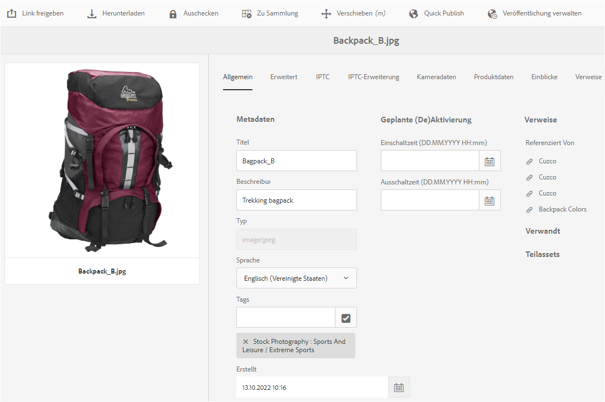
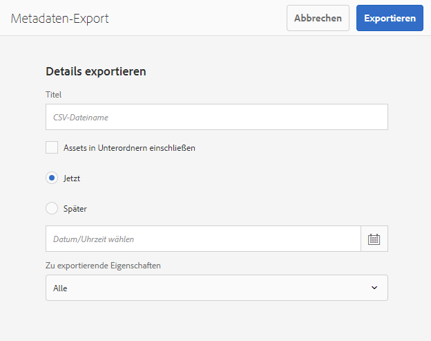
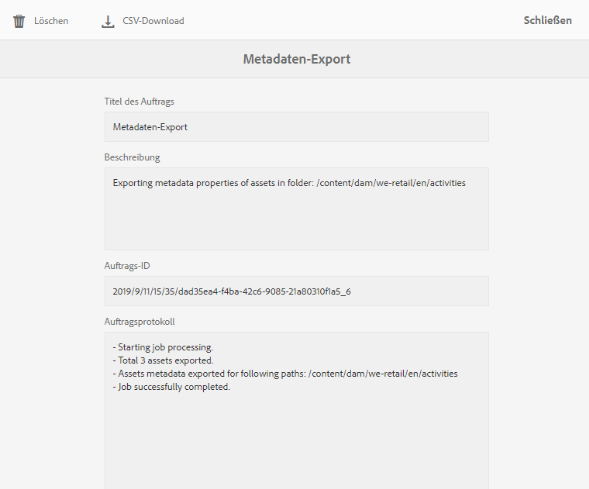
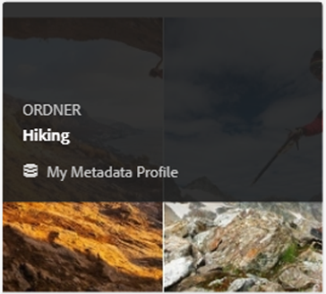

# Verwalten von Metadaten für digitale Assets {#managing-metadata-for-digital-assets}

<!-- Scope of metadata articles:
* metadata.md: The scope of this article is basic metadata updates, changes, etc. operations that end-users can do.
* metadata-concepts.md: All conceptual information. Minor instructions are OK but it is an FYI article about support and standards.
* metadata-config.md: New article. Contains all configuration and administration how-to info related to metadata of assets.
-->

[!DNL Adobe Experience Manager Assets] speichert Metadaten für jedes Asset. Damit können Assets einfacher kategorisiert und organisiert und bestimmte Assets leichter von Benutzern gefunden werden. Metadaten können aus in [!DNL Experience Manager Assets] hochgeladenen Dateien extrahiert werden. Damit lässt sich die Metadatenverwaltung in den kreativen Workflow integrieren. Da Sie Metadaten mit den Assets speichern und verwalten können, können Sie Assets basierend auf ihren Metadaten automatisch organisieren und verarbeiten.

## Metadaten und ihre Herkunft {#how-to-edit-or-add-metadata}

Metadaten sind zusätzliche Informationen zum Asset, die durchsucht werden können. Es wird Assets hinzugefügt und in [!DNL Experience Manager] verarbeitet, wenn Sie ein Asset hochladen. Sie können die vorhandenen Metadaten bearbeiten und den vorhandenen Feldern neue Metadateneigenschaften hinzufügen. Organisationen benötigen kontrollierte und zuverlässige Metadaten-Vokabeln. Daher ist es für [!DNL Experience Manager Assets] nicht möglich, bei Bedarf neue Metadateneigenschaften hinzuzufügen. Nur Administratoren und Entwickler können neue Eigenschaften oder Felder mit Metadaten hinzufügen. Benutzer können die vorhandenen Felder mit Metadaten füllen.

Mit den folgenden Methoden können Sie digitalen Assets Metadaten hinzufügen:

* Zunächst fügen die nativen Anwendungen, die Assets erstellen, einige Metadaten hinzu. Beispielsweise fügt [Acrobat einige Metadaten](https://helpx.adobe.com/acrobat/using/pdf-properties-metadata.html) zu PDF-Dateien hinzu oder eine Kamera fügt den Fotos einige grundlegende Metadaten hinzu. Beim Generieren von Assets können Sie die Metadaten in nativen Anwendungen selbst hinzufügen. Sie können beispielsweise [IPTC-Metadaten in Adobe Lightroom](https://helpx.adobe.com/lightroom-classic/help/metadata-basics-actions.html) hinzufügen.

* Vor dem Hochladen eines Assets zu [!DNL Experience Manager] können Sie Metadaten entweder mit der nativen Anwendung bearbeiten und ändern, die zum Erstellen eines Assets verwendet wird, oder mit einer anderen Metadaten-Bearbeitungsanwendung. Wenn Sie ein Asset in Experience Manager hochladen, werden die Metadaten verarbeitet. Sehen Sie sich beispielsweise an, wie [mit Metadaten in [!DNL Adobe Bridge]](https://helpx.adobe.com/bridge/user-guide.html/bridge/using/metadata-adobe-bridge.ug.html) und das [Tags-Bedienfeld für [!DNL Bridge CC]](https://exchange.adobe.com/creativecloud.details.20009.aem-tags-panel-for-bridge-cc.html) in [!DNL Adobe Exchange] funktioniert.

* Unter [!DNL Experience Manager Assets] können Sie Metadaten von Assets auf der Seite [!UICONTROL Eigenschaften] manuell hinzufügen oder bearbeiten.

* Sie können die [Metadaten-Profil](/help/assets/metadata-config.md#metadata-profiles)-Funktion von [!DNL Experience Manager Assets] nutzen, um beim Hochladen von Assets in DAM automatisch Metadaten hinzuzufügen.

## hinzufügen oder bearbeiten Sie Metadaten in [!DNL Experience Manager Assets] {#add-edit-metadata}

Gehen Sie wie folgt vor, um die Metadaten eines Assets in der [!DNL Assets]-Benutzeroberfläche zu bearbeiten:

1. Führen Sie einen der folgenden Schritte aus:

   * Wählen Sie in der Benutzeroberfläche [!DNL Assets] das Asset aus und klicken Sie in der Symbolleiste auf **[!UICONTROL Eigenschaften der Ansicht]**.
   * Wählen Sie die Schnellaktion **[!UICONTROL Eigenschaften anzeigen]** aus der Miniaturansicht des Assets aus.
   * Klicken Sie auf der Asset-Seite in der Symbolleiste auf **[!UICONTROL Eigenschaften von Ansichten]** .

   Auf der Asset-Seite werden alle Metadaten des Assets angezeigt. Die Metadaten werden extrahiert, wenn das Asset in [!DNL Experience Manager] hochgeladen (aufgenommen) wird.

   

   *Abbildung: Bearbeiten oder Hinzufügen von Metadaten auf der   Seite &quot;Asset-Eigenschaften&quot;.*

1. Nehmen Sie die gewünschten Änderungen an den Metadaten unter den verschiedenen Registerkarten vor und klicken Sie nach Abschluss der Bearbeitung in der Symbolleiste auf **[!UICONTROL Speichern]**, um die Änderungen zu speichern. Klicken Sie auf **[!UICONTROL Schließen]**, um zur [!DNL Assets]-Weboberfläche zurückzukehren.

   >[!NOTE]
   >
   >Ein leeres Textfeld gibt an, dass kein Metadatenset vorhanden ist. Sie können einen Wert in das Feld eingeben und speichern, um diese Metadateneigenschaft hinzuzufügen.

Alle Änderungen an den Metadaten eines Assets werden als Teil der XMP-Daten in die ursprüngliche Binärdatei zurückgeschrieben. Der Metadaten-Schreibback-Arbeitsablauf fügt die Metadaten zur ursprünglichen Binärdatei hinzu. Änderungen, die an den vorhandenen Eigenschaften (z. B. `dc:title`) vorgenommen wurden, werden überschrieben und dem Schema werden neue Eigenschaften (einschließlich benutzerdefinierter Eigenschaften wie `cq:tags`) hinzugefügt.

XMP Schreibback wird unterstützt und für die Plattformen und Dateiformate aktiviert, die unter [Technische Anforderungen beschrieben werden.](/help/sites-deploying/technical-requirements.md)

## Bearbeiten von Metadateneigenschaften mehrerer Assets {#editing-metadata-properties-of-multiple-assets}

[!DNL Adobe Enterprise Manager Assets]Mit können Sie die Metadaten mehrerer Assets gleichzeitig bearbeiten, sodass Sie allgemeine Metadatenänderungen an Assets zusammen vornehmen können. Sie können die Metadaten für mehrere Sammlungen zusammen bearbeiten. Verwenden Sie die Seite „Eigenschaften“, um Metadatenänderungen für mehrere Assets oder Sammlungen durchzuführen:

* Metadateneigenschaften in einen gemeinsamen Wert ändern
* Tags hinzufügen oder ändern

Verwenden Sie den [Schema-Editor](metadata-config.md#folder-metadata-schema), um die Seite mit den Metadateneigenschaften anzupassen, einschließlich Hinzufügen, Ändern und Löschen von Metadateneigenschaften.

>[!NOTE]
>
>Die Massenbearbeitung kann auf Assets angewendet werden, die in einem Ordner oder einer Sammlung enthalten sind. Für Assets, die in verschiedenen Ordnern enthalten sind oder gemeinsamen Kriterien entsprechen, können die [Metadaten nach einer Suche stapelweise aktualisiert werden](search-assets.md#metadataupdates).

1. Navigieren Sie in der Benutzeroberfläche [!DNL Assets] zum Speicherort der Assets, die Sie bearbeiten möchten.
1. Wählen Sie die Assets aus, für die Sie gemeinsame Eigenschaften bearbeiten möchten.
1. Klicken Sie in der Symbolleiste auf **[!UICONTROL Eigenschaften]**, um die Eigenschaftsseite für die ausgewählten Assets zu öffnen.
1. Ändern Sie die Metadateneigenschaften für ausgewählte Assets auf den verschiedenen Registerkarten.
1. Um die Metadaten eines bestimmten Assets Ansicht, brechen Sie die Auswahl der verbleibenden Assets in der Liste ab. Wenn Sie die Auswahl einiger Assets auf der Seite [!UICONTROL Eigenschaften] abbrechen, werden die Metadaten dieser Assets nicht aktualisiert.
1. Um ein anderes Metadaten-Schema für die Assets auszuwählen, klicken Sie in der Symbolleiste auf **[!UICONTROL Settings]** und wählen Sie ein Schema aus. Klicken Sie auf **[!UICONTROL Speichern und schließen]**.
1. Um die neuen Metadaten mit den vorhandenen Metadatenfeldern, die mehrere Werte enthalten, anzuhängen, wählen Sie den **[!UICONTROL Anlagenmodus]**. Wenn Sie diese Option nicht auswählen, ersetzen die neuen Metadaten die vorhandenen Metadaten in den entsprechenden Feldern. Klicken Sie auf **[!UICONTROL Übermitteln]**.

>[!CAUTION]
>
>Bei Feldern, die nur einen einzigen Wert enthalten, werden die neuen Metadaten nicht an den vorhandenen Wert im Feld angehängt, selbst wenn Sie **[!UICONTROL Anlagenmodus]** auswählen.

## Importieren von Metadaten  {#import-metadata}

[!DNL Assets]Mit können Sie Asset-Metadaten mithilfe einer CSV-Datei in Massen importieren. Sie können für die kürzlich hochgeladenen Assets oder die vorhandenen Assets eine Massenaktualisierung durchführen, indem Sie eine CSV-Datei importieren. Außerdem können Sie Asset-Metadaten von Drittanbietersystemen mithilfe des CSV-Formats in Batches erfassen.

Der Metadaten-Import erfolgt asynchron und beeinträchtigt nicht die Systemleistung. Die gleichzeitige Aktualisierung der Metadaten für mehrere Assets kann aufgrund der XMP-Writeback-Aktivität ressourcenintensiv sein, wenn das Flag für die Arbeitsabläufe gesetzt ist. Planen Sie einen solchen Import während Zeiten geringer Servernutzung, damit die Leistung anderer Benutzer nicht beeinträchtigt wird.

>[!NOTE]
>
>Um Metadaten in benutzerdefinierte Namespaces zu importieren, registrieren Sie zunächst die Namespaces.

1. Navigieren Sie zur Benutzeroberfläche [!DNL Assets] und klicken Sie in der Symbolleiste auf **[!UICONTROL Erstellen]**.
1. Wählen Sie aus dem Menü **[!UICONTROL Metadaten]** aus.
1. Klicken Sie auf der Seite **[!UICONTROL Metadatenimport]** auf **[!UICONTROL Datei]** auswählen. Wählen Sie die CSV-Datei mit den Metadaten aus.
1. Geben Sie die folgenden Parameter an. Siehe Beispiel für eine CSV-Datei unter [metadata-import-sample-file.csv](/help/assets/assets/metadata-import-sample-file.csv).

   | Metadaten-Importparameter | Beschreibung |
   |:---|:---|
   | [!UICONTROL Batch-Größe] | Anzahl der Assets in einem Batch, für die Metadaten importiert werden sollen. Der Standardwert ist 50. Der Wert darf maximal 100 betragen. |
   | [!UICONTROL Feldtrennzeichen] | Der Standardwert ist `,` (ein Komma). Sie können jedoch ein beliebiges anderes Zeichen eingeben. |
   | [!UICONTROL Mehrfachtrennzeichen] | Trennzeichen für Metadatenwerte. Der Standardwert ist `|`. |
   | [!UICONTROL Workflows starten] | Lautet standardmäßig „False“. Bei Festlegung auf `true` sind die standardmäßigen Launcher-Einstellungen für den [!UICONTROL DAM-Metadaten WriteBack]-Workflow (der Metadaten in die binären XMP schreibt) wirksam. Die Aktivierung von Start-Workflows verlangsamt das System. |
   | [!UICONTROL Asset-Pfad-Spaltenname] | Definiert den Namen der Spalte in der CSV-Datei, die die Assets enthält. |

1. Klicken Sie in der Symbolleiste auf **[!UICONTROL Importieren]**. Nachdem die Metadaten importiert wurden, wird eine Benachrichtigung im Posteingang [!UICONTROL Notification] angezeigt.

1. Um den korrekten Import zu überprüfen, navigieren Sie zur Seite [!UICONTROL Eigenschaften] eines Assets und überprüfen Sie die Werte in den Feldern.

Um beim Importieren von Metadaten Datum und Zeitstempel hinzuzufügen, verwenden Sie das `YYYY-MM-DDThh:mm:ss.fff-00:00`-Format für Datum und Uhrzeit. Datum und Uhrzeit werden durch `T` getrennt angegeben. `hh` ist Stunden im 24-Stunden-Format, `fff` ist Nanosekunden und `-00:00` ist der Zeitzonenversatz. Zum Beispiel ist `2020-03-26T11:26:00.000-07:00` der 26. März 2020 um 11:26:00.000 Uhr (PST).

>[!CAUTION]
>
>Wenn das Datumsformat nicht mit `YYYY-MM-DDThh:mm:ss.fff-00:00` übereinstimmt, werden die Datumswerte nicht eingestellt. Die Datumsformate der exportierten Metadaten-CSV-Datei entsprechen dem Format `YYYY-MM-DDThh:mm:ss-00:00`. Wenn Sie das Datum importieren möchten, konvertieren Sie es in das akzeptable Format, indem Sie den mit `fff` angegebenen Nanosekundenwert hinzufügen.

## Exportieren von Metadaten {#export-metadata}

Sie können Metadaten für mehrere Assets in einem CSV-Format exportieren. Die Metadaten werden asynchron exportiert, sodass der Export die Systemleistung nicht beeinträchtigt. Zum Exportieren von Metadaten durchsucht [!DNL Experience Manager] die Eigenschaften des Asset-Knotens `jcr:content/metadata` und seiner untergeordneten Knoten und exportiert die Metadateneigenschaften in eine CSV-Datei.

Einige Anwendungsfälle für den Massenexport von Metadaten:

* Importieren Sie die Metadaten in ein Drittanbietersystem, wenn Sie Assets migrieren.
* Geben Sie Asset-Metadaten für ein breiteres Projektteam frei.
* Testen oder prüfen Sie die Metadaten auf Ihre Konformität.
* Externalisieren Sie die Metadaten, um sie separat zu lokalisieren.

1. Wählen Sie einen Asset-Ordner aus, der Assets enthält, für die Sie Metadaten exportieren möchten. Wählen Sie in der Symbolleiste **[!UICONTROL Metadaten exportieren]** aus.

1. Geben Sie im Dialogfeld [!UICONTROL Metadatenexport] einen Namen für die CSV-Datei an. Um Metadaten von Assets in Unterordnern zu exportieren, wählen Sie **[!UICONTROL Assets in Unterordnern einschließen]**.

   

1. Wählen Sie die gewünschten Optionen aus. Geben Sie einen Dateinamen und ggf. ein Datum an.

1. Geben Sie im Feld **[!UICONTROL Zu exportierende Eigenschaften]** an, ob Sie alle oder nur bestimmte Eigenschaften exportieren wollen. Wenn Sie für den Export „Selektive Eigenschaften“ auswählen, fügen Sie die gewünschten Eigenschaften hinzu.

1. Klicken Sie in der Symbolleiste auf **[!UICONTROL Export]**. Sie erhalten eine Meldung, die bestätigt, dass die Metadaten exportiert wurden. Schließen Sie die Meldung.

1. Öffnen Sie die Posteingangsbenachrichtigung für den Exportauftrag. Wählen Sie den Auftrag aus und klicken Sie in der Symbolleiste auf **[!UICONTROL Öffnen]**. Um die CSV-Datei mit den Metadaten herunterzuladen, klicken Sie in der Symbolleiste auf **[!UICONTROL CSV-Download]**. Klicken Sie auf **[!UICONTROL Schließen]**.

   

   *Abbildung: Dialogfeld zum Herunterladen der CSV-Datei mit Metadaten, die stapelweise exportiert wurden.*

## Bearbeiten von Metadaten von Sammlungen {#collections-metadata}

Weitere Informationen finden Sie unter [Ansicht und Bearbeiten von Sammlungsmetadaten](/help/assets/manage-collections.md#view-edit-collection-metadata) und [Bearbeiten von Metadaten mehrerer Sammlungen als Massendateien](/help/assets/manage-collections.md#editing-collection-metadata-in-bulk).

## Anwenden eines Metadatenprofils auf Ordner {#applying-a-metadata-profile-to-folders}

<!-- TBD: Review this overview.
-->

Wenn Sie ein Metadatenprofil zu einem Ordner zuweisen, erben automatisch alle Unterordner das Profil vom übergeordneten Ordner. Demzufolge können Sie einem Ordner nur ein Metadatenprofil zuweisen. Daher sollten Sie die Ordnerstruktur sorgfältig planen, in der Sie Assets hochladen, speichern, verwenden und archivieren.

Wenn Sie einem Ordner ein anderes Metadatenprofil zugewiesen haben, überschreibt das neue das vorherige Profil. Die zuvor vorhandenen Ordner-Assets verbleiben unverändert. Das neue Profil wird auf die Assets angewendet, die dem Ordner später hinzugefügt werden.

Ordner, denen ein Profil zugewiesen wurde, werden in der Benutzeroberfläche durch den Namen des Profils angegeben, der im Kartennamen angezeigt wird.

Sie können Metadatenprofile auf bestimmte Ordner oder global auf alle Assets anwenden.

Sie können Assets in einem Ordner erneut verarbeiten, der bereits über ein vorhandenes Metadatenprofil verfügt, das Sie nachträglich geändert haben. Informationen hierzu finden Sie unter [Erneutes Verarbeiten von Assets in einem Ordner nach Bearbeitung des zugehörigen Verarbeitungsprofils](processing-profiles.md#reprocessing-assets).

Sie können ein Metadatenprofil über das Menü **[!UICONTROL Werkzeuge]** oder, falls Sie sich im Ordner befinden, über **[!UICONTROL Eigenschaften]** auf einen Ordner anwenden. In diesem Abschnitt wird beschrieben, wie Sie Metadatenprofile auf beide Arten auf Ordner anwenden.

Ordner, denen bereits ein Profil zugewiesen ist, werden durch die Anzeige des Profilnamens direkt unter dem Ordnernamen gekennzeichnet.

Sie können Assets in einem Ordner erneut verarbeiten, der bereits über ein vorhandenes Videoprofil verfügt, das Sie nachträglich geändert haben. Informationen hierzu finden Sie unter [Erneutes Verarbeiten von Assets in einem Ordner nach Bearbeitung des zugehörigen Verarbeitungsprofils](processing-profiles.md#reprocessing-assets).

### Anwenden von Metadaten-Profilen auf Ordner von [!UICONTROL Profilen] der Benutzeroberfläche {#applying-metadata-profiles-to-folders-from-profiles-user-interface}

Gehen Sie wie folgt vor, um Metadaten-Profil anzuwenden:

1. Klicken Sie auf das [!DNL Experience Manager]-Logo und navigieren Sie zu **[!UICONTROL Tools]** > **[!UICONTROL Assets]** > **[!UICONTROL Metadaten-Profil]**.
1. Wählen Sie ein Metadatenprofil aus, das Sie auf einen oder mehrere Ordner anwenden möchten.
1. Klicken Sie auf **[!UICONTROL Metadaten-Profil auf Ordner]** anwenden und wählen Sie den Ordner bzw. mehrere Ordner aus, die Sie zum Empfangen der neu hochgeladenen Assets verwenden möchten, und klicken Sie auf **[!UICONTROL Fertig]**. Ordner, denen bereits ein Profil zugewiesen ist, werden durch die Anzeige des Profilnamens direkt unter dem Ordnernamen gekennzeichnet.

### Anwenden von Metadaten-Profilen auf Ordner von [!UICONTROL Properties] {#applying-metadata-profiles-to-folders-from-properties}

1. Klicken Sie in der linken Leiste auf **[!UICONTROL Assets]** und navigieren Sie dann zu dem Ordner, auf den Sie ein Metadaten-Profil anwenden möchten.
1. Klicken Sie im Ordner auf das Häkchen, um es auszuwählen, und klicken Sie dann auf **[!UICONTROL Eigenschaften]**.

1. Wählen Sie die Registerkarte **[!UICONTROL Metadaten-Profil]** aus, wählen Sie das Profil im Popupmenü aus und klicken Sie auf **[!UICONTROL Speichern]**.

Ordner, denen bereits ein Profil zugewiesen ist, werden durch die Anzeige des Profilnamens direkt unter dem Ordnernamen gekennzeichnet.

<!-- TBD: Commenting as the topic in metadata-config.md is incomplete.

### Apply metadata profile globally {#metadata-profile-global}

For details, see [configuration to apply metadata profile globally](/help/assets/metadata-config.md#apply-a-metadata-profile-globally). -->

### Entfernen eines Metadaten-Profils aus Ordnern {#removing-a-metadata-profile-from-folders}

Wenn Sie ein Metadatenprofil aus einem Ordner entfernen, erben automatisch alle Unterordner das Entfernen des Profils aus dem übergeordneten Ordner. Die Verarbeitung der Dateien, die in den Ordnern stattgefunden hat, verbleibt jedoch intakt.

Sie können ein Metadaten-Profil aus einem Ordner aus dem Menü **[!UICONTROL Tools]** oder aus dem Ordner **[!UICONTROL Eigenschaften]** entfernen.

#### Entfernen von Metadaten-Profilen aus Ordnern über die Profils-Benutzeroberfläche {#removing-metadata-profiles-from-folders-via-profiles-user-interface}

1. Klicken Sie auf das [!DNL Experience Manager]-Logo und navigieren Sie zu **[!UICONTROL Tools]** > **[!UICONTROL Assets]** > **[!UICONTROL Metadaten-Profil]**.
1. Wählen Sie ein Metadatenprofil aus, das Sie aus einem oder mehreren Ordnern entfernen möchten.
1. Klicken Sie auf **[!UICONTROL Metadaten-Profil aus Ordner(n)]** entfernen und wählen Sie den Ordner bzw. mehrere Ordner aus, aus dem bzw. denen Sie ein Profil entfernen möchten, und klicken Sie auf **[!UICONTROL Fertig]**.

   Sie können bestätigen, dass das Metadatenprofil nicht länger auf einen Ordner angewendet wird, da der Name in diesem Fall nicht mehr unter dem Ordner angezeigt wird.

#### Entfernen von Metadaten-Profilen aus Ordnern über Eigenschaften {#removing-metadata-profiles-from-folders-via-properties}

1. Klicken Sie auf das [!DNL Experience Manager]-Logo und navigieren Sie zu **[!UICONTROL Assets]** und dann zu dem Ordner, aus dem Sie ein Metadaten-Profil entfernen möchten.
1. Klicken Sie im Ordner auf das Häkchen, um es auszuwählen, und klicken Sie dann auf **[!UICONTROL Eigenschaften]**.
1. Wählen Sie die Registerkarte **[!UICONTROL Metadatenprofile]** aus. Wählen Sie anschließend **[!UICONTROL Keine]** aus dem Dropdown-Menü aus und klicken Sie auf **[!UICONTROL Speichern]**. Ordner, denen bereits ein Profil zugewiesen ist, werden durch die Anzeige des Profilnamens direkt unter dem Ordnernamen gekennzeichnet.

## Tipps und Einschränkungen {#best-practices-limitations}

* Die Metadaten-Aktualisierungen über die Benutzeroberfläche ändern die Metadateneigenschaften im Namensraum `dc`. Über die HTTP-API vorgenommene Aktualisierungen ändern die Metadateneigenschaften im Namensraum `jcr`. Siehe [Informationen zum Aktualisieren von Metadaten mit der HTTP-API](/help/assets/mac-api-assets.md#update-asset-metadata).

* Die CSV-Datei zum Importieren von Asset-Metadaten ist in einem sehr spezifischen Format verfügbar. Um Arbeitsaufwand und Zeit zu sparen und unbeabsichtigte Fehler zu vermeiden, können Sie mit dem Erstellen der CSV-Datei das Format einer exportierten CSV-Datei verwenden.

* Beim Importieren von Metadaten mit einer CSV-Datei ist das erforderliche Datumsformat `YYYY-MM-DDThh:mm:ss.fff-00:00`. Wenn ein anderes Format verwendet wird, werden die Datumswerte nicht festgelegt. Die Datumsformate der exportierten Metadaten-CSV-Datei entsprechen dem Format `YYYY-MM-DDThh:mm:ss-00:00`. Wenn Sie das Datum importieren möchten, konvertieren Sie es in das akzeptable Format, indem Sie den mit `fff` angegebenen Nanosekundenwert hinzufügen.

>[!MORELIKETHIS]
>
>* [Metadaten-Konzepte und -Verständnis](metadata-concepts.md).
>* [Bearbeiten von Metadateneigenschaften von mehreren Sammlungen](manage-collections.md#editing-collection-metadata-in-bulk)
>* [Metadaten-Import und -Export in Experience Manager Assets](https://experienceleague.adobe.com/docs/experience-manager-learn/assets/metadata/metadata-import-feature-video-use.html)

<!-- TBD: Try filling the available information in these topics to the extent possible. As and when complete, publish the sections live.

## Where to find metadata of an asset or folder {#find-metadata}

What all methods to access asset Properties. More Details option in column view. Select asset and click Properties. Keyboard shortcut `p`. What else?

## Understand metadata handling in Experience Manager {#metadata-possibilities-with-aem}

Describe the journey of an assets' metadata. What all happens to metadata when an asset is added to Experience Manager.

## Add metadata to your digital assets {#add-metadata}

* To begin with, assets come with some metadata. The applications that create digital assets add some metadata to the assets created. Before uploading an asset to Experience Manager, you can edit and modify metadata using either the native application used to create an asset or using some other metadata editing application. When you upload an asset to Experience Manager, the metadata is processed.

* Link to PS, ID, AI, PDF, etc. metadata-related help articles.

* Link to XMP writeback.

* Manually add (or edit) metadata in AEM in Properties page.

* Metadata profiles

* Any workflows related to metadata?

* Advanced topic: Add, edit, modify, process and writeback metadata of subassets.

## Metadata of assets, folders, and collections {#metadata-of-assets-folders-collections}

Similarities and differences between metadata of asset and folder. 

Link to metadata handling of collections.

## Modify metadata of an asset, folder, or collection {#modify-metadata}

* While creating assets: Native application.

* Before ingesting assets: Metadata editors

* After ingesting assets: Properties of an asset, folder, collection, etc.

* Any supported programmatic method to bulk edit metadata directly in JCR?

## Modify metadata in bulk {#modify-metadata-in-bulk}

[!DNL Adobe Enterprise Manager Assets] lets you edit the metadata of multiple assets simultaneously so you can quickly propagate common metadata changes to assets in bulk. You can also edit the metadata for multiple collections in bulk.

Use the properties page to perform metadata changes on multiple assets or collections:

* Change metadata properties to a common value

* Add or modify tags

To customize the metadata properties page, including adding, modifying, deleting metadata properties, use the schema editor.

>[!NOTE]
>
>The bulk editing methods work for assets available in a folder or a collection. For the assets that are available across folders or match a common criteria, it is possible to [bulk update the metadata after searching](search-assets.md#metadataupdates).

1. In the [!DNL Assets] user interface, navigate to the location of the assets you want to edit.
1. Select the assets for which you want to edit common properties.
1. From the toolbar, click **[!UICONTROL Properties]** to open the properties page for the selected assets.

   >[!NOTE]
   >
   >When you select multiple assets, the lowest common parent form is selected for the assets. In other words, the properties page only displays metadata fields that are common across the properties pages of all the individual assets.

1. Modify the metadata properties for selected assets under the various tabs.
1. To view the metadata editor for a specific asset, deselect the remaining assets in the list. The metadata editor fields are populated with the metadata for the particular asset.

   >[!NOTE]
   >
   >* In the Properties page, you can remove assets from the asset list by deselecting them. The asset list has all the assets selected by default. The metadata for assets that you remove from the list is not updated.
   >
   >* At the top of assets list, select the check box near **[!UICONTROL Title]** to toggle between selecting the assets and clearing the list.

1. To select a different metadata schema for the assets, click **[!UICONTROL Settings]** from the toolbar, and select the desired schema.
1. Save the changes.
1. To append the new metadata with the existing metadata in fields that contain multiple values, select **[!UICONTROL Append mode]**. If you do not select this option, the new metadata replaces the existing metadata in the fields. click **[!UICONTROL Submit]**.

   >[!CAUTION]
   >
   >For single-value fields, the new metadata is not appended to the existing value in the field even if you select **[!UICONTROL Append mode]**.

-->
