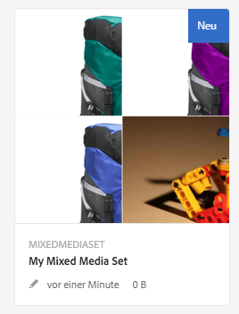
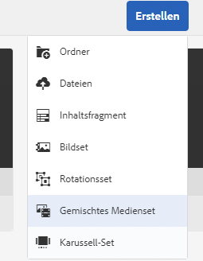
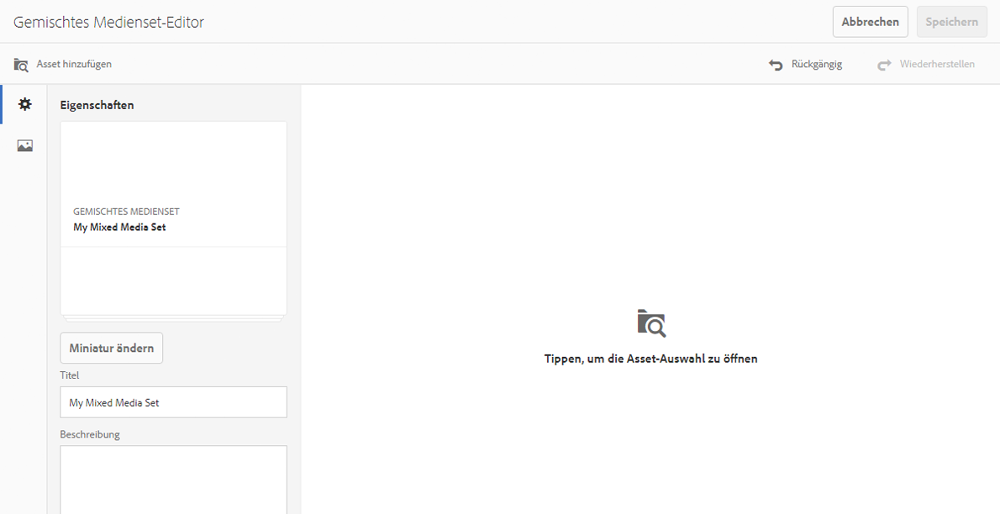
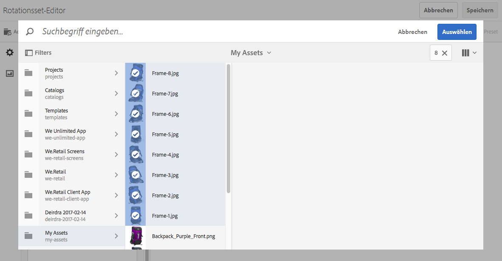
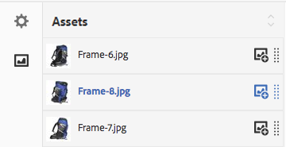

# Gemischte Mediensets{#mixed-media-sets}

Mit gemischten Mediensets können Sie eine Mischung aus Bildern, Bildsets, Rotationssets und Videos in einer Präsentation bereitstellen.

Gemischte Mediensets werden durch ein Banner mit dem Wort **[!UICONTROL MixedMediaSet]** gekennzeichnet. Darüber hinaus wird bei veröffentlichten Sets für gemischte Medien das Veröffentlichungsdatum (durch das **[!UICONTROL Welt]**-Symbol gekennzeichnet) zusammen mit dem Datum der letzten Änderung (durch das **[!UICONTROL Bleistift]**-Symbol gekennzeichnet) im Banner angezeigt.

>[!NOTE]
>
>Informationen zur Assets-Benutzeroberfläche finden Sie unter [Verwalten von Assets](/help/assets/manage-assets.md).

## Schnellstartanleitungen: Gemischte Mediensets {#quick-start-mixed-media-sets}

Führen Sie die folgenden Schritte aus, um den schnellen Einstieg in die Arbeit mit gemischten Mediensets zu schaffen:

1. [Laden Sie die Assets hoch.](#uploading-assets)

   Laden Sie zunächst die Bilder und Videos für Ihre gemischten Mediensets hoch. Erstellen Sie bei Bedarf [Bildsets](/help/assets/image-sets.md) und [Rotationssets](/help/assets/spin-sets.md). Da Benutzer Bilder im Viewer für gemischte Mediensets einzoomen können, sollten Sie die Bilder sorgfältig auswählen. Achten Sie darauf, dass die längste Seite der Bilder mindestens 2.000 Pixel hat.

   Siehe [Dynamic Media - Unterstützte Rasterbildformate](/help/assets/assets-formats.md#supported-raster-image-formats-dynamic-media) für eine Liste der Formate, die von gemischten Mediensets unterstützt werden.

1. [Erstellen Sie gemischte Mediensets](#creating-mixed-media-sets).

   Um ein gemischtes Medienset zu erstellen, wählen Sie auf der Seite &quot;Assets&quot;die Option **[!UICONTROL Erstellen]** > **[!UICONTROL gemischtes Medienset]** und benennen Sie das Set, wählen Sie die Assets und wählen Sie die Reihenfolge der Bilder aus.

   Siehe [Arbeiten mit Selektoren](/help/assets/working-with-selectors.md).

1. Richten Sie bei Bedarf [Viewer-Vorgaben für das gemischte Medienset](/help/assets/managing-viewer-presets.md) ein.

   Administratoren können Viewer-Vorgaben für gemischte Mediensets erstellen oder ändern. Um die gemischten Medien mit einer Viewer-Vorgabe anzuzeigen, wählen Sie das gemischte Medienset aus und wählen Sie im Dropdown-Menü in der linken Seitenleiste die Option **[!UICONTROL Viewer]** aus.

   Informationen zum Erstellen oder Bearbeiten von Viewer-Vorgaben finden Sie unter **[!UICONTROL Tools]** > **[!UICONTROL Assets]** > **[!UICONTROL Viewer-Vorgaben]**.

   Siehe [Hinzufügen und Bearbeiten von Viewer-Vorgaben](/help/assets/managing-viewer-presets.md).

1. [Zeigen Sie eine Vorschau der gemischten Mediensets an](#previewing-mixed-media-sets).

   Wenn Sie das gemischte Medienset auswählen, können Sie eine Vorschau davon anzeigen. Wählen Sie die Miniaturansichtssymbole aus, damit Sie das gemischte Medienset im ausgewählten Viewer untersuchen können. Sie können verschiedene Viewer aus dem Menü **[!UICONTROL Viewer]** wählen, das Sie links in der Leiste über die Dropdown-Liste aufrufen können.

1. [Veröffentlichen Sie gemischte Mediensets](#publishing-mixed-media-sets).

   Beim Veröffentlichen eines gemischten Mediensets wird die URL- und Integrationszeichenfolge aktiviert. Außerdem müssen Sie [die Viewer-Vorgabe veröffentlichen](/help/assets/managing-viewer-presets.md#publishing-viewer-presets).

1. [Verknüpfen Sie URLs mit einer Web-Anwendung](/help/assets/linking-urls-to-yourwebapplication.md) oder [betten Sie den Video- oder Bild-Viewer ein](/help/assets/embed-code.md).

   Adobe Experience Manager Assets erstellt URL-Aufrufe für gemischte Mediensets und aktiviert diese nach deren Veröffentlichung. Sie können diese URLs während der Asset-Vorschau kopieren. Alternativ dazu können Sie sie in Ihre Website einbetten.

   Markieren Sie dazu das gemischte Medienset und klicken Sie dann im Dropdown-Menü in der linken Seitenleiste auf **[!UICONTROL Viewer]**.

   Siehe [Verknüpfen eines gemischten Mediensets mit einer Web-Seite](/help/assets/linking-urls-to-yourwebapplication.md) und [Einbetten des Video- oder Bild-Viewers](/help/assets/embed-code.md).

Bei Bedarf können Sie die [gemischten Mediensets](#editing-mixed-media-sets) bearbeiten. Darüber hinaus können Sie [Eigenschaften von gemischten Mediensets](/help/assets/manage-assets.md#editing-properties) anzeigen und ändern.

>[!NOTE]
>
>Wenn Sie beim Erstellen von Sets Probleme haben, lesen Sie [Fehlerbehebung bei Dynamic Media - Scene7-Modus](/help/assets/troubleshoot-dms7.md).

## Assets hochladen {#uploading-assets}

Laden Sie zunächst die Bilder und Videos für Ihre gemischten Mediensets hoch. Da Benutzer Bilder im Viewer für gemischte Mediensets einzoomen können, sollten Sie die Bilder sorgfältig auswählen. Achten Sie darauf, dass die längste Seite der Bilder mindestens 2.000 Pixel hat.

Wenn Sie außerdem Rotationssets oder Bildsets zum gemischten Medienset hinzufügen möchten, erstellen Sie auch diese Sets.

Siehe [Dynamic Media - Unterstützte Rasterbildformate](/help/assets/assets-formats.md#supported-raster-image-formats-dynamic-media) für eine Liste der Formate, die von gemischten Mediensets unterstützt werden.

## Erstellen eines gemischten Mediensets {#creating-mixed-media-sets}

Sie können Ihrem gemischten Medienset Bilder, Bildsets, Rotationssets und Videos hinzufügen. Achten Sie darauf, dass die Dateien, Bildsets und Rotationssets veröffentlicht werden können, bevor Sie diese dem gemischten Medienset hinzufügen.

Assets, die Sie Ihrem Set hinzufügen, werden automatisch in alphanumerischer Reihenfolge hinzugefügt. Sie können die Anordnung oder Sortierung der Assets manuell ändern, nachdem sie hinzugefügt wurden.

**So erstellen Sie ein gemischtes Medienset:**

1. Gehen Sie in „Assets“ zu der Stelle, an der Sie ein gemischtes Medienset erstellen möchten, klicken Sie auf **[!UICONTROL Erstellen]** und wählen Sie **[!UICONTROL Gemischtes Medienset]**. Sie können das Set auch in einem Ordner erstellen, der die gewünschten Assets enthält. Der Editor für gemischte Mediensets wird angezeigt.

   

1. Geben Sie im Editor für gemischte Mediensets im Feld **[!UICONTROL Titel]** einen Namen für das gemischte Medienset ein. Der Name wird im Banner über dem Set für gemischte Medien angezeigt. Geben Sie optional eine Beschreibung ein.

   

   >[!NOTE]
   >
   >Beim Erstellen des gemischten Mediensets können Sie die entsprechende Miniatur ändern oder zulassen, dass Experience Manager die Miniatur automatisch basierend auf den Assets im gemischten Medienset auswählt. Um eine Miniatur auszuwählen, klicken Sie auf **[!UICONTROL Miniatur ändern]** und wählen Sie ein beliebiges Bild aus (Sie können auch zu anderen Ordnern gehen, um Bilder zu suchen). Wenn Sie eine Miniaturansicht ausgewählt haben und möchten, dass der Experience Manager eine aus dem gemischten Medienset generiert, wählen Sie **[!UICONTROL Zu automatischer Miniatur wechseln]**.

1. Wählen Sie die Asset-Auswahl aus, damit Sie Assets auswählen können, die Sie in das gemischte Medienset aufnehmen möchten. Wählen Sie sie aus und klicken Sie dann auf **[!UICONTROL Auswählen]**.

   Mit dem Asset-Selektor können Sie nach Assets suchen, indem Sie ein Keyword eingeben und auf **[!UICONTROL Eingabe]** tippen. Sie können auch Filter anwenden, um Ihre Suchergebnisse genauer abzustimmen. Sie können nach Pfad, Sammlung, Dateityp und Tag filtern. Wählen Sie den Filter aus und klicken Sie dann in der Symbolleiste auf das Symbol **[!UICONTROL Filter]**. Ändern Sie die Ansicht, indem Sie das Symbol **[!UICONTROL Ansicht]** und dann die **[!UICONTROL Listenansicht]**, **[!UICONTROL Spaltenansicht]** oder **[!UICONTROL Kartenansicht]** auswählen.

   Siehe [Arbeiten mit Selektoren](/help/assets/working-with-selectors.md).

   

1. Ordnen Sie die Bilder neu an, indem Sie sie in der Liste nach Bedarf nach oben oder unten ziehen. (Sie müssen dazu das Symbol für die **[!UICONTROL Neuanordnung]** auswählen.)

   

   Wenn Sie Miniaturen hinzufügen möchten, klicken Sie neben dem Bild auf das Symbol **+** **[!UICONTROL Miniatur]** und gehen Sie zur gewünschten Miniatur. Wenn Sie alle Miniaturen ausgewählt haben, klicken Sie auf **[!UICONTROL Speichern]**.

   >[!NOTE]
   >
   >Wenn Sie Assets hinzufügen möchten, wählen Sie **[!UICONTROL Asset hinzufügen]**.

1. Um ein Asset zu löschen, aktivieren Sie das entsprechende Kontrollkästchen und klicken Sie auf **[!UICONTROL Asset löschen]**.
1. Um eine Vorgabe anzuwenden, klicken Sie in der rechten oberen Ecke auf **[!UICONTROL Vorgabe]** und wählen Sie eine Vorgabe aus, die auf die Assets angewendet werden soll.
1. Wählen Sie **[!UICONTROL Speichern]** aus. Das neu erstellte gemischte Medienset wird in dem Ordner angezeigt, in dem es erstellt wurde.

## Bearbeiten eines gemischten Mediensets {#editing-mixed-media-sets}

Sie können direkt auf der Benutzeroberfläche verschiedene Bearbeitungsaufgaben für Assets in gemischten Mediensets ausführen, [genauso wie bei allen anderen Assets in Assets](/help/assets/manage-assets.md). Sie können außerdem die folgenden Aktionen in gemischten Mediensets ausführen:

* Fügen Sie dem gemischten Medienset Assets hinzu.
* Ordnen Sie Assets im gemischten Medienset neu an.
* Löschen Sie Assets im gemischten Medienset.
* Wenden Sie Viewer-Vorgaben an.
* Ändern Sie die Standardminiatur.

**So bearbeiten Sie ein gemischtes Medienset:**

1. Führen Sie einen der folgenden Schritte aus:

   * Bewegen Sie den Mauszeiger über ein Asset in einem gemischten Medienset und klicken Sie auf **[!UICONTROL Bearbeiten]** (Stiftsymbol).
   * Bewegen Sie den Mauszeiger über ein Asset in einem gemischten Medienset und klicken Sie auf **[!UICONTROL Auswählen]** (Häkchensymbol) und dann auf **[!UICONTROL Bearbeiten]** in der Symbolleiste.

   * Klicken Sie auf ein Asset in einem gemischten Medienset und dann auf **[!UICONTROL Bearbeiten]** (Stiftsymbol) in der Symbolleiste.

1. Führen Sie im Editor für gemischte Mediensets einen der folgenden Schritte aus:

   * Um Assets neu anzuordnen, klicken Sie im linken Bereich auf **[!UICONTROL Assets]** (Bildsymbol) und ziehen Sie das Asset an eine neue Position.
   * Um Assets hinzuzufügen, klicken Sie in der Symbolleiste auf **[!UICONTROL Asset hinzufügen]**. Navigieren Sie zu den Assets. Bewegen Sie bei jedem Asset, das Sie hinzufügen möchten, den Mauszeiger über dem Bild des Assets (nicht über dem Namen des Assets) und klicken Sie auf das Häkchensymbol. Klicken Sie in der oberen rechten Ecke auf **[!UICONTROL Auswählen]**.

   * Um ein Asset zu löschen, klicken Sie im linken Bereich auf **[!UICONTROL Assets]** (Bildsymbol) und wählen dann das Asset aus. Wählen Sie in der Symbolleiste **[!UICONTROL Asset löschen]**.

   * Um Assets anhand des Namens in aufsteigender oder absteigender Reihenfolge zu sortieren, klicken Sie im linken Bereich auf **[!UICONTROL Assets]** (Bildsymbol). Klicken Sie rechts neben der Überschrift **[!UICONTROL Assets]** auf das Caret-Zeichen nach oben oder unten.

      >[!NOTE]
      >
      >* Um ein komplettes gemischtes Medienset aus einem Anzeigemodus zu löschen (z. B. **[!UICONTROL Kartenansicht]** oder **[!UICONTROL Spaltenansicht]**), navigieren Sie zum gemischten Medienset. Bewegen Sie den Mauszeiger über das Asset und wählen Sie das Häkchensymbol aus, um es auszuwählen. Drücken Sie die **[!UICONTROL Rücktaste]** auf der Tastatur oder klicken Sie auf **[!UICONTROL Mehr]** (drei Punkte) in der Symbolleiste und dann auf **[!UICONTROL Löschen]**.
      >
      >* Sie können Assets in einem gemischten Medienset bearbeiten, indem Sie zum Set navigieren und auf **[!UICONTROL Festlegen von Mitgliedern]** in der linken Leiste. Wählen Sie die **[!UICONTROL Bleistift]** -Symbol für ein einzelnes Asset verwenden, damit Sie es im Bearbeitungsfenster öffnen können.

1. Klicken Sie auf **[!UICONTROL Speichern]**, wenn Sie mit der Bearbeitung fertig sind.

   >[!NOTE]
   >
   >* Um die Assets in einem gemischten Medienset zu bearbeiten, navigieren Sie zum gemischten Medienset. Tippen Sie auf das Set (wählen Sie es nicht aus), damit es auf der Seite &quot;Experience Manager-Set-Vorschau&quot;geöffnet wird. Klicken Sie in der linken Leiste auf das Caret-Zeichen nach unten, um die Dropdown-Liste zu öffnen, und klicken Sie dann auf **[!UICONTROL Set-Mitglieder]**. Bewegen Sie den Mauszeiger auf der Seite „Set-Mitglieder“ über ein Asset und klicken Sie dann auf **[!UICONTROL Bearbeiten]** (Stiftsymbol), um die Bearbeitungsseite zu öffnen.
   >
   >* Um ein komplettes gemischtes Medienset aus einem Anzeigemodus zu löschen (z. B. Karten- oder Spaltenansicht), navigieren Sie zum gemischten Medienset. Bewegen Sie den Mauszeiger über das Set und klicken Sie dann auf **Auswählen** (Häkchensymbol). Drücken Sie die **[!UICONTROL Rücktaste]** oder klicken Sie auf **[!UICONTROL Mehr]** (Reihe von drei Punkten) und dann auf **[!UICONTROL Löschen]**.

## Vorschau eines gemischten Mediensets {#previewing-mixed-media-sets}

Siehe [Asset-Vorschau](/help/assets/previewing-assets.md) für Details zur Vorschau von gemischten Mediensets.

## Veröffentlichen eines gemischten Mediensets {#publishing-mixed-media-sets}

Siehe [Veröffentlichen von Assets](/help/assets/publishing-dynamicmedia-assets.md) für Details zum Veröffentlichen von gemischten Mediensets.

>[!NOTE]
>
>Wenn das gemischte Medienset bei der ersten Veröffentlichung nicht vollständig an den Bereitstellungs-Service übertragen wird, veröffentlichen Sie das gemischte Medienset erneut.
