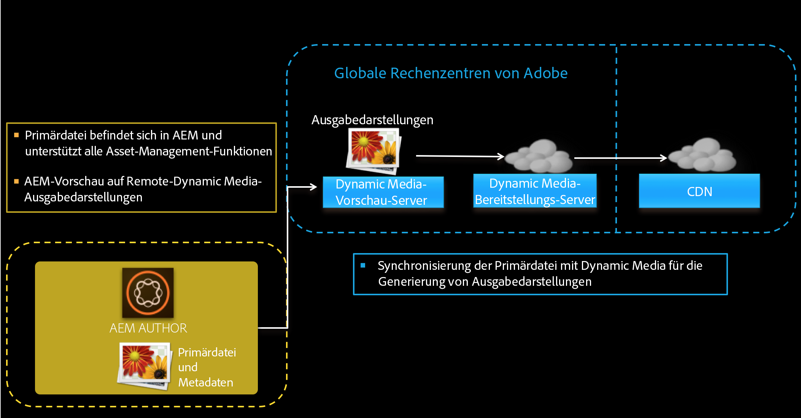
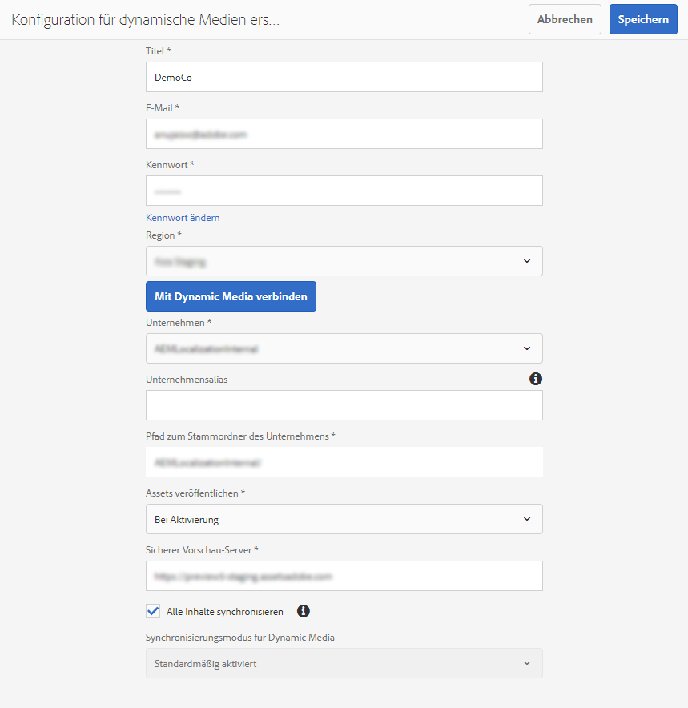
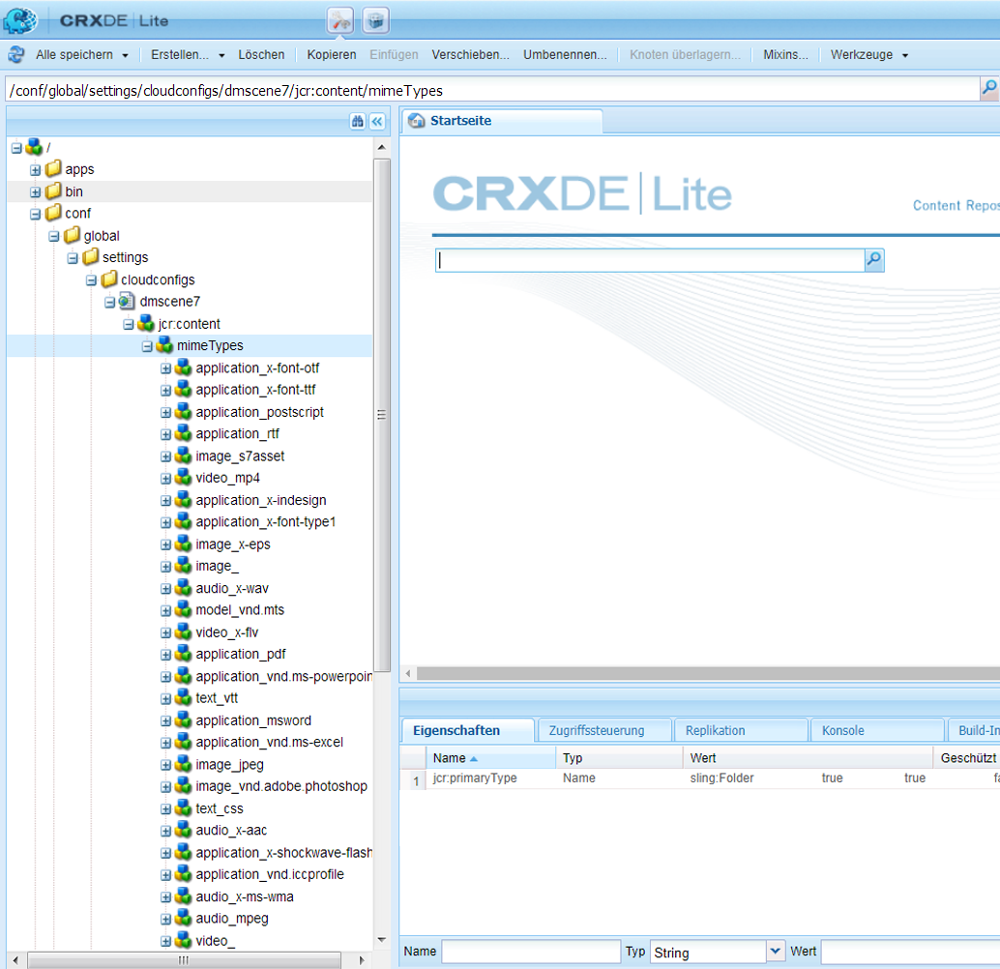
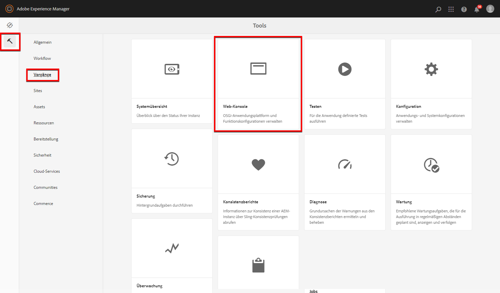
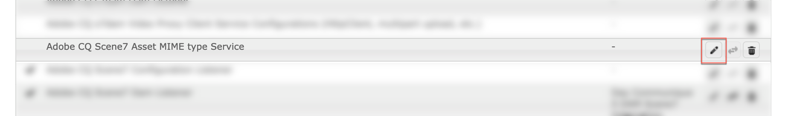
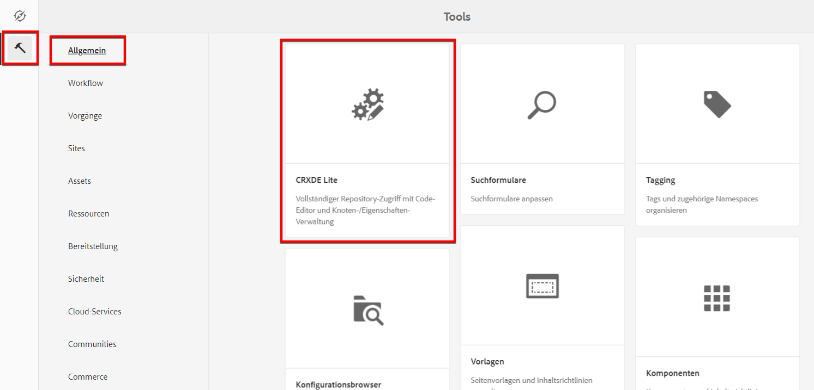
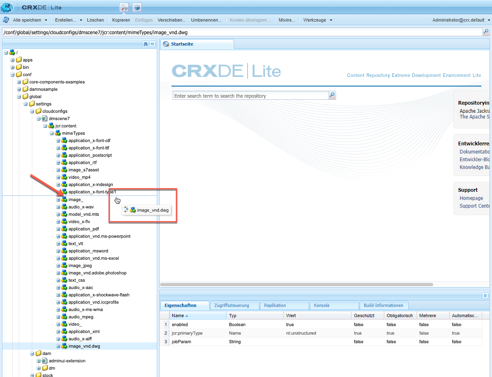
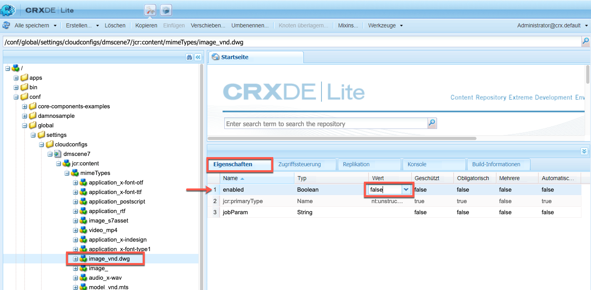
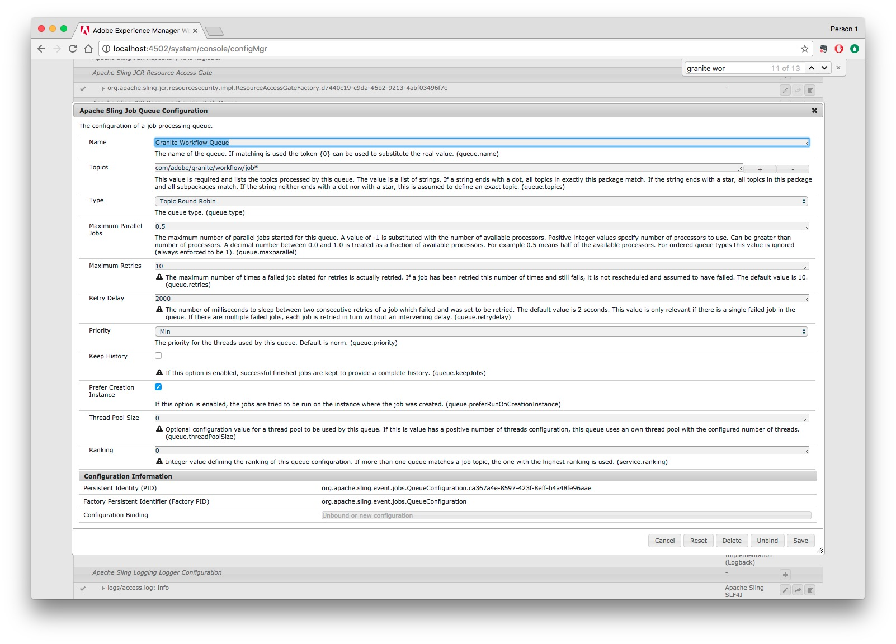
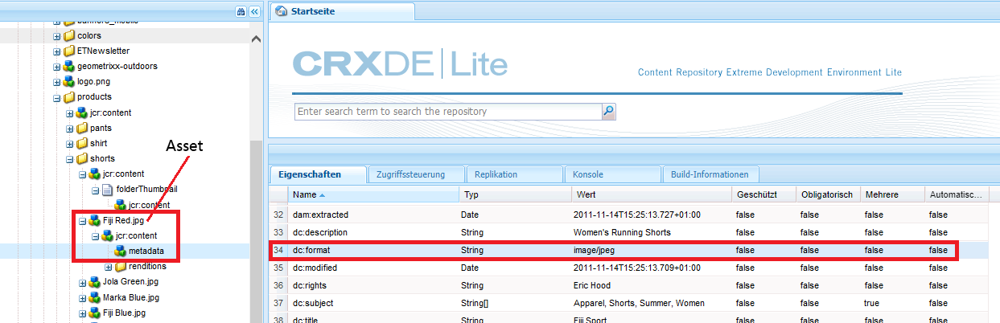

# OPTION A - Konfigurieren von Dynamic Media - Scene7-Modus{#configuring-dynamic-media-scene-mode}

>[!NOTE]
>
>OPTION A - DIE BEIDEN NEUEN THEMEN, DIE ICH GESCHRIEBEN HABE, WERDEN GELÖSCHT. BUT BEFORE DELETING THE TOPICS, ALL THEIR CONTENT WAS MOVED INTO THIS TOPIC, INTO THE RESPECTIVE AREAS WHERE I ALREADY TALK ABOUT GENERAL SETTINGS AND PUBLISH SETUP.

Wenn Sie Adobe Experience Manager für verschiedene Umgebungen wie Entwicklung, Staging und Produktion verwenden, konfigurieren Sie Dynamic Media-Cloud Services für jede dieser Umgebungen.

## Architekturgrafik von Dynamic Media – Scene7-Modus {#architecture-diagram-of-dynamic-media-scene-mode}

**RICK: BEHALTEN WIE IST**

Die folgende Architekturgrafik beschreibt die Funktionsweise von Dynamic Media – Scene7-Modus.

Mit der neuen Architektur ist Experience Manager für Primärquellen-Assets und Synchronisierungen mit Dynamic Media für die Verarbeitung und Veröffentlichung von Assets verantwortlich:

1. Wenn das Asset aus der Primärquelle in Experience Manager hochgeladen wird, wird es in Dynamic Media repliziert. Ab diesem Punkt übernimmt Dynamic Media die gesamte Asset-Verarbeitung und die Erstellung von Ausgabedarstellungen, z. B. Videokodierung und dynamische Varianten eines Bilds.
(Im Modus Dynamic Media - Scene7 beträgt die standardmäßige Upload-Dateigröße 2 GB oder weniger. Informationen zum Hochladen von Dateigrößen von 2 GB bis 15 GB finden Sie unter [(Optional) Konfigurieren Sie den Dynamic Media-Scene7-Modus für das Hochladen von Assets mit mehr als 2 GB](#optional-config-dms7-assets-larger-than-2gb).
1. Nachdem die Ausgabedarstellungen generiert wurden, kann der Experience Manager sicher auf die Dynamic Media-Remote-Ausgabedarstellungen zugreifen und eine Vorschau davon anzeigen (es werden keine Binärdateien an die Experience Manager-Instanz zurückgesendet).
1. Nachdem der Inhalt veröffentlicht und genehmigt werden kann, wird der Dynamic Media-Dienst Trigger, Inhalte an Bereitstellungsserver zu senden und im CDN (Content Delivery Network) Inhalte zwischenzuspeichern.



>[!IMPORTANT]
>
>Für die folgende Funktionsliste müssen Sie das vordefinierte CDN verwenden, das im Lieferumfang von Adobe Experience Manager - Dynamic Media enthalten ist. Andere benutzerdefinierte CDN werden von diesen Funktionen nicht unterstützt.
>
>* [Intelligente Bildbearbeitung](/help/assets/imaging-faq.md)
>* [Cache-Invalidierung](/help/assets/invalidate-cdn-cache-dynamic-media.md)
>* [Hotlink-Schutz](/help/assets/hotlink-protection.md)
>* [Bereitstellung von Inhalten per HTTP/2](/help/assets/http2.md)
>* URL-Umleitung auf CDN-Ebene
>* Akamai ChinaCDN (für optimalen Versand in China)


## Aktivieren von Dynamic Media im Scene7-Modus {#enabling-dynamic-media-in-scene-mode}

**RICK: BEHALTEN WIE IST**

[Dynamic Media ist standardmäßig deaktiviert. ](https://business.adobe.com/de/products/experience-manager/assets/dynamic-media.html) Um die Funktionen von Dynamic Media nutzen zu können, müssen Sie sie aktivieren.

>[!WARNING]
>
>Der Modus Dynamic Media - Scene7 ist für die *Nur Experience Manager-Autoreninstanz*. Daher müssen Sie `runmode=dynamicmedia_scene7` in der Experience Manager-Autoreninstanz, *not* die Experience Manager-Veröffentlichungsinstanz.

Um Dynamic Media zu aktivieren, müssen Sie Experience Manager mit dem `dynamicmedia_scene7` Führen Sie den Ausführungsmodus über die Befehlszeile aus, indem Sie Folgendes in ein Terminal-Fenster eingeben (als Beispielanschluss wird 4502 verwendet):

```shell
java -Xms4096m -Xmx4096m -Doak.queryLimitInMemory=500000 -Doak.queryLimitReads=500000 -jar cq-quickstart-6.5.0.jar -gui -r author,dynamicmedia_scene7 -p 4502
```

## (Optional) Migrieren von Dynamic Media-Vorgaben und -Konfigurationen von 6.3 auf 6.5 ohne Ausfallzeit {#optional-migrating-dynamic-media-presets-and-configurations-from-to-zero-downtime}

**RICK: BEHALTEN WIE IST**

Die Aktualisierung von Experience Manager Dynamic Media von 6.3 auf 6.4 oder 6.5 bietet jetzt die Möglichkeit, Bereitstellungen ohne Ausfallzeiten zu ermöglichen. So migrieren Sie alle Vorgaben und Konfigurationen aus `/etc` nach `/conf` Stellen Sie sicher, dass Sie in CRXDE Lite den folgenden curl-Befehl ausführen.

>[!NOTE]
>
>Wenn Sie Ihre Experience Manager-Instanz im Kompatibilitätsmodus ausführen - d. h., Sie haben das Kompatibilitätspaket installiert - müssen Sie diese Befehle nicht ausführen.

Bei allen Upgrades, mit oder ohne Kompatibilitätspaket, können Sie die standardmäßigen Viewer-Vorgaben kopieren, die ursprünglich mit Dynamic Media geliefert wurden, indem Sie den folgenden Linux® curl-Befehl ausführen:

`curl -u admin:admin -X POST https://<server_address>:<server_port>/libs/settings/dam/dm/presets/viewer.pushviewerpresets.json`

So migrieren Sie benutzerdefinierte Viewer-Vorgaben und -Konfigurationen, die Sie aus erstellt haben `/etc` nach `/conf`, führen Sie den folgenden Linux® curl-Befehl aus:

`curl -u admin:admin -X POST https://<server_address>:<server_port>/libs/settings/dam/dm/presets.migratedmcontent.json`

## Feature Pack 18912 für Massenmigration von Assets installieren {#installing-feature-pack-for-bulk-asset-migration}

**RICK: BEHALTEN WIE IST**

Die Installation von Feature Pack 18912 ist *optional*.

Mit Feature Pack 18912 können Sie Assets entweder per FTP stapelweise erfassen oder Assets im Experience Manager-Modus entweder aus dem Dynamic Media- Hybridmodus oder aus Dynamic Media Classic in den Dynamic Media-Scene7-Modus migrieren. Es ist verfügbar unter [Adobe Professional Services](https://business.adobe.com/de/customers/consulting-services/main.html).

Siehe [Feature Pack 18912 für Massenmigration von Assets installieren](/help/assets/bulk-ingest-migrate.md) für weitere Informationen.

## Erstellen einer Dynamic Media-Konfiguration in Cloud Services {#configuring-dynamic-media-cloud-services}

**RICK: BEHALTEN WIE IST**

**Vor der Konfiguration von Dynamic Media** - Nachdem Sie Ihre Bereitstellungs-E-Mail mit Dynamic Media-Anmeldeinformationen erhalten haben, müssen Sie die [Dynamic Media Classic-Desktop-Applikation](https://experienceleague.adobe.com/docs/dynamic-media-classic/using/getting-started/signing-out.html?lang=de#getting-started), dann melden Sie sich bei Ihrem Konto an, um Ihr Kennwort zu ändern. Das Kennwort aus der Bereitstellungs-E-Mail wird systemseitig erstellt und ist nur als temporäres Kennwort vorgesehen. Sie müssen das Kennwort aktualisieren, damit Dynamic Media Cloud Service mit den richtigen Anmeldedaten eingerichtet wird.



**So erstellen Sie eine Dynamic Media-Konfiguration in Cloud Services:**

1. Wählen Sie im Experience Manager-Autorenmodus das Experience Manager-Logo aus, um auf die globale Navigationskonsole zuzugreifen. Wählen Sie dann das Werkzeugsymbol aus und navigieren Sie zu **[!UICONTROL Cloud Services]** > **[!UICONTROL Dynamic Media-Konfiguration]**.
1. Wählen Sie auf der Seite &quot;Dynamic Media Configuration Browser&quot;im linken Bereich die Option **[!UICONTROL global]** (Wählen Sie nicht das Ordnersymbol links neben **[!UICONTROL global]**), wählen Sie **[!UICONTROL Erstellen]**.
1. Geben Sie auf der Seite **[!UICONTROL Konfiguration für dynamische Medien erstellen]** einen Titel, die E-Mail-Adresse des Dynamic Media-Kontos und ein Kennwort ein und wählen Sie Ihre Region aus. Diese Informationen erhalten Sie in der Bereitstellungs-E-Mail von Adobe. Wenden Sie sich an den Kundensupport von Adobe , wenn Sie die E-Mail nicht erhalten haben.

   Wählen Sie **[!UICONTROL Mit Dynamic Media verbinden]** aus.

   >[!NOTE]
   **RICK: HALTEN SIE SO, WIE ES IST?** Nachdem Sie Ihre Bereitstellungs-E-Mail mit Dynamic Media-Anmeldeinformationen erhalten haben, öffnen Sie die [Dynamic Media Classic-Desktop-Applikation](https://experienceleague.adobe.com/docs/dynamic-media-classic/using/getting-started/signing-out.html#getting-started), dann melden Sie sich bei Ihrem Konto an, um Ihr Kennwort zu ändern. Das Kennwort aus der Bereitstellungs-E-Mail wird systemseitig erstellt und ist nur als temporäres Kennwort vorgesehen. Sie müssen das Kennwort aktualisieren, damit Dynamic Media Cloud Service mit den richtigen Anmeldedaten eingerichtet wird.

1. Nachdem die Verbindung erfolgreich hergestellt wurde, richten Sie Folgendes ein. Überschriften mit einem Sternchen (*) sind erforderlich:

   * **[!UICONTROL Unternehmen]** – der Name des Dynamic Media-Kontos. Sie haben mehrere Dynamic Media-Konten. Sie können beispielsweise verschiedene Untermarken, Divisionen, Staging- oder Produktionsumgebungen haben.

   * **[!UICONTROL Firmen-Root-Ordnerpfad]**

   * **[!UICONTROL Assets veröffentlichen]** – Sie können zwischen den folgenden drei Optionen wählen:
      * **[!UICONTROL Sofort]** bedeutet, dass das System hochgeladene Assets aufnimmt und umgehend die URL/den Link zur Einbettung bereitstellt. Zum Veröffentlichen von Assets ist kein Benutzereingriff erforderlich.
      * **[!UICONTROL Bei Aktivierung]** bedeutet, dass Sie das Asset zuerst explizit veröffentlichen müssen, bevor eine URL/ein Link zur Einbettung bereitgestellt wird.<br><!-- CQDOC-17478, Added March 9, 2021-->Ab Experience Manager 6.5.8 spiegelt die Experience Manager-Veröffentlichungsinstanz genaue Dynamic Media-Metadatenwerte wider, z. B. `dam:scene7Domain` und `dam:scene7FileStatus` in **[!UICONTROL Bei Aktivierung]** Nur Veröffentlichungsmodus. Um diese Funktion zu aktivieren, installieren Sie Service Pack 8 und starten Sie dann Experience Manager neu. Wechseln Sie zum Sling Config Manager. Suchen Sie die Konfiguration für `Scene7ActivationJobConsumer Component` oder erstellen Sie einen neuen). Aktivieren Sie das Kontrollkästchen **[!UICONTROL Replizieren von Metadaten nach der Dynamic Media-Veröffentlichung]**, wählen Sie **[!UICONTROL Speichern]**.

         

      * **[!UICONTROL Selektive Veröffentlichung]** Mit dieser Option können Sie steuern, welche Ordner in Dynamic Media veröffentlicht werden. Damit können Sie Funktionen wie smartes Zuschneiden oder dynamische Ausgabedarstellungen verwenden oder bestimmen, welche Ordner ausschließlich in Experience Manager zur Vorschau veröffentlicht werden. Dieselben Assets *not* in Dynamic Media veröffentlicht, um öffentlich zugänglich zu machen.<br>Sie können diese Option hier im **[!UICONTROL Dynamic Media Cloud-Konfiguration]** oder, falls gewünscht, können Sie diese Option auf Ordnerebene in der **[!UICONTROL Eigenschaften]**.<br>Siehe [Arbeiten mit selektiver Veröffentlichung in Dynamic Media](/help/assets/selective-publishing.md).<br>Wenn Sie diese Konfiguration später ändern oder später auf Ordnerebene ändern, wirken sich diese Änderungen nur auf neue Assets aus, die Sie von diesem Zeitpunkt an hochladen. Der Veröffentlichungsstatus vorhandener Assets im Ordner bleibt unverändert, bis Sie ihn im Dialogfeld **[!UICONTROL Quick Publish]** oder **[!UICONTROL Veröffentlichung verwalten]** manuell ändern.
   * **[!UICONTROL Sicherer Vorschau-Server]** – bietet Ihnen die Möglichkeit, den URL-Pfad zu Ihrem Vorschau-Server für sichere Ausgaben anzugeben. Das heißt, dass Experience Manager nach der Generierung von Ausgabedarstellungen sicher auf die Dynamic Media-Remote-Ausgabedarstellungen zugreifen und eine Vorschau davon anzeigen können (es werden keine Binärdateien an die Experience Manager-Instanz zurückgesendet).
Sofern Sie keine gesonderte Vereinbarung zum Verwenden Ihrer eigenen Unternehmens-Server oder eines speziellen Servers getroffen haben, empfiehlt Adobe, diese Einstellung nicht zu verändern.

   * **[!UICONTROL Alle Inhalte synchronisieren]** - <!-- NEW OPTION, CQDOC-15371, Added March 4, 2020-->Standardmäßig ausgewählt. Deaktivieren Sie diese Option, wenn Sie Assets aus der Synchronisierung mit Dynamic Media gezielt ein- oder ausschließen möchten. Wenn Sie diese Option deaktivieren, können Sie aus den beiden folgenden Synchronisierungsmodi für Dynamic Media wählen:

   * **[!UICONTROL Synchronisierungsmodus für Dynamic Media]**
      * **[!UICONTROL Standardmäßig aktiviert]** – Die Konfiguration wird auf alle Ordner angewendet, es sei denn, Sie markieren einen Ordner speziell zum Ausschließen. <!-- you can then deselect the folders that you do not want the configuration applied to.-->
      * **[!UICONTROL Standardmäßig deaktiviert]** – Die Konfiguration wird auf einen Ordner erst dann angewendet, wenn Sie einen ausgewählten Ordner explizit zur Synchronisierung mit Dynamic Media markieren.
Um einen ausgewählten Ordner für die Synchronisierung mit Dynamic Media zu markieren, wählen Sie einen Asset-Ordner aus und wählen Sie dann in der Symbolleiste die Option **[!UICONTROL Eigenschaften]**. Wählen Sie auf der Registerkarte **[!UICONTROL Details]** in der Dropdown-Liste **[!UICONTROL Synchronisierungsmodus für Dynamic Media]** eine der folgenden drei Optionen aus. Wenn Sie fertig sind, wählen Sie **[!UICONTROL Speichern]** aus. *Denken Sie daran: Diese drei Optionen stehen nicht zur Verfügung, wenn Sie zuvor **[!UICONTROL Alle Inhalte synchronisieren]**ausgewählt haben.* Weitere Informationen finden Sie unter [Arbeiten mit selektiver Veröffentlichung auf Ordnerebene in Dynamic Media](/help/assets/selective-publishing.md).
         * **[!UICONTROL Übernommen]** - Kein expliziter Synchronisierungswert für den Ordner; Stattdessen übernimmt der Ordner den Synchronisierungswert von einem seiner Vorgängerordner oder den Standardmodus in der Cloud-Konfiguration. Der detaillierte Status für geerbte Daten wird als QuickInfo angezeigt.
         * **[!UICONTROL Aktivieren für Unterordner]**: Schließt alle Elemente in dieser Unterstruktur zur Synchronisierung mit Dynamic Media ein. Die ordnerspezifischen Einstellungen setzen den Standardmodus in der Cloud-Konfiguration außer Kraft.
         * **[!UICONTROL Deaktiviert für Unterordner]**: Schließt alle Elemente in dieser Unterstruktur von der Synchronisierung mit Dynamic Media aus.

   >[!NOTE]
   Die Versionierung wird in DMS7 nicht unterstützt. Eine verzögerte Aktivierung gilt nur, wenn auf der Seite „Konfiguration von Dynamic Media bearbeiten“ die Option **[!UICONTROL Assets veröffentlichen]** auf **[!UICONTROL Bei Aktivierung]** eingestellt ist, und erst dann, wenn das Asset zum ersten Mal aktiviert wird.
   Wenn ein Asset aktiviert wurde, werden alle Aktualisierungen automatisch live in der S7-Bereitstellung übernommen.

1. Klicken Sie auf **[!UICONTROL Speichern]**.
1. Um eine sichere Vorschau von Dynamic Media-Inhalten anzuzeigen, bevor sie veröffentlicht werden, müssen Sie die Experience Manager-Autoreninstanz &quot;neu&quot;installieren, um eine Verbindung mit Dynamic Media herzustellen:

   * **RICK: LINK ZU NEUEM THEMA ZUR VERÖFFENTLICHUNGSEINRICHTUNG** Öffnen Sie die [Dynamic Media Classic-Desktop-Applikation](https://experienceleague.adobe.com/docs/dynamic-media-classic/using/getting-started/signing-out.html#getting-started), und melden Sie sich dann bei Ihrem Konto an. Ihre Benutzer- und Anmeldedaten haben Sie zum Zeitpunkt der Bereitstellung von Adobe erhalten. Wenn Sie diese Informationen nicht haben, wenden Sie sich an den Kundensupport von Adobe.

   * Navigieren Sie in der Navigationsleiste oben rechts auf der Seite zu **[!UICONTROL Einrichtung]** > **[!UICONTROL Anwendungseinstellungen]** > **[!UICONTROL Veröffentlichungseinstellungen]** > **[!UICONTROL Image-Server]**.

   * Wählen Sie auf der Seite „Veröffentlichung zum Image-Server“ in der Dropdown-Liste „Veröffentlichungskontext“ die Option **[!UICONTROL Image-Serving testen]**.
   * Wählen Sie für den Client-Adressfilter die Option **[!UICONTROL Hinzufügen]** aus.
   * Aktivieren Sie das Kontrollkästchen, um die Adresse zu aktivieren. Geben Sie die IP-Adresse der Experience Manager-Autoreninstanz (nicht die Dispatcher-IP) ein.
   * Klicken Sie auf **[!UICONTROL Speichern]**.

Sie haben nun die Grundkonfiguration abgeschlossen und können Dynamic Media im Scene7-Modus verwenden.

Wenn Sie Ihre Konfiguration weiter anpassen möchten, können Sie optional eine der Aufgaben unter [(Optional) Konfigurieren Sie die erweiterten Einstellungen im Modus Dynamic Media - Scene7 .](#optional-configuring-advanced-settings-in-dynamic-media-scene-mode).

## (Optional) Konfigurieren Sie die erweiterten Einstellungen im Modus Dynamic Media - Scene7 . {#optional-configuring-advanced-settings-in-dynamic-media-scene-mode}

**RICK: BEHALTEN WIE IST**

Wenn Sie die Konfiguration weiter anpassen und Dynamic Media – Scene7-Modus einrichten oder die Leistung optimieren möchten, können Sie eine oder mehrere der folgenden *optionalen* Aufgaben durchführen:

* [(Optional) Konfigurieren Sie den Dynamic Media-Scene7-Modus für das Hochladen von Assets mit mehr als 2 GB](#optional-config-dms7-assets-larger-than-2gb)

* [(Optional) Einrichtung und Konfiguration der Einstellungen von Dynamic Media – Scene7-Modus](#optional-setup-and-configuration-of-dynamic-media-scene7-mode-settings)

* [(Optional) Steigern Sie die Leistung des Modus Dynamic Media - Scene7 .](#optional-tuning-the-performance-of-dynamic-media-scene-mode)

* [(Optional) Filtern von Assets für die Replikation](#optional-filtering-assets-for-replication)

### (Optional) Konfigurieren Sie den Dynamic Media-Scene7-Modus für das Hochladen von Assets mit mehr als 2 GB {#optional-config-dms7-assets-larger-than-2gb}

**RICK: BEHALTEN WIE IST**

Im Modus Dynamic Media - Scene7 beträgt die standardmäßige Größe der Asset-Upload-Datei 2 GB oder weniger. Sie können jedoch optional das Hochladen von Assets konfigurieren, die größer als 2 GB und bis zu 15 GB sind.

Wenn Sie diese Funktion verwenden möchten, beachten Sie die folgenden Voraussetzungen und Punkte:

* Sie müssen Experience Manager 6.5 mit Service Pack 6.5.4.0 oder höher im Modus Dynamic Media - Scene7 ausführen.
* Diese Funktion zum Hochladen großer Dateien wird nur für [*Managed Services*](https://business.adobe.com/products/experience-manager/managed-services.html) -Kunden.
* Stellen Sie sicher, dass Ihre Experience Manager-Instanz mit Amazon S3 oder Microsoft® Azure Blob Storage konfiguriert ist.

   >[!NOTE]
   Konfigurieren Sie den Azure Blob-Speicher mit einem Zugriffsschlüssel und einem geheimen Schlüssel, da diese große Upload-Funktion von AzureSas in der Blob-Speicherkonfiguration nicht unterstützt wird.

* Oak&#39;s [Download für direkten Binärzugriff](https://jackrabbit.apache.org/oak/docs/features/direct-binary-access.html) aktiviert ist (Oak&#39;s *Hochladen von direktem Binärzugriff* nicht erforderlich).

   Um den Download für direkten Binärzugriff zu aktivieren, legen Sie die Eigenschaft fest `presignedHttpDownloadURIExpirySeconds > 0` in der Datenspeicher-Konfiguration. Der Wert sollte lang genug sein, um größere Binärdateien herunterzuladen und möglicherweise erneut zu versuchen.

* Assets mit mehr als 15 GB werden nicht hochgeladen. (Die Größenbeschränkung wird in Schritt 8 unten festgelegt.)
* Wenn die **[!UICONTROL Dynamic Media-Neuverarbeitung]** Der Assets-Workflow wird für einen Ordner ausgelöst. Er verarbeitet alle großen Assets, die bereits mit dem Dynamic Media-Unternehmen synchronisiert sind. Wenn jedoch noch keine großen Assets im Ordner synchronisiert sind, wird das Asset nicht hochgeladen. Um vorhandene große Assets in Dynamic Media zu synchronisieren, können Sie **[!UICONTROL Dynamic Media-Neuverarbeitung]** Assets-Workflow für einzelne Assets.

**So konfigurieren Sie den Dynamic Media-Scene7-Modus für das Hochladen von Assets mit mehr als 2 GB:**

1. Wählen Sie in Experience Manager das Experience Manager-Logo aus, um auf die globale Navigationskonsole zuzugreifen, und navigieren Sie dann zu **[!UICONTROL Instrumente]** > **[!UICONTROL Allgemein]** > **[!UICONTROL CRXDE Lite]**.

1. Führen Sie im Fenster CRXDE Lite einen der folgenden Schritte aus:

   * Navigieren Sie in der linken Leiste zum folgenden Pfad:

      `/libs/dam/gui/content/assets/jcr:content/actions/secondary/create/items/fileupload`

   * Kopieren Sie den obigen Pfad und fügen Sie ihn in das Feld Pfad der CRXDE Lite unter der Symbolleiste ein. Drücken Sie dann die `Enter`.

1. Klicken Sie in der linken Leiste mit der rechten Maustaste auf `fileupload`und wählen Sie dann im Popup-Menü **[!UICONTROL Überlagerungsknoten]**.

   

1. Wählen Sie im Dialogfeld Überlagerungsknoten die **[!UICONTROL Knotentypen abgleichen]** aktivieren, um die Option zu aktivieren, und wählen Sie **[!UICONTROL OK]**.

   

1. Führen Sie im Fenster CRXDE Lite eine der folgenden Aktionen aus:

   * Navigieren Sie in der linken Leiste zum folgenden Überlagerungsknotenpfad:

      `/apps/dam/gui/content/assets/jcr:content/actions/secondary/create/items/fileupload`

   * Kopieren Sie den obigen Pfad und fügen Sie ihn in das Feld Pfad der CRXDE Lite unter der Symbolleiste ein. Drücken Sie dann die `Enter`.

1. Im **[!UICONTROL Eigenschaften]** Registerkarte unter **[!UICONTROL Name]** Spalte, suchen `sizeLimit`.
1. Rechts neben dem `sizeLimit` name unter **[!UICONTROL Wert]** doppelklicken Sie auf das Wertefeld.
1. Geben Sie den entsprechenden Wert in Byte ein, damit Sie die maximale Upload-Größe festlegen können. Um beispielsweise die maximale Asset-Größe für den Upload auf 10 GB zu erhöhen, geben Sie `10737418240` im Wertefeld.
Sie können einen Wert von bis zu 15 GB (`2013265920` Byte). In diesem Fall werden hochgeladene Assets, die größer als 15 GB sind, nicht hochgeladen.


   

1. Wählen Sie links oben im Fenster &quot;CRXDE Lite&quot;die Option **[!UICONTROL Alle speichern]**.

   *Legen Sie jetzt den Timeout für den Adobe Granite Workflow External Process Job Handler fest, indem Sie Folgendes durchführen:*

1. Klicken Sie in Experience Manager auf das Experience Manager-Logo, um auf die Konsole für die globale Navigation zuzugreifen.
1. Führen Sie eine der folgenden Aktionen aus:

   * Navigieren Sie zum folgenden URL-Pfad:

      `localhost:4502/system/console/configMgr/com.adobe.granite.workflow.core.job.ExternalProcessJobHandler`

   * Kopieren Sie den obigen Pfad und fügen Sie ihn in das URL-Feld Ihres Browsers ein. Stellen Sie sicher, dass Sie `localhost:4502` mit Ihrer eigenen Experience Manager-Instanz.

1. Im **[!UICONTROL Adobe Granite Workflow External Process Job Handler]** im Dialogfeld **[!UICONTROL Max. Timeout]** -Feld, setzen Sie den Wert auf `18000` Minuten (fünf Stunden). Der Standardwert ist 10800 Minuten (drei Stunden).

   

1. Wählen Sie in der rechten unteren Ecke des Dialogfelds die Option **[!UICONTROL Speichern]**.

   *Legen Sie jetzt den Timeout für den Prozessschritt &quot;Scene7 Direct Binary Upload&quot;fest, indem Sie Folgendes durchführen:*

1. Klicken Sie in Experience Manager auf das Experience Manager-Logo, um auf die Konsole für die globale Navigation zuzugreifen.
1. Gehen Sie zu **[!UICONTROL Tools]** > **[!UICONTROL Workflow]** > **[!UICONTROL Modelle]**.
1. Wählen Sie auf der Seite &quot;Workflow-Modelle&quot;die Option **[!UICONTROL Dynamic Media-Kodierungsvideo]**.
1. Wählen Sie in der Symbolleiste die Option **[!UICONTROL Bearbeiten]** aus.
1. Doppelklicken Sie auf der Workflow-Seite auf die **[!UICONTROL Scene7 Direct Binary Upload]** Prozessschritt.
1. Im **[!UICONTROL Schritt-Eigenschaften]** Dialogfeld unter **[!UICONTROL Häufig]** Registerkarte unter **[!UICONTROL Erweiterte Einstellungen]** -Überschrift in der **[!UICONTROL Zeitüberschreitung]** ein, geben Sie einen Wert von `18000` Minuten (fünf Stunden). Der Standardwert ist `3600` Minuten (eine Stunde).
1. Klicken Sie auf **[!UICONTROL OK]**.
1. Auswählen **[!UICONTROL Synchronisieren]**.
1. Wiederholen Sie die Schritte 14 bis 21 für die **[!UICONTROL DAM-Update-Asset]** Workflow-Modell und **[!UICONTROL Dynamic Media-Neuverarbeitung]** Workflow-Modell.

### (Optional) Konfigurieren der Veröffentlichungseinstellungen für Dynamic Media {#optional-setup-and-configuration-of-dynamic-media-scene7-mode-settings}

**RICK: GESAMTER INHALT AUS DEM HIER HINZUGEFÜGTEN NEUEN VERÖFFENTLICHUNGSEINRICHTUNGSTHEMA**

>[!IMPORTANT]
Die Veröffentlichungseinstellungen von Dynamic Media sind nur verfügbar, wenn:
* Sie führen Dynamic Media im Scene7-Modus aus.
* Sie haben eine *vorhandene* **[!UICONTROL Dynamic Media-Konfiguration]** (in **[!UICONTROL Cloud Services]**) in Adobe Experience Manager 6.5 oder in Experience Manager as a Cloud Service.
* Sie sind ein Experience Manager-Systemadministrator mit Administratorrechten.


Die Einstellungen der Dynamic Media-Veröffentlichungseinstellungen legen fest, wie Assets standardmäßig von Adobe Dynamic Media-Servern an Websites oder Anwendungen bereitgestellt werden. Wenn keine Einstellung festgelegt ist, stellt der Adobe Dynamic Media-Server ein Asset gemäß einer Standardeinstellung auf der Seite &quot;Veröffentlichungseinstellungen&quot;bereit. Beispielsweise liefert eine Anfrage zum Bereitstellen eines Bildes, das kein Auflösungsattribut enthält, ein Bild mit der Einstellung &quot;Standardobjektauflösung&quot;auf der Image-Server-Seite.

Administratoren können die Standardeinstellungen auf den Seiten Image-Server, Image-Renderer und Vignette ändern, um Standardeinstellungen für die Bereitstellung von Assets von Servern festzulegen.

>[!NOTE]
Die Veröffentlichungseinstellungen von Dynamic Media sind für erfahrene Website-Entwickler und -Programmierer vorgesehen. Adobe empfiehlt, dass Benutzer, die eine dieser Standardeinstellungen für die Veröffentlichung ändern, mit Adobe Dynamic Media, HTTP-Protokollstandards und -Konventionen und der grundlegenden Bildverarbeitungstechnologie vertraut sind.

**So konfigurieren Sie die Veröffentlichungseinstellungen von Dynamic Media:**

1. Wählen Sie im Experience Manager-Autorenmodus das Experience Manager-Logo aus, um auf die globale Navigationskonsole zuzugreifen.
1. Wählen Sie in der linken Leiste das Symbol Tools und navigieren Sie zu **[!UICONTROL Assets]** > **[!UICONTROL Veröffentlichungseinstellungen für Dynamic Media]**.
1. Legen Sie auf der Seite &quot;Image-Server&quot;den Image-Server - Veröffentlichungskontext fest und konfigurieren Sie dann auf den fünf Registerkarten die standardmäßigen Veröffentlichungseinstellungen.

   * [Image-Server](#image-server)
   * [Sicherheit](#security-tab) tab
   * [Katalogverwaltung](#catalog-management-tab) tab
   * [Anforderungsattribute](#request-attributes-tab) tab
   * [Allgemeine Attribute für Miniaturansichten](#common-thumbnail-attributes-tab) tab
   * [Farbverwaltungsattribute](#color-management-attributes-tab) tab

   
   *Dynamic Media-Veröffentlichungseinstellungen mit der **[!UICONTROL Anforderungsattribute]**ausgewählt ist.*<br><br>

1. Wenn Sie fertig sind, wählen Sie rechts oben auf der Seite die Option **[!UICONTROL Speichern]**.

#### Image-Server {#image-server}

Auf der Image-Server-Seite werden Standardeinstellungen für die Bereitstellung von Bildern von Image-Servern festgelegt. Einstellungen sind in fünf Kategorien verfügbar

| Veröffentlichungskontext | Beschreibung |
| --- | --- |
| Bereitstellung von Bildern | Gibt den Kontext für Veröffentlichungseinstellungen an. |
| Bereitstellung von Testbildern | Gibt den Kontext zum Testen der Veröffentlichungseinstellungen an.<br>Siehe [Testen Sie Assets, bevor Sie sie veröffentlichen](#test-assets-before-making-public). |

#### Registerkarte Sicherheit {#security-tab}

**[!UICONTROL Kundenadresse]** - Hier können Sie eine oder mehrere IP-Adressen oder IP-Adressbereiche angeben. Wenn diese Option spezifiziert ist, werden Anfragen an diesen Bildkatalog, die von einem Client stammen, der eine nicht aufgeführte IP-Adresse hat, abgelehnt. Diese Regel gilt sowohl für die Bereitstellung von Bildern als auch für gerenderte Bilder.

#### Registerkarte &quot;Katalogverwaltung&quot; {#catalog-management-tab}

**[!UICONTROL Dateipfad für Definitionsregeln]** - Gibt die Datei an, die die Regelsatzdefinitionen für den Bildkatalog enthält.

Siehe auch [RuleSetFile](https://experienceleague.adobe.com/docs/dynamic-media-developer-resources/image-serving-api/image-serving-api/attributes/r-rulesetfile.html) im Dynamic Media Viewer-Referenzhandbuch.

#### Registerkarte &quot;Anforderungsattribute&quot; {#request-attributes-tab}

Diese Einstellungen beziehen sich auf das standardmäßige Erscheinungsbild von Bildern.

| Einstellung | Beschreibung |
| --- | --- |
| **[!UICONTROL Maximale Größe des Antwortbildes]** | Erforderlich.<br>Gibt die maximale Breite und Höhe des Antwortbilds an, das an den Client zurückgegeben wird. Der Server gibt einen Fehler zurück, wenn eine Anfrage ein Antwortbild verursacht, dessen Breite, Höhe oder beides größer als diese Einstellung ist.<br>Siehe auch [MaxPix](https://experienceleague.adobe.com/docs/dynamic-media-developer-resources/image-serving-api/image-serving-api/attributes/r-maxpix.html) im Dynamic Media Viewer-Referenzhandbuch. |
| **[!UICONTROL Verschleierungsmodus für Anfragen]** | Aktivieren Sie diese Option, wenn die base64-Kodierung auf gültige Anforderungen angewendet werden soll.<br>See also [RequestObfuscation](https://experienceleague.adobe.com/docs/dynamic-media-developer-resources/image-serving-api/image-serving-api/attributes/r-requestobfuscation.html) parameter in the Dynamic Media Viewers Reference Guide. |
| **[!UICONTROL Verschlüsselungsmodus für Anfragen]** | Aktivieren Sie diese Option, wenn in Anfragen eine einfache Hash-Sperre enthalten sein soll.<br>Siehe auch [RequestLock](https://experienceleague.adobe.com/docs/dynamic-media-developer-resources/image-serving-api/image-serving-api/attributes/r-requestlock.html) im Dynamic Media Viewer-Referenzhandbuch. |
| **[!UICONTROL Standardattribute für Anfragen]** |  |
| **[!UICONTROL Standarderweiterung für Bilddatei]** | Erforderlich.<br>Default data file extension that is appended to the catalog Path and MaskPath field values if the path does not include a file suffix.<br>See also [DefaultExt](https://experienceleague.adobe.com/docs/dynamic-media-developer-resources/image-serving-api/image-serving-api/attributes/r-defaultext.html) parameter in the Dynamic Media Viewers Reference Guide. |
| **[!UICONTROL Name der Standardschriftart]** | Gibt an, welche Schrift verwendet wird, wenn von einer Texteditoranforderung keine Schrift bereitgestellt wird. Falls angegeben, muss es sich um einen gültigen Schriftnamenwert in der Schriftartzuordnung dieses Bildkatalogs oder in der Schriftzuordnung des Standardkatalogs handeln.<br>Siehe auch [DefaultFont](https://experienceleague.adobe.com/docs/dynamic-media-developer-resources/image-serving-api/image-serving-api/attributes/r-defaultfont.html) im Dynamic Media Viewer-Referenzhandbuch. |
| **[!UICONTROL Standardbild]** | Legt fest, welches Standardbild angezeigt werden soll, wenn ein angefordertes Bild nicht gefunden werden kann.<br>Siehe auch [DefaultImage](https://experienceleague.adobe.com/docs/dynamic-media-developer-resources/image-serving-api/image-serving-api/attributes/r-is-cat-defaultimage.html) im Dynamic Media Viewer-Referenzhandbuch. |
| **[!UICONTROL Standardbildmodus]** | Wenn das Regler-Feld aktiviert ist (Regler rechts), wird die **[!UICONTROL Standardbild]** ersetzt jede fehlende Ebene im Quellbild durch das Standardbild und gibt den Verbund wie gewohnt zurück. Wenn das Regler-Feld deaktiviert ist (Regler links), ersetzt das Standardbild das gesamte Composite-Bild, selbst wenn das fehlende Bild nur eine von mehreren Ebenen ist.<br>Siehe auch [DefaultImageMode](https://experienceleague.adobe.com/docs/dynamic-media-developer-resources/image-serving-api/image-serving-api/attributes/r-defaultimagemode.html) im Dynamic Media Viewer-Referenzhandbuch. |
| **[!UICONTROL Standard-Ansichtsgröße]** | Erforderlich.<br>Der Server beschränkt die Größe der Antwortbilder auf diese Breite und Höhe, wenn die Anforderung die Anzeigegröße nicht explizit mithilfe von `wid=`, `hei=`oder `scl=`.<br>Siehe auch [DefaultPix](https://experienceleague.adobe.com/docs/dynamic-media-developer-resources/image-serving-api/image-serving-api/attributes/r-defaultpix.html) im Dynamic Media Viewer-Referenzhandbuch. |
| **[!UICONTROL Standardgröße für Miniaturansichten]** | Erforderlich.<br>Wird anstelle des Attributs verwendet **[!UICONTROL Standardansichtsgröße]** für Miniaturanfragen (`req=tmb`). Der Server beschränkt die Größe der Antwortbilder auf diese Breite und Höhe, wenn eine Miniaturanfrage (`req=tmb`) gibt die Größe nicht explizit an mit `wid=`, `hei=`oder `scl=`.<br>Siehe auch [DefaultThumbPix](https://experienceleague.adobe.com/docs/dynamic-media-developer-resources/image-serving-api/image-serving-api/attributes/r-defaultthumbpix.html) im Dynamic Media Viewer-Referenzhandbuch. |
| **[!UICONTROL Standard-Hintergrundfarbe]** | Gibt den RGB-Wert an, der zum Ausfüllen eines Bereichs eines Antwortbilds verwendet wird, der keine tatsächlichen Bilddaten enthält.<br>Siehe auch [BkgColor](https://experienceleague.adobe.com/docs/dynamic-media-developer-resources/image-serving-api/image-serving-api/attributes/r-bkgcolor.html) im Dynamic Media Viewer-Referenzhandbuch. |
| **[!UICONTROL Attribute für JPEG-Kodierung]** |  |
| **[!UICONTROL Qualität]** | Legt die Standardattribute von JPEG-Antwortbildern fest. Die **[!UICONTROL Qualität]** -Feld wird im Bereich von 1 bis 100 definiert.<br>Siehe auch [JpegQuality](https://experienceleague.adobe.com/docs/dynamic-media-developer-resources/image-serving-api/image-serving-api/attributes/r-jpegquality.html) im Dynamic Media Viewer-Referenzhandbuch. |
| **[!UICONTROL Chromatisches Downsampling]** | Aktivieren oder deaktivieren Sie die chromatische Neuberechnung, die von JPEG-Kodierern verwendet wird. |
| **[!UICONTROL Standard-Resamplingmodus]** | Gibt die standardmäßigen Resampling- und Interpolationsattribute an, die für die Skalierung von Bilddaten verwendet werden. Verwenden Sie wann `resMode` in einer Anfrage nicht angegeben ist.<br>Siehe auch [ResMode](https://experienceleague.adobe.com/docs/dynamic-media-developer-resources/image-serving-api/image-serving-api/attributes/r-is-cat-resmode.html) im Dynamic Media Viewer-Referenzhandbuch. |

#### Registerkarte &quot;Allgemeine Miniaturattribute&quot; {#common-thumbnail-attributes-tab}

Diese Einstellungen beziehen sich auf die standardmäßige Darstellung und Ausrichtung von Miniaturbildern.

| Einstellung | Beschreibung |
| --- | --- |
| **[!UICONTROL Standardmäßige Hintergrundfarbe für Miniaturansichten]** | Gibt den RGB-Wert an, der zum Ausfüllen des Bereichs eines Ausgabeminiaturbilds verwendet wird, das keine tatsächlichen Bilddaten enthält. Wird nur für Miniaturansichten verwendet (`req=tmb`) und wann **[!UICONTROL Standardtyp für Miniaturansichten]** festgelegt ist auf **[!UICONTROL Anpassen]** oder **[!UICONTROL Textur]**.<br>Siehe auch [ThumbBkgColor](https://experienceleague.adobe.com/docs/dynamic-media-developer-resources/image-serving-api/image-serving-api/attributes/r-thumbbkgcolor.html) im Dynamic Media Viewer-Referenzhandbuch. |
| **[!UICONTROL Horizontale Ausrichtung]** | Gibt die horizontale Ausrichtung des Miniaturbilds im Rechteck des Antwortbilds an, das durch `wid=` und `hei=` -Werte.<br>Wird nur für Miniaturansichten verwendet (`req=tmb`) und wann **[!UICONTROL Standardtyp für Miniaturansichten]** festgelegt ist auf **[!UICONTROL Anpassen]**.<br>Es gibt drei horizontale Ausrichtungen, aus denen Sie wählen können: **[!UICONTROL Zentrierte Ausrichtung]**, **[!UICONTROL Linksausrichtung]** und **[!UICONTROL Rechtsausrichtung]**.<br>Siehe auch [ThumbHorizAlign](https://experienceleague.adobe.com/docs/dynamic-media-developer-resources/image-serving-api/image-serving-api/attributes/r-thumbhorizalign.html) im Dynamic Media Viewer-Referenzhandbuch. |
| **[!UICONTROL Vertikale Ausrichtung]** | Gibt die vertikale Ausrichtung des Miniaturbilds im Rechteck des Antwortbilds an, das durch `wid=` und `hei=` -Werte. Wird nur für Miniaturansichten verwendet (`req=tmb`) und wann **[!UICONTROL Standardtyp für Miniaturansichten]** festgelegt ist auf **[!UICONTROL Anpassen]**.<br>Es gibt drei vertikale Ausrichtungen zur Auswahl: **[!UICONTROL Ausrichtung oben]**, **[!UICONTROL Zentrierte Ausrichtung]** und **[!UICONTROL Untere Ausrichtung]**.<br>Siehe auch [ThumbVertAlign](https://experienceleague.adobe.com/docs/dynamic-media-developer-resources/image-serving-api/image-serving-api/attributes/r-thumbvertalign.html) im Dynamic Media Viewer-Referenzhandbuch. |
| **[!UICONTROL Standard-Cache für Time-to-Live]** | Bietet ein standardmäßiges Ablaufintervall in Stunden für den Fall, dass ein bestimmter Katalogdatensatz kein gültiges Katalogablaufdatum aufweist. Legen Sie fest auf `-1` zum Markieren, dass nie abläuft. <br>Siehe auch [Ablauf](https://experienceleague.adobe.com/docs/dynamic-media-developer-resources/image-serving-api/image-serving-api/attributes/r-expiration.html) im Dynamic Media Viewer-Referenzhandbuch. |
| **[!UICONTROL Standardtyp für Miniaturansichten]** | Stellt eine Standardeinstellung für den Miniaturansichtstyp bereit, falls ein bestimmter Katalogdatensatz keinen gültigen ThumbType-Katalogwert enthält. Wird nur für Miniaturansichten verwendet (`req=tmb`).<br>Es gibt drei Arten von Miniaturansichten, aus denen Sie wählen können: **[!UICONTROL Zuschneiden]**, **[!UICONTROL Anpassen]** und **[!UICONTROL Textur]**.<br>Siehe auch [ThumbType](https://experienceleague.adobe.com/docs/dynamic-media-developer-resources/image-serving-api/image-serving-api/attributes/r-thumbtype.html) im Dynamic Media Viewer-Referenzhandbuch. |
| **[!UICONTROL Standardauflösung für Miniaturansichten]** | Stellt eine Standardeinstellung für die Auflösung des Miniaturansichtsobjekts bereit, falls ein bestimmter Katalogdatensatz keinen gültigen ThumbRes-Katalogwert enthält. Wird nur für Miniaturansichten verwendet (`req=tmb`) und wenn die **[!UICONTROL Standardtyp für Miniaturansichten]** festgelegt ist auf **[!UICONTROL Textur]**.<br>Siehe auch [ThumbRes](https://experienceleague.adobe.com/docs/dynamic-media-developer-resources/image-serving-api/image-serving-api/attributes/r-thumbres.html) im Dynamic Media Viewer-Referenzhandbuch. |

#### Registerkarte &quot;Farbverwaltungsattribute&quot; {#color-management-attributes-tab}

Diese Einstellungen bestimmen, welche ICC-Farbprofile für Bilder verwendet werden.

**Rendering-Intent der Farbumwandlung**
Ein Rendering-Intent für die Farbkonvertierung ermöglicht das Überschreiben der standardmäßigen Rendering-Absicht der Arbeitsprofile, um zu bestimmen, wie die Quellfarben angepasst werden. Wird verwendet, wenn:

1. Eines der standardmäßigen ICC-Profile ist der Zielfarbraum einer Farbkonvertierung.
1. Ein Ausgabegerät (Drucker oder Monitor) ist durch dieses Profil gekennzeichnet.
1. Und der angegebene Rendering-Intent ist für dieses Profil gültig.

Verschiedene Rendering-Intents verwenden unterschiedliche Regeln, um zu bestimmen, wie die Quellfarben angepasst werden.

Als Beispiel können Sie die **[!UICONTROL RGB-Standardfarbraum]** nach **[!UICONTROL sRGB]** und **[!UICONTROL CMYK-Standardfarbraum]** nach **[!UICONTROL WebCoated]**.

Dies hat folgende Auswirkungen:

* Die Farbkorrektur für RGB- und CMYK-Bilder wird aktiviert.
* Für RGB-Bilder ohne Farbprofil wird angenommen, dass sie sich im Farbraum *sRGB* befinden.
* Für CMYK-Bilder ohne Farbprofil wird angenommen, dass sie sich im Farbraum *WebCoated* befinden.
* Für dynamische Ausgabedarstellungen, bei denen eine RGB-Ausgabe zurückgegeben wird, erfolgt dies im Farbraum *sRGB*.
* Für dynamische Ausgabedarstellungen, bei denen eine CMYK-Ausgabe zurückgegeben wird, erfolgt dies im Farbraum *WebCoated*.

Siehe auch [IccRenderIntent](https://experienceleague.adobe.com/docs/dynamic-media-developer-resources/image-serving-api/image-serving-api/attributes/r-iccrenderintent.html) im Dynamic Media Viewer-Referenzhandbuch.

>[!NOTE]
Im Allgemeinen ist es am besten, den standardmäßigen Rendering-Intent für die ausgewählte Farbeinstellung zu verwenden, der von Adobe auf Einhaltung von Branchenstandards getestet wurde. Wenn Sie beispielsweise eine Farbeinstellung für Nordamerika oder Europa auswählen, lautet die standardmäßige Farbkonvertierungsabsichten . **[!UICONTROL Relativ farbmetrisch]**. Wenn Sie eine Farbeinstellung für Japan auswählen, lautet die standardmäßige Rendering-Absicht für die Farbkonvertierung **[!UICONTROL Wahrnehmungsorientiert]**.

| Einstellung | Eigenschaften |
| --- | --- |
| **[!UICONTROL CMYK-Standardfarbraum]** | Gibt den Namen des ICC-Farbprofils an, das als Arbeitsprofil für CMYK-Daten verwendet werden soll. Wenn **[!UICONTROL Keine angegeben]** ausgewählt ist, wird das Farbmanagement für diesen Bildkatalog deaktiviert, wenn CMYK-Quellbilder beteiligt sind. Alle CMYK-Arbeitsbereiche sind geräteabhängig, d. h. sie basieren auf tatsächlichen Tinten- und Papierkombinationen. Die Adobe der CMYK-Arbeitsbereiche basiert auf den üblichen kommerziellen Druckbedingungen.<br> Siehe auch [IccProfileCMYK](https://experienceleague.adobe.com/docs/dynamic-media-developer-resources/image-serving-api/image-serving-api/attributes/r-iccprofilecmyk.html) im Dynamic Media Viewer-Referenzhandbuch. |
| **[!UICONTROL Graustufen-Standardfarbraum]** | Gibt den Namen des ICC-Farbprofils an, das als Arbeitsprofil für Graustufendaten verwendet werden soll. Wenn **[!UICONTROL Keine angegeben]** ausgewählt ist, wird das Farbmanagement für diesen Bildkatalog deaktiviert, wenn Graustufen-Quellbilder beteiligt sind.<br>Siehe auch [IccProfileGray](https://experienceleague.adobe.com/docs/dynamic-media-developer-resources/image-serving-api/image-serving-api/attributes/r-iccprofilegray.html) im Dynamic Media Viewer-Referenzhandbuch. |
| **[!UICONTROL RGB-Standardfarbraum]** | Gibt den Namen des ICC-Farbprofils an, das als Arbeitsprofil für RGB-Daten verwendet werden soll. Wenn **[!UICONTROL Keine angegeben]** ausgewählt ist, wird das Farbmanagement für diesen Bildkatalog deaktiviert, wenn RGB-Quellbilder verwendet werden. Im Allgemeinen ist es am besten, **[!UICONTROL Adobe RGB]** oder **[!UICONTROL sRGB]**, anstatt des Profils für ein bestimmtes Gerät (z. B. ein Monitorprofil). **[!UICONTROL sRGB]** wird empfohlen, wenn Sie Bilder für das Web oder mobile Geräte vorbereiten, da dadurch der Farbraum des Standardbildschirms definiert wird, der zum Anzeigen von Bildern im Internet verwendet wird. **[!UICONTROL sRGB]** ist auch eine gute Wahl, wenn Sie mit Bildern von Digitalkameras auf Verbraucherebene arbeiten, da die meisten dieser Kameras sRGB als Standardfarbraum verwenden.<br>Siehe auch [IccProfileRBG](https://experienceleague.adobe.com/docs/dynamic-media-developer-resources/image-serving-api/image-serving-api/attributes/r-iccprofilergb.html) im Dynamic Media Viewer-Referenzhandbuch. |
| **[!UICONTROL Rendering-Intent für Farbkonvertierung]** | **[!UICONTROL Wahrnehmungsorientiert]** - Ziel ist es, die visuelle Beziehung zwischen Farben so zu erhalten, dass sie für das menschliche Auge als natürlich wahrgenommen werden, auch wenn sich die Farbwerte selbst ändern können. Dieser Intent eignet sich für fotografische Bilder mit vielen Farben, die außerhalb der Farbskala liegen. Diese Einstellung ist die standardmäßige Rendering-Absicht für die japanische Druckindustrie. |
|  | **[!UICONTROL Relativ farbmetrisch]** - Vergleicht die extreme Hervorhebung des Quellfarbraums mit der des Zielfarbraums und verschiebt alle Farben entsprechend. Die Farben außerhalb der Farbskala werden auf die nächstmögliche reproduzierbare Farbe im Zielfarbraum verschoben. Relativ farbmetrisch erhalten Sie mehr Originalfarben in einem Bild als Wahrnehmungswerte. Diese Einstellung ist die standardmäßige Rendering-Absicht für den Druck in Nordamerika und Europa. |
|  | **[!UICONTROL Sättigung]** - Versucht, visuelle Farben in einem Bild zu produzieren, auf Kosten der Farbgenauigkeit. Dieser Rendering-Intent eignet sich für Geschäftsgrafiken wie Grafiken oder Grafiken, bei denen helle gesättigte Farben wichtiger sind als die exakte Beziehung zwischen Farben. |
|  | **[!UICONTROL Absolut farbmetrisch]** - Lässt Farben, die in die Zielgruppe fallen, unverändert. Farben außerhalb der Farbskala werden abgeschnitten. Es wird keine Skalierung der Farben auf den Ziel-Weißpunkt durchgeführt. Dieser Zweck dient der Erhaltung der Farbgenauigkeit auf Kosten der Beibehaltung von Beziehungen zwischen Farben und ist für die Prüfung geeignet, die Ausgabe eines bestimmten Geräts zu simulieren. Dieser Zweck ist nützlich für die Vorschau, wie die Papierfarbe sich auf Druckfarben auswirkt. |

### Testen Sie Assets, bevor Sie sie veröffentlichen {#test-assets-before-making-public}

Mit Secure Testing können Sie eine sichere Testumgebung definieren und eine robuste Business-to-Business-Lösung erstellen, die auf einem konfigurierbaren Satz von IP-Adressen und -Bereichen basiert. Mit dieser Funktion können Sie Ihre Adobe Dynamic Media-Implementierungen mit der Architektur Ihres Content-Management- und Business-Systems abgleichen.

Mit Secure Testing können Sie eine Vorschau der Staging-Version der Website mit unveröffentlichtem Inhalt anzeigen.

Erstellen Sie bei Bedarf eine Staging-Umgebung, anstatt Assets aus folgenden Gründen öffentlich verfügbar zu machen:

* Vorschau von Websites vor dem öffentlichen Start (Staging-Website).
* Bereitstellen von Assets, die eingeschränkten Zugriff erfordern, wie z. B. E-Kataloge, die Preise in einer B2B-Webanwendung anzeigen.
* Verwenden Sie Assets hinter einer Firewall als Teil des Produktinformationsmanagementsystems, der Kundendienstanwendung, der Schulungs-Site usw.

>[!NOTE]
Secure Testing hat keine Auswirkungen auf den Zugriff auf Adobe Dynamic Media Classic. Die Adobe Dynamic Media Classic-Sicherheit bleibt konsistent und erfordert die üblichen Anmeldeinformationen für den Zugriff auf Adobe Dynamic Media Classic und zugehörige Webdienste.

#### Funktionsweise von Secure Testing {#how-test-assets-works}

Die meisten Unternehmen betreiben ihr Internet hinter einer Firewall. Der Zugang zum Internet ist über bestimmte Routen und in der Regel über eine begrenzte Anzahl öffentlicher IP-Adressen möglich.

Über Ihr Unternehmensnetzwerk können Sie mithilfe von Websites wie [https://www.whatismyip.com](https://www.whatismyip.com/) oder fordern Sie diese Informationen von Ihrem IT-Unternehmen an.

Mit Secure Testing richtet Adobe Dynamic Media einen dedizierten Image-Server für Staging-Umgebungen oder interne Anwendungen ein. Mit einer beliebigen Anforderung an diesen Server wird die IP-Ursprungsadresse geprüft. Wenn die eingehende Anforderung nicht in der Liste genehmigter IP-Adressen enthalten ist, wird eine Fehlerantwort zurückgegeben. Der Dynamic Media-Unternehmensadministrator konfiguriert die Liste genehmigter IP-Adressen für die sichere Testumgebung seines Unternehmens.

Da der Speicherort der ursprünglichen Anforderung bestätigt werden muss, wird der Traffic des Secure Testing-Dienstes nicht über ein Inhaltsverteilungsnetzwerk wie den öffentlichen Dynamic Media Image Server-Traffic geleitet. Anforderungen an den Secure Testing-Dienst weisen im Vergleich zu den öffentlichen Dynamic Media-Bildservern eine etwas höhere Latenz auf.

Nicht veröffentlichte Assets sind sofort über die Secure Testing Services verfügbar, ohne dass veröffentlicht werden muss. Auf diese Weise können Sie eine Vorschau ausführen, bevor Assets auf ihrem öffentlichen Bildserver veröffentlicht werden.

>[!NOTE]
Sichere Testdienste verwenden den Katalogserver, der mit einem internen Veröffentlichungskontext konfiguriert ist. Wenn Ihr Unternehmen daher für die Veröffentlichung auf Secure Testing konfiguriert ist, werden hochgeladene Assets in Adobe Dynamic Media sofort in den Secure Testing Services verfügbar. Diese Funktion gilt unabhängig davon, ob die Assets beim Hochladen zur Veröffentlichung markiert sind.

Secure Testing Services unterstützen derzeit die folgenden Asset-Typen und -Funktionen:

* Bilder.
* Vignetten (Render Server-Anforderungen).
* Render Server-Anforderungen (unterstützt, aber explizit vom Kunden angefordert).
* Sets, einschließlich Bildsets, E-Katalog, Rendersets und Mediensets.
* Standard-Adobe Dynamic Media Rich-Media-Viewer.
* Adobe Dynamic Media OnDemand JSP-Seiten.
* Statische Inhalte wie PDF-Dateien und progressiv bereitgestellte Videos.
* HTTP-Video-Streaming.
* Progressives Video-Streaming.

Die folgenden Asset-Typen und -Funktionen werden derzeit nicht unterstützt:

* Adobe Dynamic Media Classic Info- oder eCatalog-Suche
* RTMP-Video-Streaming
* Web-to-Print
* UGC-Dienste (benutzergenerierte Inhalte)

>[!IMPORTANT]
Die Unterstützung für neue oder vorhandene UGC-Vektorbild-Assets in Adobe Dynamic Media wurde am 30. September 2021 eingestellt.

#### Testen des Secure Testing-Dienstes {#test-secure-testing-service}

Gehen Sie wie folgt vor, um sicherzustellen, dass der Secure Testing-Dienst erwartungsgemäß funktioniert:

##### Konto vorbereiten

1. Wenden Sie sich an die Kundenunterstützung von Adobe und fordern Sie sie auf, sichere Tests für Ihr Konto zu aktivieren.
1. Wählen Sie in Adobe Experience Manager **[!UICONTROL Instrumente]** > **[!UICONTROL Assets]** > **[!UICONTROL Veröffentlichungseinstellungen für Dynamic Media]**.
1. Auf der Seite &quot;Image-Server&quot;im **[!UICONTROL Veröffentlichungskontext]** Dropdown-Liste auswählen **[!UICONTROL Image-Serving testen]**.
1. Wählen Sie die **[!UICONTROL Sicherheit]** Registerkarte.
1. Für **[!UICONTROL Kundenadresse]** filtern, wählen Sie **[!UICONTROL Hinzufügen]**.
1. Im **[!UICONTROL IP-Adresse]** -Feld eine IP-Adresse ein.
1. Im **[!UICONTROL Maskieren]** -Feld eine Netzmaske eingeben.

   >[!NOTE]
   Wenn Sie mehr als eine IP-Adresse und Netzmaske hinzufügen, ermöglicht dies effektiv *all* IP-Adressen, um Asset-Aufrufe durchzuführen, und sie werden alle angezeigt.

1. Führen Sie einen der folgenden Schritte aus:

   * Um weitere IP-Adressen hinzuzufügen, wiederholen Sie die drei vorherigen Schritte.
   * Fahren Sie mit dem nächsten Schritt fort.

1. Wählen Sie in der rechten oberen Ecke der Seite &quot;Image-Server&quot;die Option **[!UICONTROL Speichern]**.
1. Laden Sie die gewünschten Bilder in Ihr Adobe Dynamic Media-Konto hoch.

<!--    See [Upload files](uploading-files.md#uploading_files). -->

1. Vergewissern Sie sich, dass einige der Bilder zur Veröffentlichung markiert sind, andere nicht markiert sind, und senden Sie dann den Veröffentlichungsauftrag.

<!--    See [Publish files](publishing-files.md#publishing_files). -->

1. Bestimmen Sie den Namen Ihres Secure Testing-Dienstes, indem Sie **[!UICONTROL Instrumente]** > **[!UICONTROL Assets]** > **[!UICONTROL Allgemeine Dynamic Media-Einstellung]**.
1. Im **[!UICONTROL Server]** finden Sie den Servernamen rechts von **[!UICONTROL Veröffentlichter Servername]**.

Wenden Sie sich an Adobe Care , wenn der Servername fehlt oder die URL zum Server nicht funktioniert.

##### Vorbereiten von Website-Varianten

Sie benötigen zwei Varianten einer Website, auf der die veröffentlichten und nicht veröffentlichten Assets verknüpft sind:

* Öffentliche Version - Verknüpfen Sie Assets mit Ihrer herkömmlichen Adobe Dynamic Media URL-Syntax.
* Staging-Version - Verknüpfen Sie Assets mit derselben Syntax wie mit dem Namen der Secure Testing-Site.

##### Ausführen der Tests

Führen Sie die folgenden Tests durch:

1. Überprüfen Sie, ob Assets in Ihrem Unternehmensnetzwerk sichtbar sind.

   Innerhalb des Unternehmensnetzwerks, das durch den zuvor definierten IP-Adressbereich identifiziert wurde, zeigt die Staging-Version der Website alle Bilder an, unabhängig davon, ob sie zur Veröffentlichung markiert wurden oder nicht. Daher können Sie Tests durchführen, ohne Bilder versehentlich vor der Genehmigung der Vorschau oder dem Produktstart verfügbar zu machen.

   Vergewissern Sie sich, dass die öffentliche Version Ihrer Site veröffentlichte Assets anzeigt, wie sie zuvor mit Adobe Dynamic Media erlebt wurden.

1. Stellen Sie außerhalb Ihres Unternehmensnetzwerks sicher, dass nicht veröffentlichte Assets (d. h. nicht zur Veröffentlichung markiert) vor dem Zugriff durch Dritte geschützt sind.

   Greifen Sie von außerhalb auf Ihr Netzwerk zu (z. B. von Ihrem privaten Computer oder über eine 4G/5G-Verbindung) und überprüfen Sie dann, ob in der öffentlichen Version der Site alle veröffentlichten Assets, jedoch keine unveröffentlichten Inhalte angezeigt werden.

   Vergewissern Sie sich, dass in der Staging-Version kein Asset angezeigt wird, da Sie von einer nicht genehmigten IP-Adresse aus auf den Secure Testing-Dienst zugreifen.

### Allgemeine Dynamic Media-Einstellungen konfigurieren {#configuring-application-general-settings}

>[!IMPORTANT]
Dynamic Media-Allgemeine Einstellungen sind nur verfügbar, wenn:
* Sie führen Dynamic Media im Scene7-Modus aus.
* Sie haben eine *vorhandene* **[!UICONTROL Dynamic Media-Konfiguration]** (in **[!UICONTROL Cloud Services]**) in Adobe Experience Manager 6.5 oder in Experience Manager as a Cloud Service.
* Sie sind ein Experience Manager-Systemadministrator mit Administratorrechten.


Bei der Kontoerstellung stellt Adobe Dynamic Media automatisch die zugewiesenen Server für Ihr Unternehmen bereit. Diese Server werden verwendet, um URL-Zeichenfolgen für Ihre Website und Programme zu erstellen. Diese URL-Aufrufe gelten spezifisch für Ihr Konto.

Siehe auch [Testen des sicheren Testdienstes](/help/assets/dm-publish-settings.md#test-assets-before-making-public).

**So konfigurieren Sie die allgemeine Dynamic Media-Einstellung:**

1. Wählen Sie im Experience Manager-Autorenmodus das Experience Manager-Logo aus, um auf die globale Navigationskonsole zuzugreifen.
1. Wählen Sie in der linken Leiste das Symbol Tools und navigieren Sie zu **[!UICONTROL Assets]** > **[!UICONTROL Allgemeine Dynamic Media-Einstellung]**.
1. Legen Sie auf der Seite Server Ihre **[!UICONTROL Veröffentlichter Servername]** und **[!UICONTROL Name des ursprünglichen Servers]** und dann die fünf Registerkarten verwenden, um die standardmäßigen Veröffentlichungseinstellungen zu konfigurieren.

   * [Server](#server-general-setting)
   * [In Programm hochladen](#upload-to-application)
   * [Bildbearbeitung](#image-editing-tab) tab
   * [PostScript](#postscript-tab) tab
   * [Photoshop](#photoshop-tab) tab
   * [PDF](#pdf-tab) tab
   * [Illustrator](#illustrator-tab) tab

   
   *Seite &quot;Allgemeine Dynamic Media-Einstellungen&quot;mit der **[!UICONTROL Bildbearbeitung]**ausgewählt ist.*<br><br>

1. Wenn Sie fertig sind, wählen Sie rechts oben auf der Seite die Option **[!UICONTROL Speichern]**.

#### Server {#server-general-setting}

Bei der Kontoerstellung stellt Adobe Dynamic Media automatisch die zugewiesenen Server für Ihr Unternehmen bereit. Diese Server werden verwendet, um URL-Zeichenfolgen für Ihre Website und Programme zu erstellen. Diese URL-Aufrufe gelten spezifisch für Ihr Konto.

| Option | Beschreibung |
| --- | --- |
| **[!UICONTROL Veröffentlichungs-Server-Name]** | Erforderlich.<br>Dieser Server ist der Live-CDN (Content Deliver Network)-Server, der in allen systemgenerierten URL-Aufrufen verwendet wird, die für Ihr Konto spezifisch sind. Ändern Sie diesen Servernamen nur, wenn Sie vom technischen Support von Adobe dazu angewiesen werden. Der Name muss `https://` im Pfad. |
| **[!UICONTROL Ursprungs-Server-Name]** | Erforderlich.<br>Dieser Server wird nur für Qualitätssicherungstests verwendet. Ändern Sie diesen Servernamen nur, wenn Sie vom technischen Support von Adobe dazu aufgefordert werden. |

#### In Programm hochladen {#upload-to-application}

* **[!UICONTROL Bilder überschreiben]**

   Adobe Dynamic Media lässt zwei Dateien mit demselben Namen nicht zu. Die Dynamic Media ID der Adobe jedes Elements (der Bildname abzüglich der Dateinamenerweiterung) muss eindeutig sein. Aufgrund dieser Regel **[!UICONTROL In Anwendung hochladen]** hat eine Überschreibungsmöglichkeit. Der genaue Effekt dieser Option hängt von der ausgewählten Option Bilder überschreiben ab. Diese Optionen geben an, wie Ersatzbilder hochgeladen werden: ob sie die Originalbilder ersetzen oder zu duplizierten Bildern werden. Doppelte Bilder werden mit einer `-1`. Beispiel: `chair.tif` wird umbenannt `chair-1.tif`. Diese Optionen wirken sich auf Bilder aus, die in einen anderen Ordner als das Original hochgeladen wurden, oder auf Bilder mit einer anderen Dateinamenerweiterung als das Original, z. B. JPG, TIF oder PNG.

   | Option &quot;Bilder überschreiben&quot; | Beschreibung |
   | --- | --- |
   | **[!UICONTROL Im akt. Ordner Assets mit ident. Namen und ident. Erweiterung überschreiben]** | Standard.<br>Diese Option ist die strengste Ersetzungsregel. Das Ersatzbild muss in den Ordner des Originalbilds hochgeladen werden und dieselbe Dateierweiterung haben wie das Originalbild. Wenn diese Voraussetzungen nicht erfüllt sind, wird ein Duplikat erstellt. |
   | **[!UICONTROL Im akt. Ordner Assets mit ident. Namen unabh. von Erweiterung überschreiben]** | Erfordert das Hochladen des Ersatzbilds in denselben Ordner wie das Originalbild, die Dateinamenerweiterung kann jedoch vom Original abweichen. Beispielsweise ersetzt &quot;chair.tif&quot;die Datei &quot;chair.jpg&quot;. |
   | **[!UICONTROL In belieb. Ordner Assets mit ident. Namen und ident. Erweit. überschreiben]** | Setzt voraus, dass das Ersatzbild dieselbe Dateierweiterung wie das Originalbild hat (beispielsweise muss chair.jpg die Datei &quot;chair.jpg&quot;ersetzen, nicht jedoch die Datei &quot;chair.tif&quot;). Sie können das Ersatzbild jedoch in einen anderen Ordner hochladen als den, in dem sich das Original befindet. Das hochgeladene Bild bleibt dann im neuen Ordner; die Datei befindet sich also nicht mehr am ursprünglichen Speicherort.. |
   | **[!UICONTROL In belieb. Ordner Assets mit ident. Namen unabh. von Erweit. überschreiben]** | Diese Option ist die am wenigsten einschränkende Ersetzungsregel. Sie können ein Ersatzbild in einen anderen Ordner hochladen als den, in dem sich das Originalbild befindet, und eine Datei mit einer anderen Dateierweiterung verwenden, um die Originaldatei zu ersetzen. Wenn sich die Originaldatei in einem anderen Ordner befindet, bleibt das Ersatzbild in dem neuen Ordner, in den es hochgeladen wurde. |

* **[!UICONTROL Zuschnitt beibehalten]**

   Steuert die Beibehaltung vorhandener manueller Zuschnittdefinitionen.

   Siehe auch `preserveCrop` in [UploadPostJob](https://experienceleague.adobe.com/docs/dynamic-media-developer-resources/image-production-api/data-types/r-upload-post-job.html) und [ReprocessAssetsJob](https://experienceleague.adobe.com/docs/dynamic-media-developer-resources/image-production-api/data-types/r-reprocess-assets-job.html), beide im Dynamic Media Viewer-Referenzhandbuch.

#### Standardmäßige Upload-Optionen {#default-upload-options}

##### Registerkarte &quot;Bildbearbeitung&quot; {#image-editing-tab}

Mit diesem Filter können Sie einen Scharfzeichnungsfiltereffekt für das endgültige heruntergesampelte Bild optimieren. Auf diese Weise können Sie die Intensität des Effekts, den Radius des Effekts (gemessen in Pixel) und einen Schwellenwert für den ignorierten Kontrast steuern.

Der Effekt &quot;Unschärfemaske&quot;verwendet dieselben Optionen wie der Filter &quot;Unschärfemaske&quot;von Photoshop. Im Gegensatz zu dem, was der Name besagt, ist die Unschärfemaske ein Scharfzeichnungsfilter.

| Optionen für Unschärfemaske | Beschreibung |
| --- | --- |
| **[!UICONTROL Stärke]** | Erforderlich.<br>Steuert den auf die Kantenpixel angewendeten Kontrastwert.<br>Betrachten Sie diese Unteroption als Intensität des Effekts. Der Hauptunterschied zwischen den Zahlenwerten von &quot;Unschärfemaske&quot;in Adobe Dynamic Media und den Zahlenwerten in Adobe Photoshop besteht darin, dass der Betrag in Photoshop zwischen 1 % und 500 % liegt. In Adobe Dynamic Media ist der Wertebereich dagegen `0.0` nach `5.0`. Der Wert von 5,0 in Adobe Dynamic Media entspricht ungefähr 500 % in Photoshop. Ein Wert von 0,9 entspricht 90 % usw. |
| **[!UICONTROL Radius]** | Erforderlich.<br>Steuert den Radius des Effekts.<br>Der Wertebereich ist `0` nach `250`. Der Effekt wird auf alle Pixel in einem Bild angewendet und verbreitet sich in alle Richtungen. Der Radius wird in Pixel gemessen. Um beispielsweise einen ähnlichen Scharfzeichnungseffekt für ein Bild mit 2000 x 2000 Pixel und ein Bild mit 500 x 500 Pixel zu erhalten, legen Sie einen Radius von zwei Pixel auf dem Bild mit 2000 x 2000 Pixel fest. Legen Sie dann einen Radius-Wert von einem Pixel auf dem 500 x 500 Pixelbild fest. Ein größerer Wert wird für ein Bild mit mehr Pixel verwendet. |
| **[!UICONTROL Schwelle]** | Erforderlich.<br>Beschreibt den Kontrastbereich, der beim Anwenden der Unschärfemaske ignoriert wird. Dieser Effekt ist wichtig, damit bei Verwendung dieses Filters kein Bildrauschen entsteht. Der Wertebereich ist `0` - `255`: Anzahl der Helligkeitsschritte in einem Graustufenbild. `0` = Schwarz,  = 50 % Grau und  = Weiß.`128``255`<br>Ein Schwellenwert von `12` ignoriert leichte Variationen der Hauttonhelligkeit, um Rauschen zu vermeiden, fügt aber trotzdem Kantenkontrast zu kontrastreichen Bereichen hinzu, z. B. wo Wimpern auf die Haut treffen.<br>Wenn Sie ein Foto von jemandes Gesicht haben, wirkt sich die Unschärfemaske auf die kontrastreichen Teile des Bildes aus. Zum Beispiel, wo Wimpern und Haut treffen, um einen offensichtlichen Kontrastbereich zu schaffen, und die glatte Haut selbst. Selbst die glatteste Haut weist geringfügige Änderungen der Helligkeitswerte auf. Wenn Sie keinen Schwellenwert verwenden, akzentuiert der Filter diese geringfügigen Änderungen in den Hautpixel. Dadurch entsteht ein verrauschter und unerwünschter Effekt, während der Kontrast an den Wimpern verstärkt und die Schärfe intensiviert wird.<br>Zur Vermeidung dieses Problems wird ein Schwellenwert verwendet, der den Filter anweist, die Pixel zu ignorieren, die den Kontrast nicht wesentlich ändern, beispielsweise bei glatter Haut.<br>Beachten Sie in der weiter oben gezeigten Reißverschlussgrafik die Textur neben dem Reißverschluss. Hier ist Bildrauschen erkennbar, weil die Schwellenwerte zu niedrig waren, als dass sie das Bildrauschen unterdrücken könnten. |
| **[!UICONTROL Monochrom]** | Wählen Sie diese Option aus, um die Unschärfemaske auf die Bildhelligkeit anzuwenden (Intensität).<br>Deaktivieren Sie diese Unteroption, um die Unschärfemaske auf jede Farbkomponente einzeln anzuwenden. |

Siehe auch [Scharfzeichnen von Bildern in Adobe Dynamic Media und Image Server](/help/assets/assets/sharpening_images.pdf).

##### PostScript-Registerkarte {#postscript-tab}

Sie können Adobe PostScript®-Dateien rastern, transparente Hintergründe beibehalten, eine Auflösung wählen und einen Farbraum auswählen.

Sie können Adobe PostScript®-Dateien (EPS) in Adobe Dynamic Media verwenden. Adobe Dynamic Media bietet Befehle zum Konfigurieren dieser Dateien beim Hochladen.

Wenn Sie PostScript (EPS)-Bilddateien hochladen, können Sie diese auf verschiedene Arten formatieren. Sie können die Dateien rastern, den transparenten Hintergrund beibehalten sowie eine Auflösung und einen Farbraum auswählen.

| PostScript-Option | Beschreibung |
| --- | --- |
| **[!UICONTROL Verarbeitung]** | Wählen Sie Rastern, um Vektorgrafiken in der Datei in das Bitmap-Format zu konvertieren. |
| **[!UICONTROL Transparenten Hintergrund in gerenderten Bildern beibehalten]** | Behält die Hintergrundtransparenz der Datei bei. |
| **[!UICONTROL Auflösung (Pixel/Zoll)]** | Zur Einstellung der Auflösung. Mit dieser Einstellung wird bestimmt, wie viele Pixel pro Zoll in der Datei angezeigt werden. |
| **[!UICONTROL Farbraum]** | ・ **[!UICONTROL Automatisch erkennen]** - Behält den Farbraum der Datei bei.<br>• **[!UICONTROL Force as RGB]** - Converts to the RGB color space.<br>・ **[!UICONTROL Immer CMYK]** - Konvertiert in den CMYK-Farbraum.<br>・ **[!UICONTROL Immer Graustufen]** - Konvertiert in den Graustufen-Farbraum. |

##### Photoshop-Registerkarte {#photoshop-tab}

Sie können Vorlagen aus Adobe® Photoshop®-Dateien erstellen, Ebenen beibehalten, Ebenennamen angeben, Text extrahieren und angeben, wie Bilder in Vorlagen verankert sind.

| Photoshop-Option | Beschreibung |
| --- | --- |
| **[!UICONTROL Ebenen beibehalten]** | Teilt die Ebenen in der PSD-Datei ggf. in einzelne Assets auf. Die Asset-Ebenen bleiben der PSD-Datei zugeordnet. Sie können sie anzeigen, indem Sie die PSD-Datei in der Detailansicht öffnen und das Ebenenbedienfeld auswählen. Siehe Anzeigen und Bearbeiten von Ebenen in einer PSD-Datei . |
| **[!UICONTROL Vorlage erstellen]** | Erstellt eine Vorlage aus den Ebenen der PSD-Datei. |
| **[!UICONTROL Text extrahieren]** | Extrahiert den Text, damit Benutzer im Viewer den Text durchsuchen können. |
| **[!UICONTROL Ebenen auf Hintergrundgröße ausdehnen]** | Erweitert die Größe aufgeteilter Bildebenen auf die Größe der Hintergrundebene. |
| **[!UICONTROL Ebenenbenennung]** | Erweitert die Größe aufgeteilter Bildebenen auf die Größe der Hintergrundebene.<br>・ **[!UICONTROL Ebenenname]** - Benennt die Bilder nach ihren Ebenennamen in der PSD-Datei. Wenn eine Ebene in der Original-PSD-Datei beispielsweise „Preisschild“ heißt, wird auch das zugehörige Bild „Preisschild“ genannt. Wenn es sich bei den Ebenennamen in der PSD-Datei jedoch um standardmäßige Photoshop-Ebenennamen handelt (Hintergrund, Ebene 1, Ebene 2 usw.), werden die Bilder nach ihren Ebenennummern in der PSD-Datei benannt. <br>・ **[!UICONTROL Photoshop und Ebenennummer]** - Benennt die Bilder nach ihren Ebenennummern in der PSD-Datei, wobei die ursprünglichen Ebenennamen ignoriert werden. Bilder werden mit dem Photoshop-Dateinamen und einer angefügten Ebenennummer benannt. Beispielsweise die zweite Ebene einer Datei mit dem Namen `Spring Ad.psd` heißt `Spring Ad_2` auch wenn es in Photoshop einen nicht standardmäßigen Namen hatte.<br>・ **[!UICONTROL Photoshop und Ebenenname]** - Benennt die Bilder nach der PSD-Datei, gefolgt vom Ebenennamen oder der Ebenennummer. Die Ebenennummer wird verwendet, wenn es sich bei den Ebenennamen in der PSD-Datei um standardmäßige Photoshop-Ebenennamen handelt. Beispiel: eine Ebene mit dem Namen `Price Tag` in einer PSD-Datei mit dem Namen `SpringAd` heißt `Spring Ad_Price Tag`. Eine Ebene mit dem Standardnamen Ebene 2 wird als `Spring Ad_2`. |
| **[!UICONTROL Anker]** | Geben Sie an, wie Bilder in Vorlagen, die aus der Zusammenstellung der Ebenen aus der PSD-Datei erstellt werden, verankert werden. Der Anker ist standardmäßig zentriert. Ein zentrierter Anker eignet sich am besten zum Auffüllen desselben Raums mit Ersatzbildern, unabhängig vom Seitenverhältnis der Ersatzbilder. Bilder mit einem anderen Seitenverhältnis, die dieses Bild ersetzen, nehmen effektiv denselben Raum ein, wenn auf die Vorlage verwiesen und die Parameterersetzung durchgeführt wird. Wählen Sie eine andere Einstellung, wenn es für Ihre Anwendung erforderlich ist, dass die Ersatzbilder den zugeordneten Raum in der Vorlage ausfüllen. |

##### PDF-Tab {#pdf-tab}

Sie können die Dateien rastern, Suchbegriffe und Links extrahieren, die Auflösung festlegen und einen Farbraum auswählen.

| PDF-Option | Beschreibung |
| --- | --- |
| **[!UICONTROL Verarbeitung]** | ・ **[!UICONTROL Keines]** - Die PDF wird nicht verarbeitet.<br>・ **[!UICONTROL Miniatur]** - Rippt jede Seite in der PDF-Datei und konvertiert sie in ein Miniaturbild.<br> ・ **[!UICONTROL Rastern]** - Rippt die Seiten in der PDF-Datei und konvertiert Vektorgrafiken in Bitmapbilder. Wählen Sie diese Option, um einen eCatalog zu erstellen. |
| **[!UICONTROL Extrahieren]** | ・ **[!UICONTROL Keines]** - Es werden keine Suchbegriffe oder Links aus der PDF extrahiert.<br>・ **[!UICONTROL Suchbegriffe]** - Extrahiert Suchbegriffe aus der PDF-Datei, damit die in einem E-Katalog-Viewer nach Schlüsselwörtern durchsucht werden kann.<br>・ **[!UICONTROL Links]** - Extrahiert Links aus den PDF-Dateien und konvertiert sie in Imagemaps, die in einem E-Katalog-Viewer verwendet werden.<br>・ **[!UICONTROL Suchbegriffe und Links]** - Extrahiert Suchbegriffe und Links zur Verwendung in einem E-Katalog-Viewer. |
| **[!UICONTROL Auflösung (Pixel/Zoll)]** | Zum Festlegen der Auflösung: Mit dieser Einstellung wird bestimmt, wie viele Pixel pro Zoll in der PDF-Datei angezeigt werden. Standard: 150. |
| **[!UICONTROL Farbraum]** | ・ **[!UICONTROL Automatisch erkennen]** - Behält den Farbraum der PDF-Datei bei.<br>・ **[!UICONTROL Immer RGB]** - Konvertiert in den RGB-Farbraum.<br>・ **[!UICONTROL Immer CMYK]** - Konvertiert in den CMYK-Farbraum.<br>・ **[!UICONTROL Immer Graustufen]** - Konvertiert in den Graustufen-Farbraum. |

##### Illustrator-Registerkarte {#illustrator-tab}

Sie können Adobe Illustrator®-Dateien rastern, transparente Hintergründe beibehalten sowie eine Auflösung und einen Farbraum auswählen.

Sie können Adobe® Illustrator®-Dateien (AI) in Adobe Dynamic Media verwenden. Adobe Dynamic Media bietet Befehle zum Konfigurieren dieser Dateien beim Hochladen.

Beim Hochladen von Illustrator-Bilddateien (AI) können Sie diese auf verschiedene Arten formatieren. Sie können die Dateien rastern, den transparenten Hintergrund beibehalten sowie eine Auflösung und einen Farbraum auswählen. Optionen zum Formatieren von PostScript- und Illustrator-Dateien sind im Bildschirm &quot;Hochladen&quot;unter &quot;PostScript-Optionen&quot;und &quot;Illustrator-Optionen&quot;im Feld &quot;Upload-Auftragsoptionen&quot;verfügbar.


| Illustrator-Option | Beschreibung |
| --- | --- |
| **[!UICONTROL Verarbeitung]** | Wählen Sie Rastern, um Vektorgrafiken in der Datei in das Bitmap-Format zu konvertieren. |
| **[!UICONTROL Transparenten Hintergrund in gerenderten Bildern beibehalten]** | Behält die Hintergrundtransparenz der Datei bei. |
| **[!UICONTROL Auflösung (Pixel/Zoll)]** | Zur Einstellung der Auflösung. Mit dieser Einstellung wird bestimmt, wie viele Pixel pro Zoll in der Datei angezeigt werden. |
| **[!UICONTROL Farbraum]** | ・ **[!UICONTROL Automatisch erkennen]** - Behält den Farbraum der Datei bei.<br>・ **[!UICONTROL Immer RGB]** - Konvertiert in den RGB-Farbraum.<br>・ **[!UICONTROL Immer CMYK]** - Konvertiert in den CMYK-Farbraum.<br>・ **[!UICONTROL Immer Graustufen]** - Konvertiert in den Graustufen-Farbraum. |


**[!UICONTROL Standardfarbprofile]**: Zusätzliche Informationen finden Sie unter [Konfigurieren des Farb-Managements.](#configuring-color-management)

>[!NOTE]
Standardmäßig zeigt das System 15 Ausgabedarstellungen an, wenn Sie **[!UICONTROL Ausgabedarstellungen]** auswählen, und 15 Viewer-Voreinstellungen, wenn Sie in der Detailansicht des Assets **[!UICONTROL Viewer]** auswählen. Sie können diese Grenze erhöhen. Siehe [Erhöhung der Anzahl angezeigter Bildvorgaben](/help/assets/managing-image-presets.md#increasing-or-decreasing-the-number-of-image-presets-that-display) oder [Erhöhen Sie die Anzahl der angezeigten Viewer-Vorgaben.](/help/assets/managing-viewer-presets.md#increasing-the-number-of-viewer-presets-that-display).

### (Optional) Zusätzliche Konfigurationsaufgaben

Zu den optionalen Einrichtungs- und Konfigurationsaufgaben gehören die folgenden:

* [Bearbeiten von MIME-Typen für unterstützte Formate](#editing-mime-types-for-supported-formats) **RICK: HALTEN SIE?**
* [Hinzufügen von MIME-Typen für nicht unterstützte Formate](#adding-mime-types-for-unsupported-formats) **RICK: HALTEN SIE?**
* [Erstellen von Stapelsatzvorgaben zum automatischen Erzeugen von Bild- und Rotationssets](#creating-batch-set-presets-to-auto-generate-image-sets-and-spin-sets) **RICK: HALTEN SIE?**

* **[!UICONTROL Kompatibilitätsattribute]** - **RICK: NOCH BENÖTIGT? WAR IN KLASSISCHER SPRACHE** Diese Einstellung ermöglicht die Behandlung von Anfangs- und Endabsätzen in Textebenen wie in Version 3.6 aus Gründen der Abwärtskompatibilität.
* **[!UICONTROL Lokalisierungsunterstützung]** - **RICK: NOCH BENÖTIGT? WAS IN CLASSIC** These settings let you manage multiple locale attributes. Außerdem kann damit eine Zeichenfolge der Gebietsschemakarte angegeben werden, damit Sie festlegen können, welche Sprachen für die verschiedenen QuickInfos in Viewern unterstützt werden sollen. Weitere Informationen zur Einrichtung der **[Lokalisierungsunterstützung]** finden Sie unter [Überlegungen beim Einrichten der Lokalisierung von Assets](https://experienceleague.adobe.com/docs/dynamic-media-classic/using/setup/publish-setup.html?lang=de#considerations-when-setting-up-localization-of-assets).

#### Bearbeiten von MIME-Typen für unterstützte Formate {#editing-mime-types-for-supported-formats}

**RICK: KEEP AS IS??**

Sie können festlegen, welche Asset-Typen von Dynamic Media verarbeitet werden, und erweiterte Asset-Verarbeitungsparameter anpassen. Beispielsweise können Sie Asset-Verarbeitungsparameter für folgende Aktionen festlegen:

* Konvertieren eines Adobe PDF-Dokuments in ein E-Katalog-Asset
* Konvertieren eines Adobe Photoshop-Dokuments (.PSD) in ein Bannervorlagen-Asset für Personalisierung
* Rastern einer Adobe Illustrator- (.AI) oder Adobe Photoshop Encapsulated PostScript®-Datei (.EPS)
* [Videoprofile](/help/assets/video-profiles.md) und [Imaging-Profile](/help/assets/image-profiles.md) kann verwendet werden, um die Verarbeitung von Videos bzw. Bildern zu definieren.

Informationen hierzu finden Sie unter [Hochladen von Assets](/help/assets/manage-assets.md#uploading-assets).

**Gehen Sie folgendermaßen vor, um MIME-Typen für unterstützte Formate zu bearbeiten:**

1. Wählen Sie in Experience Manager das Experience Manager-Logo aus, um auf die globale Navigationskonsole zuzugreifen, und navigieren Sie dann zu **[!UICONTROL Instrumente]** > **[!UICONTROL Allgemein]** > **[!UICONTROL CRXDE Lite]**.
1. Navigieren Sie in der linken Leiste zu:

   `/conf/global/settings/cloudconfigs/dmscene7/jcr:content/mimeTypes`

   

1. Wählen Sie unter dem Ordner „mimeTypes“ einen MIME-Typ aus:
1. Im rechten unteren Bereich der Seite „CRXDE Lite“:

   * Doppelklicken Sie auf das Feld **[!UICONTROL Aktiviert]**. Standardmäßig sind alle Asset-MIME-Typen aktiviert (auf **[!UICONTROL true]**), was bedeutet, dass die Assets zur Verarbeitung mit Dynamic Media synchronisiert werden. Wenn Sie diesen Asset-MIME-Typ von der Verarbeitung ausschließen möchten, ändern Sie diese Einstellung in **[!UICONTROL false]**.

   * Doppeltippen Sie auf **[!UICONTROL jobParam]**, um das zugehörige Textfeld zu öffnen. Unter [Unterstützte MIME-Typen](/help/assets/assets-formats.md#supported-mime-types) finden Sie eine Liste mit zulässigen Werten für Verarbeitungsparameter, die Sie für einen bestimmten MIME-Typ verwenden können.

1. Führen Sie einen der folgenden Schritte aus:

   * Wiederholen Sie die Schritte 3–4, um weitere MIME-Typen zu bearbeiten.
   * Wählen Sie in der Menüleiste der Seite „CRXDE Lite“ die Option **[!UICONTROL Alle speichern]** aus.

1. In the upper-left corner of the page, select **[!UICONTROL CRXDE Lite]** to return to Experience Manager.

#### Hinzufügen von MIME-Typen für nicht unterstützte Formate {#adding-mime-types-for-unsupported-formats}

**RICK: HALTEN SIE SO, WIE ES IST?**

Sie können in Experience Manager Assets benutzerdefinierte MIME-Typen für nicht unterstützte Formate hinzufügen. Stellen Sie sicher, dass kein neuer Knoten, den Sie in CRXDE Lite hinzufügen, vom Experience Manager gelöscht wird, indem Sie den MIME-Typ vor `image_`. Stellen Sie außerdem sicher, dass der aktivierte Wert auf **[!UICONTROL false]**.

**So fügen Sie MIME-Typen für nicht unterstützte Formate hinzu:**

1. Navigieren Sie vom Experience Manager aus zu **[!UICONTROL Instrumente]** > **[!UICONTROL Aktivitäten]** > **[!UICONTROL Web-Konsole]**.

   

1. Auf der Seite **[!UICONTROL Adobe Experience Manager-Web-Konsolen-Konfiguration]** wird eine neue Browser-Registerkarte geöffnet.

   

1. Scrollen Sie auf der Seite nach unten zum Namen *Adobe CQ Scene7 Asset MIME type Service*, wie im folgenden Screenshot gezeigt. Wählen Sie rechts neben dem Namen die **[!UICONTROL Konfigurationswerte bearbeiten]** (Bleistiftsymbol).

   

1. Wählen Sie auf der Seite **Adobe CQ Scene7 Asset MIME type Service** ein beliebiges Pluszeichen &lt;+> aus. Die Position in der Tabelle, an der Sie das Pluszeichen zum Hinzufügen des neuen MIME-Typs auswählen, ist trivial.

   

1. Geben Sie `DWG=image/vnd.dwg` in das leere Textfeld ein, das Sie soeben hinzugefügt haben.

   Das Beispiel `DWG=image/vnd.dwg` dient nur zu Demonstrationszwecken. Der hier hinzugefügte MIME-Typ kann ein beliebiges anderes nicht unterstütztes Format sein.

   

1. Wählen Sie unten rechts auf der Seite **[!UICONTROL Speichern]** aus.

   An dieser Stelle können Sie die Registerkarte des Browsers schließen, auf der die Seite „Adobe Experience Manager-Web-Konsolen-Konfiguration“ geöffnet ist.

1. Kehren Sie zur Browser-Registerkarte zurück, auf der sich Ihre geöffnete Experience Manager-Konsole befindet.
1. Navigieren Sie vom Experience Manager aus zu **[!UICONTROL Instrumente]** > **[!UICONTROL Allgemein]** > **[!UICONTROL CRXDE Lite]**.

   

1. Navigieren Sie in der linken Leiste zu:

   `conf/global/settings/cloudconfigs/dmscene7/jcr:content/mimeTypes`

1. Ziehen Sie den MIME-Typ `image_vnd.dwg` und legen Sie ihn direkt über `image_` in der Baumstruktur ab, wie im folgenden Screenshot gezeigt.

   

1. With the mime type `image_vnd.dwg` still selected, from the **[!UICONTROL Properties]** tab, in the **[!UICONTROL enabled]** row, under the **[!UICONTROL Value]** column header, double-tap the value to open the **[!UICONTROL Value]** drop-down list.
1. Geben Sie `false` in das Feld ein (oder wählen Sie **[!UICONTROL false]** aus der Dropdown-Liste).

   

1. Wählen Sie in der oberen linken Ecke der Seite „CRXDE Lite“ die Option **[!UICONTROL Alle speichern]** aus.

#### Erstellen von Stapelsatzvorgaben zum automatischen Erzeugen von Bild- und Rotationssets {#creating-batch-set-presets-to-auto-generate-image-sets-and-spin-sets}

**RICK: HALTEN SIE SO, WIE ES IST?**

Verwenden Sie Stapelsatzvorgaben, um die Erstellung von Bildsätzen oder Rotationssets während des Hochladens von Assets in Dynamic Media zu automatisieren.

First, define the naming convention for how assets are grouped in a set. Then create a batch set preset that is a uniquely named, self-contained set of instructions. Es muss definiert werden, wie der Satz mit Bildern erstellt wird, die den definierten Benennungskonventionen im Vorgabenrezept entsprechen.

Wenn Sie Dateien hochladen, erstellt Dynamic Media automatisch einen Satz mit allen Dateien, die den definierten Benennungsregeln in den aktiven Vorgaben entsprechen.

##### Standardbenennung konfigurieren

Erstellen Sie eine Standardbenennungskonvention zur Verwendung in einem beliebigen Stapelsatzvorgaben-Rezept. Die in der Definition der Stapelsatzvorgabe ausgewählte Standardbenennungskonvention ist wahrscheinlich alles, was Ihr Unternehmen zum Generieren von Stapelsätzen benötigt. Eine Stapelsatzvorgabe wird erstellt, damit die von Ihnen definierte Standardbenennungskonvention verwendet wird. Sie können so viele Stapelsatzvorgaben mit alternativen, benutzerdefinierten Benennungskonventionen erstellen, wie für einen bestimmten Satz von Inhalten notwendig sind, sofern eine Ausnahme für die unternehmensspezifische Standardbenennung vorhanden ist.

Die Einrichtung einer Standardbenennungskonvention ist zwar nicht erforderlich, um die Funktionen von Stapelsatzvorgaben zu verwenden, es empfiehlt sich jedoch, die Standardbenennungskonvention zu verwenden. Damit können Sie so viele Elemente Ihrer Benennungsregel definieren, die in einem Satz gruppiert werden sollen, sodass Sie die Erstellung von Stapelsätzen optimieren können.

Alternativ können Sie **[!UICONTROL Code anzeigen]** ohne verfügbare Formularfelder. In this view, you create your naming convention definitions entirely using regular expressions.

Zwei Elemente sind zur Definition verfügbar: Übereinstimmung und Basisname. Mit diesen Feldern können Sie alle Elemente einer Benennungskonvention definieren und den Teil der Konvention identifizieren, der zum Benennen des Satzes verwendet wird, der diese Elemente enthält. Die individuelle Namenskonvention eines Unternehmens verwendet oft eine oder mehrere Definitionszeilen für jedes dieser Elemente. Sie können für Ihre eindeutige Definition so viele Zeilen wie erforderlich verwenden und sie zu eindeutigen Elementen gruppieren, beispielsweise Elementen für Hauptbild, Farbe, alternative Ansicht und Muster.

**So konfigurieren Sie die Standardbenennung:**

**RICK: HALTEN SIE SO, WIE ES IST?**

1. Öffnen Sie das [Dynamic Media Classic-Desktop-Programm](https://experienceleague.adobe.com/docs/dynamic-media-classic/using/getting-started/signing-out.html#getting-started) und melden Sie sich bei Ihrem Konto an.

   Ihre Benutzer- und Anmeldedaten haben Sie zum Zeitpunkt der Bereitstellung von Adobe erhalten. Wenn Sie diese Informationen nicht haben, wenden Sie sich an den Kundensupport von Adobe.

1. Navigieren Sie in der Navigationsleiste oben auf der Seite zu **[!UICONTROL Einrichtung]** > **[!UICONTROL Anwendungseinstellungen]** > **[!UICONTROL Stapelsatzvorgaben]** > **[!UICONTROL Standardbenennung]**.
1. Wählen Sie **[!UICONTROL Formular anzeigen]** oder **[!UICONTROL Code anzeigen]**, um die gewünschte Ansicht festzulegen, und geben Sie Informationen zu den einzelnen Elementen ein.

   Sie können das Kontrollkästchen **[!UICONTROL Code anzeigen]** aktivieren, um die Erstellung des regelmäßigen Ausdruckswerts neben Ihren Formularauswahlen anzuzeigen. Sie können diese Werte nach Bedarf eingeben oder ändern. Dies hilft Ihnen bei der Definition der Elemente der Benennungsdefinition, falls Sie aus irgendeinem Grund durch die Formularansicht eingeschränkt werden. Falls Ihre Werte in der Formularansicht nicht analysiert werden können, werden die Formularfelder inaktiv.

   >[!NOTE]
   Bei deaktivierten Formularfeldern erfolgt keine Überprüfung, ob Ihre regelmäßigen Ausdrücke korrekt sind. Ergebnisse des regelmäßigen Ausdrucks, den Sie für jedes Element erstellen, werden nach der Zeile „Ergebnis“ angezeigt. Der vollständige regelmäßige Ausdruck wird am unteren Seitenrand angezeigt.

1. Erweitern Sie die Elemente bei Bedarf und geben Sie die zu verwendenden Benennungsregeln ein.
1. Führen Sie ggf. einen der folgenden Schritte aus:

   * Auswählen **[!UICONTROL Hinzufügen]** , um eine weitere Benennungsregel für ein Element hinzuzufügen.
   * Auswählen **[!UICONTROL Entfernen]** , um eine Benennungsregel für ein Element zu löschen.

1. Führen Sie einen der folgenden Schritte aus:

   * Auswählen **[!UICONTROL Speichern unter]** und geben Sie einen Namen für die Vorgabe ein.
   * Auswählen **[!UICONTROL Speichern]** wenn Sie eine vorhandene Vorgabe bearbeiten.

##### Erstellen einer Stapelsatzvorgabe

Dynamic Media verwendet Stapelsatzvorgaben, um Assets für die Anzeige in Viewern in Bildsätzen (alternative Bilder, Farboptionen, 360°-Drehung) zu organisieren. Die Stapelsatzvorgaben werden automatisch parallel zu den Asset-Uploadprozessen in Dynamic Media ausgeführt.

Sie können Ihre Stapelsatzvorgaben erstellen, bearbeiten und verwalten. There are two forms of batch set preset definitions: one for a default naming convention that you can set up, and one for custom naming conventions that you create on the fly.

Sie können zum Definieren einer Stapelsatzvorgabe entweder die Formularfeldmethode oder die Codemethode verwenden, die Ihnen die Verwendung regelmäßiger Ausdrücke ermöglicht. Ebenso wie bei der Standardbenennung können Sie gleichzeitig „Code anzeigen“ wählen und Definitionen in der Formularansicht vornehmen und mithilfe von regelmäßigen Ausdrücken Ihre Definitionen erstellen Als Alternative können Sie eine der Ansichten deaktivieren, um die andere ausschließlich zu verwenden.

**So erstellen Sie eine Stapelsatzvorgabe:**

**RICK: KEEP AS IS??**

1. Öffnen Sie das [Dynamic Media Classic-Desktop-Programm](https://experienceleague.adobe.com/docs/dynamic-media-classic/using/getting-started/signing-out.html#getting-started) und melden Sie sich bei Ihrem Konto an.

   Ihre Benutzer- und Anmeldedaten haben Sie zum Zeitpunkt der Bereitstellung von Adobe erhalten. Wenn Sie diese Informationen nicht haben, wenden Sie sich an den Kundensupport von Adobe.

1. Navigieren Sie in der Navigationsleiste oben auf der Seite zu **[!UICONTROL Einrichtung]** > **[!UICONTROL Anwendungseinstellungen]** > **[!UICONTROL Stapelsatzvorgaben]** > **[!UICONTROL Stapelsatzvorgabe]**.

   **[!UICONTROL Formular anzeigen]**, wie oben rechts auf der Detailseite festgelegt, ist die Standardansicht.

1. Wählen Sie im Bereich &quot;Vorgabenliste&quot;die Option **[!UICONTROL Hinzufügen]** um die Definitionsfelder im Detailbereich auf der rechten Seite des Bildschirms zu aktivieren.
1. Geben Sie im Bereich „Details“ im Feld „Vorgabenname“ einen Namen für die Vorgabe ein.
1. Wählen Sie im Dropdownmenü „Stapelsatztyp“ einen Vorgabentyp aus.
1. Führen Sie einen der folgenden Schritte aus:

   * Wenn Sie eine standardmäßige Namenskonvention verwenden, die Sie zuvor unter **[!UICONTROL Anwendungseinstellungen]** > **[!UICONTROL Stapelsatzvorgaben]** > **[!UICONTROL Standardbenennung]**, erweitern **[!UICONTROL Asset-Benennungskonventionen]** und wählen Sie dann in der Dropdown-Liste &quot;Dateibenennung&quot;die Option **[!UICONTROL Standard]**.

   * Um beim Einrichten der Vorgabe eine neue Benennungsregel zu definieren, erweitern Sie **[!UICONTROL Asset-Benennungskonventionen]** und wählen Sie dann in der Dropdown-Liste &quot;Dateibenennung&quot;die Option **[!UICONTROL Benutzerdefiniert]**.

1. Definieren Sie für die Reihenfolge der Sequenzen die Reihenfolge, in der Bilder angezeigt werden, nachdem das Set in Dynamic Media gruppiert wurde.

   Die Assets werden standardmäßig in alphanumerischer Reihenfolge angeordnet. Sie können jedoch auch eine durch Kommas getrennte Liste mit regulären Ausdrücken verwenden, um die Reihenfolge anzupassen.

1. Geben Sie für „Satzbenennungs- und -erstellungsregel“ das Suffix bzw. Präfix für den Basisnamen an, den Sie in der Asset-Benennungsregel definiert haben. Definieren Sie außerdem, wo der Satz in der Dynamic Media-Ordnerstruktur erstellt wird.

   Wenn Sie eine große Anzahl von Sets definieren, trennen Sie die Sets von den Ordnern, die die Assets selbst enthalten. Erstellen Sie beispielsweise einen Ordner &quot;Bildsets&quot;und legen Sie hier die generierten Sets ab.

1. In the Details panel, select **[!UICONTROL Save]**.
1. Auswählen **[!UICONTROL Aktiv]** neben dem neuen Vorgabenamen.

   Durch das Aktivieren dieser Vorgabe wird sichergestellt, dass beim Hochladen von Assets in Dynamic Media die Stapelsatzvorgabe zur Erstellung des Satzes angewendet wird.

##### Erstellen einer Stapelsatzvorgabe für die automatische Erstellung eines 2D-Rotationssets

Sie können den Stapelsatztyp **[!UICONTROL Multiachsen-Rotationsset]** verwenden, um ein „Rezept“ zu erstellen, das die Erstellung von 2D-Rotations-Sets automatisiert. Für die Gruppierung von Bildern werden die regulären Ausdrücke „Zeile“ und „Spalte“ verwendet, sodass die Bild-Assets im multidimensionalen Array korrekt an der entsprechenden Position ausgerichtet werden. Es gibt keine Mindest- oder Maximalzahl an Reihen und Spalten, die in einem Multiachsen-Rotationsset vorhanden sein müssen.

Beispiel: Sie möchten ein Multiachsen-Rotationsset mit dem Namen `spin-2dspin` erstellen. Sie haben einen Satz von Rotationsset-Bildern, die drei Zeilen mit 12 Bildern pro Zeile enthalten. Die Bilder haben die folgenden Namen:

```
spin-01-01
 spin-01-02
 …
 spin-01-12
 spin-02-01
 …
 spin-03-12
```

Mit diesen Informationen kann Ihr Stapelsatztyp-Rezept wie folgt erstellt werden:


Die Gruppierung für den Teil des gemeinsamen Asset-Namens des Rotationssets wird zum **[!UICONTROL Übereinstimmung]** (wie hervorgehoben). Der variable Teil des Asset-Namens, der die Zeile und Spalte enthält, wird den Feldern **[!UICONTROL Zeile]** bzw. **[!UICONTROL Spalte]** hinzugefügt.

Wenn das Rotationsset hochgeladen und veröffentlicht wird, aktivieren Sie den Namen des 2D-Rotations-Sets-Rezepts, das unter **[!UICONTROL Batchset-Voreinstellungen]** im Dialogfeld **[!UICONTROL Upload-Auftragsoptionen]** aufgeführt ist.

**So erstellen Sie eine Stapelsatzvorgabe für die automatische Erstellung eines 2D-Rotations-Sets:**

**RICK: HALTEN SIE SO, WIE ES IST?**

1. Öffnen Sie das [Dynamic Media Classic-Desktop-Programm](https://experienceleague.adobe.com/docs/dynamic-media-classic/using/getting-started/signing-out.html#getting-started) und melden Sie sich bei Ihrem Konto an.

   Ihre Benutzer- und Anmeldedaten haben Sie zum Zeitpunkt der Bereitstellung von Adobe erhalten. Wenn Sie diese Informationen nicht haben, wenden Sie sich an den Kundensupport von Adobe.

1. Navigieren Sie in der Navigationsleiste oben auf der Seite zu **[!UICONTROL Einrichtung]** > **[!UICONTROL Anwendungseinstellungen]** > **[!UICONTROL Stapelsatzvorgaben]** > **[!UICONTROL Stapelsatzvorgabe]**.

   **[!UICONTROL Formular anzeigen]**, wie oben rechts auf der Detailseite festgelegt, ist die Standardansicht.

1. Wählen Sie im Bereich &quot;Vorgabenliste&quot;die Option **[!UICONTROL Hinzufügen]** um die Definitionsfelder im Detailbereich auf der rechten Seite des Bildschirms zu aktivieren.
1. Geben Sie im Bereich „Details“ im Feld „Vorgabenname“ einen Namen für die Vorgabe ein.
1. Wählen Sie im Dropdown-Menü „Batch-Settyp“ die Option **[!UICONTROL Assetset]**.
1. Wählen Sie in der Dropdown-Liste „Untertyp“ die Option **[!UICONTROL Multiachsen-Rotationsset]** aus.
1. Erweitern **[!UICONTROL Asset-Benennungskonventionen]** und wählen Sie dann in der Dropdown-Liste &quot;Dateibenennung&quot;die Option **[!UICONTROL Benutzerdefiniert]**.
1. Verwenden Sie die Attribute **[!UICONTROL Übereinstimmung]** und optional **[!UICONTROL Basisname]**, um einen regulären Ausdruck für die Benennung von Bild-Assets zu definieren, aus denen die Gruppierung besteht.

   Der reguläre Ausdruck &quot;Übereinstimmung mit Literal&quot;kann beispielsweise wie folgt aussehen:

   `(w+)-w+-w+`

1. Erweitern Sie **[!UICONTROL Zeilen-/Spaltenposition]** und definieren Sie anschließend den Namen des Formats für die Position des Bild-Assets innerhalb des 2D-Rotationsset-Arrays.

   Setzen Sie die Zeilen- oder Spaltenposition im Dateinamen in Klammern.

   Der reguläre Ausdruck für Ihre Zeile kann beispielsweise wie folgt aussehen:

   `\w+-R([0-9]+)-\w+`

   oder

   `\w+-(\d+)-\w+`

   Der reguläre Ausdruck Ihrer Spalte kann wie folgt aussehen:

   `\w+-\w+-C([0-9]+)`

   oder

   `\w+-\w+-C(\d+)`

   Die oben genannten Beispiele dienen nur zu Demonstrationszwecken. Sie können reguläre Ausdrücke Ihren Bedürfnissen entsprechend erstellen.

   >[!NOTE]
   If the combination of row and column regular expressions is unable to determine the position of the asset within the multi-dimensional spin set array, the asset is not added to the set. Außerdem wird ein Fehler protokolliert.

1. Geben Sie für „Satzbenennungs- und -erstellungsregel“ das Suffix bzw. Präfix für den Basisnamen an, den Sie in der Asset-Benennungsregel definiert haben.

   Definieren Sie außerdem, wo das Rotationsset in der Dynamic Media Classic-Ordnerstruktur erstellt wird.

   Wenn Sie eine große Anzahl von Sets definieren, trennen Sie die Sets von den Ordnern, die die Assets selbst enthalten. Erstellen Sie beispielsweise einen Ordner mit Rotationssets , um die generierten Sets hier abzulegen.

1. Wählen Sie im Bereich &quot;Details&quot;die Option **[!UICONTROL Speichern]**.
1. Select **[!UICONTROL Active]** next to the new preset name.

   Durch das Aktivieren dieser Vorgabe wird sichergestellt, dass beim Hochladen von Assets in Dynamic Media die Stapelsatzvorgabe zur Erstellung des Satzes angewendet wird.

### (Optional) Steigern Sie die Leistung des Modus Dynamic Media - Scene7 . {#optional-tuning-the-performance-of-dynamic-media-scene-mode}

**RICK: HALTEN SIE SO, WIE ES IST?**

Damit der Dynamic Media-Scene7-Modus reibungslos ausgeführt werden kann, empfiehlt Adobe die folgenden Tipps zur Optimierung der Synchronisierungsleistung/-skalierbarkeit:

* Aktualisieren der vordefinierten Auftragsparameter zur Verarbeitung verschiedener Dateiformate.
* Aktualisieren der vordefinierten Warteschlangen-Workerthreads des Granite-Workflows (Video-Assets).
* Aktualisieren der vordefinierten Warteschlangen-Workerthreads des Granite-Verlaufs-Workflows (Bilder und Nicht-Video-Assets).
* Aktualisieren der maximalen Upload-Verbindungen mit dem Dynamic Media Classic-Server.

#### Aktualisieren der vordefinierten Auftragsparameter zur Verarbeitung verschiedener Dateiformate

**RICK: HALTEN SIE SO, WIE ES IST?**

Beim Hochladen von Dateien können Sie die Auftragsparameter für eine schnellere Verarbeitung anpassen. Wenn Sie beispielsweise PSD-Dateien hochladen, diese jedoch nicht als Vorlagen verarbeiten möchten, können Sie die Ebenenextraktion auf „false“ (falsch/aus) setzen. In diesem Fall wird der angepasste Vorgangsparameter wie folgt angezeigt: `process=None&createTemplate=false`.

Wenn Sie die Vorlagenerstellung aktivieren möchten, verwenden Sie die folgenden Parameter: `process=MaintainLayers&layerNaming=AppendName&createTemplate=true`.

<!-- THIS PARAGRAPH WAS REPLACED WITH THE TWO PARAGRAPHS DIRECTLY ABOVE BASED ON CQDOC-17657 You can tune job parameters for faster processing when you upload files. For example, if you are uploading PSD files, but do not want to process them as templates, you can set layer extraction to false (off). In such case, the tuned job parameter would appear as `process=None&createTemplate=false`. -->

Adobe empfiehlt die Verwendung der folgenden „angepassten“ Auftragsparameter für PDF-, PostScript®- und PSD-Dateien:

<!-- OLD PDF JOB PARAMETERS `pdfprocess=Rasterize&resolution=150&colorspace=Auto&pdfbrochure=false&keywords=false&links=false` -->

<!-- OLD POSTSCRIPT JOB PARAMETERS `psprocess=Rasterize&psresolution=150&pscolorspace=Auto&psalpha=false&psextractsearchwords=false&aiprocess=Rasterize&airesolution=150&aicolorspace=Auto&aialpha=false` -->

| Dateityp | Empfohlene Auftragsparameter |
| ---| ---|
| PDF | `pdfprocess=Thumbnail&resolution=150&colorspace=Auto&pdfbrochure=false&keywords=false&links=false` |
| PostScript® | `psprocess=Rasterize&psresolution=150&pscolorspace=Auto&psalpha=false&psextractsearchwords=false&aiprocess=Thumbnail&airesolution=150&aicolorspace=Auto&aialpha=false` |
| PSD | `process=None&layerNaming=AppendName&anchor=Center&createTemplate=false&extractText=false&extendLayers=false` |

<!-- CQDOC-17657 for PSD entry in table above -->

Um einen dieser Parameter zu aktualisieren, führen Sie die Schritte unter [Unterstützung von MIME-typbasierten Assets/Dynamic Media Classic-Upload-Auftragsparametern](/help/sites-administering/scene7.md#enabling-mime-type-based-assets-scene-upload-job-parameter-support) aus.

#### Aktualisieren der Verlaufs-Workflow-Warteschlange von Granite {#updating-the-granite-transient-workflow-queue}

**RICK: HALTEN SIE SO, WIE ES IST?**

Die Transit-Workflow-Warteschlange von Granite wird für den Workflow **[!UICONTROL DAM-Update-Asset]** verwendet. In Dynamic Media wird sie für die Bildaufnahme und -verarbeitung genutzt.

**So aktualisieren Sie die Verlaufs-Workflow-Warteschlange von Granite:**

1. Navigieren Sie zu [https://localhost:4502/system/console/configMgr](https://localhost:4502/system/console/configMgr) und suchen Sie nach **Warteschlange: Granite-Verlaufs-Workflow-Warteschlange**.

   >[!NOTE]
   Anstelle einer direkten URL ist eine Textsuche erforderlich, da die OSGi-PID dynamisch generiert wird.

1. Ändern Sie im Feld **[!UICONTROL Maximale Anzahl an parallelen Aufträgen]** die Zahl in den gewünschten Wert.

   Sie können **[!UICONTROL Maximale Anzahl an parallelen Aufträgen]** erhöhen, um das Hochladen von Dateien zu Dynamic Media angemessen zu unterstützen. Der genaue Wert hängt von der Hardware-Kapazität ab. In bestimmten Szenarien - d. h. bei einer ersten Migration oder einem einmaligen Massen-Upload - können Sie einen großen Wert verwenden. Beachten Sie jedoch, dass die Verwendung eines großen Werts (z. B. die doppelte Anzahl an Kernen) negative Auswirkungen auf andere gleichzeitige Aktivitäten haben kann. Daher sollten Sie den Wert basierend auf Ihrem jeweiligen Anwendungsfall testen und anpassen.

<!--    By default, the maximum number of parallel jobs depends on the number of available CPU cores. For example, on a 4-core server, it assigns 2 worker threads. (A value between 0.0 and 1.0 is ratio based, or any numbers greater than 1 will assign the number of worker threads.)

   Adobe recommends that 32 **[!UICONTROL Maximum Parallel Jobs]** be configured to adequately support heavy upload of files to Dynamic Media Classic (Scene7). -->


1. Wählen Sie **[!UICONTROL Speichern]** aus.

#### Aktualisieren der Granite-Workflow-Warteschlange {#updating-the-granite-workflow-queue}

**RICK: HALTEN SIE SO, WIE ES IST?**

Die Granite-Workflow-Warteschlange wird für Workflows ohne Verlauf verwendet. In Dynamic Media dient sie zum Verarbeiten von Videos mit dem Workflow **[!UICONTROL Dynamic Media-Videokodierung]**.

**So aktualisieren Sie die Granite-Workflow-Warteschlange:**

1. Navigieren Sie zu `https://<server>/system/console/configMgr` und suchen Sie nach **Warteschlange: Granite-Workflow-Warteschlange**.

   >[!NOTE]
   Anstelle einer direkten URL ist eine Textsuche erforderlich, da die OSGi-PID dynamisch generiert wird.

1. Ändern Sie im Feld **[!UICONTROL Maximale Anzahl an parallelen Aufträgen]** die Zahl in den gewünschten Wert.

   Sie können Maximale Anzahl an parallelen Aufträgen erhöhen, um das Hochladen von Dateien zu Dynamic Media angemessen zu unterstützen. Der genaue Wert hängt von der Hardware-Kapazität ab. In bestimmten Szenarien - d. h. bei einer ersten Migration oder einem einmaligen Massen-Upload - können Sie einen großen Wert verwenden. Beachten Sie jedoch, dass die Verwendung eines großen Werts (z. B. die doppelte Anzahl an Kernen) negative Auswirkungen auf andere gleichzeitige Aktivitäten haben kann. Daher sollten Sie den Wert basierend auf Ihrem jeweiligen Anwendungsfall testen und anpassen.

   

1. Wählen Sie **[!UICONTROL Speichern]** aus.

#### Aktualisieren der Dynamic Media Classic-Upload-Verbindung {#updating-the-scene-upload-connection}

**RICK: HALTEN SIE SO, WIE ES IST?**

Die Einstellung der Upload-Verbindung (Scene7) synchronisiert Experience Manager Assets mit Dynamic Media Classic-Servern.

**So aktualisieren Sie die Dynamic Media Classic-Upload-Verbindung:**

1. Navigieren Sie zu `https://<server>/system/console/configMgr/com.day.cq.dam.scene7.impl.Scene7UploadServiceImpl`
1. Ändern Sie im Feld **[!UICONTROL Anzahl der Verbindungen]** und/oder im Feld **[!UICONTROL Zeitüberschreitung bei aktiven Aufträgen]** den Wert in die gewünschte Anzahl.

   Die **[!UICONTROL Anzahl der Verbindungen]** Mit dieser Einstellung wird die maximale Anzahl von HTTP-Verbindungen gesteuert, die für den Experience Manager zum Dynamic Media-Upload zulässig ist. In der Regel ist der vordefinierte Wert von zehn Verbindungen ausreichend.

   Die Einstellung **[!UICONTROL Zeitüberschreitung bei aktiven Aufträgen]** legt die Wartezeit für hochgeladene Dynamic Media-Assets bis zur Veröffentlichung auf dem Übermittlungs-Server fest. Dieser Wert beträgt standardmäßig 2.100 Sekunden oder 35 Minuten.

   In den meisten Fällen ist die Einstellung „2100“ausreichend.

   

1. Wählen Sie **[!UICONTROL Speichern]** aus.

### (Optional) Filtern von Assets für die Replikation {#optional-filtering-assets-for-replication}

**RICK: BEHALTEN WIE IST**

In Nicht-Dynamic Media-Implementierungen replizieren Sie *all* Assets (sowohl Bilder als auch Videos) aus Ihrer Experience Manager-Autorenumgebung in den Experience Manager-Veröffentlichungsknoten. This workflow is necessary because the Experience Manager Publish servers also deliver the assets.

However, in Dynamic Media deployments, because assets are delivered by way of the Cloud Service, there is no need to replicate those same assets to Experience Manager publish nodes. Ein solcher &quot;hybrider Publishing&quot;-Workflow vermeidet zusätzliche Speicherkosten und längere Verarbeitungszeiten für die Replikation von Assets. Other content, such as Site pages, continue to be served from the Experience Manager publish nodes.

Die Filter bieten Ihnen die Möglichkeit, *exclude* Assets nicht auf den Veröffentlichungsknoten des Experience Managers repliziert werden.

#### Verwenden Sie Asset-Standardfilter für die Replikation {#using-default-asset-filters-for-replication}

**RICK: KEEP AS IS**

Wenn Sie Dynamic Media für Bildbearbeitung, Videos oder beides verwenden, können Sie die von Adobe bereitgestellten Standardfilter unverändert verwenden. Folgende Filter sind standardmäßig aktiviert:

|  | Filter | Mime-Typ | Ausgabedarstellungen |
| --- | --- | --- | --- |
| Dynamic Media-Bildbereitstellung | filter-image<br>filter-sets | Beginnt mit **image/**<br> Enthält **applications/** und enden mit **set**. | Die standardmäßigen &quot;filter-images&quot;(für einzelne Bild-Assets, einschließlich interaktiver Bilder) und &quot;filter-sets&quot;(für Rotationssets, Bildsets, gemischte Mediensets und Karussellsets) werden:<br>・ Das Originalbild und statische Bilddarstellungen werden von der Replikation ausgeschlossen. |
| Dynamic Media-Videobereitstellung | filter-video | Beginnt mit **video/** | Das vordefinierte &quot;Filtervideo&quot;sieht Folgendes vor:<br>・ Das Originalvideo und statische Miniaturansichten werden von der Replikation ausgeschlossen. |

>[!NOTE]
Filter gelten für MIME-Typen und können nicht pfadspezifisch sein.

#### Anpassen von Asset-Filtern für die Replikation {#customizing-asset-filters-for-replication}

**RICK: BEHALTEN WIE IST**

1. Wählen Sie in Experience Manager das Experience Manager-Logo aus, um auf die globale Navigationskonsole zuzugreifen, und navigieren Sie zu **[!UICONTROL Instrumente]** > **[!UICONTROL Allgemein]** > **[!UICONTROL CRXDE Lite]**.
1. Navigieren Sie in der linken Ordnerstruktur zu `/etc/replication/agents.author/publish/jcr:content/damRenditionFilters` , um die Filter zu überprüfen.

   

1. Zum Definieren des MIME-Typs für den Filter können Sie den MIME-Typ wie folgt ermitteln:

   Erweitern Sie in der linken Leiste `content > dam > <locate_your_asset> > jcr:content > metadata`und suchen Sie dann in der Tabelle nach `dc:format`.

   Die folgende Grafik ist ein Beispiel für den Pfad eines Assets zu `dc:format`.

   

   Beachten Sie, dass `dc:format` für das Asset `Fiji Red.jpg` is `image/jpeg`.

   Damit dieser Filter für alle Bilder gilt, setzen Sie den Wert auf `image/*` where `*` ist ein regulärer Ausdruck, der auf alle Bilder beliebigen Formats angewendet wird.

   Damit der Filter nur auf Bilder vom Typ JPEG angewendet werden kann, geben Sie den Wert `image/jpeg`.

1. Definieren Sie, welche Ausgabedarstellungen Sie in die Replikation einbeziehen oder davon ausschließen möchten.

   Sie können die folgenden Zeichen verwenden, um einen Filtervorgang für die Replikation durchzuführen:

   | Zu verwendendes Zeichen | Filtern von Assets für die Replikation |
   | --- | --- |
   | * | Platzhalterzeichen |
   | + | Umfasst Assets für die Replikation |
   | - | Schließt Assets aus der Replikation aus |

   Navigieren Sie zu `content/dam/<locate your asset>/jcr:content/renditions`.

   Die folgende Grafik ist ein Beispiel für die Wiedergabeformate eines Assets.

   

   Wenn Sie nur das Original replizieren möchten, geben Sie `+original`.
