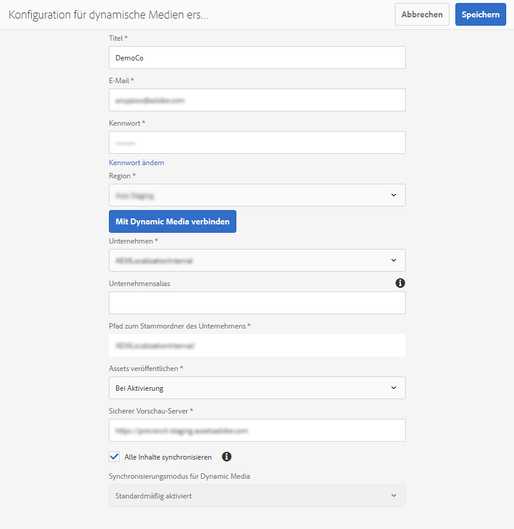
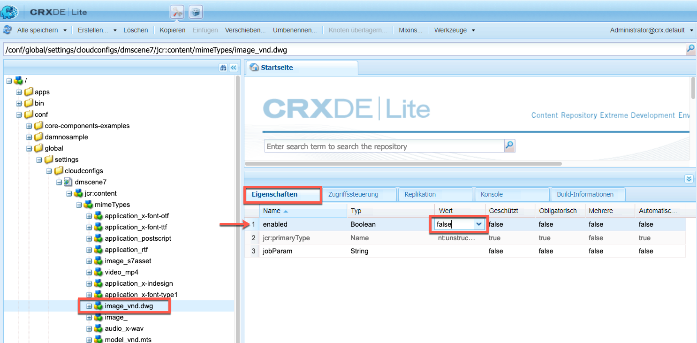
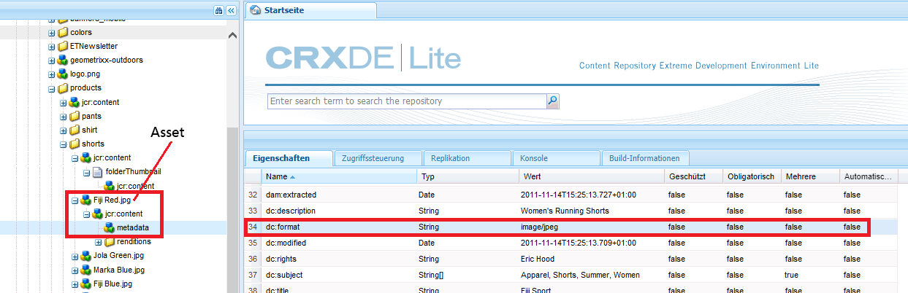

# RICK: OPTION B - Konfigurieren von Dynamic Media - Scene7-Modus{#configuring-dynamic-media-scene-mode}

>[!NOTE]
>
>RICK: OPTION B - DIE BEIDEN NEUEN THEMEN, DIE ICH GESCHRIEBEN HABE, SIND WEITERHIN VORHANDEN. IN DIESEM THEMA LESEN SIE JEDOCH JETZT, IN DEN JEWEILIGEN BEREICHEN, IN DENEN ICH BEREITS ÜBER DIE OPTIONS IN ALLGEMEINEN EINSTELLUNGEN UND IN DER VERÖFFENTLICHUNGSEINRICHTUNG SPRECHE, HABE ICH LINKS ZU DEN BEIDEN NEUEN THEMEN HINZUGEFÜGT.

Wenn Sie Adobe Experience Manager für verschiedene Umgebungen wie Entwicklung, Staging und Produktion verwenden, konfigurieren Sie Dynamic Media-Cloud Services für jede dieser Umgebungen.

## Architekturgrafik von Dynamic Media – Scene7-Modus {#architecture-diagram-of-dynamic-media-scene-mode}

**RICK: BEHALTEN WIE IST**

Die folgende Architekturgrafik beschreibt die Funktionsweise von Dynamic Media – Scene7-Modus.

Mit der neuen Architektur ist Experience Manager für Primärquellen-Assets und Synchronisierungen mit Dynamic Media für die Verarbeitung und Veröffentlichung von Assets verantwortlich:

1. Wenn das Asset aus der Primärquelle in Experience Manager hochgeladen wird, wird es in Dynamic Media repliziert. Ab diesem Punkt übernimmt Dynamic Media die gesamte Asset-Verarbeitung und die Erstellung von Ausgabedarstellungen, z. B. Videokodierung und dynamische Varianten eines Bilds.
(Im Modus Dynamic Media - Scene7 beträgt die standardmäßige Upload-Dateigröße 2 GB oder weniger. Informationen zum Hochladen von Dateigrößen von 2 GB bis 15 GB finden Sie unter [(Optional) Konfigurieren Sie den Dynamic Media-Scene7-Modus für das Hochladen von Assets mit mehr als 2 GB](#optional-config-dms7-assets-larger-than-2gb).
1. Nachdem die Ausgabedarstellungen generiert wurden, kann der Experience Manager sicher auf die Dynamic Media-Remote-Ausgabedarstellungen zugreifen und eine Vorschau davon anzeigen (es werden keine Binärdateien an die Experience Manager-Instanz zurückgesendet).
1. Nachdem der Inhalt veröffentlicht und genehmigt werden kann, wird der Dynamic Media-Dienst Trigger, Inhalte an Bereitstellungsserver zu senden und im CDN (Content Delivery Network) Inhalte zwischenzuspeichern.


>[!IMPORTANT]
>
>Für die folgende Funktionsliste müssen Sie das vordefinierte CDN verwenden, das im Lieferumfang von Adobe Experience Manager - Dynamic Media enthalten ist. Andere benutzerdefinierte CDN werden von diesen Funktionen nicht unterstützt.
>
>* [Intelligente Bildbearbeitung](/help/assets/imaging-faq.md)
>* [Cache-Invalidierung](/help/assets/invalidate-cdn-cache-dynamic-media.md)
>* [Hotlink-Schutz](/help/assets/hotlink-protection.md)
>* [Bereitstellung von Inhalten per HTTP/2](/help/assets/http2.md)
>* URL-Umleitung auf CDN-Ebene
>* Akamai ChinaCDN (für optimalen Versand in China)


## Aktivieren von Dynamic Media im Scene7-Modus {#enabling-dynamic-media-in-scene-mode}

**RICK: BEHALTEN WIE IST**

[Dynamic Media ist standardmäßig deaktiviert. ](https://business.adobe.com/de/products/experience-manager/assets/dynamic-media.html) Um die Funktionen von Dynamic Media nutzen zu können, müssen Sie sie aktivieren.

>[!WARNING]
>
>Der Modus Dynamic Media - Scene7 ist für die *Nur Experience Manager-Autoreninstanz*. Daher müssen Sie `runmode=dynamicmedia_scene7` in der Experience Manager-Autoreninstanz, *not* die Experience Manager-Veröffentlichungsinstanz.

Um Dynamic Media zu aktivieren, müssen Sie Experience Manager mit dem `dynamicmedia_scene7` Führen Sie den Ausführungsmodus über die Befehlszeile aus, indem Sie Folgendes in ein Terminal-Fenster eingeben (als Beispielanschluss wird 4502 verwendet):

```shell
java -Xms4096m -Xmx4096m -Doak.queryLimitInMemory=500000 -Doak.queryLimitReads=500000 -jar cq-quickstart-6.5.0.jar -gui -r author,dynamicmedia_scene7 -p 4502
```

## (Optional) Migrieren von Dynamic Media-Vorgaben und -Konfigurationen von 6.3 auf 6.5 ohne Ausfallzeit {#optional-migrating-dynamic-media-presets-and-configurations-from-to-zero-downtime}

**RICK: BEHALTEN WIE IST**

Die Aktualisierung von Experience Manager Dynamic Media von 6.3 auf 6.4 oder 6.5 bietet jetzt die Möglichkeit, Bereitstellungen ohne Ausfallzeiten zu ermöglichen. So migrieren Sie alle Vorgaben und Konfigurationen aus `/etc` nach `/conf` Stellen Sie sicher, dass Sie in CRXDE Lite den folgenden curl-Befehl ausführen.

>[!NOTE]
>
>Wenn Sie Ihre Experience Manager-Instanz im Kompatibilitätsmodus ausführen - d. h., Sie haben das Kompatibilitätspaket installiert - müssen Sie diese Befehle nicht ausführen.

Bei allen Upgrades, mit oder ohne Kompatibilitätspaket, können Sie die standardmäßigen Viewer-Vorgaben kopieren, die ursprünglich mit Dynamic Media geliefert wurden, indem Sie den folgenden Linux® curl-Befehl ausführen:

`curl -u admin:admin -X POST https://<server_address>:<server_port>/libs/settings/dam/dm/presets/viewer.pushviewerpresets.json`

So migrieren Sie benutzerdefinierte Viewer-Vorgaben und -Konfigurationen, die Sie aus erstellt haben `/etc` nach `/conf`, führen Sie den folgenden Linux® curl-Befehl aus:

`curl -u admin:admin -X POST https://<server_address>:<server_port>/libs/settings/dam/dm/presets.migratedmcontent.json`

## Feature Pack 18912 für Massenmigration von Assets installieren {#installing-feature-pack-for-bulk-asset-migration}

**RICK: BEHALTEN WIE IST**

Die Installation von Feature Pack 18912 ist *optional*.

Mit Feature Pack 18912 können Sie Assets entweder per FTP stapelweise erfassen oder Assets im Experience Manager-Modus entweder aus dem Dynamic Media- Hybridmodus oder aus Dynamic Media Classic in den Dynamic Media-Scene7-Modus migrieren. Es ist verfügbar unter [Adobe Professional Services](https://business.adobe.com/de/customers/consulting-services/main.html).

Siehe [Feature Pack 18912 für Massenmigration von Assets installieren](/help/assets/bulk-ingest-migrate.md) für weitere Informationen.

## Erstellen einer Dynamic Media-Konfiguration in Cloud Services {#configuring-dynamic-media-cloud-services}

**RICK: BEHALTEN WIE IST**

**Vor der Konfiguration von Dynamic Media** - Nachdem Sie Ihre Bereitstellungs-E-Mail mit Dynamic Media-Anmeldeinformationen erhalten haben, müssen Sie die [Dynamic Media Classic-Desktop-Applikation](https://experienceleague.adobe.com/docs/dynamic-media-classic/using/getting-started/signing-out.html?lang=de#getting-started), dann melden Sie sich bei Ihrem Konto an, um Ihr Kennwort zu ändern. Das Kennwort aus der Bereitstellungs-E-Mail wird systemseitig erstellt und ist nur als temporäres Kennwort vorgesehen. Sie müssen das Kennwort aktualisieren, damit Dynamic Media Cloud Service mit den richtigen Anmeldedaten eingerichtet wird.



**So erstellen Sie eine Dynamic Media-Konfiguration in Cloud Services:**

1. Wählen Sie im Experience Manager-Autorenmodus das Experience Manager-Logo aus, um auf die globale Navigationskonsole zuzugreifen. Wählen Sie dann das Werkzeugsymbol aus und navigieren Sie zu **[!UICONTROL Cloud Services]** > **[!UICONTROL Dynamic Media-Konfiguration]**.
1. Wählen Sie auf der Seite &quot;Dynamic Media Configuration Browser&quot;im linken Bereich die Option **[!UICONTROL global]** (Wählen Sie nicht das Ordnersymbol links neben **[!UICONTROL global]**), wählen Sie **[!UICONTROL Erstellen]**.
1. Geben Sie auf der Seite **[!UICONTROL Konfiguration für dynamische Medien erstellen]** einen Titel, die E-Mail-Adresse des Dynamic Media-Kontos und ein Kennwort ein und wählen Sie Ihre Region aus. Diese Informationen erhalten Sie in der Bereitstellungs-E-Mail von Adobe. Wenden Sie sich an den Kundensupport von Adobe , wenn Sie die E-Mail nicht erhalten haben.

   Wählen Sie **[!UICONTROL Mit Dynamic Media verbinden]** aus.

   >[!NOTE]
   **RICK: HALTEN SIE SO, WIE ES IST?** Nachdem Sie Ihre Bereitstellungs-E-Mail mit Dynamic Media-Anmeldeinformationen erhalten haben, öffnen Sie die [Dynamic Media Classic-Desktop-Applikation](https://experienceleague.adobe.com/docs/dynamic-media-classic/using/getting-started/signing-out.html#getting-started), dann melden Sie sich bei Ihrem Konto an, um Ihr Kennwort zu ändern. Das Kennwort aus der Bereitstellungs-E-Mail wird systemseitig erstellt und ist nur als temporäres Kennwort vorgesehen. Sie müssen das Kennwort aktualisieren, damit Dynamic Media Cloud Service mit den richtigen Anmeldedaten eingerichtet wird.

1. Nachdem die Verbindung erfolgreich hergestellt wurde, richten Sie Folgendes ein. Überschriften mit einem Sternchen (*) sind erforderlich:

   * **[!UICONTROL Unternehmen]** – der Name des Dynamic Media-Kontos. Sie haben mehrere Dynamic Media-Konten. Sie können beispielsweise verschiedene Untermarken, Divisionen, Staging- oder Produktionsumgebungen haben.

   * **[!UICONTROL Firmen-Root-Ordnerpfad]**

   * **[!UICONTROL Assets veröffentlichen]** – Sie können zwischen den folgenden drei Optionen wählen:
      * **[!UICONTROL Sofort]** bedeutet, dass das System hochgeladene Assets aufnimmt und umgehend die URL/den Link zur Einbettung bereitstellt. Zum Veröffentlichen von Assets ist kein Benutzereingriff erforderlich.
      * **[!UICONTROL Bei Aktivierung]** bedeutet, dass Sie das Asset zuerst explizit veröffentlichen müssen, bevor eine URL/ein Link zur Einbettung bereitgestellt wird.<br><!-- CQDOC-17478, Added March 9, 2021-->Ab Experience Manager 6.5.8 spiegelt die Experience Manager-Veröffentlichungsinstanz genaue Dynamic Media-Metadatenwerte wider, z. B. `dam:scene7Domain` und `dam:scene7FileStatus` in **[!UICONTROL Bei Aktivierung]** Nur Veröffentlichungsmodus. Um diese Funktion zu aktivieren, installieren Sie Service Pack 8 und starten Sie dann Experience Manager neu. Wechseln Sie zum Sling Config Manager. Suchen Sie die Konfiguration für `Scene7ActivationJobConsumer Component` oder erstellen Sie einen neuen). Aktivieren Sie das Kontrollkästchen **[!UICONTROL Replizieren von Metadaten nach der Dynamic Media-Veröffentlichung]**, wählen Sie **[!UICONTROL Speichern]**.

         

      * **[!UICONTROL Selektive Veröffentlichung]** Mit dieser Option können Sie steuern, welche Ordner in Dynamic Media veröffentlicht werden. Damit können Sie Funktionen wie smartes Zuschneiden oder dynamische Ausgabedarstellungen verwenden oder bestimmen, welche Ordner ausschließlich in Experience Manager zur Vorschau veröffentlicht werden. Dieselben Assets *not* in Dynamic Media veröffentlicht, um öffentlich zugänglich zu machen.<br>Sie können diese Option hier im **[!UICONTROL Dynamic Media Cloud-Konfiguration]** oder, falls gewünscht, können Sie diese Option auf Ordnerebene in der **[!UICONTROL Eigenschaften]**.<br>Siehe [Arbeiten mit selektiver Veröffentlichung in Dynamic Media](/help/assets/selective-publishing.md).<br>Wenn Sie diese Konfiguration später ändern oder später auf Ordnerebene ändern, wirken sich diese Änderungen nur auf neue Assets aus, die Sie von diesem Zeitpunkt an hochladen. Der Veröffentlichungsstatus vorhandener Assets im Ordner bleibt unverändert, bis Sie ihn im Dialogfeld **[!UICONTROL Quick Publish]** oder **[!UICONTROL Veröffentlichung verwalten]** manuell ändern.
   * **[!UICONTROL Sicherer Vorschau-Server]** – bietet Ihnen die Möglichkeit, den URL-Pfad zu Ihrem Vorschau-Server für sichere Ausgaben anzugeben. Das heißt, dass Experience Manager nach der Generierung von Ausgabedarstellungen sicher auf die Dynamic Media-Remote-Ausgabedarstellungen zugreifen und eine Vorschau davon anzeigen können (es werden keine Binärdateien an die Experience Manager-Instanz zurückgesendet).
Sofern Sie keine gesonderte Vereinbarung zum Verwenden Ihrer eigenen Unternehmens-Server oder eines speziellen Servers getroffen haben, empfiehlt Adobe, diese Einstellung nicht zu verändern.

   * **[!UICONTROL Alle Inhalte synchronisieren]** - <!-- NEW OPTION, CQDOC-15371, Added March 4, 2020-->Standardmäßig ausgewählt. Deaktivieren Sie diese Option, wenn Sie Assets aus der Synchronisierung mit Dynamic Media gezielt ein- oder ausschließen möchten. Wenn Sie diese Option deaktivieren, können Sie aus den beiden folgenden Synchronisierungsmodi für Dynamic Media wählen:

   * **[!UICONTROL Synchronisierungsmodus für Dynamic Media]**
      * **[!UICONTROL Standardmäßig aktiviert]** – Die Konfiguration wird auf alle Ordner angewendet, es sei denn, Sie markieren einen Ordner speziell zum Ausschließen. <!-- you can then deselect the folders that you do not want the configuration applied to.-->
      * **[!UICONTROL Standardmäßig deaktiviert]** – Die Konfiguration wird auf einen Ordner erst dann angewendet, wenn Sie einen ausgewählten Ordner explizit zur Synchronisierung mit Dynamic Media markieren.
Um einen ausgewählten Ordner für die Synchronisierung mit Dynamic Media zu markieren, wählen Sie einen Asset-Ordner aus und wählen Sie dann in der Symbolleiste die Option **[!UICONTROL Eigenschaften]**. Wählen Sie auf der Registerkarte **[!UICONTROL Details]** in der Dropdown-Liste **[!UICONTROL Synchronisierungsmodus für Dynamic Media]** eine der folgenden drei Optionen aus. Wenn Sie fertig sind, wählen Sie **[!UICONTROL Speichern]** aus. *Denken Sie daran: Diese drei Optionen stehen nicht zur Verfügung, wenn Sie zuvor **[!UICONTROL Alle Inhalte synchronisieren]**ausgewählt haben.* Weitere Informationen finden Sie unter [Arbeiten mit selektiver Veröffentlichung auf Ordnerebene in Dynamic Media](/help/assets/selective-publishing.md).
         * **[!UICONTROL Übernommen]** - Kein expliziter Synchronisierungswert für den Ordner; Stattdessen übernimmt der Ordner den Synchronisierungswert von einem seiner Vorgängerordner oder den Standardmodus in der Cloud-Konfiguration. Der detaillierte Status für geerbte Daten wird als QuickInfo angezeigt.
         * **[!UICONTROL Aktivieren für Unterordner]**: Schließt alle Elemente in dieser Unterstruktur zur Synchronisierung mit Dynamic Media ein. Die ordnerspezifischen Einstellungen setzen den Standardmodus in der Cloud-Konfiguration außer Kraft.
         * **[!UICONTROL Deaktiviert für Unterordner]**: Schließt alle Elemente in dieser Unterstruktur von der Synchronisierung mit Dynamic Media aus.

   >[!NOTE]
   Die Versionierung wird in DMS7 nicht unterstützt. Eine verzögerte Aktivierung gilt nur, wenn auf der Seite „Konfiguration von Dynamic Media bearbeiten“ die Option **[!UICONTROL Assets veröffentlichen]** auf **[!UICONTROL Bei Aktivierung]** eingestellt ist, und erst dann, wenn das Asset zum ersten Mal aktiviert wird.
   Wenn ein Asset aktiviert wurde, werden alle Aktualisierungen automatisch live in der S7-Bereitstellung übernommen.

1. Klicken Sie auf **[!UICONTROL Speichern]**.
1. Um eine sichere Vorschau von Dynamic Media-Inhalten anzuzeigen, bevor sie veröffentlicht werden, müssen Sie die Experience Manager-Autoreninstanz &quot;neu&quot;installieren, um eine Verbindung mit Dynamic Media herzustellen:

   * **RICK: LINK ZU NEUEM THEMA ZUR VERÖFFENTLICHUNGSEINRICHTUNG** Öffnen Sie die [Dynamic Media Classic-Desktop-Applikation](https://experienceleague.adobe.com/docs/dynamic-media-classic/using/getting-started/signing-out.html#getting-started), und melden Sie sich dann bei Ihrem Konto an. Ihre Benutzer- und Anmeldedaten haben Sie zum Zeitpunkt der Bereitstellung von Adobe erhalten. Wenn Sie diese Informationen nicht haben, wenden Sie sich an den Kundensupport von Adobe.

   * Navigieren Sie in der Navigationsleiste oben rechts auf der Seite zu **[!UICONTROL Einrichtung]** > **[!UICONTROL Anwendungseinstellungen]** > **[!UICONTROL Veröffentlichungseinstellungen]** > **[!UICONTROL Image-Server]**.

   * Wählen Sie auf der Seite „Veröffentlichung zum Image-Server“ in der Dropdown-Liste „Veröffentlichungskontext“ die Option **[!UICONTROL Image-Serving testen]**.
   * Wählen Sie für den Client-Adressfilter die Option **[!UICONTROL Hinzufügen]** aus.
   * Aktivieren Sie das Kontrollkästchen, um die Adresse zu aktivieren. Geben Sie die IP-Adresse der Experience Manager-Autoreninstanz (nicht die Dispatcher-IP) ein.
   * Klicken Sie auf **[!UICONTROL Speichern]**.

Sie haben nun die Grundkonfiguration abgeschlossen und können Dynamic Media im Scene7-Modus verwenden.

Wenn Sie Ihre Konfiguration weiter anpassen möchten, können Sie optional eine der Aufgaben unter [(Optional) Konfigurieren Sie die erweiterten Einstellungen im Modus Dynamic Media - Scene7 .](#optional-configuring-advanced-settings-in-dynamic-media-scene-mode).

## (Optional) Konfigurieren Sie die erweiterten Einstellungen im Modus Dynamic Media - Scene7 . {#optional-configuring-advanced-settings-in-dynamic-media-scene-mode}

**RICK: BEHALTEN WIE IST**

Wenn Sie die Konfiguration weiter anpassen und Dynamic Media – Scene7-Modus einrichten oder die Leistung optimieren möchten, können Sie eine oder mehrere der folgenden *optionalen* Aufgaben durchführen:

* [(Optional) Konfigurieren Sie den Dynamic Media-Scene7-Modus für das Hochladen von Assets mit mehr als 2 GB](#optional-config-dms7-assets-larger-than-2gb)

* [(Optional) Einrichtung und Konfiguration der Einstellungen von Dynamic Media – Scene7-Modus](#optional-setup-and-configuration-of-dynamic-media-scene7-mode-settings)

* [(Optional) Steigern Sie die Leistung des Modus Dynamic Media - Scene7 .](#optional-tuning-the-performance-of-dynamic-media-scene-mode)

* [(Optional) Filtern von Assets für die Replikation](#optional-filtering-assets-for-replication)

### (Optional) Konfigurieren Sie den Dynamic Media-Scene7-Modus für das Hochladen von Assets mit mehr als 2 GB {#optional-config-dms7-assets-larger-than-2gb}

**RICK: BEHALTEN WIE IST**

Im Modus Dynamic Media - Scene7 beträgt die standardmäßige Größe der Asset-Upload-Datei 2 GB oder weniger. Sie können jedoch optional das Hochladen von Assets konfigurieren, die größer als 2 GB und bis zu 15 GB sind.

Wenn Sie diese Funktion verwenden möchten, beachten Sie die folgenden Voraussetzungen und Punkte:

* Sie müssen Experience Manager 6.5 mit Service Pack 6.5.4.0 oder höher im Modus Dynamic Media - Scene7 ausführen.
* Diese Funktion zum Hochladen großer Dateien wird nur für [*Managed Services*](https://business.adobe.com/products/experience-manager/managed-services.html) -Kunden.
* Stellen Sie sicher, dass Ihre Experience Manager-Instanz mit Amazon S3 oder Microsoft® Azure Blob Storage konfiguriert ist.

   >[!NOTE]
   Konfigurieren Sie den Azure Blob-Speicher mit einem Zugriffsschlüssel und einem geheimen Schlüssel, da diese große Upload-Funktion von AzureSas in der Blob-Speicherkonfiguration nicht unterstützt wird.

* Oak&#39;s [Download für direkten Binärzugriff](https://jackrabbit.apache.org/oak/docs/features/direct-binary-access.html) aktiviert ist (Oak&#39;s *Hochladen von direktem Binärzugriff* nicht erforderlich).

   Um den Download für direkten Binärzugriff zu aktivieren, legen Sie die Eigenschaft fest `presignedHttpDownloadURIExpirySeconds > 0` in der Datenspeicher-Konfiguration. Der Wert sollte lang genug sein, um größere Binärdateien herunterzuladen und möglicherweise erneut zu versuchen.

* Assets mit mehr als 15 GB werden nicht hochgeladen. (Die Größenbeschränkung wird in Schritt 8 unten festgelegt.)
* Wenn die **[!UICONTROL Dynamic Media-Neuverarbeitung]** Der Assets-Workflow wird für einen Ordner ausgelöst. Er verarbeitet alle großen Assets, die bereits mit dem Dynamic Media-Unternehmen synchronisiert sind. Wenn jedoch noch keine großen Assets im Ordner synchronisiert sind, wird das Asset nicht hochgeladen. Um vorhandene große Assets in Dynamic Media zu synchronisieren, können Sie **[!UICONTROL Dynamic Media-Neuverarbeitung]** Assets-Workflow für einzelne Assets.

**So konfigurieren Sie den Dynamic Media-Scene7-Modus für das Hochladen von Assets mit mehr als 2 GB:**

1. Wählen Sie in Experience Manager das Experience Manager-Logo aus, um auf die globale Navigationskonsole zuzugreifen, und navigieren Sie dann zu **[!UICONTROL Instrumente]** > **[!UICONTROL Allgemein]** > **[!UICONTROL CRXDE Lite]**.

1. Führen Sie im Fenster CRXDE Lite einen der folgenden Schritte aus:

   * Navigieren Sie in der linken Leiste zum folgenden Pfad:

      `/libs/dam/gui/content/assets/jcr:content/actions/secondary/create/items/fileupload`

   * Kopieren Sie den obigen Pfad und fügen Sie ihn in das Feld Pfad der CRXDE Lite unter der Symbolleiste ein. Drücken Sie dann die `Enter`.

1. Klicken Sie in der linken Leiste mit der rechten Maustaste auf `fileupload`und wählen Sie dann im Popup-Menü **[!UICONTROL Überlagerungsknoten]**.

   

1. Wählen Sie im Dialogfeld Überlagerungsknoten die **[!UICONTROL Knotentypen abgleichen]** aktivieren, um die Option zu aktivieren, und wählen Sie **[!UICONTROL OK]**.

   

1. Führen Sie im Fenster CRXDE Lite eine der folgenden Aktionen aus:

   * Navigieren Sie in der linken Leiste zum folgenden Überlagerungsknotenpfad:

      `/apps/dam/gui/content/assets/jcr:content/actions/secondary/create/items/fileupload`

   * Kopieren Sie den obigen Pfad und fügen Sie ihn in das Feld Pfad der CRXDE Lite unter der Symbolleiste ein. Drücken Sie dann die `Enter`.

1. Im **[!UICONTROL Eigenschaften]** Registerkarte unter **[!UICONTROL Name]** Spalte, suchen `sizeLimit`.
1. Rechts neben dem `sizeLimit` name unter **[!UICONTROL Wert]** doppelklicken Sie auf das Wertefeld.
1. Geben Sie den entsprechenden Wert in Byte ein, damit Sie die maximale Upload-Größe festlegen können. Um beispielsweise die maximale Asset-Größe für den Upload auf 10 GB zu erhöhen, geben Sie `10737418240` im Wertefeld.
Sie können einen Wert von bis zu 15 GB (`2013265920` Byte). In diesem Fall werden hochgeladene Assets, die größer als 15 GB sind, nicht hochgeladen.

   

1. Wählen Sie links oben im Fenster &quot;CRXDE Lite&quot;die Option **[!UICONTROL Alle speichern]**.

   *Legen Sie jetzt den Timeout für den Adobe Granite Workflow External Process Job Handler fest, indem Sie Folgendes durchführen:*

1. Klicken Sie in Experience Manager auf das Experience Manager-Logo, um auf die Konsole für die globale Navigation zuzugreifen.
1. Führen Sie eine der folgenden Aktionen aus:

   * Navigieren Sie zum folgenden URL-Pfad:

      `localhost:4502/system/console/configMgr/com.adobe.granite.workflow.core.job.ExternalProcessJobHandler`

   * Kopieren Sie den obigen Pfad und fügen Sie ihn in das URL-Feld Ihres Browsers ein. Stellen Sie sicher, dass Sie `localhost:4502` mit Ihrer eigenen Experience Manager-Instanz.

1. Im **[!UICONTROL Adobe Granite Workflow External Process Job Handler]** im Dialogfeld **[!UICONTROL Max. Timeout]** -Feld, setzen Sie den Wert auf `18000` Minuten (fünf Stunden). Der Standardwert ist 10800 Minuten (drei Stunden).

   

1. Wählen Sie in der rechten unteren Ecke des Dialogfelds die Option **[!UICONTROL Speichern]**.

   *Legen Sie jetzt den Timeout für den Prozessschritt &quot;Scene7 Direct Binary Upload&quot;fest, indem Sie Folgendes durchführen:*

1. Klicken Sie in Experience Manager auf das Experience Manager-Logo, um auf die Konsole für die globale Navigation zuzugreifen.
1. Gehen Sie zu **[!UICONTROL Tools]** > **[!UICONTROL Workflow]** > **[!UICONTROL Modelle]**.
1. Wählen Sie auf der Seite &quot;Workflow-Modelle&quot;die Option **[!UICONTROL Dynamic Media-Kodierungsvideo]**.
1. Wählen Sie in der Symbolleiste die Option **[!UICONTROL Bearbeiten]** aus.
1. Doppelklicken Sie auf der Workflow-Seite auf die **[!UICONTROL Scene7 Direct Binary Upload]** Prozessschritt.
1. Im **[!UICONTROL Schritt-Eigenschaften]** Dialogfeld unter **[!UICONTROL Häufig]** Registerkarte unter **[!UICONTROL Erweiterte Einstellungen]** -Überschrift in der **[!UICONTROL Zeitüberschreitung]** ein, geben Sie einen Wert von `18000` Minuten (fünf Stunden). Der Standardwert ist `3600` Minuten (eine Stunde).
1. Klicken Sie auf **[!UICONTROL OK]**.
1. Auswählen **[!UICONTROL Synchronisieren]**.
1. Wiederholen Sie die Schritte 14 bis 21 für die **[!UICONTROL DAM-Update-Asset]** Workflow-Modell und **[!UICONTROL Dynamic Media-Neuverarbeitung]** Workflow-Modell.

### (Optional) Einrichtung und Konfiguration der Einstellungen von Dynamic Media – Scene7-Modus {#optional-setup-and-configuration-of-dynamic-media-scene7-mode-settings}

**RICK: LINKS ZUM NEUEN THEMA VERÖFFENTLICHUNG**

Wenn Sie sich im Ausführungsmodus befinden `dynamicmedia_scene7`verwenden, verwenden Sie die Dynamic Media Classic-Benutzeroberfläche, um Ihre Dynamic Media-Einstellungen zu ändern.

Die Einrichtungs- und Konfigurationsaufgaben umfassen Folgendes:

* [Veröffentlichungseinrichtung für Bild-Server](#publishing-setup-for-image-server)
* [Konfigurieren der allgemeinen Programmeinstellungen](#configuring-application-general-settings)
* [Konfigurieren des Farb-Managements](#configuring-color-management)
* [Bearbeiten von MIME-Typen für unterstützte Formate](#editing-mime-types-for-supported-formats) **RICK: HALTEN SIE?**
* [Hinzufügen von MIME-Typen für nicht unterstützte Formate](#adding-mime-types-for-unsupported-formats) **RICK: HALTEN SIE?**
* [Erstellen von Stapelsatzvorgaben zum automatischen Erzeugen von Bild- und Rotationssets](#creating-batch-set-presets-to-auto-generate-image-sets-and-spin-sets) **RICK: HALTEN SIE?**

#### Veröffentlichungseinrichtung für Bild-Server {#publishing-setup-for-image-server}

Mit den Veröffentlichungseinstellungen wird festgelegt, wie Assets standardmäßig von Dynamic Media bereitgestellt werden. Wenn keine Einstellung festgelegt wird, stellt Dynamic Media ein Asset gemäß den Standardeinstellungen unter „Veröffentlichungseinstellungen“ bereit. Beispiel: Bei der Anfrage, ein Bild bereitzustellen, das kein Auflösungsattribut enthält, wird ein Bild mit der Einstellung „Standardobjektauflösung“ bereitgestellt.

Auf der Image-Server-Seite werden Standardeinstellungen für die Bereitstellung von Bildern festgelegt.

**RICK: LINK ZUM THEMA NEUE VERÖFFENTLICHUNGSEINSTELLUNG** Siehe [Veröffentlichungseinstellungen für Dynamic Media](/help/assets/dm-publish-settings.md).


* **[!UICONTROL Kompatibilitätsattribute]** - **RICK: NOCH BENÖTIGT?** Diese Einstellung ermöglicht die Behandlung von Anfangs- und Endabsätzen in Textebenen wie in Version 3.6 aus Gründen der Abwärtskompatibilität. **RICK: NOCH BENÖTIGT?**
* **[!UICONTROL Lokalisierungsunterstützung]** - **RICK: NOCH BENÖTIGT?** Mit diesen Einstellungen können Sie mehrere Gebietsschemaattribute verwalten. Außerdem kann damit eine Zeichenfolge der Gebietsschemakarte angegeben werden, damit Sie festlegen können, welche Sprachen für die verschiedenen QuickInfos in Viewern unterstützt werden sollen. Weitere Informationen zur Einrichtung der **[Lokalisierungsunterstützung]** finden Sie unter [Überlegungen beim Einrichten der Lokalisierung von Assets](https://experienceleague.adobe.com/docs/dynamic-media-classic/using/setup/publish-setup.html?lang=de#considerations-when-setting-up-localization-of-assets). **RICK: NOCH BENÖTIGT?**

#### Konfigurieren der allgemeinen Programmeinstellungen {#configuring-application-general-settings}

**RICK: LINK ZUM THEMA &quot;NEUE ALLGEMEINE EINSTELLUNGEN&quot;** Siehe [Allgemeine Dynamic Media-Einstellungen konfigurieren](/help/assets/dm-general-settings.md).

#### Konfigurieren des Farb-Managements {#configuring-color-management}

**RICK: LINKS ZUM THEMA &quot;NEUE ALLGEMEINE EINSTELLUNGEN&quot;**

Beim Farb-Management für Dynamic Media können Sie die Farben von Assets korrigieren. Bei der Farbkorrektur behalten übernommene Assets ihren Farbraum (RGB, CMYK, Grau) und das eingebettete Farbprofil bei. Wenn Sie eine dynamische Ausgabedarstellung anfordern, wird die Bildfarbe gemäß dem Zielfarbraum korrigiert, indem eine CMYK-, RGB- oder Grau-Ausgabe verwendet wird. Siehe [Konfigurieren von Bildvorgaben](/help/assets/managing-image-presets.md).

>[!NOTE]
Standardmäßig zeigt das System 15 Ausgabedarstellungen an, wenn Sie **[!UICONTROL Ausgabeformate]** und 15 Viewer-Vorgaben, wenn Sie **[!UICONTROL Viewer]** in der Detailansicht des Assets. Sie können diese Grenze erhöhen. Siehe [Erhöhung der Anzahl angezeigter Bildvorgaben](/help/assets/managing-image-presets.md#increasing-or-decreasing-the-number-of-image-presets-that-display) oder [Erhöhen Sie die Anzahl der angezeigten Viewer-Vorgaben.](/help/assets/managing-viewer-presets.md#increasing-the-number-of-viewer-presets-that-display).

So konfigurieren Sie die Standardfarbeigenschaften so, dass die Farbkorrektur aktiviert ist, wenn Bilder angefordert werden: **RICK: LINKS ZUM THEMA &quot;NEUE ALLGEMEINE EINSTELLUNGEN&quot;** see [Allgemeine Dynamic Media-Einstellungen konfigurieren](/help/assets/dm-general-settings.md).

#### Bearbeiten von MIME-Typen für unterstützte Formate {#editing-mime-types-for-supported-formats}

**RICK: BEHALTEN WIE IST**

Sie können festlegen, welche Asset-Typen von Dynamic Media verarbeitet werden, und erweiterte Asset-Verarbeitungsparameter anpassen. Beispielsweise können Sie Asset-Verarbeitungsparameter für folgende Aktionen festlegen:

* Konvertieren eines Adobe PDF-Dokuments in ein E-Katalog-Asset
* Konvertieren eines Adobe Photoshop-Dokuments (.PSD) in ein Bannervorlagen-Asset für Personalisierung
* Rastern einer Adobe Illustrator- (.AI) oder Adobe Photoshop Encapsulated PostScript®-Datei (.EPS)
* [Videoprofile](/help/assets/video-profiles.md) und [Imaging-Profile](/help/assets/image-profiles.md) kann verwendet werden, um die Verarbeitung von Videos bzw. Bildern zu definieren.

Informationen hierzu finden Sie unter [Hochladen von Assets](/help/assets/manage-assets.md#uploading-assets).

**Gehen Sie folgendermaßen vor, um MIME-Typen für unterstützte Formate zu bearbeiten:**

1. Wählen Sie in Experience Manager das Experience Manager-Logo aus, um auf die globale Navigationskonsole zuzugreifen, und navigieren Sie dann zu **[!UICONTROL Instrumente]** > **[!UICONTROL Allgemein]** > **[!UICONTROL CRXDE Lite]**.
1. Navigieren Sie in der linken Leiste zu:

   `/conf/global/settings/cloudconfigs/dmscene7/jcr:content/mimeTypes`

   

1. Wählen Sie unter dem Ordner „mimeTypes“ einen MIME-Typ aus:
1. Im rechten unteren Bereich der Seite „CRXDE Lite“:

   * Doppelklicken Sie auf das Feld **[!UICONTROL Aktiviert]**. Standardmäßig sind alle Asset-MIME-Typen aktiviert (auf **[!UICONTROL true]**), was bedeutet, dass die Assets zur Verarbeitung mit Dynamic Media synchronisiert werden. Wenn Sie diesen Asset-MIME-Typ von der Verarbeitung ausschließen möchten, ändern Sie diese Einstellung in **[!UICONTROL false]**.

   * Doppeltippen Sie auf **[!UICONTROL jobParam]**, um das zugehörige Textfeld zu öffnen. Unter [Unterstützte MIME-Typen](/help/assets/assets-formats.md#supported-mime-types) finden Sie eine Liste mit zulässigen Werten für Verarbeitungsparameter, die Sie für einen bestimmten MIME-Typ verwenden können.

1. Führen Sie einen der folgenden Schritte aus:

   * Wiederholen Sie die Schritte 3–4, um weitere MIME-Typen zu bearbeiten.
   * Wählen Sie in der Menüleiste der Seite „CRXDE Lite“ die Option **[!UICONTROL Alle speichern]** aus.

1. Wählen Sie in der linken oberen Ecke der Seite die Option **[!UICONTROL CRXDE Lite]** , um zum Experience Manager zurückzukehren.

#### Hinzufügen von MIME-Typen für nicht unterstützte Formate {#adding-mime-types-for-unsupported-formats}

**RICK: BEHALTEN WIE IST**

Sie können in Experience Manager Assets benutzerdefinierte MIME-Typen für nicht unterstützte Formate hinzufügen. Stellen Sie sicher, dass kein neuer Knoten, den Sie in CRXDE Lite hinzufügen, vom Experience Manager gelöscht wird, indem Sie den MIME-Typ vor `image_`. Stellen Sie außerdem sicher, dass der aktivierte Wert auf **[!UICONTROL false]**.

**So fügen Sie MIME-Typen für nicht unterstützte Formate hinzu:**

1. Navigieren Sie vom Experience Manager aus zu **[!UICONTROL Instrumente]** > **[!UICONTROL Aktivitäten]** > **[!UICONTROL Web-Konsole]**.

   

1. Auf der Seite **[!UICONTROL Adobe Experience Manager-Web-Konsolen-Konfiguration]** wird eine neue Browser-Registerkarte geöffnet.

   

1. Scrollen Sie auf der Seite nach unten zum Namen *Adobe CQ Scene7 Asset MIME type Service*, wie im folgenden Screenshot gezeigt. Wählen Sie rechts neben dem Namen die **[!UICONTROL Konfigurationswerte bearbeiten]** (Bleistiftsymbol).

   

1. Wählen Sie auf der Seite **Adobe CQ Scene7 Asset MIME type Service** ein beliebiges Pluszeichen &lt;+> aus. Die Position in der Tabelle, an der Sie das Pluszeichen zum Hinzufügen des neuen MIME-Typs auswählen, ist trivial.

   

1. Geben Sie `DWG=image/vnd.dwg` in das leere Textfeld ein, das Sie soeben hinzugefügt haben.

   Das Beispiel `DWG=image/vnd.dwg` dient nur zu Demonstrationszwecken. Der hier hinzugefügte MIME-Typ kann ein beliebiges anderes nicht unterstütztes Format sein.

   

1. Wählen Sie unten rechts auf der Seite **[!UICONTROL Speichern]** aus.

   An dieser Stelle können Sie die Registerkarte des Browsers schließen, auf der die Seite „Adobe Experience Manager-Web-Konsolen-Konfiguration“ geöffnet ist.

1. Kehren Sie zur Browser-Registerkarte zurück, auf der sich Ihre geöffnete Experience Manager-Konsole befindet.
1. Navigieren Sie vom Experience Manager aus zu **[!UICONTROL Instrumente]** > **[!UICONTROL Allgemein]** > **[!UICONTROL CRXDE Lite]**.

   

1. Navigieren Sie in der linken Leiste zu:

   `conf/global/settings/cloudconfigs/dmscene7/jcr:content/mimeTypes`

1. Ziehen Sie den MIME-Typ `image_vnd.dwg` und legen Sie ihn direkt über `image_` in der Baumstruktur ab, wie im folgenden Screenshot gezeigt.

   

1. Mit dem MIME-Typ `image_vnd.dwg` weiterhin ausgewählt ist, aus dem **[!UICONTROL Eigenschaften]** im **[!UICONTROL enabled]** Zeile, unter der **[!UICONTROL Wert]** Spaltenüberschrift, doppeltippen Sie auf den Wert, um die **[!UICONTROL Wert]** Dropdown-Liste.
1. Geben Sie `false` in das Feld ein (oder wählen Sie **[!UICONTROL false]** aus der Dropdown-Liste).

   

1. Wählen Sie in der oberen linken Ecke der Seite „CRXDE Lite“ die Option **[!UICONTROL Alle speichern]** aus.

#### Erstellen von Stapelsatzvorgaben zum automatischen Erzeugen von Bild- und Rotationssets {#creating-batch-set-presets-to-auto-generate-image-sets-and-spin-sets}

**RICK: HALTEN SIE SO, WIE ES IST?**

Verwenden Sie Stapelsatzvorgaben, um die Erstellung von Bildsätzen oder Rotationssets während des Hochladens von Assets in Dynamic Media zu automatisieren.

Definieren Sie zunächst die Benennungskonvention für die Gruppierung von Assets in einem Satz. Erstellen Sie dann eine Stapelsatzvorgabe, die einen eindeutig benannten, in sich geschlossenen Satz von Anweisungen darstellt. Es muss definiert werden, wie der Satz mit Bildern erstellt wird, die den definierten Benennungskonventionen im Vorgabenrezept entsprechen.

Wenn Sie Dateien hochladen, erstellt Dynamic Media automatisch einen Satz mit allen Dateien, die den definierten Benennungsregeln in den aktiven Vorgaben entsprechen.

##### Standardbenennung konfigurieren

Erstellen Sie eine Standardbenennungskonvention zur Verwendung in einem beliebigen Stapelsatzvorgaben-Rezept. Die in der Definition der Stapelsatzvorgabe ausgewählte Standardbenennungskonvention ist wahrscheinlich alles, was Ihr Unternehmen zum Generieren von Stapelsätzen benötigt. Eine Stapelsatzvorgabe wird erstellt, damit die von Ihnen definierte Standardbenennungskonvention verwendet wird. Sie können so viele Stapelsatzvorgaben mit alternativen, benutzerdefinierten Benennungskonventionen erstellen, wie für einen bestimmten Satz von Inhalten notwendig sind, sofern eine Ausnahme für die unternehmensspezifische Standardbenennung vorhanden ist.

Die Einrichtung einer Standardbenennungskonvention ist zwar nicht erforderlich, um die Funktionen von Stapelsatzvorgaben zu verwenden, es empfiehlt sich jedoch, die Standardbenennungskonvention zu verwenden. Damit können Sie so viele Elemente Ihrer Benennungsregel definieren, die in einem Satz gruppiert werden sollen, sodass Sie die Erstellung von Stapelsätzen optimieren können.

Alternativ können Sie **[!UICONTROL Code anzeigen]** ohne verfügbare Formularfelder. In dieser Ansicht erstellen Sie Ihre Definitionen von Benennungskonventionen vollständig mit regulären Ausdrücken.

Zwei Elemente sind zur Definition verfügbar: Übereinstimmung und Basisname. Mit diesen Feldern können Sie alle Elemente einer Benennungskonvention definieren und den Teil der Konvention identifizieren, der zum Benennen des Satzes verwendet wird, der diese Elemente enthält. Die individuelle Namenskonvention eines Unternehmens verwendet oft eine oder mehrere Definitionszeilen für jedes dieser Elemente. Sie können für Ihre eindeutige Definition so viele Zeilen wie erforderlich verwenden und sie zu eindeutigen Elementen gruppieren, beispielsweise Elementen für Hauptbild, Farbe, alternative Ansicht und Muster.

**So konfigurieren Sie die Standardbenennung:**

**RICK: HALTEN SIE SO, WIE ES IST?**

1. Öffnen Sie das [Dynamic Media Classic-Desktop-Programm](https://experienceleague.adobe.com/docs/dynamic-media-classic/using/getting-started/signing-out.html#getting-started) und melden Sie sich bei Ihrem Konto an.

   Ihre Benutzer- und Anmeldedaten haben Sie zum Zeitpunkt der Bereitstellung von Adobe erhalten. Wenn Sie diese Informationen nicht haben, wenden Sie sich an den Kundensupport von Adobe.

1. Navigieren Sie in der Navigationsleiste oben auf der Seite zu **[!UICONTROL Einrichtung]** > **[!UICONTROL Anwendungseinstellungen]** > **[!UICONTROL Stapelsatzvorgaben]** > **[!UICONTROL Standardbenennung]**.
1. Wählen Sie **[!UICONTROL Formular anzeigen]** oder **[!UICONTROL Code anzeigen]**, um die gewünschte Ansicht festzulegen, und geben Sie Informationen zu den einzelnen Elementen ein.

   Sie können das Kontrollkästchen **[!UICONTROL Code anzeigen]** aktivieren, um die Erstellung des regelmäßigen Ausdruckswerts neben Ihren Formularauswahlen anzuzeigen. Sie können diese Werte nach Bedarf eingeben oder ändern. Dies hilft Ihnen bei der Definition der Elemente der Benennungsdefinition, falls Sie aus irgendeinem Grund durch die Formularansicht eingeschränkt werden. Falls Ihre Werte in der Formularansicht nicht analysiert werden können, werden die Formularfelder inaktiv.

   >[!NOTE]
   Bei deaktivierten Formularfeldern erfolgt keine Überprüfung, ob Ihre regelmäßigen Ausdrücke korrekt sind. Ergebnisse des regelmäßigen Ausdrucks, den Sie für jedes Element erstellen, werden nach der Zeile „Ergebnis“ angezeigt. Der vollständige regelmäßige Ausdruck wird am unteren Seitenrand angezeigt.

1. Erweitern Sie die Elemente bei Bedarf und geben Sie die zu verwendenden Benennungsregeln ein.
1. Führen Sie ggf. einen der folgenden Schritte aus:

   * Auswählen **[!UICONTROL Hinzufügen]** , um eine weitere Benennungsregel für ein Element hinzuzufügen.
   * Auswählen **[!UICONTROL Entfernen]** , um eine Benennungsregel für ein Element zu löschen.

1. Führen Sie einen der folgenden Schritte aus:

   * Auswählen **[!UICONTROL Speichern unter]** und geben Sie einen Namen für die Vorgabe ein.
   * Auswählen **[!UICONTROL Speichern]** wenn Sie eine vorhandene Vorgabe bearbeiten.

##### Erstellen einer Stapelsatzvorgabe


Dynamic Media verwendet Stapelsatzvorgaben, um Assets für die Anzeige in Viewern in Bildsätzen (alternative Bilder, Farboptionen, 360°-Drehung) zu organisieren. Die Stapelsatzvorgaben werden automatisch parallel zu den Asset-Uploadprozessen in Dynamic Media ausgeführt.

Sie können Ihre Stapelsatzvorgaben erstellen, bearbeiten und verwalten. Es gibt zwei Formen von Definitionen für Stapelsatzvorgaben: eine für eine standardmäßige Namenskonvention, die Sie einrichten können, und eine für benutzerdefinierte Namenskonventionen, die Sie spontan erstellen.

Sie können zum Definieren einer Stapelsatzvorgabe entweder die Formularfeldmethode oder die Codemethode verwenden, die Ihnen die Verwendung regelmäßiger Ausdrücke ermöglicht. Ebenso wie bei der Standardbenennung können Sie gleichzeitig „Code anzeigen“ wählen und Definitionen in der Formularansicht vornehmen und mithilfe von regelmäßigen Ausdrücken Ihre Definitionen erstellen Als Alternative können Sie eine der Ansichten deaktivieren, um die andere ausschließlich zu verwenden.

**So erstellen Sie eine Stapelsatzvorgabe:**

**RICK: HALTEN SIE SO, WIE ES IST?**

1. Öffnen Sie das [Dynamic Media Classic-Desktop-Programm](https://experienceleague.adobe.com/docs/dynamic-media-classic/using/getting-started/signing-out.html#getting-started) und melden Sie sich bei Ihrem Konto an.

   Ihre Benutzer- und Anmeldedaten haben Sie zum Zeitpunkt der Bereitstellung von Adobe erhalten. Wenn Sie diese Informationen nicht haben, wenden Sie sich an den Kundensupport von Adobe.

1. Navigieren Sie in der Navigationsleiste oben auf der Seite zu **[!UICONTROL Einrichtung]** > **[!UICONTROL Anwendungseinstellungen]** > **[!UICONTROL Stapelsatzvorgaben]** > **[!UICONTROL Stapelsatzvorgabe]**.

   **[!UICONTROL Formular anzeigen]**, wie oben rechts auf der Detailseite festgelegt, ist die Standardansicht.

1. Wählen Sie im Bereich &quot;Vorgabenliste&quot;die Option **[!UICONTROL Hinzufügen]** um die Definitionsfelder im Detailbereich auf der rechten Seite des Bildschirms zu aktivieren.
1. Geben Sie im Bereich „Details“ im Feld „Vorgabenname“ einen Namen für die Vorgabe ein.
1. Wählen Sie im Dropdownmenü „Stapelsatztyp“ einen Vorgabentyp aus.
1. Führen Sie einen der folgenden Schritte aus:

   * Wenn Sie eine standardmäßige Namenskonvention verwenden, die Sie zuvor unter **[!UICONTROL Anwendungseinstellungen]** > **[!UICONTROL Stapelsatzvorgaben]** > **[!UICONTROL Standardbenennung]**, erweitern **[!UICONTROL Asset-Benennungskonventionen]** und wählen Sie dann in der Dropdown-Liste &quot;Dateibenennung&quot;die Option **[!UICONTROL Standard]**.

   * Um beim Einrichten der Vorgabe eine neue Benennungsregel zu definieren, erweitern Sie **[!UICONTROL Asset-Benennungskonventionen]** und wählen Sie dann in der Dropdown-Liste &quot;Dateibenennung&quot;die Option **[!UICONTROL Benutzerdefiniert]**.

1. Definieren Sie für die Reihenfolge der Sequenzen die Reihenfolge, in der Bilder angezeigt werden, nachdem das Set in Dynamic Media gruppiert wurde.

   Die Assets werden standardmäßig in alphanumerischer Reihenfolge angeordnet. Sie können jedoch auch eine durch Kommas getrennte Liste mit regulären Ausdrücken verwenden, um die Reihenfolge anzupassen.

1. Geben Sie für „Satzbenennungs- und -erstellungsregel“ das Suffix bzw. Präfix für den Basisnamen an, den Sie in der Asset-Benennungsregel definiert haben. Definieren Sie außerdem, wo der Satz in der Dynamic Media-Ordnerstruktur erstellt wird.

   Wenn Sie eine große Anzahl von Sets definieren, trennen Sie die Sets von den Ordnern, die die Assets selbst enthalten. Erstellen Sie beispielsweise einen Ordner &quot;Bildsets&quot;und legen Sie hier die generierten Sets ab.

1. Wählen Sie im Bereich &quot;Details&quot;die Option **[!UICONTROL Speichern]**.
1. Auswählen **[!UICONTROL Aktiv]** neben dem neuen Vorgabenamen.

   Durch das Aktivieren dieser Vorgabe wird sichergestellt, dass beim Hochladen von Assets in Dynamic Media die Stapelsatzvorgabe zur Erstellung des Satzes angewendet wird.

##### Erstellen einer Stapelsatzvorgabe für die automatische Erstellung eines 2D-Rotationssets

**RICK: HALTEN SIE SO, WIE ES IST?**

Sie können den Stapelsatztyp **[!UICONTROL Multiachsen-Rotationsset]** verwenden, um ein „Rezept“ zu erstellen, das die Erstellung von 2D-Rotations-Sets automatisiert. Für die Gruppierung von Bildern werden die regulären Ausdrücke „Zeile“ und „Spalte“ verwendet, sodass die Bild-Assets im multidimensionalen Array korrekt an der entsprechenden Position ausgerichtet werden. Es gibt keine Mindest- oder Maximalzahl an Reihen und Spalten, die in einem Multiachsen-Rotationsset vorhanden sein müssen.

Beispiel: Sie möchten ein Multiachsen-Rotationsset mit dem Namen `spin-2dspin` erstellen. Sie haben einen Satz von Rotationsset-Bildern, die drei Zeilen mit 12 Bildern pro Zeile enthalten. Die Bilder haben die folgenden Namen:

```
spin-01-01
 spin-01-02
 …
 spin-01-12
 spin-02-01
 …
 spin-03-12
```

Mit diesen Informationen kann Ihr Stapelsatztyp-Rezept wie folgt erstellt werden:


Die Gruppierung für den Teil des gemeinsamen Asset-Namens des Rotationssets wird zum **[!UICONTROL Übereinstimmung]** (wie hervorgehoben). Der variable Teil des Asset-Namens, der die Zeile und Spalte enthält, wird den Feldern **[!UICONTROL Zeile]** bzw. **[!UICONTROL Spalte]** hinzugefügt.

Wenn das Rotationsset hochgeladen und veröffentlicht wird, aktivieren Sie den Namen des 2D-Rotations-Sets-Rezepts, das unter **[!UICONTROL Batchset-Voreinstellungen]** im Dialogfeld **[!UICONTROL Upload-Auftragsoptionen]** aufgeführt ist.

**So erstellen Sie eine Stapelsatzvorgabe für die automatische Erstellung eines 2D-Rotations-Sets:**

**RICK: HALTEN SIE SO, WIE ES IST?**

1. Öffnen Sie das [Dynamic Media Classic-Desktop-Programm](https://experienceleague.adobe.com/docs/dynamic-media-classic/using/getting-started/signing-out.html#getting-started) und melden Sie sich bei Ihrem Konto an.

   Ihre Benutzer- und Anmeldedaten haben Sie zum Zeitpunkt der Bereitstellung von Adobe erhalten. Wenn Sie diese Informationen nicht haben, wenden Sie sich an den Kundensupport von Adobe.

1. Navigieren Sie in der Navigationsleiste oben auf der Seite zu **[!UICONTROL Einrichtung]** > **[!UICONTROL Anwendungseinstellungen]** > **[!UICONTROL Stapelsatzvorgaben]** > **[!UICONTROL Stapelsatzvorgabe]**.

   **[!UICONTROL Formular anzeigen]**, wie oben rechts auf der Detailseite festgelegt, ist die Standardansicht.

1. Wählen Sie im Bereich &quot;Vorgabenliste&quot;die Option **[!UICONTROL Hinzufügen]** um die Definitionsfelder im Detailbereich auf der rechten Seite des Bildschirms zu aktivieren.
1. Geben Sie im Bereich „Details“ im Feld „Vorgabenname“ einen Namen für die Vorgabe ein.
1. Wählen Sie im Dropdown-Menü „Batch-Settyp“ die Option **[!UICONTROL Assetset]**.
1. Wählen Sie in der Dropdown-Liste „Untertyp“ die Option **[!UICONTROL Multiachsen-Rotationsset]** aus.
1. Erweitern **[!UICONTROL Asset-Benennungskonventionen]** und wählen Sie dann in der Dropdown-Liste &quot;Dateibenennung&quot;die Option **[!UICONTROL Benutzerdefiniert]**.
1. Verwenden Sie die Attribute **[!UICONTROL Übereinstimmung]** und optional **[!UICONTROL Basisname]**, um einen regulären Ausdruck für die Benennung von Bild-Assets zu definieren, aus denen die Gruppierung besteht.

   Der reguläre Ausdruck &quot;Übereinstimmung mit Literal&quot;kann beispielsweise wie folgt aussehen:

   `(w+)-w+-w+`

1. Erweitern Sie **[!UICONTROL Zeilen-/Spaltenposition]** und definieren Sie anschließend den Namen des Formats für die Position des Bild-Assets innerhalb des 2D-Rotationsset-Arrays.

   Setzen Sie die Zeilen- oder Spaltenposition im Dateinamen in Klammern.

   Der reguläre Ausdruck für Ihre Zeile kann beispielsweise wie folgt aussehen:

   `\w+-R([0-9]+)-\w+`

   oder

   `\w+-(\d+)-\w+`

   Der reguläre Ausdruck Ihrer Spalte kann wie folgt aussehen:

   `\w+-\w+-C([0-9]+)`

   oder

   `\w+-\w+-C(\d+)`

   Die oben genannten Beispiele dienen nur zu Demonstrationszwecken. Sie können reguläre Ausdrücke Ihren Bedürfnissen entsprechend erstellen.

   >[!NOTE]
   Wenn die Kombination aus regulären Ausdrücken für Zeile und Spalte die Position des Assets im multidimensionalen Rotationsset-Array nicht ermitteln kann, wird das Asset nicht zum Satz hinzugefügt. Außerdem wird ein Fehler protokolliert.

1. Geben Sie für „Satzbenennungs- und -erstellungsregel“ das Suffix bzw. Präfix für den Basisnamen an, den Sie in der Asset-Benennungsregel definiert haben.

   Definieren Sie außerdem, wo das Rotationsset in der Dynamic Media Classic-Ordnerstruktur erstellt wird.

   Wenn Sie eine große Anzahl von Sets definieren, trennen Sie die Sets von den Ordnern, die die Assets selbst enthalten. Erstellen Sie beispielsweise einen Ordner mit Rotationssets , um die generierten Sets hier abzulegen.

1. Wählen Sie im Bereich &quot;Details&quot;die Option **[!UICONTROL Speichern]**.
1. Auswählen **[!UICONTROL Aktiv]** neben dem neuen Vorgabenamen.

   Durch das Aktivieren dieser Vorgabe wird sichergestellt, dass beim Hochladen von Assets in Dynamic Media die Stapelsatzvorgabe zur Erstellung des Satzes angewendet wird.

### (Optional) Steigern Sie die Leistung des Modus Dynamic Media - Scene7 . {#optional-tuning-the-performance-of-dynamic-media-scene-mode}

**RICK: HALTEN SIE SO, WIE ES IST?**

Damit der Dynamic Media-Scene7-Modus reibungslos ausgeführt werden kann, empfiehlt Adobe die folgenden Tipps zur Optimierung der Synchronisierungsleistung/-skalierbarkeit:

* Aktualisieren der vordefinierten Auftragsparameter zur Verarbeitung verschiedener Dateiformate.
* Aktualisieren der vordefinierten Warteschlangen-Workerthreads des Granite-Workflows (Video-Assets).
* Aktualisieren der vordefinierten Warteschlangen-Workerthreads des Granite-Verlaufs-Workflows (Bilder und Nicht-Video-Assets).
* Aktualisieren der maximalen Upload-Verbindungen mit dem Dynamic Media Classic-Server.

#### Aktualisieren der vordefinierten Auftragsparameter zur Verarbeitung verschiedener Dateiformate

**RICK: HALTEN SIE SO, WIE ES IST?**

Beim Hochladen von Dateien können Sie die Auftragsparameter für eine schnellere Verarbeitung anpassen. Wenn Sie beispielsweise PSD-Dateien hochladen, diese jedoch nicht als Vorlagen verarbeiten möchten, können Sie die Ebenenextraktion auf „false“ (falsch/aus) setzen. In diesem Fall wird der angepasste Vorgangsparameter wie folgt angezeigt: `process=None&createTemplate=false`.

Wenn Sie die Vorlagenerstellung aktivieren möchten, verwenden Sie die folgenden Parameter: `process=MaintainLayers&layerNaming=AppendName&createTemplate=true`.

<!-- THIS PARAGRAPH WAS REPLACED WITH THE TWO PARAGRAPHS DIRECTLY ABOVE BASED ON CQDOC-17657 You can tune job parameters for faster processing when you upload files. For example, if you are uploading PSD files, but do not want to process them as templates, you can set layer extraction to false (off). In such case, the tuned job parameter would appear as `process=None&createTemplate=false`. -->

Adobe empfiehlt die Verwendung der folgenden „angepassten“ Auftragsparameter für PDF-, PostScript®- und PSD-Dateien:

<!-- OLD PDF JOB PARAMETERS `pdfprocess=Rasterize&resolution=150&colorspace=Auto&pdfbrochure=false&keywords=false&links=false` -->

<!-- OLD POSTSCRIPT JOB PARAMETERS `psprocess=Rasterize&psresolution=150&pscolorspace=Auto&psalpha=false&psextractsearchwords=false&aiprocess=Rasterize&airesolution=150&aicolorspace=Auto&aialpha=false` -->

| Dateityp | Empfohlene Auftragsparameter |
| ---| ---|
| PDF | `pdfprocess=Thumbnail&resolution=150&colorspace=Auto&pdfbrochure=false&keywords=false&links=false` |
| PostScript® | `psprocess=Rasterize&psresolution=150&pscolorspace=Auto&psalpha=false&psextractsearchwords=false&aiprocess=Thumbnail&airesolution=150&aicolorspace=Auto&aialpha=false` |
| PSD | `process=None&layerNaming=AppendName&anchor=Center&createTemplate=false&extractText=false&extendLayers=false` |

<!-- CQDOC-17657 for PSD entry in table above -->

Um einen dieser Parameter zu aktualisieren, führen Sie die Schritte unter [Unterstützung von MIME-typbasierten Assets/Dynamic Media Classic-Upload-Auftragsparametern](/help/sites-administering/scene7.md#enabling-mime-type-based-assets-scene-upload-job-parameter-support) aus.

#### Aktualisieren der Verlaufs-Workflow-Warteschlange von Granite {#updating-the-granite-transient-workflow-queue}

**RICK: HALTEN SIE SO, WIE ES IST?**

Die Transit-Workflow-Warteschlange von Granite wird für den Workflow **[!UICONTROL DAM-Update-Asset]** verwendet. In Dynamic Media wird sie für die Bildaufnahme und -verarbeitung genutzt.

**So aktualisieren Sie die Verlaufs-Workflow-Warteschlange von Granite:**

1. Navigieren Sie zu [https://localhost:4502/system/console/configMgr](https://localhost:4502/system/console/configMgr) und suchen Sie nach **Warteschlange: Granite-Verlaufs-Workflow-Warteschlange**.

   >[!NOTE]
   Anstelle einer direkten URL ist eine Textsuche erforderlich, da die OSGi-PID dynamisch generiert wird.

1. Ändern Sie im Feld **[!UICONTROL Maximale Anzahl an parallelen Aufträgen]** die Zahl in den gewünschten Wert.

   Sie können **[!UICONTROL Maximale Anzahl an parallelen Aufträgen]** erhöhen, um das Hochladen von Dateien zu Dynamic Media angemessen zu unterstützen. Der genaue Wert hängt von der Hardware-Kapazität ab. In bestimmten Szenarien - d. h. bei einer ersten Migration oder einem einmaligen Massen-Upload - können Sie einen großen Wert verwenden. Beachten Sie jedoch, dass die Verwendung eines großen Werts (z. B. die doppelte Anzahl an Kernen) negative Auswirkungen auf andere gleichzeitige Aktivitäten haben kann. Daher sollten Sie den Wert basierend auf Ihrem jeweiligen Anwendungsfall testen und anpassen.

<!--    By default, the maximum number of parallel jobs depends on the number of available CPU cores. For example, on a 4-core server, it assigns 2 worker threads. (A value between 0.0 and 1.0 is ratio based, or any numbers greater than 1 will assign the number of worker threads.)

   Adobe recommends that 32 **[!UICONTROL Maximum Parallel Jobs]** be configured to adequately support heavy upload of files to Dynamic Media Classic (Scene7). -->


1. Wählen Sie **[!UICONTROL Speichern]** aus.

#### Aktualisieren der Granite-Workflow-Warteschlange {#updating-the-granite-workflow-queue}

**RICK: HALTEN SIE SO, WIE ES IST?**

Die Granite-Workflow-Warteschlange wird für Workflows ohne Verlauf verwendet. In Dynamic Media dient sie zum Verarbeiten von Videos mit dem Workflow **[!UICONTROL Dynamic Media-Videokodierung]**.

**So aktualisieren Sie die Granite-Workflow-Warteschlange:**

1. Navigieren Sie zu `https://<server>/system/console/configMgr` und suchen Sie nach **Warteschlange: Granite-Workflow-Warteschlange**.

   >[!NOTE]
   Anstelle einer direkten URL ist eine Textsuche erforderlich, da die OSGi-PID dynamisch generiert wird.

1. Ändern Sie im Feld **[!UICONTROL Maximale Anzahl an parallelen Aufträgen]** die Zahl in den gewünschten Wert.

   Sie können Maximale Anzahl an parallelen Aufträgen erhöhen, um das Hochladen von Dateien zu Dynamic Media angemessen zu unterstützen. Der genaue Wert hängt von der Hardware-Kapazität ab. In bestimmten Szenarien - d. h. bei einer ersten Migration oder einem einmaligen Massen-Upload - können Sie einen großen Wert verwenden. Beachten Sie jedoch, dass die Verwendung eines großen Werts (z. B. die doppelte Anzahl an Kernen) negative Auswirkungen auf andere gleichzeitige Aktivitäten haben kann. Daher sollten Sie den Wert basierend auf Ihrem jeweiligen Anwendungsfall testen und anpassen.

   

1. Wählen Sie **[!UICONTROL Speichern]** aus.

#### Aktualisieren der Dynamic Media Classic-Upload-Verbindung {#updating-the-scene-upload-connection}

**RICK: HALTEN SIE SO, WIE ES IST?**

Die Einstellung der Upload-Verbindung (Scene7) synchronisiert Experience Manager Assets mit Dynamic Media Classic-Servern.

**So aktualisieren Sie die Dynamic Media Classic-Upload-Verbindung:**

1. Navigieren Sie zu `https://<server>/system/console/configMgr/com.day.cq.dam.scene7.impl.Scene7UploadServiceImpl`
1. Ändern Sie im Feld **[!UICONTROL Anzahl der Verbindungen]** und/oder im Feld **[!UICONTROL Zeitüberschreitung bei aktiven Aufträgen]** den Wert in die gewünschte Anzahl.

   Die **[!UICONTROL Anzahl der Verbindungen]** Mit dieser Einstellung wird die maximale Anzahl von HTTP-Verbindungen gesteuert, die für den Experience Manager zum Dynamic Media-Upload zulässig ist. In der Regel ist der vordefinierte Wert von zehn Verbindungen ausreichend.

   Die Einstellung **[!UICONTROL Zeitüberschreitung bei aktiven Aufträgen]** legt die Wartezeit für hochgeladene Dynamic Media-Assets bis zur Veröffentlichung auf dem Übermittlungs-Server fest. Dieser Wert beträgt standardmäßig 2.100 Sekunden oder 35 Minuten.

   In den meisten Fällen ist die Einstellung „2100“ausreichend.

   

1. Wählen Sie **[!UICONTROL Speichern]** aus.

### (Optional) Filtern von Assets für die Replikation {#optional-filtering-assets-for-replication}

**RICK: BEHALTEN WIE IST**

In Nicht-Dynamic Media-Implementierungen replizieren Sie *all* Assets (sowohl Bilder als auch Videos) aus Ihrer Experience Manager-Autorenumgebung in den Experience Manager-Veröffentlichungsknoten. Dieser Workflow ist erforderlich, da die Experience Manager-Veröffentlichungsserver auch die Assets bereitstellen.

Da Assets jedoch in Dynamic Media-Bereitstellungen über den Cloud Service bereitgestellt werden, müssen diese Assets nicht auf Experience Manager-Veröffentlichungsknoten repliziert werden. Ein solcher &quot;hybrider Publishing&quot;-Workflow vermeidet zusätzliche Speicherkosten und längere Verarbeitungszeiten für die Replikation von Assets. Andere Inhalte, wie z. B. Seiten der Site, werden weiterhin von den Veröffentlichungsknoten des Experience Managers bereitgestellt.

Die Filter bieten Ihnen die Möglichkeit, *exclude* Assets nicht auf den Veröffentlichungsknoten des Experience Managers repliziert werden.

#### Verwenden Sie Asset-Standardfilter für die Replikation {#using-default-asset-filters-for-replication}

**RICK: BEHALTEN WIE IST**

Wenn Sie Dynamic Media für Bildbearbeitung, Videos oder beides verwenden, können Sie die von Adobe bereitgestellten Standardfilter unverändert verwenden. Folgende Filter sind standardmäßig aktiviert:

|  | Filter | Mime-Typ | Ausgabedarstellungen |
| --- | --- | --- | --- |
| Dynamic Media-Bildbereitstellung | filter-image<br>filter-sets | Beginnt mit **image/**<br> Enthält **applications/** und enden mit **set**. | Die standardmäßigen &quot;filter-images&quot;(für einzelne Bild-Assets, einschließlich interaktiver Bilder) und &quot;filter-sets&quot;(für Rotationssets, Bildsets, gemischte Mediensets und Karussellsets) werden:<br>・ Das Originalbild und statische Bilddarstellungen werden von der Replikation ausgeschlossen. |
| Dynamic Media-Videobereitstellung | filter-video | Beginnt mit **video/** | Das vordefinierte &quot;Filtervideo&quot;sieht Folgendes vor:<br>・ Das Originalvideo und statische Miniaturansichten werden von der Replikation ausgeschlossen. |

>[!NOTE]
Filter gelten für MIME-Typen und können nicht pfadspezifisch sein.

#### Anpassen von Asset-Filtern für die Replikation {#customizing-asset-filters-for-replication}

**RICK: BEHALTEN WIE IST**

1. Wählen Sie in Experience Manager das Experience Manager-Logo aus, um auf die globale Navigationskonsole zuzugreifen, und navigieren Sie zu **[!UICONTROL Instrumente]** > **[!UICONTROL Allgemein]** > **[!UICONTROL CRXDE Lite]**.
1. Navigieren Sie in der linken Ordnerstruktur zu `/etc/replication/agents.author/publish/jcr:content/damRenditionFilters` , um die Filter zu überprüfen.

   

1. Zum Definieren des MIME-Typs für den Filter können Sie den MIME-Typ wie folgt ermitteln:

   Erweitern Sie in der linken Leiste `content > dam > <locate_your_asset> > jcr:content > metadata`und suchen Sie dann in der Tabelle nach `dc:format`.

   Die folgende Grafik ist ein Beispiel für den Pfad eines Assets zu `dc:format`.

   

   Beachten Sie, dass `dc:format` für das Asset `Fiji Red.jpg` is `image/jpeg`.

   Damit dieser Filter für alle Bilder gilt, setzen Sie den Wert auf `image/*` where `*` ist ein regulärer Ausdruck, der auf alle Bilder beliebigen Formats angewendet wird.

   Damit der Filter nur auf Bilder vom Typ JPEG angewendet werden kann, geben Sie den Wert `image/jpeg`.

1. Definieren Sie, welche Ausgabedarstellungen Sie in die Replikation einbeziehen oder davon ausschließen möchten.

   Sie können die folgenden Zeichen verwenden, um einen Filtervorgang für die Replikation durchzuführen:

   | Zu verwendendes Zeichen | Filtern von Assets für die Replikation |
   | --- | --- |
   | * | Platzhalterzeichen |
   | + | Umfasst Assets für die Replikation |
   | - | Schließt Assets aus der Replikation aus |

   Navigieren Sie zu `content/dam/<locate your asset>/jcr:content/renditions`.

   Die folgende Grafik ist ein Beispiel für die Wiedergabeformate eines Assets.

   

   Wenn Sie nur das Original replizieren möchten, geben Sie `+original`.
