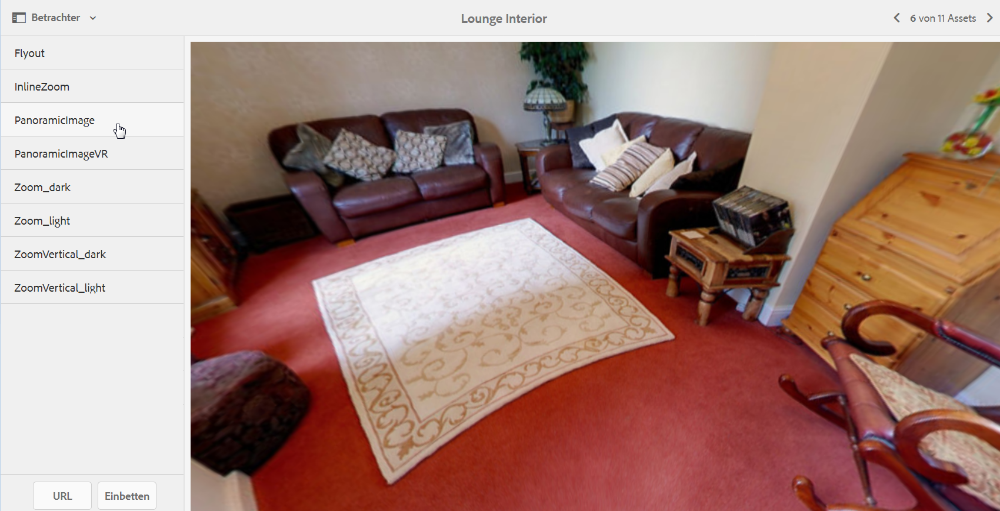

# Panoramabilder {#panoramic-images}

In diesem Abschnitt wird beschrieben, wie Sie mit dem Viewer für Panoramabilder Kugelpanoramen für ein immersives 360°-Betrachtungserlebnis eines Zimmers, einer Immobilie, eines Ortes oder einer Landschaft ausgeben können.

Informationen hierzu finden Sie unter [Verwalten von Viewer-Vorgaben](/help/assets/managing-viewer-presets.md).

## Hochladen von Assets für die Verwendung mit dem Viewer für Panoramabilder {#uploading-assets-for-use-with-the-panoramic-image-viewer}

Damit hochgeladene Assets als Kreispanoramen gelten und mit dem Viewer für Panoramabilder verwendet werden können, muss mindestens eine der beiden folgenden Eigenschaften zutreffen:

* Ein Seitenverhältnis von 2.
Sie können die Standardeinstellung für das Seitenverhältnis von 2 in CRXDE Lite wie folgt überschreiben:
   `/conf/global/settings/cloudconfigs/dmscene7/jcr:content`

* Mit den Keywords `equirectangular` oder `spherical` und `panorama` oder `spherical` und `panoramic` als Tags versehen. Weitere Informationen finden Sie unter [Verwenden von Tags](/help/sites-authoring/tags.md).

Die Kriterien für das Seitenverhältnis sowie die Keywords gelten für Panorama-Assets für die Asset-Detailseite und die WCM-Komponente `Panoramic Media`.

Weitere Informationen über den Upload von Assets für die Verwendung mit dem Viewer für Panoramabilder finden Sie unter [Hochladen von Assets](/help/assets/manage-assets.md#uploading-assets).

## Konfigurieren von Dynamic Media Classic {#configuring-dynamic-media-classic-scene}

Damit der Panorama-Bild-Viewer in AEM ordnungsgemäß funktioniert, müssen Sie die Panorama-Bild-Viewer-Vorgaben mit Dynamic Media Classic- und Dynamic Media Classic-spezifischen Metadaten synchronisieren, damit die Viewer-Vorgaben in der JCR-Datei aktualisiert werden. Konfigurieren Sie dazu Dynamic Media Classic wie folgt:

1. Öffnen Sie das [Dynamic Media Classic-Desktop-Programm](https://experienceleague.adobe.com/docs/dynamic-media-classic/using/getting-started/signing-out.html?lang=de#getting-started) und melden Sie sich bei Ihrem Konto an.

1. Klicken Sie oben rechts auf der Seite auf **[!UICONTROL Einstellungen > Anwendungseinstellungen > Veröffentlichungseinrichtung > Image-Server.]**
1. Wählen Sie auf der Seite &quot;Veröffentlichung des Image-Servers&quot;im Dropdown-Menü **[!UICONTROL Veröffentlichungskontext]** oben **[!UICONTROL Image-Server.]**

1. Suchen Sie auf derselben Image-Server-Veröffentlichungsseite die Überschrift **[!UICONTROL Anfrage-Attribute.]**
1. Suchen Sie unter der Überschrift „Anfrage-Attribute“ die Option **[!UICONTROL Maximale Größe des Antwortbildes.]** Erhöhen Sie anschließend die Werte in den entsprechenden Feldern „Breite“ und „Höhe“ auf die größtmögliche Bildgröße für Panoramabilder.

   Dynamic Media Classic ist auf 25.000.000 Pixel begrenzt. Die maximal zulässige Größe für Bilder mit einem Seitenverhältnis von 2:1 beträgt 7000 x 3500. In der Regel ist für Desktopbildschirme jedoch eine Größe von 4096 x 2048 Pixel ausreichend.

   >[!NOTE]
   >
   >Es werden nur Bilder innerhalb der zulässigen Maximalgröße unterstützt. Anfragen zu Bildern oberhalb der Obergrenze geben einen „403“-Fehler zurück.

1. Gehen Sie unter der Überschrift „Anfrage-Attribute“ wie folgt vor:

   * Stellen Sie den Verschleierungsmodus der Anforderung auf **[!UICONTROL Deaktiviert ein.]**
   * Stellen Sie den Anforderungssperrmodus auf **[!UICONTROL Deaktiviert ein.]**

   Diese Einstellungen sind für die Verwendung der WCM-Komponente `Panoramic Media` in AEM erforderlich.

1. Klicken Sie unten links auf der Image-Server-Veröffentlichungsseite auf **[!UICONTROL Speichern.]**

1. Klicken Sie rechts unten auf **[!UICONTROL Schließen.]**

### Fehlerbehebung in der WCM-Komponente für Panoramamedien {#troubleshooting-the-panoramic-media-wcm-component}

Wenn Sie ein Bild in der Panoramamedienkomponente in WCM abgelegt haben und der Platzhalter der Komponente ausgeblendet ist, helfen Ihnen möglicherweise die folgenden Schritte zur Fehlerbehebung:

* Wenn Ihnen ein 403-Fehler (Forbidden) angezeigt wird, liegt es möglicherweise daran, dass die angefragte Bildgröße den Grenzwert überschreitet. Überprüfen Sie die Einstellungen für **[!UICONTROL Maximale Antwortbildgröße]** in [Konfigurieren von Dynamic Media Classic](/help/assets/panoramic-images.md#configuring-dynamic-media-classic-scene).

* Überprüfen Sie im Falle einer „ungültigen Sperre“ für das Asset oder einem auf der Seite angezeigten „Parsing-Fehler“ den Anfragenverschleierungs- sowie den Anfragensperrmodus, um sicherzustellen, dass diese Modi deaktiviert sind.
* Bei einer Fehlermeldung zu einer beschädigten Arbeitsfläche können Sie einen Dateipfad für Regeldefinitionen einrichten und CTN für die vorangegangenen Anforderungen für das Bild-Asset ungültig machen.
* Wenn die Bildqualität infolge einer Bildanforderung mit einer Größe, die den unterstützten Bereich überschreitet, sehr gering wird, stellen Sie sicher, dass die Einstellung **[!UICONTROL JPEG-Codierungsattribute > Qualität]** nicht leer ist. Eine typische Einstellung für das Feld **[!UICONTROL Qualität]** ist `95`. Sie finden die Einstellung auf der Image-Server-Veröffentlichungsseite. Informationen zum Zugriff auf die Seite finden Sie unter [Konfigurieren von Dynamic Media Classic](/help/assets/panoramic-images.md#configuring-dynamic-media-classic-scene).

## Anzeigen einer Vorschau für Panoramabilder {#previewing-panoramic-images}

Weitere Informationen finden Sie im Abschnitt [Asset-Vorschau](/help/assets/previewing-assets.md).

## Veröffentlichen von Panoramabildern  {#publishing-panoramic-images}

Siehe [Veröffentlichen von Assets](/help/assets/publishing-dynamicmedia-assets.md).
