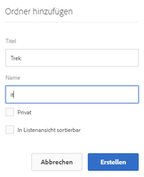
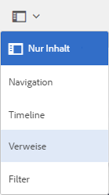

# Vorbereiten von Assets für die Übersetzung {#preparing-assets-for-translation}

Bei mehrsprachigen Assets handelt es sich um Assets mit Binärdateien, Metadaten und Tags in verschiedenen Sprachen. Im Allgemeinen liegen Binärdateien, Metadaten und Tags für Assets in einer Sprache vor, die dann für die Verwendung in mehrsprachigen Projekten in andere Sprachen übersetzt wird.

Unter [!DNL Adobe Experience Manager Assets] sind mehrsprachige Assets in Ordnern enthalten, in denen jeder Ordner die Assets in einer anderen Sprache enthält.

Jeder Sprachordner wird als eine Sprachkopie bezeichnet. Der Stammordner einer Sprachkopie, auch als Sprachstamm bezeichnet, identifiziert die Sprache des Inhalts in der Sprachkopie. Beispielsweise ist */content/dam/it* der italienische Sprachstamm für die italienische Sprachkopie. Sprachkopien müssen einen [korrekt konfigurierten Sprachstamm](preparing-assets-for-translation.md#creating-a-language-root) verwenden, damit die korrekte Sprache angesprochen wird, wenn Übersetzungen von Quell-Assets durchgeführt werden.

Die Sprachkopie, für die Sie ursprünglich Assets hinzufügen, ist die primäre Sprachinstanz. Die primäre Sprachinstanz ist die Quelle, die in andere Sprachen übersetzt wird. Eine Beispielordnerhierarchie enthält mehrere Sprachstämme:

```shell
/content
    /- dam
        |- en
        |- fr
        |- de
        |- es
        |- it
        |- ja
        |- zh
```

Führen Sie die folgenden Schritte aus, um Ihre Assets für die Übersetzung vorzubereiten:

1. Erstellen Sie den Sprachstamm für Ihre primäre Sprachinstanz. Beispielsweise lautet der Sprachstamm der englischen Sprachkopie in der Beispielordnerhierarchie `/content/dam/en`. Stellen Sie sicher, dass der Sprachstamm gemäß den Informationen unter [Sprachstamm erstellen](preparing-assets-for-translation.md#creating-a-language-root) richtig konfiguriert ist.

1. Fügen Sie Ihrer primären Sprachinstanz Assets hinzu.
1. Erstellen Sie den Sprachstamm der jeweiligen Zielsprache, für die Sie eine Sprachkopie benötigen.

## Erstellen eines Sprachstamms {#creating-a-language-root}

Um den Sprachstamm zu erstellen, erstellen Sie einen Ordner und verwenden Sie einen ISO-Sprach-Code als Wert für die Name-Eigenschaft. Nachdem Sie den Sprachstamm erstellt haben, können Sie eine Sprachkopie auf jeder beliebigen Ebene im Sprachstamm erstellen.

Beispielsweise verfügt die Stammseite der italienischsprachigen Kopie der Beispielhierarchie über `it` als Eigenschaft „Name“. Die Name-Eigenschaft wird als Name des Asset-Knotens im Repository verwendet und bestimmt daher den Pfad des Assets. (`https://[aem_server]:[port]/assets.html/content/dam/it/`).

1. Klicken Sie in der Konsole [!DNL Assets] auf **[!UICONTROL Erstellen]** und wählen Sie **[!UICONTROL Ordner]** aus dem Menü.

   

1. Geben Sie im Feld **[!UICONTROL Name]** den Ländercode im Format `<language-code>` ein.

   

1. Klicken Sie auf **[!UICONTROL Erstellen]**. Der Sprachstamm wird in der Konsole [!DNL Assets] erstellt.

## Anzeigen von Sprachstämmen {#viewing-language-roots}

[!DNL Experience Manager] verfügt über ein  **** Referenzen-Bedienfeld, das eine Liste der in  [!DNL Assets]diesem Bereich erstellten Sprachwurzeln anzeigt.

1. Wählen Sie in der Konsole [!DNL Assets] die Sprachprimärdatei aus, für die Sie Sprachkopien erstellen möchten.
1. Wählen Sie in der linken Leiste die Option **[!UICONTROL References]**, um den Bereich [!UICONTROL Reference] zu öffnen.

   

1. Klicken Sie im Bereich &quot;Referenzen&quot;auf **[!UICONTROL Sprachkopien]**. Das Bedienfeld [!UICONTROL Sprachkopien] zeigt die Sprachkopien der Assets an.

   
