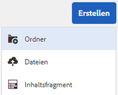

# Vorbereiten von Assets für die Übersetzung {#preparing-assets-for-translation}

Bei mehrsprachigen Assets handelt es sich um Assets mit Binärdateien, Metadaten und Tags in verschiedenen Sprachen. Im Allgemeinen liegen Binärdateien, Metadaten und Tags für Assets in einer Sprache vor, die dann für die Verwendung in mehrsprachigen Projekten in andere Sprachen übersetzt wird.

In [!DNL Adobe Experience Manager Assets], multilingual assets are included in folders, where each folder contains the assets in a different language.

Jeder Sprachordner wird als eine Sprachkopie bezeichnet. Der Stammordner einer Sprachkopie, auch als Sprachstamm bezeichnet, identifiziert die Sprache des Inhalts in der Sprachkopie. For example, */content/dam/it* is the Italian language root for the Italian language copy. Sprachkopien müssen einen [korrekt konfigurierten Sprachstamm](preparing-assets-for-translation.md#creating-a-language-root) verwenden, damit die korrekte Sprache angesprochen wird, wenn Übersetzungen von Quell-Assets durchgeführt werden.

Die Sprachkopie, für die Sie ursprünglich Assets hinzufügen, ist die primäre Sprachinstanz. Die primäre Sprachinstanz ist die Quelle, die in andere Sprachen übersetzt wird. Eine Beispielordnerhierarchie enthält mehrere Sprachstämme:

```
 /content
  /- dam
   |- en
   |- fr
   |- de
   |- es
   |- it
   |- ja
   |- zh
```

Führen Sie die folgenden Schritte aus, um Ihre Assets für die Übersetzung vorzubereiten:

1. Erstellen Sie den Sprachstamm für Ihre primäre Sprachinstanz. Beispielsweise lautet der Sprachstamm der englischen Sprachkopie in der Beispielordnerhierarchie `/content/dam/en`. Ensure that the language root is correctly configured according to the information in [Create a Language Root](preparing-assets-for-translation.md#creating-a-language-root).

1. Fügen Sie Ihrer primären Sprachinstanz Assets hinzu.
1. Erstellen Sie den Sprachstamm der jeweiligen Zielsprache, für die Sie eine Sprachkopie benötigen.

## Create a language root {#creating-a-language-root}

Um den Sprachstamm zu erstellen, erstellen Sie einen Ordner und verwenden Sie einen ISO-Sprachcode als Wert für die Name-Eigenschaft. Nachdem Sie den Sprachstamm erstellt haben, können Sie eine Sprachkopie auf jeder beliebigen Ebene im Sprachstamm erstellen.

Beispielsweise verfügt die Stammseite der italienischsprachigen Kopie der Beispielhierarchie über `it` als Eigenschaft „Name“. The Name property is used as the name of the asset node in the repository, and therefore determines the path of the assets. (`https://[aem_server]:[port]/assets.html/content/dam/it/`).

1. From the [!DNL Assets] console, click **[!UICONTROL Create]** and choose **[!UICONTROL Folder]** from the menu.

   

1. In the **[!UICONTROL Name]** field type the country code in the format of `<language-code>`.

   

1. Klicken Sie auf **[!UICONTROL Erstellen]**. The language root is created in the [!DNL Assets] console.

## Anzeigen von Sprachstämmen {#viewing-language-roots}

[!DNL Experience Manager] verfügt über ein **[!UICONTROL Referenzen]** -Bedienfeld, in dem eine Liste der Sprachenwurzeln angezeigt wird, die in [!DNL Assets]der Benutzeroberfläche erstellt wurden.

1. In the [!DNL Assets] console, select the language primary for which you want to create language copies.
1. Wählen Sie in der linken Leiste die Option &quot; **[!UICONTROL Referenzen]** &quot;, um den [!UICONTROL Referenzbereich] zu öffnen.

   

1. In the References pane, click **[!UICONTROL Language Copies]**. The [!UICONTROL Language Copies] panel shows the language copies of the assets.

   
