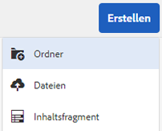
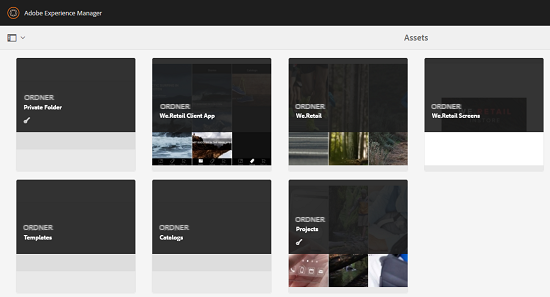
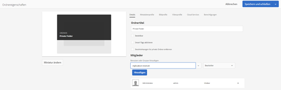
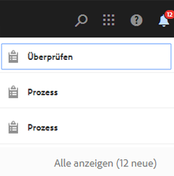
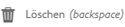

# Privater Ordner in [!DNL Adobe Experience Manager Assets] {#private-folder}

Sie können einen privaten Ordner in der [!DNL Adobe Experience Manager Assets]-Benutzeroberfläche erstellen, der ausschließlich für Sie verfügbar ist. Sie können diesen privaten Ordner für andere Benutzer freigeben und ihnen verschiedene Berechtigungen zuweisen. Je nach der zugewiesenen Berechtigungsstufe können Benutzer verschiedene Aufgaben mit dem Ordner ausführen, wie das Anzeigen oder Bearbeiten von Assets im Ordner.

>[!NOTE]
>
>Der private Ordner hat mindestens ein Mitglied mit der Rolle &quot;Inhaber&quot;.

## Erstellen und Freigeben von privaten Ordnern {#create-share-private-folder}

So erstellen Sie einen privaten Ordner und geben ihn frei:

1. Klicken Sie in der Konsole [!DNL Assets] in der Symbolleiste auf **[!UICONTROL Erstellen]** und wählen Sie dann **[!UICONTROL Ordner]** aus dem Menü.

   

1. Geben Sie im Dialogfeld **[!UICONTROL Ordner erstellen]** einen Titel und Namen (optional) für den Ordner ein und wählen Sie die Option **[!UICONTROL Privat]**.

1. Klicken Sie auf **[!UICONTROL Erstellen]**. Ein privater Ordner wird erstellt.

   

1. Um den Ordner für andere Benutzer freizugeben und ihnen Berechtigungen zuzuweisen, wählen Sie den Ordner aus und klicken Sie in der Symbolleiste auf **[!UICONTROL Eigenschaften]**.

   

   >[!NOTE]
   >
   >Der Ordner wird erst dann für andere Benutzer sichtbar, wenn Sie ihn freigeben.

1. Wählen Sie auf der Seite **[!UICONTROL Ordnereigenschaften]** einen Benutzer aus der Liste **[!UICONTROL Hinzufügen Benutzer]** aus, weisen Sie ihm eine Rolle in Ihrem privaten Ordner zu und klicken Sie auf **[!UICONTROL Hinzufügen]**.

   

   >[!NOTE]
   >
   >Sie können dem Benutzer, für den Sie den Ordner freigeben, verschiedene Rollen zuweisen, z. B. `Editor`, `Owner` oder `Viewer`. Wenn Sie dem Benutzer eine `Owner`-Rolle zuweisen, verfügt der Benutzer über `Editor`-Berechtigungen im Ordner. Darüber hinaus kann der Benutzer den Ordner für andere freigeben. Wenn Sie eine `Editor`-Rolle zuweisen, kann der Benutzer die Assets in Ihrem privaten Ordner bearbeiten. Wenn Sie eine Viewer-Rolle zuweisen, können die Assets nur in Ihrem privaten Ordner Ansicht werden.

   >[!NOTE]
   >
   >Der private Ordner hat mindestens ein Mitglied mit der Rolle `Owner`. Daher kann der Administrator nicht alle Inhaber-Mitglieder aus einem privaten Ordner entfernen. Um die vorhandenen Eigentümer (und den Administrator selbst) aus dem privaten Ordner zu entfernen, muss der Administrator jedoch einen anderen Benutzer als Inhaber hinzufügen.

1. Klicken Sie auf **[!UICONTROL Speichern]**. Je nach der Rolle, die Sie zuweisen, wird dem Benutzer eine Reihe von Berechtigungen für Ihren privaten Ordner zugewiesen, wenn sich der Benutzer bei [!DNL Assets] anmeldet.
1. Klicken Sie auf **[!UICONTROL OK]** zum Schließen der Bestätigungsmeldung.
1. Der Benutzer, für den Sie den Ordner freigeben, erhält eine Freigabebenachrichtigung. Melden Sie sich bei [!DNL Assets] mit den Anmeldeinformationen des Benutzers an, um die Benachrichtigung Ansicht.

   

1. Klicken Sie auf [!UICONTROL Benachrichtigungen], um eine Liste von Benachrichtigungen zu öffnen.

   

1. Klicken Sie auf den Eintrag für den vom Administrator freigegebenen privaten Ordner, um den Ordner zu öffnen.

>[!NOTE]
>
>Zum Erstellen eines privaten Ordners benötigen Sie die Berechtigungen zum Lesen und Ändern von [Zugriffskontrollen](/help/sites-administering/security.md#permissions-in-aem) im übergeordneten Ordner, unter dem Sie einen privaten Ordner erstellen möchten. Wenn Sie kein Administrator sind, sind diese Berechtigungen standardmäßig für `/content/dam` nicht aktiviert. In diesem Fall sollten Sie zunächst diese Berechtigungen für Ihre Benutzer-ID/Gruppe abrufen, bevor Sie versuchen, private Ordner zu erstellen.

## Löschen des privaten Ordners {#delete-private-folder}

Sie können einen Ordner löschen, indem Sie den Ordner auswählen und im oberen Menü die Option [!UICONTROL Löschen] wählen oder die Rücktaste auf der Tastatur verwenden.

>[!CAUTION]
>
>Wenn Sie einen Privatordner aus der CRXDE Lite löschen, bleiben redundante Benutzergruppen im Repository.

>[!NOTE]
>
>Wenn Sie einen Ordner mit der oben genannten Methode aus der Benutzeroberfläche löschen, werden auch die zugehörigen Benutzergruppen gelöscht.
>
>Die vorhandenen redundanten, nicht verwendeten und automatisch generierten Benutzergruppen können jedoch mit der `clean`-Methode in JMX in der Autoreninstanz (`http://[server]:[port]/system/console/jmx/com.day.cq.dam.core.impl.team%3Atype%3DClean+redundant+groups+for+Assets`) aus dem Repository entfernt werden.
