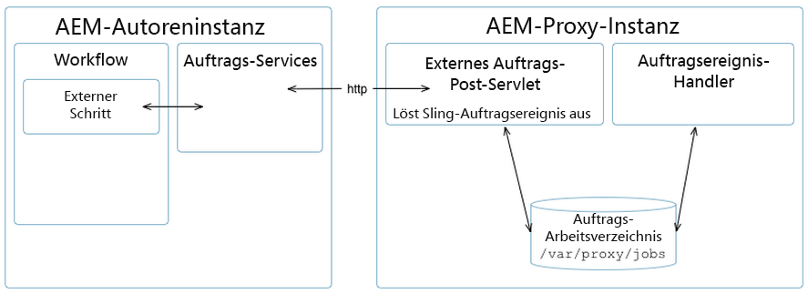

# [!DNL Assets] Proxy-Entwicklung {#assets-proxy-development}

[!DNL Adobe Experience Manager Assets] verwendet einen Proxy, um die Verarbeitung für bestimmte Aufgaben zu verteilen.

Ein Proxy ist eine bestimmte (und manchmal separate) Experience Manager-Instanz, die Proxy Worker als Prozessoren verwendet, die für die Verarbeitung eines Auftrags und die Erstellung eines Ergebnisses verantwortlich sind. Ein Proxy Worker kann für eine Vielzahl von Aufgaben verwendet werden. Im Falle einer [!DNL Assets] Proxy, der zum Laden von Assets zum Rendern in Assets verwendet werden kann. Beispiel: die [IDS-Proxy-Worker](indesign.md) verwendet eine [!DNL Adobe InDesign] Server zur Verarbeitung von Dateien zur Verwendung in Assets.

Wenn der Proxy ein separater [!DNL Experience Manager] -Instanz, wodurch die Belastung der [!DNL Experience Manager] Authoring-Instanz(en). Standardmäßig [!DNL Assets] führt die Asset-Verarbeitungsaufgaben in derselben JVM aus (über Proxy externalisiert), um die Belastung der [!DNL Experience Manager] Authoring-Instanz.

## Proxy (HTTP-Zugriff) {#proxy-http-access}

Proxys, deren Konfiguration Verarbeitungsaufträge zulässt, sind über das HTTP-Servlet verfügbar: `/libs/dam/cloud/proxy`. Dieses Servlet erstellt einen Sling-Auftrag aus den geposteten Parametern. Der Auftrag wird dann der Proxy-Auftragswarteschlange hinzugefügt und mit dem entsprechenden Proxy Worker verbunden.

### Unterstützte Vorgänge {#supported-operations}

* `job`

   **Anforderungen**: Der Parameter `jobevent` muss als serialisierte Wertezuordnung festgelegt werden. Damit wird ein `Event` für einen Auftragsverarbeiter.

   **Ergebnis**: Fügt einen neuen Auftrag hinzu. Wenn der Vorgang erfolgreich ist, wird eine eindeutige Auftrags-ID zurückgegeben.

```shell
curl -u admin:admin -F":operation=job" -F"someproperty=xxxxxxxxxxxx"
    -F"jobevent=serialized value map" http://localhost:4502/libs/dam/cloud/proxy
```

* `result`

   **Voraussetzungen**: den Parameter `jobid` festgelegt werden.

   **Ergebnis:** Gibt die JSON-Darstellung des Ergebnisknotens zurück, wie er durch den Auftragsprozessor erstellt wurde.

```shell
curl -u admin:admin -F":operation=result" -F"jobid=xxxxxxxxxxxx"
    http://localhost:4502   /libs/dam/cloud/proxy
```

* `resource`

   **Anforderungen**: Der Parameter „jobid“ must festgelegt sein.

   **Ergebnis**: Gibt eine Ressource zurück, die dem jeweiligen Auftrag zugeordnet ist.

```shell
curl -u admin:admin -F":operation=resource" -F"jobid=xxxxxxxxxxxx"
    -F"resourcePath=something.pdf" http://localhost:4502/libs/dam/cloud/proxy
```

* `remove`

   **Anforderungen**: Der Parameter „jobid“ must festgelegt sein.

   **Ergebnisse:**: Entfernt einen gefundenen Auftrag.

```shell
curl -u admin:admin -F":operation=remove" -F"jobid=xxxxxxxxxxxx"
    http://localhost:4502/libs/dam/cloud/proxy
```

### Proxy Worker {#proxy-worker}

Ein Proxy Worker ist ein Prozessor, der für die Verarbeitung von Aufträgen und die Generierung von Ergebnissen zuständig ist. Worker befinden sich auf der Proxy-Instanz und müssen [sling JobProcessor](https://sling.apache.org/site/eventing-and-jobs.html) implementieren, damit sie als Proxy Worker erkannt werden.

>[!NOTE]
>
>Worker müssen [sling JobProcessor](https://sling.apache.org/site/eventing-and-jobs.html) implementieren, damit sie als Proxy Worker erkannt werden.

### Client-API {#client-api}

[`JobService`](https://helpx.adobe.com/experience-manager/6-5/sites/developing/using/reference-materials/javadoc/index.html) ist als OSGi-Dienst verfügbar, der Methoden zur Erstellung und Entfernung von Aufträgen und dem Abruf von Ergebnissen aus den Aufträgen bereitstellt. Die Standardimplementierung des Dienstes (`JobServiceImpl`) verwendet den HTTP-Client für die Kommunikation mit dem Remote-Proxy-Servlet.

Nachstehend finden Sie ein Beispiel für die API-Verwendung:

```java
@Reference
 JobService proxyJobService;

 // to create a new job
 final Hashtable props = new Hashtable();
 props.put("someproperty", "some value");
 props.put(JobUtil.PROPERTY_JOB_TOPIC, "myworker/job"); // this is an identifier of the worker
 final String jobId = proxyJobService.addJob(props, new Asset[]{asset});

 // to check status (returns JobService.STATUS_FINISHED or JobService.STATUS_INPROGRESS)
 int status = proxyJobService.getStatus(jobId)

 // to get the result
 final String jsonString = proxyJobService.getResult(jobId);

 // to remove job and cleanup
 proxyJobService.removeJob(jobId);
```

### Cloud Service-Konfigurationen {#cloud-service-configurations}

<!-- TBD: Cannot find com.day.cq.dam.api.proxy at https://helpx.adobe.com/experience-manager/6-5/sites/developing/using/reference-materials/javadoc/index.html which were generated in May 2020. Hiding this broken link for now.
>[!NOTE]
>
>Reference documentation for the proxy API is available under [`com.day.cq.dam.api.proxy`](https://helpx.adobe.com/experience-manager/6-5/sites/developing/using/reference-materials/javadoc/com/day/cq/dam/api/proxy/package-summary.html).
-->

Sowohl Proxy- als auch Proxy Worker-Konfigurationen sind über Cloud Services-Konfigurationen verfügbar, auf die über die [!DNL Assets] **Instrumente** Konsole oder unter `/etc/cloudservices/proxy`. Von jedem Proxy Worker wird erwartet, dass er einen Knoten unter `/etc/cloudservices/proxy` für Worker-spezifische Konfigurationsdetails (z. B. `/etc/cloudservices/proxy/workername`).

>[!NOTE]
>
>Siehe [InDesign Server Proxy Worker-Konfiguration](indesign.md#configuring-the-proxy-worker-for-indesign-server) und [Cloud Services-Konfiguration](../sites-developing/extending-cloud-config.md) für weitere Informationen.

Nachstehend finden Sie ein Beispiel für die API-Verwendung:

```java
@Reference(policy = ReferencePolicy.STATIC)
 ProxyConfig proxyConfig;

 // to get proxy config
 Configuration cloudConfig = proxyConfig.getConfiguration();
 final String value = cloudConfig.get("someProperty", "defaultValue");

 // to get worker config
 Configuration cloudConfig = proxyConfig.getConfiguration("workername");
 final String value = cloudConfig.get("someProperty", "defaultValue");
```

### Entwickeln eines benutzerdefinierten Proxy Workers {#developing-a-customized-proxy-worker}

Die [IDS-Proxy-Worker](indesign.md) ist ein Beispiel für eine [!DNL Assets] Proxy Worker, der bereits standardmäßig bereitgestellt wird, um die Verarbeitung von InDesign-Assets auszulagern.

Sie können auch Ihre eigenen [!DNL Assets] Proxy Worker zum Erstellen eines spezialisierten Sekundärs zum Versenden und Outsourcing von [!DNL Assets] Verarbeitungsaufgaben.

Für die Einrichtung eines eigenen benutzerdefinierten Proxy Workers müssen Sie die folgenden Aufgaben ausführen:

* Einrichten und Implementieren (mit Sling Eventing): 

   * benutzerdefiniertes Auftragsthema
   * benutzerdefinierter Auftrags-Ereignishandler

* Führen Sie mit der JobService-API die folgenden Aufgaben aus:

   * benutzerdefinierten Auftrag an Proxy senden
   * Auftrag verwalten

* Wenn Sie den Proxy aus einem Workflow verwenden möchten, müssen Sie einen externen benutzerdefinierten Schritt implementieren. Verwenden Sie dafür die WorkflowExternalProcess-API und die JobService-API.

Die Vorgehensweise wird im folgenden Diagramm erläutert:



>[!NOTE]
>
>In den folgenden Schritten werden InDesign-Entsprechungen als Referenzbeispiele angegeben.

1. Da ein [Sling-Auftrag](https://sling.apache.org/site/eventing-and-jobs.html) verwendet wird, müssen Sie ein Auftragsthema für Ihren Anwendungsfall definieren.

   Als Beispiel dient `IDSJob.IDS_EXTENDSCRIPT_JOB` für den IDS Proxy Worker.

1. Mit dem externen Schritt wird das Ereignis ausgelöst, anschließend wird auf den Abschluss gewartet. Hierfür wird die ID abgerufen. Sie müssen einen eigenen Schritt entwickeln, um eine neue Funktionalität zu implementieren. 

   Implementieren Sie einen `WorkflowExternalProcess`. Bereiten Sie dann mit der JobService-API und Ihrem Auftragsthema ein Auftragsereignis vor und senden Sie es an den JobService (einen OSGi-Dienst). 

   Als Beispiel dient `INDDMediaExtractProcess` für den IDS Proxy Worker.

1. Implementieren Sie einen Auftrags-Handler für Ihr Thema. Der Handler muss entwickelt werden, damit er die von Ihnen gewünschte spezifische Aktion ausführt und als Worker-Implementierung betrachtet wird. 

   Als Beispiel dient `IDSJobProcessor.java` für den IDS Proxy Worker.

1. Verwenden Sie `ProxyUtil.java` in dam-commons. Damit können Sie Aufträge mit dem dam-Proxy an Worker senden.

>[!NOTE]
>
>Was die [!DNL Assets] Das Proxy-Framework bietet nicht standardmäßig den Pool-Mechanismus.
>
>Die [!DNL InDesign] -Integration ermöglicht den Zugriff auf einen Pool von [!DNL InDesign] Server (IDSPool). Dieses Pooling ist spezifisch für [!DNL InDesign] -Integration und nicht Teil der [!DNL Assets] Proxy-Framework.

>[!NOTE]
>
>Synchronisierung der Ergebnisse:
>
>Bei n Instanzen, die denselben Proxy verwenden, bleibt das Verarbeitungsergebnis beim Proxy. Es ist Aufgabe des Clients (Experience Manager Author), das Ergebnis mit derselben eindeutigen Auftrags-ID anzufordern, die dem Client bei der Auftragserstellung zugewiesen wurde. Der Proxy erledigt einfach den Auftrag und hält das Ergebnis abrufbereit.
