# Zugehörige Assets {#related-assets}

[!DNL Adobe Experience Manager Assets] ermöglicht Ihnen die manuelle Zuordnung von Assets zu den Anforderungen Ihrer Organisation mithilfe der zugehörigen Asset-Funktion. Beispielsweise können Sie einem Asset oder einem Bild/Video eine Lizenzdatei zu einem ähnlichen Thema zuordnen. Sie können Assets zuordnen, die bestimmte gängige Attribute teilen. Mit der Funktion können Sie außerdem Quellbeziehungen/abgeleitete Beziehungen zwischen Assets erstellen. Beispielsweise können Sie PDF-Dateien, die aus einer INDD-Datei generiert wurden, der INDD-Quelldatei zuordnen.

Mit dieser Funktion können Sie eine PDF- oder JPG-Datei mit niedriger Auflösung für Anbieter oder Agenturen freigeben und die hochauflösende INDD-Datei nur auf Anfrage verfügbar machen.

>[!NOTE]
>
>Nur Benutzer mit Bearbeitungsberechtigungen für Assets können die Assets verknüpfen und die Zuordnung aufheben.

## Zuordnen von Assets {#relating-assets}

1. Öffnen Sie in der [!DNL Experience Manager]-Benutzeroberfläche die Seite **[!UICONTROL Eigenschaften]** für ein Asset, das Sie zuordnen möchten.

   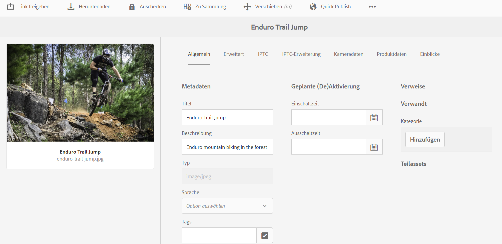

   *Abbildung:  [!DNL Assets]  Eigenschaftenseite zum Zuordnen von Assets.*

   Wählen Sie alternativ das gewünschte Asset in der Liste aus.

   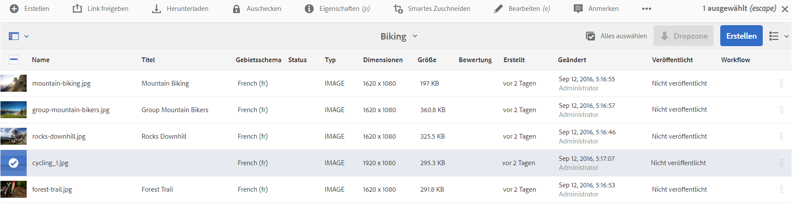

   Sie können das Asset auch aus einer Sammlung auswählen.

   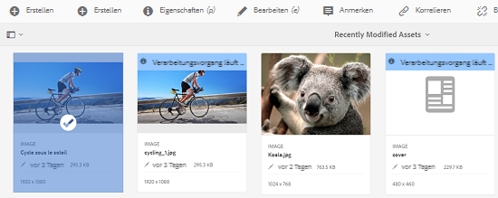

1. Um ein anderes Asset mit dem ausgewählten Asset zu verknüpfen, klicken Sie in der Symbolleiste auf **[!UICONTROL Relate]**  .
1. Führen Sie einen der folgenden Schritte aus:

   * Um die Quelldatei des Elements zuzuordnen, wählen Sie **[!UICONTROL Quelle]** aus der Liste aus.
   * Um eine abgeleitete Datei zuzuordnen, wählen Sie **[!UICONTROL Abgeleitet]** aus der Liste aus.
   * Um eine Zweiwege-Beziehung zwischen den Assets zu erstellen, wählen Sie **[!UICONTROL Andere]** aus der Liste aus.

1. Navigieren Sie im Bildschirm **[!UICONTROL Assets auswählen]** zum Speicherort des Elements, das Sie zuordnen möchten, und wählen Sie es aus.

   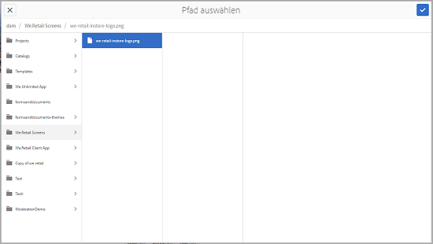

1. Klicken Sie auf **[!UICONTROL Bestätigen]**.
1. Klicken Sie auf **[!UICONTROL OK]**, um das Dialogfeld zu schließen. Je nach Auswahl der Beziehung in Schritt 3 wird das zugeordnete Asset unter einer entsprechenden Kategorie im Abschnitt **[!UICONTROL Zugehörig]** aufgeführt. Beispiel: Wenn das zugeordnete Asset die Quelldatei des aktuellen Elements ist, wird es unter **[!UICONTROL Quelle]** aufgeführt.

   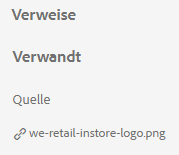

1. Um die Zuordnung eines Assets aufzuheben, klicken Sie in der Symbolleiste auf **[!UICONTROL Verknüpfung aufheben]**  .

1. Wählen Sie die Assets aus, die Sie vom Dialogfeld **[!UICONTROL Beziehungen entfernen]** entfernen möchten, und klicken Sie auf **[!UICONTROL Verknüpfung aufheben]**.

   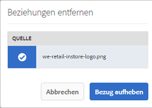

1. Klicken Sie auf **[!UICONTROL OK]**, um das Dialogfeld zu schließen. Die Assets, für die Sie Verbindungen entfernt haben, werden aus der Liste der zugeordneten Assets im Abschnitt **[!UICONTROL Zugehörig]** gelöscht.

## Übersetzen zugehöriger Assets {#translating-related-assets}

Das Erstellen von Quell-/abgeleiteten Beziehungen zwischen Assets mithilfe der zugehörigen Asset-Funktion ist auch in Übersetzungs-Workflows hilfreich. Wenn Sie einen Übersetzungs-Workflow für ein abgeleitetes Asset ausführen, ruft [!DNL Experience Manager Assets] automatisch alle Assets ab, auf die die Quelldatei verweist, und fügt sie zur Übersetzung hinzu. Auf diese Weise wird das vom Quell-Asset referenzierte Asset zusammen mit dem Quell-Asset und den abgeleiteten Assets übersetzt. Beispiel: In einem Szenario enthält die Kopie in englischer Sprache ein abgeleitetes Asset und die entsprechende Quelldatei wie gezeigt.

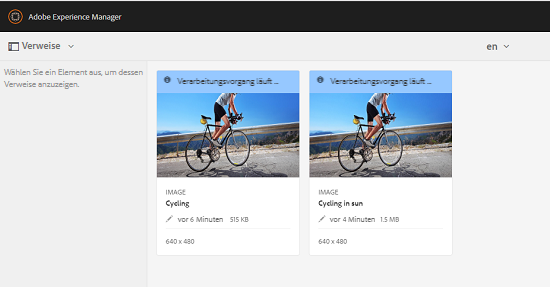

Wenn die Quelldatei mit einem anderen Asset verknüpft ist, ruft [!DNL Experience Manager Assets] das referenzierte Asset ab und fügt es zur Übersetzung hinzu.

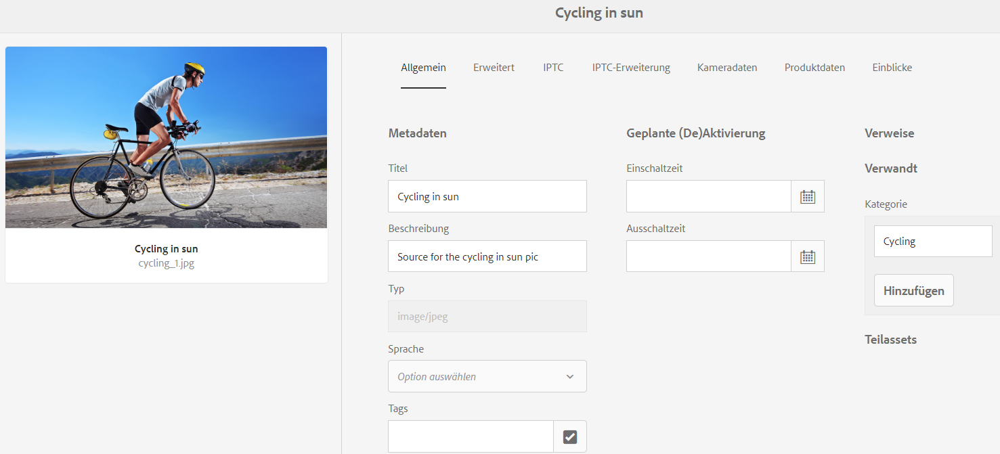

*Abbildung: Quell-Asset der zugehörigen Assets, die zur Übersetzung hinzugefügt werden sollen.*

1. Übersetzen Sie die Assets im Quellordner für eine Zielsprache, indem Sie die Schritte unter [Neues Übersetzungsprojekt erstellen](translation-projects.md#create-a-new-translation-project) befolgen. Übersetzen Sie in diesem Fall zum Beispiel Ihre Assets ins Französische.

1. Öffnen Sie auf der Seite [!UICONTROL Projekte] den Übersetzungsordner.

1. Klicken Sie auf die Projektkachel, um die Detailseite zu öffnen.

   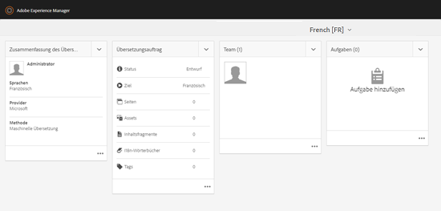

1. Klicken Sie auf die Auslassungszeichen unter der Karte Übersetzungsauftrag , um den Übersetzungsstatus anzuzeigen.

   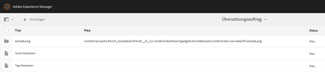

1. Wählen Sie das Asset aus und klicken Sie dann in der Symbolleiste auf **[!UICONTROL In Assets einblenden]** , um den Übersetzungsstatus für das Asset anzuzeigen.

   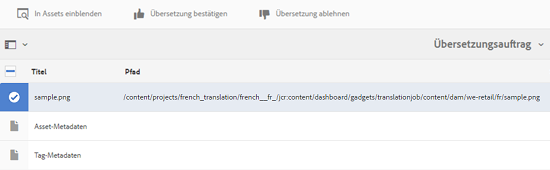

1. Um zu überprüfen, ob die mit der Quelle verknüpften Assets übersetzt wurden, klicken Sie auf das Quell-Asset.

1. Wählen Sie das mit der Quelle verknüpfte Asset aus und klicken Sie dann auf **[!UICONTROL In Assets einblenden]**. Das übersetzte zugehörige Asset wird angezeigt.
