# Wiederverwenden von mit MSM für Assets[!DNL Assets]{#reuse-assets-using-msm-for-assets}

Multi-Site-Manager (MSM)-Funktionalität in [!DNL Adobe Experience Manager] ermöglicht Benutzern die Wiederverwendung von Inhalten, die einmal erstellt und über mehrere Websites hinweg wiederverwendet werden. Dasselbe gilt für digitale Assets wie MSM für die Funktionalität [!DNL Assets]. Mit MSM für [!DNL Assets] können Sie:

* Einmal Assets anlegen und dann Kopien dieser Assets erstellen, um sie in anderen Bereichen der Site wiederzuverwenden.
* Behalten Sie mehrere Kopien bei und aktualisieren Sie die ursprüngliche primäre Kopie einmal, um die Änderungen an die untergeordneten Kopien zu übertragen.
* Lokale Änderungen vornehmen, indem Sie die Verknüpfung zwischen übergeordneten und untergeordneten Assets vorübergehend oder dauerhaft unterbrechen.

## Voraussetzungen {#prereq}

Um MSM für [!DNL Assets] zu verwenden, installieren Sie mindestens [!DNL Experience Manager] 6.5 Service Pack 1. Weitere Informationen finden Sie in den Versionshinweisen zum aktuellen Service Pack](/help/release-notes/sp-release-notes.md).[

## Wissenswertes über Vorteile und Konzepte {#concepts}

### Funktionsweise und Vorteile {#how-it-works-and-the-benefits}

Weitere Informationen zu Nutzungsszenarien einer Wiederverwendung identischer Inhalte (Text und Assets) über mehrere Web-Speicherorte hinweg finden Sie unter [Mögliche MSM-Szenarien](/help/sites-administering/msm.md). [!DNL Experience Manager] unterhält einen Link zwischen dem ursprünglichen Asset und dessen verknüpften Kopien, die als Live Copies (LCs) bezeichnet werden. Diese bestehende Verknüpfung ermöglicht Push-Übertragungen zentraler Änderungen an eine große Zahl von Live Copies. Auf diese Weise werden schnellere Aktualisierungen ermöglicht, während die mit der Verwaltung doppelter Kopien einhergehenden Beschränkungen entfallen. Die Übertragung von Änderungen erfolgt fehlerfrei und zentralisiert. Die Funktion lässt Raum für Aktualisierungen, die auf ausgewählte Live Copies beschränkt sind. Benutzer können die Verknüpfung, d. h. die Vererbung von Pausen, auflösen und lokale Änderungen vornehmen, die nicht überschrieben werden, wenn die primäre Kopie das nächste Mal aktualisiert und Änderungen ausgeführt werden. Die Trennung kann für einige ausgewählte Metadatenfelder oder für ein vollständiges Asset vorgenommen werden. Es bietet Flexibilität bei der lokalen Aktualisierung von Assets, die ursprünglich von einer primären Kopie geerbt wurden.

MSM behält eine (Live-)Beziehung zwischen dem Quell-Asset und seinen Live Copies bei, sodass:

* Änderungen an den Quell-Assets auch auf Live Copies angewendet werden (Rollout), d. h., die Live Copies werden mit der Quelle synchronisiert;
* Sie Live Copies aktualisieren können, indem Sie die Live-Beziehung aussetzen oder die Vererbung für wenige begrenzte Felder entfernen. Die Änderungen an der Quelle werden nicht mehr auf die Live Copy angewendet.

### Glossar von MSM für [!DNL Assets] Begriffe {#glossary}

**Quelle:** Die ursprünglichen Assets oder Ordner. Primär Kopie, von der Live-Kopien abgeleitet werden.

**Live Copy:** Die Kopie der Quellelemente/Ordner, die mit ihrer Quelle synchronisiert wird. Live Copies können eine Quelle für weitere Live Copies sein. Siehe „Erstellen von LCs“.

**Vererbung:** Ein Link/Verweis zwischen einem Live-Copy-Asset/-Ordner und seiner Quelle, über den das System speichert, wohin die Updates gesendet werden sollen. Eine Vererbung existiert für Metadatenfelder auf granularer Ebene. Die Vererbung kann für ausgewählte Metadatenfelder entfernt werden, während die Live-Beziehung zwischen Quelle und zugehöriger Live Copy beibehalten wird.

**Rollout:** Eine Aktion, die die Änderungen an der Quelle nach den Live-Kopien schiebt. Es ist möglich, mithilfe der Aktion „Rollout“ eine oder mehrere Live Copies in einem Schritt zu aktualisieren. Siehe „Rollout“.

**Rollout-Konfiguration:** Regeln, die festlegen, welche Eigenschaften synchronisiert werden, wie und wann. Diese Konfigurationen werden beim Erstellen von Live Copies angewendet und können später bearbeitet werden. Dabei kann ein untergeordnetes Element die Rollout-Konfiguration vom zugehörigen übergeordneten Asset übernehmen. Verwenden Sie für MSM für [!DNL Assets] nur die Standard-Rollout-Konfiguration. Die anderen Rollout-Konfigurationen sind für MSM für [!DNL Assets] nicht verfügbar.

**Synchronisieren:** Eine weitere Aktion, die zusätzlich zur Einführung eine Parität zwischen Quelltext und Live-Kopie herstellt, indem die Updates von der Quelle an Live-Kopien gesendet werden. Eine Synchronisierung wird für eine bestimmte Live Copy initiiert und die Aktion ruft die Änderungen von der Quelle ab. Mit dieser Aktion können Sie nur eine der Live Copies aktualisieren. Siehe „Aktion &#39;Synchronisieren&#39;“.

**Aussetzen: Entfernen Sie** vorübergehend die Live-Beziehung zwischen einer Live-Kopie und ihrem Quellasset/Ordner. Sie können die Beziehung wieder aufnehmen. Siehe „Aktion &#39;Aussetzen&#39;“.

**Fortsetzen:** Nehmen Sie die Live-Beziehung wieder auf, damit Beginn, die die Updates aus der Quelle erhalten haben, erneut eine Live-Kopie erhalten. Siehe „Aktion &#39;Fortsetzen&#39;“.

**Zurücksetzen:** Die Aktion &quot;Zurücksetzen&quot;bewirkt, dass die Live-Kopie erneut eine Kopie der Quelle darstellt, indem alle lokalen Änderungen überschrieben werden. Außerdem werden abgebrochene Vererbungsvorgänge entfernt und Vererbungen in allen Metadatenfeldern zurückgesetzt. Für zukünftige lokale Änderungen müssen Sie die Vererbung bestimmter Felder erneut abbrechen. Siehe „Lokale Änderungen an LC“.

**Trennen:** Entfernen Sie unwiderruflich die Live-Beziehung eines Live Copy-Assets/Ordners. Nach der Aktion „Trennen“ können Live Copies niemals Aktualisierungen aus der Quelle empfangen und sie haben keinen Live Copy-Status mehr. Siehe „Entfernen von Beziehungen“.

## Erstellen von Live Copies eines Assets {#createlc}

Führen Sie einen der folgenden Schritte aus, um eine Live Copy aus einem oder mehreren Quell-Assets oder -Ordnern zu erstellen:

* Methode 1: Wählen Sie die Quellelemente aus und klicken Sie in der Symbolleiste oben auf **[!UICONTROL Erstellen]** > **[!UICONTROL Live Copy]**.
* Methode 2: Klicken Sie in der [!DNL Experience Manager]-Benutzeroberfläche in der oberen rechten Ecke der Oberfläche auf **[!UICONTROL Erstellen]** > **[!UICONTROL Live Copy]**.

Sie können Live Copies eines Assets oder Ordners einzeln erstellen. Sie können Live Copies erstellen, die aus einem Asset oder Ordner abgeleitet werden, der ebenfalls eine Live Copy ist. Inhaltsfragmente werden für das Nutzungsszenario nicht unterstützt. Wenn Sie versuchen, deren Live Copies zu erstellen, werden die Inhaltsfragmente wie vorliegend und ohne Beziehung kopiert. Die kopierten Inhaltsfragmente sind eine Momentaufnahme und werden nicht zusammen mit den ursprünglichen Inhaltsfragmenten aktualisiert.

Führen Sie folgende Schritte aus, um Live Copies mit der ersten Methode zu erstellen:

1. Wählen Sie Quell-Assets oder -ordner aus. Klicken Sie in der Symbolleiste auf **[!UICONTROL Erstellen]** > **[!UICONTROL Live Copy]**.

   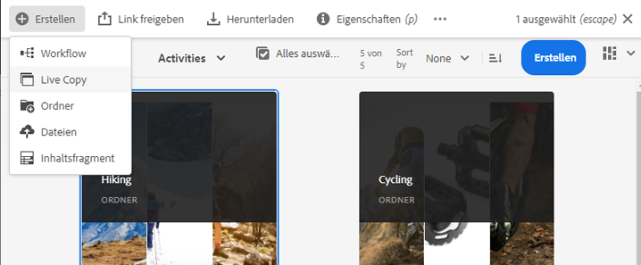

   *Abbildung: Erstellen Sie eine Live-Kopie über die  [!DNL Experience Manager] Benutzeroberfläche.*

1. Wählen Sie einen Zielordner aus. Klicken Sie auf **[!UICONTROL Weiter]**.
1. Geben Sie einen Titel und Namen an. Assets haben keine untergeordneten Elemente. Wenn Sie eine Live Copy von Ordnern erstellen, können Sie die untergeordneten Elemente ein- oder ausschließen.
1. Wählen Sie eine Rollout-Konfiguration aus. Klicken Sie auf **[!UICONTROL Erstellen]**.

Führen Sie folgende Schritte aus, um Live Copies mit der zweiten Methode zu erstellen:

1. Klicken Sie in [!DNL Experience Manager] oben rechts auf **[!UICONTROL Erstellen]** > **[!UICONTROL Live Copy]**.

   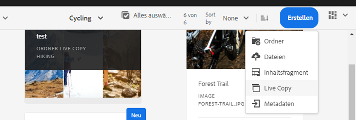

   *Abbildung: Erstellen Sie eine Live-Kopie über die  [!DNL Experience Manager] Benutzeroberfläche.*

1. Wählen Sie Quell-Asset oder -ordner aus. Klicken Sie auf **[!UICONTROL Weiter]**.
1. Wählen Sie einen Zielordner aus. Klicken Sie auf **[!UICONTROL Weiter]**.
1. Geben Sie einen Titel und Namen an. Assets haben keine untergeordneten Elemente. Wenn Sie eine Live Copy von Ordnern erstellen, können Sie die untergeordneten Elemente ein- oder ausschließen.
1. Wählen Sie eine Rollout-Konfiguration aus. Klicken Sie auf **[!UICONTROL Erstellen]**.

>[!NOTE]
>
>Wenn eine Quelle oder Live Copy verschoben wird, werden die Beziehungen beibehalten. Wenn eine Live Copy gelöscht wird, werden die Beziehungen entfernt.

## Anzeigen verschiedener Eigenschaften und Status von Quelle und Live Copy {#properties}

Sie können die Informationen und MSM-bezogenen Status von Live Copy wie Beziehung, Synchronisierung, Rollouts und mehr aus den verschiedenen Bereichen der [!DNL Experience Manager]-Benutzeroberfläche Ansicht haben.

Die folgenden beiden Methoden funktionieren für Assets und Ordner:

* Wählen Sie ein Live Copy-Asset aus und suchen Sie nach Informationen auf der zugehörigen Eigenschaftenseite.
* Wählen Sie den Quellordner und suchen Sie die detaillierten Informationen zu den einzelnen Live-Kopien unter [!UICONTROL Live Copy Console].

>[!TIP]
>
>Um den Status einiger separater Live-Kopien zu überprüfen, verwenden Sie die erste Methode, um die Seite [!UICONTROL Eigenschaften] zu überprüfen. Um den Status vieler Live-Kopien zu überprüfen, verwenden Sie die zweite Methode, um die Seite **[!UICONTROL Beziehungsstatus]** zu überprüfen.

### Informationen und Status von Live Copies   {#statuslcasset}

Führen Sie folgende Schritte aus, um Informationen und Status eines Live Copy-Assets oder -Ordners zu prüfen.

1. Wählen Sie ein Live Copy-Asset oder einen Ordner aus. Klicken Sie in der Symbolleiste auf **[!UICONTROL Eigenschaften]**. Sie können auch den Tastaturbefehl `p` verwenden.
1. Klicken Sie auf **[!UICONTROL Live Copy]**. Sie können den Pfad der Quelle, den Aussetzen-Status, den Synchronisierungsstatus, das letzte Rollout-Datum und den Benutzer, der das letzte Rollout durchgeführt hat, prüfen.

   

   *Abbildung: Live-Kopierinformationen und Status*

1. Eine Aktivierung oder Deaktivierung ist möglich, wenn untergeordnete Assets die Live Copy-Konfiguration übernehmen.

1. Sie können die Option für die Live Copy wählen, um die Rollout-Konfiguration vom übergeordneten Asset zu übernehmen oder die Konfiguration zu ändern.

### Informationen und Status aller Live Copies eines Ordners {#status-lc-folder}

[!DNL Experience Manager] stellt eine Konsole bereit, um die Status aller Live Copies eines Quellordners zu prüfen. Diese Konsole zeigt den Status aller untergeordneten Assets an.

1. Wählen Sie einen Quellordner aus. Klicken Sie in der Symbolleiste auf **[!UICONTROL Eigenschaften]**. Sie können auch den Tastaturbefehl `p` verwenden.
1. Klicken Sie auf **[!UICONTROL Live Copy-Quelle]**. Klicken Sie auf **[!UICONTROL Live Copy-Übersicht]**, um die Konsole zu öffnen. Dieses Dashboard liefert übergeordnete Statusinformationen aller untergeordneten Assets.

   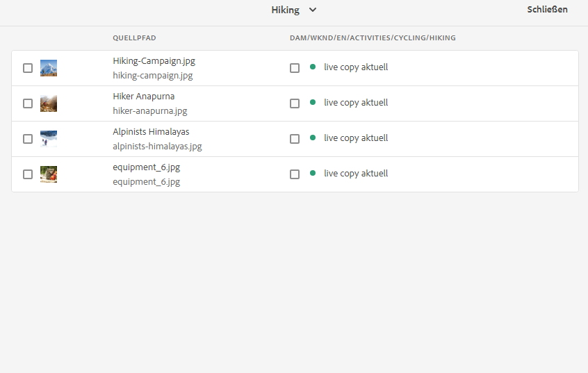

   *Abbildung: Status der Ansicht von Live-Kopien in  [!UICONTROL Live Copy ] Consoleof source.*

1. Um die detaillierten Informationen zu den einzelnen Assets im Ordner „Live Copy“ anzuzeigen, wählen Sie ein Asset aus und klicken Sie in der Symbolleiste auf **[!UICONTROL Beziehungsstatus]**.

   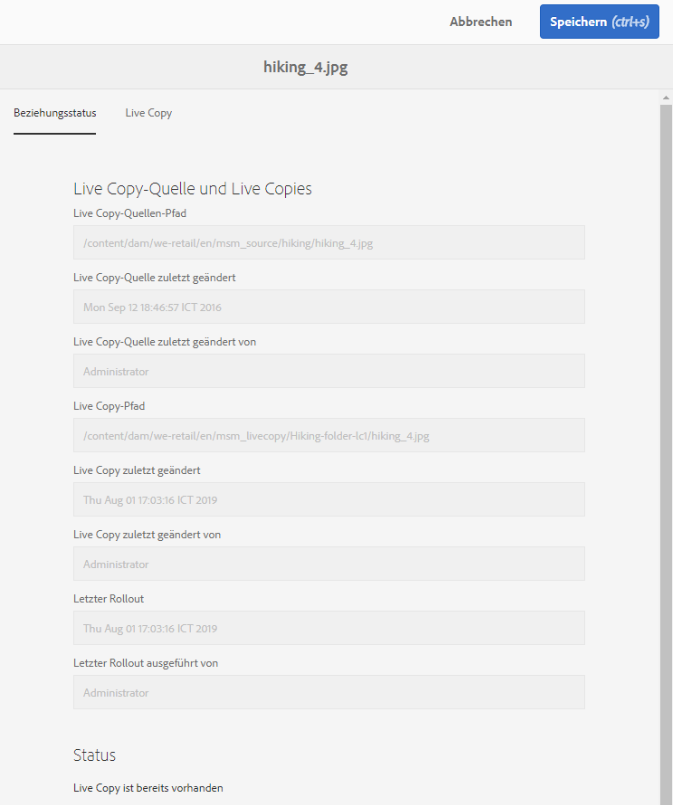

   Detaillierte Informationen und Status eines untergeordneten Live Copy-Assets in einem Ordner

>[!TIP]
>
>Sie können die Status von Live-Kopien anderer Ordner schnell sehen, ohne zu viel durchsuchen zu müssen. Ändern Sie den Ordner aus der oberen Mitte der **[!UICONTROL Live Copy-Benutzeroberfläche]**.

### Schnellaktionen in der Leiste „Verweise“ für Quellen {#refrailsource}

Für Quell-Assets oder -ordner können Sie die folgenden Informationen über die Leiste „Verweise“ anzeigen und die folgenden Aktionen von dort aus direkt ausführen:

* Anzeigen der Pfade von Live Copies
* Öffnen oder zeigen Sie eine bestimmte Live-Kopie in der [!DNL Experience Manager]-Benutzeroberfläche an.
* Synchronisieren von Aktualisierungen mit einer bestimmten Live Copy
* Aussetzen der Beziehung oder Ändern der Rollout-Konfiguration für eine bestimmte Live Copy
* Zugreifen auf die Konsole „Live Copy-Übersicht“

Wählen Sie Quell-Asset oder -ordner aus, öffnen Sie die linke Leiste und klicken Sie auf **[!UICONTROL Verweise]**. Sie können auch ein Asset oder einen Ordner auswählen und den Tastaturbefehl `Alt + 4` verwenden.

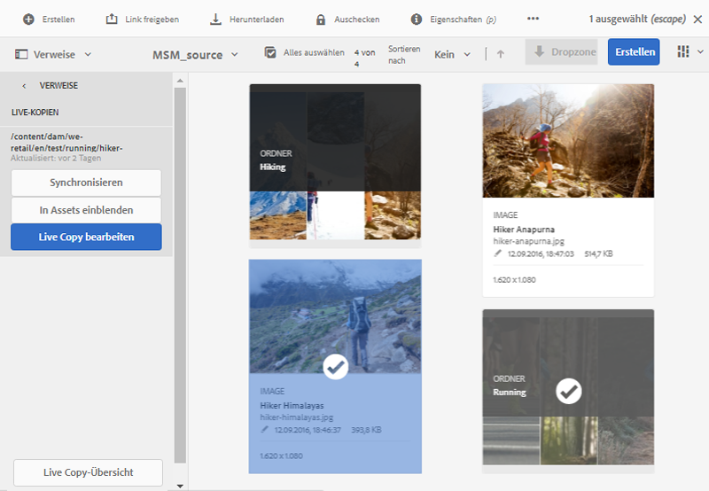

*Abbildung: Aktionen und Informationen, die in der Leiste &quot;Referenzen&quot;für die ausgewählte Quelle verfügbar sind.*

Klicken Sie für eine bestimmte Live Copy auf **[!UICONTROL Live Copy bearbeiten]**, um die Beziehung auszusetzen oder die Rollout-Konfiguration zu ändern.

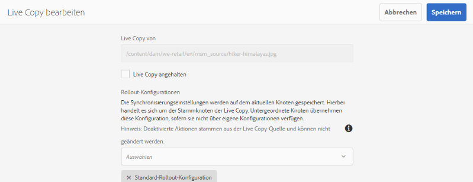

*Abbildung: Unterbrechung der Beziehung oder Änderung der Rollout-Konfiguration einer bestimmten Live-Kopie.*

### Schnellaktionen in der Leiste „Verweise“ für Live Copies    {#ref-rail-lc}

Für Live Copy-Assets oder -Ordner können Sie die folgenden Informationen über die Leiste „Verweise“ anzeigen und die folgenden Aktionen von dort aus direkt ausführen:

* Anzeigen des Pfads der zugehörigen Quelle.
* Öffnen oder zeigen Sie eine bestimmte Live-Kopie in der [!DNL Experience Manager]-Benutzeroberfläche an.
* Stellen Sie die Aktualisierungen bereit.

Wählen Sie Live Copy-Asset oder -Ordner aus, öffnen Sie die linke Leiste und klicken Sie auf **[!UICONTROL Verweise]**. Sie können auch ein Asset oder einen Ordner auswählen und den Tastaturbefehl `Alt + 4` verwenden.

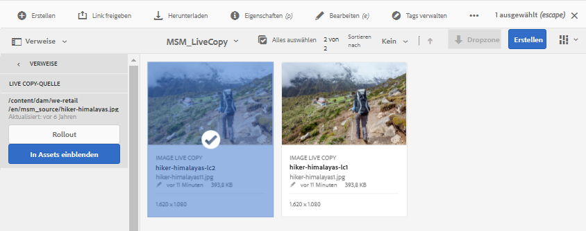

*Abbildung: Aktionen, die in der Leiste &quot;Referenzen&quot;für die ausgewählte Live-Kopie verfügbar sind.*

## Übertragen von Änderungen von der Quelle an Live Copies    {#rolloutsync}

Nach der Bearbeitung einer Quelle können die Änderungen entweder mithilfe einer Aktion „Synchronisieren“ oder „Rollout“ an die Live Copies übertragen werden. Informationen zu den Unterschieden zwischen beiden Aktionen finden Sie im [Glossar](#glossary).

### Aktion „Rollout“ {#rollout}

Sie können eine Aktion „Rollout“ über das Quell-Asset initiieren und alle oder einige ausgewählte Live Copies aktualisieren.

1. Wählen Sie ein Live Copy-Asset oder einen Ordner aus. Klicken Sie in der Symbolleiste auf **[!UICONTROL Eigenschaften]**. Sie können auch den Tastaturbefehl `p` verwenden.
1. Klicken Sie auf **[!UICONTROL Live Copy-Quelle]**. Klicken Sie oben in der Symbolleiste auf **[!UICONTROL Rollout]**.
1. Wählen Sie die zu aktualisierenden Live Copies aus. Klicken Sie auf **[!UICONTROL Rollout]**. Um ein Rollout der an den untergeordneten Assets vorgenommenen Aktualisierungen durchzuführen, wählen Sie **[!UICONTROL Rollout von Quelle und allen untergeordneten Elementen]** aus.

   

   *Abbildung: Führen Sie die Änderungen der Quelle auf einige oder alle Live-Kopien aus.*

>[!NOTE]
>
>Änderungen an einem Quell-Asset werden nur den Live Copies mit einem direkten Verweis bereitgestellt. Wenn eine Live Copy von einer anderen Live Copy abgeleitet wird, werden die Änderungen nicht der abgeleiteten Live Copy bereitgestellt.

Sie können eine Aktion „Rollout“ auch über die Leiste „Verweise“ initiieren, nachdem Sie eine bestimmte Live Copy ausgewählt haben. Weitere Informationen finden Sie unter [Schnellaktionen in der Leiste „Verweise“ für Live Copies](#ref-rail-lc). Bei dieser Rollout-Methode werden nur die ausgewählte Live Copy und optional deren untergeordnete Elemente aktualisiert.

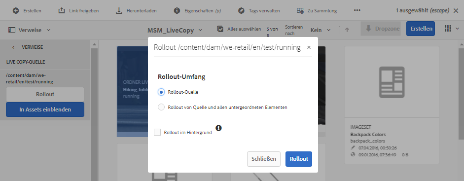

*Abbildung: Führen Sie die Änderungen der Quelle auf die ausgewählte Live-Kopie aus.*

### Wissenswertes über die Aktion „Synchronisieren“ {#about-sync}

Durch eine Aktion „Synchronisieren“ werden die Änderungen einer Quelle nur an die ausgewählte Live Copy übertragen. Die Aktion „Synchronisieren“ respektiert und bewahrt die lokalen Änderungen, die nach dem Abbrechen der Vererbung vorgenommen wurden. Die lokalen Änderungen werden nicht überschrieben und die abgebrochene Vererbung wird nicht wiederhergestellt. Sie haben drei Möglichkeiten, um eine Aktion „Synchronisieren“ zu initiieren.

| Wohin in der [!DNL Experience Manager]-Schnittstelle | Zeitpunkt und Grund für die Verwendung | Verwendung |
|---|---|---|
| [!UICONTROL Leiste „Verweise“] | Schnelles Synchronisieren bei bereits ausgewählter Quelle | Siehe [Schnellaktionen in der Leiste „Verweise“ für Quellen](#refrailsource) |
| Symbolleiste auf der Seite [!UICONTROL Eigenschaften] | Initiieren von Synchronisationen bei bereits öffneten Live Copy-Eigenschaften | Siehe [Synchronisieren von Live Copies](#sync-lc) |
| [!UICONTROL Konsole „Live Copy-Übersicht“] | Synchronisieren Sie schnell mehrere Assets (nicht unbedingt alle), wenn der Quellordner ausgewählt ist oder die Konsole [!UICONTROL Übersicht über die Live-Kopie] bereits geöffnet ist. Initiieren der Aktion „Synchronisieren“ für jeweils ein Asset, aber eine schnellere Methode, um mehrere Assets auf einmal zu synchronisieren | Siehe [Aktionen für viele Assets in einem Live Copy-Ordner](#bulk-actions) |

### Synchronisieren von Live Copies    {#sync-lc}

Um eine Aktion „Synchronisieren“ zu starten, öffnen Sie die Seite **[!UICONTROL Eigenschaften]** einer Live Copy, klicken Sie auf **[!UICONTROL Live Copy]** und dann auf die gewünschte Aktion in der Symbolleiste.

Anweisungen zum Anzeigen von Status und Informationen zu einer Aktion „Synchronisieren“ finden Sie unter [Informationen und Status von Live Copies](#statuslcasset) sowie [Informationen und Status aller Live Copies eines Ordners](#status-lc-folder).

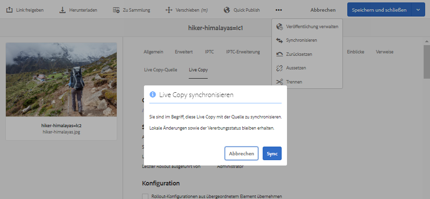

*Abbildung: Die Synchronisierungsaktion zieht die an der Quelle vorgenommenen Änderungen ab.*

>[!NOTE]
>
>Wenn die Beziehung ausgesetzt ist, ist die Aktion „Synchronisieren“ in der Symbolleiste nicht verfügbar. Ist die Aktion „Synchronisieren“ in der Leiste „Verweise“ verfügbar, werden die Änderungen auch bei erfolgreichem Rollout nicht übertragen.

## Aussetzen und Fortsetzen der Beziehung {#suspend-resume}

Sie können die Beziehung vorübergehend aussetzen, um zu verhindern, dass eine Live Copy am Quell-Asset oder -ordner vorgenommene Änderungen erhält. Die Beziehung kann für die Live Copy auch fortgesetzt werden, um Änderungen von der Quelle zu erhalten.

Zum Aussetzen oder Fortsetzen öffnen Sie die Seite **[!UICONTROL Eigenschaften]** einer Live Copy, klicken Sie auf **[!UICONTROL Live Copy]** und dann auf die gewünschte Aktion in der Symbolleiste.

Beziehungen von mehreren Assets in einem Live Copy-Ordner können auch schnell über die Konsole **[!UICONTROL Live Copy-Übersicht]** ausgesetzt oder fortgesetzt werden. Siehe [Ausführen von Aktionen für viele Assets in einem Live Copy-Ordner](#bulk-actions).

## Lokales Ändern von Live Copies {#local-mods}

Eine Live Copy ist eine Replikation der ursprünglichen Quelle zum Zeitpunkt ihrer Erstellung. Die Metadatenwerte einer Live Copy werden von der Quelle übernommen. Die Metadatenfelder halten einzeln die Vererbung mit den entsprechenden Feldern des Quell-Assets aufrecht.

Sie haben jedoch die Flexibilität, lokale Änderungen an einer Live Copy vorzunehmen, um einige ausgewählte Eigenschaften zu ändern. Um lokale Änderungen vorzunehmen, brechen Sie die Vererbung der gewünschten Eigenschaft ab. Wenn die Vererbung von mindestens einem Metadatenfeld abgebrochen wird, werden Live-Beziehung des Assets und Vererbung der anderen Metadatenfelder beibehalten. Bei einer Synchronisierung oder einem Rollout werden die lokalen Änderungen nicht überschrieben. Öffnen Sie dazu die Seite **[!UICONTROL Eigenschaften]** eines Live Copy-Assets und klicken Sie auf die Option **[!UICONTROL Vererbung abbrechen]** neben einem Metadatenfeld.

Sie können alle lokalen Änderungen rückgängig machen und das Asset auf den Status seiner Quelle zurücksetzen. Setzen Sie die Aktion unwiderruflich zurück, überschreiben Sie sofort alle lokalen Änderungen und stellen Sie die Vererbung bei allen Metadatenfeldern wieder her. Zwecks Wiederherstellung klicken Sie auf der Seite **[!UICONTROL Eigenschaften]** eines Live Copy-Assets in der Symbolleiste auf **[!UICONTROL Zurücksetzen]**.

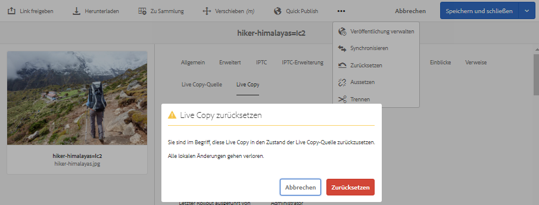

*Abbildung: Aktion zurücksetzen überschreibt lokale Bearbeitungen und bringt die Live-Kopie zum Teil mit der Quelle.*

## Entfernen von Live-Beziehungen    {#detach}

Sie können die Beziehung zwischen Quelle und Live Copy mit der Aktion „Trennen“ vollständig entfernen. Nach dem Trennen wird die Live Copy zu einem eigenständigen Asset oder Ordner. Er wird unmittelbar nach dem Entfernen als neues Asset in der [!DNL Experience Manager]-Schnittstelle angezeigt. Führen Sie die folgenden Schritte aus, um eine Live Copy von ihrer Quelle zu trennen.

1. Wählen Sie ein Live Copy-Asset oder einen Ordner aus. Klicken Sie in der Symbolleiste auf **[!UICONTROL Eigenschaften]**. Sie können auch den Tastaturbefehl `p` verwenden.

1. Klicken Sie auf **[!UICONTROL Live Copy]**. Klicken Sie in der Symbolleiste auf **[!UICONTROL Trennen]**. Klicken Sie im angezeigten Dialogfeld auf **[!UICONTROL Trennen]**.

   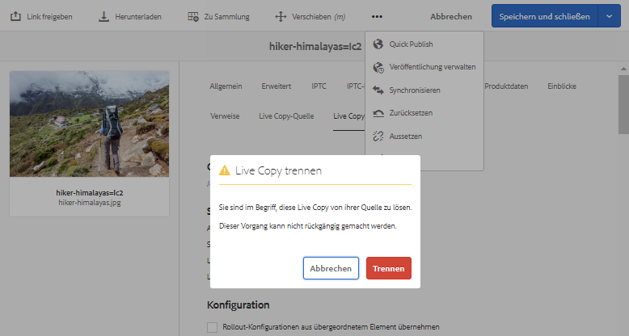

   *Abbildung: Die Aktion &quot;Abtrennen&quot;entfernt die Beziehung zwischen Quelle und Live Copy vollständig.*

   >[!CAUTION]
   >
   >Die Beziehung wird entfernt, sobald Sie im Dialogfeld auf **[!UICONTROL Trennen]** klicken. Sie können diesen Vorgang nicht rückgängig machen, indem Sie auf der Seite „Eigenschaften“ auf **[!UICONTROL Abbrechen]** klicken.

Mehrere Assets in einem Live Copy-Ordner können auch schnell über die Konsole **[!UICONTROL Live Copy-Übersicht]** getrennt werden. Siehe [Ausführen von Aktionen für viele Assets in einem Live Copy-Ordner](#bulk-actions).

## Massenaktionen in einem Live Copy-Ordner {#bulk-actions}

Wenn mehrere Assets in einem Live Copy-Ordner vorhanden sind, kann das Initiieren von Aktionen für jedes Asset mühsam sein. Sie können die grundlegenden Aktionen für viele Assets schnell von [!UICONTROL Live Copy Console] aus starten. Die oben genannten Methoden können nach wie vor für einzelne Assets verwendet werden.

1. Wählen Sie einen Quellordner aus. Klicken Sie in der Symbolleiste auf **[!UICONTROL Eigenschaften]**. Sie können auch den Tastaturbefehl `p` verwenden.
1. Klicken Sie auf **[!UICONTROL Live Copy-Quelle]**. Klicken Sie auf **[!UICONTROL Live Copy-Übersicht]**, um die Konsole zu öffnen.
1. Wählen Sie in diesem Dashboard ein Live Copy-Asset aus einem Live Copy-Ordner aus. Klicken Sie in der Symbolleiste auf die gewünschten Aktionen. Die verfügbaren Aktionen sind **[!UICONTROL Synchronisieren]**, **[!UICONTROL Zurücksetzen]**, **[!UICONTROL Aussetzen]** und **[!UICONTROL Lösen]**. Sie können diese Aktionen schnell für beliebige Assets in einer beliebigen Anzahl von Live Copy-Ordnern starten, die sich in einer Live-Beziehung mit dem ausgewählten Quellordner befinden.

   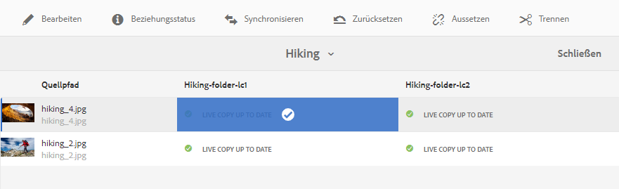

   *Abbildung: Aktualisieren Sie mühelos viele Assets in Live Copy-Ordnern in der  [!UICONTROL Live Copy ] Overviewkonsole.*

## Erweitern von MSM für [!DNL Assets] {#extend-api}

[!DNL Experience Manager] ermöglicht es, die Funktionalität mithilfe der MSM-Java-APIs zu erweitern. Bei [!DNL Assets] funktioniert die Erweiterung genauso wie bei MSM für [!DNL Sites]. Weitere Details finden Sie unter [Erweitern von MSM](/help/sites-developing/extending-msm.md) sowie Informationen zu bestimmten Aufgaben in den folgenden Abschnitten:

* [Übersicht über APIs](/help/sites-developing/extending-msm.md#overview-of-the-java-api)
* [Erstellen einer Synchronisierungsaktion](/help/sites-developing/extending-msm.md#creating-a-new-synchronization-action)
* [Erstellen einer Rollout-Konfiguration](/help/sites-developing/extending-msm.md#creating-a-new-rollout-configuration)
* [Erstellen und Verwenden einer einfachen LiveActionFactory-Klasse](/help/sites-developing/extending-msm.md#creating-and-using-a-simple-liveactionfactory-class)

>[!NOTE]
>
>* Blueprint in MSM für [!DNL Sites] heißt Live Copy-Quelle in MSM für [!DNL Assets].
>* Das Entfernen des Kapitelschritts im Assistenten zum Erstellen einer Site wird in MSM für [!DNL Assets] nicht unterstützt.
>* Das Konfigurieren von MSM-Sperren in den Seiteneigenschaften (Touch-enabled UI) wird in MSM für [!DNL Assets] nicht unterstützt.

## Auswirkungen von Asset-Management-Aufgaben auf Live Copies {#manage-assets}

Live Copies und Quellen sind Assets oder Ordner, die in gewissem Umfang als digitale Assets verwaltet werden können. Einige Asset-Management-Aufgaben in [!DNL Experience Manager] wirken sich besonders auf die Live-Kopien aus.

* Beim Kopieren einer Live Copy wird ein Live Copy-Asset mit derselben Quelle wie bei der ersten Live Copy erstellt.
* Wenn Sie eine Quelle oder eine Live Copy verschieben, wird die Live-Beziehung beibehalten.
* Die Aktion „Bearbeiten“ funktioniert nicht bei Live Copy-Assets. Wenn die Quelle einer Live Copy selbst eine Live Copy ist, kann die Aktion „Bearbeiten“ für diese nicht eingesetzt werden.
* Die Aktion „Checkout“ ist nicht für Live Copy-Assets verfügbar.
* Für Quellordner ist die Option zum Erstellen von Prüfungsaufgaben verfügbar.
* Beim Anzeigen der Asset-Liste in der Listen- und Spaltenansicht sind Live Copy-Assets oder -Ordner mit „Live Copy“ gekennzeichnet. Damit können Sie Live-Kopien in einem Ordner leicht identifizieren.

## Vergleichen Sie MSM für [!DNL Assets] und [!DNL Sites] {#comparison}

In mehr Szenarien entspricht MSM für [!DNL Assets] dem Verhalten der MSM für Sites-Funktionalität. Einige wichtige Unterschiede lauten wie folgt:

* Blueprint in MSM für [!DNL Sites] heißt Live Copy-Quelle in MSM für [!DNL Assets].
* Unter &quot;Sites&quot;können Sie einen Blueprint mit seiner Live-Kopie vergleichen, aber unter [!DNL Assets] ist es nicht möglich, eine Quelle mit ihrer Live-Kopie zu vergleichen.
* Sie können eine Live-Kopie nicht in [!DNL Assets] bearbeiten.
* Sites haben normalerweise untergeordnete Seiten, [!DNL Assets] nicht. Die Option zum Ein- oder Ausschließen von untergeordneten Elementen ist beim Erstellen von Live Copies einzelner Assets nicht vorhanden.
* Das Entfernen des Kapitelschritts im Assistenten zum Erstellen einer Site wird in MSM für [!DNL Assets] nicht unterstützt.
* Das Konfigurieren von MSM-Sperren für Seiteneigenschaften (Touch-enabled UI) wird in MSM für [!DNL Assets] nicht unterstützt.
* Verwenden Sie für MSM für [!DNL Assets] nur die **[!UICONTROL Standard-Rollout-Konfiguration]**. Die anderen Rollout-Konfigurationen sind für MSM für [!DNL Assets] nicht verfügbar.

## Best Practices {#best-practices}

Zu Best Practices für MSM gehören:

* Planen Sie die Beziehungen zwischen über- und untergeordneten Assets und Inhaltsflüssen, bevor Sie mit der Implementierung beginnen.

## Beschränkungen und bekannte Probleme bei MSM für [!DNL Assets] {#limitations}

Folgende Beschränkung besteht für MSM für [!DNL Assets].

* Inhaltsfragmente werden für das Nutzungsszenario nicht unterstützt. Wenn Sie versuchen, deren Live Copies zu erstellen, werden die Inhaltsfragmente wie vorliegend und ohne Beziehung kopiert. Die kopierten CFs sind ein Schnappschuss in der Zeit und werden nicht aktualisiert, wenn die ursprünglichen CFs aktualisiert werden.

* MSM funktioniert nicht mit aktiviertem Metadaten-Schreibback. Beim Zurückschreiben bricht das Erbe.
