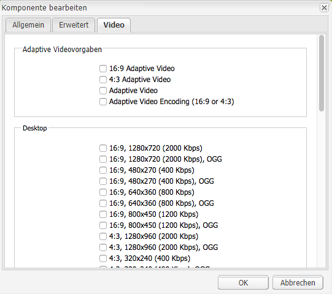
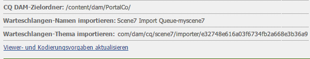
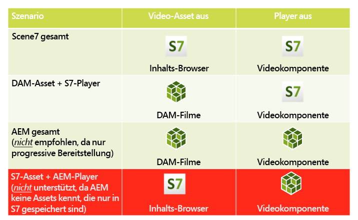
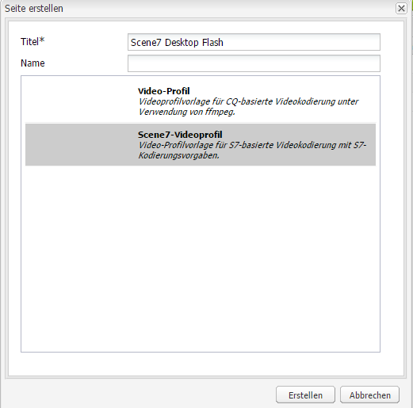
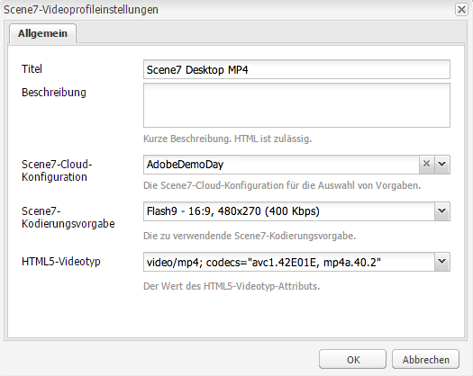

# Video {#video}

Assets bietet eine zentralisierte Video-Asset-Verwaltung, mit der Sie Videos direkt in Assets hochladen können, um sie automatisch in Dynamic Media Classic zu kodieren, und über Assets direkt auf Dynamic Media Classic-Videos zugreifen können, um sie für die Seitenbearbeitung zu erstellen.

Die Dynamic Media Classic-Videointegration erweitert die Reichweite optimierter Videos auf alle Bildschirme (automatische Geräte- und Bandbreitenerkennung).

* Die Komponente **[!UICONTROL Scene7 Video]** führt automatisch eine Geräte- und Bandbreitenerkennung durch, um auf Desktop-, Tablet- und Mobilgeräten das richtige Format und die richtige Qualität für Videos wiederzugeben.
* Assets – Sie können adaptive Videosets statt einzelner Video-Assets verwenden. Ein adaptives Videoset ist ein Container für alle Videoausgabeformate, die zur nahtlosen Wiedergabe von Videos auf verschiedenen Bildschirmen erforderlich sind. Es umfasst Versionen desselben Videos, die mit unterschiedlichen Bitraten und Formaten kodiert wurden, wie 400 kBit/s, 800 kBit/s und 1000 kBit/s. Ein adaptives Videoset wird zusammen mit der S7-Videokomponente für adaptives Videostreaming auf mehreren Bildschirmen verwendet, einschließlich Desktopgeräten und iOS-, Android-, Blackberry- und Windows-Mobilgeräten.
<!-- See [Scene7 documentation about adaptive video sets for more information](https://help.adobe.com/en_US/scene7/using/WS53492AE1-6029-45d8-BF80-F4B5CF33EB08.html). -->

## Über FFMPEG und Dynamic Media Classic {#about-ffmpeg-and-scene}

Die Grundlage des standardmäßigen Videokodierungsprozesses ist die Verwendung der FFMPEG-basierten Integration mit Videoprofilen. Aus diesem Grund enthält der Standard-Aufnahme-Workflow von DAM die folgenden ffmpeg-basierten Workflow-Schritte:

* FFMPEG-Miniaturen
* FFMPEG-Kodierung

Beachten Sie, dass durch die Aktivierung und Konfiguration der Dynamic Media Classic-Integration diese beiden Workflow-Schritte nicht automatisch aus dem vordefinierten Workflow zur DAM-Erfassung entfernt oder deaktiviert werden. Wenn Sie die FFMPEG-basierte Videokodierung in AEM bereits nutzen, ist es wahrscheinlich, dass FFMPEG in Ihren Erstellungsumgebungen bereits installiert ist. In diesem Fall wird ein neues Video, das mit DAM erfasst wird, zweimal kodiert: einmal vom FFMPEG-Kodierer und einmal von der Dynamic Media Classic-Integration.

Wenn Sie die FFMPEG-basierte Videokodierung in AEM konfiguriert und FFMPEG installiert haben, empfiehlt Adobe, die beiden FFMPEG-Workflows aus Ihren DAM-Aufnahme-Workflows zu entfernen.

## Unterstützte Formate {#supported-formats}

Die folgenden Formate werden für die Scene7-Videokomponente unterstützt:

* F4V H.264
* H.264 (.mp4)

## Festlegen eines Speicherorts für hochgeladene Videos {#deciding-where-to-upload-your-video}

Der Speicherort für hochgeladene Videos hängt von folgenden Faktoren ab:

* Benötigen Sie für das Video-Asset einen Workflow?
* Benötigen Sie für das Video-Asset eine Versionskontrolle?

Falls Sie eine der Fragen mit „ja“ beantworten können, laden Sie Ihr Video direkt in Adobe DAM hoch. Wenn die Antwort auf beide Fragen &quot;Nein&quot;lautet, laden Sie Ihr Video direkt in Dynamic Media Classic hoch. Der Workflow für die einzelnen Szenarien wird im folgenden Abschnitt beschrieben.

### Wenn Sie Ihr Video direkt in Adobe DAM hochladen  {#if-you-are-uploading-your-video-directly-to-adobe-dam}

Wenn Sie einen Workflow oder eine Versionierung für Ihre Assets benötigen, sollten Sie sie zuerst in Adobe DAM hochladen. Der folgende Workflow wird empfohlen:

1. Laden Sie das Video-Asset in Adobe DAM hoch und kodieren und veröffentlichen Sie es automatisch in Dynamic Media Classic.
1. Öffnen Sie AEM und greifen Sie in WCM auf der Registerkarte **[!UICONTROL Filme]** des Content Finders auf Video-Assets zu.
1. Autor mit der Komponente **[!UICONTROL Scene7-Video]** oder **[!UICONTROL Foundation-Video]** .

### Wenn Sie Ihr Video in Dynamic Media Classic hochladen {#if-you-are-uploading-your-video-to-scene}

Wenn Sie keinen Workflow und keine Versionierung für Ihre Assets benötigen, sollten Sie sie in Scene7 hochladen. Der folgende Workflow wird empfohlen:

1. Richten Sie in Dynamic Media Classic [einen geplanten FTP-Upload und eine geplante Kodierung auf Scene7 (systemautomatisiert)](https://experienceleague.adobe.com/docs/dynamic-media-classic/using/upload-publish/uploading-files.html#upload-files-using-via-ftp) ein.
1. Öffnen Sie AEM und greifen Sie in WCM auf der Registerkarte **[!UICONTROL Scene7]** des Content Finders auf Video-Assets zu.
1. Erstellen Sie mit der Komponente **[!UICONTROL Scene7 Video]** .

## Konfigurieren der Integration mit Scene7-Videos {#configuring-integration-with-scene-video}

So konfigurieren Sie universelle Vorlagen:

1. Navigieren Sie in **[!UICONTROL Cloud-Services]** zu Ihrer **[!UICONTROL Scene7]**-Konfiguration und klicken Sie auf **[!UICONTROL Bearbeiten.]**
1. Wählen Sie die Registerkarte **[!UICONTROL Video]** aus.

   

   >[!NOTE]
   >
   >Die Registerkarte **[!UICONTROL Video]** wird nicht angezeigt, wenn die Seite keine Cloud-Konfiguration hat.

1. Wählen Sie das Profil für adaptive Videokodierung, ein Standardprofil für die Kodierung einzelner Videos, oder ein benutzerdefiniertes Videokodierungsprofil aus.

   >[!NOTE]
   >
   >Weitere Informationen dazu, was die Videovorgaben bedeuten, finden Sie in der [Dynamic Media Classic-Dokumentation](https://experienceleague.adobe.com/docs/dynamic-media-classic/using/setup/application-setup.html#video-presets-for-encoding-video-files).
   >
   >Adobe empfiehlt, entweder beide adaptive Videosets bei der Konfiguration der universellen Vorlagen oder die Option **[!UICONTROL Adaptive Videokodierung]** auszuwählen.

1. Die ausgewählten Kodierungsprofile werden automatisch auf alle Videos angewendet, die in den CQ DAM-Zielordner, den Sie für diese Scene7-Cloud-Konfiguration einrichten, hochgeladen werden. Sie können mehrere Scene7-Cloud-Konfigurationen mit verschiedenen Zielordnern einrichten, um nach Bedarf verschiedene Kodierungsprofile anzuwenden.

## Aktualisieren von Viewer- und Kodierungsvorlagen  {#updating-viewer-and-encoding-presets}

Wenn Sie in AEM die Viewer- und Kodierungsvorlagen für Videos aktualisieren müssen, da die Vorlagen in Scene7 aktualisiert wurden, navigieren Sie zur Scene7-Konfiguration in der Cloud-Konfiguration und klicken Sie auf **[!UICONTROL Aktualisieren der Viewer- und Kodierungsvorlagen.]**

## Hochladen des Primärvideos von Adobe DAM {#uploading-your-master-video} in Scene7

1. Navigieren Sie zum CQ DAM-Zielordner, in dem Sie Ihre Cloud-Konfiguration mit Scene7-Kodierungsprofilen eingerichtet haben.
1. Klicken Sie auf **[!UICONTROL Upload]** , um das Primärvideo hochzuladen. Das Hochladen und die Kodierung von Videos sind abgeschlossen, nachdem der Workflow [!UICONTROL DAM-Update-Asset] abgeschlossen ist und **[!UICONTROL In Scene7 veröffentlichen]** ein Häkchen aufweist.

   >[!NOTE]
   >
   >Es kann etwas Zeit in Anspruch nehmen, bis die Videominiaturen erstellt wurden.

   Wenn Sie das DAM-Primärvideo auf die Videokomponente ziehen, wird auf *alle* der Scene7-kodierten Proxy-Ausgabeformate für die Bereitstellung zugegriffen.

## Foundation-Videokomponente im Vergleich zur Scene7-Videokomponente {#foundation-video-component-versus-scene-video-component}

Wenn Sie AEM nutzen, haben Sie auf die Videokomponente, die in Websites verfügbar ist, und auf die Scene7-Videokomponente Zugriff. Diese Komponenten sind nicht austauschbar.

Die Scene7-Videokomponente funktioniert nur für Scene7-Videos. Die Foundation-Komponente funktioniert mit Videos, die in AEM (mit ffmpeg) gespeichert wurden, und Scene7-Videos.

Die folgende Matrix verdeutlicht, wann Sie welche Komponente nutzen sollten:

>[!NOTE]
>
>Die S7-Videokomponente verwendet standardmäßig das universelle Videoprofil. Sie können jedoch den HTML5-basierten Videoplayer für die Verwendung durch AEM abrufen, indem Sie in Scene7 einen der folgenden Schritte ausführen: Kopieren Sie den Einbettungscode des vordefinierten HTML5-Videoplayers und fügen Sie ihn in Ihre AEM ein.

## AEM-Videokomponente {#aem-video-component}

Es wird zwar empfohlen, zum Abspielen von Scene7-Videos die Scene7-Videokomponente zu verwenden, in diesem Abschnitt wird der Vollständigkeit halber aber trotzdem beschrieben, wie Sie Scene7-Videos in AEM mit der Foundation-Videokomponente verwenden.

### Ein Vergleich der AEM-Videokomponente und der Scene7-Videokomponente  {#aem-video-and-scene-video-comparison}

In der folgenden Tabelle finden Sie einen Vergleich der unterstützen Funktionen der AEM-Foundation-Videokomponente und der Scene7-Videokomponente:

|  | AEM Foundation Video | Scene7 Video |
|---|---|---|
| Ansatz | HTML5 hat Priorität. Flash dient nur zum Ausweichen bei Nicht-HTML5-Inhalten. | Flash auf den meisten Desktopgeräten HTML5 kommt auf Mobilgeräten und Tablets zum Einsatz. |
| Bereitstellung | Progressiv | Adaptives Streaming |
| Nachverfolgung | Ja | Ja |
| Erweiterbarkeit | Ja | Nein |
| Mobile Videos | Ja | Ja |

### Einrichtung  {#setting-up}

#### Erstellen von Videoprofilen {#creating-video-profiles}

Die verschiedenen Videokodierungsmethoden werden anhand der S7-Kodierungsvorlagen erstellt, die in der S7-Cloud-Konfiguration ausgewählt werden. Damit sie von der Foundation-Videokomponente genutzt werden, muss für jede ausgewählte S7-Kodierungsvorlage ein Videoprofil erstellt werden. Damit kann die Videokomponente die DAM-Ausgabeformate entsprechend auswählen.

>[!NOTE]
>
>Neue Videoprofile und Änderungen daran müssen für eine Veröffentlichung aktiviert werden.

1. Tippen Sie AEM auf **[!UICONTROL Tools] > [!UICONTROL Konfigurationskonsole]**.
1. Navigieren Sie in der **[!UICONTROL Konfigurationskonsole]** in der Navigationsstruktur zu **[!UICONTROL Tools > DAM > Videoprofile]** .
1. Erstellen Sie ein neues S7-Videoprofil. Im **[!UICONTROL Neu..]** wählen Sie im Menü **[!UICONTROL Seite erstellen]** aus und wählen Sie dann die Scene7-Videoprofilvorlage aus. Geben Sie der neuen Videoprofilseite einen Namen und klicken Sie auf **[!UICONTROL Erstellen.]**

   

1. Bearbeiten Sie das neue Videoprofil. Wählen Sie zuerst die Cloud-Konfiguration aus. Wählen Sie anschließend dieselbe Kodierungsvorlage aus, die Sie bereits in der Cloud-Konfiguration ausgewählt haben.

   

   | Eigenschaft | Beschreibung |
   |---|---|
   | Scene7-Cloud-Konfiguration | Die Cloud-Konfiguration, die für die Kodierungsvorlagen verwendet werden soll |
   | Scene7-Kodierungsvorlage | Die Kodierungsvorlage, die diesem Videoprofil zugeordnet werden soll |
   | HTML5-Videotyp | Diese Eigenschaft ermöglicht, den Wert der Typeigenschaft des HTML5-Videoquellelements festzulegen. Diese Information wird nicht von den S7-Kodierungsvorlagen bereitgestellt, sie ist jedoch erforderlich, um die Videos anhand des HTML5-Videoelements richtig zu rendern. Eine Liste für gängige Formate wird bereitgestellt, kann jedoch für andere Formate überschrieben werden. |

   Wiederholen Sie diesen Schritt für alle in der Cloud-Konfiguration ausgewählten Kodierungsvorlagen, die Sie in der Videokomponente verwenden möchten.

#### Konfigurieren des Designs {#configuring-design}

Die Komponente **[!UICONTROL Foundation-Video]** muss wissen, welche Videoprofile zum Erstellen der Videoquellenliste verwendet werden sollen. Sie müssen das Dialogfeld &quot;Design&quot;der Videokomponenten öffnen und das Komponentendesign für die Verwendung der neuen Videoprofile konfigurieren.

>[!NOTE]
>
>Wenn Sie die Komponente **[!UICONTROL Foundation-Video]** auf einer mobilen Seite verwenden, müssen Sie diese Schritte möglicherweise beim Design der mobilen Seite wiederholen.

>[!NOTE]
>
>Bei Änderungen am Design ist eine Aktivierung des Designs erforderlich, damit sie für die Veröffentlichung übernommen wird.

1. Öffnen Sie das Dialogfeld &quot;Design&quot;der Komponente **[!UICONTROL Foundation-Video]** und wechseln Sie zur Registerkarte **[!UICONTROL Profile]** . Löschen Sie dann die nativen Profile und fügen Sie die neuen S7-Videoprofile hinzu. Die Reihenfolge der Profilliste im Dialogfeld &quot;Design&quot;definiert die Reihenfolge des Videoquellenelements beim Rendern.
1. Bei Browsern, die HTML5 nicht unterstützen, ermöglicht die Videokomponente die Konfiguration eines Flash-Fallback. Öffnen Sie das Dialogfeld &quot;Design&quot;der Videokomponenten und wechseln Sie zur Registerkarte **[!UICONTROL Flash]** . Konfigurieren Sie die Flash-Player-Einstellungen und weisen Sie dem Flash-Player ein Fallback-Profil zu.

#### Checkliste {#checklist}

1. Erstellen Sie eine S7-Cloud-Konfiguration. Vergewissern Sie sich, dass die Videokodierungsvorlagen festgelegt sind und das Importprogramm ausgeführt wird.
1. Erstellen Sie ein S7-Videoprofil für jede in der Cloud-Konfiguration ausgewählte Videokodierungsvorlage.
1. Die Videoprofile müssen aktiviert sein.
1. Konfigurieren Sie das Design der Komponente **[!UICONTROL Hintergrund-Video]** auf Ihrer Seite.
1. Aktivieren Sie das Design, nachdem Sie mit Ihren Designänderungen fertig sind.
