# Hinzufügen von Dynamic Media Classic-Funktionen zu Ihrer Seite {#adding-scene-features-to-your-page}

[Adobe Dynamic Media ](https://help.adobe.com/en_US/scene7/using/WS26AB0D9A-F51C-464e-88C8-580A5A82F810.html) Classic ist eine gehostete Lösung für die Verwaltung, Erweiterung, Veröffentlichung und Bereitstellung von Rich-Media-Assets für Web-, Mobile-, E-Mail- und Internet-verbundene Anzeigen und Drucken.

Sie können AEM Assets anzeigen, die in Dynamic Media Classic in verschiedenen Viewern veröffentlicht wurden:

* Zoom
* Flyout
* Video
* Bildvorlage
* Bild

Sie können digitale Assets direkt aus AEM in Dynamic Media Classic veröffentlichen und digitale Assets aus Dynamic Media Classic in AEM veröffentlichen.

In diesem Dokument wird beschrieben, wie Sie digitale Assets von AEM in Dynamic Media Classic veröffentlichen und umgekehrt. Die Viewer werden auch detailliert beschrieben. Informationen zum Konfigurieren von AEM für Dynamic Media Classic finden Sie unter [Integrieren von Dynamic Media Classic mit AEM](/help/sites-administering/scene7.md).

Siehe auch [Hinzufügen von Imagemaps](image-maps.md).

Weitere Informationen über die Arbeit mit Videokomponenten mit AEM finden Sie unter [Video](video.md).

>[!NOTE]
>
>Wenn Dynamic Media Classic-Assets nicht ordnungsgemäß angezeigt werden, stellen Sie sicher, dass Dynamic Media [disabled](config-dynamic.md#disabling-dynamic-media) ist, und aktualisieren Sie dann die Seite.

## Manuelles Veröffentlichen von Assets in Dynamic Media Classic {#manually-publishing-to-scene-from-assets}

Sie können digitale Assets wie folgt in Dynamic Media Classic veröffentlichen:

* [In der Assets-Konsole, klassische Benutzeroberfläche ](/help/sites-classic-ui-authoring/manage-assets-classic-s7.md#publishing-from-the-assets-console)
* [Von einem Asset, klassische Benutzeroberfläche ](/help/sites-classic-ui-authoring/manage-assets-classic-s7.md#publishing-from-an-asset)
* [In der klassischen Benutzeroberfläche von außerhalb des Ordners CQ Target](/help/sites-classic-ui-authoring/manage-assets-classic-s7.md#publishing-assets-from-outside-the-cq-target-folder)

>[!NOTE]
>
>AEM veröffentlicht asynchron in Dynamic Media Classic. Wenn Sie auf **[!UICONTROL Publish]** klicken, kann es mehrere Sekunden dauern, bis Ihr Asset in Dynamic Media Classic veröffentlicht wird.

## Dynamic Media Classic-Komponenten {#scene-components}

Die folgenden Dynamic Media Classic-Komponenten sind in AEM verfügbar:

* Zoom
* Flyout (Zoom)
* Bildvorlage
* Bild
* Video

>[!NOTE]
>
>Diese Komponenten sind standardmäßig nicht verfügbar und müssen vor der Verwendung im Modus **[!UICONTROL Design]** ausgewählt werden.

Nachdem sie im Modus **[!UICONTROL Design]** verfügbar gemacht wurden, können Sie die Komponenten wie jede andere AEM Ihrer Seite hinzufügen. Assets, die noch nicht in Dynamic Media Classic veröffentlicht wurden, werden in Dynamic Media Classic veröffentlicht, wenn sie sich in einem synchronisierten Ordner, auf einer Seite oder mit einer Dynamic Media Classic-Cloud-Konfiguration befinden.

>[!NOTE]
>
>Wenn Sie benutzerdefinierte Viewer erstellen und entwickeln und die Inhaltssuche verwenden, müssen Sie den Parameter **[!UICONTROL allowfullscreen]** explizit hinzufügen.

### Hinweis zur Einstellung von Flash-Viewer {#flash-viewers-end-of-life-notice}

Mit Wirkung vom 31. Januar 2017 hat Adobe Dynamic Media Classic die Unterstützung für die Flash-Viewer-Plattform eingestellt.

Weitere Informationen zu dieser wichtigen Änderung finden Sie unter [Fragen und Antworten zum Lebenszyklusende von Flash Viewer](https://docs.adobe.com/content/docs/en/aem/6-1/administer/integration/marketing-cloud/scene7/flash-eol.html).

### Hinzufügen einer Dynamic Media Classic-Komponente (Scene7) zu einer Seite {#adding-a-scene-component-to-a-page}

Das Hinzufügen einer Dynamic Media Classic (Scene7)-Komponente zu einer Seite entspricht dem Hinzufügen einer Komponente zu einer beliebigen Seite. Dynamic Media Classic-Komponenten werden in den folgenden Abschnitten ausführlich beschrieben.

**So fügen Sie einer Seite eine Dynamic Media Classic (Scene7)-Komponente hinzu**

1. Öffnen Sie in AEM die Seite, auf der Sie die Dynamic Media Classic (Scene7)-Komponente hinzufügen möchten.

1. Wenn keine Dynamic Media Classic-Komponenten verfügbar sind, klicken Sie auf den Modus **[!UICONTROL Design]**, tippen Sie auf eine beliebige Komponente mit blauem Rahmen, tippen Sie auf das Symbol **[!UICONTROL Übergeordnetes Element]** und dann auf das Symbol **[!UICONTROL Konfiguration]**. Wählen Sie unter **[!UICONTROL Parsys (Design)]** alle Dynamic Media Classic-Komponenten aus, um sie verfügbar zu machen, und klicken Sie auf **[!UICONTROL OK]**.

   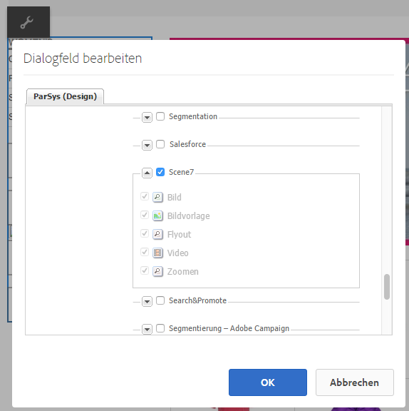

1. Klicken Sie auf **[!UICONTROL Bearbeiten]** , um zum Modus **[!UICONTROL Bearbeiten]** zurückzukehren.

1. Ziehen Sie eine Komponente aus der Gruppe Dynamic Media Classic im Sidekick auf die Seite an der gewünschten Position.

1. Klicken Sie auf das Symbol **[!UICONTROL Konfiguration]** , um die Komponente zu öffnen.

1. Bearbeiten Sie die Komponente bei Bedarf und klicken Sie auf **[!UICONTROL OK]**, um die Änderungen zu speichern.
1. Ziehen Sie Ihr Bild oder Video aus dem Inhaltsbrowser auf die Dynamic Media Classic-Komponente, die Sie der Seite hinzugefügt haben.

   >[!NOTE]
   >
   >Nur in der Touch-Benutzeroberfläche müssen Sie das Bild oder Video auf die Dynamic Media Classic-Komponente ziehen, die Sie auf der Seite platziert haben. Die Auswahl und Bearbeitung der Dynamic Media Classic-Komponente und die anschließende Auswahl des Assets werden nicht unterstützt.

### Hinzufügen interaktiver Anzeigeerlebnisse zu einer responsiven Site {#adding-interactive-viewing-experiences-to-a-responsive-website}

Dynamisches Design für Ihre Assets bedeutet, dass Ihre Assets in Abhängigkeit ihrer Anzeigeposition angepasst werden. Mithilfe des dynamischen Designs können dieselben Assets auf mehreren Geräten effektiv dargestellt werden.

Informationen hierzu finden Sie auch unter [Dynamisches Design für Webseiten](/help/sites-developing/responsive.md).

**So fügen Sie einer responsiven Site ein interaktives Anzeigeerlebnis hinzu**

1. Melden Sie sich bei AEM an und stellen Sie sicher, dass Sie über [konfigurierte Dynamic Media Classic-Cloud Services](/help/sites-administering/scene7.md#configuring-scene-integration) verfügen und dass Dynamic Media Classic-Komponenten verfügbar sind.

   >[!NOTE]
   >
   >Wenn Dynamic Media Classic-Komponenten nicht verfügbar sind, stellen Sie sicher, dass Sie [diese über den Designmodus](/help/sites-authoring/default-components-designmode.md) aktivieren können.

1. Ziehen Sie auf einer Website mit aktivierten Komponenten **[!UICONTROL Dynamic Media Classic]** eine Komponente **[!UICONTROL Bild]** auf die Seite.
1. Wählen Sie die Komponente aus und tippen Sie auf das Konfigurationssymbol.
1. Passen Sie auf der Registerkarte **[!UICONTROL Dynamic Media Classic Settings]** die Haltepunkte an.

   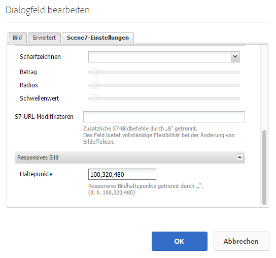

1. Bestätigen Sie, dass die Größe der Viewer dynamisch geändert wird und dass alle Interaktionen für Desktopcomputer, Tablets und Mobilgeräte optimiert sind.

### Für alle Dynamic Media Classic-Komponenten gemeinsame Einstellungen {#settings-common-to-all-scene-components}

Obwohl die Konfigurationsoptionen variieren, gelten für alle [!UICONTROL Dynamic Media Classic]-Komponenten folgende gemeinsame Optionen:

* **[!UICONTROL Dateiverweis]**  - Navigieren Sie zu einer Datei, auf die Sie verweisen möchten. Der Dateiverweis zeigt die Asset-URL und nicht notwendigerweise die vollständige Dynamic Media Classic-URL, einschließlich der URL-Befehle und -Parameter. In diesem Feld können Sie keine Dynamic Media Classic-URL-Befehle und -Parameter hinzufügen. Sie müssen über die entsprechende Funktionalität in der Komponente hinzugefügt werden.
* **[!UICONTROL Breite]**  - Hiermit können Sie die Breite festlegen.
* **[!UICONTROL Höhe]**  - Hiermit können Sie die Höhe festlegen.

Sie legen diese Konfigurationsoptionen fest, indem Sie eine Dynamic Media Classic-Komponente öffnen (durch Doppelklicken), z. B. wenn Sie eine **[!UICONTROL Zoom]**-Komponente öffnen:

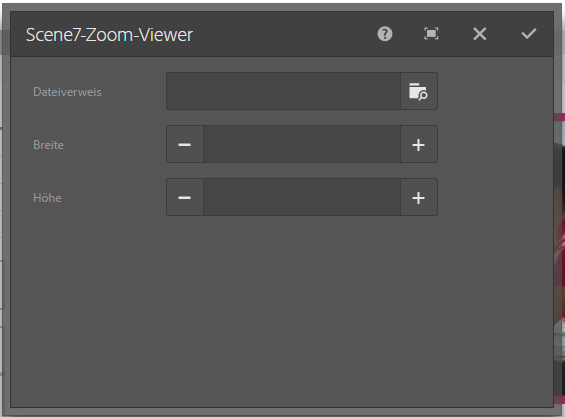

### Zoom {#zoom}

Die HTML5-Zoom-Komponente zeigt ein größeres Bild an, wenn Sie die Schaltfläche **[!UICONTROL +]** betätigen.

Das Asset verfügt unten über Zoomwerkzeuge. Tippen Sie auf **[!UICONTROL +]**, um die Größe zu vergrößern. Tippen Sie auf **[!UICONTROL -]**, um die Anzahl zu verringern. Durch Tippen auf **[!UICONTROL x]** oder auf den Pfeil zum Zurücksetzen des Zooms wird das Bild wieder in die Originalgröße verschoben, als es importiert wurde. Tippen Sie auf die diagonalen Pfeile, um den Vollbildmodus zu aktivieren. Tippen Sie auf **[!UICONTROL Bearbeiten]** , um die Komponente zu konfigurieren. Mit dieser Komponente können Sie [Einstellungen konfigurieren, die für alle [!UICONTROL Dynamic Media Classic]-Komponenten](#settings-common-to-all-scene-components) gelten.

### Flyout {#flyout}

In der Komponente HTML5 **[!UICONTROL Flyout]** wird das Asset als Splitscreen angezeigt. das Asset in der angegebenen Größe belassen; rechts wird der Zoombereich angezeigt. Tippen Sie auf **[!UICONTROL Bearbeiten]** , um die Komponente zu konfigurieren. Mit dieser Komponente können Sie [Einstellungen konfigurieren, die für alle Dynamic Media Classic-Komponenten](#settings-common-to-all-scene-components) gelten.

>[!NOTE]
>
>Wenn Ihre Komponente **[!UICONTROL Flyout]** eine benutzerdefinierte Größe verwendet, wird diese benutzerdefinierte Größe verwendet und die responsive Einrichtung der Komponente ist deaktiviert.
>
>Wenn Ihre Komponente **[!UICONTROL Flyout]** die Standardgröße verwendet, wie in der **[!UICONTROL Designansicht]** festgelegt, wird die Standardgröße verwendet und die Komponente erstreckt sich, um die Seitenlayoutgröße mit aktivierter responsiver Einrichtung der Komponente anzupassen. Beachten Sie jedoch, dass die responsive Einrichtung der Komponente eingeschränkt ist. Wenn Sie die Komponente **[!UICONTROL Flyout]** mit responsiven Einstellungen verwenden, sollten Sie sie nicht mit vollständiger Seitendehnung verwenden. Andernfalls kann das **[!UICONTROL Flyout]** über den rechten Rand der Seite hinausgehen.

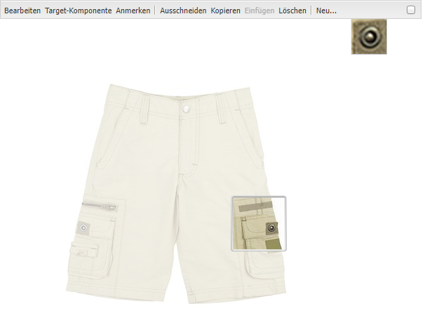

### Bild {#image}

Mit der Komponente Dynamic Media Classic **[!UICONTROL Bild]** können Sie Ihren Bildern Dynamic Media Classic-Funktionen hinzufügen, z. B. Dynamic Media Classic-Modifikatoren, Bild- oder Viewer-Vorgaben und Scharfzeichnen. Die Dynamic Media Classic-Komponente **[!UICONTROL Bild]** ähnelt anderen Bildkomponenten in AEM mit speziellen Dynamic Media Classic-Funktionen. In diesem Beispiel wird auf das Bild der Dynamic Media Classic-URL-Modifikator `&op_invert=1` angewendet.

**[!UICONTROL Titel, ALT-Text]**  - Fügen Sie auf der Registerkarte &quot; **** Erweitert&quot;einen Titel zum Bild und alternativen Text für die Benutzer hinzu, deren Grafiken deaktiviert sind.

**[!UICONTROL URL, Öffnen in]**  - Sie können ein Asset von festlegen, um einen Link zu öffnen. Legen Sie die **[!UICONTROL URL]** fest. Geben Sie in **[!UICONTROL Öffnen in]** an, ob der Link im selben oder einem neuen Fenster geöffnet werden soll.

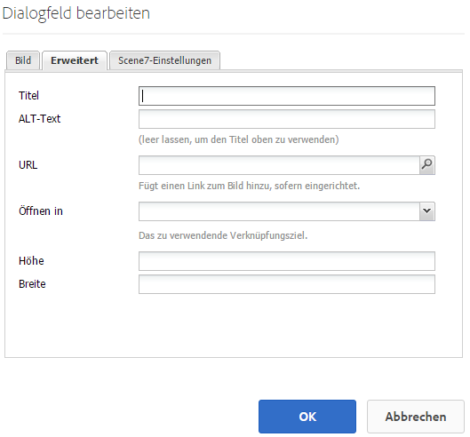

**[!UICONTROL Viewer-Vorgabe]** : Wählen Sie eine vorhandene Viewer-Vorgabe aus dem Dropdown-Menü aus. Wenn die gewünschte Viewer-Vorgabe nicht sichtbar ist, müssen Sie sie möglicherweise sichtbar machen. Siehe [Verwalten von Viewer-Vorgaben](/help/assets/managing-viewer-presets.md). Es ist nicht möglich, eine Viewer-Vorgabe auszuwählen, wenn Sie eine Bildvorgabe verwenden, und umgekehrt.

**[!UICONTROL Dynamic Media Classic-Konfiguration]**  - Wählen Sie die Dynamic Media Classic-Konfiguration aus, die Sie zum Abrufen aktiver Bildvorgaben aus SPS verwenden möchten.

**[!UICONTROL Bildvorgabe]** : Wählen Sie eine vorhandene Bildvorgabe aus dem Dropdown-Menü aus. Wenn die gewünschte Bildvorgabe nicht sichtbar ist, müssen Sie sie möglicherweise sichtbar machen. Siehe [Verwalten von Bildvorgaben](/help/assets/managing-image-presets.md). Es ist nicht möglich, eine Viewer-Vorgabe auszuwählen, wenn Sie eine Bildvorgabe verwenden, und umgekehrt.

**[!UICONTROL Ausgabeformat]**  - Wählen Sie das Ausgabeformat des Bildes aus, z. B. jpeg. In Abhängigkeit des von Ihnen ausgewählten Ausgabeformats stehen Ihnen möglicherweise zusätzliche Konfigurationsoptionen zur Verfügung. Siehe [Best Practices für Bildvorgaben](/help/assets/managing-image-presets.md#image-preset-options).

**[!UICONTROL Scharfzeichnen]**  - Wählen Sie aus, wie das Bild scharfgezeichnet werden soll. Das Scharfzeichnen wird unter [Best Practices für Bildvorgaben](/help/assets/managing-image-presets.md#image-preset-options) und in den [Best Practices für das Scharfzeichnen](/help/assets/assets/sharpening_images.pdf) detailliert beschrieben.

**[!UICONTROL URL-Modifikatoren]** : Sie können Bildeffekte ändern, indem Sie zusätzliche Dynamic Media Classic-Bildbefehle bereitstellen. Diese werden unter [Bildvorgaben](/help/assets/managing-image-presets.md) und in der [Befehlsreferenz](https://experienceleague.adobe.com/docs/dynamic-media-developer-resources/image-serving-api/image-serving-api/http-protocol-reference/command-reference/c-command-reference.html) beschrieben.

**[!UICONTROL Haltepunkte]**  - Wenn Ihre Website responsiv ist, möchten Sie die Haltepunkte anpassen. Haltepunkte müssen durch Kommas (,) voneinander getrennt werden.

### Bildvorlage {#image-template}

[Dynamic Media Classic-](https://docs.adobe.com/help/en/dynamic-media-classic/using/template-basics/quick-start-template-basics.html) Bildvorlagen sind Photoshop-Inhalte mit Ebenen, die in Dynamic Media Classic importiert wurden und in denen Inhalte und Eigenschaften für Variabilität parametrisiert wurden. Mit der Komponente **[!UICONTROL Bildvorlage]** können Sie Bilder importieren und den Text in AEM dynamisch ändern. Zusätzlich können Sie die Komponente **[!UICONTROL Bildvorlage]** dahingehend konfigurieren, dass sie Werte aus dem Clientkontext übernimmt, damit das Bild jedem Benutzer personalisiert angezeigt wird.

Tippen Sie auf **[!UICONTROL Bearbeiten]** , um die Komponente zu konfigurieren. Sie können [Einstellungen konfigurieren, die für alle Dynamic Media Classic-Komponenten](#settings-common-to-all-scene-components) sowie andere in diesem Abschnitt beschriebene Einstellungen gelten.

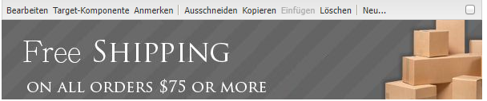

**[!UICONTROL Dateiverweis, Breite, Höhe]**  - Siehe für alle ScDynamic Media Classic7-Komponenten gemeinsame Einstellungen.

>[!NOTE]
>
>Dynamic Media Classic-URL-Befehle und -Parameter können der Dateiverweis-URL nicht direkt hinzugefügt werden. Sie können nur auf der Komponenten-Benutzeroberfläche im Bedienfeld **[!UICONTROL Parameter]** definiert werden.

**[!UICONTROL Titel, ALT-Text]**  - Fügen Sie auf der Registerkarte Dynamic Media Classic-Bildvorlage einen Titel zum Bild und Alternativtext für die Benutzer hinzu, deren Grafiken deaktiviert sind.

**[!UICONTROL URL, Öffnen in]**  - Sie können ein Asset von festlegen, um einen Link zu öffnen. Legen Sie die URL fest. Geben Sie in „Öffnen in“ an, ob der Link im selben oder einem neuen Fenster geöffnet werden soll.

**[!UICONTROL Parameterbereich]**  - Beim Import eines Bildes werden die Parameter vorab mit Informationen aus dem Bild gefüllt. Wenn kein Inhalt vorhanden ist, der dynamisch geändert werden kann, ist dieses Fenster leer.

#### Dynamisches Ändern von Text {#changing-text-dynamically}

Geben Sie zum dynamischen Ändern des Texts neuen Text in die Felder ein und klicken Sie auf **[!UICONTROL OK]**. In diesem Beispiel lautet der **[!UICONTROL Preis]** 50 $ und der Versand kostet 0,99 $.

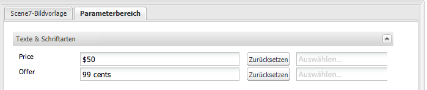

Der Text im Bild ändert sich. Sie können den Text wieder auf den ursprünglichen Wert zurücksetzen, indem Sie neben dem Feld auf **[!UICONTROL Zurücksetzen]** tippen.

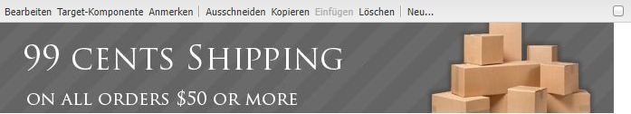

#### Ändern von Text zum Berücksichtigen des Werts eines Clientkontextwerts {#changing-text-to-reflect-the-value-of-a-client-context-value}

Um ein Feld mit einem Client-Kontextwert zu verknüpfen, tippen Sie auf **[!UICONTROL Auswählen]**, um das Client-Kontextmenü zu öffnen, wählen Sie den Client-Kontext aus und tippen Sie auf **[!UICONTROL OK]**. In diesem Beispiel ändert sich der Name auf Grundlage der Verknüpfung des Namens mit dem formatierten Namen im Profil.

Der Text berücksichtigt den Namen des aktuell angemeldeten Benutzers. Sie können den Text auf den ursprünglichen Wert zurücksetzen, indem Sie neben dem Feld auf **[!UICONTROL Zurücksetzen]** klicken.

#### Erstellen einer Dynamic Media Classic-Bildvorlage als Link {#making-the-scene-image-template-a-link}

1. Tippen Sie auf der Seite mit der Komponente Dynamic Media Classic **[!UICONTROL Bildvorlage]** auf **[!UICONTROL Bearbeiten]**.
1. Geben Sie im Feld **[!UICONTROL URL]** die URL ein, zu der Benutzer navigieren, wenn auf das Bild getippt wird. Wählen Sie im Feld **[!UICONTROL Öffnen in]** aus, ob das Ziel (in einem neuen oder im selben Fenster) geöffnet werden soll.

   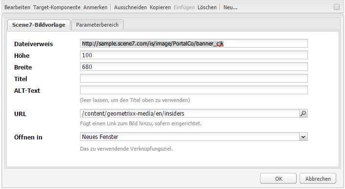

1. Tippen Sie auf **[!UICONTROL OK]**.

### Komponente „Video“{#video-component}

Die Komponente Dynamic Media Classic **[!UICONTROL Video]** (verfügbar im Dynamic Media Classic-Abschnitt des Sidekicks) verwendet die Geräte- und Bandbreitenerkennung, um jedem Bildschirm das richtige Video bereitzustellen. Bei dieser Komponente handelt es sich um einen HTML5-Video-Player. Es ist ein einzelner Viewer, der kanalübergreifend verwendet werden kann.

Er kann für adaptive Videosets, ein einzelnes MP4-Video oder ein einzelnes F4V-Video verwendet werden.

Weitere Informationen zur Verwendung von Videos mit der Dynamic Media Classic-Integration finden Sie unter [Video](s7-video.md) . Weitere Informationen finden Sie unter [Dynamic Media Classic-Videokomponente im Vergleich zur Foundation-Videokomponente](s7-video.md).

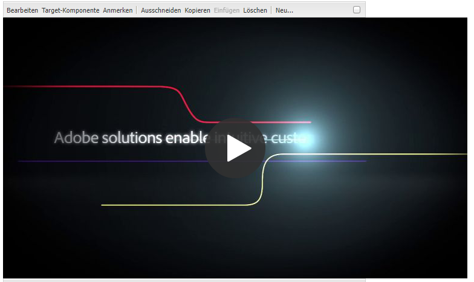

### Bekannte Einschränkungen für die Videokomponente {#known-limitations-for-the-video-component}

Adobe DAM und WCM zeigen an, ob ein Primärvideo hochgeladen wurde. Sie zeigen diese Proxy-Assets nicht an:

* Dynamic Media Classic-kodierte Ausgabeformate
* Adaptive Dynamic Media Classic-Videosets

Wenn Sie ein adaptives Videoset mit der Dynamic Media Classic-Videokomponente verwenden, müssen Sie die Größe der Komponente ändern, um sie an die Abmessungen des Videos anzupassen.

## Dynamic Media Classic-Inhaltsbrowser {#scene-content-browser}

Mit dem Dynamic Media Classic-Inhaltsbrowser können Sie Inhalte aus Dynamic Media Classic direkt in AEM anzeigen. Um auf den Inhaltsbrowser zuzugreifen, wählen Sie im **[!UICONTROL Content Finder]** in der Touch-optimierten Benutzeroberfläche **[!UICONTROL Dynamic Media Classic]** oder in der klassischen Benutzeroberfläche das Symbol **[!UICONTROL S7]** aus. Die Funktionalität ist zwischen den beiden Benutzeroberflächen identisch.

Wenn Sie über mehrere Konfigurationen verfügen, zeigt AEM standardmäßig die [Standardkonfiguration](/help/sites-administering/scene7.md#configuring-a-default-configuration) an. Sie können verschiedene Konfigurationen direkt im Inhaltsbrowser von Dynamic Media Classic im Dropdown-Menü auswählen.

>[!NOTE]
>
>* Im Ad-hoc-Ordner befindliche Assets werden nicht im Inhaltsbrowser von Dynamic Media Classic angezeigt.
>* Wenn [Sichere Vorschau aktiviert ist](/help/sites-administering/scene7.md#configuring-the-state-published-unpublished-of-assets-pushed-to-scene), werden veröffentlichte und nicht veröffentlichte Assets in Dynamic Media Classic im Inhaltsbrowser von Dynamic Media Classic angezeigt.
>* Wenn **[!UICONTROL Dynamic Media Classic]** oder das Symbol **[!UICONTROL S7]** nicht als Option im Inhaltsbrowser angezeigt wird, müssen Sie [Dynamic Media Classic für die Verwendung mit AEM](/help/sites-administering/scene7.md) konfigurieren.
>* Für Videos unterstützt der Inhaltsbrowser von Dynamic Media Classic Folgendes:

   >
   >   
   * Adaptive Videosets: Container von allen für die bildschirmübergreifende optimierte Wiedergabe erforderlichen Videoausgabeformaten
   >   * Einzelnes MP4-Video
   >   * Einzelnes F4V-Video

### Durchsuchen von Inhalten in der Touch-optimierten Benutzeroberfläche {#browsing-content-in-the-touch-optimized-ui}

Sie können über die Touch-optimierte oder klassische Benutzeroberfläche auf den Inhaltsbrowser zugreifen. Zurzeit weist die Touch-optimierte Benutzeroberfläche die folgende Begrenzung auf:

* FXG- und Flash-Assets aus Dynamic Media Classic werden nicht unterstützt.

Durchsuchen Sie Dynamic Media Classic-Assets, indem Sie **[!UICONTROL Dynamic Media Classic]** aus dem dritten Dropdownmenü auswählen. Dynamic Media Classic wird nicht in der Liste angezeigt, wenn Sie die Dynamic Media Classic/AEM-Integration nicht konfiguriert haben.

>[!NOTE]
>
>* Der Inhaltsbrowser von Dynamic Media Classic lädt etwa 100 Assets und sortiert sie nach Namen.
>* Wenn Sie einen sicheren Vorschauserver festgelegt haben, verwendet der Browser diesen Vorschauserver zum Darstellen von Miniaturansichten und Assets.

>

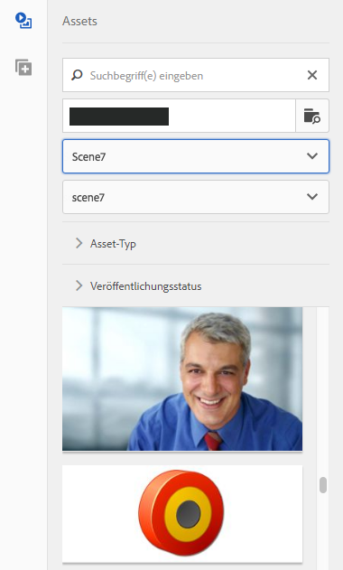

Zusätzlich können Sie Informationen über Auflösung, Größe, Tage seit der Änderung und Dateiname erhalten, indem Sie den Mauszeiger über das Asset im Browser halten.

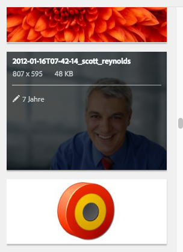

* Bei adaptiven Videosets und -vorlagen werden für Miniaturansichten keine Größeninformationen generiert.
* Bei adaptiven Videosets wird für Miniaturansichten keine Auflösung generiert.

### Suchen nach Dynamic Media Classic-Assets mit dem Inhaltsbrowser {#searching-for-scene-assets-with-the-content-browser}

Die Suche nach Dynamic Media Classic-Assets verläuft ähnlich wie die Suche nach AEM Assets. Bei der Suche wird Ihnen jedoch eine Remote-Ansicht der Assets im Dynamic Media Classic-System angezeigt, anstatt sie direkt in AEM zu importieren.

Sie können die klassische oder Touch-optimierte Benutzeroberfläche verwenden, um Assets anzuzeigen und nach ihnen zu suchen. In Abhängigkeit von der Oberfläche unterscheidet sich die Art und Weise der Suche etwas.

Wenn Sie auf einer der Benutzeroberflächen suchen, können Sie nach den folgenden Kriterien filtern (wird hier in der Touch-optimierten Benutzeroberfläche gezeigt):

**[!UICONTROL Keywords]**  - Sie können Assets nach Namen suchen. Bei der Suche entsprechen die von Ihnen eingegebenen Keywords dem Beginn des Dateinamens. Zum Beispiel führt die Eingabe des Worts „schwimmen“ dazu, dass nach Asset-Dateinamen gesucht wird, die mit diesen Buchstaben in dieser Reihenfolge beginnen. Tippen Sie unbedingt auf Eingabe , nachdem Sie den Begriff eingegeben haben, um das Asset zu finden.

**[!UICONTROL Ordner/Pfad]**  - Der Name des angezeigten Ordners basiert auf der von Ihnen ausgewählten Konfiguration. Sie können einen Drilldown zu niedrigeren Ebenen durchführen, indem Sie auf das Ordnersymbol tippen, einen Unterordner auswählen und dann auf das Häkchen tippen, um ihn auszuwählen.

Wenn Sie ein Keyword eingeben und einen Ordner auswählen, durchsucht AEM diesen Ordner und die zugehörigen Unterordner. Wenn Sie jedoch bei der Suche keine Keywords eingeben, wird durch die Auswahl des Ordners das Asset nur in diesem Ordner angezeigt und nicht in Unterordnern.

Standardmäßig durchsucht AEM den ausgewählten Ordner und alle Unterordner.

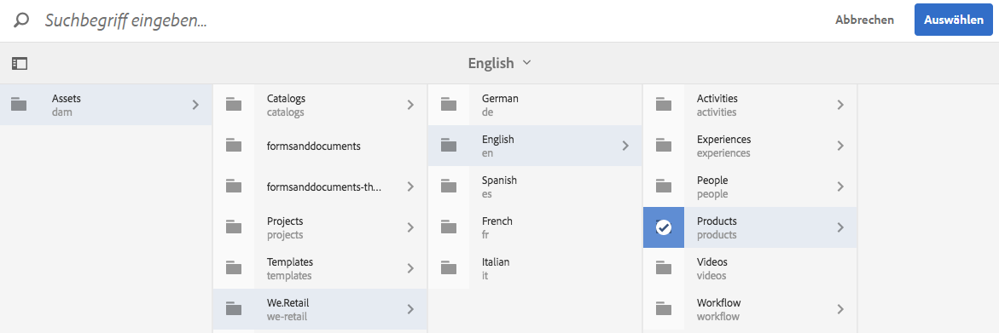

**[!UICONTROL Asset-Typ]**  - Wählen Sie  **[!UICONTROL Dynamic Media]** Classic aus, um Dynamic Media Classic-Inhalte zu durchsuchen. Diese Option ist nur verfügbar, wenn Dynamic Media Classic konfiguriert wurde.

**[!UICONTROL Konfiguration]**  - Wenn Sie mehr als eine Dynamic Media Classic-Konfiguration in  [!UICONTROL Cloud Services] definiert haben, können Sie sie hier auswählen. Der Ordner ändert sich anhand der von Ihnen ausgewählten Konfiguration.

**[!UICONTROL Asset-Typ]**  - Im Dynamic Media Classic-Browser können Sie Ergebnisse filtern, um Folgendes einzuschließen: Bilder, Vorlagen, Videos und adaptive Videosets. Wenn Sie keinen Asset-Typ auswählen, durchsucht AEM standardmäßig alle Asset-Typen.

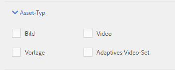

>[!NOTE]
>
>* Auf der klassischen Benutzeroberfläche können Sie auch nach **Flash** und **FXG** suchen. Das Filtern nach diesen auf der Touch-optimierten Benutzeroberfläche wird derzeit nicht unterstützt.
   >
   >
* Beim Durchsuchen eines Videos suchen Sie nach einem einzelnen Ausgabeformat. Die Ergebnisse geben die ursprüngliche Ausgabedarstellung (nur &amp;ast;.mp4) und die kodierte Ausgabedarstellung zurück.
>* Bei der Suche nach einem adaptiven Videoset durchsuchen Sie den Ordner und alle Unterordner, jedoch nur, wenn Sie der Suche ein Keyword hinzugefügt haben. Wenn Sie kein Keyword hinzugefügt haben, durchsucht AEM nicht die Unterordner.

>

**[!UICONTROL Veröffentlichungsstatus]**  - Sie können nach Assets basierend auf dem Veröffentlichungsstatus filtern:  **** Veröffentlichung rückgängig machen oder  **[!UICONTROL Veröffentlicht]**. Wenn Sie keinen **[!UICONTROL Veröffentlichungsstatus]** auswählen, durchsucht AEM standardmäßig alle Veröffentlichungsstatus.

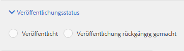
