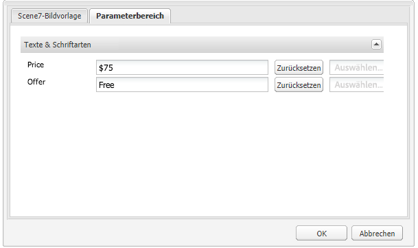

# Hinzufügen von Classic-Funktionen für dynamische Medien zu Ihrer Seite {#adding-scene-features-to-your-page}

[Adobe Dynamic Media Classic](https://help.adobe.com/en_US/scene7/using/WS26AB0D9A-F51C-464e-88C8-580A5A82F810.html) ist eine gehostete Lösung zum Verwalten, Erweitern, Veröffentlichen und Bereitstellen von Rich-Media-Assets für Web-, Mobil-, E-Mail- und Internetanzeigen und Drucken.

Sie können in Dynamic Media Classic veröffentlichte AEM-Assets in verschiedenen Viewern anzeigen:

* Zoom
* Flyout
* Video
* Bildvorlage
* Bild

Sie können digitale Assets direkt von AEM in Dynamic Media Classic veröffentlichen und digitale Assets von Dynamic Media Classic in AEM veröffentlichen.

In diesem Dokument wird beschrieben, wie Sie digitale Assets von AEM in Dynamic Media Classic veröffentlichen und umgekehrt. Die Viewer werden auch detailliert beschrieben. Informationen zum Konfigurieren von AEM für Dynamic Media Classic finden Sie unter [Integration von Dynamic Media Classic mit AEM](/help/sites-administering/scene7.md).

Siehe auch [Hinzufügen von Imagemaps](image-maps.md).

Weitere Informationen über die Arbeit mit Videokomponenten mit AEM finden Sie unter [Video](video.md).

>[!NOTE]
>
>If Dynamic Media Classic assets do not display properly, make sure that Dynamic media is [disabled](config-dynamic.md#disabling-dynamic-media) and then refresh the page.

## Manuelles Veröffentlichen von Assets in Dynamic Media Classic {#manually-publishing-to-scene-from-assets}

Sie können digitale Assets wie folgt in Dynamic Media Classic veröffentlichen:

* [In der Assets-Konsole, klassische Benutzeroberfläche](/help/sites-classic-ui-authoring/manage-assets-classic-s7.md#publishing-from-the-assets-console) 
* [Von einem Asset, klassische Benutzeroberfläche](/help/sites-classic-ui-authoring/manage-assets-classic-s7.md#publishing-from-an-asset) 
* [In der klassischen Benutzeroberfläche außerhalb des CQ Target-Ordners](/help/sites-classic-ui-authoring/manage-assets-classic-s7.md#publishing-assets-from-outside-the-cq-target-folder)

>[!NOTE]
>
>AEM veröffentlicht dynamisch Media Classic asynchron. After you click **[!UICONTROL Publish]**, it may take several seconds for your asset to publish to Dynamic Media Classic.

## Komponenten von Dynamic Media Classic {#scene-components}

Die folgenden Komponenten von Dynamic Media Classic sind in AEM verfügbar:

* Zoom
* Flyout (Zoom)
* Bildvorlage
* Bild
* Video

>[!NOTE]
>
>These components are not available by default and need to be selected in **[!UICONTROL Design]** mode before using.

After they are made available in **[!UICONTROL Design]** mode, you can add the components to your page like any other AEM component. Assets, die noch nicht in Dynamic Media Classic veröffentlicht wurden, werden in Dynamic Media Classic veröffentlicht, wenn sie sich in einem synchronisierten Ordner, auf einer Seite oder in einer Cloud-Konfiguration für Dynamic Media Classic befinden.

>[!NOTE]
>
>If you are creating and developing custom viewers and using the Content Finder, you need to explicity add the **[!UICONTROL allowfullscreen]** parameter.

### Hinweis zur Einstellung von Flash-Viewer {#flash-viewers-end-of-life-notice}

Ab dem 31. Januar 2017 hat Adobe Dynamic Media Classic die Unterstützung für die Flash-Viewer-Plattform eingestellt.

Weitere Informationen zu dieser wichtigen Änderung finden Sie unter [Fragen und Antworten zum Lebenszyklusende von Flash Viewer](https://docs.adobe.com/content/docs/en/aem/6-1/administer/integration/marketing-cloud/scene7/flash-eol.html).

### Adding a Dynamic Media Classic component (Scene7) to a page {#adding-a-scene-component-to-a-page}

Das Hinzufügen einer Komponente des Typs &quot;Dynamic Media Classic&quot;(Scene7) zu einer Seite entspricht dem Hinzufügen einer Komponente zu einer beliebigen Seite. Die Komponenten von Dynamic Media Classic werden in den folgenden Abschnitten ausführlich beschrieben.

**So fügen Sie einer Seite eine Komponente &quot;Dynamic Media Classic&quot;(Scene7) hinzu**

1. Öffnen Sie in AEM die Seite, auf der Sie die Komponente &quot;Dynamischer Medienklassiker&quot;(Scene7) hinzufügen möchten.

1. If no Dynamic Media Classic components are available, click **[!UICONTROL Design]** mode, tap any component with a blue border, tap the **[!UICONTROL Parent]** icon, and then the **[!UICONTROL Configuration]** icon. In **[!UICONTROL Parsys (Design)]**, select all the Dynamic Media Classic components to make them available and click **[!UICONTROL OK]**.

   

1. Click **[!UICONTROL Edit]** to return to **[!UICONTROL Edit]** mode.

1. Ziehen Sie eine Komponente aus der Gruppe &quot;Dynamische Medien - Klassik&quot;im Sidekick auf die Seite an der gewünschten Position.

1. Click the **[!UICONTROL Configuration]** icon to open the component.

1. Bearbeiten Sie die Komponente bei Bedarf und klicken Sie auf **[!UICONTROL OK]**, um die Änderungen zu speichern.
1. Ziehen Sie das Bild oder Video aus dem Inhaltsbrowser auf die Komponente Dynamic Media Classic, die Sie der Seite hinzugefügt haben.

   >[!NOTE]
   >
   >Nur in der Touch-Benutzeroberfläche müssen Sie das Bild oder Video per Drag &amp; Drop auf die Komponente Dynamic Media Classic ziehen, die Sie auf der Seite platziert haben. Die Auswahl und Bearbeitung der Komponente &quot;Dynamische Medien - Klassisch&quot;und die anschließende Auswahl des Assets werden nicht unterstützt.

### Adding interactive viewing experiences to a responsive site {#adding-interactive-viewing-experiences-to-a-responsive-website}

Dynamisches Design für Ihre Assets bedeutet, dass Ihre Assets in Abhängigkeit ihrer Anzeigeposition angepasst werden. Mithilfe des dynamischen Designs können dieselben Assets auf mehreren Geräten effektiv dargestellt werden.

Informationen hierzu finden Sie auch unter [Dynamisches Design für Webseiten](/help/sites-developing/responsive.md).

**So fügen Sie einer responsive Site ein interaktives Anzeigeerlebnis hinzu**

1. Log in to AEM, and ensure that you have [configured Adobe Dynamic Media Classic Cloud Services](/help/sites-administering/scene7.md#configuring-scene-integration) and that Dynamic Media Classic components are available.

   >[!NOTE]
   >
   >Wenn die Komponenten von Dynamic Media Classic nicht verfügbar sind, stellen Sie sicher, dass Sie sie [im Designmodus](/help/sites-authoring/default-components-designmode.md)aktivieren.

1. In a website with the **[!UICONTROL Dynamic Media Classic]** components enabled, drag an **[!UICONTROL Image]** component to the page.
1. Wählen Sie die Komponente aus und tippen Sie auf das Konfigurationssymbol.
1. Passen Sie die Haltepunkte auf der Registerkarte Classic-Einstellungen für **[!UICONTROL dynamische Medien]** an.

   

1. Bestätigen Sie, dass die Größe der Viewer dynamisch geändert wird und dass alle Interaktionen für Desktopcomputer, Tablets und Mobilgeräte optimiert sind.

### Allgemeine Einstellungen für alle Komponenten von Dynamic Media Classic {#settings-common-to-all-scene-components}

Although configuration options vary, the following are common to all [!UICONTROL Dynamic Media Classic] components:

* **[!UICONTROL Dateiverweis]** : Navigieren Sie zu einer Datei, auf die Sie verweisen möchten. Der Dateiverweis zeigt die Asset-URL und nicht unbedingt die vollständige URL von Dynamic Media Classic, einschließlich der URL-Befehle und -Parameter. Sie können in diesem Feld keine URL-Befehle und Parameter für Dynamic Media Classic hinzufügen. Sie müssen über die entsprechende Funktionalität in der Komponente hinzugefügt werden.
* **[!UICONTROL Breite]** - Hiermit können Sie die Breite einstellen.
* **[!UICONTROL Höhe]** - Hiermit können Sie die Höhe einstellen.

You set these configuration options by opening (double-clicking) a Dynamic Media Classic component, for example, when you open a **[!UICONTROL Zoom]** component:

### Zoom {#zoom}

The HTML5 Zoom component displays a larger image when you press the **[!UICONTROL +]** button.

Das Asset verfügt unten über Zoomwerkzeuge. Tippen Sie auf **[!UICONTROL +]** , um zu vergrößern. Tippen Sie auf **[!UICONTROL -]** , um den Wert zu verringern. Tapping the **[!UICONTROL x]** or the reset zoom arrow brings the image back to the original size it was imported as. Tippen Sie auf die diagonalen Pfeile, um den Vollbildmodus zu aktivieren. Tap **[!UICONTROL Edit]** to configure the component. With this component, you can configure [settings common to all [!UICONTROL Dynamic Media Classic] components](#settings-common-to-all-scene-components).

### Flyout {#flyout}

In the HTML5 **[!UICONTROL Flyout]** component, the asset is shown as split screen; left the asset in the specified size; right the zoom portion is displayed. Tap **[!UICONTROL Edit]** to configure the component. With this component, you can configure [settings common to all Dynamic Media Classic components](#settings-common-to-all-scene-components).

>[!NOTE]
>
>If your **[!UICONTROL Flyout]** component uses a custom size, then that custom size is used and responsive setup of the component is disabled.
>
>If your **[!UICONTROL Flyout]** component uses the default size, as set in the **[!UICONTROL Design View]**, then the default size is used and the component stretches to accomodate the page layout size with responsive setup of the component enabled. Beachten Sie jedoch, dass es eine Beschränkung für das reaktionsfähige Setup der Komponente gibt. When the you use the **[!UICONTROL Flyout]** component with responsive setup, you should not use it with full page stretch. Otherwise, the **[!UICONTROL Flyout]** may extend beyond the page&#39;s right border.

### Bild {#image}

Mit der Komponente &quot;Dynamisches **[!UICONTROL Bild]** für klassische Medien&quot;können Sie Ihren Bildern dynamische Medien-Classic-Funktionen hinzufügen, z. B. Modifikatoren für dynamische Medien, Bild- oder Viewer-Vorgaben und Scharfzeichnen. Die Komponente &quot;Dynamisches **[!UICONTROL klassisches Bild]** &quot;ähnelt anderen Bildkomponenten in AEM mit spezieller Funktion für Dynamische Medien Classic. In diesem Beispiel wurde für das Bild der URL-Modifikator &quot;Dynamisch Media Classic&quot; `&op_invert=1` angewendet.

**[!UICONTROL Titel, Alt-Text]** - Fügen Sie auf der Registerkarte &quot; **[!UICONTROL Erweitert]** &quot;dem Bild einen Titel und Alt-Text für Benutzer hinzu, die Grafiken deaktiviert haben.

**[!UICONTROL URL, Öffnen in]** - Sie können ein Asset vom zum Öffnen eines Links festlegen. Legen Sie die **[!UICONTROL URL]** fest. Geben Sie in **[!UICONTROL Öffnen in]** an, ob der Link im selben oder einem neuen Fenster geöffnet werden soll.

**[!UICONTROL Viewer-Vorgabe]** : Wählen Sie im Dropdown-Menü eine vorhandene Viewer-Vorgabe aus. Wenn die gewünschte Viewer-Vorgabe nicht sichtbar ist, müssen Sie sie möglicherweise sichtbar machen. Siehe [Verwalten von Viewer-Vorgaben](/help/assets/managing-viewer-presets.md). Es ist nicht möglich, eine Viewer-Vorgabe auszuwählen, wenn Sie eine Bildvorgabe verwenden, und umgekehrt.

**[!UICONTROL Dynamic Media Classic-Konfiguration]** : Wählen Sie die Konfiguration für dynamische Medien Classic aus, die Sie zum Abrufen aktiver Bildvorgaben aus dem SPS verwenden möchten.

**[!UICONTROL Bildvorgabe]** : Wählen Sie eine vorhandene Bildvorgabe aus dem Dropdown-Menü. Wenn die gewünschte Bildvorgabe nicht sichtbar ist, müssen Sie sie möglicherweise sichtbar machen. Siehe [Verwalten von Bildvorgaben](/help/assets/managing-image-presets.md). Es ist nicht möglich, eine Viewer-Vorgabe auszuwählen, wenn Sie eine Bildvorgabe verwenden, und umgekehrt.

**[!UICONTROL Ausgabeformat]** - Wählen Sie das Ausgabeformat des Bilds, z. B. jpeg, aus. In Abhängigkeit des von Ihnen ausgewählten Ausgabeformats stehen Ihnen möglicherweise zusätzliche Konfigurationsoptionen zur Verfügung. Siehe [Best Practices für Bildvorgaben](/help/assets/managing-image-presets.md#image-preset-options).

**[!UICONTROL Scharfzeichnen]** - Wählen Sie aus, wie das Bild scharfgezeichnet werden soll. Das Scharfzeichnen wird unter [Best Practices für Bildvorgaben](/help/assets/managing-image-presets.md#image-preset-options) und in den [Best Practices für das Scharfzeichnen](/help/assets/assets/s7_sharpening_images.pdf) detailliert beschrieben.

**[!UICONTROL URL-Modifikatoren]** : Sie können Bildeffekte ändern, indem Sie zusätzliche Dynamic Media Classic-Bildbefehle bereitstellen. Diese werden unter [Bildvorgaben](/help/assets/managing-image-presets.md) und in der [Befehlsreferenz](https://marketing.adobe.com/resources/help/en_US/s7/is_ir_api/is_api/http_ref/c_command_reference.html) beschrieben.

**[!UICONTROL Haltepunkte]** : Wenn Ihre Website responsiv ist, sollten Sie die Haltepunkte anpassen. Haltepunkte müssen durch Kommas (,) voneinander getrennt werden.

### Bildvorlage {#image-template}

[Dynamic Media Classic-Bildvorlagen](https://help.adobe.com/en_US/scene7/using/WS60B68844-9054-4099-BF69-3DC998A04D3C.html) sind in Dynamic Media Classic importierte Fotoshop-Inhalte mit Ebenen, bei denen Inhalt und Eigenschaften auf Variabilität parametrisiert wurden. Mit der Komponente **[!UICONTROL Bildvorlage]** können Sie Bilder importieren und den Text in AEM dynamisch ändern. Zusätzlich können Sie die Komponente **[!UICONTROL Bildvorlage]** dahingehend konfigurieren, dass sie Werte aus dem Clientkontext übernimmt, damit das Bild jedem Benutzer personalisiert angezeigt wird.

Tap **[!UICONTROL Edit]** to configure the component. You can configure [settings common to all Dynamic Media Classic components](#settings-common-to-all-scene-components) as well as other settings described in this section.

**[!UICONTROL Dateiverweis, Breite, Höhe]** - Siehe Einstellungen, die allen ScDynamic Media Classic7-Komponenten gemeinsam sind.

>[!NOTE]
>
>URL-Befehle und -Parameter für Dynamic Media Classic können der Dateiverweis-URL nicht direkt hinzugefügt werden. Sie können nur auf der Komponenten-Benutzeroberfläche im Bedienfeld **[!UICONTROL Parameter]** definiert werden.

**[!UICONTROL Titel, Alt-Text]** - Fügen Sie auf der Registerkarte &quot;Dynamic Media Classic-Bildvorlage&quot;dem Bild und dem Alternativtext einen Titel für Benutzer hinzu, die Grafiken deaktiviert haben.

**[!UICONTROL URL, Öffnen in]** - Sie können ein Asset vom zum Öffnen eines Links festlegen. Legen Sie die URL fest. Geben Sie in Öffnen in an, ob der Link im selben oder einem neuen Fenster geöffnet werden soll.

**[!UICONTROL Parameterbedienfeld]** : Beim Importieren eines Bildes werden die Parameter vorab mit Informationen aus dem Bild gefüllt. Wenn kein Inhalt vorhanden ist, der dynamisch geändert werden kann, ist dieses Fenster leer.

#### Dynamisches Ändern von Text {#changing-text-dynamically}

Geben Sie zum dynamischen Ändern des Texts neuen Text in die Felder ein und klicken Sie auf **[!UICONTROL OK]**. In diesem Beispiel lautet der **[!UICONTROL Preis]** 50 $ und der Versand kostet 0,99 $.

Der Text im Bild ändert sich. You can reset the text back to the original value by tapping **[!UICONTROL Reset]** next to the field.

#### Ändern von Text zum Berücksichtigen des Werts eines Clientkontextwerts {#changing-text-to-reflect-the-value-of-a-client-context-value}

To link a field to a client context value, tap **[!UICONTROL Select]** to open the client-context menu, select the client context, and tap **[!UICONTROL OK]**. In diesem Beispiel ändert sich der Name auf Grundlage der Verknüpfung des Namens mit dem formatierten Namen im Profil.

Der Text berücksichtigt den Namen des aktuell angemeldeten Benutzers. Sie können den Text auf den ursprünglichen Wert zurücksetzen, indem Sie neben dem Feld auf **[!UICONTROL Zurücksetzen]** klicken.

#### Erstellen eines Links für die Vorlage eines klassischen dynamischen Mediums {#making-the-scene-image-template-a-link}

1. Tippen Sie auf der Seite mit der Komponente Dynamic Media Classic **[!UICONTROL Image Template]** auf **[!UICONTROL Bearbeiten]**.
1. In the **[!UICONTROL URL]** field, enter the URL that users go to when the image is tapped. Wählen Sie im Feld **[!UICONTROL Öffnen in]** aus, ob das Ziel (in einem neuen oder im selben Fenster) geöffnet werden soll.

   

1. Tippen Sie auf **[!UICONTROL OK]**.

### Komponente „Video“{#video-component}

The Dynamic Media Classic **[!UICONTROL Video]** component (available from the Dynamic Media Classic section of the sidekick) uses device and bandwidth detection to serve the right video to each screen. Bei dieser Komponente handelt es sich um einen HTML5-Video-Player. Es ist ein einzelner Viewer, der kanalübergreifend verwendet werden kann.

Er kann für adaptive Videosets, ein einzelnes MP4-Video oder ein einzelnes F4V-Video verwendet werden.

See [Video](s7-video.md) for more information on how videos work with Dynamic Media Classic integration. Siehe auch [die Komponente &quot;Dynamic Media Classic Video&quot;im Vergleich zur Komponente](s7-video.md)&quot;Foundation Video&quot;.

### Bekannte Einschränkungen für die Videokomponente {#known-limitations-for-the-video-component}

Adobe DAM und WCM zeigen, ob ein Mastervideo hochgeladen wurde. Sie zeigen diese Proxy-Assets nicht an:

* Dynamische Medien - Classic-kodierte Darstellungen
* Adaptive Videosets für Dynamic Media Classic

Wenn Sie ein adaptives Videoset mit der Komponente &quot;Dynamic Media Classic&quot;verwenden, müssen Sie die Größe der Komponente an die Abmessungen des Videos anpassen.

## Browser für dynamische Medien-Classic-Inhalte {#scene-content-browser}

Mit dem Browser für dynamische Medien-Classic-Inhalte können Sie Inhalte aus Dynamic Media Classic direkt in AEM anzeigen. To access the content browser, in the **[!UICONTROL Content Finder]**, select **[!UICONTROL Dynamic Media Classic]** in the touch-optimized user interface or the **[!UICONTROL S7]** icon in the classic user interface. Die Funktionalität ist zwischen den beiden Benutzeroberflächen identisch.

Wenn Sie über mehrere Konfigurationen verfügen, zeigt AEM standardmäßig die [Standardkonfiguration](/help/sites-administering/scene7.md#configuring-a-default-configuration) an. Sie können verschiedene Konfigurationen direkt im Inhaltsbrowser von Dynamic Media Classic im Dropdown-Menü auswählen.

>[!NOTE]
>
>* Assets, die sich im Ad-hoc-Ordner befinden, werden nicht im Inhaltsbrowser von Dynamic Media Classic angezeigt.
>* Wenn die [sichere Vorschau aktiviert](/help/sites-administering/scene7.md#configuring-the-state-published-unpublished-of-assets-pushed-to-scene)ist, werden veröffentlichte und unveröffentlichte Assets in Dynamic Media Classic im Inhaltsbrowser von Dynamic Media Classic angezeigt.
>* If you do not see **[!UICONTROL Dynamic Media Classic]** or the **[!UICONTROL S7]** icon as an option in the content browser, you need to [configure Dynamic Media Classic to work with AEM](/help/sites-administering/scene7.md).
>* Für Videos unterstützt der Inhaltsbrowser Dynamic Media Classic Folgendes:
   >   * Adaptive Videosets: Container von allen für die bildschirmübergreifende optimierte Wiedergabe erforderlichen Videoausgabeformaten
   >   * Einzelnes MP4-Video
   >   * Einzelnes F4V-Video

### Browsing content in the touch-optimized UI {#browsing-content-in-the-touch-optimized-ui}

Sie können über die Touch-optimierte oder klassische Benutzeroberfläche auf den Inhaltsbrowser zugreifen. Zurzeit weist die Touch-optimierte Benutzeroberfläche die folgende Begrenzung auf:

* FXG- und Flash-Elemente aus Dynamic Media Classic werden nicht unterstützt.

Durchsuchen Sie die Assets von Dynamic Media Classic, indem Sie im dritten Dropdown-Menü die Option &quot; **[!UICONTROL Dynamischer Medienklassiker]** &quot;auswählen. Dynamic Media Classic wird nicht in der Liste angezeigt, wenn Sie die Integration von Dynamic Media Classic/AEM nicht konfiguriert haben.

>[!NOTE]
>
>* Der Browser für Inhalte von Dynamic Media Classic lädt etwa 100 Assets und sortiert sie nach Namen.
>* Wenn Sie einen sicheren Vorschauserver festgelegt haben, verwendet der Browser diesen Vorschauserver zum Darstellen von Miniaturansichten und Assets.
>

Zusätzlich können Sie Informationen über Auflösung, Größe, Tage seit der Änderung und Dateiname erhalten, indem Sie den Mauszeiger über das Asset im Browser halten.

* Bei adaptiven Videosets und -vorlagen werden für Miniaturansichten keine Größeninformationen generiert.
* Bei adaptiven Videosets wird für Miniaturansichten keine Auflösung generiert.

### Suchen nach dynamischen Medien-Classic-Assets mit dem Inhaltsbrowser {#searching-for-scene-assets-with-the-content-browser}

Die Suche nach dynamischen Medien-Classic-Assets ähnelt der Suche nach AEM-Assets. Bei der Suche sehen Sie jedoch eine Remote-Ansicht der Assets im System Dynamic Media Classic, anstatt sie direkt in AEM zu importieren.

Sie können die klassische oder Touch-optimierte Benutzeroberfläche verwenden, um Assets anzuzeigen und nach ihnen zu suchen. In Abhängigkeit von der Oberfläche unterscheidet sich die Art und Weise der Suche etwas.

Wenn Sie auf einer der Benutzeroberflächen suchen, können Sie nach den folgenden Kriterien filtern (wird hier in der Touch-optimierten Benutzeroberfläche gezeigt):

**[!UICONTROL Suchbegriffe]** eingeben - Sie können Assets nach Namen suchen. Bei der Suche entsprechen die von Ihnen eingegebenen Keywords dem Beginn des Dateinamens. Zum Beispiel führt die Eingabe des Worts „schwimmen“ dazu, dass nach Asset-Dateinamen gesucht wird, die mit diesen Buchstaben in dieser Reihenfolge beginnen. Tippen Sie auf &quot;Geben Sie ein&quot;, nachdem Sie den Begriff eingegeben haben, um das Asset zu finden.

**[!UICONTROL Ordner/Pfad]** - Der Name des angezeigten Ordners hängt von der ausgewählten Konfiguration ab. Sie können einen Drilldown zu niedrigeren Ebenen durchführen, indem Sie auf das Ordnersymbol tippen, einen Unterordner auswählen und dann auf das Häkchen tippen, um ihn auszuwählen.

Wenn Sie ein Keyword eingeben und einen Ordner auswählen, durchsucht AEM diesen Ordner und die zugehörigen Unterordner. Wenn Sie jedoch bei der Suche keine Keywords eingeben, wird durch die Auswahl des Ordners das Asset nur in diesem Ordner angezeigt und nicht in Unterordnern.

Standardmäßig durchsucht AEM den ausgewählten Ordner und alle Unterordner.

**[!UICONTROL Asset]** -Typ: Wählen Sie **[!UICONTROL Dynamic Media Classic]** , um Inhalte für dynamische Medien Classic zu durchsuchen. Diese Option ist nur verfügbar, wenn Dynamic Media Classic konfiguriert wurde.

**[!UICONTROL Konfiguration]** : Wenn Sie mehr als eine Konfiguration von Dynamic Media Classic in [!UICONTROL Cloud Services]definiert haben, können Sie diese hier auswählen. Der Ordner ändert sich anhand der von Ihnen ausgewählten Konfiguration.

**[!UICONTROL Asset-Typ]** - Im Browser von Dynamic Media Classic können Sie die Ergebnisse filtern, um Folgendes einzuschließen: Bilder, Vorlagen, Videos und adaptive Videosets. Wenn Sie keinen Asset-Typ auswählen, durchsucht AEM standardmäßig alle Asset-Typen.

>[!NOTE]
>
>* Auf der klassischen Benutzeroberfläche können Sie auch nach **Flash** und **FXG** suchen. Das Filtern nach diesen auf der Touch-optimierten Benutzeroberfläche wird derzeit nicht unterstützt.
   >
   >
* Beim Durchsuchen eines Videos suchen Sie nach einem einzelnen Ausgabeformat. Die Ergebnisse geben die ursprüngliche Darstellung (nur &amp;ast;.mp4) und die kodierte Darstellung zurück.
>* Beim Durchsuchen eines adaptiven Videosets werden der Ordner und alle Unterordner durchsucht, allerdings nur, wenn Sie der Suche einen Suchbegriff hinzugefügt haben. Wenn Sie kein Keyword hinzugefügt haben, durchsucht AEM nicht die Unterordner.
>

**[!UICONTROL Veröffentlichungsstatus]** - Sie können nach Assets basierend auf dem Veröffentlichungsstatus filtern: Veröffentlichung **[!UICONTROL rückgängig gemacht]** oder **[!UICONTROL veröffentlicht]**. If you do not select any **[!UICONTROL Publish Status]**, AEM by default searches all publish statuses.

