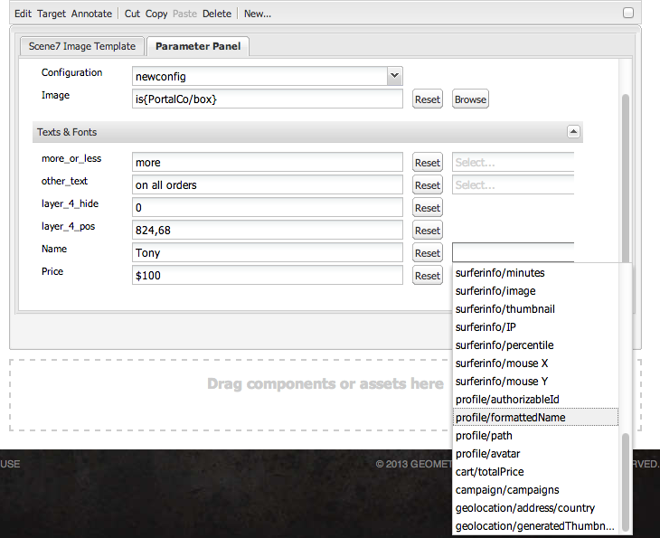

# Hinzufügen von Dynamic Media Classic-Funktionen zu Seiten {#adding-scene-features-to-your-page}

[Adobe Dynamic Media Classic](https://experienceleague.adobe.com/docs/dynamic-media-classic/using/home.html) ist eine gehostete Lösung für die Verwaltung, Erweiterung, Veröffentlichung und Bereitstellung von Rich-Media-Assets für Web-, Mobile-, E-Mail- und Internet-verbundene Anzeigen und Drucken.

Sie können Experience Manager-Assets anzeigen, die in Dynamic Media Classic in verschiedenen Viewern veröffentlicht wurden:

* Zoom
* Flyout
* Video
* Bildvorlage
* Bild

Sie können digitale Assets direkt aus Experience Manager in Dynamic Media Classic veröffentlichen und digitale Assets aus Dynamic Media Classic in Experience Manager veröffentlichen.

In diesem Dokument wird beschrieben, wie Sie digitale Assets von Experience Manager in Dynamic Media Classic und umgekehrt veröffentlichen. Die Viewer werden auch detailliert beschrieben. Informationen zum Konfigurieren von Experience Manager für Dynamic Media Classic finden Sie unter [Integrieren von Dynamic Media Classic mit Experience Manager](/help/sites-administering/scene7.md).

Siehe auch [Hinzufügen von Imagemaps](image-maps.md).

Weitere Informationen zur Verwendung von Videokomponenten mit Experience Manager finden Sie unter [Video](video.md).

>[!NOTE]
>
>Wenn Dynamic Media Classic-Assets nicht ordnungsgemäß angezeigt werden, stellen Sie sicher, dass Dynamic Media [disabled](config-dynamic.md#disabling-dynamic-media) und aktualisieren Sie dann die Seite.

## Manuelles Veröffentlichen von Assets in Dynamic Media Classic {#manually-publishing-to-scene-from-assets}

Sie können digitale Assets wie folgt in Dynamic Media Classic veröffentlichen:

* [In der Assets-Konsole, klassische Benutzeroberfläche ](/help/sites-classic-ui-authoring/manage-assets-classic-s7.md#publishing-from-the-assets-console)
* [Von einem Asset, klassische Benutzeroberfläche ](/help/sites-classic-ui-authoring/manage-assets-classic-s7.md#publishing-from-an-asset)
* [In der klassischen Benutzeroberfläche von außerhalb des Ordners CQ Target](/help/sites-classic-ui-authoring/manage-assets-classic-s7.md#publishing-assets-from-outside-the-cq-target-folder)

>[!NOTE]
>
>Experience Manager wird asynchron in Dynamic Media Classic veröffentlicht. Nachdem Sie **[!UICONTROL Veröffentlichen]**, dauert es mehrere Sekunden, bis Ihr Asset in Dynamic Media Classic veröffentlicht wird.

## Dynamic Media Classic-Komponenten {#scene-components}

Die folgenden Dynamic Media Classic-Komponenten sind in Experience Manager verfügbar:

* Zoom
* Flyout (Zoom)
* Bildvorlage
* Bild
* Video

>[!NOTE]
>
>Diese Komponenten sind standardmäßig nicht verfügbar und müssen in **[!UICONTROL Design]** -Modus vor der Verwendung.

Nachdem sie verfügbar gemacht wurden in **[!UICONTROL Design]** -Modus können Sie die Komponenten wie jede andere Experience Manager-Komponente zu Ihrer Seite hinzufügen. Assets, die noch nicht in Dynamic Media Classic veröffentlicht wurden, werden in Dynamic Media Classic veröffentlicht, wenn sie sich in einem synchronisierten Ordner, auf einer Seite oder mit einer Dynamic Media Classic-Cloud-Konfiguration befinden.

>[!NOTE]
>
>Wenn Sie benutzerdefinierte Viewer erstellen und entwickeln und die Inhaltssuche verwenden, müssen Sie die `allowfullscreen` Parameter.

### Hinweis zum End of Life von Flash-Viewern {#flash-viewers-end-of-life-notice}

Mit Wirkung vom 31. Januar 2017 hat Adobe Dynamic Media Classic die Unterstützung für die Flash-Viewer-Plattform eingestellt.

### Hinzufügen einer Dynamic Media Classic (Scene7)-Komponente zu einer Seite {#adding-a-scene-component-to-a-page}

Das Hinzufügen einer Dynamic Media Classic (Scene7)-Komponente zu einer Seite entspricht dem Hinzufügen einer Komponente zu einer beliebigen Seite. Dynamic Media Classic-Komponenten werden in den folgenden Abschnitten ausführlich beschrieben.

**So fügen Sie einer Seite eine Dynamic Media Classic (Scene7)-Komponente hinzu:**

1. Öffnen Sie in Experience Manager die Seite, auf der Sie die **[!UICONTROL Dynamic Media Classic (Scene7)]** -Komponente.

1. Wenn keine Dynamic Media Classic-Komponenten verfügbar sind, wählen Sie **[!UICONTROL Design]** -Modus eine beliebige Komponente mit einem blauen Rahmen auswählen, wählen Sie die **[!UICONTROL Übergeordnet]** und dann die **[!UICONTROL Konfiguration]** Symbol. In **[!UICONTROL Parsys (Design)]**, wählen Sie alle Dynamic Media Classic-Komponenten aus, um sie verfügbar zu machen, und wählen Sie **[!UICONTROL OK]**.

   

1. Auswählen **[!UICONTROL Bearbeiten]** Sie können zu **[!UICONTROL Bearbeiten]** -Modus.

1. Ziehen Sie eine Komponente aus der Dynamic Media Classic-Gruppe im Sidekick auf die Seite an der gewünschten Position.

1. Wählen Sie die **[!UICONTROL Konfiguration]** -Symbol, damit Sie die Komponente öffnen können.

1. Bearbeiten Sie die Komponente nach Bedarf und wählen Sie **[!UICONTROL OK]** , um Änderungen zu speichern.
1. Ziehen Sie das Bild oder Video aus dem Inhaltsbrowser auf die Dynamic Media Classic-Komponente, die Sie der Seite hinzugefügt haben.

   >[!NOTE]
   >
   >Nur in der Touch-Benutzeroberfläche müssen Sie das Bild oder Video auf die Dynamic Media Classic-Komponente ziehen, die Sie auf der Seite platziert haben. Die Auswahl und Bearbeitung der Dynamic Media Classic-Komponente und die anschließende Auswahl des Assets werden nicht unterstützt.

### Hinzufügen eines interaktiven Anzeigeerlebnisses zu einer responsiven Site {#adding-interactive-viewing-experiences-to-a-responsive-website}

Responsives Design für Ihre Assets bedeutet, dass sich Ihr Asset an die Stelle anpasst, an der es angezeigt wird. Mithilfe des dynamischen Designs können dieselben Assets auf mehreren Geräten effektiv dargestellt werden.

Siehe auch [Responsives Design für Webseiten](/help/sites-developing/responsive.md).

**So fügen Sie einer responsiven Site ein interaktives Anzeigeerlebnis hinzu:**

1. Melden Sie sich bei Experience Manager an und stellen Sie sicher, dass Sie [konfigurierte Adobe Dynamic Media Classic Cloud Services](/help/sites-administering/scene7.md#configuring-scene-integration) und dass Dynamic Media Classic-Komponenten verfügbar sind.

   >[!NOTE]
   >
   >Wenn keine Dynamic Media Classic-Komponenten verfügbar sind, stellen Sie sicher, dass [, um sie im Designmodus zu aktivieren](/help/sites-authoring/default-components-designmode.md).

1. Auf einer Website mit **[!UICONTROL Dynamic Media Classic]** Komponenten aktiviert, ziehen und **[!UICONTROL Bild]** -Komponente auf der Seite.
1. Wählen Sie die Komponente aus und wählen Sie das Konfigurationssymbol aus.
1. Im **[!UICONTROL Dynamic Media Classic-Einstellungen]** -Registerkarte, passen Sie die Haltepunkte an.

   

1. Bestätigen Sie, dass die Größe der Viewer dynamisch geändert wird und dass alle Interaktionen für Desktopcomputer, Tablets und Mobilgeräte optimiert sind.

### Für alle Dynamic Media Classic-Komponenten gemeinsame Einstellungen {#settings-common-to-all-scene-components}

Obwohl die Konfigurationsoptionen variieren, gelten für alle [!UICONTROL Dynamic Media Classic] Komponenten:

* **[!UICONTROL Dateiverweis]**: Navigieren Sie zu einer Datei, die Sie referenzieren möchten. Der Dateiverweis zeigt die Asset-URL und nicht notwendigerweise die vollständige Dynamic Media Classic-URL, einschließlich der URL-Befehle und -Parameter. Sie können in diesem Feld keine Dynamic Media Classic-URL-Befehle und -Parameter hinzufügen. Stattdessen fügen Sie sie über die entsprechende Funktionalität in der Komponente hinzu.
* **[!UICONTROL Breite]**: Hiermit kann die Breite angepasst werden.
* **[!UICONTROL Höhe]**: Hiermit kann die Höhe angepasst werden.

Sie legen diese Konfigurationsoptionen fest, indem Sie eine Dynamic Media Classic-Komponente öffnen (durch Doppelklicken), z. B. wenn Sie eine **[!UICONTROL Zoom]** component:

### Zoom {#zoom}

Die Zoom-Komponente HTML5 zeigt ein größeres Bild an, wenn Sie die **[!UICONTROL +]** Schaltfläche.

Das Asset verfügt unten über Zoomwerkzeuge. Auswählen **[!UICONTROL +]** wenn Sie eine Erweiterung vornehmen möchten; select **[!UICONTROL -]** wenn Sie reduzieren möchten. Tippen Sie auf **[!UICONTROL x]** oder der Pfeil zum Zurücksetzen des Zooms bringt das Bild wieder in die Originalgröße zurück, als es importiert wurde. Wählen Sie die diagonalen Pfeile aus, damit sie im Vollbildmodus angezeigt werden. Auswählen **[!UICONTROL Bearbeiten]** sodass Sie die Komponente konfigurieren können. Mit dieser Komponente können Sie [für alle [!UICONTROL Dynamic Media Classic] Komponenten](#settings-common-to-all-scene-components).

### Flyout {#flyout}

In der HTML 5 **[!UICONTROL Flyout]** -Komponente verwenden, wird das Asset als Splitscreen angezeigt. das Asset in der angegebenen Größe belassen; rechts wird der Zoombereich angezeigt. Auswählen **[!UICONTROL Bearbeiten]** sodass Sie die Komponente konfigurieren können. Mit dieser Komponente können Sie [Einstellungen, die für alle Dynamic Media Classic-Komponenten gelten](#settings-common-to-all-scene-components).

>[!NOTE]
>
>Wenn **[!UICONTROL Flyout]** -Komponente eine benutzerdefinierte Größe verwendet, wird diese benutzerdefinierte Größe verwendet und die responsive Einrichtung der Komponente ist deaktiviert.
>
>Wenn **[!UICONTROL Flyout]** -Komponente verwendet die Standardgröße, wie in **[!UICONTROL Designansicht]** festgelegt ist, wird die Standardgröße verwendet und die Komponente erstreckt sich, um die Seitenlayoutgröße mit der responsiven Einrichtung der Komponente aufzunehmen. Die responsive Einrichtung der Komponente ist eingeschränkt. Wenn Sie **[!UICONTROL Flyout]** -Komponente mit responsiven Einstellungen verwenden Sie sie nicht mit vollständiger Seitendehnung. Andernfalls wird die **[!UICONTROL Flyout]** erstreckt sich über den rechten Rand der Seite.

### Bild {#image}

Die Dynamic Media Classic **[!UICONTROL Bild]** Mit dieser Komponente können Sie Bildern Dynamic Media Classic-Funktionen hinzufügen, z. B. Dynamic Media Classic-Modifikatoren, Bild- oder Viewer-Vorgaben und Scharfzeichnen. Die Dynamic Media Classic **[!UICONTROL Bild]** -Komponente ähnelt anderen Bildkomponenten in Experience Manager mit speziellen Dynamic Media Classic-Funktionen. In diesem Beispiel enthält das Bild den Dynamic Media Classic URL-Modifikator, `&op_invert=1` angewendet.

**[!UICONTROL Titel, Alternativtext]** - Im **[!UICONTROL Erweitert]** hinzufügen, fügen Sie einen Titel zum Bild und alternativen Text für die Benutzer hinzu, deren Grafiken deaktiviert sind.

**[!UICONTROL URL, Öffnen in]** - Sie können ein Asset in festlegen, um einen Link zu öffnen. Legen Sie die **[!UICONTROL URL]** fest. Geben Sie in **[!UICONTROL Öffnen in]** an, ob der Link im selben oder einem neuen Fenster geöffnet werden soll.

**[!UICONTROL Viewer-Vorgabe]** - Wählen Sie eine vorhandene Viewer-Vorgabe aus dem Dropdown-Menü aus. Wenn die gewünschte Viewer-Vorgabe nicht sichtbar ist, müssen Sie sie möglicherweise sichtbar machen. Siehe [Verwalten von Viewer-Vorgaben](/help/assets/managing-viewer-presets.md). Es ist nicht möglich, eine Viewer-Vorgabe auszuwählen, wenn Sie eine Bildvorgabe verwenden, und umgekehrt.

**[!UICONTROL Dynamic Media Classic-Konfiguration]** - Wählen Sie die Dynamic Media Classic-Konfiguration aus, die Sie zum Abrufen aktiver Bildvorgaben aus dem SPS verwenden möchten.

**[!UICONTROL Bildvorgabe]** - Wählen Sie eine vorhandene Bildvorgabe aus dem Dropdown-Menü aus. Wenn die gewünschte Bildvorgabe nicht sichtbar ist, müssen Sie sie möglicherweise sichtbar machen. Siehe [Verwalten von Bildvorgaben](/help/assets/managing-image-presets.md). Es ist nicht möglich, eine Viewer-Vorgabe auszuwählen, wenn Sie eine Bildvorgabe verwenden, und umgekehrt.

**[!UICONTROL Ausgabeformat]** - Wählen Sie das Ausgabeformat des Bildes aus, z. B. jpeg. Je nach ausgewähltem Ausgabeformat gibt es zusätzliche Konfigurationsoptionen. Siehe [Best Practices für Bildvorgaben](/help/assets/managing-image-presets.md#image-preset-options).

**[!UICONTROL Scharfzeichnen]** - Wählen Sie aus, wie Sie das Bild scharfzeichnen möchten. Das Scharfzeichnen wird unter [Best Practices für Bildvorgaben](/help/assets/managing-image-presets.md#image-preset-options) und in den [Best Practices für das Scharfzeichnen](/help/assets/assets/sharpening_images.pdf) detailliert beschrieben.

**[!UICONTROL URL-Modifikatoren]** - Sie können Bildeffekte ändern, indem Sie zusätzliche Dynamic Media Classic-Bildbefehle bereitstellen. Diese Befehle werden unter [Bildvorgaben](/help/assets/managing-image-presets.md) und [Befehlsreferenz](https://experienceleague.adobe.com/docs/dynamic-media-developer-resources/image-serving-api/image-serving-api/http-protocol-reference/command-reference/c-command-reference.html).

**[!UICONTROL Haltepunkte]** - Wenn Ihre Website responsiv ist, möchten Sie die Haltepunkte anpassen. Haltepunkte müssen durch Kommas (,) voneinander getrennt werden.

### Bildvorlage {#image-template}

[Dynamic Media Classic-Bildvorlagen](https://experienceleague.adobe.com/docs/dynamic-media-classic/using/template-basics/quick-start-template-basics.html) sind mehrschichtige Photoshop-Inhalte, die in Dynamic Media Classic importiert wurden, wo Inhalt und Eigenschaften für Variabilität parametrisiert wurden. Die **[!UICONTROL Bildvorlage]** -Komponente können Sie Bilder importieren und den Text dynamisch in Experience Manager ändern. Zusätzlich können Sie die Komponente **[!UICONTROL Bildvorlage]** dahingehend konfigurieren, dass sie Werte aus dem Clientkontext übernimmt, damit das Bild jedem Benutzer personalisiert angezeigt wird.

Auswählen **[!UICONTROL Bearbeiten]** , wenn Sie die Komponente konfigurieren möchten. Sie können [Einstellungen, die für alle Dynamic Media Classic-Komponenten gelten](#settings-common-to-all-scene-components) und anderen Einstellungen, die in diesem Abschnitt beschrieben werden.

**[!UICONTROL Dateiverweis, Breite, Höhe]** - Siehe für alle ScDynamic Media Classic7-Komponenten gemeinsame Einstellungen.

>[!NOTE]
>
>Dynamic Media Classic-URL-Befehle und -Parameter können der Dateiverweis-URL nicht direkt hinzugefügt werden. Sie können nur auf der Komponenten-Benutzeroberfläche im Bedienfeld **[!UICONTROL Parameter]** definiert werden.

**[!UICONTROL Titel, Alternativtext]** - Fügen Sie auf der Registerkarte Dynamic Media Classic-Bildvorlage einen Titel zum Bild und Alternativtext für die Benutzer hinzu, deren Grafiken deaktiviert sind.

**[!UICONTROL URL, Öffnen in]** - Sie können ein Asset in festlegen, um einen Link zu öffnen. Legen Sie die URL fest. Geben Sie in „Öffnen in“ an, ob der Link im selben oder einem neuen Fenster geöffnet werden soll.

**[!UICONTROL Parameterbereich]** - Beim Import eines Bildes werden die Parameter vorab mit Informationen aus dem Bild gefüllt. Wenn kein Inhalt vorhanden ist, der dynamisch geändert werden kann, ist dieses Fenster leer.

#### Dynamische Textänderung {#changing-text-dynamically}

Um den Text dynamisch zu ändern, geben Sie neuen Text in die Felder ein und wählen Sie **[!UICONTROL OK]**. In diesem Beispiel lautet der **[!UICONTROL Preis]** 50 $ und der Versand kostet 0,99 $.

Der Text im Bild ändert sich. Sie können den Text wieder auf den ursprünglichen Wert zurücksetzen, indem Sie auf **[!UICONTROL Zurücksetzen]** neben dem Feld.

#### Ändern Sie den Text, um den Wert eines Client-Kontextwerts widerzuspiegeln. {#changing-text-to-reflect-the-value-of-a-client-context-value}

Um ein Feld mit einem Client-Kontextwert zu verknüpfen, wählen Sie **[!UICONTROL Auswählen]** zum Öffnen des Kontextmenüs des Clients wählen Sie den Client-Kontext aus und wählen Sie **[!UICONTROL OK]**. In diesem Beispiel ändert sich der Name auf Grundlage der Verknüpfung des Namens mit dem formatierten Namen im Profil.

Der Text berücksichtigt den Namen des aktuell angemeldeten Benutzers. Sie können den Text auf den ursprünglichen Wert zurücksetzen, indem Sie neben dem Feld auf **[!UICONTROL Zurücksetzen]** klicken.

#### Verknüpfen der Dynamic Media Classic-Bildvorlage {#making-the-scene-image-template-a-link}

1. Auf der Seite mit der Dynamic Media Classic **[!UICONTROL Bildvorlage]** Komponente auswählen **[!UICONTROL Bearbeiten]**.
1. Im **[!UICONTROL URL]** Geben Sie die URL ein, zu der Benutzer navigieren, wenn auf das Bild getippt wird. Wählen Sie im Feld **[!UICONTROL Öffnen in]** aus, ob das Ziel (in einem neuen oder im selben Fenster) geöffnet werden soll.

   

1. Klicken Sie auf **[!UICONTROL OK]**.

### Komponente „Video“ {#video-component}

Die Dynamic Media Classic **[!UICONTROL Video]** -Komponente (verfügbar im Abschnitt &quot;Dynamic Media Classic&quot;des Sidekicks) verwendet die Geräte- und Bandbreitenerkennung, um jedem Bildschirm das richtige Video bereitzustellen. Bei dieser Komponente handelt es sich um einen HTML5-Video-Player. Es ist ein einzelner Viewer, der kanalübergreifend verwendet werden kann.

Er kann für adaptive Videosets, ein einzelnes MP4-Video oder ein einzelnes F4V-Video verwendet werden.

Siehe [Video](s7-video.md) Weitere Informationen zur Verwendung von Videos mit der Dynamic Media Classic-Integration. Weitere Informationen finden Sie unter [die Dynamic Media Classic-Videokomponente im Vergleich zur Foundation-Videokomponente](s7-video.md).

### Bekannte Einschränkungen der Videokomponente {#known-limitations-for-the-video-component}

Adobe DAM und WCM zeigen an, ob ein Primärvideo hochgeladen wurde. Sie zeigen diese Proxy-Assets nicht an:

* Dynamic Media Classic-kodierte Ausgabeformate
* Adaptive Dynamic Media Classic-Videosets

Wenn Sie ein adaptives Videoset mit der Dynamic Media Classic-Videokomponente verwenden, müssen Sie die Größe der Komponente ändern, um die Abmessungen des Videos anzupassen.

## Dynamic Media Classic-Inhaltsbrowser {#scene-content-browser}

Mit dem Dynamic Media Classic-Inhaltsbrowser können Sie Inhalte aus Dynamic Media Classic direkt in Experience Manager anzeigen. Um auf den Inhaltsbrowser zuzugreifen, müssen Sie im **[!UICONTROL Content Finder]** auswählen **[!UICONTROL Dynamic Media Classic]** in der Touch-optimierten Benutzeroberfläche oder der **[!UICONTROL S7]** in der klassischen Benutzeroberfläche angezeigt. Die Funktionalität ist zwischen den beiden Benutzeroberflächen identisch.

Wenn Sie mehrere Konfigurationen haben, zeigt Experience Manager standardmäßig die [Standardkonfiguration](/help/sites-administering/scene7.md#configuring-a-default-configuration). Sie können verschiedene Konfigurationen direkt im Dynamic Media Classic-Inhaltsbrowser im Dropdown-Menü auswählen.

>[!NOTE]
>
>* Assets im Ordner &quot;On-Demand&quot;werden nicht im Dynamic Media Classic-Inhaltsbrowser angezeigt.
>* Wann [Sichere Vorschau aktiviert](/help/sites-administering/scene7.md#configuring-the-state-published-unpublished-of-assets-pushed-to-scene), werden in Dynamic Media Classic veröffentlichte und nicht veröffentlichte Assets im Dynamic Media Classic-Inhaltsbrowser angezeigt.
>* Wenn Sie **[!UICONTROL Dynamic Media Classic]** oder **[!UICONTROL S7]** -Symbol als Option im Inhaltsbrowser verwenden, müssen Sie [Dynamic Media Classic für die Verwendung mit Experience Manager konfigurieren](/help/sites-administering/scene7.md).
>* Für Videos unterstützt der Dynamic Media Classic-Inhaltsbrowser:
   >
   >   * Adaptive Videosets: Container von allen für die bildschirmübergreifende optimierte Wiedergabe erforderlichen Videoausgabeformaten
   >   * Einzelnes MP4-Video
   >   * Einzelnes F4V-Video

### Durchsuchen von Inhalten in der Touch-optimierten Benutzeroberfläche {#browsing-content-in-the-touch-optimized-ui}

Sie können über die Touch-optimierte oder klassische Benutzeroberfläche auf den Inhaltsbrowser zugreifen. Zurzeit weist die Touch-optimierte Benutzeroberfläche die folgende Begrenzung auf:

* FXG- und Flash-Assets aus Dynamic Media Classic werden nicht unterstützt.

Durchsuchen von Dynamic Media Classic-Assets durch Auswählen **[!UICONTROL Dynamic Media Classic]** aus dem dritten Dropdown-Menü. Dynamic Media Classic wird nicht in der Liste angezeigt, wenn Sie die Dynamic Media Classic/Experience Manager-Integration nicht konfiguriert haben.

>[!NOTE]
>
>* Der Dynamic Media Classic-Inhaltsbrowser lädt etwa 100 Assets und sortiert sie nach Namen.
>* Wenn Sie einen sicheren Vorschauserver eingerichtet haben, verwendet der Browser diesen Vorschauserver zum Rendern von Miniaturansichten und Assets.

>

Zusätzlich können Sie Informationen über Auflösung, Größe, Tage seit der Änderung und Dateiname erhalten, indem Sie den Mauszeiger über das Asset im Browser halten.

* Bei adaptiven Videosets und -vorlagen werden für Miniaturansichten keine Größeninformationen generiert.
* Bei adaptiven Videosets wird für Miniaturansichten keine Auflösung generiert.

### Suchen nach Dynamic Media Classic-Assets mit dem Inhaltsbrowser {#searching-for-scene-assets-with-the-content-browser}

Die Suche nach Assets in Dynamic Media Classic ähnelt der Suche nach Assets in Experience Manager Assets. Wenn Sie jedoch suchen, wird Ihnen tatsächlich eine Remote-Ansicht der Assets im Dynamic Media Classic-System angezeigt, anstatt sie direkt in Experience Manager zu importieren.

Sie können die klassische oder Touch-optimierte Benutzeroberfläche verwenden, um Assets anzuzeigen und nach ihnen zu suchen. In Abhängigkeit von der Oberfläche unterscheidet sich die Art und Weise der Suche etwas.

Wenn Sie auf einer der Benutzeroberflächen suchen, können Sie nach den folgenden Kriterien filtern (wird hier in der Touch-optimierten Benutzeroberfläche gezeigt):

**[!UICONTROL Suchbegriffe eingeben]** - Sie können Assets nach Namen suchen. Bei der Suche beginnen die eingegebenen Schlüsselwörter mit dem Dateinamen. Zum Beispiel führt die Eingabe des Worts „schwimmen“ dazu, dass nach Asset-Dateinamen gesucht wird, die mit diesen Buchstaben in dieser Reihenfolge beginnen. Drücken Sie unbedingt die Eingabetaste, nachdem Sie den Begriff eingegeben haben, um das Asset zu finden.

**[!UICONTROL Ordner/Pfad]** - Der Name des angezeigten Ordners basiert auf der von Ihnen ausgewählten Konfiguration. Sie können einen Drilldown zu niedrigeren Ebenen durchführen, indem Sie auf das Ordnersymbol tippen, einen Unterordner auswählen und dann auf das Häkchen tippen, um ihn auszuwählen.

Wenn Sie einen Suchbegriff eingeben und einen Ordner auswählen, durchsucht Experience Manager diesen und alle Unterordner. Wenn Sie bei der Suche jedoch keine Keywords eingeben, werden bei der Auswahl des Ordners nur die Assets in diesem Ordner angezeigt und keine Unterordner.

Standardmäßig durchsucht Experience Manager den ausgewählten Ordner und alle Unterordner.

**[!UICONTROL Asset-Typ]** - Auswählen **[!UICONTROL Dynamic Media Classic]** , um Dynamic Media Classic-Inhalte zu durchsuchen. Diese Option ist nur verfügbar, wenn Dynamic Media Classic konfiguriert wurde.

**[!UICONTROL Konfiguration]** - Wenn mehrere Dynamic Media Classic-Konfigurationen in definiert sind [!UICONTROL Cloud Services]können Sie sie hier auswählen. Daher ändert sich der Ordner je nach ausgewählter Konfiguration.

**[!UICONTROL Asset-Typ]** - Im Dynamic Media Classic-Browser können Sie Ergebnisse filtern, um Folgendes einzuschließen: Bilder, Vorlagen, Videos und adaptive Videosets. Wenn Sie keinen Asset-Typ auswählen, durchsucht Experience Manager standardmäßig alle Asset-Typen.

>[!NOTE]
>
>* Auf der klassischen Benutzeroberfläche können Sie auch nach **Flash** und **FXG** suchen. Das Filtern nach diesen Typen in der Touch-optimierten Benutzeroberfläche wird nicht unterstützt.
>
>* Beim Durchsuchen eines Videos suchen Sie nach einem einzelnen Ausgabeformat. Die Ergebnisse geben die ursprüngliche Ausgabedarstellung (nur &amp;ast;.mp4) und die kodierte Ausgabedarstellung zurück.
>* Bei der Suche nach einem adaptiven Videoset durchsuchen Sie den Ordner und alle Unterordner, allerdings nur, wenn Sie der Suche ein Keyword hinzugefügt haben. Wenn Sie keinen Suchbegriff hinzugefügt haben, durchsucht Experience Manager die Unterordner nicht.

>

**[!UICONTROL Veröffentlichungsstatus]** - Sie können nach Assets basierend auf dem Veröffentlichungsstatus filtern: **[!UICONTROL Veröffentlichung rückgängig gemacht]** oder **[!UICONTROL Veröffentlicht]**. Wenn Sie keine **[!UICONTROL Veröffentlichungsstatus]**, durchsucht Experience Manager standardmäßig alle Veröffentlichungsstatus.

