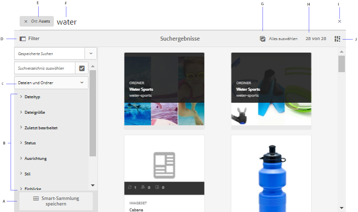
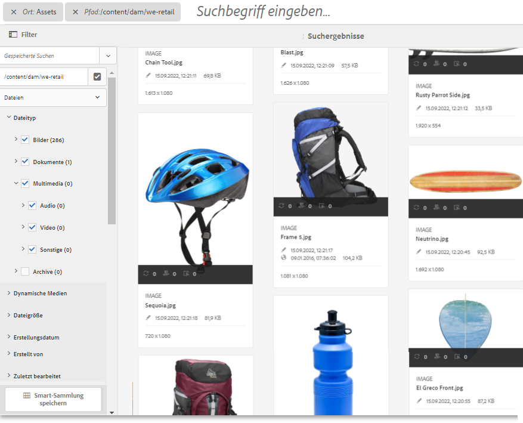
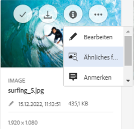
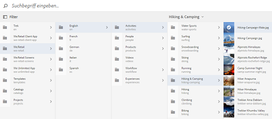
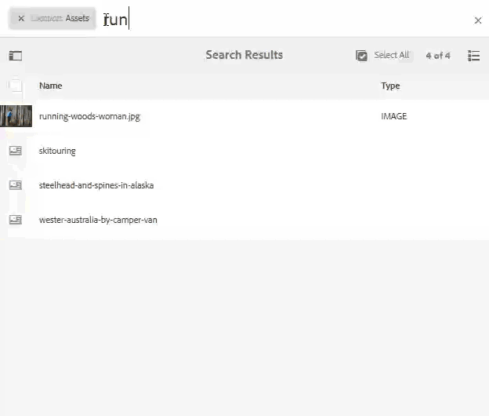

# Suche nach Assets in AEM {#search-assets-in-aem}

Adobe Experience Manager (AEM) Assets bieten robuste Methoden zur Ermittlung von Assets, mit denen Sie eine höhere Inhaltsgeschwindigkeit erzielen können. Ihre Teams reduzieren die Time-to-Market mit einer nahtlosen, intelligenten Sucherfahrung, indem Sie vordefinierte Funktionen und benutzerdefinierte Methoden verwenden. Die Suche nach Assets ist ein zentraler Faktor für die Nutzung eines digitalen Asset-Managements – sowohl für eine weitere Verwendung durch kreative Elemente als auch für eine robuste Verwaltung von Assets durch die Geschäftsbenutzer und Marketingexperten oder für die Verwaltung durch DAM-Administratoren. Einfache, erweiterte und benutzerdefinierte Suchen, die Sie über die Benutzeroberfläche von AEM Assets oder andere Apps und Oberflächen durchführen können, helfen bei der Erfüllung dieser Anwendungsfälle.

AEM unterstützt die folgenden Anwendungsfälle und in diesem Artikel werden die Verwendung, Konzepte, Konfigurationen, Einschränkungen und die Fehlerbehebung für diese Anwendungsfälle beschrieben.

| Suchen nach Assets | Konfiguration und Verwaltung | Arbeiten mit Suchergebnissen |
|---|---|---|
| [Grundlegende Suchvorgänge](#searchbasics) | [Suchindex](#searchindex) | [Ergebnisse sortieren](#sort) |
| [Benutzeroberfläche für die Suche](#searchui) | [Visuelle Suche oder Ähnlichkeitssuche](#configvisualsearch) | [Eigenschaften und Metadaten eines Assets überprüfen](#checkinfo) |
| [Suchvorschläge](#searchsuggestions) | [Obligatorische Metadaten](#mandatorymetadata) | [Download](#download) |
| [Suchergebnisse und Verhalten verstehen](#searchbehavior) | [Suchfacetten ändern](#searchfacets) | [Aktualisierung von Massenmetadaten](#metadataupdates) |
| [Suchrang und -verstärkung](#searchrank) | [Textextrahierung](#extracttextupload) | [Intelligente Sammlungen](#collections) |
| [Erweiterte Suche: Filtern und Umfang der Suche](#scope) | [Benutzerdefinierte Vorhersagen](#custompredicates) | [Unerwartete Ergebnisse und Fehlerbehebung verstehen](#troubleshoot-unexpected-search-results-and-issues) |
| [Suchen Sie nach anderen Lösungen und Apps](#beyondomnisearch):<ul><li>[Adobe Asset Link](#aal)</li><li>[Brand Portal](#brandportal)</li><li>[AEM Desktop App](#desktopapp)</li><li>[Adobe Stock Images](#adobestock)</li><li>[Dynamische Medienelemente](#dynamicmedia)</li></ul> |  |  |
| [Asset-Auswahl/Auswahl](#assetselector) |  |  |
| [Einschränkungen](#limitations) und [Tipps](#tips) |  |  |
| [Beispiele](#samples) |  |  |

Suchen Sie mithilfe des Felds Omniture Search oben auf der AEM-Weboberfläche nach Assets. Gehen Sie zu **[!UICONTROL Assets]** > **[!UICONTROL Files]** in AEM, klicken Sie auf das Suchsymbol in der oberen Leiste, geben Sie den Suchbegriff ein und drücken Sie die Eingabetaste. Alternativ können Sie den Suchbegriff-Shortcut / (Schrägstrich) verwenden, um das Omniture-Suchfeld zu öffnen. Ort: Assets sind vorausgewählt, um die Suchen auf DAM-Assets zu beschränken. AEM bietet Vorschläge, wenn Sie mit der Eingabe eines Suchbegriffs beginnen.

Verwenden Sie das Bedienfeld &quot; **[!UICONTROL Filter]** &quot;, um die Suche einzuschränken, indem Sie die Suchergebnisse auf Grundlage der verschiedenen Optionen (Prädikate) filtern, z. B. Dateityp, Dateigröße, Datum der letzten Änderung, Status des Assets, Insight-Daten und Adobe Stock-Lizenzierung. Ihre Administratoren können das Filterbedienfeld anpassen und mithilfe von Suchfacetten Suchvorhersagen hinzufügen oder entfernen.

Die AEM-Suchfunktion unterstützt die Suche nach Sammlungen und die Suche nach Assets in einer Sammlung. Siehe [Suchsammlungen](/help/assets/managing-collections-touch-ui.md).

## Suchschnittstelle verstehen {#searchui}

Machen Sie sich mit der Suchschnittstelle und den verfügbaren Aktionen vertraut.

*Abbildung: Die Oberfläche für die Suchergebnisse zu Teilen von Assets*

**A.** Speichern Sie die Suche als Smart-Sammlung. **B.** Filter (Eigenschaften) zur Eingrenzung der Suchergebnisse. **C.** Zeigen Sie Dateien, Ordner oder beides in den Suchergebnissen an. **D.** Klicken Sie auf „Filter“, um die linke Leiste zu öffnen oder zu schließen. **E.** Die Suchposition ist DAM. **F.** Omniture Suchfeld mit benutzerdefiniertem Suchbegriff. **G.** Markieren Sie das Kontrollkästchen, um alle Suchergebnisse auszuwählen. **H.** Anzahl der angezeigten Suchergebnisse aus den gesamten Suchergebnissen. **Ich.** Schließen Sie die Suche **J.** Wechseln Sie zwischen Karten- und Listenansicht.

### Facets der dynamischen Suche {#dynamicfacets}

Sie können die gewünschten Assets schneller auf der Suchergebnisseite ausfindig machen, indem Sie die dynamisch aktualisierte Anzahl der erwarteten Suchergebnisse in den Suchfacetten verwenden. Die erwartete Anzahl an Assets wird noch vor Anwendung des Suchfilters aktualisiert. Durch Anzeige der erwarteten Anzahl im Filter können Sie schnell und effizient durch Suchergebnisse navigieren. Weitere Informationen finden Sie unter [Suche nach Assets in AEM](search-assets.md).

*Abbildung: Sehen Sie sich die ungefähre Anzahl der Assets an, ohne die Suchergebnisse in den Suchfacetten zu filtern.*

## Suchergebnisse und Verhalten verstehen {#searchbehavior}

### Grundlegende Suchbegriffe und Ergebnisse {#searchbasics}

Sie können Suchbegriffssuchen im OmniSearch-Feld ausführen. Bei der Stichwortsuche wird nicht zwischen Groß- und Kleinschreibung unterschieden und es handelt sich um eine Volltextsuche (über die beliebten Metadatenfelder hinweg). Wenn mehr als ein Suchbegriff gesucht wird, wird der Standardoperator zwischen den Suchbegriffen `AND` für die Standardsuche verwendet, `OR` wenn Assets mit intelligenten Tags versehen sind.

Die Ergebnisse werden nach Relevanz sortiert, beginnend mit den nächsten Übereinstimmungen. Bei mehreren Suchbegriffen sind die Assets, die beide Begriffe in ihren Metadaten enthalten, relevanter. In Metadaten werden Suchbegriffe, die als Smart-Tags angezeigt werden, höher eingestuft als Suchbegriffe, die in anderen Metadatenfeldern angezeigt werden. Mit AEM können Sie einem bestimmten Suchbegriff mehr Gewicht verleihen. Außerdem ist es möglich, den Rang [einiger gezielter Assets für bestimmte Suchbegriffe zu](#searchrank) erhöhen.

Um die relevanten Assets schnell zu finden, bietet die Rich-Oberfläche Filter-, Sortierungs- und Auswahlmechanismen. Sie können Ergebnisse nach mehreren Kriterien filtern und die Anzahl der gesuchten Assets nach verschiedenen Filtern anzeigen. Alternativ dazu können Sie die Suche erneut ausführen, indem Sie die Abfrage im Feld Omniture Search ändern. Wenn Sie Ihre Suchbegriffe oder Filter ändern, bleiben die anderen Filter angewendet, um den Kontext Ihrer Suche zu erhalten.

Wenn die Ergebnisse viele Assets sind, zeigt AEM die ersten 100 in der Kartenansicht und 200 in der Listenansicht an. Wenn Benutzer einen Bildlauf durchführen, werden weitere Assets geladen. Dadurch soll die Leistung verbessert werden.

>[!VIDEO](https://www.youtube.com/watch?v=LcrGPDLDf4o)

Manchmal werden in den Suchergebnissen einige unerwartete Assets angezeigt. Weitere Informationen finden Sie unter [Unerwartete Ergebnisse](#troubleshoot-unexpected-search-results-and-issues).

AEM kann viele Dateiformate suchen und die Suchfilter können an Ihre geschäftlichen Anforderungen angepasst werden. Wenden Sie sich an Ihren Administrator, um zu verstehen, welche Suchoptionen für Ihr DAM-Repository verfügbar sind und welche Einschränkungen Ihr Konto hat.

### Ergebnisse mit und ohne erweiterte intelligente Tags {#withsmarttags}

Die AEM-Suche kombiniert die Suchbegriffe standardmäßig mit einer UND-Klausel. Suchen Sie beispielsweise nach einer Frau mit Keywords. In den Suchergebnissen werden standardmäßig nur die Assets angezeigt, bei denen in den Metadaten sowohl weibliche als auch ausgeführte Suchbegriffe aufgeführt sind. Das gleiche Verhalten wird beibehalten, wenn mit den Suchbegriffen Sonderzeichen (Punkte, Unterstriche oder Gedankenstriche) verwendet werden. Die folgenden Suchabfragen geben die gleichen Ergebnisse zurück:

* `woman running`
* `woman.running`
* `woman-running`

Die Abfrage `woman -running` gibt jedoch Assets ohne `running` Metadaten zurück.
Using smart tags adds an extra `OR` clause to find any of the search terms as the applied smart tags. Ein Asset, das mit intelligenten Tags versehen wurde `woman` oder `running` diese verwendet, wird ebenfalls in einer solchen Suchanfrage angezeigt. Die Suchergebnisse sind also eine Kombination aus

* Assets mit `woman` und `running` Schlüsselwörtern in den Metadaten (Standardverhalten)

* Assets smart getaggt mit einem der Suchbegriffe (Verhalten von intelligenten Tags).

### Search suggestions as you type {#searchsuggestions}

Wenn Sie mit der Eingabe von Suchbegriffen beginnen, schlägt AEM die möglichen Suchbegriffe oder -ausdrücke vor. Die Vorschläge basieren auf den Metadaten der vorhandenen Assets. AEM indiziert alle Metadatenfelder, um die Suche zu unterstützen. Zur Bereitstellung von Suchvorschlägen verwendet das System die Werte der folgenden Metadatenfelder. Um Suchvorschläge zu erhalten, sollten Sie die folgenden Felder mit geeigneten Suchbegriffen füllen:

* Asset-Tags. (Maps zu `jcr:content/metadata/cq:tags`)
* Asset-Titel. (Maps zu `jcr:content/metadata/dc:title`)
* Asset-Beschreibung. (Maps zu `jcr:content/metadata/dc:description`)
* Titel im JCR-Repository. Der Wert wird möglicherweise dem Asset-Titel zugeordnet. (Maps zu `jcr:content/jcr:title`)
* Beschreibung im JCR-Repository. Der Wert wird möglicherweise der Asset-Beschreibung zugeordnet. (Maps zu `jcr:content/jcr:description`)

Um Vorschläge für mehr als einen Suchbegriff zu erhalten, geben Sie weiterhin alle Suchbegriffe ein, ohne einen Vorschlag für einen einzelnen Suchbegriff auszuwählen.

*Abbildung: Geben Sie mehrere Suchbegriffe ein, um Vorschläge anzuzeigen, die allen entsprechen*

### Suchranking und -verstärkung {#searchrank}

Die Suchergebnisse, die in Metadatenfeldern alle Suchbegriffe aufweisen, werden zuerst angezeigt. Danach folgen die Suchergebnisse, die einem oder mehr Suchbegriffen in den Smart-Tags entsprechen. Im obigen Beispiel werden die Suchergebnisse ungefähr in dieser Reihenfolge angezeigt:

1. Matches of `woman running` in the various metadata fields.
1. Sucht nach `woman running` Smart-Tags.
1. Matches of `woman` or of `running` in smart tags.

Sie können die Relevanz von Suchbegriffen für bestimmte Assets verbessern, um die auf Suchbegriffen basierenden Suchen zu optimieren. D. h. die Bilder, für die Sie bestimmte Suchbegriffe festlegen, erscheinen bei der Suche nach diesen Suchbegriffen oben in den Suchergebnissen.

1. Öffnen Sie in der Benutzeroberfläche „Assets“ die Seite „Eigenschaften“ für das Asset. Klicken Sie auf **[!UICONTROL Erweitert]** und dann auf **[!UICONTROL Hinzufügen]** unter **[!UICONTROL Erhöhen für Suchbegriffe]**.
1. Geben Sie im Feld **[!UICONTROL Suche priorisieren]** einen Suchbegriff ein, für den Sie die Bildsuche optimieren möchten, und klicken oder tippen Sie anschließend auf **[!UICONTROL Hinzufügen]**. Sie können mehrere Suchbegriffe auf dieselbe Weise angeben.
1. Klicken/tippen Sie auf **[!UICONTROL Speichern und schließen]**. Das Asset, das Sie für diesen Suchbegriff beworben haben, wird unter den Top-Suchergebnissen angezeigt.

Sie können dies zu Ihrem Vorteil nutzen, indem Sie den Rang einiger Assets in den Suchergebnissen für den zielgerichteten Suchbegriff erhöhen. Siehe Beispiel-Video unten. For detailed info, see [search in AEM](https://helpx.adobe.com/experience-manager/kt/assets/using/search-feature-video-use.html).

>[!VIDEO](https://video.tv.adobe.com/v/16766/?quality=6)

*Verstehen Sie, wie Suchergebnisse bewertet werden und wie der Rang beeinflusst werden kann.*

## Erweiterte Suche {#scope}

AEM bietet verschiedene Methoden wie Filter, die für die gesuchten Assets gelten, um die gewünschten Assets schneller zu finden. Nachfolgend werden einige häufig verwendete Methoden beschrieben. Nachfolgend werden einige [illustrierte Beispiele](#samples) vorgestellt.

**Suchen nach Dateien oder Ordnern**: In den Suchergebnissen finden Sie entweder Dateien, Ordner oder beides. Wählen Sie im **[!UICONTROL Filterbedienfeld]** die entsprechende Option aus. Siehe [Suchschnittstelle](#searchui).

**Suchen nach Assets in einem Ordner**: Sie können die Suche auf einen bestimmten Ordner beschränken. Fügen Sie im **[!UICONTROL Filter]** -Bedienfeld den Pfad eines Ordners hinzu. Sie können jeweils nur einen Ordner auswählen.

*Abbildung: Beschränken Sie die Suchergebnisse auf einen Ordner, indem Sie im Filterbedienfeld einen Ordnerpfad hinzufügen*

### Ähnliche Bilder suchen {#visualsearch}

Wenn Sie Bilder suchen möchten, die einem vom Benutzer ausgewählten Bild ähneln, klicken Sie in der Kartenansicht eines Bildes oder in der Symbolleiste auf **[!UICONTROL Ähnliche suchen]**. AEM zeigt die Bilder mit Smart-Tags aus dem DAM-Repository an, die einem vom Benutzer ausgewählten Bild ähnlich sind. Siehe [Konfigurieren der Ähnlichkeitssuche](#configvisualsearch).

*Abbildung: Ähnliche Bilder mit der Option in der Kartenansicht suchen*

### Adobe Stock Images {#adobestock}

From within the AEM user interface, users can search [Adobe Stock assets](/help/assets/aem-assets-adobe-stock.md) and license the required assets. Fügen Sie `Location: Adobe Stock` in die Omniture Suchleiste ein. Sie können auch das Filterbedienfeld verwenden, um alle lizenzierten oder nicht lizenzierten Assets zu suchen oder ein bestimmtes Asset mit der Adobe Stock-Dateinummer zu suchen.

### Dynamische Medienelemente {#dmassets}

Sie können nach Bildern mit dynamischen Medien filtern, indem Sie im Bedienfeld **[!UICONTROL Filter]** auf **[!UICONTROL Dynamische Medien > Sets]** klicken. Durch diesen Filtervorgang werden Assets wie Bildsets, Karusselle, gemischte Mediensets und Rotationssets angezeigt.

### Suchen mit bestimmten Werten in Metadatenfeldern {#gqlsearch}

Sie können nach Assets suchen, die auf exakten Werten bestimmter Metadatenfelder wie Titel, Beschreibung und Autor basieren. Die Volltextsuche-Funktion GQL ruft nur die Assets ab, deren Metadatenwert exakt mit Ihrer Suchabfrage übereinstimmt. Bei den Namen der Eigenschaften (z. B. Autor, Titel usw.) und den Werten wird zwischen Groß- und Kleinschreibung unterschieden.

| Metadatenfeld | Factsheet-Wert und Nutzung |
|---|---|
| Titel | title:John |
| Ersteller | creator:John |
| Standort | Ort:NA |
| Beschreibung | description:„Sample Image“ |
| Erstellungswerkzeug | creatortool:&quot;Adobe Fotoshop CC 2015&quot; |
| Urheberrechtsbesitzer | copyrightowner:„Adobe Systems“ |
| Mitarbeiter | contributor:John |
| Nutzungsbedingungen | usageterms:„CopyRights Reserved“ |
| Erstellt | created:YYYY-MM-DDTHH |
| Ablaufdatum | expires:YYYY-MM-DDTHH |
| Einschaltzeit | ontime:YYYY-MM-DDTHH |
| Ausschaltzeit | offtime:YYYY-MM-DDTHH |
| Zeitraum (expires dateontime,offtime) | facet field : lowerbound..upperbound |
| Pfad | /content/dam/&lt;Ordnername> |
| PDF-Titel | pdftitle:„Adobe Document“ |
| Betreff | subject:„Training“ |
| Tags | tags:„Location And Travel“ |
| Typ | type:&quot;image\png&quot; |
| Bildbreite | width:lowerbound..upperbound |
| Bildhöhe | height:lowerbound..upperbound |
| Person | person:John |

Der Eigenschaftenpfad, die Beschränkung, die Größe und die Reihenfolge können nicht mit einer anderen Eigenschaft ODERed festgelegt werden.

Das Keyword für eine von einem Benutzer erstellte Eigenschaft ist ihre Feldbeschriftung im Eigenschafteneditor in Kleinbuchstaben und ohne Leerzeichen.

Im Folgenden finden Sie einige Beispiele für Suchformate für komplexe Abfragen:

* So zeigen Sie alle Assets mit mehreren Facettenfeldern an (wie: title=John Doe und creator tool = Adobe Photoshop): `tiltle:"John Doe" creatortool : Adobe*`
* To display all assets when the facets value is not a single word but a sentence (for example: title=Scott Reynolds): `title:"Scott Reynolds"`
* To display assets with multiple values of a single property (for example: title=Scott Reynolds or John Doe): `title:"Scott Reynolds" OR "John Doe"`
* To display assets with property values starting with a specific string (for example: title is Scott Reynolds): `title:Scott*`
* To display assets with property values ending with a specific string (for example: title is Scott Reynolds): `title:*Reynolds`
* To display assets with a property value that contains a specific string (for example: title = Basel Meeting Room): `title:*Meeting*`
* To display assets that contain a particular string and have a specific property value (for example: search for string Adobe in assets having title=John Doe): `*Adobe* title:"John Doe"`

## Suchen von Assets aus anderen AEM-Angeboten oder -Schnittstellen {#beyondomnisearch}

Adobe Experience Manager (AEM) verbindet das DAM-Repository mit verschiedenen anderen AEM-Lösungen, um den Zugriff auf digitale Assets zu beschleunigen und die kreativen Arbeitsabläufe zu optimieren. Jede Elementerkennung beginnt mit der Suche oder Suche. Das Suchverhalten bleibt über die verschiedenen Oberflächen und Lösungen hinweg weitgehend gleich. Einige Suchmethoden ändern sich je nach Zielgruppe, Anwendungsfällen und Benutzeroberfläche der AEM-Lösungen. Die spezifischen Methoden werden für die einzelnen Lösungen unter den unten stehenden Links dokumentiert. Die allgemein anwendbaren Tipps und Verhaltensweisen werden in diesem Artikel beschrieben.

### Suchen von Assets im Bedienfeld &quot;Adobe Asset Link&quot; {#aal}

Mit Adobe Asset Link können Kreativprofis jetzt auf in AEM Assets gespeicherte Inhalte zugreifen, ohne die unterstützten Adobe Creative Cloud-Apps verlassen zu müssen. Mit dem In-App-Bedienfeld in Creative Cloud-Apps können Kreative Assets nahtlos durchsuchen, suchen, auschecken und einchecken: Fotoshop, Illustrator und InDesign. Asset Link ermöglicht es Benutzern auch, visuell ähnliche Ergebnisse zu suchen. Die Ergebnisse der visuellen Suchanzeige basieren auf den maschinellen Lernalgorithmen von Adobe Sensei und helfen Benutzern, ästhetisch ähnliche Bilder zu finden. Siehe [Suchen und Durchsuchen von Assets](https://helpx.adobe.com/enterprise/using/manage-assets-using-adobe-asset-link.html#UseAdobeAssetLink) mithilfe von Adobe Asset Link.

### Suchen von Assets in der AEM-Desktop-App {#desktopapp}

Kreativprofis verwenden die Desktop-App, um AEM Assets einfach auf ihrem lokalen Desktop (Win oder Mac) zu durchsuchen und verfügbar zu machen. Kreativelemente können die gewünschten Assets einfach in Mac Finder oder Windows Explorer anzeigen, in Desktop-Anwendungen öffnen und lokal ändern - die Änderungen werden mit einer neuen Version, die im Repository erstellt wurde, wieder in AEM gespeichert. Die Anwendung unterstützt grundlegende Suchvorgänge mit einem oder mehreren Suchbegriffen, * und ? Platzhalter und AND-Operator. Siehe [Durchsuchen, Suchen und Anzeigen einer Vorschau von Assets](https://docs.adobe.com/content/help/en/experience-manager-desktop-app/using/using.html#browse-search-preview-assets) in der Desktop-App.

### Search assets in Brand Portal {#brandportal}

Geschäftskunden und Marketingfachleute nutzen Brand Portal, um die genehmigten digitalen Assets effizient und sicher mit ihren erweiterten internen Teams, Partnern und Wiederverkäufern zu teilen. See [search assets on Brand Portal](https://docs.adobe.com/content/help/en/experience-manager-brand-portal/using/search-capabilities/brand-portal-searching.html).

### Adobe Stock Images durchsuchen {#adobestock-1}

Benutzer können aus der AEM-Benutzeroberfläche heraus Adobe Stock-Assets suchen und die erforderlichen Assets lizenzieren. Fügen Sie `Location: Adobe Stock` im Feld Omniture Search hinzu. Sie können auch das Bedienfeld &quot; **[!UICONTROL Filter]** &quot;verwenden, um alle lizenzierten oder nicht lizenzierten Assets zu suchen oder ein bestimmtes Asset mit der Adobe Stock-Dateinummer zu suchen. Siehe [Verwalten von Adobe Stock-Bildern in AEM](/help/assets/aem-assets-adobe-stock.md#usemanage).

### Dynamische Medienelemente durchsuchen {#dynamicmedia}

Sie können nach Bildern mit dynamischen Medien filtern, indem Sie im Bedienfeld **[!UICONTROL Filter]** auf **[!UICONTROL Dynamische Medien]** > **[!UICONTROL Sets]** klicken. Durch diesen Filtervorgang werden Assets wie Bildsets, Karusselle, gemischte Mediensets und Rotationssets angezeigt. Beim Erstellen von Webseiten können Autoren im Content Finder nach Sets suchen. Ein Filter für Sets ist in einem Pop-up-Menü verfügbar.

### Suchen von Assets in der Inhaltssuche beim Erstellen von Webseiten {#contentfinder}

Autoren können mit der Inhaltssuche das DAM-Repository nach den relevanten Assets durchsuchen und die Assets auf den von ihnen erstellten Webseiten verwenden. Autoren können auch die Funktion &quot;Connected Assets&quot;verwenden, um nach Assets zu suchen, die in einer Remote-AEM-Bereitstellung verfügbar sind. Autoren können diese Assets dann auf Webseiten in einer lokalen AEM-Bereitstellung verwenden. See [use remote assets](/help/assets/use-assets-across-connected-assets-instances.md#use-remote-assets).

### Sammlungen durchsuchen {#collections}

Die AEM-Suchfunktion unterstützt die Suche nach Sammlungen und die Suche nach Assets in einer Sammlung. Siehe [Suchsammlungen](/help/assets/managing-collections-touch-ui.md).

## Asset selector {#assetselector}

Mit der Asset-Auswahl können Sie die DAM-Assets auf besondere Weise suchen, filtern und durchsuchen. Asset-Auswahl ist verfügbar unter `https://[aem-server]:[port]/aem/assetpicker.html`. Sie können die Metadaten der ausgewählten Assets mithilfe der Asset-Auswahl abrufen. Sie können sie mit unterstützten Anforderungsparametern wie dem Asset-Typ (Bild, Video, Text) und dem Auswahlmodus (eine oder mehrere Auswahlen) starten. Diese Parameter legen den Kontext der Asset-Auswahl für eine bestimmte Suchinstanz fest und bleiben während der Auswahl intakt.

Die Asset-Auswahl verwendet die HTML5-Meldung Window.postMessage, um Daten für das ausgewählte Asset an den Empfänger zu senden. Der Asset-Wähler basiert auf dem Vokabular der Foundation-Auswahl von Granite. Standardmäßig befindet sich der Asset-Wähler im Modus „Durchsuchen“. 

Sie können die folgenden Anforderungsparameter in einer URL übergeben, um den Asset-Wähler in einem bestimmten Kontext zu starten:

| Name | Werte | Beispiel | Zweck |
|---|---|---|---|
| resource suffix (B) | Ordnerpfad als Ressourcensuffix in der URL:[https://localhost:4502/aem/assetpicker.html/&lt;folder_path>](https://localhost:4502/aem/assetpicker.html) | To launch the asset selector with a particular folder selected, for example with the folder `/content/dam/we-retail/en/activities` selected, the URL should be of the form: [https://localhost:4502/aem/assetpicker.html/content/dam/we-retail/en/activities?assettype=images](https://localhost:4502/aem/assetpicker.html/content/dam/we-retail/en/activities?assettype=images) | Wenn beim Starten des Asset-Wählers ein bestimmter Ordner ausgewählt sein soll, können Sie ihn als Ressourcensuffix übergeben. |
| mode | single, multiple | <ul><li>[https://localhost:4502/aem/assetpicker.html?mode=single](https://localhost:4502/aem/assetpicker.html?mode=single)</li><li>[https://localhost:4502/aem/assetpicker.html?mode=multiple](https://localhost:4502/aem/assetpicker.html?mode=multiple)</li></ul> | Im Modus „multiple“ können Sie mit dem Asset-Wähler mehrere Assets gleichzeitig auswählen. |
| mimetype | mimetype(s) (`/jcr:content/metadata/dc:format`) of an asset (wildcard also supported) | <ul><li>[https://localhost:4502/aem/assetpicker.html?mimetype=image/png](https://localhost:4502/aem/assetpicker.html?mimetype=image/png)</li><li>[https://localhost:4502/aem/assetpicker.html?mimetype=*png](https://localhost:4502/aem/assetpicker.html?mimetype=*png)</li><li>[https://localhost:4502/aem/assetpicker.html?mimetype=*presentation](https://localhost:4502/aem/assetpicker.html?mimetype=*presentation)</li><li>[https://localhost:4502/aem/assetpicker.html?mimetype=*presentation&amp;mimetype=*png](https://localhost:4502/aem/assetpicker.html?mimetype=*presentation&mimetype=*png)</li></ul> | Verwenden Sie diese Option zum Filtern von Assets anhand von MIME-Typen. |
| dialog | true, false | [https://localhost:4502/aem/assetpicker.html?dialog=true](https://localhost:4502/aem/assetpicker.html?dialog=true) | Verwenden Sie diese Parameter, um die Asset-Auswahl als Granite-Dialog zu öffnen. Diese Option ist nur verfügbar, wenn Sie die Asset-Auswahl über das Granite Path Field starten und als pickerSrc-URL konfigurieren. |
| assettype (S) | images, documents, multimedia, archives | <ul><li>[https://localhost:4502/aem/assetpicker.html?assettype=images](https://localhost:4502/aem/assetpicker.html?assettype=images)</li><li>[https://localhost:4502/aem/assetpicker.html?assettype=documents](https://localhost:4502/aem/assetpicker.html?assettype=documents)</li><li>[https://localhost:4502/aem/assetpicker.html?assettype=multimedia](https://localhost:4502/aem/assetpicker.html?assettype=multimedia)</li><li>[https://localhost:4502/aem/assetpicker.html?assettype=archives](https://localhost:4502/aem/assetpicker.html?assettype=archives)</li></ul> | Verwenden Sie diese Option, um die Asset-Typen basierend auf dem übergebenen Wert zu filtern. |
| root | &lt;Ordnerpfad> | [https://localhost:4502/aem/assetpicker.html?assettype=images&amp;root=/content/dam/we-retail/en/activities](https://localhost:4502/aem/assetpicker.html?assettype=images&root=/content/dam/we-retail/en/activities) | Verwenden Sie diese Option, um den Stammordner für den Asset-Wähler anzugeben. In diesem Fall können Sie mit dem Asset-Wähler nur untergeordnete Assets (direkt/indirekt) unter dem Stammordner auswählen. |

To access the asset selector interface, go to `https://[aem_server]:[port]/aem/assetpicker`. Navigieren Sie zum gewünschten Ordner und wählen Sie mindestens ein Asset aus. Alternativ können Sie im Feld OmnitureSearch nach dem gewünschten Asset suchen, den Filter nach Bedarf anwenden und es dann auswählen.

*Abbildung: Asset in der Asset-Auswahl durchsuchen und auswählen*

## Beschränkungen {#limitations}

Die Suchfunktion in AEM Assets unterliegt folgenden Einschränkungen:

* Geben Sie in der Suchabfrage keinen Leerzeichen ein, da sonst die Suche nicht funktioniert.
* AEM kann den Suchbegriff weiterhin anzeigen, nachdem Sie Eigenschaften eines Assets aus den Suchergebnissen ausgewählt und dann die Suche abgebrochen haben. <!-- (CQ-4273540) -->
* Bei der Suche nach Ordnern, Dateien und Ordnern können die Suchergebnisse nicht nach Parametern sortiert werden.
* Wenn Sie die Eingabetaste drücken, ohne etwas in die Omniture Suchleiste einzugeben, gibt AEM eine Liste mit nur Dateien und nicht Ordnern zurück. Wenn Sie gezielt nach Ordnern suchen, ohne einen Suchbegriff zu verwenden, gibt AEM keine Ergebnisse zurück.
* Mit dem Kontrollkästchen &quot;Alle  auswählen&quot;können Sie nur die ersten 100 gesuchten Assets in der Kartenansicht und die ersten 200 gesuchten Assets in der Listenansicht auswählen. Wenn Sie einen Bildlauf durchführen und weitere Assets in der Benutzeroberfläche laden, können Sie mit der Option &quot;Alle [!UICONTROL auswählen] &quot;weitere Elemente auswählen.

Die visuelle Suche oder Ähnlichkeitssuche weist die folgenden Einschränkungen auf:

* Die visuelle Suche funktioniert am besten mit größeren Repositorys. Obwohl für gute Ergebnisse keine Mindestanzahl von Bildern erforderlich ist, ist die Qualität von Übereinstimmungen mit einigen Bildern möglicherweise nicht so gut wie die Übereinstimmungen mit einem großen Repository.
* Sie können das Modell nicht ändern oder AEM so schulen, dass ähnliche Bilder gefunden werden. Das Hinzufügen oder Entfernen intelligenter Tags zu einigen Assets ändert das Modell beispielsweise nicht. Die Assets werden aus den visuell ähnlichen Suchergebnissen ausgeschlossen.

Die Suchfunktion weist in den folgenden Szenarien möglicherweise Leistungseinschränkungen auf:

* Die Kartenansicht hat eine schnellere Ladezeit als die Listenansicht, um die Suchergebnisse anzuzeigen.

## Suchtipps {#tips}

* Wenn Sie den Prüfungsstatus von Assets überwachen, verwenden Sie die entsprechende Option, um herauszufinden, welche Assets genehmigt wurden und für welche Assets die Genehmigung aussteht.
* Verwenden Sie das Prädikat Einblicke, um basierend auf den Nutzungsstatistiken diverser kreativer Applikationen nach unterstützten Assets zu suchen. Nutzungsdaten werden unter Nutzungsprozentsatz, Impressionen, Klicks und Medienkanäle gruppiert, in denen die Assets Kategorien angezeigt werden.
* Aktivieren Sie das Kontrollkästchen &quot;Alle **[!UICONTROL auswählen]** &quot;, um die gesuchten Assets auszuwählen. Es werden die ersten 100 Assets in der Kartenansicht und die ersten 200 Assets in der Listenansicht ausgewählt. Sie können die Auswahl bearbeiten, indem Sie beispielsweise die ausgewählten Assets herunterladen, die Metadateneigenschaften stapelweise für die ausgewählten Assets aktualisieren oder die ausgewählten Assets einer Sammlung hinzufügen.
* Informationen zum Suchen nach Assets, die keine obligatorischen Metadaten enthalten, finden Sie unter [Erforderliche Metadaten](#mandatorymetadata).
* Die Suche verwendet alle Metadatenfelder. Eine allgemeine Suche, z. B. nach 12, gibt in der Regel viele Ergebnisse zurück. Für bessere Ergebnisse sollten Sie doppelte (nicht einfache) Anführungszeichen verwenden oder sicherstellen, dass die Zahl mit einem Wort ohne Sonderzeichen (z. B. *schuh12*) verknüpft ist.
* Die Volltextsuche unterstützt Operatoren wie -, ^ usw. Um diese Buchstaben als alphabetische Zeichenfolgen zu suchen, setzen Sie den Suchausdruck in doppelte Anführungszeichen. Verwenden Sie zum Beispiel &quot;Notebook - Schönheit&quot; anstelle von Notebook - Schönheit.
* Wenn die Suchergebnisse zu viele sind, beschränken Sie den [Suchbereich](#scope) auf null in den gewünschten Assets. Es funktioniert am besten, wenn Sie eine Vorstellung davon haben, wie Sie besser nach den gewünschten Assets suchen können, z. B. nach einem bestimmten Dateityp, einem bestimmten Speicherort, bestimmten Metadaten usw.

* **Tagging**: Mit Tags können Sie Assets kategorisieren, die effizienter durchsucht und durchsucht werden können. Tagging hilft bei der Verbreitung der entsprechenden Taxonomie an andere Benutzer und Arbeitsabläufe. AEM bietet Methoden zum automatischen Taggen von Assets mit den künstlich intelligenten Diensten von Adobe Sensei, die das Taggen von Assets mit Verwendung und Schulung immer besser machen. Wenn Sie nach Assets suchen, werden die Smart-Tags eingefasst, wenn die Funktion in Ihrem Konto aktiviert ist. Es funktioniert zusammen mit der integrierten Suchfunktion von AEM. Siehe [Suchverhalten](#searchbehavior). Um die Reihenfolge zu optimieren, in der die Suchergebnisse angezeigt werden, können Sie die Suchrangliste [einiger ausgewählter Assets](#searchrank) erhöhen.

* **Indizierung**: In den Suchergebnissen werden nur indizierte Metadaten und Assets zurückgegeben. Um eine bessere Abdeckung und Leistung zu erzielen, stellen Sie eine ordnungsgemäße Indexierung sicher und befolgen Sie die Best Practices. Siehe [Indexierung](#searchindex).

## Beispiele zur Veranschaulichung der Suche {#samples}

Verwenden Sie doppelte Anführungszeichen um Suchbegriffe, um Assets zu finden, die den genauen Wortlaut in der vom Benutzer angegebenen Reihenfolge enthalten.

*Abbildung: Suchverhalten mit und ohne Anführungszeichen*

**Suche mit Sternchen-Platzhalter**: Um die Suche zu erweitern, verwenden Sie ein Sternchen vor oder nach dem Suchwort, um eine beliebige Anzahl von Zeichen einzuhalten. Wenn Sie beispielsweise nach einer Ausführung ohne Sternchen suchen, werden keine Assets zurückgegeben, die Varianten des Wortes enthalten (auch in den Metadaten). Ein Sternchen ersetzt eine beliebige Anzahl von Zeichen. Beispiel:

* `run` liefert Assets mit genau ausgeführtem Suchbegriff
* `run*` gibt Assets mit Laufzeit, Ausführung, Abschaltung usw. zurück.
* `*run` gibt &quot;outrun&quot;zurück, führt erneut aus usw.
* `*run*` gibt alle möglichen Kombinationen zurück.

*Abbildung: Veranschaulichung der Verwendung eines Sternchen-Platzhalters bei der Asset-Suche anhand eines Beispiels*

**Suche mit Fragezeichen-Platzhalter**: Verwenden Sie eines oder mehrere &#39;?&#39;, um die Suche zu erweitern. Zeichen zur exakten Zeichenanzahl. Beispiel: In der folgenden Abbildung

* `run???` -Abfrage stimmt mit keinem Asset überein.

* `run????` -Abfrage entspricht dem Wort `running` mit vier Zeichen nach `run`.

* `??run` -Abfrage entspricht dem Wort `rerun` vor zwei Zeichen `run`.

*Abbildung: Veranschaulichen der Verwendung des Platzhalters für Fragezeichen bei der Asset-Suche anhand eines Beispiels*

**Einen Suchbegriff** ausschließen: Verwenden Sie einen Bindestrich, um nach Assets zu suchen, die keinen Suchbegriff enthalten. Beispielsweise gibt `running -shoe` die Abfrage Assets zurück, die `running`, aber nicht `shoe`enthalten. Gleichermaßen gibt `camp -night` die Abfrage Assets zurück, die enthalten sind, `camp` aber nicht `night`. Beachten Sie, dass die `camp-night` Abfrage Assets zurückgibt, die sowohl `camp` als auch `night`enthalten.

*Abbildung: Verwendung eines Bindestrichs zur Suche nach Assets, die keinen ausgeschlossenen Suchbegriff enthalten*

## Konfigurations- und Verwaltungsaufgaben im Zusammenhang mit Suchfunktionen {#configadmin}

### Suchindexkonfigurationen {#searchindex}

Die Ermittlung von Assets beruht auf der Indexierung von DAM-Inhalten, einschließlich der Metadaten. Die schnellere und genaue Erkennung von Assets beruht auf optimierter Indexierung und geeigneten Konfigurationen. Siehe [Suchindex](/help/assets/performance-tuning-guidelines.md#search-indexes), [Eichenabfragen und Indexierung](/help/sites-deploying/queries-and-indexing.md)und [Best Practices](/help/sites-deploying/best-practices-for-queries-and-indexing.md).

### Visuelle Suche oder Ähnlichkeitssuche {#configvisualsearch}

Die visuelle Suche verwendet intelligentes Tagging und erfordert AEM 6.5.2.0 oder höher. Führen Sie nach der Konfiguration der Funktion für intelligentes Tagging die folgenden Schritte aus.

1. Fügen Sie in AEM CRXDE im `/oak:index/lucene` Knoten die folgenden Eigenschaften und Werte hinzu und speichern Sie die Änderungen.

   * `costPerEntry` Eigenschaft des Typs `Double` mit dem Wert `10`.

   * `costPerExecution` Eigenschaft des Typs `Double` mit dem Wert `2`.

   * `refresh` Eigenschaft des Typs `Boolean` mit dem Wert `true`.
   Diese Konfiguration ermöglicht Suchen vom entsprechenden Index.

1. Um einen Lucene-Index zu erstellen, erstellen Sie in CRXDE einen Knoten mit dem Namen `/oak:index/damAssetLucene/indexRules/dam:Asset/properties`des Typs `imageFeatures` `nt-unstructured`. Im `imageFeatures` Knoten

   * Fügen Sie die `name` Eigenschaft des Typs `String` mit dem Wert hinzu `jcr:content/metadata/imageFeatures/haystack0`.

   * Fügen Sie die `nodeScopeIndex` Eigenschaft des Typs `Boolean` mit dem Wert `true`&quot;hinzu.

   * Fügen Sie die `propertyIndex` Eigenschaft des Typs `Boolean` mit dem Wert `true`&quot;hinzu.

   * Fügen Sie die `useInSimilarity` Eigenschaft des Typs `Boolean` mit dem Wert hinzu `true`.
   Speichern Sie die Änderungen.

1. Zugriff `/oak:index/damAssetLucene/indexRules/dam:Asset/properties/predictedTags` und Hinzufügen `similarityTags` der Eigenschaft vom Typ `Boolean` mit dem Wert `true`.
1. Wenden Sie intelligente Tags auf die Assets in Ihrem AEM-Repository an. Erfahren Sie, [wie Sie Smarttags](https://docs.adobe.com/content/help/en/experience-manager-learn/assets/metadata/smart-tags-technical-video-setup.html)konfigurieren.
1. Legen Sie in CRXDE im `/oak-index/damAssetLucene` Knoten die `reindex` Eigenschaft auf `true`. Speichern Sie die Änderungen.
1. (Optional) Wenn Sie über ein benutzerdefiniertes Suchformular verfügen, kopieren Sie die `/libs/settings/dam/search/facets/assets/jcr%3Acontent/items/similaritysearch` Node in `/conf/global/settings/dam/search/facets/assets/jcr:content/items`. Speichern Sie alle Änderungen.

Weitere Informationen zu [Smart-Tags in AEM](https://helpx.adobe.com/experience-manager/kt/assets/using/smart-tags-feature-video-understand.html) und zur [Verwaltung von Smart-Tags](/help/assets/managing-smart-tags.md).

### Obligatorische Metadaten {#mandatorymetadata}

Geschäftsbenutzer, Administratoren oder DAM-Bibliothekare können einige Metadaten als obligatorische Metadaten definieren, die für die Geschäftsprozesse erforderlich sind. Aus verschiedenen Gründen fehlen bei einigen Assets diese Metadaten, z. B. ältere Assets oder Assets, die stapelweise migriert werden. Assets mit fehlenden oder ungültigen Metadaten werden basierend auf der Eigenschaft für indizierte Metadaten erkannt und gemeldet. Informationen zum Konfigurieren finden Sie unter [Erforderliche Metadaten](/help/assets/metadata-schemas.md#define-mandatory-metadata).

### Suchfacetten ändern {#searchfacets}

Um die Suchgeschwindigkeit zu erhöhen, bietet AEM Assets Suchfacetten an, mit denen Sie die Suchergebnisse filtern können. Das Filterbedienfeld enthält standardmäßig einige Standardfacetten. Administratoren können das Filterbedienfeld anpassen, um die Standardfacetten mithilfe der integrierten Prädikate zu ändern. AEM bietet eine gute Sammlung integrierter Prädikate und einen Editor zum Anpassen der Facetten. Siehe [Suchfacetten](/help/assets/search-facets.md).

### Text beim Hochladen von Assets extrahieren {#extracttextupload}

Sie können AEM so konfigurieren, dass der Text aus den Assets extrahiert wird, wenn Benutzer Assets wie PSD- oder PDF-Dateien hochladen. AEM indiziert den extrahierten Text und hilft Benutzern, diese Assets anhand des extrahierten Texts zu suchen. See [upload assets](/help/assets/managing-assets-touch-ui.md#uploading-assets).

### Benutzerdefinierte Vorhersagen zum Filtern von Suchergebnissen {#custompredicates}

Mit Eigenschaften werden Facetten erstellt. Administratoren können die Suchfacetten im Filterbedienfeld mithilfe vorkonfigurierter Prädikate anpassen. Diese Vorhersagen können mithilfe von Überlagerungen angepasst werden. Siehe [Erstellen benutzerdefinierter Prädikate](/help/assets/searchx.md).

Sie können basierend auf den folgenden Eigenschaften nach digitalen Assets suchen. Filter, die auf einige dieser Eigenschaften angewendet werden, sind standardmäßig verfügbar, und einige andere Filter können benutzerdefiniert erstellt werden, um sie auf die anderen Eigenschaften anzuwenden.

| Suchfeld | Sucheigenschaftswerte |
|---|---|
| MIME-Typen  | Bilder, Dokumente, Multimedia, Archive oder Sonstige |
| Zuletzt geändert | Stunde, Tag, Woche, Monat oder Jahr |
| Dateigröße | Klein, Mittel oder Groß |
| Veröffentlichungsstatus | Veröffentlicht oder Veröffentlichung rückgängig gemacht |
| Genehmigungsstatus | Genehmigt oder Abgelehnt |
| Ausrichtung | Horizontal, Vertikal oder Quadrat |
| Stil | Farbe oder Schwarzweiß |
| Videohöhe | Wird als Mindest- oder Höchstwert angegeben. Der Wert wird nur in den Metadaten der Videoausgabeformate gespeichert. |
| Videobreite | Wird als Mindest- oder Höchstwert angegeben. Der Wert wird nur in den Metadaten der Videoausgabeformate gespeichert. |
| Videoformat | DVI, Flash, MPEG4, MPEG, OGG, Quicktime, WMV, WebM Der Wert wird in den Metadaten des Quellvideos und aller Darstellungen gespeichert. |
| Video-Codec | x264 Der Wert wird nur in den Metadaten der Videoausgabeformate gespeichert. |
| Video-Bitrate | Wird als Mindest- oder Höchstwert angegeben. Der Wert wird nur in den Metadaten der Videoausgabeformate gespeichert. |
| Audio-Codec | Libvorbis, Lame MP3, AAC-Kodierung. Der Wert wird nur in den Metadaten der Videoausgabeformate gespeichert. |
| Audiobitrate | Wird als Mindest- oder Höchstwert angegeben. Der Wert wird nur in den Metadaten der Videoausgabeformate gespeichert. |

## Arbeiten mit Asset-Suchergebnissen {#aftersearch}

Nachdem Sie einige gesuchte Assets sehen, die Ihren Kriterien entsprechen, können Sie die folgenden typischen Aufgaben mit diesen Suchergebnissen ausführen oder die folgenden Aktionen ausführen:

* Anzeigen von Metadateneigenschaften und anderen Informationen
* Laden Sie ein oder mehrere Assets herunter.
* Verwenden Sie Desktop-Aktionen, um diese Assets in der Desktop-App zu öffnen.
* Erstellen intelligenter Sammlungen.

### Sortieren der gesuchten Ergebnisse {#sort}

Die Sortierung der Suchergebnisse hilft Ihnen dabei, die erforderlichen Assets schneller zu ermitteln. Die Sortierung der Suchergebnisse funktioniert in der Listenansicht und nur, wenn Sie im Bedienfeld **[!UICONTROL [Dateien](#searchui)]****[!UICONTROL  Filter ]**auswählen. AEM Assets verwendet eine Server-seitige Sortierung, um alle Assets (wie viele auch immer) innerhalb eines Ordners oder der Ergebnisse einer Suchabfrage schnell zu sortieren. Die serverseitige Sortierung bietet schnellere und genauere Ergebnisse als die Client-seitige Sortierung.

In der Listenansicht können Sie die Suchergebnisse genau so sortieren, wie Sie Assets in einem beliebigen Ordner sortieren können. Die Sortierung funktioniert mit diesen Spalten: Name, Titel, Status, Dimensionen, Größe, Bewertung, Nutzung, (Datum) erstellt, (Datum) geändert, (Datum) Veröffentlicht, Workflow und Checked-out.

Einschränkungen der Sortierfunktion finden Sie unter [Einschränkungen](#limitations).

### Detaillierte Informationen zu einem Asset überprüfen {#checkinfo}

Detaillierte Informationen zu gesuchten Assets können Sie auf der Suchergebnisseite überprüfen.

Um alle Metadaten eines Assets anzuzeigen, wählen Sie das Asset aus und klicken Sie in der Symbolleiste auf **[!UICONTROL Eigenschaften]** .

Um die Kommentare zu einem Asset oder zum Versionsverlauf eines Assets zu überprüfen, klicken Sie auf das Asset, um eine Vorschau mit großer Größe zu öffnen. Öffnen Sie die Timeline in der linken Leiste und wählen Sie **[!UICONTROL Kommentare]** oder **[!UICONTROL Versionen]**. Sie können die Timeline-Aktivität auch wie Kommentare oder Versionen in chronologischer Reihenfolge anordnen.

*Abbildung: Sortieren von Zeitleisteneinträgen für ein Suchelement*

### Herunterladen gesuchter Assets {#download}

Sie können die gesuchten Assets und deren Darstellungen herunterladen, während Sie reguläre Assets aus Ordnern herunterladen. Wählen Sie in den Suchergebnissen mindestens ein Asset aus und klicken Sie in der Symbolleiste auf **[!UICONTROL Herunterladen]** .

### Eigenschaften von Massen-Aktualisierungsmetadaten {#metadataupdates}

Es ist möglich, Massenaktualisierungen der allgemeinen Metadatenfelder mehrerer Assets vorzunehmen. Wählen Sie aus den Suchergebnissen ein oder mehrere Assets aus. Klicken Sie in der Symbolleiste auf **[!UICONTROL Eigenschaften]** und aktualisieren Sie die Metadaten nach Bedarf. Klicken Sie abschließend auf **[!UICONTROL Speichern und schließen]** . Die zuvor vorhandenen Metadaten in den aktualisierten Feldern werden überschrieben.

Bei Assets, die in einem einzelnen Ordner oder einer Sammlung verfügbar sind, ist es einfacher, die Metadaten stapelweise [zu](/help/assets/managing-multiple-assets.md) aktualisieren, ohne die Suchfunktion zu verwenden. Bei Assets, die über mehrere Ordner hinweg verfügbar sind oder die einem allgemeinen Kriterium entsprechen, ist es schneller, die Metadaten per Massen-Aktualisierung zu aktualisieren.

### Intelligente Sammlungen {#collections-1}

Eine Sammlung ist ein geordneter Satz von Assets, die Assets von verschiedenen Speicherorten enthalten können, da Sammlungen nur Verweise auf diese Assets enthalten. Sammlungen haben die folgenden beiden Typen:

* Eine statische Referenzliste mit Assets, Ordnern und anderen Sammlungen.
* Eine dynamische Liste (intelligente Sammlung), die Assets in der Sammlung basierend auf Suchkriterien füllt.

Sie können Smart-Sammlungen auf Grundlage der Suchkriterien erstellen. Wählen Sie im Bedienfeld **[!UICONTROL Filter]** die Option **[!UICONTROL Dateien]** und klicken Sie auf **[!UICONTROL Smart-Sammlung speichern]**. Siehe [Verwalten von Sammlungen](/help/assets/managing-collections-touch-ui.md).

## Fehlerbehebung bei unerwarteten Suchergebnissen und -problemen {#troubleshoot-unexpected-search-results-and-issues}

| Fehler, Probleme, Symptome | Möglicher Grund | Mögliche Lösung oder Verständnis des Problems |
|---|---|---|
| Falsche Ergebnisse bei der Suche nach Assets mit fehlenden Metadaten | Bei der Suche nach Assets, bei denen die erforderlichen Metadaten fehlen, zeigt AEM möglicherweise einige Assets mit gültigen Metadaten an. Die Ergebnisse basieren auf der Eigenschaft &quot;Indizierte Metadaten&quot;. | Nach der Aktualisierung der Metadaten ist eine erneute Dekodierung erforderlich, um den korrekten Status der Asset-Metadaten widerzuspiegeln. Siehe [obligatorische Metadaten](metadata-schemas.md#define-mandatory-metadata). |
| Zu viele Suchergebnisse | Umfassender Suchparameter. | Erwägen Sie, den [Suchbereich](#scope)zu begrenzen. Die Verwendung intelligenter Tags kann zu mehr Suchergebnissen führen als erwartet. Siehe [Suchverhalten mit Smart-Tags](#withsmarttags). |
| Nicht zusammenhängende oder teilweise zugehörige Suchergebnisse | Das Suchverhalten ändert sich beim intelligenten Tagging. | Verstehen Sie, [wie sich die Suche nach intelligentem Tagging](#withsmarttags)verändert. |
| Keine Vorschläge zum automatischen Ausfüllen für Assets | Neu hochgeladene Assets werden noch nicht indiziert. Die Metadaten stehen nicht sofort als Vorschläge zur Verfügung, wenn Sie mit der Eingabe eines Suchbegriffs in die Omniture Suchleiste beginnen. | AEM Assets wartet bis zum Ablauf eines Timeout-Zeitraums (standardmäßig eine Stunde), bevor ein Hintergrundauftrag ausgeführt wird, um die Metadaten für alle neu hochgeladenen oder aktualisierten Assets zu indizieren, und fügt dann die Metadaten zur Liste der Vorschläge hinzu. |
| Keine Suchergebnisse | <ul><li>Es sind keine Assets vorhanden, die mit Ihrer Abfrage übereinstimmen.</li><li>Vor der Suchabfrage wurde ein Leerzeichen hinzugefügt.</li><li>Ein nicht unterstütztes Metadatenfeld enthält den Suchbegriff, nach dem Sie suchen.</li><li>Die Zeit &quot;On&quot;und &quot;Off&quot;wird für das Asset konfiguriert und die Suche wurde während der &quot;Off&quot;-Zeit eines Assets durchgeführt.</li></ul> | <ul><li>Suche mit einem anderen Suchbegriff. Alternativ können Sie (intelligente) Tagging verwenden, um die Suchergebnisse zu verbessern.</li><li>Es ist eine [bekannte Einschränkung](#limitations).</li><li>Nicht alle Metadatenfelder werden für Suchvorgänge berücksichtigt. Siehe [Anwendungsbereich](#scope).</li><li>Suchen Sie später oder ändern Sie die Ein- und Ausschaltzeiten für die erforderlichen Assets.</li></ul> |
| Suchfilter/-vorhersage ist nicht verfügbar | <ul><li>Der Suchfilter ist entweder nicht konfiguriert.</li><li>Es ist nicht für Ihre Anmeldung verfügbar.</li><li>(Weniger wahrscheinlich) Die Suchoptionen werden nicht auf die verwendete Bereitstellung angepasst.</li></ul> | <ul><li>Wenden Sie sich an den Administrator, um zu prüfen, ob die Suchanpassungen verfügbar sind oder nicht.</li><li>Wenden Sie sich an den Administrator, um zu prüfen, ob Ihr Konto über die Berechtigung/Berechtigungen zur Verwendung der Anpassung verfügt.</li><li>Wenden Sie sich an den Administrator und überprüfen Sie die verfügbaren Anpassungen für die AEM Assets-Bereitstellung, die Sie verwenden.</li></ul> |
| Bei der Suche nach visuell ähnlichen Bildern fehlt ein erwartetes Bild | <ul><li>Bild ist in AEM nicht verfügbar.</li><li>Bild wird nicht indiziert. In der Regel, wenn es kürzlich hochgeladen wurde.</li><li>Bild ist nicht intelligent getaggt.</li></ul> | <ul><li>Fügen Sie das Bild zu AEM Assets hinzu.</li><li>Wenden Sie sich an Ihren Administrator, um das Repository erneut zu indizieren. Stellen Sie außerdem sicher, dass Sie den entsprechenden Index verwenden.</li><li>Wenden Sie sich an Ihren Administrator, um die relevanten Assets mit einem intelligenten Tag zu versehen.</li></ul> |
| Wenn Sie nach visuell ähnlichen Bildern suchen, wird ein irrelevantes Bild angezeigt | Visuelles Suchverhalten. | AEM zeigt so viele potenziell relevante Assets wie möglich an. Weniger relevante Bilder werden den Ergebnissen hinzugefügt, allerdings mit einer niedrigeren Suchrangliste. Die Qualität der Übereinstimmungen und die Relevanz der gesuchten Assets werden mit dem Bildlauf nach unten verringert. |
| Bei Auswahl und Verwendung der Suchergebnisse werden nicht alle gesuchten Assets verarbeitet | Die Option &quot;Alle  auswählen&quot;wählt nur die ersten 100 Suchergebnisse in der Kartenansicht und die ersten 200 Suchergebnisse in der Listenansicht aus. |  |

>[!MORELIKETHIS]
>
>* [Anleitung zur AEM-Suchimplementierung](https://docs.adobe.com/content/help/en/experience-manager-learn/sites/developing/search-tutorial-develop.html)
>* [Die erweiterte Konfiguration von Multi-Wert- und Tag-Suche sagt Folgendes voraus:](https://docs.adobe.com/content/help/en/experience-manager-learn/assets/metadata/search-feature-video-use.html)
>* [Intelligente Übersetzungssuche konfigurieren](https://docs.adobe.com/content/help/en/experience-manager-learn/assets/translation/smart-translation-search-technical-video-setup.html)

