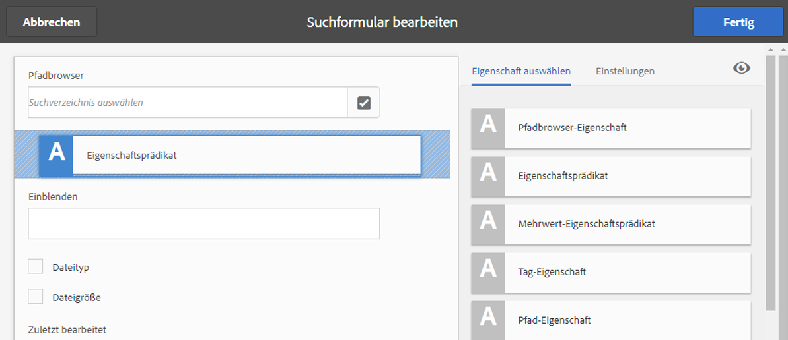
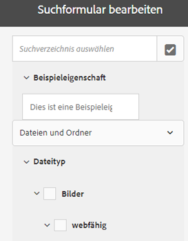
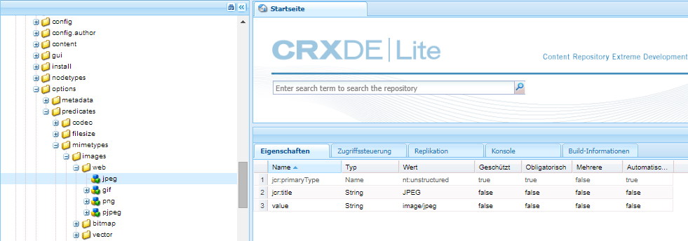
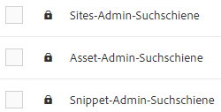

# Suchfacetten {#search-facets}

Eine unternehmensweite Bereitstellung von [!DNL Adobe Experience Manager Assets] verfügt über die Kapazität, viele Assets zu speichern. Manchmal kann das Auffinden des richtigen Assets mühsam und zeitaufwendig sein, wenn Sie nur die generischen Suchfunktionen von [!DNL Experience Manager].

Verwenden Sie Suchfacetten im Bedienfeld „Filter“, um Ihrer Suche ein höheres Maß an Granularität zu verleihen und die Suchfunktion effizienter und vielseitiger zu gestalten. Suchfacetten fügen mehrere Dimensionen (Prädikate) hinzu, mit denen Sie Ihre Suche genauer definieren können. Das Bedienfeld „Filter“ enthält einige standardmäßige Suchfacetten. Außerdem können Sie benutzerdefinierte Suchfacetten hinzufügen.

Zusammengefasst bieten Suchfacetten Ihnen die Möglichkeit, auf verschiedene Arten nach Assets zu suchen, statt in einer einzigen, vorab bestimmten taxonomischen Reihenfolge. Sie können einfach einen Drilldown zur gewünschten Detailtiefe durchführen, um die Suche zu konzentrieren.

Wenn Sie beispielsweise nach einem Bild suchen, können Sie auswählen, ob Sie ein Bitmap- oder ein Vektorbild möchten. Sie können die Suchergebnisse weiter eingrenzen, indem Sie den MIME-Typ für das Bild festlegen. Wenn Sie nach Dokumenten suchen, können Sie auf ähnliche Weise das gewünschte Format festlegen, z. B. PDF oder MS Word.

## Hinzufügen von Prädikaten {#adding-a-predicate}

Die Suchfacetten, die im Bedienfeld „Filter“ angezeigt werden, werden im zugrunde liegenden Suchformular mithilfe von Prädikaten definiert. Um weitere oder andere Facetten anzuzeigen, fügen Sie dem standardmäßigen Formular Prädikate hinzu oder verwenden Sie ein benutzerdefiniertes Formular, das Facetten Ihrer Wahl enthält.

Fügen Sie bei Volltextsuchen den **[!UICONTROL Volltext]** dem Formular. Mit dem Eigenschaftsprädikat können Sie nach Assets suchen, die mit einer einzelnen von Ihnen angegebenen Eigenschaft übereinstimmen. Mit dem Options-Prädikat können Sie nach Assets suchen, die mit einem oder mehreren Werten für eine bestimmte Eigenschaft übereinstimmen. Fügen Sie das Datumsbereichs-Prädikat hinzu, um nach Assets zu suchen, die innerhalb eines bestimmten Datumsbereichs erstellt wurden.

1. Klicken Sie auf [!DNL Experience Manager] -Logo und navigieren Sie zu **[!UICONTROL Instrumente]** > **[!UICONTROL Allgemein]** > **[!UICONTROL Forms durchsuchen]**.
1. Aus dem [!UICONTROL Forms durchsuchen] Seite, wählen Sie **[!UICONTROL Asset-Admin-Suchleiste]** Klicken Sie auf **[!UICONTROL Bearbeiten]** .

   >[!NOTE]
   >
   >So verwenden Sie die Ordnersuchfunktion aus der vorkonfigurierten [!DNL Assets] Admin-Suchschiene aus einer früheren Version ausführen:
   >
   >1. Navigieren Sie zu `/conf/global/settings/dam/search/facets/assets/jcr:content/items` in CRXDE.
   >1. Löschen Sie die `type` Knoten.
   >1. Aus dem Pfad `/libs/settings/dam/search/facets/assets/jcr:content/items`, kopieren Sie die Knoten `asset`, `directory`, `typeor`, `excludepaths`und `searchtype` zum in Schritt 1 genannten Pfad.
   >1. Speichern Sie die Änderungen.


1. Ziehen Sie auf der Seite [!UICONTROL Suchformulare bearbeiten] eine Eigenschaft von der Registerkarte **[!UICONTROL Eigenschaft auswählen]** in den Hauptbereich. Ziehen Sie beispielsweise **[!UICONTROL Eigenschaftsprädikat]**.

   

   *Abbildung: Wählen Sie ein Prädikat aus und verschieben Sie es, um die Suchfilter anzupassen.*

1. Geben Sie auf der Registerkarte [!UICONTROL Einstellungen] eine Feldbeschriftung, einen Platzhaltertext und eine Beschreibung für das Eigenschaftsprädikat ein. Geben Sie einen gültigen Namen für die Metadateneigenschaft an, die mit dem Prädikat verknüpft werden soll. Die Kopfzeilentitel im [!UICONTROL Einstellungen] tab gibt den Typ der ausgewählten Eigenschaft an.

1. Geben Sie im Feld [!UICONTROL Eigenschaftsname] einen gültigen Namen für die Metadateneigenschaft an, die mit dem Prädikat verknüpft werden soll. Basierend auf diesem Namen wird die Suche ausgeführt. Geben Sie beispielsweise `jcr:content/metadata/dc:description` oder `./jcr:content/metadata/dc:description` ein.

   Sie können auch einen vorhandenen Knoten aus dem Auswahl-Dialogfeld auswählen.

   

   Verknüpfen einer Metadateneigenschaft mit einem Prädikat im Feld „Eigenschaftsname“

1. Klicken Sie auf das Symbol **[!UICONTROL Vorschau]** , um eine Vorschau des Bedienfelds „Filter“ anzuzeigen, wie es nach dem Hinzufügen des Prädikats angezeigt wird.
1. Prüfen Sie das Layout des Prädikats im Vorschaumodus.

   

   Anzeigen einer Vorschau des Suchformulars vor dem Übermitteln der Änderungen

1. Um die Vorschau zu schließen, klicken Sie auf das Symbol **[!UICONTROL Schließen]**  oben rechts in der Vorschau.
1. Klicken Sie auf **[!UICONTROL Fertig]**, um die Einstellungen zu speichern.
1. Navigieren Sie in der [!DNL Assets]-Benutzeroberfläche zum Suchbereich. Das Prädikat Eigenschaft wird dem Bereich hinzugefügt.
1. Geben Sie eine Beschreibung des zu suchenden Assets in das Textfeld ein. Geben Sie beispielsweise `Adobe`. Wenn Sie eine Suche durchführen, entsprechen Assets mit einer Beschreibung `Adobe` werden in den Suchergebnissen aufgelistet.

## Hinzufügen eines Options-Prädikats {#adding-an-options-predicate}

Mit dem Options-Prädikat können Sie mehrere Suchoptionen im Bedienfeld „Filter“ hinzufügen. Sie können eine oder mehrere dieser Optionen im Bedienfeld „Filter“ auswählen, um nach Assets zu suchen. Beispiel: Um basierend auf dem Dateityp nach Assets zu suchen, konfigurieren Sie Optionen, wie Bilder, Multimedia, Dokumente und Archive im Suchformular. Nachdem Sie diese Optionen konfiguriert haben, wird die Suche für Assets vom Typ GIF, JPEG, PNG usw. ausgeführt, wenn Sie im Bedienfeld „Filter“ die Option „Bilder“ auswählen.

Um die Optionen der jeweiligen Eigenschaft zuzuordnen, erstellen Sie eine Knotenstruktur für die Optionen und geben Sie den Pfad des übergeordneten Knotens in der Eigenschaft „Eigenschaftsname“ des Options-Prädikats an. Der übergeordnete Knoten sollte den Typ `sling`: `OrderedFolder` aufweisen. Die Optionen sollten den Typ `nt:unstructured` aufweisen. Die Eigenschaften `jcr:title` und `value` sollten für den Optionsknoten konfiguriert sein.

Die Eigenschaft `jcr:title` ist ein benutzerfreundlicher Name für die Option, der im Bedienfeld „Filter“ angezeigt wird. Das Feld `value` wird in der Abfrage verwendet, um die angegebene Eigenschaft abzugleichen.

Wenn Sie eine Option auswählen, wird die Suche basierend auf der Eigenschaft `value` des Optionsknotens und gegebenenfalls der jeweiligen untergeordneten Knoten durchgeführt. Die gesamte Baumstruktur unter dem Optionsknoten wird durchlaufen und die Eigenschaft `value` jedes untergeordneten Knotens wird anhand eines ODER-Vorgangs kombiniert, um die Suchabfrage zu bilden.

Beispiel: Wenn Sie „Bilder“ als Dateityp auswählen, wird die Suchabfrage für die Assets gebildet, indem die Eigenschaft `value` anhand eines ODER-Vorgangs kombiniert wird. Beispiel: Die Suchabfrage für Bilder wird erstellt, indem die Ergebnisse für *image/jpeg*, *image/gif*, *image/png*, *image/pjpeg* und *image/tiff* für die Eigenschaft `jcr:content/metadata/dc:format` anhand eines ODER-Vorgangs kombiniert werden.



Die Werteigenschaft eines Dateityps, wie in CRXDE dargestellt, wird für funktionierende Suchabfragen verwendet.

Anstatt manuell eine Knotenstruktur für die Optionen im CRXDE-Repository zu erstellen, können Sie die Optionen in einer JSON-Datei definieren, indem Sie entsprechende Schlüssel-Wert-Paare angeben. Geben Sie den Pfad der JSON-Datei im Feld **[!UICONTROL Eigenschaftsname]** an. Sie können z. B. die Schlüssel-Wert-Paare `image/bmp`, `image/gif`, `image/jpeg` und `image/png` definieren und die Werte wie im folgenden Beispiel in einer JSON-Datei angeben. Im **[!UICONTROL Eigenschaftsname]** -Feld können Sie den CRXDE-Pfad für diese Datei angeben.

```json
{
    "options" :
 [
          {"value" : "image/bmp","text" : "BMP"},
          {"value" : "image/gif","text" : "GIF"},
          {"value" : "image/jpeg","text" : "JPEG"},
          {"value" : "image/png","text" : "PNG"}
 ]
}
```

Wenn Sie einen vorhandenen Knoten verwenden möchten, legen Sie diesen über das Auswahl-Dialogfeld fest.

>[!NOTE]
>
>Das Options-Prädikat ist ein benutzerdefinierter Wrapper, der Eigenschaftsprädikate umfasst, um das beschriebene Verhalten zu erreichen. Derzeit ist kein REST-Endpunkt verfügbar, um die Funktionalität nativ zu unterstützen.

1. Klicken Sie auf [!DNL Experience Manager] -Logo und navigieren Sie zu **[!UICONTROL Instrumente]** > **[!UICONTROL Allgemein]** > **[!UICONTROL Forms durchsuchen]**.
1. Aus dem **[!UICONTROL Forms durchsuchen]** Seite, wählen Sie **[!UICONTROL Asset-Admin-Suchleiste]** Klicken Sie auf **[!UICONTROL Bearbeiten]**.
1. Ziehen Sie auf der Seite **[!UICONTROL Suchformular bearbeiten]** den Eintrag **[!UICONTROL Options-Eigenschaft]** von der Registerkarte **[!UICONTROL Eigenschaft auswählen]** in den Hauptbereich.
1. Geben Sie auf der Registerkarte **[!UICONTROL Einstellungen]** eine Beschriftung und einen Namen für die Eigenschaft ein. Beispiel: Um Assets basierend auf dem Format zu suchen, geben Sie einen aussagekräftigen Namen als Beschriftung ein, wie **[!UICONTROL Dateityp]**. Geben Sie die Eigenschaft, anhand derer die Suche durchgeführt werden soll, im Eigenschaftsfeld an, wie beispielsweise `jcr:content/metadata/dc:format.`
1. Führen Sie einen der folgenden Schritte aus:

   * Geben Sie im Feld **[!UICONTROL Eigenschaftsname]** den Pfad der JSON-Datei an, in der Sie die Knoten für die Optionen und entsprechende Schlüssel-Wert-Paare definiert haben.
   * Klicken Sie auf `+` neben dem Feld Optionen , um den Anzeigetext und den Wert für die Optionen anzugeben, die Sie im Bedienfeld Filter bereitstellen möchten. Um eine weitere Option hinzuzufügen, klicken Sie auf `+` und wiederholen Sie den Schritt.

1. Stellen Sie sicher, dass **[!UICONTROL Einzelauswahl]** deaktiviert ist, damit Benutzer mehrere Optionen für Dateitypen gleichzeitig auswählen können (z. B. Bilder, Dokumente, Multimedia und Archive). Wenn Sie **[!UICONTROL Einzelauswahl]** aktivieren, können Benutzer jeweils nur eine Option für Dateitypen auswählen.

   

   Die verfügbaren Felder in der Options-Eigenschaft

1. Geben Sie eine optionale Beschreibung in das Feld **[!UICONTROL Beschreibung]** ein und klicken Sie auf **[!UICONTROL Fertig]**.
1. Navigieren Sie zum Suchfeld. Die Options-Eigenschaft wird dem Bereich **Suchen** hinzugefügt. Die Optionen für **[!UICONTROL Dateityp]** werden als Kontrollkästchen angezeigt.

## Mehrwert-Eigenschaftsprädikat hinzufügen {#adding-a-multi-value-property-predicate}

Mit dem Mehrwert-Eigenschaftsprädikat können Sie für mehrere Werte nach Assets suchen. Angenommen, Sie haben in [!DNL Assets] Bilder mehrerer Produkte, deren Metadaten die zum Produkt gehörende Artikelnummer enthalten. Sie können diese Eigenschaft nutzen, um anhand mehrerer Artikelnummern nach Produktbildern zu suchen.

1. Klicken Sie auf [!DNL Experience Manager] -Logo und navigieren Sie zu **[!UICONTROL Instrumente]** > **[!UICONTROL Allgemein]** > **[!UICONTROL Forms durchsuchen]**.
1. Wählen Sie auf der Seite Forms suchen die Option **[!UICONTROL Asset-Admin-Suchleiste]**, klicken Sie auf **[!UICONTROL Bearbeiten]** .
1. Ziehen Sie auf der Seite „Suchformular bearbeiten“ den Eintrag **[!UICONTROL Mehrwert-Eigenschaftsprädikat]** von der Registerkarte **[!UICONTROL Eigenschaft auswählen]** in den Hauptbereich.
1. Geben Sie auf der Registerkarte **[!UICONTROL Einstellungen]** eine Beschriftung und einen Platzhaltertext für die Eigenschaft ein. Geben Sie den Eigenschaftsnamen, über den die Suche durchgeführt werden soll, im Eigenschaftsfeld an, beispielsweise `jcr:content/metadata/dc:value`. Sie können auch das Auswahl-Dialogfeld verwenden, um einen Knoten auszuwählen.
1. Stellen Sie sicher, dass die **[!UICONTROL Trennzeichen-Unterstützung]** aktiviert ist. Geben Sie im Feld **[!UICONTROL Eingabe-Trennzeichen]** bestimmte Trennzeichen an, um einzelne Werte voneinander zu trennen. Standardmäßig sind Kommata als Trennzeichen angegeben. Sie können auch ein anderes Trennzeichen festlegen.
1. Geben Sie eine optionale Beschreibung in das Feld **Beschreibung** ein und klicken Sie auf **[!UICONTROL Fertig]**.
1. Navigieren Sie zum Bereich Filter im [!DNL Assets] -Benutzeroberfläche. Das Prädikat **[!UICONTROL Mehrwert-Eigenschaft]** wird zum Bereich hinzugefügt.
1. Geben Sie im Feld „Mehrwert“ mehrere durch Trennzeichen getrennte Werte ein und führen Sie die Suche aus. Die Eigenschaft sucht für die eingegebenen Werte nach genau übereinstimmenden Texten.

## Hinzufügen von Tag-Prädikaten {#adding-a-tags-predicate}

Mit dem Tag-Prädikat können Sie anhand von Tags nach Assets suchen. Standardmäßig sucht [!DNL Assets] nach Assets, die eines oder mehrere der von Ihnen angegebenen Tags enthalten. Das heißt, die Suchabfrage führt einen ODER-Vorgang mit den angegebenen Tags aus. Sie können jedoch die Option „Übereinstimmung mit allen Tags“ nutzen, um nach Assets zu suchen, die alle angegebenen Tags enthalten.

1. Klicken Sie auf [!DNL Experience Manager] -Logo und navigieren Sie zu **[!UICONTROL Instrumente]** > **[!UICONTROL Allgemein]** > **[!UICONTROL Forms durchsuchen]**.
1. Wählen Sie auf der Seite Forms suchen die Option **[!UICONTROL Asset-Admin-Suchleiste]** und klicken Sie anschließend auf **[!UICONTROL Bearbeiten]** .
1. Ziehen Sie auf der Seite „Suchformular bearbeiten“ den Eintrag **[!UICONTROL Tag-Eigenschaft]** von der Registerkarte „Eigenschaft auswählen“ in den Hauptbereich.
1. Geben Sie auf der Registerkarte „Einstellungen“ einen Platzhaltertext für die Eigenschaft ein. Geben Sie den Eigenschaftsnamen, über den die Suche durchgeführt werden soll, im Eigenschaftsfeld an, beispielsweise *jcr:content/metadata/cq:tags*. Alternativ können Sie einen Knoten in CRXDE aus dem Auswahldialogfeld auswählen.
1. Konfigurieren Sie die Eigenschaft „Pfad für Stamm-Tags“ dieses Prädikats, um die Tag-Liste mit verschiedenen Tags zu füllen.
1. Aktivieren Sie **[!UICONTROL Option „Übereinstimmung mit allen Tags“ anzeigen]**, um nach Assets zu suchen, die alle angegebenen Tags enthalten.

1. Geben Sie eine optionale Beschreibung in das Feld **[!UICONTROL Beschreibung]** ein und klicken Sie auf **[!UICONTROL Fertig]**.
1. Navigieren Sie zum Bereich „Suchen“. Das Prädikat **[!UICONTROL Tags]** wird zum Bereich „Suchen“ hinzugefügt.
1. Geben Sie Tags ein, auf deren Grundlage Sie nach Assets suchen möchten, oder wählen Sie Tags aus, die in der Liste vorgeschlagen werden.

1. Aktivieren Sie **[!UICONTROL Übereinstimmung mit allen]**, um nach Assets zu suchen, die alle angegebenen Tags enthalten.

## Andere Eigenschaften hinzufügen {#adding-other-predicates}

Sie können die folgenden zusätzlichen Prädikate auf ähnliche Weise wie Eigenschaftsprädikate oder Options-Prädikate dem Suchbereich hinzufügen.

| Prädikatsname | Beschreibung | Eigenschaften |
|---|---|---|
| [!UICONTROL Volltext] | Suchprädikat für das Ausführen einer Volltextsuche für einen ganzen Asset-Knoten. Dieses Suchprädikat wird mit dem Operator jcr:contains verknüpft. Sie können einen relativen Pfad angeben, wenn Sie eine Volltextsuche in einem bestimmten Teil des Asset-Knotens durchführen möchten. | <ul><li>Bezeichnung</li><li>Platzhalter</li><li>Eigenschaftsname</li><li>Beschreibung</li></ul> |
| [!UICONTROL Pfad-Browser] | Sucheigenschaft, um in Ordnern und Unterordnern in einem vorkonfigurierten Stammverzeichnis nach Assets zu suchen | <ul><li>Platzhalter</li><li>Stammverzeichnis</li><li>Beschreibung</li></ul> |
| [!UICONTROL Pfad] | Verwenden Sie dieses Suchprädikat, um Ergebnisse am Speicherort zu filtern. Sie können verschiedene Pfade als Optionen angeben. | <ul><li>Bezeichnung</li><li>Pfad</li><li>Beschreibung</li></ul> |
| [!UICONTROL Veröffentlichungsstatus] | Sucheigenschaft, um Assets basierend auf ihrem Veröffentlichungsstatus zu suchen | <ul><li>Bezeichnung</li><li>Eigenschaftsname</li><li>Beschreibung</li></ul> |
| [!UICONTROL Relatives Datum] | Suchprädikat, um Assets basierend auf dem relativen Datum ihrer Erstellung zu suchen. Sie können beispielsweise Optionen wie „vor 2 Monaten“, „vor 3 Wochen“ usw. konfigurieren. | <ul><li>Bezeichnung</li><li>Eigenschaftsname</li><li>Relatives Datum</li></ul> |
| [!UICONTROL Bereich] | Sucheigenschaft, um Assets innerhalb eines bestimmten Bereichs zu suchen. Im Suchbereich können Sie den Mindest- und den Höchstwert für den Bereich angeben. | <ul><li>Bezeichnung</li><li>Eigenschaftsname</li><li>Beschreibung</li></ul> |
| [!UICONTROL Datumsbereich] | Suchprädikat, um Assets zu suchen, die innerhalb eines bestimmten Bereichs für eine Datumseigenschaft erstellt wurden. Im Suchbereich können Sie mithilfe der Datumsauswahl das Start- und das Enddatum angeben. | <ul><li>Bezeichnung</li><li>Platzhalter</li><li>Eigenschaftsname</li><li>Textbereich (von)</li><li>Textbereich (bis)</li><li>Beschreibung</li></ul> |
| [!UICONTROL Datum] | Suchprädikat für eine Regler-basierte Suche nach Assets basierend auf einer Datumseigenschaft. | <ul><li>Bezeichnung</li><li>Eigenschaftsname</li><li>Beschreibung</li></ul> |
| [!UICONTROL Dateigröße] | Suchprädikat, um Assets basierend auf ihrer Größe zu suchen. Es handelt sich um eine Regler-basierte Eigenschaft, bei der Sie die Regleroptionen aus einem konfigurierbaren Knoten auswählen. Die Standardoptionen werden unter /libs/dam/options/predicates/filesize im CRXDE-Repository definiert. Die Dateigröße wird in Byte angegeben. | <ul><li>Bezeichnung</li><li>Eigenschaftsname</li><li>Pfad</li><li>Beschreibung</li></ul> |
| [!UICONTROL Asset zuletzt geändert] | Suchprädikat für die Suche nach kürzlich geänderten Assets | <ul><li>Eigenschaftsname</li><li>Eigenschaftswert</li><li>Beschreibung</li></ul> |
| [!UICONTROL Veröffentlichungsstatus] | Suchprädikat für die Suche nach Assets basierend auf ihrem Veröffentlichungsstatus | <ul><li>Bezeichnung</li><li>Eigenschaftsname</li><li>Beschreibung</li></ul> |
| [!UICONTROL Bewertung] | Suchprädikat für die Suche nach Assets basierend auf ihrer durchschnittlichen Bewertung | <ul><li>Bezeichnung</li><li>Eigenschaftsname</li><li>Optionspfad</li><li>Beschreibung</li></ul> |
| [!UICONTROL Gültigkeitsstatus] | Suchprädikat für die Suche nach Assets basierend auf ihrem Ablaufstatus | <ul><li>Bezeichnung</li><li>Eigenschaftsname</li><li>Beschreibung</li></ul> |
| [!UICONTROL Ausgeblendet] | Suchprädikat, das eine versteckte Feldeigenschaft für die Suche nach Assets definiert | <ul><li>Eigenschaftsname</li><li>Eigenschaftswert</li><li>Beschreibung</li></ul> |

## Standard-Suchfacetten wiederherstellen {#restoring-default-search-facets}

Standardmäßig wird ein Sperrsymbol  wird vor **[!UICONTROL Asset-Admin-Suchleiste]** im **[!UICONTROL Forms durchsuchen]** Seite. Das Sperrsymbol für eine Option auf der Seite „Suchformulare“ gibt an, dass die Standardeinstellungen intakt und nicht angepasst sind. Das Symbol  verschwindet, wenn Sie Suchfacetten zum Formular hinzufügen, die darauf hinweisen, dass das Standardformular geändert wurde.



Führen Sie die folgenden Schritte aus, um die standardmäßige Suchfacette wiederherzustellen:

1. Wählen Sie **[!UICONTROL Asset-Admin-Suchschiene]** auf der Seite **[!UICONTROL Suchformulare]** aus.
1. Klicken **[!UICONTROL Löschen]**  in der Symbolleiste.
1. Klicken Sie im Bestätigungsdialogfeld auf **[!UICONTROL Löschen]** , um die benutzerdefinierten Änderungen zu entfernen.

   Nachdem Sie die benutzerdefinierten Änderungen an Suchfacetten gelöscht haben, wird das Sperrsymbol  wird vor **[!UICONTROL Asset-Admin-Suchleiste]** im **[!UICONTROL Forms durchsuchen]** Seite.

## Benutzerberechtigungen {#user-permissions}

Wenn Ihnen nicht die Rolle eines Administrators zugewiesen wurde, finden Sie hier eine Liste der erforderlichen Berechtigungen für die Bearbeitung, das Löschen und die Vorschau in Bezug auf Suchfacetten.

| Aktion | Berechtigungen |
| ------------------- | ---------------------------------------------------------------- |
| [!UICONTROL Bearbeiten] | Lese- und Schreibberechtigungen für `/apps` Knoten in CRXDE |
| [!UICONTROL Löschen] | Lese-, Schreib- und Löschberechtigungen für die `/apps` Knoten in CRXDE |
| [!UICONTROL Vorschau] | Lese-, Schreib- und Löschberechtigungen für die `/var/dam/content` Knoten in CRXDE. Außerdem Lese- und Schreibberechtigungen für den Knoten `/apps` |

>[!MORELIKETHIS]
>
>* [Erweiterung der Asset-Suchfunktion](searchx.md)
>* [Suchen von Assets](search-assets.md)

