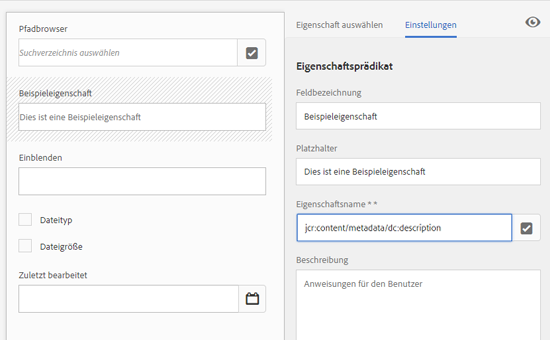
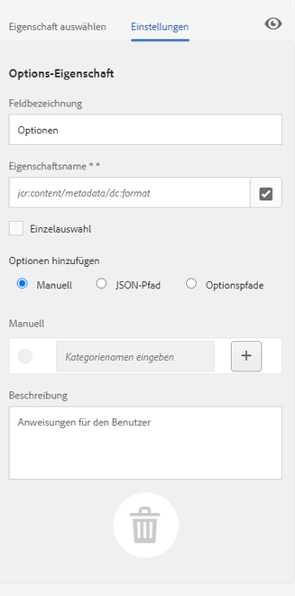

# Suchfacetten {#search-facets}

| Version | Artikel-Link |
| -------- | ---------------------------- |
| AEM as a Cloud Service | [Hier klicken](https://experienceleague.adobe.com/docs/experience-manager-cloud-service/content/assets/admin/search-facets.html?lang=de) |
| AEM 6.5 | Dieser Artikel |

Eine organisationsweite Bereitstellung von [!DNL Adobe Experience Manager Assets] bietet die Möglichkeit, eine große Anzahl von Assets zu speichern. Allein mit den generischen Suchfunktionen von [!DNL Experience Manager] kann es anstrengend und zeitraubend sein, das richtige Asset zu finden.

Verwenden Sie Suchfacetten im Bedienfeld „Filter“, um Ihrer Suche ein höheres Maß an Granularität zu verleihen und die Suchfunktion effizienter und vielseitiger zu gestalten. Suchfacetten fügen mehrere Dimensionen (Prädikate) hinzu, mit denen Sie komplexere Suchen durchführen können. Das Bedienfeld „Filter“ enthält einige Standardfacetten. Sie können auch benutzerdefinierte Suchfacetten hinzufügen.

Zusammengefasst bieten Suchfacetten Ihnen die Möglichkeit, auf verschiedene Arten nach Assets zu suchen, statt in einer einzigen, vorab bestimmten taxonomischen Reihenfolge. Sie können für eine zielgerichtetere Suche einfach einen Drilldown zur gewünschten Detailtiefe durchführen.

Wenn Sie beispielsweise nach einem Bild suchen, können Sie auswählen, ob Sie ein Bitmap- oder ein Vektorbild möchten. Sie können den Umfang der Suche weiter einschränken, indem Sie den MIME-Typ des Bildes angeben. Auch bei der Suche nach Dokumenten können Sie das Format angeben, z. B. PDF oder MS Word.

## Hinzufügen von Prädikaten {#adding-a-predicate}

Die Suchfacetten, die im Bedienfeld „Filter“ angezeigt werden, werden im zugrunde liegenden Suchformular mithilfe von Prädikaten definiert. Um weitere oder andere Facetten anzuzeigen, fügen Sie dem standardmäßigen Formular Prädikate hinzu oder verwenden Sie ein benutzerdefiniertes Formular, das Facetten Ihrer Wahl enthält.

Um eine Volltextsuche durchzuführen, fügen Sie dem Formular das Prädikat **[!UICONTROL Volltext]** hinzu. Mit dem Eigenschaftsprädikat können Sie nach Assets suchen, die mit einer einzelnen von Ihnen angegebenen Eigenschaft übereinstimmen. Verwenden Sie das Optionsprädikat, um nach Assets zu suchen, die mit einem oder mehreren Werten für eine bestimmte Eigenschaft übereinstimmen. Fügen Sie das Datumsbereichsprädikat hinzu, um Assets zu suchen, die innerhalb eines bestimmten Datumsbereichs erstellt wurden.

1. Klicken Sie auf das [!DNL Experience Manager]-Logo und navigieren Sie zu **[!UICONTROL Tools]** > **[!UICONTROL Allgemein]** > **[!UICONTROL Suchformulare]**.
1. Wählen Sie auf der Seite [!UICONTROL Suchformulare] die Option **[!UICONTROL Asset-Admin-Suchleiste]** aus, und klicken Sie dann auf **[!UICONTROL Bearbeiten]** .

   >[!NOTE]
   >
   >Gehen Sie folgendermaßen vor, um die Ordnersuchfunktion auf der vorkonfigurierten [!DNL Assets]-Admin-Suchleiste aus einer früheren Version zu verwenden:
   >
   >1. Navigieren Sie zu `/conf/global/settings/dam/search/facets/assets/jcr:content/items` in CRXDE.
   >1. Löschen Sie den `type`-Knoten.
   >1. Kopieren Sie im Pfad `/libs/settings/dam/search/facets/assets/jcr:content/items` die Knoten `asset`, `directory`, `typeor`, `excludepaths` und `searchtype` in den in Schritt 1 genannten Pfad.
   >1. Speichern Sie die Änderungen.

1. Ziehen Sie auf der Seite [!UICONTROL Suchformulare bearbeiten] eine Eigenschaft von der Registerkarte **[!UICONTROL Eigenschaft auswählen]** in den Hauptbereich. Ziehen Sie beispielsweise **[!UICONTROL Eigenschaftsprädikat]**.

   

   *Abbildung: Wählen Sie ein Prädikat aus und verschieben Sie es, um die Suchfilter anzupassen.*

1. Geben Sie auf der Registerkarte [!UICONTROL Einstellungen] eine Feldbeschriftung, einen Platzhaltertext und eine Beschreibung für das Eigenschaftsprädikat ein. Geben Sie einen gültigen Namen für die Metadateneigenschaft an, die mit dem Prädikat verknüpft werden soll. Die Kopfzeilenbeschriftung auf der Registerkarte [!UICONTROL Einstellungen] gibt den Typ des gewählten Prädikats an.

1. Geben Sie im Feld [!UICONTROL Eigenschaftsname] einen gültigen Namen für die Metadateneigenschaft an, die mit dem Prädikat verknüpft werden soll. Basierend auf diesem Namen wird die Suche ausgeführt. Geben Sie beispielsweise `jcr:content/metadata/dc:description` oder `./jcr:content/metadata/dc:description` ein.

   Sie können auch einen vorhandenen Knoten aus dem Auswahl-Dialogfeld auswählen.

   

   Verknüpfen einer Metadateneigenschaft mit einem Prädikat im Feld „Eigenschaftsname“

1. Klicken Sie auf das Symbol **[!UICONTROL Vorschau]** , um eine Vorschau des Bedienfelds „Filter“ anzuzeigen, wie es nach dem Hinzufügen des Prädikats angezeigt wird.
1. Prüfen Sie das Layout des Prädikats im Vorschaumodus.

   

   Anzeigen einer Vorschau des Suchformulars vor dem Übermitteln der Änderungen

1. Um die Vorschau zu schließen, klicken Sie auf das Symbol **[!UICONTROL Schließen]**  oben rechts in der Vorschau.
1. Klicken Sie auf **[!UICONTROL Fertig]**, um die Einstellungen zu speichern.
1. Navigieren Sie in der [!DNL Assets]-Benutzeroberfläche zum Suchbereich. Das Prädikat „Eigenschaft“ wird dem Bereich hinzugefügt.
1. Geben Sie eine Beschreibung des zu suchenden Assets in das Textfeld ein. Geben Sie beispielsweise `Adobe` ein. Wenn Sie eine Suche durchführen, werden Assets mit der Beschreibung `Adobe` in den Suchergebnissen aufgelistet.

## Hinzufügen eines Options-Prädikats {#adding-an-options-predicate}

Mit dem Optionsprädikat können Sie im Filterbereich mehrere Suchoptionen hinzufügen. Sie können eine oder mehrere dieser Optionen im Bedienfeld „Filter“ auswählen, um nach Assets zu suchen. Um beispielsweise nach Assets auf der Basis von Dateitypen zu suchen, konfigurieren Sie Optionen wie Bilder, Multimedia, Dokumente und Archive im Suchformular. Nachdem Sie diese Optionen konfiguriert haben, wird die Suche für Assets vom Typ GIF, JPEG, PNG usw. ausgeführt, wenn Sie im Bedienfeld „Filter“ die Option „Bilder“ auswählen.

Um die Optionen der jeweiligen Eigenschaft zuzuordnen, erstellen Sie eine Knotenstruktur für die Optionen und geben Sie den Pfad des übergeordneten Knotens in der Eigenschaft „Eigenschaftsname“ des Options-Prädikats an. Der übergeordnete Knoten sollte den Typ `sling`: `OrderedFolder` aufweisen. Die Optionen sollten den Typ `nt:unstructured` aufweisen. Die Eigenschaften `jcr:title` und `value` sollten für den Optionsknoten konfiguriert sein.

Die Eigenschaft `jcr:title` ist ein benutzerfreundlicher Name für die Option, der im Bedienfeld „Filter“ angezeigt wird. Das Feld `value` wird in der Abfrage verwendet, um die angegebene Eigenschaft abzugleichen.

Wenn Sie eine Option auswählen, wird die Suche basierend auf der Eigenschaft `value` des Optionsknotens und gegebenenfalls der jeweiligen untergeordneten Knoten durchgeführt. Die gesamte Baumstruktur unter dem Optionsknoten wird durchlaufen und die Eigenschaft `value` jedes untergeordneten Knotens wird anhand eines ODER-Vorgangs kombiniert, um die Suchabfrage zu bilden.

Beispiel: Wenn Sie „Bilder“ als Dateityp auswählen, wird die Suchabfrage für die Assets gebildet, indem die Eigenschaft `value` anhand eines ODER-Vorgangs kombiniert wird. Beispiel: Die Suchabfrage für Bilder wird erstellt, indem die Ergebnisse für *image/jpeg*, *image/gif*, *image/png*, *image/pjpeg* und *image/tiff* für die Eigenschaft `jcr:content/metadata/dc:format` anhand eines ODER-Vorgangs kombiniert werden.


Die Werteigenschaft eines Dateityps, wie in CRXDE dargestellt, wird für funktionierende Suchabfragen verwendet.

Statt im CRXDE-Repository manuell eine Knotenstruktur für die Optionen zu erstellen, können Sie die Optionen in einer JSON-Datei definieren, indem Sie entsprechende Schlüssel-Wert-Paare angeben. Geben Sie den Pfad der JSON-Datei im Feld **[!UICONTROL Eigenschaftsname]** an. Sie können z. B. die Schlüssel-Wert-Paare `image/bmp`, `image/gif`, `image/jpeg` und `image/png` definieren und die Werte wie im folgenden Beispiel in einer JSON-Datei angeben. Im Feld **[!UICONTROL Eigenschaftsname]** können Sie den CRXDE-Pfad für die Datei angeben.

```json
{
    "options" :
 [
          {"value" : "image/bmp","text" : "BMP"},
          {"value" : "image/gif","text" : "GIF"},
          {"value" : "image/jpeg","text" : "JPEG"},
          {"value" : "image/png","text" : "PNG"}
 ]
}
```

Wenn Sie einen vorhandenen Knoten verwenden möchten, legen Sie diesen über das Auswahl-Dialogfeld fest.

>[!NOTE]
>
>Das Options-Prädikat ist ein benutzerdefinierter Wrapper, der Eigenschaftsprädikate umfasst, um das beschriebene Verhalten zu erreichen. Derzeit ist kein REST-Endpunkt verfügbar, um die Funktionalität nativ zu unterstützen.

1. Klicken Sie auf das [!DNL Experience Manager]-Logo und navigieren Sie zu **[!UICONTROL Tools]** > **[!UICONTROL Allgemein]** > **[!UICONTROL Suchformulare]**.
1. Wählen Sie auf der Seite **[!UICONTROL Suchformulare]** die Option **[!UICONTROL Asset-Admin-Suchleiste]** aus, und klicken Sie dann auf **[!UICONTROL Bearbeiten]**.
1. Ziehen Sie auf der Seite **[!UICONTROL Suchformular bearbeiten]** den Eintrag **[!UICONTROL Options-Eigenschaft]** von der Registerkarte **[!UICONTROL Eigenschaft auswählen]** in den Hauptbereich.
1. Geben Sie auf der Registerkarte **[!UICONTROL Einstellungen]** eine Beschriftung und einen Namen für die Eigenschaft ein. Um beispielsweise Assets auf Grundlage ihres Formats zu suchen, geben Sie einen benutzerfreundlichen Namen für die Bezeichnung ein, z. B. **[!UICONTROL Dateityp]**. Geben Sie die Eigenschaft, anhand derer die Suche durchgeführt werden soll, im Eigenschaftsfeld an, beispielsweise `jcr:content/metadata/dc:format.`
1. Führen Sie einen der folgenden Schritte aus:

   * Geben Sie im Feld **[!UICONTROL Eigenschaftsname]** den Pfad der JSON-Datei an, in der Sie die Knoten für die Optionen und entsprechende Schlüssel-Wert-Paare definiert haben.
   * Klicken Sie auf das Symbol `+` neben dem Feld „Optionen“, um den Anzeigetext und den Wert für die Optionen festzulegen, die im Bedienfeld „Filter“ bereitgestellt werden sollen. Um eine weitere Option hinzuzufügen, klicken Sie auf das `+` und wiederholen Sie diesen Schritt.

1. Stellen Sie sicher, dass **[!UICONTROL Einzelauswahl]** deaktiviert ist, damit Benutzer mehrere Optionen für Dateitypen gleichzeitig auswählen können (z. B. Bilder, Dokumente, Multimedia und Archive). Wenn Sie **[!UICONTROL Einzelauswahl]** aktivieren, können Benutzer jeweils nur eine Option für Dateitypen auswählen.

   

   Die verfügbaren Felder in der Options-Eigenschaft

1. Geben Sie eine optionale Beschreibung in das Feld **[!UICONTROL Beschreibung]** ein und klicken Sie auf **[!UICONTROL Fertig]**.
1. Navigieren Sie zum Bereich „Suchen“. Das Optionsprädikat wird zum Bereich **Suchen** hinzugefügt. Die Optionen für den **[!UICONTROL Dateityp]** werden als Kontrollkästchen angezeigt.

## Hinzufügen eines Mehrwert-Eigenschaftsprädikats {#adding-a-multi-value-property-predicate}

Mit dem Mehrwert-Eigenschaftsprädikat können Sie für mehrere Werte nach Assets suchen. Angenommen, Sie haben in [!DNL Assets] Bilder mehrerer Produkte, deren Metadaten die zum Produkt gehörende Artikelnummer enthalten. Sie können diese Eigenschaft nutzen, um anhand mehrerer Artikelnummern nach Produktbildern zu suchen.

1. Klicken Sie auf das [!DNL Experience Manager]-Logo und navigieren Sie zu **[!UICONTROL Tools]** > **[!UICONTROL Allgemein]** > **[!UICONTROL Suchformulare]**.
1. Wählen Sie auf der Seite „Suchformulare“ die Option **[!UICONTROL Asset-Admin-Suchleiste]** aus und klicken Sie dann auf **[!UICONTROL Bearbeiten]** .
1. Ziehen Sie auf der Seite „Suchformular bearbeiten“ den Eintrag **[!UICONTROL Mehrwert-Eigenschaftsprädikat]** von der Registerkarte **[!UICONTROL Eigenschaft auswählen]** in den Hauptbereich.
1. Geben Sie auf der Registerkarte **[!UICONTROL Einstellungen]** eine Beschriftung und einen Platzhaltertext für die Eigenschaft ein. Geben Sie den Eigenschaftsnamen, auf dessen Basis die Suche durchgeführt werden soll, im Eigenschaftsfeld an, beispielsweise `jcr:content/metadata/dc:value`. Sie können auch das Auswahldialogfeld verwenden, um einen Knoten auszuwählen.
1. Stellen Sie sicher, dass die **[!UICONTROL Trennzeichen-Unterstützung]** aktiviert ist. Geben Sie im Feld **[!UICONTROL Eingabe-Trennzeichen]** bestimmte Trennzeichen an, um einzelne Werte voneinander zu trennen. Standardmäßig sind Kommata als Trennzeichen angegeben. Sie können auch ein anderes Trennzeichen festlegen.
1. Geben Sie eine optionale Beschreibung in das Feld **Beschreibung** ein und klicken Sie auf **[!UICONTROL Fertig]**.
1. Navigieren Sie in der [!DNL Assets]-Benutzeroberfläche zum Bedienfeld „Filter“. Das Prädikat **[!UICONTROL Mehrwert-Eigenschaft]** wird zum Bereich hinzugefügt.
1. Geben Sie im Mehrwertfeld mehrere Werte getrennt durch die Trennzeichen an und führen Sie die Suche durch. Das Prädikat ruft eine exakte Textübereinstimmung für die angegebenen Werte ab.

## Hinzufügen von Tag-Prädikaten {#adding-a-tags-predicate}

Mit dem Tag-Prädikat können Sie anhand von Tags nach Assets suchen. Standardmäßig sucht [!DNL Assets] nach Assets, die eines oder mehrere der von Ihnen angegebenen Tags enthalten. Mit anderen Worten: Die Suchanfrage führt einen ODER-Vorgang mit den angegebenen Tags durch. Sie können jedoch die Option „Übereinstimmung mit allen Tags“ verwenden, um nach Assets zu suchen, die alle angegebenen Tags enthalten.

1. Klicken Sie auf das [!DNL Experience Manager]-Logo und navigieren Sie zu **[!UICONTROL Tools]** > **[!UICONTROL Allgemein]** > **[!UICONTROL Suchformulare]**.
1. Wählen Sie auf der Seite „Suchformulare“ die Option **[!UICONTROL Asset-Admin-Suchleiste]** aus und klicken Sie dann auf **[!UICONTROL Bearbeiten]** .
1. Ziehen Sie auf der Seite „Suchformular bearbeiten“ den Eintrag **[!UICONTROL Tag-Eigenschaft]** von der Registerkarte „Eigenschaft auswählen“ in den Hauptbereich.
1. Geben Sie auf der Registerkarte „Einstellungen“ einen Platzhaltertext für die Eigenschaft ein. Geben Sie den Eigenschaftsnamen, auf dessen Basis die Suche durchgeführt werden soll, im Eigenschaftsfeld an, beispielsweise *jcr:content/metadata/cq:tags*. Alternativ können Sie einen Knoten in CRXDE aus dem Auswahldialogfeld auswählen.
1. Konfigurieren Sie die Eigenschaft „Pfad für Stamm-Tags“ dieses Prädikats, um die Tag-Liste mit verschiedenen Tags zu füllen.
1. Aktivieren Sie **[!UICONTROL Option „Übereinstimmung mit allen Tags“ anzeigen]**, um nach Assets zu suchen, die alle angegebenen Tags enthalten.

1. Geben Sie eine optionale Beschreibung in das Feld **[!UICONTROL Beschreibung]** ein und klicken Sie auf **[!UICONTROL Fertig]**.
1. Navigieren Sie zum Bereich „Suchen“. Das Prädikat **[!UICONTROL Tags]** wird zum Bereich „Suchen“ hinzugefügt.
1. Geben Sie Tags an, anhand derer Sie nach Assets suchen möchten, oder wählen Sie aus der Liste mit Vorschlägen aus.

1. Wählen Sie **[!UICONTROL Übereinstimmung mit allen Tags]**, um nach Übereinstimmungen zu suchen, die alle von Ihnen angegebenen Tags enthalten.

## Hinzufügen anderer Prädikate {#adding-other-predicates}

Sie können die folgenden zusätzlichen Prädikate auf ähnliche Weise wie Eigenschaftsprädikate oder Options-Prädikate dem Suchbereich hinzufügen.

| Prädikatsname | Beschreibung | Eigenschaften |
|---|---|---|
| [!UICONTROL Volltext] | Suchprädikat für das Ausführen einer Volltextsuche für einen ganzen Asset-Knoten. Dieses Suchprädikat wird mit dem Operator jcr:contains verknüpft. Sie können einen relativen Pfad angeben, wenn Sie eine Volltextsuche für einen bestimmten Teil des Asset-Knotens durchführen möchten. | <ul><li>Bezeichnung</li><li>Platzhalter</li><li>Eigenschaftsname</li><li>Beschreibung</li></ul> |
| [!UICONTROL Pfad-Browser] | Suchprädikat für die Suche nach Assets in Ordnern und Unterordnern in einem vorab konfigurierten Stammpfad | <ul><li>Platzhalter</li><li>Stammpfad</li><li>Beschreibung</li></ul> |
| [!UICONTROL Pfad] | Filtern Sie die Ergebnisse anhand des Speicherorts. Sie können verschiedene Pfade als Optionen angeben. | <ul><li>Bezeichnung</li><li>Pfad</li><li>Beschreibung</li></ul> |
| [!UICONTROL Veröffentlichungsstatus] | Suchprädikat zur Suche nach Assets basierend auf ihrem Veröffentlichungsstatus | <ul><li>Bezeichnung</li><li>Eigenschaftsname</li><li>Beschreibung</li></ul> |
| [!UICONTROL Relatives Datum] | Suchprädikat, um Assets basierend auf dem relativen Datum ihrer Erstellung zu suchen. Sie können beispielsweise Optionen wie „vor 2 Monaten“, „vor 3 Wochen“ usw. konfigurieren. | <ul><li>Bezeichnung</li><li>Eigenschaftsname</li><li>Relatives Datum</li></ul> |
| [!UICONTROL Bereich] | Sucheigenschaft, um Assets innerhalb eines bestimmten Bereichs zu suchen. Im Suchbereich können Sie den Mindest- und den Höchstwert für den Bereich angeben. | <ul><li>Bezeichnung</li><li>Eigenschaftsname</li><li>Beschreibung</li></ul> |
| [!UICONTROL Datumsbereich] | Suchprädikat, um Assets zu suchen, die innerhalb eines bestimmten Bereichs für eine Datumseigenschaft erstellt wurden. Im Suchbereich können Sie mithilfe der Datumsauswahl das Start- und das Enddatum angeben. | <ul><li>Bezeichnung</li><li>Platzhalter</li><li>Eigenschaftsname</li><li>Textbereich (von)</li><li>Textbereich (bis)</li><li>Beschreibung</li></ul> |
| [!UICONTROL Datum] | Suchprädikat für eine Regler-basierte Suche nach Assets basierend auf einer Datumseigenschaft. | <ul><li>Bezeichnung</li><li>Eigenschaftsname</li><li>Beschreibung</li></ul> |
| [!UICONTROL Dateigröße] | Suchprädikat, um Assets basierend auf ihrer Größe zu suchen. Es handelt sich um eine Regler-basierte Eigenschaft, bei der Sie die Regleroptionen aus einem konfigurierbaren Knoten auswählen. Die Standardoptionen werden unter /libs/dam/options/predicates/filesize im CRXDE-Repository definiert. Die Dateigröße wird in Byte angegeben. | <ul><li>Bezeichnung</li><li>Eigenschaftsname</li><li>Pfad</li><li>Beschreibung</li></ul> |
| [!UICONTROL Asset zuletzt geändert] | Suchprädikat für die Suche nach kürzlich geänderten Assets | <ul><li>Eigenschaftsname</li><li>Eigenschaftenwert</li><li>Beschreibung</li></ul> |
| [!UICONTROL Veröffentlichungsstatus] | Suchprädikat zur Suche nach Assets basierend auf ihrem Veröffentlichungsstatus | <ul><li>Bezeichnung</li><li>Eigenschaftsname</li><li>Beschreibung</li></ul> |
| [!UICONTROL Bewertung] | Suchprädikat für die Suche nach Assets basierend auf ihrer durchschnittlichen Bewertung | <ul><li>Bezeichnung</li><li>Eigenschaftsname</li><li>Optionspfad</li><li>Beschreibung</li></ul> |
| [!UICONTROL Gültigkeitsstatus] | Suchprädikat für die Suche nach Assets basierend auf ihrem Ablaufstatus | <ul><li>Bezeichnung</li><li>Eigenschaftsname</li><li>Beschreibung</li></ul> |
| [!UICONTROL Ausgeblendet] | Suchprädikat, das eine versteckte Feldeigenschaft für die Suche nach Assets definiert | <ul><li>Eigenschaftsname</li><li>Eigenschaftenwert</li><li>Beschreibung</li></ul> |

## Standard-Suchfacetten wiederherstellen {#restoring-default-search-facets}

Standardmäßig wird ein Sperrsymbol  vor **[!UICONTROL Asset-Admin-Suchleiste]** auf der Seite **[!UICONTROL Suchformulare]** angezeigt. Das Sperrsymbol für eine Option auf der Seite „Suchformulare“ gibt an, dass die Standardeinstellungen intakt und nicht angepasst sind. Das Symbol  wird ausgeblendet, wenn Sie dem Formular Suchfacetten hinzufügen, um anzugeben, dass das Standardformular geändert wurde.


Führen Sie die folgenden Schritte aus, um die standardmäßige Suchfacette wiederherzustellen:

1. Wählen Sie **[!UICONTROL Asset-Admin-Suchleiste]** auf der Seite **[!UICONTROL Suchformulare]** aus.
1. Klicken Sie auf der Symbolleiste auf **[!UICONTROL Löschen]** .
1. Tippen Sie im Bestätigungsdialogfeld auf **[!UICONTROL Löschen]**, um die benutzerdefinierten Änderungen zu entfernen.

   Nach dem Löschen der benutzerdefinierten Anpassungen der Suchfacetten wird das  erneut vor **[!UICONTROL Asset-Admin-Suchleiste]** auf der Seite **[!UICONTROL Suchformulare]** angezeigt.

## Benutzerberechtigungen {#user-permissions}

Wenn Ihnen nicht die Rolle eines Administrators zugewiesen wurde, finden Sie hier eine Liste der erforderlichen Berechtigungen für die Bearbeitung, das Löschen und die Vorschau in Bezug auf Suchfacetten.

| Aktion | Berechtigungen |
| ------------------- | ---------------------------------------------------------------- |
| [!UICONTROL Bearbeiten] | Lese- und Schreibberechtigungen für den `/apps`-Knoten in CRXDE |
| [!UICONTROL Löschen] | Lese-, Schreib- und Löschberechtigungen für den Knoten `/apps` in CRXDE |
| [!UICONTROL Vorschau] | Lese-, Schreib- und Löschberechtigungen für den Knoten `/var/dam/content` in CRXDE. Außerdem Lese- und Schreibberechtigungen für den Knoten `/apps`. |

>[!MORELIKETHIS]
>
>* [Erweitern der Asset-Suchfunktion](searchx.md)
>* [Suchen von Assets](search-assets.md)
