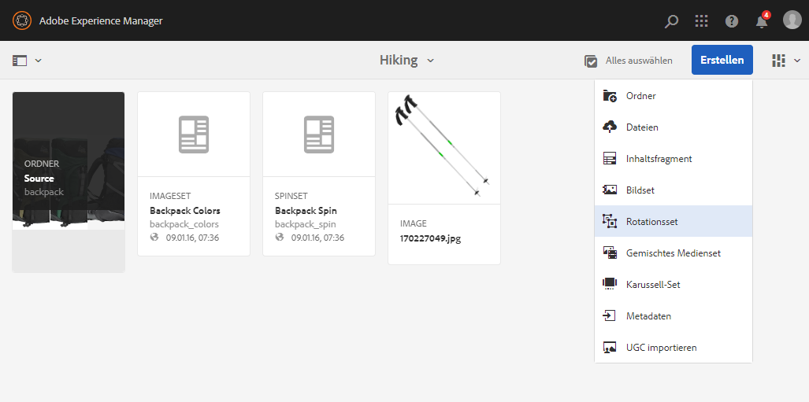
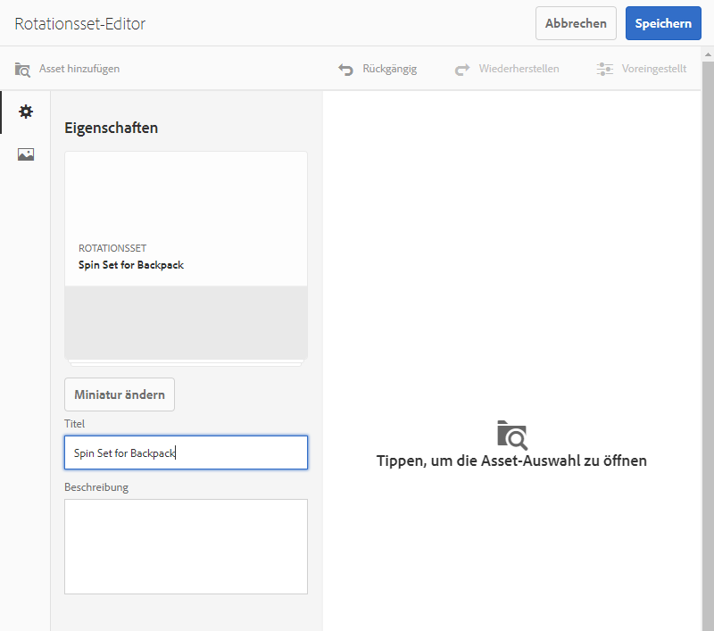
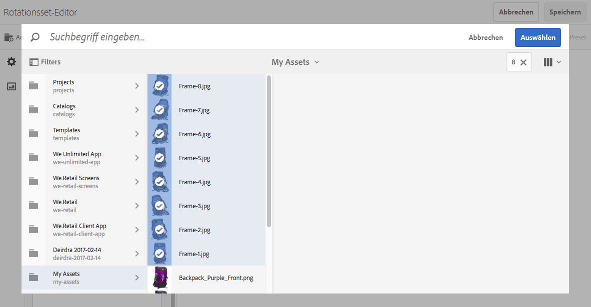
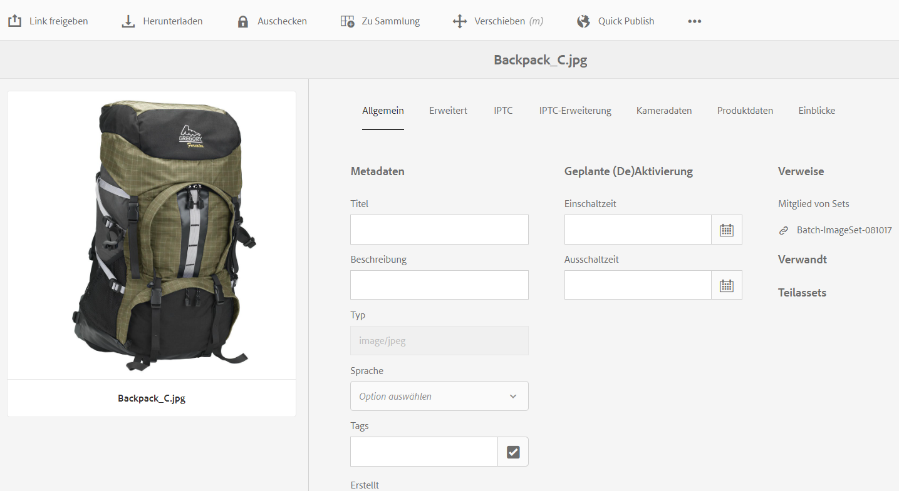

# Rotationssets{#spin-sets}

Ein Rotationsset simuliert das Drehen eines Gegenstands zur genaueren Untersuchung. Mit Rotationssets können Artikel aus jedem Winkel betrachtet werden, um die wesentlichen visuellen Details von allen Seiten sehen zu können.

Ein Rotationsset simuliert die 360-Grad-Anzeige. Dynamic Media bietet Rotationssets mit einer Achse, in denen ein Artikel gedreht werden kann. Darüber hinaus können Benutzer alle Ansichten mit nur wenigen Mausklicks frei zoomen und schwenken. So können Benutzer einen Artikel aus einem bestimmten Blickwinkel genauer untersuchen.

Rotationssets werden durch ein Banner mit dem Wort **[!UICONTROL SPINSET]** gekennzeichnet. Darüber hinaus wird bei veröffentlichten Rotationssets das Veröffentlichungsdatum (durch das **[!UICONTROL Welt]**-Symbol gekennzeichnet) zusammen mit dem Datum der letzten Änderung (durch das **[!UICONTROL Bleistift]**-Symbol gekennzeichnet) im Banner angezeigt.

>[!NOTE]
>
>Informationen zur Assets-Benutzeroberfläche finden Sie unter [Verwalten von Assets](/help/assets/manage-assets.md).

Beim Erstellen eines Rotationssets empfiehlt Adobe die folgenden Best Practices und erzwingt die folgende Beschränkung:

| Begrenzungstyp | Best Practice | Implementierte Beschränkung |
| --- | --- | --- |
| Maximale Anzahl von Zeilen/Spalten pro 2D-Satz | 12-18 Bilder pro Set | 1000 |

Siehe auch [Einschränkungen bei Dynamic Media](/help/assets/limitations.md).

## Schnellstart: Rotationssets {#quick-start-spin-sets}

Führen Sie die folgenden Schritte aus, um sich schnell mit der Arbeit mit Rotationssets vertraut zu machen:

1. [Laden Sie die Bilder für mehrere Ansichten hoch](#uploading-assets-for-spin-sets).

   Sie benötigen mindestens 8 bis 12 Aufnahmen eines Artikels für ein eindimensionales Rotationsset und 16 bis 24 Aufnahmen für ein zweidimensionales Rotationsset. Die Aufnahmen müssen in regelmäßigen Abständen gemacht werden, um den Eindruck zu erwecken, dass der Artikel gedreht wird. Beispiel: Wenn ein eindimensionales Rotationsset 12 Aufnahmen umfasst, drehen Sie den Artikel für jede Aufnahme um 30 Grad (360/12).

   Unter [Dynamic Media – Unterstützte Rasterbildformate](/help/assets/assets-formats.md#supported-raster-image-formats-dynamic-media) finden Sie eine Liste der Formate, die von Rotationssets unterstützt werden.

1. [Erstellen Sie Rotationssets](#creating-spin-sets).

   Zum Erstellen eines Rotationssets wählen Sie **[!UICONTROL Erstellen > Rotationsset]** und benennen Sie das Set, wählen Sie die Assets und wählen Sie die Reihenfolge der Bilder.

   Siehe [Arbeiten mit Selektoren](/help/assets/working-with-selectors.md).

   >[!NOTE]
   >
   >Sie können Rotationssets auch automatisch über [Stapelsatzvorgaben](/help/assets/config-dms7.md#creating-batch-set-presets-to-auto-generate-image-sets-and-spin-sets) erstellen. **Wichtig:** Stapelsätze werden vom IPS (Image Production System) im Rahmen der Asset-Aufnahme erstellt und sind nur im Scene7-Modus von Dynamic Media verfügbar.

1. Richten Sie [Rotationsset-Viewer-Vorgaben](/help/assets/managing-viewer-presets.md) nach Bedarf ein.

   Administratoren können Rotationsset-Viewer-Voreinstellungen erstellen oder ändern. Um das Rotationsset mit einer Viewer-Vorgabe anzuzeigen, wählen Sie das Rotationsset aus und Sie wählen im Dropdown-Menü der linken Seitenleiste die Option **Viewer**.

   Siehe **[!UICONTROL Instrumente]** > **[!UICONTROL Assets]** > **[!UICONTROL Viewer-Vorgaben]** , wenn Sie Viewer-Vorgaben erstellen oder bearbeiten möchten.

   Siehe [Hinzufügen und Bearbeiten von Viewer-Vorgaben](/help/assets/managing-viewer-presets.md).

1. [Anzeigen von Rotationssets](#viewing-spin-sets).

   Es gibt drei verschiedene Arten, über Stapelsatzvorgaben erstellte Sätze anzuzeigen und darauf zuzugreifen. (In der Benutzeroberfläche werden *keine* mit Stapelsatzvorgaben erstellten Sets angezeigt.)

1. [Zeigen Sie eine Vorschau der Rotationssets an](/help/assets/previewing-assets.md).

   Wählen Sie das Rotationsset aus, um dessen Vorschau anzuzeigen. Drehen Sie das Rotationsset. Sie können verschiedene Viewer aus dem Menü **[!UICONTROL Viewer]** wählen, das Sie links in der Leiste über die Dropdown-Liste aufrufen können.

1. [Veröffentlichen Sie Rotationssets](/help/assets/publishing-dynamicmedia-assets.md).

   Beim Veröffentlichen eines Rotationssets wird die URL- und Integrationszeichenfolge aktiviert. Außerdem müssen Sie [die Viewer-Vorgabe veröffentlichen](/help/assets/managing-viewer-presets.md).

1. [Verknüpfen von URLs mit einer Webanwendung](/help/assets/linking-urls-to-yourwebapplication.md) oder [Video- oder Bild-Viewer einbetten](/help/assets/embed-code.md).

   Adobe Experience Manager Assets erstellt URL-Aufrufe für Rotationssets und aktiviert diese, nachdem Sie die Rotationssets veröffentlicht haben. Sie können diese URLs während der Asset-Vorschau kopieren. Alternativ dazu können Sie sie in Ihre Website einbetten.

   Wählen Sie dazu das Rotationsset aus und klicken Sie dann im Dropdown-Menü in der linken Seitenleiste auf **[!UICONTROL Viewer]**.

   Siehe [Verknüpfen von Rotationssets mit Web-Seiten](/help/assets/linking-urls-to-yourwebapplication.md) und [Einbetten des Video- oder Bild-Viewers](/help/assets/embed-code.md).

Bei Bedarf können Sie die [Rotationssets bearbeiten](#editing-spin-sets). Darüber hinaus können Sie die [Eigenschaften von Rotationssets](/help/assets/manage-assets.md#editing-properties) anzeigen und ändern.

## Hochladen von Assets für Rotationssets {#uploading-assets-for-spin-sets}

Sie benötigen mindestens 8 bis 12 Aufnahmen eines Artikels für ein eindimensionales Rotationsset und 16 bis 24 Aufnahmen für ein zweidimensionales Rotationsset. Die Aufnahmen müssen in regelmäßigen Abständen gemacht werden, um den Eindruck zu erwecken, dass der Artikel gedreht wird. Beispiel: Wenn ein eindimensionales Rotationsset 12 Aufnahmen umfasst, drehen Sie den Artikel für jede Aufnahme um 30 Grad (360/12).

Bilder für Rotationssets können Sie [genauso wie alle anderen Assets in AEM Assets hochladen](/help/assets/manage-assets.md).

Unter [Dynamic Media – Unterstützte Rasterbildformate](/help/assets/assets-formats.md#supported-raster-image-formats-dynamic-media) finden Sie eine Liste der Formate, die von Rotationssets unterstützt werden.

### Richtlinien zum Erfassen von Bildern für ein Rotationsset {#guidelines-for-shooting-spin-set-images}

Im Folgenden finden Sie einige Best Practices für Rotationsset-Bilder. Im Allgemeinen gilt: Je mehr Bilder ein Rotationsset enthält, desto besser gelingt der Bildrotationseffekt. Wenn Sie aber zahlreiche Bilder in das Set aufnehmen, dauert es auch länger, bis die Bilder geladen werden. Adobe Experience Manager empfiehlt die folgenden Richtlinien für die Aufnahme von Bildern für Rotationssets:

* Verwenden Sie mindestens 8 bis 12 Bilder in einem eindimensionalen Rotationsset und 16 bis 24 Bilder in einem zweidimensionalen Rotationsset. Mindestens 8 Bilder sind erforderlich, um eine 360-Grad-Ansicht zu ermöglichen. Eindimensionale Rotationssets werden häufiger verwendet, da zweidimensionale Rotationssets sehr aufwendig zu erstellen sind.
* Verwenden Sie ein verlustfreies Format: TIFF und PNG werden empfohlen.
* Maskieren Sie alle Bilder so, dass der Artikel vor einem rein weißen oder kontrastreichen Hintergrund erscheint. Fügen Sie optional Schatten hinzu.
* Stellen Sie sicher, dass die Produktdetails gut beleuchtet und fokussiert sind.
* Denken Sie z. B. an Rotationsbilder für Bekleidung an einer Schaufensterpuppe oder einem Modell. Die Schaufensterpuppe ist häufig entweder maskiert (eine Schaufensterpuppe aus Glas) oder es wird eine stilisierte Schaufensterpuppe im Bild gezeigt. Sie können ein modellbezogenes Rotationsset erstellen, indem Sie die Anzahl der Winkel definieren. Markieren Sie jeden Winkel mit Klebeband auf dem Boden, um dem Modell anzugeben, einen Schritt zu machen und in die Richtung der jeweiligen Aufnahme zu schauen.

## Erstellen eines Rotationssets {#creating-spin-sets}

In diesem Abschnitt wird beschrieben, wie Sie ein Rotationsset in Experience Manager erstellen.

>[!NOTE]
>
>Sie können Rotationssets auch automatisch über [Stapelsatzvorgaben](/help/assets/config-dms7.md#creating-batch-set-presets-to-auto-generate-image-sets-and-spin-sets) erstellen. **Wichtig:** Stapelsätze werden vom IPS (Image Production System) im Rahmen der Asset-Aufnahme erstellt und sind nur im Scene7-Modus von Dynamic Media verfügbar.
>
>Siehe &quot;Erstellen von Stapelsatzvorgaben zum automatischen Erzeugen von Bild- und Rotationssets&quot;in [Konfigurieren des Dynamic Media-/Scene7-Modus](/help/assets/config-dms7.md#creating-batch-set-presets-to-auto-generate-image-sets-and-spin-sets).

>[!NOTE]
>
>Die Reihenfolge der Bilder in einem Rotationsset ist wichtig. Achten Sie darauf, sie so anzuordnen, dass die Rotation eine gleichmäßige 360-Grad-Ansicht ergibt.

Beim Erstellen eines Rotationssets empfiehlt Adobe die folgenden Best Practices und erzwingt die folgende Beschränkung:

| Begrenzungstyp | Best Practice | Implementierte Beschränkung |
| --- | --- | --- |
| Maximale Anzahl von Zeilen/Spalten pro 2D-Satz | 12-18 Bilder pro Set | 1000 |

Siehe auch [Einschränkungen bei Dynamic Media](/help/assets/limitations.md).

**So erstellen Sie ein Rotationsset:**

1. Navigieren Sie in Assets an die Stelle, an der Sie ein Rotationsset erstellen möchten, und wählen Sie **[!UICONTROL Erstellen]** und wählen Sie **[!UICONTROL Rotationsset]**. Sie können das Set auch in einem Ordner erstellen, der die gewünschten Assets enthält. Der Rotationsset-Editor wird angezeigt.

   

1. Geben Sie im Rotationsset-Editor im Feld **[!UICONTROL Titel]** einen Namen für das Rotationsset ein. Der Name wird im Banner über dem Rotationsset angezeigt. Geben Sie optional eine Beschreibung ein.

   

   >[!NOTE]
   >
   >Beim Erstellen des Rotationssets können Sie die Miniatur des Rotationssets ändern oder zulassen, dass Adobe Experience Manager die Miniatur automatisch basierend auf den Assets im Rotationsset auswählt. Um eine Miniatur auszuwählen, klicken Sie auf **[!UICONTROL Miniatur ändern]** und wählen Sie ein beliebiges Bild aus (Sie können auch zu anderen Ordnern gehen, um Bilder zu suchen). Wenn Sie eine Miniatur ausgewählt haben und möchten, dass Adobe Experience Manager eine Miniatur aus dem Rotationsset generiert, wählen Sie **[!UICONTROL Zu automatischer Miniatur wechseln]** aus.

1. Führen Sie eine der folgenden Aktionen aus:

   * Wählen Sie oben links auf der Seite des Rotationsset-Editors **[!UICONTROL Asset hinzufügen]** aus.

   * Wählen Sie in der Mitte des Rotationsset-Editors **[!UICONTROL Tippen, um die Asset-Auswahl zu öffnen]** aus.
   Tippen Sie, um die gewünschten Assets für das Rotationsset auszuwählen. Die ausgewählten Assets sind mit einem Häkchen versehen. Wenn Sie fertig sind, wählen Sie in der oberen rechten Ecke der Seite **[!UICONTROL Auswählen]**.

   Mit dem Asset-Selektor können Sie nach Assets suchen, indem Sie ein Keyword eingeben und auf **[!UICONTROL Eingabe]** tippen. Sie können auch Filter anwenden, um Ihre Suchergebnisse genauer abzustimmen. Sie können nach Pfad, Sammlung, Dateityp und Tag filtern. Wählen Sie den Filter und klicken Sie in der Symbolleiste auf das Symbol **[!UICONTROL Filter]**. Ändern Sie die Ansicht, indem Sie das Symbol „Ansicht“ tippen und dann **[!UICONTROL Spaltenansicht]**, **[!UICONTROL Kartenansicht]** oder **[!UICONTROL Listenansicht]** wählen.

   Siehe [Arbeiten mit Selektoren](/help/assets/working-with-selectors.md).

   

1. Assets, die Sie Ihrem Set hinzufügen, werden automatisch in alphanumerischer Reihenfolge hinzugefügt. Sie können die Anordnung oder Sortierung der Assets manuell ändern, nachdem sie hinzugefügt wurden.

   Ziehen Sie das Symbol zum Neuanordnen eines Assets ggf. rechts neben den Dateinamen des Assets, um Bilder in der Set-Liste nach oben oder unten zu bewegen.

   .

   Ordnen Sie Frame 11 im Rotationsset neu an, indem Sie ihn an eine neue Position ziehen.

1. (Optional) Führen Sie einen der folgenden Schritte aus:

   * Wenn Sie ein Bild löschen möchten, wählen Sie das Bild aus und klicken Sie auf **[!UICONTROL Asset löschen]**.

   * Wenn Sie eine Vorgabe anwenden möchten, wählen Sie oben rechts **[!UICONTROL Vorgabe]** aus. Wählen Sie anschließend eine Vorgabe aus, um sie auf alle Elemente gleichzeitig anzuwenden.

1. Wählen Sie **[!UICONTROL Speichern]** aus. Das neu erstellte Rotationsset wird in dem Ordner angezeigt, in dem es erstellt wurde.

## Anzeigen eines Rotationssets {#viewing-spin-sets}

Sie können Rotationssets in der Benutzeroberfläche oder automatisch über [Stapelsatzvorgaben](/help/assets/config-dms7.md#creating-batch-set-presets-to-auto-generate-image-sets-and-spin-sets) erstellen. Mit Stapelsatzvorgaben erstellte Sets werden jedoch *nicht* in der Benutzeroberfläche angezeigt. Sie haben drei Möglichkeiten, auf Sets zuzugreifen, die mit Stapelsatzvorgaben erstellt wurden. (Diese Methoden sind auch verfügbar, wenn Sie die Rotationssets in der Benutzeroberfläche erstellt haben.)

>[!NOTE]
>
>Sets können auch über die Benutzeroberfläche angezeigt werden, wie unter [Bearbeiten von Rotationssets](#editing-spin-sets) beschrieben.

**So zeigen Sie ein Rotationsset an:**

1. Beim Öffnen der Eigenschaften eines einzelnen Assets. Die Eigenschaften zeigen an, zu welchen Sets das ausgewählte Asset gehört (unter **[!UICONTROL Mitglied von Sets]**). Wählen Sie den Namen des Sets aus, damit Sie den gesamten Satz sehen können.

   

1. Von einem zugehörigen Bild eines beliebigen Sets. Wählen Sie das Menü **[!UICONTROL Sets]** aus, um die Sets anzuzeigen, denen das Asset angehört.

   

1. Über die Suche können Sie **[!UICONTROL Filter]** auswählen, dann **[!UICONTROL Dynamic Media]** erweitern und **[!UICONTROL Sets]** auswählen.

   Die Suche gibt als Ergebnis Sets zurück, die in der Benutzeroberfläche manuell oder mit Stapelsatzvorgaben automatisch erstellt wurden. Im Gegensatz zu Adobe Experience Manager-Suchen, die mit dem Suchkriterium `Contains` durchgeführt werden, wird die Suchabfrage für automatisierte Sets mithilfe des Suchkriteriums `Starts with` durchgeführt. Automatisierte Sets können nur durchsucht werden, wenn der Filter auf **[!UICONTROL Sets]** eingestellt ist.

   

## Bearbeiten eines Rotationssets {#editing-spin-sets}

Sie können mehrere Bearbeitungsaufgaben für Rotationssets ausführen, z. B. die folgenden:

* Fügen Sie dem Rotationsset Bilder hinzu.
* Ordnen Sie Bilder im Rotationsset neu an.
* Löschen Sie Assets im Rotationsset.
* Wenden Sie Viewer-Vorgaben an.
* Löschen Sie das Rotationsset.

**So bearbeiten Sie ein Rotationsset:**

1. Führen Sie einen der folgenden Schritte aus:

   * Zeigen Sie mit der Maus auf ein Rotationsset-Asset und wählen Sie **[!UICONTROL Bearbeiten]** (Stiftsymbol) aus.
   * Zeigen Sie mit der Maus auf ein Rotationsset-Asset und wählen Sie in der Symbolleiste **[!UICONTROL Auswählen]** (Häkchensymbol) aus und dann **[!UICONTROL Bearbeiten]**.

   * Wählen Sie ein Rotationsset-Asset aus und wählen Sie dann **[!UICONTROL Bearbeiten]** (Bleistiftsymbol) in der Symbolleiste.

1. Führen Sie zum Bearbeiten des Rotationssets einen der folgenden Schritte aus:

   * Ziehen Sie ein Bild, wenn Sie es an einer neuen Position anordnen möchten (zum Verschieben von Elementen wählen Sie das Symbol zum Neuanordnen).
   * Um Elemente in auf- oder absteigender Reihenfolge zu sortieren, klicken Sie auf die Spaltenüberschrift.
   * Zum Hinzufügen oder Aktualisieren eines vorhandenen Assets klicken Sie auf **[!UICONTROL Asset hinzufügen]**. Gehen Sie zu einem Asset, wählen Sie es aus und klicken Sie in der oberen rechten Ecke auf **[!UICONTROL Auswählen]**.
Wenn Sie das in Experience Manager als Miniatur verwendete Bild löschen und durch ein anderes ersetzen, wird das Original-Asset weiterhin angezeigt.
   * Um ein Asset zu löschen, wählen Sie es aus und wählen Sie **[!UICONTROL Asset löschen]**.
   * Um eine Vorgabe anzuwenden, klicken Sie auf das Symbol „Vorgabe“ und wählen Sie eine Vorgabe aus.
   * Navigieren Sie zum Löschen eines ganzen Rotationssets zu diesem Rotationsset, wählen Sie es aus und wählen Sie **[!UICONTROL Löschen]**.

   >[!NOTE]
   >
   >Sie können die Bilder in einem Rotationsset bearbeiten, indem Sie zu diesem Set gehen, in der linken Seitenleiste **[!UICONTROL Mitglieder des Sets]** auswählen und dann auf das Stiftsymbol eines einzelnen Assets klicken, um das Bearbeitungsfenster zu öffnen.

1. Klicken Sie auf **[!UICONTROL Speichern]**, wenn Sie mit der Bearbeitung fertig sind.

## Vorschau eines Rotationssets {#previewing-spin-sets}

Siehe [Anzeigen von Assets in der Vorschau](/help/assets/previewing-assets.md).

## Veröffentlichen eines Rotationssets {#publishing-spin-sets}

Siehe [Veröffentlichen von Assets](/help/assets/publishing-dynamicmedia-assets.md).
