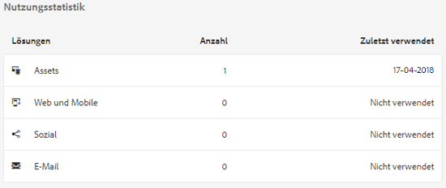

# Asset Insights {#asset-insights}

Mit der Funktion „Asset Insights“ können Sie Benutzerbewertungen und Nutzungsstatistiken von Bildern nachverfolgen, die auf Drittanbieter-Websites, in Marketingkampagnen und den Kreativlösungen von Adobe verwendet werden. Sie hilft, Erkenntnisse über ihre Leistung und Beliebtheit abzuleiten.

Assets Insights hält Details zu Benutzeraktivitäten wie Anzahl der Bildbewertungen, Klickraten und Impressionen (Häufigkeit des Ladens eines Bildes auf einer Website) fest. Basierend auf diesen Statistiken werden Bildern Bewertungen zugewiesen. Sie können Bewertungs- und Leistungsstatistiken nutzen, um beliebte Bilder für Kataloge, Marketing-Kampagnen usw. auszuwählen. Sie können außerdem Richtlinien zu Archivierungen und Lizenzerneuerungen anhand dieser Statistiken formulieren.

Damit Assets Insights Nutzungsstatistiken für Bilder von einer Website festhalten kann, müssen Sie den eingebetteten Code für das Bild im Website-Code einfügen.

Damit Asset Insights Nutzungsstatistiken für Assets anzeigen kann, konfigurieren Sie zunächst die Funktion für den Abruf von Berichtsdaten aus Adobe Analytics. Weitere Details finden Sie unter [Asset Insights konfigurieren](/help/assets/touch-ui-configuring-asset-insights.md).

>[!NOTE]
>
>Einblicke werden nur für Bilder unterstützt und bereitgestellt.

## Anzeigen von Statistiken für Bilder {#viewing-statistics-for-an-image}

Sie können die Asset Insights-Bewertungen über die Metadatenseite anzeigen.

1. From the Assets user interface (UI), select the image and then click **[!UICONTROL Properties]** from the toolbar.
1. Klicken Sie auf der Seite „Eigenschaften“ auf die Registerkarte **[!UICONTROL Statistiken]**.
1. Überprüfen Sie die Nutzungsdetails für das Asset auf der Registerkarte **[!UICONTROL Insights]**. Der Abschnitt **[!UICONTROL Bewertung]** beschreibt die gesamte Asset-Nutzung und die Leistungsbewertungen eines Assets.

   Die Nutzungsbewertung beschreibt, wie oft ein Asset in verschiedenen Lösungen verwendet wird.

   Die Bewertung **[!UICONTROL Impressionen]** beschreibt, wie oft das Asset auf der Website geladen wurde. Die unter **[!UICONTROL Klicks]** angezeigte Zahl beschreibt, wie oft Benutzer auf das Asset geklickt haben.

1. Im Abschnitt **[!UICONTROL Nutzungsstatistiken]** können Sie ermitteln, in welchen Elementen das Asset enthalten war und in welchen Kreativlösungen es vor Kurzem verwendet wurde. Je höher die Nutzung, desto größer ist die Wahrscheinlichkeit, dass das Asset bei Benutzern beliebt ist. Nutzungsdaten werden unter den folgenden Überschriften angezeigt:

   * **Asset**: Wie oft war das Asset Teil einer Sammlung oder eines zusammengesetzten Assets
   * **Web und Mobile**: Wie oft wurde das Asset in Websites und Apps verwendet
   * **Social**: Wie oft wurde das Asset in Lösungen wie Adobe Social und Adobe Campaign verwendet
   * **E-Mail**: Wie oft wurde das Asset in E-Mail-Kampagnen verwendet

   

   >[!NOTE]
   >
   >Da die Asset Insights-Funktion in der Regel die Lösungsdaten regelmäßig von Adobe Analytics abruft, werden im Abschnitt &quot;Lösungen&quot;möglicherweise nicht die neuesten Daten angezeigt. Der Zeitraum, für den die Daten angezeigt werden, hängt vom Zeitplan des Abholvorgangs ab, mit dem Asset Insights ausgeführt wird, um Daten aus Analytics abzurufen.

1. Um Leistungsstatistiken für das Asset für einen bestimmten Zeitraum grafisch anzuzeigen, wählen Sie den gewünschten Zeitraum im Abschnitt **[!UICONTROL Leistungsstatistiken]** aus. Details wie Klicks und Impressions werden als Trend-Linien eines Diagramms angezeigt.

   

   >[!NOTE]
   >
   >Im Gegensatz zu den Daten im Abschnitt „Lösungen“ zeigt der Abschnitt „Leistungsstatistiken“ die neuesten Daten an.

1. To obtain the embed code for the asset that you include in websites to gets performance data, click **[!UICONTROL Get Embed Code]** below the asset thumbnail. For more information on how to include your Embed code in third-party web pages, see [Using Page Tracker and embed code in web pages](/help/assets/touch-ui-using-page-tracker.md).

   

## Anzeigen von zusammengefassten Statistiken für Bilder {#viewing-aggregate-statistics-for-images}

Mit der **[!UICONTROL Insights-Ansicht]** können Sie Bewertungen aller Assets in einem Ordner gleichzeitig anzeigen.

1. Navigieren Sie in der Benutzeroberfläche &quot;Assets&quot;zu dem Ordner, der die Assets enthält, für die Sie Einblicke Ansicht wünschen.
1. Click Layout from the toolbar, and then choose **[!UICONTROL Insights View]**.
1. Die Seite zeigt die Nutzungsbewertungen für die Assets an. Vergleichen Sie die Bewertungen der verschiedenen Assets und ziehen Sie Ihre Erkenntnisse daraus.

## Planen von Hintergrundaufträgen {#scheduling-background-job}

Asset Insights ruft regelmäßig Nutzungsdaten für Assets aus den Adobe Analytics-Report Suites ab. Standardmäßig führt Asset Insights alle 24 Stunden um 2 Uhr Hintergrundjobs aus, um Daten abzurufen. Sie können jedoch die Häufigkeit und die Zeit ändern, indem Sie den Dienst **[!UICONTROL Adobe CQ DAM Asset Performance Report Sync Job]** von der Web-Konsole aus konfigurieren.

1. Click the Experience Manager logo, and go to **[!UICONTROL Tools]** > **[!UICONTROL Operations]** > **[!UICONTROL Web Console]**.
1. Öffnen Sie die Service-Konfiguration **[!UICONTROL Adobe CQ DAM Asset Performance Report Sync Job]**.

   

1. Geben Sie die gewünschte Terminplaner-Häufigkeit und Startzeit für den Auftrag im Eigenschaftsplanerausdruck ein. Speichern Sie die Änderungen.
