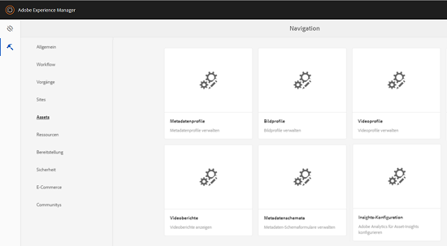

# Konfigurieren von Asset Insights {#configure-asset-insights}

[!DNL Adobe Experience Manager Assets] Ruft Nutzungsdaten zu digitalen Assets ab, die von Websites von Drittanbietern verwendet werden [!DNL Adobe Analytics]. Um Asset Insights zu aktivieren und diese Daten abzurufen und Statistiken zu erzeugen, konfigurieren Sie zuerst die Funktion zur Integration mit Adobe Analytics.

>[!NOTE]
>
>Einblicke werden nur für Bilder unterstützt und bereitgestellt.

1. In [!DNL Experience Manager], click **[!UICONTROL Tools]** > **[!UICONTROL Assets]**.

   

1. Klicken Sie auf die Karte **[!UICONTROL Insights-Konfiguration]**.
1. Wählen Sie im Assistenten ein Rechenzentrum aus und geben Sie Ihre Anmeldedaten an, z. B. den Namen Ihres Unternehmens, den Benutzernamen und gemeinsamen geheimen Schlüssel.

   

   *Abbildung: Konfigurieren[!DNL Adobe Analytics]für Assets Insights in[!DNL Experience Manager].*

1. Klicken Sie auf **[!UICONTROL Authentifizieren]**.
1. After [!DNL Experience Manager] authenticates your credentials, from the **[!UICONTROL Report Suite]** list, choose an [!DNL Adobe Analytics] report suite from where you want Asset Insights to fetch data. Klicken Sie auf **[!UICONTROL Hinzufügen]**.
1. After [!DNL Experience Manager] sets up your report suite, click **[!UICONTROL Done]**.

## Page tracker {#page-tracker}

After you configure your [!DNL Adobe Analytics] account, the Page Tracker code is generated for you. To enable Assets Insights to track [!DNL Experience Manager] assets used in third-party websites, include the page tracker code in the website code. Use the [!UICONTROL Page Tracker] utility in [!DNL Experience Manager Assets] to generate the page tracker code. For more information on how to include your Page Tracker code in third-party web pages, see [Use page tracker and embed code in web pages](/help/assets/touch-ui-using-page-tracker.md).

1. In [!DNL Experience Manager], click **[!UICONTROL Tools]** > **[!UICONTROL Assets]**.

   

1. Klicken Sie in der **[!UICONTROL Navigationsseite]** auf die Karte **[!UICONTROL Insights-Seitenverfolgung]**.
1. Klicken Sie auf **[!UICONTROL Herunterladen]**, um den Seitenverfolgungs-Code herunterzuladen.
